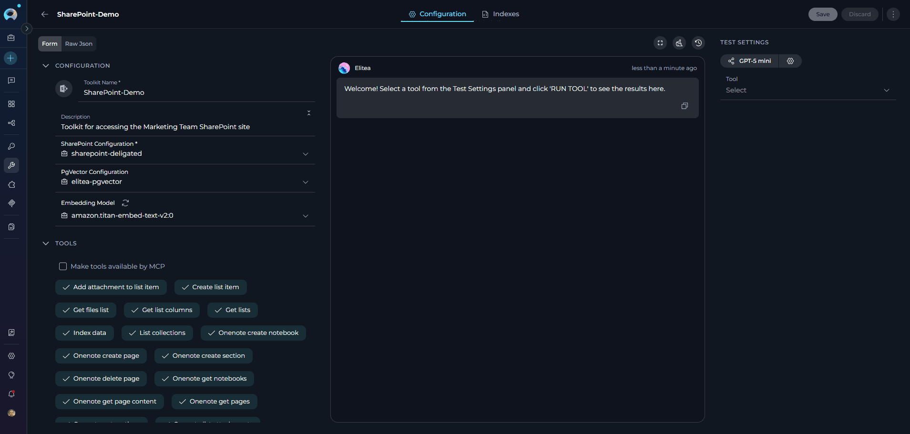
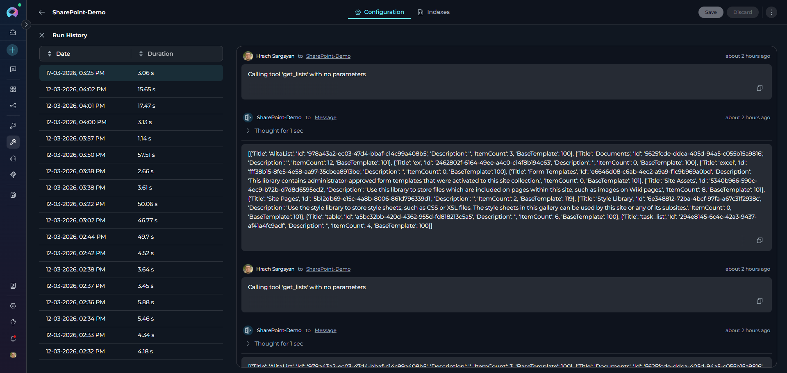
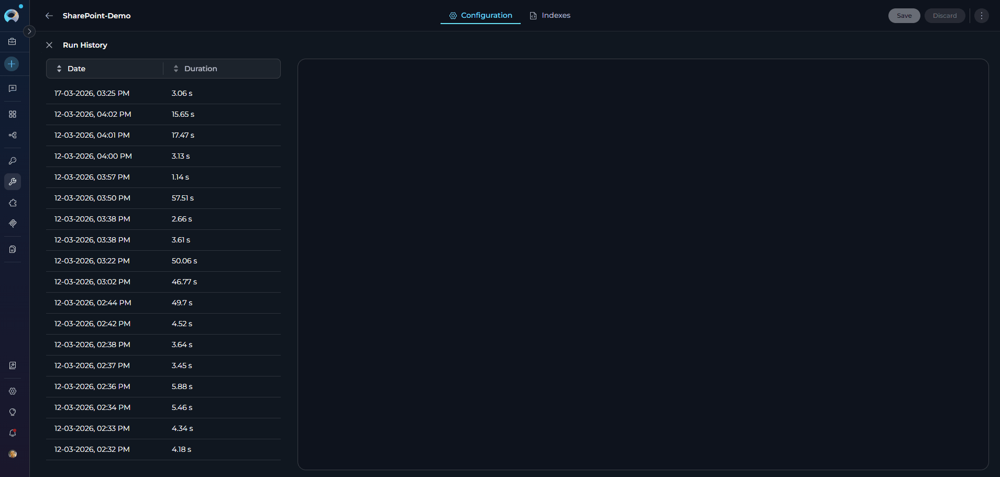
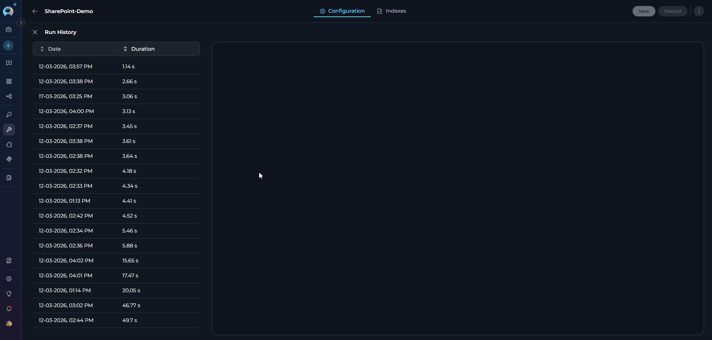
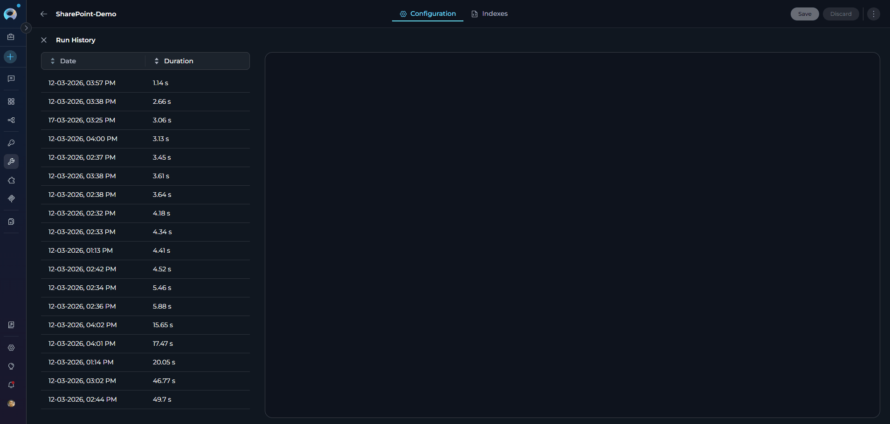

# Toolkit History Tab

## Overview

The **History Tab** is a feature within the Toolkit detail page that provides a comprehensive record of all toolkit execution runs. It enables users to track, review, and audit toolkit operations by displaying detailed information about each run, including execution parameters, timestamps, duration, and results.

The History Tab serves as a valuable auditing and troubleshooting tool, allowing teams to:

- Monitor toolkit usage patterns and frequency
- Review past executions with full input/output details
- Troubleshoot failures by examining error messages
- Verify successful operations and their results
- Track toolkit performance over time

---

## Prerequisites

### Access Requirements

- **Toolkit Access**: You must have access to a toolkit within your project
- **Project Membership**: You must be a member of the project containing the toolkit

### Toolkit Requirements

- **Any Toolkit Type**: History tracking is available for all toolkit types:
     - Custom Toolkits
     - Integration Toolkits (GitHub, Jira, Confluence, etc.)
     - MCP Servers (except MCPs do not have History tab)
     - Application Toolkits

!!! info "History Availability"
    The History tab appears automatically in the toolkit detail view for all supported toolkits. No additional configuration is required.

---

## Accessing the History Tab

1. **Open Toolkits Menu**: From the main navigation, click **Toolkits**
2. **Select a Toolkit**: Click on any toolkit from your toolkit list
3. **Open History Tab**: In the toolkit detail page, locate the horizontal tab bar and click the **History** tab (clock icon)

{ loading=lazy }

---

## Understanding the History View

The History Tab uses a **two-panel layout** for comprehensive run review:

{ loading=lazy }

**Left Panel: Run History List**

The left panel displays a sortable table titled **"Toolkit runs"** with the following columns:

| Column | Description | Sort Options |
|--------|-------------|--------------|
| **Date** | Execution date and time (format: `dd-MM-yyyy, hh:mm a`) | Chronological (ascending/descending) |
| **Duration** | Cumulative time for all toolkit tools used in the conversation (e.g., `2m 34s`, `45s`) | Duration length (shortest/longest) |

!!! note "Duration Calculation"
    Duration represents the **cumulative time** for all toolkit tool executions within a single conversation. If multiple tools from the same toolkit were used (e.g., Index Data, Search Index, List Collections), the duration shows the total time for all of them.

**Interaction:**

- **Sorting**: Click any column header to toggle sort order (ascending ↑ or descending ↓). Default: Date descending (most recent first)
- **Row Selection**: Click any row to view details in the right panel. Selected row is highlighted
- **Hover Actions**: Move mouse over a row to reveal action icons:
     - **Copy Link Icon**: Copy direct link to this specific run
     - **Delete Icon**: Remove run from history view

**Right Panel: Run Details**

The right panel displays comprehensive execution details for the selected run in **read-only format**. You cannot interact with or modify the displayed conversation.

**Displayed Information:**

- **User Input**: Original queries or commands
- **Tool Execution**: Tool names and parameters passed
- **Tool Output**: Results and data returned
- **Error Messages**: Detailed error information with stack traces
- **Timestamps**: Timing information for each step

---

## Using the History Tab

### Viewing Run Details

**To View a Run:**

1. **Select from List**: Click any row in the left panel run history table
2. **Details Load**: Right panel automatically displays the preserved conversation in read-only format
3. **Scroll Through Details**: Use the scroll bar to review all execution steps
4. **Read-Only Mode**: You cannot interact with or modify the displayed conversation

**What You'll See:**

- Complete conversation flow from input to output
- All toolkit tools executed during that conversation
- Parameters passed to each tool
- Results returned by tools
- Any errors encountered with stack traces

{ loading=lazy }

!!! note "Tracked Executions"
    The History tab tracks toolkit runs from:
    
    - **Run Tab**: Tool executions from the toolkit's Test Settings
    - **Indexes Tab**: Index Data, Search Index, and other indexing operations
    
    It does **not** track toolkit usage from:
    
    - Chat conversations (when you use a toolkit in a regular chat)
    - Agent or Pipeline executions (when a toolkit is used by an agent or pipeline)

### Sorting Run History

**Sort by Date:**

1. **Click Date Column Header**: Toggles between ascending and descending order
2. **Ascending** (oldest first): Earliest runs at top
3. **Descending** (newest first): Most recent runs at top (default)

**Sort by Duration:**

1. **Click Duration Column Header**: Toggles between shortest and longest
2. **Ascending** (shortest first): Fastest runs at top
3. **Descending** (longest first): Slowest runs at top

{ loading=lazy }

### Copying Run Links

Share specific run results with team members by copying direct links:

1. **Hover Over Run**: Move mouse over desired run row
2. **Copy Link Icon Appears**: Icon becomes visible on hover
3. **Click Copy Icon**: Link is copied to clipboard
4. **Share Link**: Paste link to share with team members

**Link Behavior:**

- Opens toolkit detail page with History tab active
- Automatically selects the specific run
- Displays run details in right panel
- Allows recipient to review exact execution results

{ loading=lazy }

### Deleting Run History

Remove individual runs from the history view:

!!! warning "Deletion Behavior"
    Deleting a run removes it from the History tab. This action cannot be undone.

**To Delete a Run:**

1. **Hover Over Run**: Move mouse over the run to delete
2. **Delete Icon Appears**: Red delete icon becomes visible
3. **Click Delete Icon**: Confirmation modal opens
4. **Confirm Deletion**: Click "Remove" to confirm
5. **Run Removed**: Row disappears from history table

{ loading=lazy }

---

## Common Use Cases

??? info "Debugging a Failed Run"

    **Scenario**: A toolkit operation produced unexpected results or failed to complete.

    **Steps**:

    1. Go to the History tab
    2. Find the failed run by date
    3. Select the run to view the execution details
    4. Review the details to identify:
       - What input triggered the issue
       - Which tool(s) failed
       - Any error messages or stack traces
       - Parameters that were passed
    5. Use this information to fix the toolkit configuration or input parameters

??? info "Performance Optimization"

    **Scenario**: You want to optimize your toolkit's execution time.

    **Steps**:

    1. Open the History tab
    2. Review the Duration column across multiple runs
    3. Identify runs that took longer than expected
    4. Select those runs to see what operations were performed
    5. Optimize the toolkit based on the longest-running operations

??? info "Verifying Toolkit Changes"

    **Scenario**: You updated your toolkit configuration and want to verify improvements.

    **Steps**:

    1. Make changes to your toolkit configuration
    2. Run the same test inputs on both the old and new configurations
    3. Go to the History tab
    4. Compare runs before and after the changes
    5. Verify that the new configuration produces better results

??? info "Audit and Compliance"

    **Scenario**: You need to provide evidence of what your toolkit processed.

    **Steps**:

    1. Navigate to the History tab
    2. Find the relevant run by date
    3. Review the complete execution details
    4. Use this as documentation for compliance or audit purposes

??? info "Learning and Training"

    **Scenario**: You want to understand how your toolkit handles different inputs.

    **Steps**:

    1. Review multiple runs in the History tab
    2. Study patterns in successful executions
    3. Identify common failure scenarios
    4. Use these insights to improve your toolkit's configuration or documentation

---

## Best Practices

??? tip "Regular Review"

    - **Check history periodically**: Review your toolkit runs regularly to catch issues early
    - **Monitor trends**: Track execution duration and frequency patterns over time
    - **Performance baseline**: Establish expected duration ranges for different toolkit operations

??? tip "Debugging Workflow"

    1. **Reproduce issues**: When a problem is reported, find the specific run in history first
    2. **Analyze context**: Review input parameters and error messages in detail
    3. **Test fixes**: After fixing, execute the toolkit and compare results in history
    4. **Document findings**: Use the history as documentation of issues and resolutions

??? tip "Data Management"

    - **Clean old runs**: Periodically delete runs that are no longer needed
    - **Keep important runs**: Don't delete runs that serve as examples or reference cases
    - **Share critical runs**: Use the copy link feature to share important findings with your team

??? tip "Performance Monitoring"

    - **Track duration trends**: Monitor if toolkit operations are getting slower over time
    - **Identify bottlenecks**: Use duration data to identify which tools need optimization
    - **Compare executions**: Review multiple runs to understand performance variations

??? tip "Security Considerations"

    - **Sensitive data**: Be aware that all input parameters and results are stored in run history
    - **Access control**: Ensure only authorized users can access toolkits with sensitive data
    - **Retention policy**: Consider establishing a policy for how long to retain run history

---

## Troubleshooting

??? warning "History Tab is Empty"

    **Possible Causes:**
    
    - No toolkit executions have been performed yet
    - All previous runs have been deleted
    - You're viewing a newly created toolkit
    
    **Solution:**
    
    1. Execute the toolkit from the **Run tab** using Test Settings
    2. Or use the toolkit in a chat conversation or agent
    3. Return to the History tab to see the new run
    4. If runs were deleted, they cannot be restored in the UI

??? warning "Cannot See Run Details in Right Panel"

    **Possible Causes:**
    
    - No run is currently selected
    - Run data failed to load due to network issues
    - Run details are still loading
    
    **Solution:**
    
    1. Click a run in the left panel list to select it
    2. Wait a moment for details to load
    3. If details don't appear, refresh the page
    4. Check your network connection
    5. Try selecting a different run to verify functionality

??? warning "Copy Link Feature Not Working"

    **Possible Causes:**
    
    - Clipboard permissions not granted
    - Browser security restrictions
    - Network connectivity issues
    
    **Solution:**
    
    1. Ensure your browser has clipboard access permissions
    2. Try hovering over the run again to reveal icons
    3. Click the copy icon and check for success notification
    4. Manually copy the URL from the address bar after selecting a run
    5. If using private/incognito mode, check browser permissions

??? warning "Delete Button Not Appearing"

    **Possible Causes:**
    
    - Not hovering over the run row correctly
    - Insufficient permissions
    - UI not fully loaded
    
    **Solution:**
    
    1. Move mouse pointer directly over the run row
    2. Wait briefly for hover state to activate
    3. Look for icons on the right side of the row
    4. Verify you have necessary permissions to delete runs
    5. Refresh the page if icons persist in not appearing

??? warning "Runs Not Sorted Correctly"

    **Possible Causes:**
    
    - Multiple clicks on sort header
    - Sort direction not clearly indicated
    - Cached data display issue
    
    **Solution:**
    
    1. Click the column header once to sort ascending
    2. Click again to sort descending
    3. Look for the arrow indicator showing current sort direction
    4. Refresh the page if sorting appears broken
    5. Try sorting by a different column first, then return

---

!!! info "Related Documentation"
    - [Creating and Managing Toolkits](../../menus/toolkits.md) - Learn how to create and configure toolkits
    - [Testing Toolkits](how-to-test-toolkit-tools.md) - Execute toolkit operations using Test Settings
    - [Agents and Pipelines History](../agents-pipelines/agents-pipelines-history.md) - Track agent and pipeline execution history
    - [Index History Tab](../indexing/using-indexes-tab-interface.md#reviewing-index-history) - Track indexing operations in the Indexes tab
