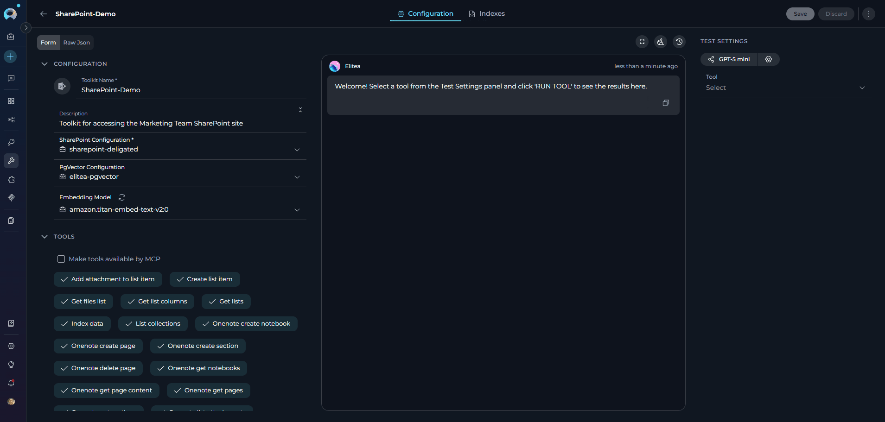
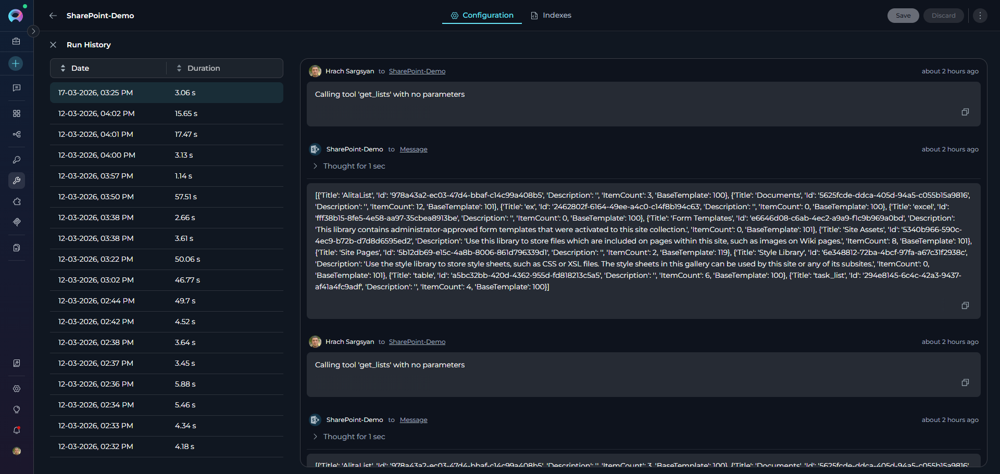
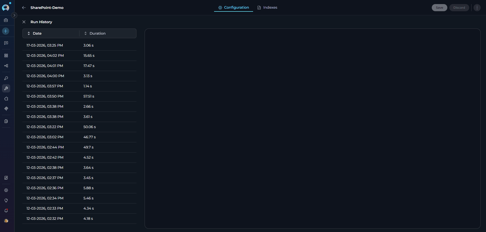
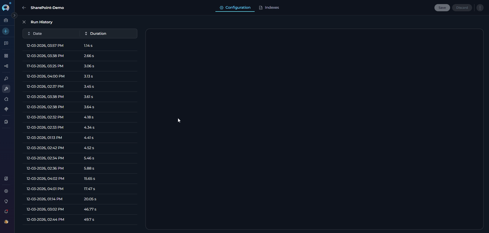
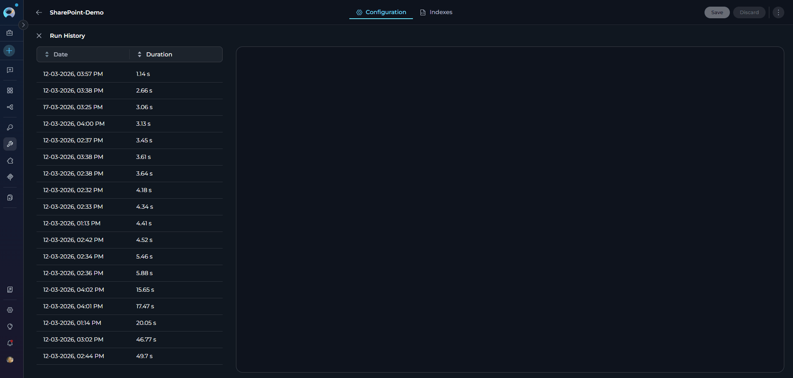

# Toolkit Run History

## Overview

The **Run History** panel is a feature within the Toolkit detail page that provides a comprehensive record of all toolkit execution runs. It enables users to track, review, and audit toolkit operations by displaying detailed information about each run, including execution parameters, timestamps, duration, and results.

The Run History panel serves as a valuable auditing and troubleshooting tool, allowing teams to:

- Monitor toolkit usage patterns and frequency
- Review past executions with full input/output details
- Troubleshoot failures by examining error messages
- Verify successful operations and their results
- Track toolkit performance over time

---

## Prerequisites

### Access Requirements

- **Toolkit Access**: You must have access to a toolkit within your project
- **Project Membership**: You must be a member of the project containing the toolkit

### Toolkit Requirements

- **Any Toolkit Type**: Run History is available for all toolkit types:
     - Custom Toolkits
     - Integration Toolkits (GitHub, Jira, Confluence, etc.)
     - MCP Servers
     - Application Toolkits

!!! info "History Availability"
    The Run History panel is accessible from the toolkit detail page for all supported toolkits. No additional configuration is required.

---

## Accessing Run History

1. **Open Toolkits Menu**: From the main navigation, click **Toolkits**
2. **Select a Toolkit**: Click on any toolkit from your toolkit list
3. **Open the Configuration page**: The toolkit detail page opens on the Configuration page by default
4. **Click the clock icon**: In the top bar of the **right panel** (Test Settings area), click the **clock icon** (🕐). The tooltip reads *"View run history"*
5. The two-column layout is replaced by the **Run History** panel. Click the **✕ (Close)** button to return to the Configuration page.

     { loading=lazy }

!!! tip "Right panel must be visible"
    The clock icon appears in the top bar of the Test Settings panel on the right side of the Configuration page. If the right panel is collapsed, expand it first using the collapse toggle button.

---

## Understanding the Run History View

The Run History panel replaces the Configuration page view and has a **two-panel layout**: a header bar at the top with a close button and "Run History" title, a left panel listing all past runs, and a right panel showing the selected conversation replay.

{ loading=lazy }

### Left Panel: Run History List

The left panel displays a sortable list of all toolkit runs with the following columns:

| Column | Description |
|--------|-------------|
| **Date** | Execution date and time (format: `dd-MM-yyyy, hh:mm AM/PM`) |
| **Duration** | Cumulative time for all toolkit tools used in the conversation (e.g., `2m 34s`, `45s`) |

!!! note "Duration Calculation"
    Duration represents the **cumulative time** for all toolkit tool executions within a single conversation. If multiple tools from the same toolkit were used (e.g., Index Data, Search Index, List Collections), the duration shows the total time for all of them.

!!! note "No Version column"
    The Version column is not shown for toolkits. Only Date and Duration are displayed.

**Features:**

- **Sorting**: Click any column header to toggle sort order (ascending ↑ or descending ↓). Default: Date descending (most recent first)
- **Selection**: Click any row to view details in the right panel. Selected row is highlighted
- **Infinite scroll**: Scroll to the bottom to automatically load more entries
- **Three-dot menu (⋮)**: Each row has a context menu available on hover with [run actions](#run-actions)

### Right Panel: Run Details

The right panel displays comprehensive execution details for the selected run in **read-only format**. You cannot interact with or modify the displayed conversation.

**Displayed Information:**

- **User Input**: Original queries or commands
- **Tool Execution**: Tool names and parameters passed
- **Tool Output**: Results and data returned
- **Error Messages**: Detailed error information with stack traces
- **Timestamps**: Timing information for each step

!!! info "Empty State"
    When no run is selected, the right panel remains empty. Select a run from the left panel to view its details.

### Run Actions

Each run row has a **three-dot menu (⋮)** that appears on hover, containing the following actions:

| Action | Description |
|--------|-------------|
| **Share link** | Copies a direct URL to this specific run to the clipboard. Opening the link automatically navigates to the Run History panel and selects that run. |
| **Delete** | Permanently removes this run record. A confirmation dialog titled "Remove run" appears before deletion. |

!!! warning "Permanent Deletion"
    Deleting a run is permanent and cannot be undone. Confirm carefully before removing any run record.

!!! note "No Restore conversation"
    The **Restore conversation** option is not available for Toolkits. It is only available for Agents and Pipelines.

---

## Using Run History

### Viewing Run Details

**To View a Run:**

1. Open Run History as described in [Accessing Run History](#accessing-run-history)
2. **Select from List**: Click any row in the left panel run history list
3. **Details Load**: Right panel automatically displays the preserved conversation in read-only format
4. **Scroll Through Details**: Use the scroll bar to review all execution steps
5. **Read-Only Mode**: You cannot interact with or modify the displayed conversation
6. Click **✕ (Close)** when done to return to the Configuration page

**What You'll See:**

- Complete conversation flow from input to output
- All toolkit tools executed during that conversation
- Parameters passed to each tool
- Results returned by tools
- Any errors encountered with stack traces

     { loading=lazy }

!!! note "Tracked Executions"
    The Run History panel tracks toolkit runs from:
    
    - **Test Settings** (right panel on the Configuration page): Tool executions performed interactively
    - **Indexes Tab**: Index Data, Search Index, and other indexing operations
    
    It does **not** track toolkit usage from:
    
    - Chat conversations (when you use a toolkit in a regular chat)
    - Agent or Pipeline executions (when a toolkit is used by an agent or pipeline)

### Sorting Run History

**Sort by Date:**

1. Click the **Date** column header to toggle ascending/descending order
2. **Ascending** (oldest first): Earliest runs appear at the top
3. **Descending** (newest first): Most recent runs at the top (default)

**Sort by Duration:**

1. Click the **Duration** column header to toggle ascending/descending order
2. **Ascending** (shortest first): Fastest runs appear at the top
3. **Descending** (longest first): Slowest runs appear at the top

     { loading=lazy }

### Copying Run Links

Share specific run results with team members by copying direct links:

1. **Locate Run**: Find the desired run in the run history list
2. **Hover Over Run**: Move your mouse over the run row to reveal the ⋮ menu
3. **Open Actions Menu**: Click the **⋮ (three-dot menu)** icon that appears
4. **Select Share link**: Click **Share link** from the menu options
5. A success toast confirms the link was copied to your clipboard
6. Share the link — when opened it navigates directly to the Run History panel with that run selected

     { loading=lazy }

### Deleting a Run

Remove individual runs from the history view:

!!! warning "Permanent Deletion"
    Deleting a run from history is permanent and cannot be undone. Make sure you want to remove the record before confirming.

**To Delete a Run:**

1. **Locate Run**: Find the run you want to delete in the run history list
2. **Hover Over Run**: Move your mouse over the run row to reveal the ⋮ menu
3. **Open Actions Menu**: Click the **⋮ (three-dot menu)** icon that appears
4. **Select Delete**: Click **Delete** from the menu options
5. **Confirm Deletion**: A confirmation dialog titled **"Remove run"** appears — click **Remove** to confirm
6. **Run Removed**: The row disappears from the history list

     { loading=lazy }

---

## Common Use Cases

??? info "Debugging a Failed Run"

    **Scenario**: A toolkit operation produced unexpected results or failed to complete.

    **Steps**:

    1. Open Run History via the **clock icon** (🕐) in the right panel
    2. Find the failed run by date
    3. Select the run to view the execution details
    4. Review the details to identify:
       - What input triggered the issue
       - Which tool(s) failed
       - Any error messages or stack traces
       - Parameters that were passed
    5. Use this information to fix the toolkit configuration or input parameters

??? info "Performance Optimization"

    **Scenario**: You want to optimize your toolkit's execution time.

    **Steps**:

    1. Open Run History via the **clock icon** (🕐) in the right panel
    2. Review the Duration column across multiple runs
    3. Click the **Duration** column header to sort by execution time
    4. Select the longest-running runs to see what operations were performed
    5. Optimize the toolkit based on the longest-running operations

??? info "Verifying Toolkit Changes"

    **Scenario**: You updated your toolkit configuration and want to verify improvements.

    **Steps**:

    1. Make changes to your toolkit configuration
    2. Run the same test inputs before and after the changes using Test Settings
    3. Open Run History via the **clock icon** (🕐) in the right panel
    4. Compare runs before and after the changes
    5. Verify that the new configuration produces better results

??? info "Audit and Compliance"

    **Scenario**: You need to provide evidence of what your toolkit processed.

    **Steps**:

    1. Open Run History via the **clock icon** (🕐) in the right panel
    2. Find the relevant run by date
    3. Review the complete execution details
    4. Use **Share link** from the ⋮ menu to save a direct URL to the run for documentation

??? info "Learning and Training"

    **Scenario**: You want to understand how your toolkit handles different inputs.

    **Steps**:

    1. Open Run History via the **clock icon** (🕐) in the right panel
    2. Review multiple runs in the list
    3. Study patterns in successful executions
    4. Identify common failure scenarios
    5. Use these insights to improve your toolkit's configuration or documentation

---

## Best Practices

??? tip "Regular Review"

    - **Check history periodically**: Click the clock icon (🕐) in the right panel regularly to review toolkit runs and catch issues early
    - **Monitor trends**: Track execution duration and frequency patterns over time
    - **Performance baseline**: Establish expected duration ranges for different toolkit operations

??? tip "Debugging Workflow"

    1. **Reproduce issues**: When a problem is reported, click the clock icon (🕐) and find the specific run in Run History first
    2. **Analyze context**: Review input parameters and error messages in detail
    3. **Test fixes**: After fixing, execute the toolkit and compare results in Run History
    4. **Document findings**: Use **Share link** from the ⋮ menu to save a direct URL to key runs as documentation

??? tip "Data Management"

    - **Clean old runs**: Periodically delete runs that are no longer needed
    - **Keep important runs**: Don't delete runs that serve as examples or reference cases
    - **Share critical runs**: Use the copy link feature to share important findings with your team

??? tip "Performance Monitoring"

    - **Track duration trends**: Monitor if toolkit operations are getting slower over time
    - **Identify bottlenecks**: Use duration data to identify which tools need optimization
    - **Compare executions**: Review multiple runs to understand performance variations

??? tip "Security Considerations"

    - **Sensitive data**: Be aware that all input parameters and results are stored in run history
    - **Access control**: Ensure only authorized users can access toolkits with sensitive data
    - **Retention policy**: Consider establishing a policy for how long to retain run history

---

## Troubleshooting

??? warning "Run History Panel Shows No Entries"

    **Possible Causes:**
    
    - No toolkit executions have been performed yet
    - All previous runs have been deleted
    - You're viewing a newly created toolkit
    
    **Solution:**
    
    1. Execute the toolkit from the **Test Settings** area (right panel on the Configuration page)
    2. Close the Run History panel (✕) and re-open it to refresh
    3. If runs were deleted, they cannot be restored in the UI

??? warning "Cannot See Run Details in Right Panel"

    **Possible Causes:**
    
    - No run is currently selected
    - Run data failed to load due to network issues
    - Run details are still loading
    
    **Solution:**
    
    1. Click a run in the left panel to select it
    2. Wait a moment for details to load
    3. If details don't appear, close (✕) and re-open Run History
    4. Check your network connection
    5. Try selecting a different run to verify functionality

??? warning "Copy Link Feature Not Working"

    **Possible Causes:**
    
    - Clipboard permissions not granted
    - Browser security restrictions
    
    **Solution:**
    
    1. Ensure your browser has clipboard access permissions
    2. Hover over the run row to reveal the **⋮ (three-dot menu)** icon
    3. Click the icon and select **Share link**
    4. Check for the success toast notification confirming the link was copied
    5. If using private/incognito mode, check browser clipboard permissions

??? warning "Delete Option Not Appearing"

    **Possible Causes:**
    
    - Not hovering over the run row
    - Insufficient permissions
    - UI not fully loaded
    
    **Solution:**
    
    1. Hover your mouse over the run row to reveal the **⋮ (three-dot menu)** icon
    2. Wait briefly for the icon to appear on the right side of the row
    3. Click the icon and look for **Delete** in the menu
    4. Verify you have the necessary permissions to delete runs
    5. Refresh the page if the menu doesn't appear

??? warning "Runs Not Sorted Correctly"

    **Possible Causes:**
    
    - Unexpected sort direction after multiple clicks
    - Cached data display issue
    
    **Solution:**
    
    1. Click the column header once to sort ascending
    2. Click again to sort descending
    3. Look for the arrow indicator (↑/↓) showing current sort direction
    4. Close (✕) and re-open Run History if sorting appears broken
    5. Try sorting by a different column first, then switch back

---

!!! info "Related Documentation"
    - [Creating and Managing Toolkits](../../menus/toolkits.md) - Learn how to create and configure toolkits
    - [Testing Toolkits](how-to-test-toolkit-tools.md) - Execute toolkit operations using Test Settings
    - [Agents and Pipelines History](../agents-pipelines/agents-pipelines-history.md) - Track agent and pipeline execution history
    - [Index History Tab](../indexing/using-indexes-tab-interface.md#reviewing-index-history) - Track indexing operations in the Indexes tab
