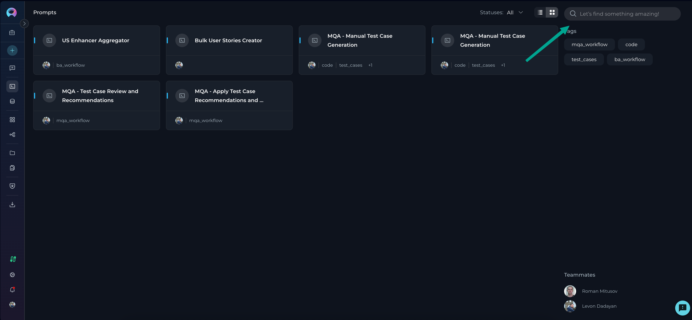

# ELITEA Search Functionality

Finding what you need quickly is essential. ELITEA's search functionality helps you locate your agents, pipelines, collections, toolkits, credentials, and MCPs efficiently. This guide will show you how to make the most of ELITEA's search capabilities.

## Search Overview

The search functionality in ELITEA is available across the following menus:

* [Agents](../../menus/agents.md)
* [Pipelines](../../menus/pipelines.md)
* [Collections](../../menus/collections.md)
* [Toolkits](../../menus/toolkits.md)
* [Credentials](../../menus/credentials.md)
* [MCPs](../../menus/mcps.md)

Whether you're in your **Private** workspace or any **Team** project, the search feature operates consistently, providing a unified experience throughout the platform.

## How Search Works

### Basic Search Functionality

ELITEA's search helps you quickly find entities by searching their names and descriptions. You can also filter results by selecting tags.

As you type in the search field (minimum 3 characters for full search), ELITEA shows matching results in a dropdown grouped by:

1. **Tags** - Tags matching your search term (appears on Agents, Pipelines, and Collections pages)
2. **Entity Type** - Entities matching your search term (Agents, Pipelines, Collections, Toolkits, Credentials, or MCPs depending on the page)

!!! tip "Quick Navigation"
    Click on an entity name in the dropdown to open it directly, saving you time.

### Search Process Step by Step

1. Click in the search field located in the right panel (placeholder text: "Let's find something amazing!")
2. Start typing your search term (results appear after a 500ms delay as you type)
3. As you type, matching results appear in a dropdown with sections:
     - **Tags** (on Agents, Pipelines, and Collections pages only)
     - **Entity Type** (Agents, Pipelines, Collections, Toolkits, Credentials, or MCPs depending on the current page)
4. You can either:
     - Click on a tag to add it as a filter chip
     - Click on an entity name to open it directly
     - Press Enter to execute the search and filter the current view

!!! note "Minimum Search Length"
    Search terms must be at least 3 letters long when you press Enter to perform a full search. If your search term is shorter, you'll see a message: "The search key word should be at least 3 letters long."

### Tag-Based Filtering

In addition to text search, you can filter by tags:

1. As you type, matching tags appear in the dropdown under the "Tags" section (on Agents, Pipelines, and Collections pages)
2. Click on a tag to add it as a filter chip in the search bar
3. Selected tags appear as removable chips (first tag shown fully, additional tags shown as "+N")
4. Click the "+N" chip to see all selected tags in an expanded view
5. Remove individual tags by clicking the × icon on each chip
6. Combine multiple tags to refine your search

!!! info "Tag Availability"
    Tag filtering is only available on Agents, Pipelines, and Collections pages. Toolkits, Credentials, and MCPs pages show only entity name results.

### Context-Aware Searching

Search respects your current context:

- **Menu-Specific** - Search only looks within the current menu (Agents, Pipelines, Collections, Toolkits, Credentials, or MCPs)

### Clearing Search Results

To clear your search results and return to the full view:

* Click the X icon in the search field (appears when you have a search term or selected tags)
* This will clear both the search text and all selected tag filters

## No Matching Results

If your search doesn't find any matching entities:

* While typing, the dropdown will show no items in the Tags or Entity Type sections
* When you execute a search (press Enter), the main view will display no results

## Search Tips and Best Practices

To make the most of ELITEA's search capabilities:

* **Wait for suggestions** - Search suggestions appear after a 500ms delay as you type, allowing you to see real-time results
* **Use specific terms** - The more distinctive your search term, the more precise your results
* **Leverage tag filtering** - On Agents, Pipelines, and Collections pages, add tags from the dropdown to refine your search
* **Combine multiple tags** - Select multiple tags to find entities that match all selected tags
* **Click for quick navigation** - Click entity names in the dropdown to open them directly
* **Use the search button** - Click the send icon or press Enter to execute the search and filter the main view
* **Check your context** - Remember that search only looks within your current menu and tab

## Summary

ELITEA's search functionality provides an intuitive way to locate your AI assets across the platform. The search bar appears in the right panel on Agents, Pipelines, Collections, Toolkits, Credentials, and MCPs pages, offering:

* Real-time search suggestions as you type
* Tag-based filtering (on Agents, Pipelines, and Collections)
* Quick navigation by clicking entity names
* Context-aware results based on your current page and tab

By mastering these search capabilities, you can quickly find exactly what you need and maintain an organized workspace.