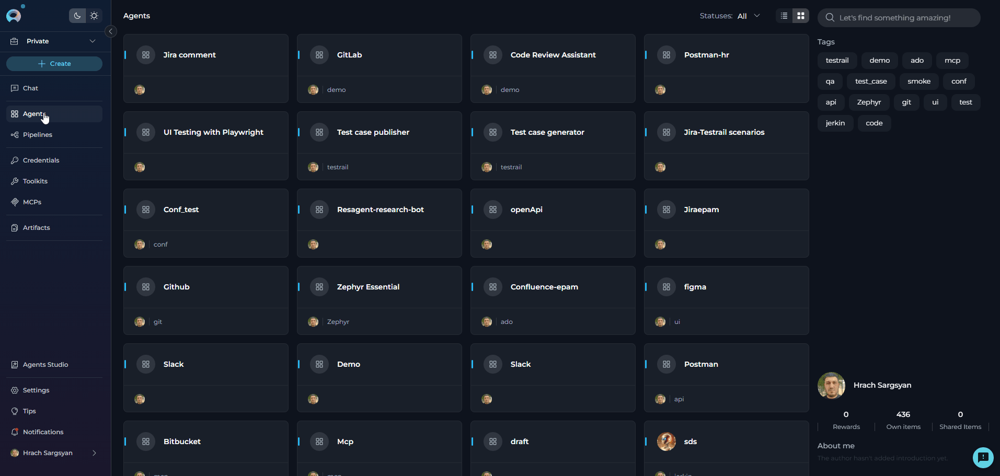
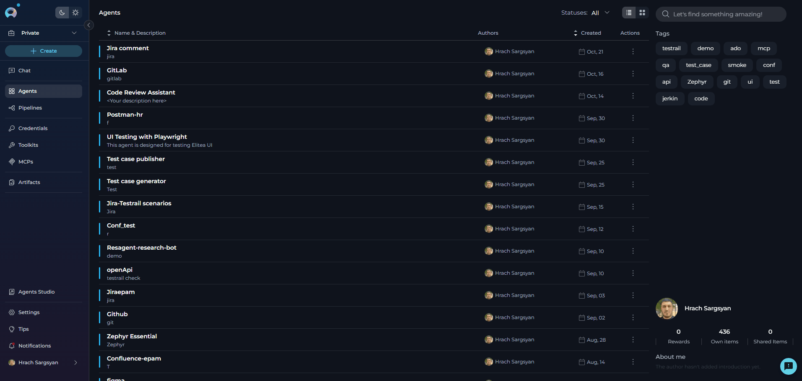
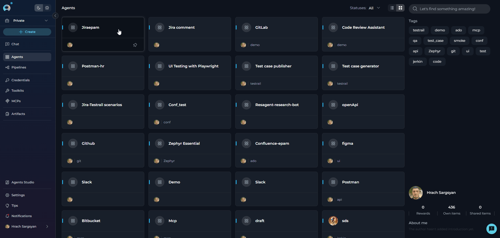

# Working with PINs

!!! warning "Migration from Collections"
    PINs replace the deprecated Collections feature. Pinned entities remain at the top of their respective lists across sessions, making it easy to access your most important resources without searching or scrolling.

PINs (Pinned Items) allow you to mark important entities and keep them at the top of your lists for quick access. This feature **replaces the deprecated Collections functionality**, providing a simpler and more efficient way to organize your frequently used resources.

**Supported Entity Types:**

- **Agents** - AI assistants and conversational agents
- **Pipelines** - Workflow automation sequences
- **Credentials** - Authentication and configuration settings
- **Toolkits** - Tool collections and integrations
- **MCPs** (Model Context Protocols) - Context management protocols

---

## Understanding PINs

PINs provide a simple toggle mechanism to keep frequently accessed entities at the top of your lists. Think of it like bookmarking your favorite items - one click to pin, one click to unpin.

**Purpose**

Use PINs to:

* **Quick access** - Keep frequently used entities at the top of lists
* **Organize workspace** - Prioritize entities for active projects
* **Reduce search time** - Eliminate scrolling through long entity lists
* **Maintain context** - Group related entities at the top temporarily
* **Improve workflow** - Access critical resources instantly

**Sorting Behavior**

When you pin entities, they follow a specific sorting order:

1. **Pinned entities** appear at the top of lists (in the order they were pinned)
2. **Newly created entities** appear immediately after pinned entities
3. **Unpinned entities** maintain their original sort order below pinned items

!!! note "Pin Order"
    Multiple entities can be pinned. They maintain the order in which they were pinned. To reorder, unpin and re-pin in your desired sequence.

---

## How to Pin Entities

The pinning process works the same way across all entity types: **Agents, Pipelines, Credentials, Toolkits, and MCPs**.

**📌Pin Icon Locations**

| View | Location | Access Method |
|------|----------|---------------|
| **Card View** | Bottom-left corner of card* | Click pin icon (appears on hover) |
| **Table View** | Name & Description column | Hover over entity row, click pin icon |
| **Detail View** | Toolbar** | Click pin icon |

!!! note "Detail View Pin Icon Location"
    The pin icon location in detail view varies by entity type:
    
    - **Agents & Pipelines**: Replaces "Add to collection" icon
    - **Toolkits & MCPs**: After "Copy link to clipboard" icon
    - **Credentials**: Before "Delete" icon

**Step-by-Step: Pinning an Entity**

=== "Card View"

    1. Navigate to the entity list (Agents, Pipelines, Credentials, Toolkits, or MCPs)
    2. Hover over the entity card you want to pin
    3. Click the **outlined pin icon** in the bottom-left corner
    4. The icon changes to **filled** and the entity moves to the top

    {width="600"}

=== "Table View"

    1. Navigate to the entity list and switch to table view
    2. Hover over the entity row you want to pin
    3. Click the **pin icon** that appears in the Name & Description column
    4. The entity immediately moves to the top

    {width="600"}

=== "Detail View"

    1. Open the entity's detail page
    2. Locate the **pin icon** in the toolbar
    3. Click the pin icon
    4. The entity is now pinned

    {width="600"}

**Unpinning Entities**

To unpin an entity, simply click the **filled pin icon** again. The process is identical across all views:

- **Card View**: Click the filled pin icon in the bottom-left corner
- **Table View**: Hover over the row and click the filled pin icon
- **Detail View**: Click the filled pin icon in the toolbar

The entity will immediately be unpinned and moved to appear after the pinned items in the list.
    

---

## Migrating from Collections

If you previously used Collections:

**Step 1: Identify**

- Review your frequently-used collections
- List entities you accessed regularly
- Note which entities you need quick access to

**Step 2: Pin**

- Navigate to each entity type
- Pin the entities you identified
- Verify they appear at the top of lists

### Key Differences

- **No collection creation needed**: Simply pin entities directly
- **No navigation required**: Pinned items are always visible at the top of lists
- **Simpler mental model**: "Pinned to top" vs. "Belongs to collection X"
- **Same location every time**: Consistent across all entity types
- **Personal organization**: Each user maintains their own pins

!!! warning "Collections Menu Deprecated"
    The Collections menu and "Add to collection" functionality are deprecated. Use the pin icon/button to achieve the same organizational benefits with less complexity.

---

## Best Practices

**Do's**

✔️ **Pin entities you access frequently** - Make the most of quick access  
✔️ **Keep pinned lists manageable** - Limit to 5-10 items per entity type  
✔️ **Review and update pins regularly** - Unpin items when no longer needed  
✔️ **Use pins for active projects** - Pin entities relevant to current work  
✔️ **Pin from any view** - Use card, table, or detail view based on preference  
✔️ **Unpin completed projects** - Keep lists current and relevant  

**Don'ts**

✘ **Don't pin everything** - Defeats the purpose of quick access  
✘ **Don't leave items pinned indefinitely** - Update as needs change  
✘ **Don't use pins as permanent organization** - Use for temporary quick access  
✘ **Don't forget to unpin** - Keep your pinned list current  
✘ **Don't pin more than 10 items** - Reduces effectiveness  

!!! tip "Weekly Review"
    Set aside time each week to review your pinned items. Unpin entities you haven't used recently and pin new ones you're actively working with. This keeps your workspace optimized.

---

## Frequently Asked examples

??? example "How many entities can I pin?"

    There is no hard limit on the number of entities you can pin. However, for optimal effectiveness, we recommend keeping pinned items to a manageable number (5-10 per entity type).

??? example "Are pinned items shared with my team?"

    No, pinned items are personal to your account. Each user maintains their own set of pinned entities.

??? example "Do pinned items persist across sessions?"

    Yes, pinned entities remain pinned when you log out and log back in. They persist until you manually unpin them.

??? example "Can I pin entities I don't own?"

    Yes, you can pin any entity you have access to, regardless of ownership. This includes public entities and entities shared with you.

??? example "What happens when I pin a newly created entity?"

    Newly created entities that are pinned will appear at the top of the pinned items list, following the standard pinning behavior.

??? example "Can I reorder my pinned items?"

    Pinned items appear in the order they were pinned. To change the order, you need to unpin and re-pin the entity in your desired sequence.

??? example "What's the difference between pinning in card view vs. table view?"

    The functionality is identical - only the access method differs. Card view uses the pin icon on the card, while table view uses the hover icon. Choose the view that matches your workflow.

??? example "What happened to the 'Add to collection' feature?"

    The Collections feature has been replaced by PINs. PINs provide a simpler, more efficient way to mark frequently used entities for quick access without the overhead of managing collections.

??? example "Can I see who else has pinned an entity?"

    No, pin states are personal and not shared. You cannot see which entities other users have pinned.

??? example "What happens to pinned items when I switch projects?"

    Pin states are maintained per project. When you switch projects, you'll see the pinned entities specific to that project.

??? example "Do pinned items affect other users' views?"

    No, pinning is personal to your account and doesn't affect how other users see or organize their entity lists.

??? example "Can I export my pinned items list?"

    Currently, there is no export function for pinned items. Pins are meant for quick access, not permanent organization.

---
