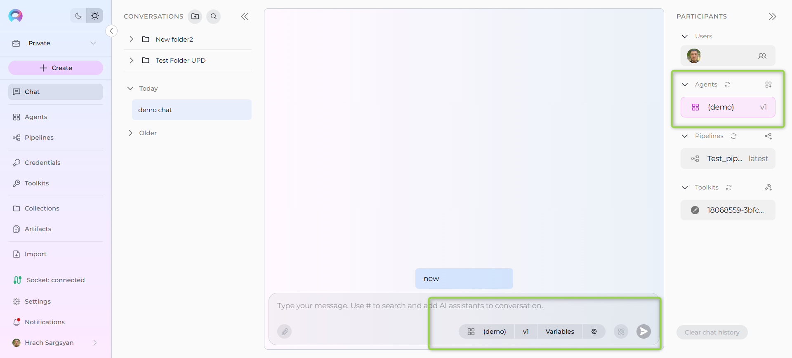
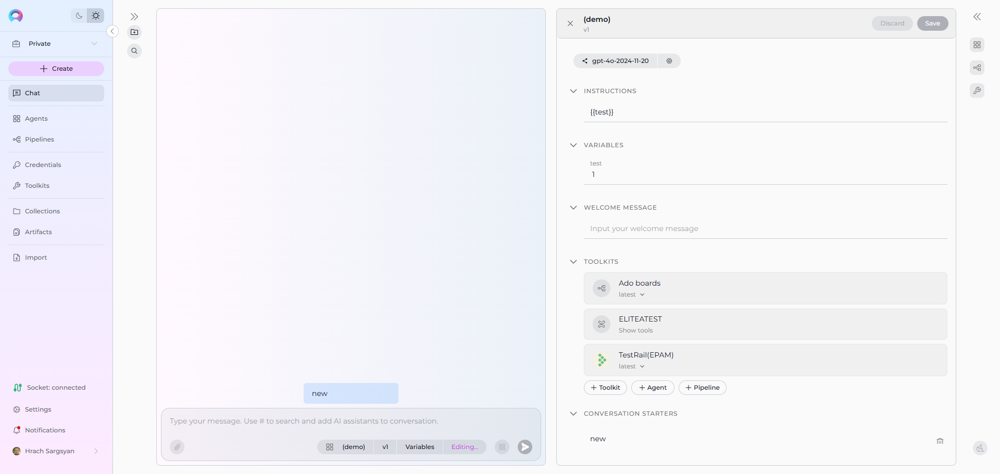
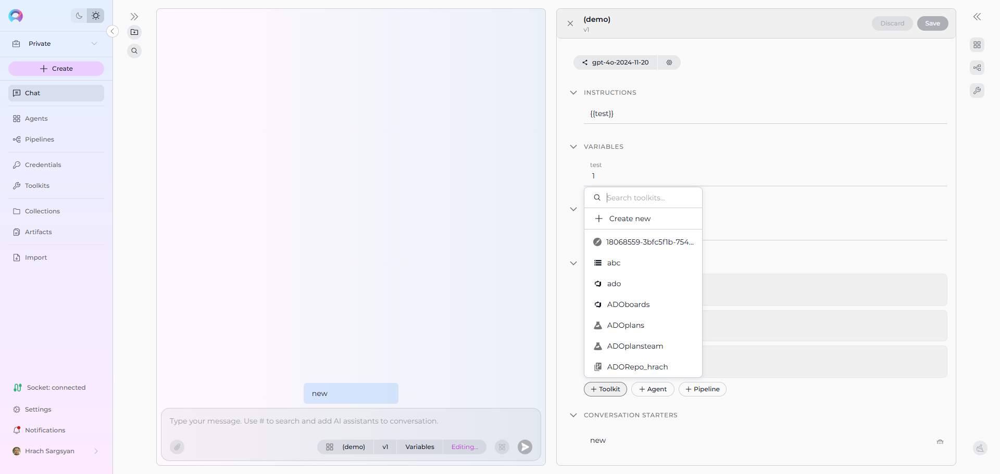
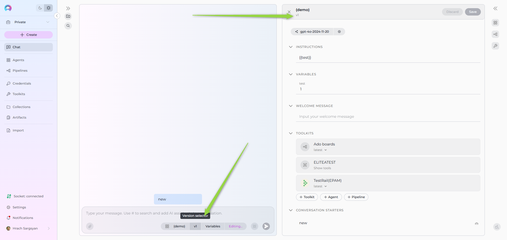

# How to Use Canvas for Agent and Pipeline Editing from Conversation

## Introduction

Canvas for Agent and Pipeline Editing is a powerful feature that allows you to modify agents and pipelines directly from within your conversations in ELITEA Chat. This eliminates the need to navigate away from your active conversation to make configuration changes, streamlining your workflow and maintaining conversation context.

Whether you're a developer fine-tuning agent instructions, a business analyst adjusting pipeline workflows, or a team lead managing toolkits, this feature provides seamless editing capabilities right where you need them most.

## In this guide, you will learn:
- How to access and activate Agent and Pipeline editing through Canvas
- Step-by-step instructions for editing agent and pipeline configurations from conversations  
- How to manage toolkits, versions, and variables from the conversation
- Available editing sections for both agents and pipelines
- Best practices for collaborative development
- Troubleshooting common editing scenarios

## What is Canvas Agent and Pipeline Editing?

Canvas Agent and Pipeline Editing extends the existing Canvas functionality to include live editing of agents and pipelines directly from conversations. This feature allows you to:

- **Edit any selected version** of an agent or pipeline without leaving the chat
- **Add toolkits, agents, or pipelines** to the selected agent/pipeline from Canvas  
- **Update agent/pipeline configurations** including prompts, instructions, settings, and parameters
- **Manage toolkit integrations** and dependencies seamlessly
- **Modify instructions and YAML**: Edit agent prompts or pipeline YAML workflows directly in the Instructions section

### Key Benefits:
- **Context Preservation**: Keep your conversation flow while making edits
- **Real-time Testing**: Test changes immediately within the same conversation
- **Collaborative Development**: Multiple team members can review and suggest edits
- **Version Management**: Edit specific versions while maintaining conversation history

!!! note "Important Notes"
    - Published versions of agents and pipelines are read-only and cannot be edited  
    - You must have `applications.update` permission to edit agents and pipelines
    - Canvas and Agent/Pipeline editors are mutually exclusive - opening one closes the other

## Step-by-Step Guide: Editing Agents and Pipelines from Conversation

### Step 1: Start a Conversation with an Agent or Pipeline

1. **Open ELITEA Chat** and start a new conversation
2. **Add an agent or pipeline** as a participant using one of these methods:
     - Click the participant selector and choose your agent/pipeline
     - Type `#` followed by the first letters of the entity name for quick search
     - Use the "Frequently Used" section for commonly accessed entities

3. **Verify the participant** is active and responding in your conversation

### Step 2: Access the Agent/Pipeline Editor

1. **Locate the Agent Editor Panel** in the conversation interface
     - Look for the participant's name and icon in the chat section
     - You'll see a button group with the participant name, version selector, and settings icon

2. **Check editing permissions**:
     - **Settings icon (⚙️)**: Available for editing if not disabled
     - **"Editing..." text**: Displayed when edit mode is active
     - **Disabled state**: Grayed out if you lack permissions or version is published

3. **Click the settings icon (⚙️)** to activate the editor
     - For agents: Opens the Agent configuration editor
     - For pipelines: Opens the Pipeline configuration editor with the same sections

### Step 3: Edit Configuration

When editing an agent or pipeline, you can modify various configuration aspects:

#### 3.1 Configuration Options (Available for both Agents and Pipelines)
- **Model Selection**: Choose from available LLM models in your project
- **LLM Settings**: Configure model parameters (Temperature, Top-p, Max Completion tokens)
- **Instructions**: 
  - For **Agents**: Edit the core instructions and prompts that define the agent's behavior
  - For **Pipelines**: Edit the YAML configuration that defines the pipeline workflow, nodes, transitions, and logic
- **Welcome message**: Set the message that appears when users first interact with the entity

#### 3.2 Toolkits
1. **View Current Toolkits**: See all currently attached toolkits and their configurations
2. **Add New Toolkits**:
     - Click **"+Toolkit"** to select from available toolkits or create new ones
     - Click **"+Agent"** to add other agents as toolkit components
     - Click **"+Pipeline"** to add pipelines as toolkit components
3. **Configure Toolkit Settings**: Open toolkit detailed page to adjust toolkit-specific parameters and credentials
4. **Remove Toolkits**: Detach toolkits that are no longer needed

### Step 4: Version and Variable Management

#### 4.1 Version Selection
  - **View Available Versions**: Use the version selector dropdown
  - **Switch Between Versions**: Select different versions to edit
  - **Version Status**: Understand published vs. draft status

#### 4.2 Variable Configuration
  - **Access Variables**: Click the "Variables" button in the editor panel
  - **Set Variable Values**: Configure dynamic variables for the current session
  - **Variable Scope**: Understand how variables affect conversation context
  - **Testing Variables**: Use variables to test different configuration scenarios

### Step 5: Save and Test Changes

#### 5.1 Saving Your Edits
  - **Save Frequently**: Use the save functionality to preserve changes
  - **Review Changes**: Verify all modifications are correct
  - **Validate Configuration**: Check for any configuration errors
  - **Version Management**: Decide whether to update current version or create new one

#### 5.2 Testing in Conversation
  - **Immediate Testing**: Test changes within the same conversation
  - **Conversation Flow**: Observe how changes affect ongoing conversation
  - **Error Handling**: Monitor for any execution errors or issues
  - **Iterative Improvement**: Make additional edits based on testing results

## Best Practices and Tips

### Configuration Management
  - **Start Small**: Make incremental changes rather than major overhauls
  - **Test Thoroughly**: Always test changes within the conversation 
  - **Document Changes**: Use conversation history to track what changes were made and why

### Collaboration
  - **Share Conversations**: Use conversation sharing to get team input on changes
  - **Clear Communication**: Document the purpose of changes in conversation messages

### Error Prevention
  - **YAML Validation**: Use the YAML Indentation Corrector for pipeline syntax issues
  - **Toolkit Dependencies**: Ensure all required toolkits are properly configured and accessible
  - **Permission Checks**: Verify you have necessary permissions before making changes

### Performance Optimization
  - **Monitor Execution**: Use Thinking Steps to understand performance implications of changes
  - **Optimize Toolkits**: Remove unused toolkits to improve agent/pipeline performance
  - **Efficient Workflows**: Design pipeline flows to minimize unnecessary steps
  - **Resource Management**: Consider resource implications of complex configurations

## Troubleshooting Common Issues

### Issue 1: Settings Icon is Disabled

**Problem**: The settings icon (⚙️) appears grayed out and cannot be clicked.

**Possible Causes & Solutions**:

  - **Published Version**: You're trying to edit a published version
    - *Solution*: Switch to a draft version or create a new version for editing
  - **Insufficient Permissions**: You lack `applications.update` permission
    - *Solution*: The system shows "Don't have permission to edit" - contact your administrator to request proper permissions

### Issue 2: Changes Not Saving Properly

**Problem**: Edits appear to save but aren't reflected in agent/pipeline behavior.

**Troubleshooting Steps**:

- **Refresh Conversation**: Start a new conversation to test changes
- **Version Check**: Verify you're editing the correct version
- **Toolkit Sync**: Ensure all toolkit dependencies are properly synchronized
- **Cache Clear**: Clear browser cache and reload the conversation
- **Error Logs**: Check conversation for any error messages

### Issue 3: YAML Syntax Errors in Pipeline Editor

**Problem**: Pipeline fails to save due to YAML formatting issues.

**Solutions**:

- **Use YAML Indentation Corrector**: Use the [YAML Indentation Corrector prompt](https://next.elitea.ai/alita_ui/1/prompts/all/31?viewMode=public) in ELITEA
- **Validate Structure**: Check that all required fields are present
- **Indentation Check**: Ensure consistent spacing and indentation
- **Reference Examples**: Compare with working pipeline examples in the documentation

### Issue 4: Toolkit Configuration Problems

**Problem**: Added toolkits not functioning properly in the edited agent/pipeline.

**Diagnostic Steps**:

- **Credential Verification**: Check that all required credentials are configured
- **Toolkit Version**: Ensure you're using compatible toolkit versions
- **Permission Scope**: Verify toolkit permissions match agent/pipeline requirements
- **Integration Testing**: Test toolkit functionality in isolation
- **Documentation Review**: Consult toolkit-specific integration guides

## Advanced Features

### Real-time Collaboration
  - **Shared Editing Sessions**: Multiple team members can review and suggest changes
  - **Comment Integration**: Use conversation messages to discuss specific changes
  - **Version Branching**: Create different versions for different team testing scenarios
  - **URL State Management**: The browser URL tracks which agent/pipeline is being edited, allowing for bookmarking and sharing of editing sessions

### Integration with Development Workflows
  - **CI/CD Pipeline Integration**: Use edited pipelines in automated deployment workflows
  - **Version Control**: Track agent/pipeline changes through conversation history
  - **Testing Automation**: Use conversation-based testing for agent/pipeline validation

### Performance Monitoring
  - **Execution Tracking**: Monitor agent/pipeline performance through Thinking Steps
  - **Resource Usage**: Track toolkit and resource utilization
  - **Error Analytics**: Analyze error patterns through conversation logs

## Conclusion

Canvas for Agent and Pipeline Editing revolutionizes how you develop and refine AI assistants in ELITEA. By enabling direct editing from conversations, you can maintain context, collaborate effectively, and iterate quickly on your agent and pipeline configurations.

This feature is particularly powerful for agile development environments where rapid prototyping, testing, and refinement are essential. Whether you're fine-tuning a single agent prompt or rebuilding complex pipeline workflows, Canvas provides the tools you need without disrupting your conversation flow.

Remember to follow best practices, test thoroughly, and leverage the collaborative aspects of conversation-based editing to create robust, effective AI solutions for your team and organization.

For additional support or advanced use cases, consult the linked resources or reach out to the [ELITEA support team](../support/contact-support.md).

---

!!! info "Related Documentation"
    - [Canvas Documentation](how-to-canvas.md) - Comprehensive guide to Canvas functionality
    - [Pipeline Agent Framework](../features/pipelines/pipeline-agent-framework.md) - Complete Pipeline development guide
    - [Agents Configuration](../menus/agents.md) - Agent management and configuration
    - [Toolkits Documentation](../menus/toolkits.md) - Toolkit integration and management
    - [Chat Functionality](how-to-use-chat-functionality.md) - ELITEA Chat feature guide
    - [Public Agents in Next](https://next.elitea.ai/alita_ui/agents/latest) - Community examples and inspiration
    - [YAML Indentation Corrector](https://next.elitea.ai/alita_ui/1/prompts/all/31?viewMode=public) - Automatic YAML formatting tool
    - [ELITEA Support](../support/contact-support.md) - Technical support and assistance
