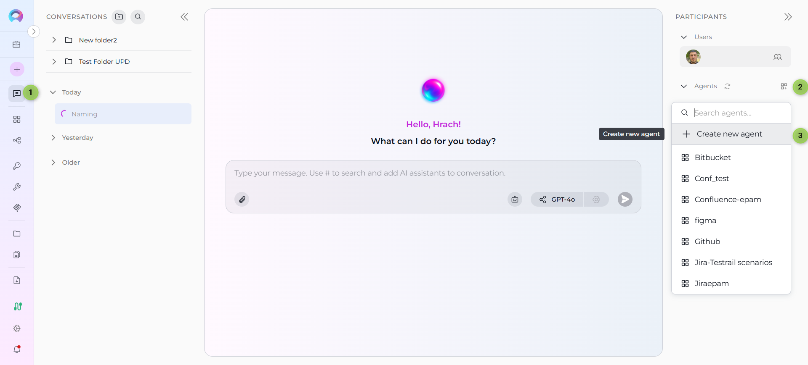
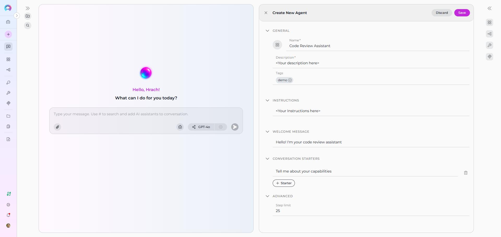
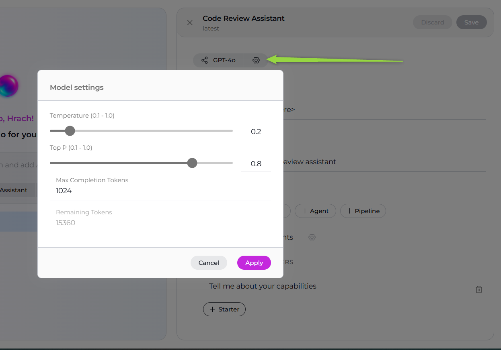
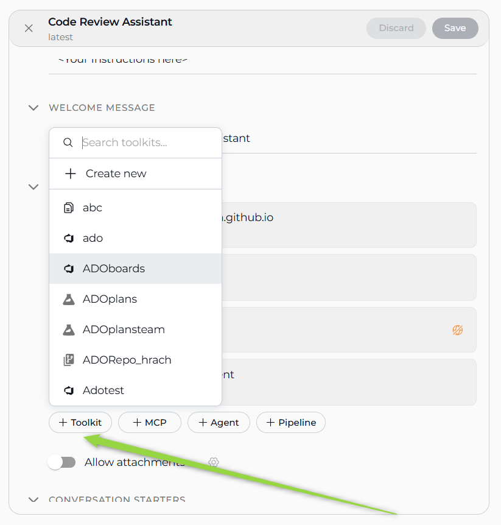
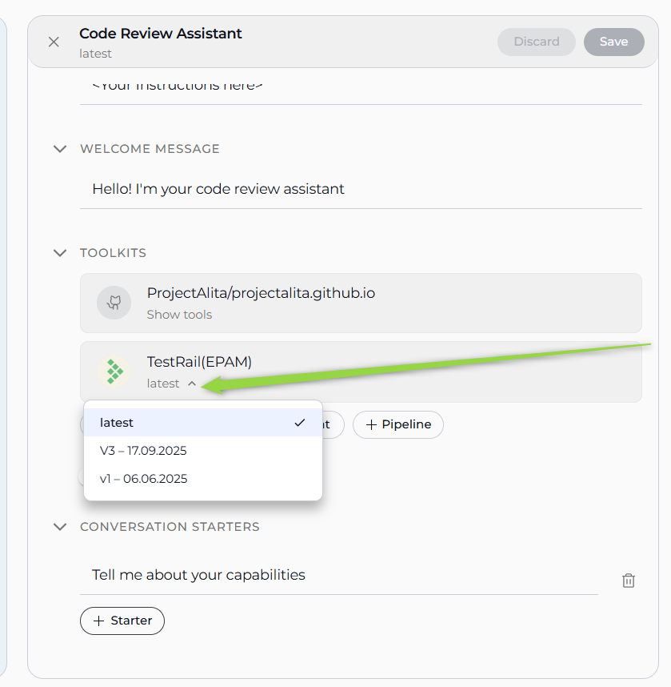
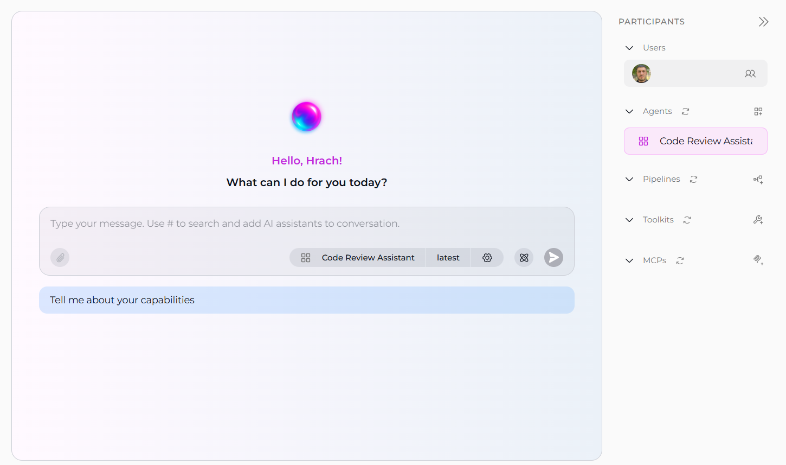
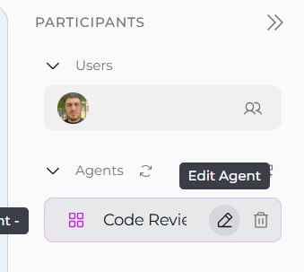
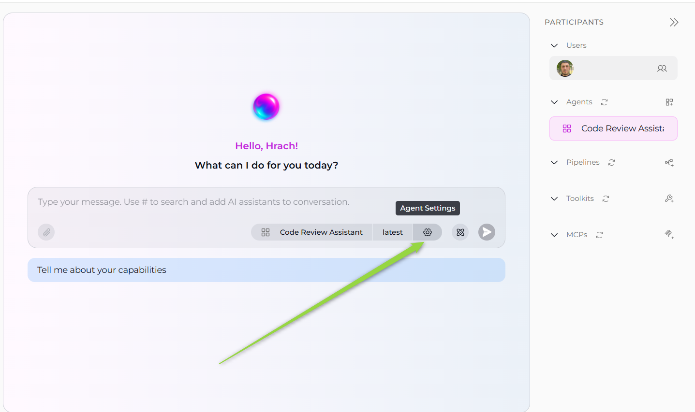
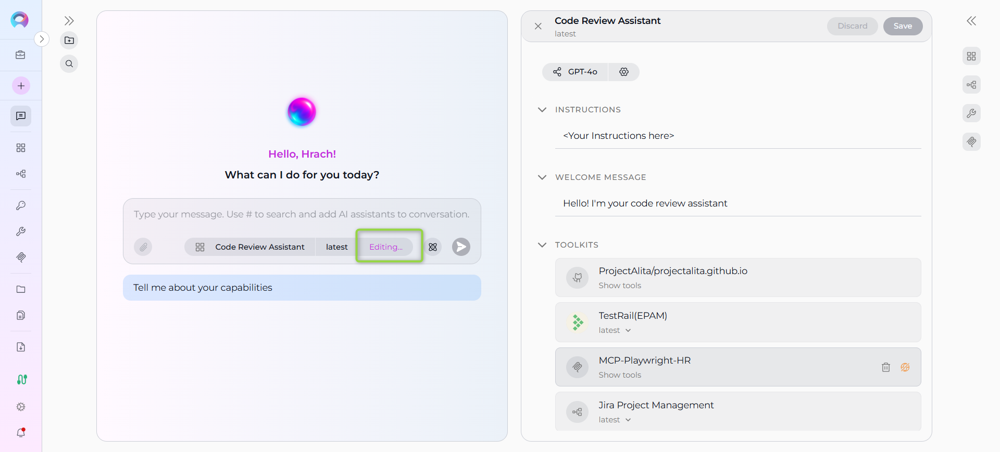

# How to Create and Edit Agents from Canvas

## Introduction

This user guide provides a comprehensive overview of the **Agent Canvas** feature in ELITEA and how to create, configure, and manage agents directly from the chat interface. The Agent Canvas enables streamlined agent management with an intuitive interface, enhancing productivity and collaboration across different AI assistant workflows.

## Agent Canvas Feature: Visual Agent Management

The **Agent Canvas** interface in ELITEA serves as an integrated agent management system accessible directly from the chat interface. This feature enables you to create, configure, and manage AI agents without leaving your conversation context, streamlining your development workflow.

**Key Aspects of the Agent Canvas Feature:**

* **Integrated Chat Experience:** Access agent management directly from the PARTICIPANTS section in chat, maintaining conversation context while managing AI assistants.
* **Visual Configuration Interface:** Use an intuitive canvas-based interface that simplifies agent configuration with clear visual elements and organized sections.
* **Real-time Validation:** Configuration fields are validated in real-time, ensuring proper setup before agent creation.
* **Instant Integration:** Created agents are immediately available for use in conversations and can be added to the PARTICIPANTS section.
* **Advanced Model Configuration:** Integration with ELITEA's LLM model management system for comprehensive AI model selection and fine-tuning.

## Creating Agents via Canvas Interface

### Step 1: Access the Agent Creation Canvas

1. Navigate to the **Chat** page (main sidebar menu).
2. In the **PARTICIPANTS** section, locate **Agents**.
3. Click on the **Create new agent** button.

The "Create New Agent" canvas interface will be displayed with all available configuration sections.

### Step 2: Configure General Information

The agent creation interface is organized into several collapsible sections. Start with the **GENERAL** section:

**Required Fields:**

- **Name*** (required): Enter a unique, descriptive name for your agent (e.g., "Code Review Assistant", "Documentation Helper")
- **Description*** (required): Provide a clear description of what your agent will do and its purpose
- **Tags** (optional): Add relevant tags by typing tag names to help organize and categorize your agents

### Step 3: Configure Agent Instructions

In the **INSTRUCTIONS** section, provide detailed guidelines that specify how your agent should behave and what tasks it should perform:

- **Example:** "You are a helpful AI assistant that reviews code for best practices. Always check for security issues, performance concerns, and code readability."

### Step 4: Configure Welcome Message (Optional)

In the **WELCOME MESSAGE** section, add a message that users see when they first interact with your agent

- **Example:** "Hello! I'm your code review assistant. Share your code and I'll help you identify improvements and best practices."

### Step 5: Set Up Conversation Starters (Optional)

In the **CONVERSATION STARTERS** section:

1. Click the **+ Starter** button to add conversation starters (maximum 4 starters allowed)
2. Enter helpful prompts that guide users on how to interact with your agent
3. Each starter has a delete (trash) icon for removal if needed
4. **Examples:**
   - "Tell me about your capabilities"
   - "How do I get started?"

### Step 6: Configure Advanced Settings (Optional)

In the **ADVANCED** section:

- **Step limit**: Set the maximum number of steps the agent can take (default: 25)
- This controls how many operations the agent can perform in a single conversation turn

!!! info "Note"
    Required fields are marked with an asterisk * and must be completed before the agent can be created.

### Step 7: Save Initial Configuration

Click the **Save** button to create your agent with the basic configuration. This will proceed to the advanced configuration interface where you can:

- Configure LLM model and settings
- Add toolkits, agents, pipelines, and MCP connections
- Set additional parameters

## Advanced Agent Configuration

After saving the initial configuration, the advanced configuration interface opens with additional sections:

### LLM Model and Settings Configuration

1. **Model Selection:**
    - Click the **Select LLM Model** button at the top of the interface
    - Choose from available LLM models in your project (e.g., "gpt-4o", "gpt-4o-mini")
    - The selected model will be displayed on the button

2. **Model Settings:**
    - Click the **Model Settings** button (gear icon) next to the model selector
    - Configure the following parameters:
       - **Temperature** (0.1-1.0): Controls creativity and randomness in responses
         - Lower values (0.1-0.3): More focused and deterministic responses
         - Higher values (0.7-1.0): More creative and varied responses
       - **Top P** (0.1-1.0): Controls diversity of word choices
       - **Max Completion Tokens**: Maximum length of the response (e.g., 4096)
    - Click **Apply** to save the model settings

### Toolkits Configuration

In the **TOOLKITS** section, you can enhance your agent's capabilities by adding various integrations:

1. **Adding Toolkits:**
    - Click **+ Toolkit** to select from available toolkits or create new ones
    - Browse and select toolkits like GitHub, Jira, Confluence, etc.

2. **Adding MCP Connections:**
    - Click **+ MCP** to add Model Context Protocol connections
    - Select from available MCP configurations
    - MCP connections appear in the toolkits list with proper status indicators

3. **Adding Nested Agents:**
    - Click **+ Agent** to add other agents as components
    - Select from existing agents in your project
    - Choose specific versions from the version dropdown
    - Nested agents enhance your main agent's capabilities

4. **Adding Pipelines:**
    - Click **+ Pipeline** to integrate pipeline workflows
    - Select from available pipelines in your project
    - Pipelines provide structured workflow capabilities to your agent

5. **Allow Attachments Toggle:**
    - Enable or disable file attachment support for the agent

### Step 8: Finalize Agent Creation

Once you have completed configuring your agent, click the **X** button to close the canvas interface. Your newly created agent will appear in the **PARTICIPANTS** section under **Agents** and becomes immediately available for use in conversations.

## Editing Agents via Canvas Interface

### Accessing Agent Edit Mode

There are two ways to access the agent edit mode:

1. From PARTICIPANTS Section
    -Navigate to the **Chat** page where the agent is available.
    - In the **PARTICIPANTS** section, locate **Agents**.
    - Find the agent you want to edit.
    - Hover over the agent to reveal action buttons.
    - Click the pencil **Edit** icon that appears.

2. From Chat Interface
    - When an agent is active in your conversation, click the **Agent Settings** button that appears in the chat interface.
    - This will open the agent configuration canvas directly.

The agent configuration canvas will open with current settings pre-populated.

### Modifying Agent Configuration

Once in edit mode, you can modify any configuration parameters to update your agent settings. The edit interface displays current settings pre-populated, allowing you to make changes to:

- **Instructions**: Modify the agent's behavior guidelines and task definitions
- **Welcome Message**: Change the initial message users see
- **Conversation Starters**: Add, remove, or modify starter prompts (maximum 4)
- **Advanced Settings**: Adjust step limits and other parameters
- **LLM Model and Settings**: Switch models or fine-tune model parameters (temperature, top-p, max tokens)
- **Toolkits and Integrations**: Add or remove toolkits, MCP connections, nested agents, and pipelines

For example, if you have an agent configured for code review, you can easily update the **Instructions** to include new coding standards, add additional **Toolkits** like Jira for issue tracking integration, Select another **LLM Model** and update **Model Settings**

 Changes are reflected immediately in the interface. After making your desired configuration changes, use the **Save** button located in the top right corner to apply your modifications. The updated configuration becomes immediately applied.

## Troubleshooting Common Issues

### Agent Creation Issues

**Missing Required Fields:**

- **Problem:** Save button remains disabled
- **Solution:** Review all fields marked with asterisk (*) and ensure they are completed
- **Verification:** Check that both Name and Description fields contain valid text

**Model Configuration Errors:**

- **Problem:** Agent creation fails due to model configuration issues
- **Solution:** Verify that a valid LLM model is selected and model settings are within acceptable ranges
- **Prevention:** Use default model settings initially, then customize as needed

### Agent Management Issues

**Edit Mode Access:**

- **Problem:** Cannot access edit mode for existing agent
- **Solution:** Verify you have appropriate permissions and the agent is not currently in use by other team members
- **Workaround:** Ensure no active operations are using the agent

**Configuration Validation:**

- **Problem:** Changes cannot be saved due to validation errors
- **Solution:** Review error messages and ensure all required fields maintain valid values
- **Resolution:** Check that external resources (models, toolkits) are still accessible

### PARTICIPANTS Section Issues

**Agent Not Appearing:**

- **Problem:** Created agent doesn't appear in PARTICIPANTS
- **Solution:** Refresh the interface or verify the agent was created in the correct workspace/project
- **Check:** Ensure you're viewing the correct project context

**Model Settings Not Applying:**

- **Problem:** Model configuration changes don't take effect
- **Solution:** Ensure you clicked "Apply" in the model settings dialog before closing
- **Prevention:** Always use the Apply button rather than just closing the settings dialog

## Conclusion

The Agent Canvas feature in ELITEA provides a powerful and intuitive way to manage AI agent creation and configuration directly from your chat interface. By following the practices outlined in this guide, you can effectively create, configure, and manage agents that enhance your development workflows and team collaboration.

**Key Benefits Recap:**

- **Streamlined Creation:** Create agents without leaving your conversation context
- **Visual Configuration:** Use intuitive canvas interface for easy setup
- **Real-time Integration:** Immediately use agents in your conversations
- **Advanced AI Configuration:** Leverage comprehensive LLM model management and fine-tuning
- **Team Collaboration:** Share and manage agents within team projects

!!! info "Related Documentation"
    For additional information and related functionality, refer to these helpful resources:

    - **[Agent Menu](../menus/agents.md)** - Complete reference for agent management and configuration options
    - **[Chat Menu](../menus/chat.md)** - Comprehensive guide to chat interface features and navigation
    - **[Credential Menu](../menus/credentials.md)** - Detailed instructions for managing authentication credentials
    - **[AI Configuration](../menus/settings/ai-configuration.md)** - Setup and configuration guide for AI models and settings
