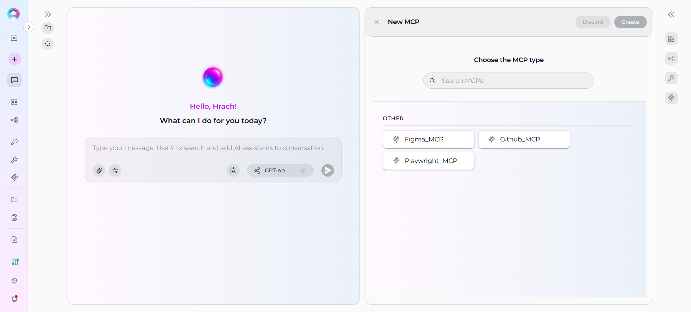
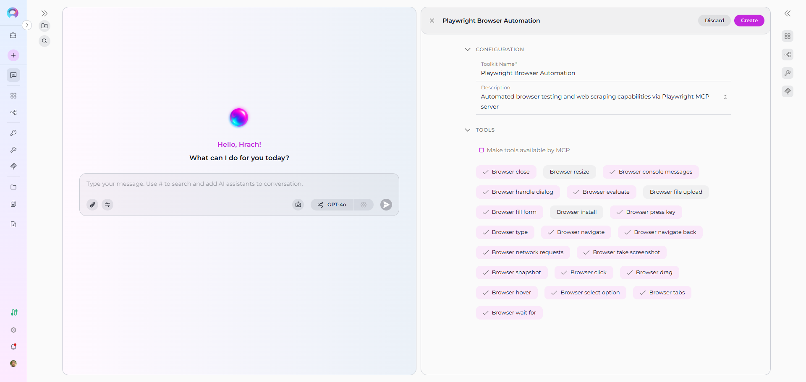
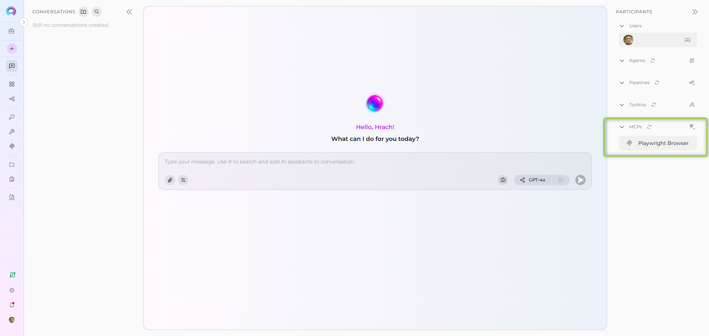
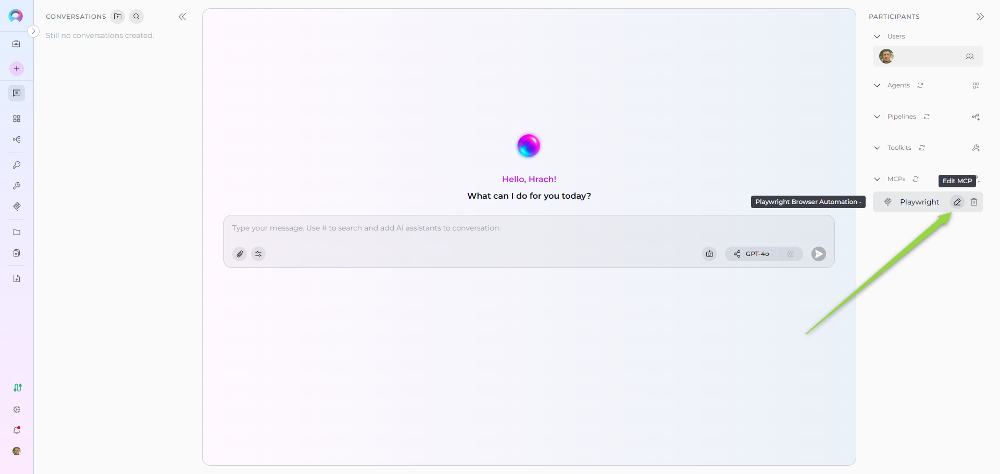

# How to Create and Edit MCPs from Canvas

## Introduction

This user guide provides a comprehensive overview of the **MCP Canvas** feature in ELITEA and how to create, configure, and manage Model Context Protocol (MCP) servers directly from the chat interface. The MCP Canvas enables streamlined MCP management with an intuitive interface, allowing you to connect external MCP servers and configure their tools for use with agents and pipelines.

## MCP Canvas Feature: External Server Integration

The **MCP Canvas** interface in ELITEA serves as an integrated MCP management system accessible directly from the chat interface. This feature enables you to create MCP entries, configure available tools, and manage connections to external MCP servers without leaving your conversation context.

**Key Aspects of the MCP Canvas Feature:**

* **Integrated Chat Experience:** Access MCP management directly from the PARTICIPANTS section in chat, maintaining conversation context while configuring external tools.
* **Dynamic Tool Discovery:** MCP tools are automatically discovered from connected MCP servers via the Elitea MCP Client.
* **Real-time Validation:** Configuration fields are validated in real-time, ensuring proper setup before MCP creation.
* **Instant Integration:** Created MCPs are immediately available for use in conversations and can be added to agents and pipelines.
* **Server Connection Management:** Connect to external MCP servers running locally or remotely through the Elitea MCP Client.

!!! info "Prerequisites"
    Before creating MCPs from canvas, ensure the **Elitea MCP Client** is installed and running with at least one MCP server configured. See the [MCP Client integration guide](../integrations/mcp/mcp-client.md) for setup instructions.

## Creating MCPs via Canvas Interface

### Step 1: Access the MCP Creation Canvas

1. Navigate to the **Chat** page (main sidebar menu).
2. In the **PARTICIPANTS** section, locate **MCP**.
3. Click on the **Create new MCP** button.


The "Create New MCP" canvas interface will be displayed showing available MCP server types discovered from your running Elitea MCP Client.

!!! warning "No MCP Types Available"
    If no MCP types appear, ensure the Elitea MCP Client is running and has connected MCP servers. The UI automatically discovers available MCP servers via real-time updates.

### Step 2: Select MCP Server Type

The MCP selection interface displays all available MCP servers discovered from your Elitea MCP Client connection:

1. **Browse Available MCPs:** View all connected MCP servers grouped by category
2. **Search MCPs:** Use the search box to filter by MCP server name
3. **Select MCP Type:** Click on the desired MCP server to begin configuration

Available MCP servers are dynamically loaded based on:

- Running MCP servers in your Elitea MCP Client configuration
- Active connection status to the ELITEA platform
- Project-specific MCP server availability

**Common MCP Server Types:**

- **Playwright:** Browser automation and testing
- **GitHub:** Repository and code management
- **Figma:** Design file access and manipulation
- **Custom MCP Servers:** Any MCP-compliant server configured in your client



### Step 3: Configure General Information

After selecting an MCP server type, configure the basic MCP settings:

**Required Fields:**

- **Name*** (required): Enter a descriptive name for your MCP connection (e.g., "Playwright Browser Automation", "GitHub Integration")
- **Description** (optional): Provide a clear description of what this MCP does and its purpose

**Example Configuration:**
```
Name: Playwright Browser Automation
Description: Automated browser testing and web scraping capabilities via Playwright MCP server
```

### Step 4: Configure MCP Tools

In the **TOOLS** section, select which tools from the MCP server you want to enable:

1. **Review Available Tools:** All tools exposed by the selected MCP server are listed
2. **Select Tools:** By default, all tools are selected. Uncheck any tools you don't want to expose
3. **Tool Descriptions:** Each tool shows its name and description from the MCP server

**Tool Selection Best Practices:**

- Enable only the tools you need (principle of least privilege)
- Review tool descriptions to understand their capabilities
- Some MCP servers may expose dozens of tools - select only relevant ones

**Examples of MCP Tools:**

- **Playwright MCP:** `navigate`, `click`, `type`, `screenshot`, `evaluate`, `wait_for`
- **GitHub MCP:** `create_issue`, `list_repositories`, `get_file_contents`, `create_pull_request`
- **Figma MCP:** `get_file`, `get_components`, `export_image`




### Step 5: Save MCP Configuration

Click the **Save** button to create your MCP connection.

**What Happens on Save:**

- MCP entry is created in your ELITEA project
- Selected tools are registered and become available
- Connection to the external MCP server is validated
- The canvas closes and you return to the chat interface
- Your newly created MCP appears in the **PARTICIPANTS** section under **MCP**



The MCP is immediately available for:

- Adding to agents (via **+ MCP** button in agent configuration)
- Adding to pipelines (via **+ MCP** button in pipeline configuration)
- Using directly in conversations

## Editing MCPs via Canvas Interface

### Accessing MCP Edit Mode

There are two ways to access the MCP edit mode:

1. **From PARTICIPANTS Section**

    - Navigate to the **Chat** page where the MCP is available.
    - In the **PARTICIPANTS** section, locate **MCP**.
    - Find the MCP you want to edit.
    - Hover over the MCP to reveal action buttons.
    - Click the pencil **Edit** icon that appears.



The MCP configuration canvas will open with current settings pre-populated.

### Modifying MCP Configuration

Once in edit mode, you can modify the following configuration parameters:

#### Basic Configuration Modifications:

- **Name**: Update the MCP connection name
- **Description**: Modify the purpose or scope description
- **Tools Selection**: Enable or disable specific tools from the MCP server
      - Add tools that were previously disabled
      - Remove tools that are no longer needed
      - Review updated tool lists if the MCP server has been upgraded

**Example Use Case:**
If you initially created a Playwright MCP with all tools enabled but later decide you only need navigation and screenshot capabilities:

1. Open the MCP in edit mode
2. Uncheck unnecessary tools (e.g., `type`, `click`, `evaluate`)
3. Keep only `navigate`, `screenshot`, and `wait_for`
4. Click **Save** to apply changes

Changes are reflected immediately in the interface. After making your desired configuration changes, use the **Save** button to apply your modifications.

!!! warning "Server Connection Required"
    Editing an MCP requires an active connection to the Elitea MCP Client and the corresponding MCP server. If the server is disconnected, tool discovery may be limited.

### Connection Status Management

When editing MCPs, you can monitor the connection status:

**Connection States:**
- **Connected** (Green): MCP server is reachable and tools are available
- **Disconnected** (Orange): MCP server is not accessible
     - Tools may not be discoverable
     - MCP cannot be used in conversations
     - Restart Elitea MCP Client to reconnect

**Reconnection Steps:**

1. Ensure Elitea MCP Client is running
2. Verify MCP server configuration in client
3. Refresh the MCP edit interface
4. Tools should populate automatically once connection is established


## Troubleshooting Common Issues

### MCP Creation Issues

**No MCP Types Available:**

- **Problem:** MCP type selector is empty
- **Solution:** Ensure Elitea MCP Client is installed and running
- **Verification Steps:**
      1. Check if `alita-mcp` tray application is running
      2. Verify MCP server configurations in client
      3. Confirm connection to ELITEA platform
      4. Refresh the MCP canvas interface

**Tools Not Discoverable:**

- **Problem:** MCP server selected but no tools appear
- **Solution:** Verify MCP server connection and restart if needed
- **Prevention:** Test MCP server connection before creating MCP entry

**Save Button Disabled:**

- **Problem:** Cannot save MCP configuration
- **Solution:** Review all fields marked with asterisk (*) and ensure they are completed
- **Verification:** Check that Name field contains valid text

### MCP Management Issues

**Edit Mode Access:**

- **Problem:** Cannot access edit mode for existing MCP
- **Solution:** 
      - Verify you have appropriate permissions
      - Ensure the MCP belongs to your current project
      - Check that you're not in a read-only view

**Connection Dropped:**

- **Problem:** MCP shows as disconnected in edit mode
- **Solution:** 
     1. Restart Elitea MCP Client tray application
     2. Verify MCP server is still configured
     3. Check network connectivity
     4. Refresh the MCP configuration

**Tools Missing After Edit:**

- **Problem:** Previously available tools no longer appear
- **Solution:**
     - Verify MCP server is still running
     - Check if MCP server configuration has changed
     - Ensure client connection is active
     - Tool list updates automatically when server reconnects

### PARTICIPANTS Section Issues

**MCP Not Appearing:**

- **Problem:** Created MCP doesn't appear in PARTICIPANTS
- **Solution:** Refresh the interface or verify the MCP was created in the correct project
- **Check:** Ensure you're viewing the correct project context

**Disconnected State in PARTICIPANTS:**

- **Problem:** MCP shows disconnected status
- **Solution:** 
     1. Start or restart Elitea MCP Client
     2. Verify MCP server configuration
     3. Check server is running and accessible
     4. Wait for automatic reconnection (may take a few seconds)

**Cannot Use MCP in Conversation:**

- **Problem:** MCP appears but cannot be added to conversation
- **Solution:**
     - Verify MCP is connected (green status)
     - Ensure at least one tool is enabled
     - Check that MCP server is responding to requests
     - Review MCP Client logs for errors

## Best Practices

### MCP Naming and Organization

- **Descriptive Names:** Use clear, specific names that indicate the MCP's purpose
     - ✅ Good: "Playwright Browser Testing"
     - ❌ Poor: "MCP1" or "Test"
- **Consistent Naming:** Follow a naming convention across all MCPs in your project
- **Include Server Type:** Consider including the MCP server type in the name for clarity

### Tool Selection

- **Principle of Least Privilege:** Enable only the tools you need
- **Review Periodically:** Audit enabled tools regularly and disable unused ones
- **Document Tool Usage:** Add descriptions explaining which tools are used and why
- **Test Before Production:** Verify selected tools work as expected before using in critical workflows

### Connection Management

- **Keep Client Running:** Ensure Elitea MCP Client runs continuously for best experience
- **Monitor Connection Status:** Regularly check MCP connection states
- **Update Servers:** Keep MCP servers updated to latest versions for new features
- **Backup Configurations:** Document MCP server configurations outside ELITEA

### Security Considerations

- **Limit Tool Access:** Only enable tools that are necessary for your use case
- **Review Permissions:** Understand what each tool can access and modify
- **Monitor Usage:** Track which agents and pipelines use each MCP
- **Secure Credentials:** Ensure MCP server credentials are properly secured in Elitea MCP Client

## Conclusion

The MCP Canvas feature in ELITEA provides a powerful and intuitive way to manage Model Context Protocol server connections directly from your chat interface. By following the practices outlined in this guide, you can effectively create, configure, and manage MCPs that extend your AI workflows with external tool capabilities.

**Key Benefits Recap:**

- **Streamlined Creation:** Create MCP connections without leaving your conversation context
- **Dynamic Discovery:** Automatically discover tools from connected MCP servers
- **Real-time Integration:** Immediately use MCPs in agents, pipelines, and conversations
- **Flexible Management:** Edit and update MCP configurations as needs change
- **Server Independence:** Connect to any MCP-compliant server through the Elitea MCP Client

**Next Steps:**

After creating MCPs from canvas, you can:

1. **Use in Chat Conversation:** Add the MCP directly to your current conversation from the PARTICIPANTS section
2. **Add to Agents:** Use the **+ MCP** button in agent configuration to attach MCP tools
3. **Add to Pipelines:** Include MCP tools in pipeline workflows
4. **Test Functionality:** Use the MCP test panel to validate tool functionality
5. **Monitor Usage:** Track how MCPs are being used across your project

!!! info "Related Documentation"
    For additional information and related functionality, refer to these helpful resources:

    - **[MCP Menu](../menus/mcps.md)** - Complete reference for MCP management and testing options
    - **[MCP Client Integration](../integrations/mcp/mcp-client.md)** - Setup and configuration guide for Elitea MCP Client
    - **[Configure and Use MCP Servers](../getting-started/configure-and-use-mcp.md)** - Quick start guide for MCP setup
    - **[Chat Menu](../menus/chat.md)** - Comprehensive guide to chat interface features and navigation
