# How to Create and Edit Pipelines from Canvas

## Introduction

This user guide provides a comprehensive overview of the **Pipeline Canvas** feature in ELITEA and how to create, configure, and manage pipelines directly from the chat interface. The Pipeline Canvas enables streamlined pipeline management with an intuitive interface, enhancing productivity and collaboration across different AI workflow scenarios.

## Pipeline Canvas Feature: Visual Pipeline Management

The **Pipeline Canvas** interface in ELITEA serves as an integrated pipeline management system accessible directly from the chat interface. This feature enables you to create, configure, and manage AI pipelines without leaving your conversation context, streamlining your development workflow.

**Key Aspects of the Pipeline Canvas Feature:**

* **Integrated Chat Experience:** Access pipeline management directly from the PARTICIPANTS section in chat, maintaining conversation context while managing AI workflows.
* **Dual-Mode Configuration:** Use both Configuration mode for general settings and Flow Editor mode for visual workflow design.
* **Real-time Validation:** Configuration fields are validated in real-time, ensuring proper setup before pipeline creation.
* **Instant Integration:** Created pipelines are immediately available for use in conversations and can be added to the PARTICIPANTS section.
* **Advanced Model Configuration:** Integration with ELITEA's LLM model management system for comprehensive AI model selection and fine-tuning.

## Creating Pipelines via Canvas Interface

### Step 1: Access the Pipeline Creation Canvas

1. Navigate to the **Chat** page (main sidebar menu).
2. In the **PARTICIPANTS** section, locate **Pipelines**.
3. Click on the **Create new pipeline** button.

The "Create New Pipeline" canvas interface will be displayed with all available configuration sections.

### Step 2: Configure General Information

The pipeline creation interface is organized into two main tabs: **Configuration** and **Flow editor**. Start with the **Configuration** tab:

**Required Fields:**

- **Name*** (required): Enter a unique, descriptive name for your pipeline (e.g., "Content Review Workflow", "Data Processing Pipeline")
- **Description*** (required): Provide a clear description of what your pipeline will do and its purpose
- **Tags** (optional): Add relevant tags by typing tag names to help organize and categorize your pipelines

### Step 3:: Configure Welcome Message (Optional)

In the **WELCOME MESSAGE** section, add a message that users see when they first interact with your pipeline:

- **Example:** "Hello! I'm your content review pipeline. I'll help you process and validate your content through multiple review stages."

### Step 4: Set Up Conversation Starters (Optional)

In the **CONVERSATION STARTERS** section:

1. Click the **+ Starter** button to add conversation starters (maximum 4 starters allowed)
2. Enter helpful prompts that guide users on how to interact with your pipeline
3. Each starter has a delete (trash) icon for removal if needed
4. **Examples:**
   - "Start a new review process"
   - "Check pipeline status"

### Step 5: Configure Advanced Settings (Optional)

In the **ADVANCED** section:

- **Step limit**: Set the maximum number of steps the pipeline can execute (default: 25)
  - This controls how many operations the pipeline can perform in a single execution
- **Allow Attachments**: Toggle to enable or disable file attachment support for the pipeline
  - When enabled, users can attach files and documents when interacting with the pipeline in conversations
  - Requires configuring an artifact toolkit to store attached files
  - Click the settings icon (⚙️) next to the toggle to:
    - Select an existing artifact toolkit from your project
    - Create a new artifact toolkit for file storage
  - Useful for pipelines that need to process documents, images, or other file types as input

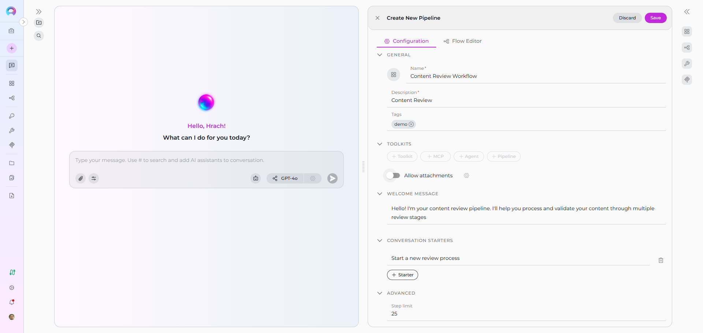

!!! info "Note"
    Required fields are marked with an asterisk * and must be completed before the pipeline can be created.

### Step 6: Save Initial Configuration

Click the **Save** button to create your pipeline with the basic configuration. This will proceed to the advanced configuration interface where you can:

- Configure LLM model and settings
- Add toolkits, agents, pipelines, and MCP connections
- Access the Flow Editor for visual workflow design

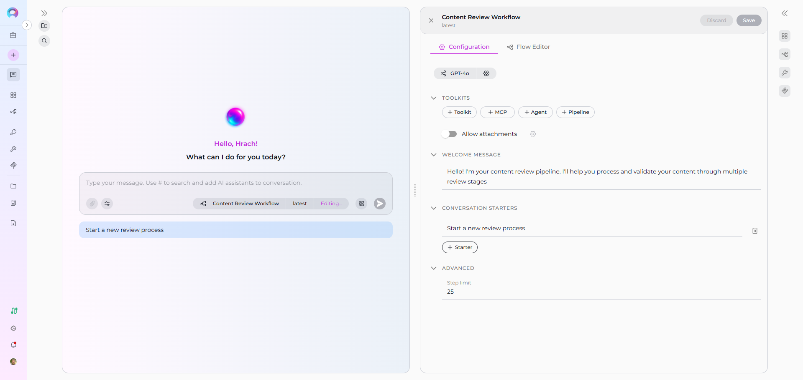

## Advanced Pipeline Configuration

After saving the initial configuration, the advanced configuration interface opens with two main tabs:

### Configuration Tab

#### LLM Model and Settings Configuration

1. **Model Selection:**
    - Click the **Select LLM Model** button at the top of the interface
    - Choose from available LLM models in your project (e.g., "gpt-4o", "gpt-4o-mini")
    - The selected model will be displayed on the button

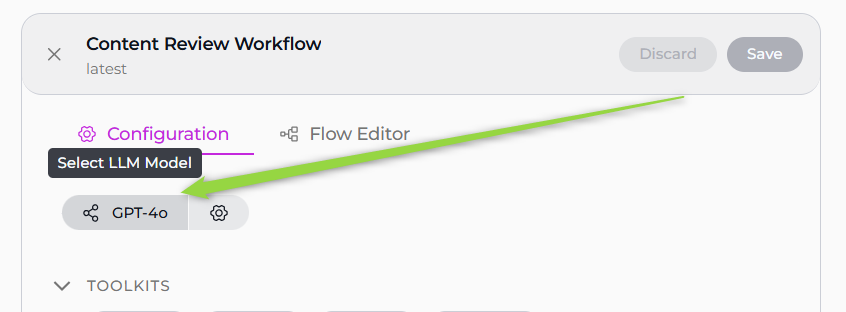

2. **Model Settings:**
    - Click the **Model Settings** button (gear icon) next to the model selector
    - Configure the following parameters:
       - **Temperature** (0.1-1.0): Controls creativity and randomness in responses
         - Lower values (0.1-0.3): More focused and deterministic responses
         - Higher values (0.7-1.0): More creative and varied responses
       - **Top P** (0.1-1.0): Controls diversity of word choices
       - **Max Completion Tokens**: Maximum length of the response (e.g., 4096)
    - Click **Apply** to save the model settings

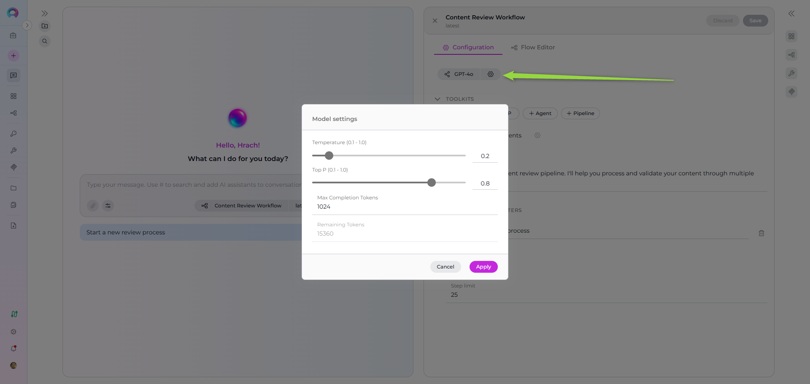

#### Toolkits Configuration

In the **TOOLKITS** section, you can enhance your pipeline's capabilities by adding various integrations:

1. **Adding Toolkits:**
    - Click **+ Toolkit** to select from available toolkits or create new ones
    - Browse and select toolkits like GitHub, Jira, Confluence, etc.

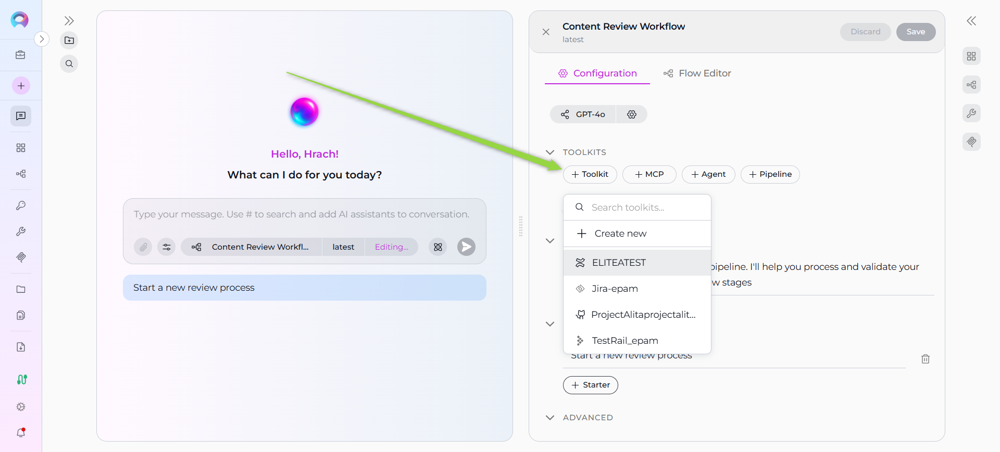

2. **Adding MCP Connections:**
    - Click **+ MCP** to add Model Context Protocol connections
    - Select from available MCP configurations
    - MCP connections appear in the toolkits list with proper status indicators

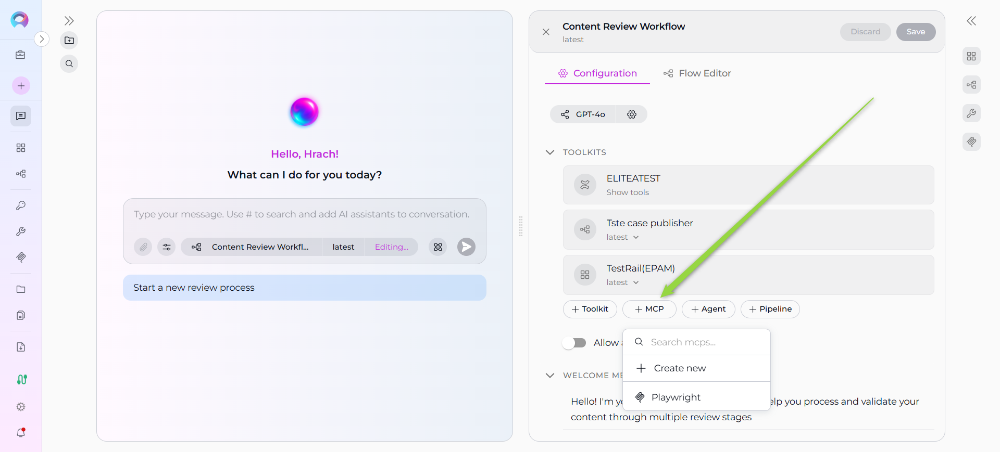

3. **Adding Nested Agents:**
    - Click **+ Agent** to add agents as pipeline components
    - Select from existing agents in your project
    - Choose specific versions from the version dropdown
    - Nested agents provide AI capabilities within pipeline nodes

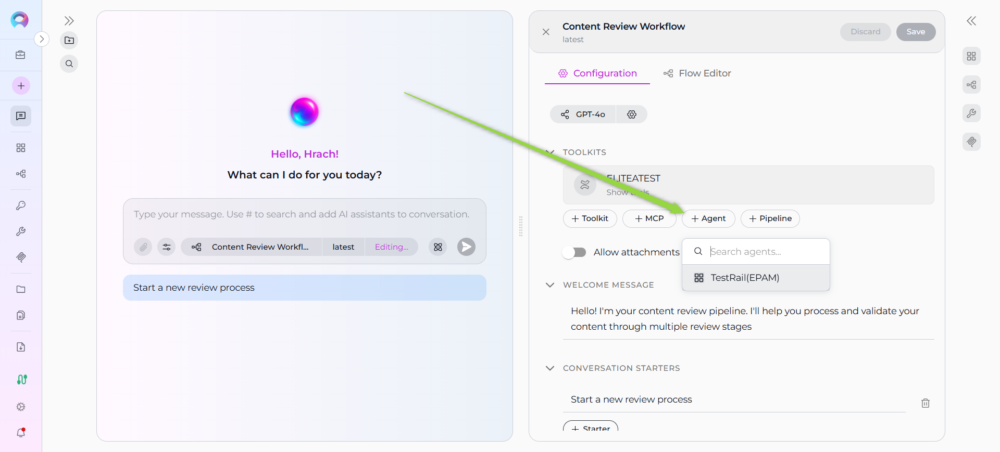

4. **Adding Nested Pipelines:**
    - Click **+ Pipeline** to integrate other pipeline workflows
    - Select from available pipelines in your project
    - Nested pipelines enable complex workflow compositions

5. **Allow Attachments Toggle:**
    - Enable or disable file attachment support for the pipeline

### Flow Editor Tab

The **Flow Editor** tab provides a visual interface for designing your pipeline workflow. This tab is only available after the initial pipeline save.

!!! info "Flow Editor Availability"
    The Flow Editor is disabled during pipeline creation. You must save the pipeline first in the Configuration tab before accessing the Flow Editor.

#### Flow Editor Features:

1. **Visual Node Management:**
    - Drag and drop nodes onto the canvas
    - Connect nodes to create workflow paths
    - Configure individual node properties
    - Click the **+ (Add Node)** button to add available nodes to your workflow
    - Multiple node types available for different workflow operations (Agent, Decision, Loop, Router, State Modifier, and more)

2. **State Management:**
    - **State**: The pipeline's state holds data that flows through your workflow
    - **State Variables**: Define and manage variables that store information between nodes
    - **State Modifier Node**: Update, transform, or clean up state variables during workflow execution
    - Use state variables to pass data between different nodes in your pipeline
    - Configure input and output variables for each node to control data flow

3. **YAML Synchronization:**
    - Changes in the Flow Editor automatically update the YAML instructions
    - Manual YAML edits can also be reflected in the visual editor
    - Seamless switching between visual and code-based editing

4. **Editor Modes:**
    - **Flow mode**: Visual drag-and-drop interface
    - **YAML mode**: Direct YAML code editing

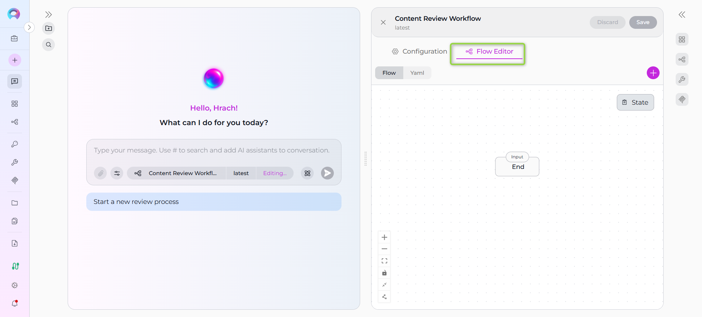

### Step 7: Finalize Pipeline Creation

Once you have completed configuring your pipeline:

- Click the **Save** button to save all your configuration changes
- Click the **X** button to close the canvas interface

Your newly created pipeline will appear in the **PARTICIPANTS** section under **Pipelines** and becomes immediately available for use in conversations.

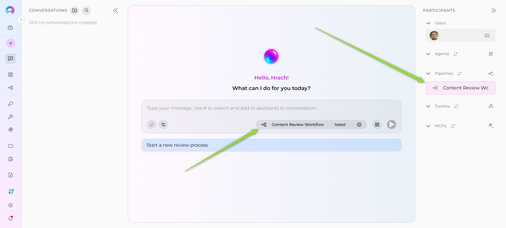

## Editing Pipelines via Canvas Interface

### Accessing Pipeline Edit Mode

There are two ways to access the pipeline edit mode:

1. **From PARTICIPANTS Section**
    - Navigate to the **Chat** page where the pipeline is available.
    - In the **PARTICIPANTS** section, locate **Pipelines**.
    - Find the pipeline you want to edit.
    - Hover over the pipeline to reveal action buttons.
    - Click the pencil **Edit** icon that appears.

2. **From Chat Interface**
    - When a pipeline is active in your conversation, click the **Pipeline Settings** button (gear icon) that appears in the chat interface.
    - This will open the pipeline configuration canvas directly.

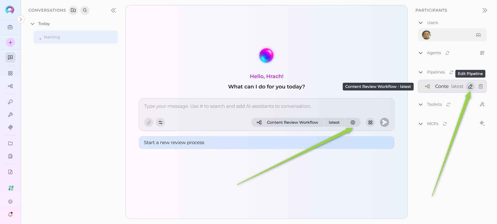

The pipeline configuration canvas will open with current settings pre-populated.

### Modifying Pipeline Configuration

Once in edit mode, you can modify any configuration parameters to update your pipeline settings. The edit interface displays current settings pre-populated, allowing you to make changes to:

#### Configuration Tab Modifications:

- **Welcome Message**: Change the initial message users see
- **Conversation Starters**: Add, remove, or modify starter prompts (maximum 4)
- **Advanced**: Adjust step limits and other parameters
- **LLM Model and Settings**: Switch models or fine-tune model parameters (temperature, top-p, max tokens)

**Toolkits and Integrations:**

- Add or remove toolkits, MCP connections, nested agents, and nested pipelines
- **Nested Toolkits**: View and manage individual tools within each toolkit
- **MCP Servers**: View and manage available tools for each MCP connection
- **Nested Agents**: Select and change specific versions from the version dropdown
- **Nested Pipelines**: Select and change specific versions from the version dropdown

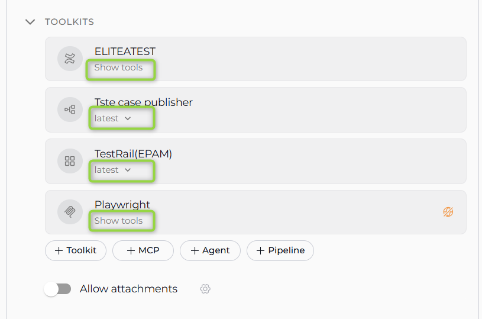

#### Flow Editor Tab Modifications:

- **Visual Workflow Design**: Add, remove, or rearrange nodes in the flow
- **Node Configuration**: Update properties for individual nodes
- **Connection Management**: Modify transitions between nodes
- **YAML Editing**: Direct editing of the workflow YAML code

For example, if you have a pipeline configured for content processing, you can easily update the **Instructions** to include new processing stages, add additional **Toolkits** like GitLab for repository integration, or redesign the workflow in the **Flow Editor** to add parallel processing paths.

Changes are reflected immediately in the interface. After making your desired configuration changes, use the **Save** button located in the top right corner to apply your modifications. The updated configuration becomes immediately applied.

### Version Management

When editing pipelines from the chat interface:

1. **Version Selector:**
    - The current version is displayed on the version dropdown in the pipeline settings panel
    - The current version is also displayed on the pipeline card in the PARTICIPANTS sidebar
    - Click the version dropdown to view all available versions of the pipeline
    - Select different versions to view or edit

2. **Version Status:**
    - **Draft versions**: Can be edited and modified
    - **Published versions**: Read-only, cannot be edited

!!! warning "Published Version Limitations"
    Published versions are read-only and cannot be edited. To modify a published version, create a new version or edit an existing draft version.

## Troubleshooting Common Issues

### Pipeline Creation Issues

**Missing Required Fields:**

- **Problem:** Save button remains disabled
- **Solution:** Review all fields marked with asterisk (*) and ensure they are completed
- **Verification:** Check that both Name and Description fields contain valid text

**YAML Syntax Errors:**

- **Problem:** Pipeline creation fails due to invalid YAML
- **Solution:** Verify YAML syntax in the Instructions field, ensure proper indentation and structure
- **Prevention:** Use YAML validators or start with a simple workflow template

**Model Configuration Errors:**

- **Problem:** Pipeline creation fails due to model configuration issues
- **Solution:** Verify that a valid LLM model is selected and model settings are within acceptable ranges
- **Prevention:** Use default model settings initially, then customize as needed

### Pipeline Management Issues

**Edit Mode Access:**

- **Problem:** Cannot access edit mode for existing pipeline
- **Solution:** Verify you have appropriate permissions (`applications.update`) and the pipeline version is not published
- **Workaround:** Ensure no active operations are using the pipeline

**Flow Editor Not Available:**

- **Problem:** Flow Editor tab is disabled
- **Solution:** Save the pipeline first in the Configuration tab, then the Flow Editor will become available
- **Resolution:** Flow Editor is only accessible after initial pipeline creation

**Configuration Validation:**

- **Problem:** Changes cannot be saved due to validation errors
- **Solution:** Review error messages and ensure all required fields maintain valid values
- **Resolution:** Check that external resources (models, toolkits, agents) are still accessible

### PARTICIPANTS Section Issues

**Pipeline Not Appearing:**

- **Problem:** Created pipeline doesn't appear in PARTICIPANTS
- **Solution:** Refresh the interface or verify the pipeline was created in the correct workspace/project
- **Check:** Ensure you're viewing the correct project context

**Model Settings Not Applying:**

- **Problem:** Model configuration changes don't take effect
- **Solution:** Ensure you clicked "Apply" in the model settings dialog before closing
- **Prevention:** Always use the Apply button rather than just closing the settings dialog

**Version Switching Issues:**

- **Problem:** Cannot switch between pipeline versions
- **Solution:** If you have unsaved changes, save or discard them before switching versions
- **Note:** Switching versions with unsaved changes will prompt a confirmation dialog

## Conclusion

The Pipeline Canvas feature in ELITEA provides a powerful and intuitive way to manage AI pipeline creation and configuration directly from your chat interface. By following the practices outlined in this guide, you can effectively create, configure, and manage pipelines that enhance your development workflows and team collaboration.

**Key Benefits Recap:**

- **Streamlined Creation:** Create pipelines without leaving your conversation context
- **Dual-Mode Configuration:** Use both Configuration and Flow Editor for flexible design
- **Visual Workflow Design:** Leverage the Flow Editor for intuitive pipeline creation
- **Real-time Integration:** Immediately use pipelines in your conversations
- **Advanced AI Configuration:** Leverage comprehensive LLM model management and fine-tuning
- **Team Collaboration:** Share and manage pipelines within team projects

!!! info "Related Documentation"
    For additional information and related functionality, refer to these helpful resources:

    - **[Pipeline Menu](../menus/pipelines.md)** - Complete reference for pipeline management and configuration options
    - **[Chat Menu](../menus/chat.md)** - Comprehensive guide to chat interface features and navigation
    - **[Credential Menu](../menus/credentials.md)** - Detailed instructions for managing authentication credentials
    - **[AI Configuration](../menus/settings/ai-configuration.md)** - Setup and configuration guide for AI models and settings
    - **[How to Create and Edit Agents from Canvas](how-to-create-and-edit-agents-from-canvas.md)** - Similar guide for agent management
