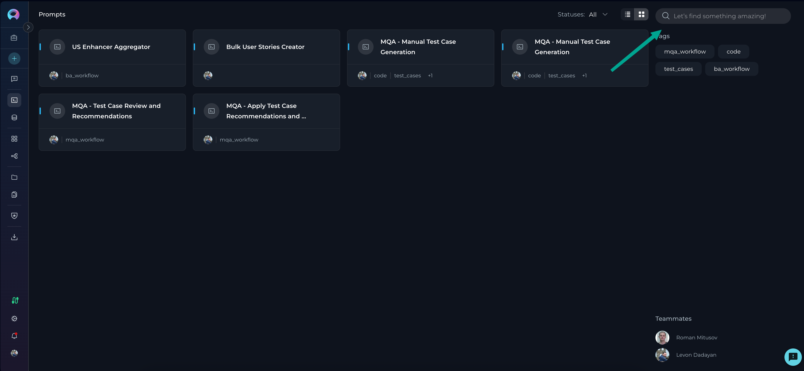
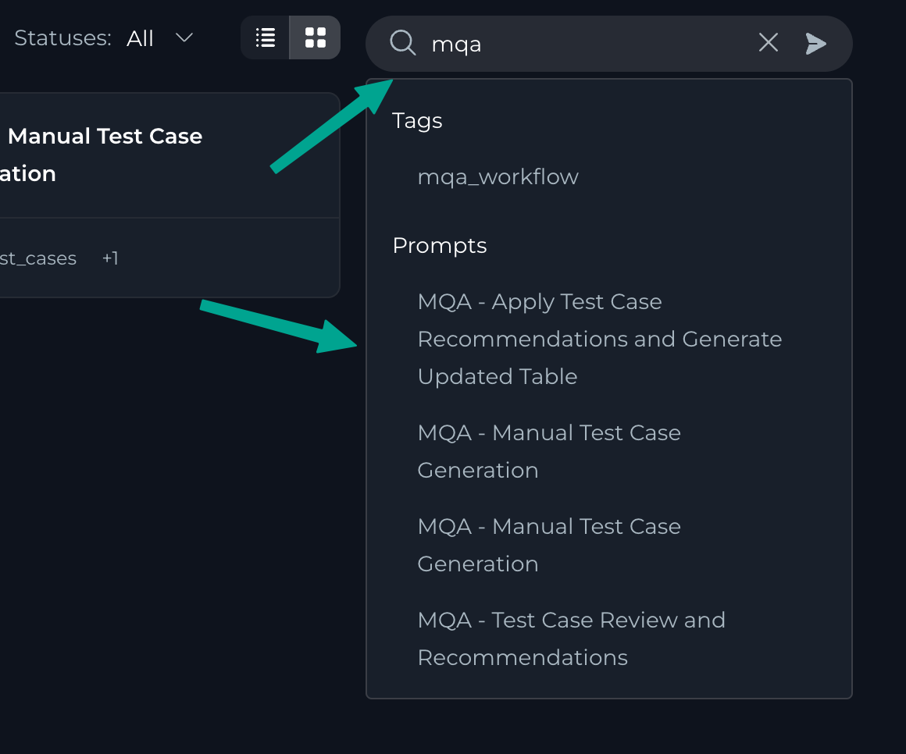
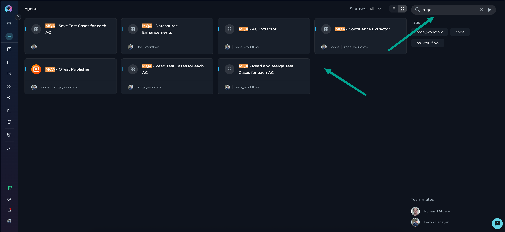
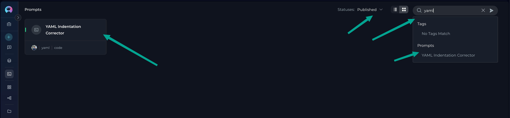
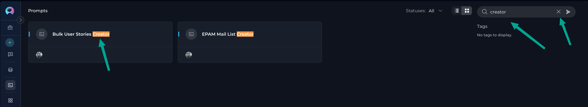
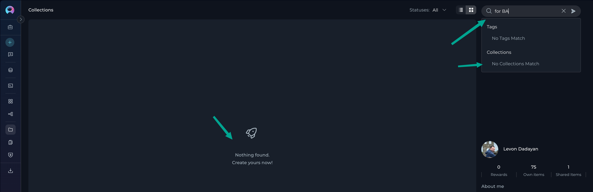
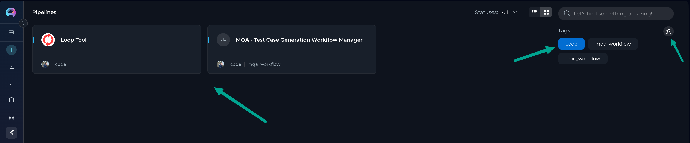
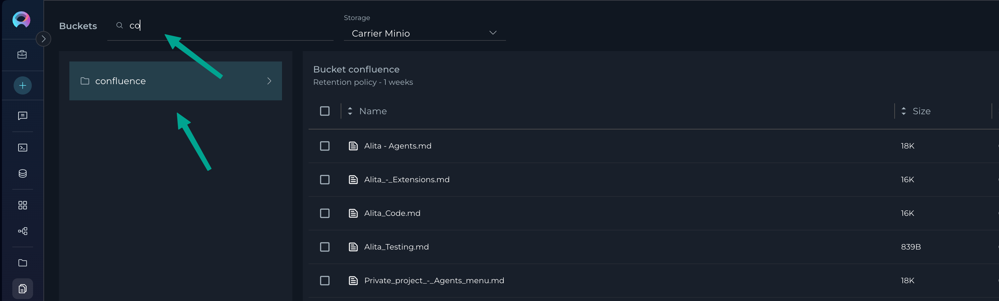

# ELITEA Search Functionality

Finding what you need quickly is essential. ELITEA's robust search functionality helps you locate your prompts, datasources, agents, pipelines, and collections efficiently. This guide will show you how to make the most of ELITEA's search capabilities across all platform.

## Search Overview

The search functionality in ELITEA works consistently across the following menus:

- [Prompts](../platform-documentation/menus/prompts.md)
- [Datasources](../platform-documentation/menus/datasources.md)
- [Agents](../platform-documentation/menus/agents.md)
- [Pipelines](../platform-documentation/menus/pipelines.md)
- [Collections](../platform-documentation/menus/collections.md)

Whether you're in your **Private** project, the **Public** project, or any **Team** project, the search feature operates the same way, providing a consistent experience throughout the platform.

## How Search Works

### Basic Search Functionality

ELITEA's search is designed to help you quickly find what you need by searching through:

- Entity names
- Entity descriptions
- Associated tags

As soon as you start typing in the search field, ELITEA's auto-filter immediately begins showing matching results grouped by:

1. **Tags** - Matching tags associated with entities
2. **Entity Type** - Entities whose names or descriptions match your search term

> **Tip:** If you click on an entity name that appears in the Entity Type section of the dropdown, that entity will automatically open, saving you time.

### Search Process Step by Step

1. Click in the search field located at the top of any menu (Prompts, Datasources, Agents, Pipelines, or Collections)
2. Start typing your search term
3. As you type, matching results will appear in a dropdown, categorized by Tags and Entity Type
4. You can either:
   - Click on a specific entity in the dropdown to open it directly
   - Press Enter to filter the current view to show all entities matching your search term

!!! note "Search Requirement"
    Search terms must be at least 3 letters long when you press Enter to perform a full search. If your search term is shorter, you'll see a message: "The search key word should be at least 3 letters long."

### Context-Aware Searching

One of ELITEA's powerful features is that search respects your current context:

- **Menu-Specific** - Search only looks within the current menu you're using (Prompts, Datasources, etc.)
- **Status-Aware** - If you've filtered by status (e.g., "Published" items), search will only look within items that match that status

### Clearing Search Results

To clear your search results and return to the full view, you can:

- Click the X icon in the search field
- Refresh the page

## No Matching Results

If your search doesn't find any matching entities, you'll see:

- A message indicating no results were found 
- While typing, the dropdown will show "No matches found" in both the Tags and Entity Type sections

## Filtering by Tags

In addition to text search, ELITEA offers robust tag-based filtering:

1. Each menu displays available tags on the right side panel
2. Click on any tag to instantly filter the view to show only entities with that tag
3. You can select multiple tags to further refine your results
4. To clear tag filters, click the "Clear all" button at the top of the tags panel

!!! tip "Combining Search and Tags"
    For the most precise results, you can combine text search with tag filtering. First, filter by tags, then use the search field to find specific items within those tagged entities.

## Special Case: Artifacts Search

Unlike other menus, the search functionality in the Artifacts menu works differently:

- Search only works for bucket names (not file names within buckets)
- Enter your search term to filter visible buckets to those matching your search

## Search Tips and Best Practices

To make the most of ELITEA's search capabilities:

- **Use specific, unique terms** - The more distinctive your search term, the more precise your results
- **Leverage tags** - Adding descriptive tags to your entities will make them easier to find later
- **Combine approaches** - Use status filters, tag filters, and text search together for the most refined results
- **Check your context** - Remember that search only looks within your current menu and respects status filters

## Summary

ELITEA's search functionality provides a powerful yet intuitive way to locate your AI assets across the platform. By understanding how search works across different menus and learning to combine it with filters and tags, you can quickly find exactly what you need, saving time and improving your workflow efficiency.

Whether you're managing hundreds of prompts, organizing complex agents, or sorting through datasources, mastering ELITEA's search capabilities will help you maintain control over your AI workspace.