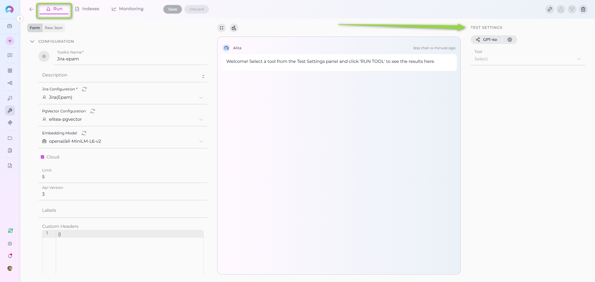
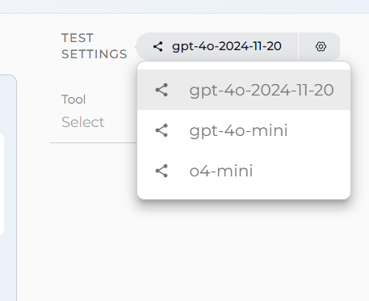
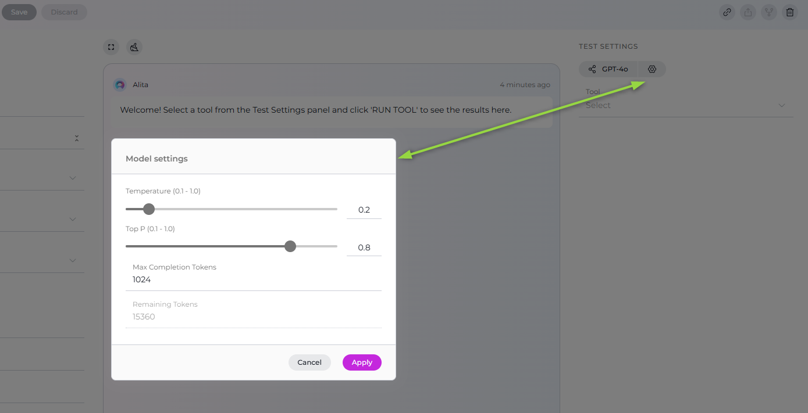
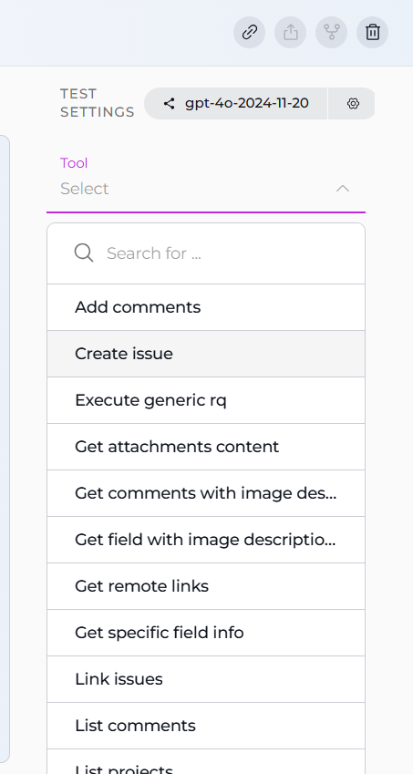
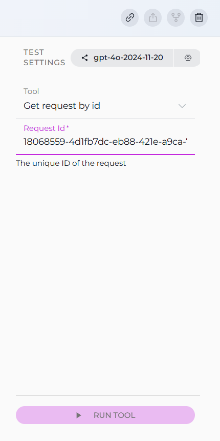
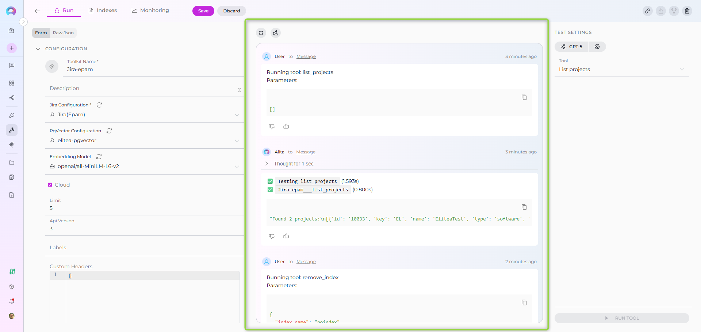

# How to Test Toolkit Tools

## Overview

The **Test Settings** panel provides a powerful interface for testing toolkit tools directly from the Toolkit detailed page. This feature allows you to validate toolkit functionality, verify credentials, test tool parameters, and ensure proper integration before using toolkits in agents or conversations.

Testing toolkit tools is an essential step in the toolkit configuration workflow, enabling you to:

* **Verify Credentials**: Confirm that authentication credentials are correctly configured
* **Validate Tool Functionality**: Test individual tools with real parameters
* **Debug Tool Behavior**: Understand how tools respond to different inputs
* **Preview Tool Outputs**: See actual responses before integrating with agents
* **Optimize Parameters**: Fine-tune tool settings and parameters for your use case

---

## Accessing the Test Settings Panel

The Test Settings panel is located on the right side of the Toolkit detailed page and is available for all configured toolkits.

### How to Access:

1. **Navigate to Toolkits**: Go to **Toolkits** from the main navigation
2. **Select a Toolkit**: Click on any configured toolkit from the list
3. **View Test Settings**: The Test Settings panel appears on the right side of the page



---

## Test Settings Interface Components

The Test Settings panel consists of several key components that work together to enable comprehensive tool testing:

### 1. Model Selection

Choose the Large Language Model (LLM) that will be used to execute the tool test.

* **Model Dropdown**: Select from available LLM models configured in your project
* **Default Selection**: The system selects your project's default model automatically
* **Model Options**: Displays model names (e.g., `gpt-4o`, `gpt-4o-mini`, `claude-3-5-sonnet`)



### 2. Model Settings 

Fine-tune how the selected model generates responses using these controls:

| Parameter | Range | Description | Best Practices |
|-----------|-------|-------------|----------------|
| **Temperature** | 0.1 - 1.0 | Controls randomness and creativity in responses | Lower values (0.1-0.3) for predictable, focused results; Higher values (0.7-1.0) for creative outputs |
| **Top P** | 0.1 - 1.0 | Nucleus sampling parameter that limits output to most probable words | Higher values (0.9-1.0) allow more diversity; Lower values (0.1-0.5) for more focused outputs |
| **Top K** | 1 - 100 | Restricts choices to the top K most likely next words | Lower values (10-20) for more deterministic outputs; Higher values (50-100) for variety |
| **Max Completion Tokens** | 1 - 4096+ | Sets the upper limit for the length of the model's output | Use higher values (1024-4096) for detailed responses; Lower values (256-512) for concise outputs |



!!! tip "Recommended Settings for Testing"
    For toolkit tool testing, we recommend:
    
    * **Temperature**: 0.1 (for consistent, predictable results)
    * **Top P**: 1.0 (standard setting)
    * **Top K**: 10 (focused output)
    * **Max Completion Tokens**: 1024 (sufficient for most tool responses)

### 3. Tool Selection

Choose which specific tool from your toolkit you want to test.

* **Tool Dropdown**: Lists all tools available in the current toolkit
* **Search Functionality**: Type to filter available tools by name
* **Tool Grouping**: Tools are organized by their functionality type
* **Enabled Tools Only**: Only shows tools that are enabled in the toolkit configuration



### 4. Tool Parameters

After selecting a tool, the Test Settings panel dynamically displays the required and optional parameters for that specific tool.

**Parameter Field Types:**

* **Text Fields**: For string inputs (e.g., repository names, URLs)
* **Number Fields**: For numeric inputs (e.g., limits, IDs)
* **Dropdown Selects**: For predefined choices (e.g., status values)
* **Boolean Checkboxes**: For true/false options (e.g., include archived)
* **Array Fields**: For multiple values (e.g., list of labels, file extensions)
* **Object Fields**: For complex structured data (e.g., JSON configurations)

**Field Indicators:**

* **Required Fields**: Marked with an asterisk (*) and must be filled before testing
* **Optional Fields**: Can be left empty; the tool will use default values
* **Default Values**: Pre-populated fields show the tool's default setting
* **Field Descriptions**: Hover over field labels for detailed parameter information

---

## How to Test a Toolkit Tool

Follow these steps to test any tool from your configured toolkit:

### Step 1: Select Your Model

1. Click the **Model** dropdown in the Test Settings panel
2. Choose the LLM model you want to use for testing
3. (Optional) Adjust model parameters using the advanced settings sliders

### Step 2: Choose a Tool to Test

1. Click the **Tool** dropdown
2. Use the search box to filter tools (optional)
3. Select the tool you want to test from the list

### Step 3: Configure Tool Parameters

Once a tool is selected, the parameter input fields appear below:

1. **Fill Required Parameters**: Complete all fields marked with an asterisk (*)
2. **Configure Optional Parameters**: Provide values for optional fields as needed
3. **Use Default Values**: Leave optional fields empty to use tool defaults
4. **Validate Inputs**: Ensure all values match the expected format (e.g., valid JSON for object fields)

### Step 4: Execute the Test

1. **Review Configuration**: Verify all parameters are correctly set
2. **Click RUN TOOL**: The button becomes active when all required fields are filled
3. **Monitor Execution**: Watch the chat interface for real-time tool execution updates
4. **Review Results**: Examine the tool output displayed in the chat area



---

## Understanding Test Results

Test results are displayed in a chat-style interface on the right side of the toolkit page, providing detailed information about the tool execution.

### Result Components

**1. Tool Execution Summary**

The first section shows a summary of the tool execution:

* **Status Indicator**: ✅ for success, ❌ for errors
* **Tool Name**: The name of the executed tool
* **Execution Time**: Time taken to complete the tool execution (in seconds)

**2. Tool Output**

The main result is displayed in a formatted code block (typically JSON):

```json
{
  "success": true,
  "data": { ... },
  "message": "Operation completed successfully"
}
```

**3. Execution Metadata**

Additional information about the execution:

* **Timestamp**: When the tool was executed
* **Model Used**: The LLM model that processed the request
* **Parameters Sent**: The actual parameters passed to the tool

### Success Response Example

```
✅ `jira___search_issues` (1.234s)

{
  "success": true,
  "issues": [
    {
      "key": "PROJ-123",
      "summary": "Implement user authentication",
      "status": "In Progress",
      "assignee": "john.doe",
      "priority": "High"
    },
    {
      "key": "PROJ-124",
      "summary": "Fix login page layout",
      "status": "To Do",
      "assignee": "jane.smith",
      "priority": "Medium"
    }
  ],
  "total": 2
}
```

### Error Response Example

```
❌ `confluence___get_page` (0.423s)

{
  "success": false,
  "error": "Page not found with ID: 98765432",
  "error_type": "PageNotFoundError",
  "status_code": 404
}
```

---

## Advanced Testing Features

### Chat History and Multiple Tests

The test interface maintains a conversation history, allowing you to:

* **Review Previous Tests**: Scroll through past test executions
* **Compare Results**: See how different parameters affect tool outputs
* **Track Changes**: Monitor how tool behavior changes after configuration updates

**Clear Chat History:**

* Click the **Clear** (trash) icon at the top of the chat interface
* This removes all previous test results and starts fresh

### Fullscreen Mode

For detailed result analysis:

1. Click the **Fullscreen** icon at the top of the chat interface
2. The test results expand to fill the entire screen
3. Click the fullscreen icon again (or press ESC) to return to normal view

This is particularly useful when:

* Examining large JSON responses
* Analyzing complex tool outputs
* Comparing multiple test results side-by-side

---

## Common Testing Scenarios

### Scenario 1: Testing GitHub Create Branch

**Objective**: Verify that your GitHub credential can create a new branch in a repository

**Steps:**

1. **Select Model**: `gpt-4o-mini`
2. **Select Tool**: `create_branch`
3. **Configure Parameters**:
     * `branch_name`: `feature/test-branch`
4. **Run Tool**: Click RUN TOOL
5. **Verify Result**: Confirm that the new branch was created successfully

**Expected Result**: JSON response confirming branch creation with branch name, commit SHA, and reference details.

### Scenario 2: Testing Jira Issue Creation

**Objective**: Test creating a new Jira issue with your configured credentials

**Steps:**

1. **Select Model**: `gpt-4o`
2. **Select Tool**: `create_issue`
3. **Configure Parameters**:
     `Issue Json *`:  
{
  "fields": {
    "project": {
      "key": "EL"
    },
    "summary": "Test issue from ELITEA toolkit",
    "issuetype": {
      "name": "Task"
    },
    "description": {
      "type": "doc",
      "version": 1,
      "content": [
        {
          "type": "paragraph",
          "content": [
            {
              "type": "text",
              "text": "This is a test issue created via toolkit testing"
            }
          ]
        }
      ]
    }
  }
}
     ```
4. **Run Tool**: Click RUN TOOL
5. **Verify Result**: Check that the issue was created and the response includes the issue key

**Expected Result**: Success response with the newly created issue key (e.g., `DEMO-123`).

### Scenario 3: Testing Index Data Tool

**Objective**: Test indexing functionality with your configured PgVector and embedding model

**Steps:**

1. **Select Model**: `gpt-4o`
2. **Select Tool**: `index_data`
3. **Configure Parameters**:
     * `index_name`: `test` (7 characters max)
     * `clean_index`: `true` (checkbox checked)
     * `progress_step`: `10`
     * Additional toolkit-specific parameters (e.g., `repository`, `branch` for GitHub)
4. **Run Tool**: Click RUN TOOL
5. **Monitor Progress**: Watch for progress updates during indexing
6. **Verify Result**: Confirm indexing completed successfully

**Expected Result**: Success message with indexing statistics (documents processed, chunks created, etc.).

### Scenario 4: Testing Search Index Tool

**Objective**: Verify that indexed data can be searched with natural language queries

**Steps:**

1. **Select Model**: `gpt-4o`
2. **Select Tool**: `search_index`
3. **Configure Parameters**:
     * `collection_suffix`: `test` (must match an existing index)
     * `query`: `authentication implementation`
     * `top_k`: `5`
     * `cut_off`: `0.7`
4. **Run Tool**: Click RUN TOOL
5. **Review Results**: Examine the returned search results with relevance scores

**Expected Result**: List of relevant documents/chunks with similarity scores and metadata.

---

## Troubleshooting Test Failures

### Common Issues and Solutions

#### 1. Authentication Errors

**Problem**: `401 Unauthorized` or `403 Forbidden` errors

**Solutions:**

* **Verify Credentials**: Check that credentials are correctly configured in Settings → Credentials
* **Check Permissions**: Ensure the credential has necessary permissions for the tool
* **Refresh Tokens**: Update expired tokens or API keys
* **Test Connectivity**: Verify network access to the external service

#### 2. Parameter Validation Errors

**Problem**: `Invalid parameter` or `Required field missing` errors

**Solutions:**

* **Review Required Fields**: Ensure all fields marked with (*) are filled
* **Check Data Types**: Verify that values match expected types (string, number, array, etc.)
* **Validate Formats**: Ensure data formats are correct (e.g., valid JSON for object fields)
* **Review Field Descriptions**: Hover over field labels for parameter requirements

#### 3. Connection Timeouts

**Problem**: Tool execution times out without response

**Solutions:**

* **Check Service Status**: Verify the external service is operational
* **Network Connectivity**: Ensure network access to the service URL
* **Firewall Rules**: Check if firewalls are blocking connections
* **Service URLs**: Verify endpoint URLs are correct in toolkit configuration

#### 4. Tool Not Found Errors

**Problem**: Selected tool doesn't execute or shows as unavailable

**Solutions:**

* **Enable Tool**: Ensure the tool is checked in toolkit configuration
* **Save Configuration**: Save toolkit changes before testing
* **Refresh Page**: Reload the toolkit page to update available tools
* **Check Tool Selection**: Verify the tool is supported for the toolkit type

#### 5. Model Configuration Issues

**Problem**: LLM model errors or unavailable models

**Solutions:**

* **Select Valid Model**: Choose a model configured in your project
* **Check Model Access**: Verify you have access to the selected model
* **Review Model Settings**: Ensure model parameters are within valid ranges
* **Use Default Model**: Try testing with the project's default model first

---

## Best Practices for Toolkit Testing

### Before Production Use

1. **Test All Critical Tools**: Verify each tool you plan to use in agents or conversations
2. **Validate with Real Data**: Test with actual data you'll be working with
3. **Check Error Handling**: Test tools with invalid inputs to understand error responses
4. **Document Results**: Keep notes on successful parameter combinations
5. **Test After Updates**: Re-test tools after updating credentials or configuration

### Parameter Testing Strategy

1. **Start with Defaults**: Begin testing with default parameter values
2. **Test Required Fields Only**: First test with just required parameters
3. **Add Optional Parameters**: Gradually add optional parameters to understand their impact
4. **Test Edge Cases**: Try boundary values (empty strings, maximum limits, etc.)
5. **Validate Complex Inputs**: Carefully test tools requiring JSON or complex objects

### Performance Testing

1. **Monitor Execution Times**: Note how long different tools take to execute
2. **Test with Different Models**: Compare performance across different LLM models
3. **Adjust Timeouts**: Configure appropriate timeout values based on tool performance
4. **Test Under Load**: Consider how tools perform with larger datasets or parameters

### Security Testing

1. **Test Permission Boundaries**: Verify tools respect credential permissions
2. **Validate Data Access**: Ensure tools only access authorized data
3. **Check Sensitive Data**: Confirm sensitive information is properly handled
4. **Test Error Messages**: Verify error messages don't expose sensitive information

---

## Testing Tools vs. Using in Agents

Understanding the differences between testing tools and using them in agents helps set appropriate expectations:

| Aspect | Tool Testing | Agent Usage |
|--------|--------------|-------------|
| **Execution Context** | Direct tool call with explicit parameters | Agent decides when and how to call tools based on conversation |
| **Parameter Source** | Manually provided by you | Extracted from conversation by the LLM |
| **Error Handling** | Immediate error feedback | Agent may retry or request clarification |
| **Output Format** | Raw tool output (usually JSON) | Natural language interpretation by agent |
| **Execution Flow** | Single tool execution | May involve multiple tool calls in sequence |
| **User Interaction** | One-time test | Ongoing conversation with context |

**Key Takeaway**: Successful tool testing validates that the tool works correctly with proper parameters. In agent usage, the LLM determines when to call tools and how to extract parameters from natural language conversations.

---

## Related Resources

For more information on toolkit configuration and usage:

* **[Toolkits Menu](../menus/toolkits.md)** — Complete guide to toolkit management and configuration
* **[Create a Credential](../getting-started/create-credential.md)** — How to configure authentication credentials
* **[AI Configuration](../menus/settings/ai-configuration.md)** — Set up LLM models and embedding configurations
* **[Agents Menu](../menus/agents.md)** — Create agents that use your tested toolkits
* **[Chat Menu](../menus/chat.md)** — Use toolkits in conversations
* **[Indexing Overview](./indexing/indexing-overview.md)** — Learn about indexing tools and data processing

---
