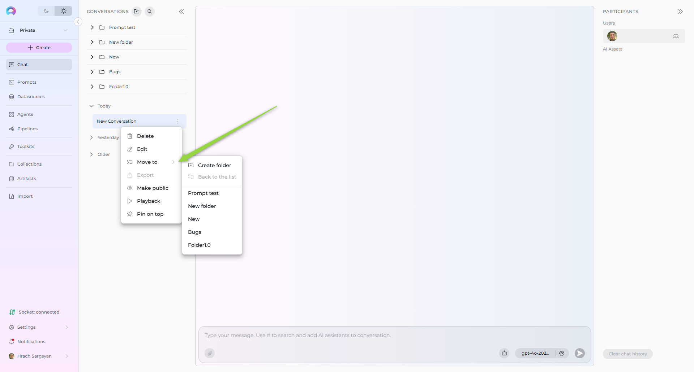

## 1. Introduction to ELITEA Chat Conversations

ELITEA Chat is a powerful feature designed to centralize your interactions with various ELITEA components, enabling you to achieve optimal results efficiently.

A Conversation in ELITEA represents a dynamic dialogue involving multiple participants. These can include language models (LLMs), pre-defined Prompts, connected Datasources, automated Agents, and human Users like yourself. You interact using natural language, and the chat maintains context, allowing you to refer to previous messages within the same conversation. Conversations are isolated; context is not shared between different conversations.

All your conversations are securely stored on the ELITEA server, making them accessible from any device where you log in. You can find all your conversations listed under the Chat menu in the sidebar.


## 2. Key Features

- **Public and Private Conversations**: Control visibility and collaboration by sharing conversations or keeping them private.  
- **Diverse Participants**: Integrate Models, Prompts, Datasources, Agents, and other Users (in public conversations) into your chat.  
- **Rich Interactions**: Engage with participants, copy responses, provide feedback, and more.  
- **Comprehensive Management**: Save, pin, share, delete, and clear conversations.  
- **Folder Organization**: Structure your conversations logically using folders.  
- **Playback Mode**: Simulate and review conversation flows without engaging live models, ideal for demos.  


## 3. Getting Started

### 3.1 Creating a New Conversation

1. Click the **+ Conversation** button located in the top right corner of the chat interface, OR click the **+** icon next to the **CONVERSATIONS** heading in the sidebar.  
2. A new conversation entry will appear. By default, it will be named "New Conversation". You can rename it later (see [Conversation Actions](#42-conversation-actions-sidebar)).  
3. **Add Participants**: Click the **PARTICIPANTS +** button within the new conversation window to add desired Models, Prompts, Datasources, or Agents (See [Adding Participants](#72-adding-participants-to-a-conversation)).  
4. **Start Chatting**: Type your initial message, question, or command (e.g., "Summarize the attached document", "Analyze this data", or simple commands like "Go", "Start Generating", "Execute", "Run it" if a participant requires initiation) into the chat input box at the bottom.  
5. Click the **Send** icon (typically looks like a paper airplane).  

Your new conversation will now be listed in the **CONVERSATIONS** sidebar on the left.  


### 3.2 Creating a New Folder

Organize your conversations by grouping them into folders.

1. Click the **+ Folder** button located at the top of the **CONVERSATIONS** sidebar.  
2. Enter a descriptive **Name** for your folder in the prompt that appears.  
3. Click **Save**.  

The new folder will appear in your **CONVERSATIONS** sidebar.  


## 4. Managing Conversations

### 4.1 Moving Conversations to Folders

To organize conversations into folders:

1. In the **CONVERSATIONS** sidebar, right-click on the conversation you wish to move.
2. Select **Move to** from the context menu.
3. Choose the desired destination folder from the list.
4. If no suitable folder exists, you can click **+New Folder** directly from this menu to create one on the fly.



### 4.2 Conversation Actions (Sidebar)

You can manage conversations directly from the **CONVERSATIONS** sidebar by right-clicking on a conversation or clicking the options menu (often **...**) associated with it. The following actions are available:

- **Edit**: Rename the conversation. Enter the new name and confirm.
- **Pin / Unpin**: Select **Pin** to keep the conversation at the top of the list for easy access. Select **Unpin** on a pinned conversation to remove it from the top.
- **Move To**: Move the conversation into a folder, as described above.
- **Make Public**: Convert a private conversation into a public one, visible to other project members.  
  **Caution**: This action is irreversible; you cannot make a public conversation private again.
- **Delete**: Permanently remove the conversation. You will be asked to confirm this action.
- **Playback**: Enter Playback mode for this conversation (See [Playback Mode](#9-playback-mode)).
- **Export**: *(Note: Currently mentioned as "Not applicable now",  this functionality may be introduced in future updates)* Export the conversation content.


## 5. Managing Folders

### 5.1 Folder Actions (Sidebar)

Folders can be managed directly from the **CONVERSATIONS** sidebar. Right-click on a folder or click its associated options menu (**...**) to access the following actions:

- **Edit Folder**: Rename the folder. Enter the new name and click the checkmark (✔) or **Save** button.
- **Delete Folder**: Remove the folder.  
  **Important**: Deleting a folder does not delete the conversations inside it. Conversations within a deleted folder are automatically moved back to the main conversation list (root level). You will be asked to confirm deletion.


## 6. Understanding Conversation/Folder Visibility

Access and permissions depend on the project type (Private vs. Team) and the conversation/folder setting (Private vs. Public).

### 6.1 Private Conversations and Folders

- Created within your private workspace or designated as private within a team project.
- Only visible and accessible to you, the creator.
- You can add **Agents**, **Pipelines** and **Toolkits** as AI Assistants.
- You cannot add other **Users** as participants to private conversations.

### 6.2 Team Project Conversations and Folders

When working within a shared team project:

- **Folders**: You can see all folders created within the project.
- **Conversations**: You can only see conversations within folders if you are a member (participant) of that specific conversation.
- **Membership Actions**: If you are a member of a conversation, you can move it into any folder (public or private if you created it) or move it out of a folder using the **Back to the list** option (often found within the **Move To** menu).
- **Folder Restrictions**: You generally cannot delete folders created by other users, even if you can manage conversations within them.

### Example: Collaboration in a Team Project Chat

**Scenario**:  
The QA, PM, and BA are working together on a new feature for a product. They are using a shared conversation to discuss requirements, testing strategies, and project timelines.

**Steps to Collaborate**:

   - **BA Adds Requirements**:  
     The BA starts the conversation by adding the feature requirements.  
     Example:  
     ```
     @BA: "The new feature should allow users to upload files up to 10MB in size. The system must validate file types and provide error messages for unsupported formats."
     ```

   - **PM Sets the Timeline**:  
     The PM responds by setting the timeline for the feature's development and testing.  
     Example:  
     ```
     @PM: "The development team will complete the implementation by May 15th. QA can start testing on May 16th, and we aim to release the feature by May 20th."
     ```

   - **QA Plans Testing**:  
     The QA outlines the testing strategy and asks for clarification on edge cases.  
     Example:  
     ```
     @QA: "I will create test cases for file uploads, including valid and invalid file types, file size limits, and error handling. @BA, can you confirm if the system should support drag-and-drop uploads?"
     ```

   - **BA Provides Clarifications**:  
     The BA clarifies the requirements and provides additional details.  
     Example:  
     ```
     @BA: "Yes, drag-and-drop uploads should be supported. Additionally, the system should display a progress bar during uploads."
     ```

   - **PM Tracks Progress**:  
     The PM uses the chat to track progress and ensure alignment.  
     Example:  
     ```
     @PM: "QA, please share the test results by May 18th so we can review them before the release."
     ```

**Using Folders for Organization**

   - The PM creates a folder named **"Feature: File Upload"** to organize all conversations related to this feature.
   - The conversation is moved into this folder for easy access by all team members.

**Collaboration Benefits**

   - **Centralized Communication**: All discussions, clarifications, and updates are stored in one place.
   - **Transparency**: Team members can see the progress and contribute as needed.
   - **Accountability**: Each participant's responsibilities and deadlines are clearly outlined.


### Tips for Effective Collaboration in Team Projects

- **Use Mentions**: Use `@` to mention specific participants and ensure they are notified about relevant messages.
- **Organize Conversations**: Use folders to group related conversations for better accessibility.
- **Set Clear Expectations**: Define roles, responsibilities, and deadlines within the chat.
- **Provide Updates**: Regularly update the chat with progress, blockers, and next steps.


## 6.3 Public Conversations and Folders

- **Folders**: Public folders are visible to all members of the project.
- **Conversations**: Conversations within public folders (or marked as public) can be viewed and interacted with by all project members. Any member interacting becomes a participant.
- **Permissions**: Project members can typically move conversations into or out of public folders, subject to their overall project permissions.
- **Irreversibility**: Public folders/conversations cannot be converted back to private.


## 7. Working with Participants

Participants are the core components you interact with within a conversation.

### 7.1 What are Participants?

Participants are the "tools" or "entities" you add to your chat. These include:

- **Models**: Large Language Models (e.g., GPT-4, Claude) for generating text, answering questions, etc.
- **Prompts**: Pre-defined templates or instructions (created elsewhere in ELITEA) that guide a Model's output.
- **Datasources**: Connected data repositories (e.g., document collections, databases) that the chat can query or reference.
- **Agents**: Pre-configured automated workflows or specialized bots (created elsewhere in ELITEA) designed for specific tasks.
- **Users**: In public conversations, other project members who join or interact become participants. They cannot be manually "added" like other types but join implicitly.


### 7.2 Adding Participants to a Conversation

To add participants:

1. Inside an open conversation, click the **Add participants** button (visible when the conversation is new) or the **+** icon next to the **PARTICIPANTS** list (usually on the right side).
2. A pop-up window will appear, listing available participants.
3. Use the **Search** field to find participants by name or description.
4. **Filter**: Use filter options (e.g., by Type: Model, Prompt, etc., or by Tags) to narrow down the list.
5. **Select** to add a single participant immediately, hover over its card and click **Chat Now** or add multiple participants at once, click on the cards of all desired participants (they will be highlighted). Then click the **Add Participants** button at the bottom of the pop-up.

Selected participants will appear in the **PARTICIPANTS** list within your conversation.

**Note**: Users will receive notifications if they are added to a public conversation implicitly through interaction.


### 7.3 Using Participants in a Conversation

Once added, you need to specify which participant(s) should handle your next message:

1. **Check Participants**: Ensure the desired participant is listed in the **PARTICIPANTS** section.
2. **Select Active Participant(s)**: If the chat prompts "Select from the list or mention participant...", you must choose who to engage:
   - **Click**: Click the participant's name/icon in the **PARTICIPANTS** list.
   - **Mention**: In the chat input box, type a specific prefix followed by the participant's name (autocomplete suggestions will appear):
     - `@` for Agents (e.g., `@Data Analysis Agent`)
     - `>` for Models (e.g., `>GPT-4`)
   - The selected participant(s) will appear above the input box, indicating they are active for the next interaction.
3. **Send Message/Command**: Type your message or a simple command (like "Go", "Execute", "Run it") and press **Send**. The active participant(s) will process your input.
4. To remove a participant from the active list for the next message (without removing it from the conversation entirely), click the **X** icon next to its name above the input box.


### Example Usage

- **To ask a general question using a specific model**:
  1. Add the `>GPT-4o` model.
  2. Click `>GPT-4o` in the **PARTICIPANTS** list or type `>GPT-4o` in the input box.
  3. Type: `"Explain the concept of recursion in programming."` -> **Send**.

- **To run a pre-defined prompt**:
  1. Add the `/Generate Report Outline` prompt.
  2. Click it or type `/Generate Report Outline`.
  3. Type: `"Use the latest company sales figures."` -> **Send** (if the prompt uses variables). Or simply `"Run it"` -> **Send** (if no further input is needed).

- **To query a datasource**:
  1. Add the `#Product Documentation` datasource.
  2. Click it or type `#Product Documentation`.
  3. Type: `"How do I reset my password?"` -> **Send**.


### 7.4 Configuring Participants

You can fine-tune the behavior of added participants directly within the conversation. Navigate to the participant in the **PARTICIPANTS** list and click the **Settings** icon (often a gear ⚙️).

#### 7.4.1 Configuring Models

1. **Access Settings**: Click the ⚙️ icon on the Model participant.
2. **Adjustable Parameters**:
   - **Temperature**: Controls randomness (higher = more creative, lower = more deterministic).
   - **Top P**: Nucleus sampling (considers tokens with cumulative probability > P). Value 0-1.
   - **Top K**: Considers the top K most likely tokens.
   - **Maximum Length**: Max number of tokens in the response.
3. **Apply**: Click the **< SETTINGS** button (or similar) to save changes for this conversation.
4. **Restore Defaults**: Click the **Restore** icon (often a circular arrow) to revert to default settings.


#### 7.4.2 Configuring Agents

1. **Access Settings**: Click the ⚙️ icon on the Agent participant.
2. **Adjustable Parameters**:
   - **Version**: Select the agent version (default is "latest").
   - **Model Parameters**: Temperature, Top P, Top K, Maximum Length.
   - **Variables**: If the agent definition includes variables, modify them here.
3. **Apply**: Click the **< SETTINGS** button.
4. **Restore Defaults**: Click the **Restore** icon.


### 7.5 Displaying Configured Conversation Starters

When you add a participant (like a Prompt or Agent) that has a pre-configured "conversation starter" message or instruction set, this message will automatically appear in the chat. This helps guide you on how to interact with the participant effectively.


## 8. Interacting with Conversation Outputs

### 8.1 Like/Dislike and Commenting

1. Below each generated response, you'll see **Thumbs Up (👍)** and **Thumbs Down (👎)** icons.
2. Click **Thumbs Up** to indicate satisfaction.
3. Click **Thumbs Down** to indicate dissatisfaction.
4. After clicking **Thumbs Down**, a **Leave comment** field appears. Click it, type your specific feedback or reason for disliking, and press **Send** (or **Enter**). This feedback is valuable for improving models and prompts.


### 8.2 Regenerating the Last Output

1. If you're not satisfied with the very last response generated by a participant, you can ask it to try again.
2. Ensure a response has been generated.
3. Click the **Regenerate** icon 🔄 usually located near the last message or the input box.
4. The system will use the same input/prompt that generated the last response and attempt to create a new, potentially improved, output.


## 9. Playback Mode

Playback mode allows you to step through an existing conversation turn by turn, exactly as it happened, without actually sending requests to the Models, Datasources, etc.

- **Purpose**: Excellent for demonstrating a workflow, reviewing a complex interaction, or debugging without incurring processing costs or waiting for live responses.
- **Activation**: Access this via the conversation's context menu in the sidebar (**Right-click conversation -> Playback**).
- **Controls**: During playback, you typically have controls to move forward to the next message, go back to the previous message, or stop the playback simulation.

### Example: Using Playback Mode for a Demo

**Scenario**:  
A Product Manager is preparing a demo for stakeholders to showcase how the team collaborated on a new feature. They use Playback Mode to simulate the conversation and highlight key decisions and actions.

**Steps to Use Playback Mode**:

**Access the Conversation**:  
   The Product Manager navigates to the conversation in the **CONVERSATIONS** sidebar where the team discussed the feature.

**Activate Playback Mode**:  
   The Product Manager right-clicks on the conversation and selects **Playback** from the context menu.

**Simulate the Conversation**:  
   - The playback starts with the BA's initial message outlining the feature requirements.  
     Example:  
     ```
     @BA: "The new feature should allow users to upload files up to 10MB in size. The system must validate file types and provide error messages for unsupported formats."
     ```
   - The PM uses the **Next** control to move to the next message, where they set the timeline for development and testing.  
     Example:  
     ```
     @PM: "The development team will complete the implementation by May 15th. QA can start testing on May 16th, and we aim to release the feature by May 20th."
     ```
   - The QA's message about testing strategies is reviewed next.  
     Example:  
     ```
     @QA: "I will create test cases for file uploads, including valid and invalid file types, file size limits, and error handling."
     ```

**Highlight Key Decisions**:  
   - The Product Manager pauses playback to explain the rationale behind certain decisions, such as the timeline or testing strategy.
   - They resume playback to show the BA's clarification about drag-and-drop uploads.  
     Example:  
     ```
     @BA: "Yes, drag-and-drop uploads should be supported. Additionally, the system should display a progress bar during uploads."
     ```

**Conclude the Demo**:  
   - The Product Manager stops playback after showcasing the final message tracking progress.  
     Example:  
     ```
     @PM: "QA, please share the test results by May 18th so we can review them before the release."
     ```

### Benefits of Playback Mode for Demos

- **Polished Presentations**: Playback Mode ensures a smooth and professional demo without interruptions or delays.
- **Clarity**: Stakeholders can see the exact flow of discussions and decisions.
- **Engagement**: The step-by-step simulation keeps the audience engaged and focused on key points.

By using Playback Mode, teams can effectively demonstrate their collaboration and decision-making processes to stakeholders, ensuring transparency and alignment.