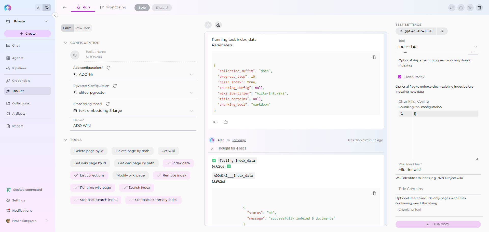
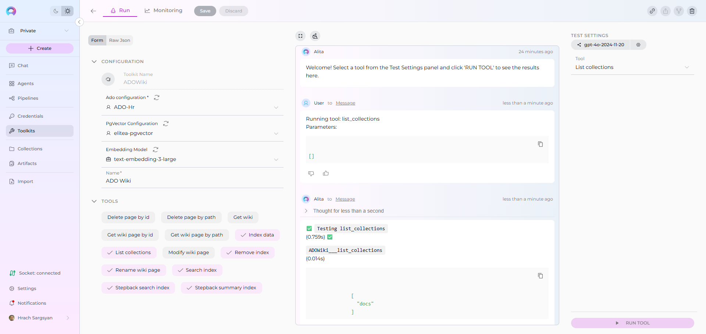
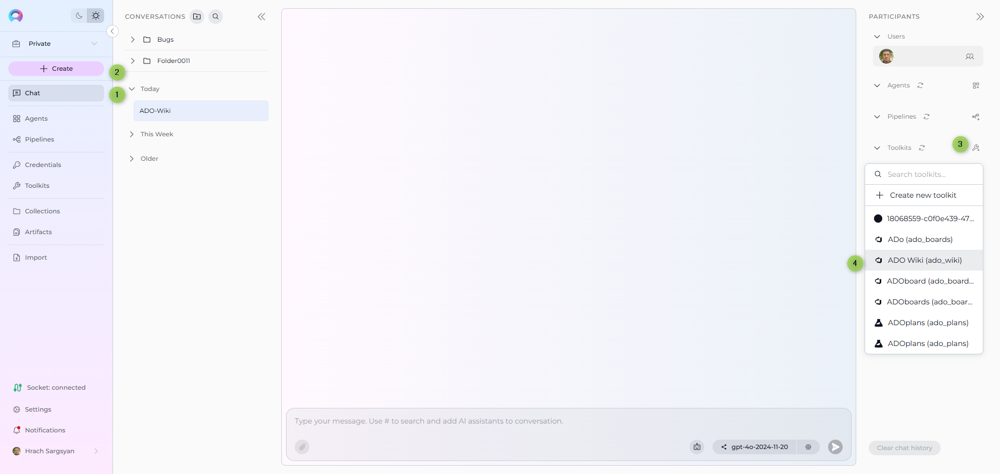
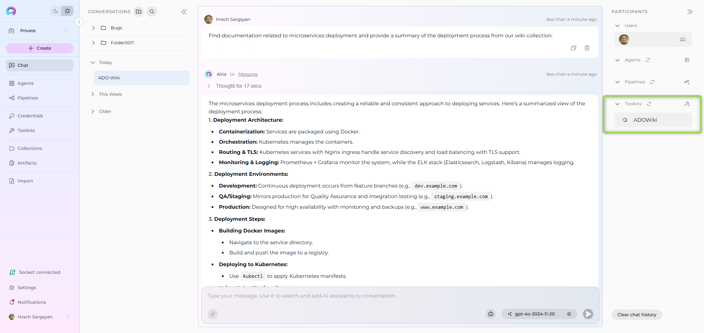
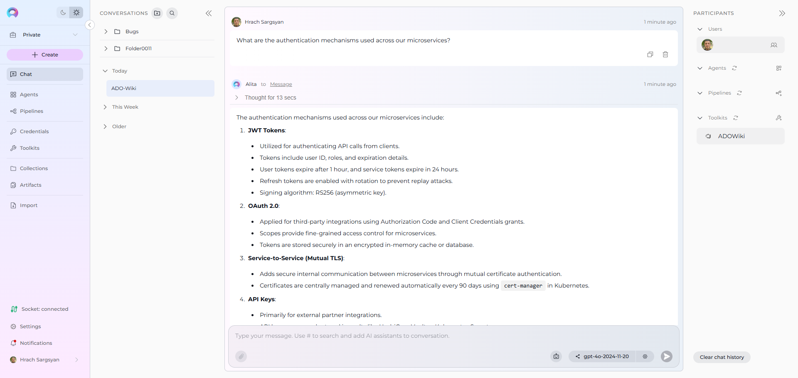

# Index ADO Wiki Data

!!! warning "Availability"
    Indexing tools are available in the [Next environment](https://next.elitea.ai) (Release 1.7.0) and replace legacy Datasources/Datasets. For context, see [Release Notes 1.7.0](../../release-notes/rn_current.md#indexing-tools-replacement-for-datasets) and the [Indexing Overview](./indexing-overview.md).

## Overview

ADO Wiki indexing allows you to create searchable indexes from your Azure DevOps wiki content:

- **Wiki Pages**: Documentation, procedures, knowledge articles, and technical specifications
- **Project Wikis**: Organization-specific wikis with project documentation and standards
- **Code Wikis**: Repository-linked wikis containing development documentation and guides
- **Page Hierarchies**: Nested page structures, categories, and topic organization
- **Page Metadata**: Creation dates, modification history, author information, and page properties

**What you can do with indexed ADO Wiki data:**

- **Semantic Search**: Find documentation and procedures across projects using natural language queries
- **Context-Aware Chat**: Get AI-generated answers from your wiki content with citations to specific pages
- **Cross-Project Discovery**: Search across multiple ADO wikis and project documentation
- **Knowledge Management**: Transform scattered documentation into searchable organizational knowledge
- **Documentation Analysis**: Analyze documentation patterns, gaps, and content quality for improvement

**Common use cases:**

- Finding existing documentation before creating new content to avoid duplication
- Onboarding new team members by allowing them to ask questions about processes and standards
- Analyzing documentation coverage gaps and identifying areas needing additional content
- Support teams searching for troubleshooting guides and standard operating procedures
- Project managers extracting insights from team documentation for reporting and process improvement

---

## Prerequisites

Before indexing ADO Wiki data, ensure you have:

1. **ADO Credential**: An Azure DevOps personal access token with [authentication credentials](../how-to-use-credentials.md#ado-azure-devops-credential-setup) configured in ELITEA
2. **Vector Storage**: PgVector selected in Settings → [AI Configuration](../../menus/settings/ai-configuration.md)
3. **Embedding Model**: Selected in AI Configuration (defaults available) → [AI Configuration](../../menus/settings/ai-configuration.md)
4. **ADO Wiki Toolkit**: Configured with your Azure DevOps organization details and credentials

### Required Permissions

Your ADO credential needs appropriate permissions based on what you want to index:

**For Content Access:**

- Read access to Azure DevOps projects and wikis
- Permission to view the specific wikis you want to index

**For Comprehensive Indexing:**

- Access to view wiki page content and metadata
- Permission to view both project wikis and code wikis (based on your requirements)
- Access to specific projects containing the wikis you want to index

**Authentication Method:**

- **ADO Personal Access Token**: Token generated in Azure DevOps with appropriate wiki read permissions

---

## Step-by-Step: Creating an ADO Credential

1. **Generate ADO Personal Access Token** in your Azure DevOps account (User Settings → Personal Access Tokens → New Token)
2. **Create Credential in ELITEA**: Navigate to **Credentials** → **+ Create** → **ADO** → enter details and save

!!! info "Detailed Instructions"
    For complete credential setup steps including personal access token generation and security best practices, see:
    
    - [Create a Credential](../../getting-started/create-credential.md)
    - [ADO Credential Setup](../how-to-use-credentials.md#ado-azure-devops-credential-setup)
    - [ADO Wiki Toolkit Integration Guide](../../integrations/toolkits/ado_wiki_plan_board_toolkit.md)

---

## Step-by-Step: Configure ADO Wiki Toolkit

1. **Create Toolkit**: Navigate to **Toolkits** → **+ Create** → **ADO Wiki**
2. **Configure Settings**: Set ADO organization URL, project, and assign your ADO credential
3. **Enable Tools**: Select `Index Data`, `List Collections`, `Search Index`, `Stepback Search Index`, `Stepback Summary Index`, and `Remove Index` tools
4. **Save Configuration**

### Tool Overview:
   - **Index Data**: Creates searchable indexes from ADO wiki pages and documentation
   - **List Collections**: Lists all available collections/indexes to verify what's been indexed
   - **Search Index**: Performs semantic search across indexed content using natural language queries
   - **Stepback Search Index**: Advanced search that breaks down complex questions into simpler parts for better results
   - **Stepback Summary Index**: Generates summaries and insights from search results across indexed content
   - **Remove Index**: Deletes existing collections/indexes when you need to clean up or start fresh

### Configuration Settings:

| Setting | Description | Example Value |
|---------|-------------|---------------|
| **Organization URL** | Azure DevOps organization URL | `https://dev.azure.com/yourorg/` |
| **Project** | Azure DevOps project name | `MyProject` |
| **Token** | ADO personal access token for authentication | Select from Secrets or enter directly |

!!! note "ADO URL Format"
    Use the complete Azure DevOps organization URL including `https://` and your organization name (e.g., `https://dev.azure.com/yourorg/`).

!!! info "Detailed Instructions"
    For complete toolkit configuration including URL setup and authentication options, see:
    
    - [Toolkits Menu](../../menus/toolkits.md)
    - [ADO Wiki Toolkit Integration Guide](../../integrations/toolkits/ado_wiki_plan_board_toolkit.md)

---

## Step-by-Step: Index ADO Wiki Data

### Wiki Page Indexing (from Toolkit)

1. **Open Toolkit Test Settings:**
     - Navigate to your ADO Wiki toolkit's detail page
     - In the **Test Settings** panel (right side), select a model (e.g., `gpt-4o`)

2. **Configure Index Data Tool:**

     - From the tool dropdown, select **"Index Data"**
     - Configure the following parameters:

     | Parameter | Description | Example Value |
     |-----------|-------------|---------------|
     | **Wiki Identifier** * | Wiki identifier to index data from (required) | `ProjectName.wiki` or `RepoName.wiki` |
     | **Collection Suffix** * | Suffix for collection name (max 7 chars) | `docs` or `wiki` |
     | **Progress Step** | Step size for progress reporting during indexing | `10` (default) |
     | **Clean Index** | Remove existing index data before re-indexing | ✓ (checked) or ✗ (unchecked) |
     | **Title Contains** | Optional filter to include only pages with titles containing this string | `API` or leave empty |
     | **Chunking Tool** | Method for splitting content into chunks | `markdown` (default) |
     | **Chunking Config** | Configuration settings for content chunking | `{"chunk_size": 4000, "chunk_overlap": 200}` |

3. **Run ADO Wiki Indexing:**
     - Click **"Run Tool"** 
     - Wait for completion (may take several minutes for large wikis)
     - Check the output for success confirmation or error messages

### Real-Life Example: Indexing Development Team Documentation

**Scenario**: You have a development team wiki in Azure DevOps containing project documentation, API guides, and troubleshooting information. You want to make this documentation searchable for your team.

**Indexing Steps:**

1. **Configure ADO Wiki Toolkit:**
     - Organization URL: `https://dev.azure.com/mycompany/`
     - Project: `WebApp`
     - Token: Your ADO Personal Access Token

2. **Index the Project Wiki:**
     - Wiki Identifier: `WebApp.wiki`
     - Collection Suffix: `docs`
     - Progress Step: `10`
     - Clean Index: ✓ (checked for fresh start)
     - Title Contains: (leave empty to index all pages)
     - Chunking Tool: `markdown`
     - Chunking Config: `{"chunk_size": 4000, "chunk_overlap": 200}`

3. **Run the indexing:**
     - Click **"Run Tool"**
     - Wait for completion (progress reported every 10 pages)
     - Verify success in output logs

 

4. **Test your indexed data:**
     - Use "List Collections" tool to confirm `docs` collection exists

 

**Result**: Your team can now ask natural language questions about your documentation and get instant answers with citations to specific wiki pages.

**After indexing, you can search for:**

- **API documentation**: *"Find all REST API endpoints for user authentication"*
- **Development procedures**: *"What are the deployment steps for the payment service?"*
- **Architecture information**: *"Show me the microservices communication patterns"*
- **Troubleshooting guides**: *"How do we debug database connection issues?"*
- **Setup instructions**: *"What are the local development environment requirements?"*

---

## Search and Chat with Indexed Data

Once your ADO Wiki data is indexed, you can use the toolkit to search and interact with your documentation in multiple ways:

### Using Toolkit in Conversations and Agents

Your ADO Wiki toolkit can be used in two main contexts:

1. **In Conversations**: Add the toolkit as a participant to ask questions and search your indexed wiki data
2. **In Agents**: Include the toolkit when creating AI agents to give them access to your documentation

**How to use:**

- **Start a New Conversation or Create an Agent**
- **Add Toolkit as Participant**: Select your ADO Wiki toolkit from the available toolkits
- **Ask Natural Language Questions**: The toolkit will automatically search your indexed data and provide relevant answers with citations

### Using Indexed ADO Wiki Data in Conversations

Let's walk through a complete example of querying indexed documentation:

**Step 1: Add toolkit to a conversation and start asking questions:**

   - Navigate to **Chat** → **+ Create**
   - In the participants section click + to add Toolkit
   - Select your ADO Wiki toolkit from the available toolkits list

 

**Step 2: Start comprehensive analysis with your indexed documentation**

  * **User Request:** "Find all documentation related to microservices deployment and provide a summary of the deployment process from our wiki collection."
   
  * **ADO Wiki Toolkit:** "Based on your indexed wiki pages, here's a comprehensive summary of microservices deployment:

    **Deployment Documentation Found:**

    1. **CI/CD Pipeline Setup**: Complete guide for automated deployment workflows
    2. **Environment Configuration**: Development, staging, and production environment setup
    3. **Container Deployment**: Docker containerization and Kubernetes deployment procedures
    4. **Database Migration**: Scripts and procedures for database schema updates
    5. **Service Discovery**: Configuration for service registration and discovery mechanisms
    
    **Deployment Process Summary:**

    **Pre-Deployment:**

      - Code review and merge to main branch
      - Automated testing pipeline execution
      - Security scanning and quality gates validation
    
    **Deployment Stages:**

      - **Development**: Automatic deployment on code commit
      - **Staging**: Manual approval with integration testing
      - **Production**: Blue-green deployment with rollback capabilities
    
    **Post-Deployment:**

      - Health checks and monitoring validation
      - Performance metrics verification
      - Service mesh configuration updates

    **Key Configuration Files:**

      - `docker-compose.yml`: Container orchestration
      - `deployment.yaml`: Kubernetes deployment manifests
      - `pipeline.yml`: CI/CD pipeline configuration

    **Rollback Procedures:**

      - Automated rollback triggers on health check failures
      - Manual rollback commands for emergency situations
      - Database rollback scripts for schema changes

    [Citations: Deployment Guide v2.1, Container Best Practices, Production Runbook]"

    

### Advanced Search Examples

**Searching for specific technical information:**

  * **User:** "What are the authentication mechanisms used across our microservices?"
  
  * **ADO Wiki Toolkit:** "According to the indexed documentation, your microservices use a multi-layered authentication approach:

    **Authentication Methods:**

    1. **JWT Tokens**: Primary authentication for API calls
    2. **OAuth 2.0**: Third-party service integration
    3. **Service-to-Service**: Mutual TLS authentication
    4. **API Keys**: External partner integration

    **Implementation Details:**

    - Token expiration: 1 hour for user tokens, 24 hours for service tokens
    - Refresh token rotation: Enabled for enhanced security
    - Certificate management: Automated renewal via cert-manager

    [Citations: Authentication Architecture, API Security Guide, Service Mesh Configuration]"

    

**Finding troubleshooting information:**

  * **User Request:** "How do we handle database connection timeouts in the order service?"
  
  * **ADO Wiki Toolkit:** "Based on the troubleshooting documentation for the order service:

    **Database Connection Timeout Resolution:**

    **Immediate Actions:**

    1. Check connection pool utilization in monitoring dashboard
    2. Verify database server health and resource usage
    3. Review recent deployment changes that might affect connections

    **Configuration Adjustments:**

    - Connection timeout: Increase from 30s to 60s if needed
    - Pool size: Adjust based on load patterns (current: min=5, max=20)
    - Retry logic: Exponential backoff with 3 retry attempts

    **Monitoring and Alerts:**

    - Connection pool metrics in Grafana dashboard
    - Alert thresholds: >80% pool utilization
    - Log aggregation in ELK stack for pattern analysis

    [Citations: Order Service Troubleshooting Guide, Database Configuration, Monitoring Setup]"

---

## Managing Your ADO Wiki Indexes

### Updating Indexed Content

When your wiki content changes significantly:

1. **Re-run Index Data tool** with the same parameters to update existing indexes
2. **Use Clean Index option** to completely refresh the collection with current content
3. **Monitor indexing progress** through the progress step reporting

### Best Practices

**Collection Organization:**

- Use descriptive collection suffixes that reflect content types
- Create separate collections for different teams or purposes
- Consider wiki scope when planning collection structure

**Content Filtering:**

- Use `Title Contains` parameter for focused indexing
- Index frequently updated content separately for easier maintenance
- Consider page hierarchy when organizing collections

**Performance Optimization:**

- Index during low-usage periods for large wikis
- Use appropriate chunking settings for your content types
- Monitor vector storage usage and clean up unused collections

---

## Troubleshooting

### Common Issues

**Authentication Errors:**

- Verify ADO personal access token has wiki read permissions
- Check organization URL format and project name accuracy
- Ensure token hasn't expired

**Wiki Not Found:**

- Confirm wiki identifier format (`ProjectName.wiki` for project wikis)
- Verify you have access to the specified project and wiki
- Check if the wiki exists and contains pages

**Indexing Failures:**

- Review wiki content for formatting issues that might cause parsing errors
- Check for very large pages that might exceed processing limits
- Verify vector storage configuration and available space

### Poor Search Results

**Problem**: Search queries return irrelevant or no results

**Solutions:**

  - Try more specific, detailed search queries related to your documentation content
  - Adjust the **Cut Off** score (lower for more results, higher for precision)
  - Use Stepback Search Index for complex documentation questions
  - Verify the Collection Suffix targets the right dataset

### Getting Help

For additional support with ADO Wiki indexing:

1. **Check Vector Storage**: Verify PgVector is properly configured and accessible
2. **Review Toolkit Configuration**: Ensure all required fields are properly set
3. **Test with Small Dataset**: Start with a limited wiki or filtered content
4. **Contact Support**: Reach out to ELITEA support with specific error messages and configuration details

---

!!! info "Related Documentation"
    For additional information and detailed setup instructions, see:  

    - **[Indexing Overview](./indexing-overview.md)** - *Complete guide to ELITEA's indexing system and capabilities*
    - **[Indexing Tools](./indexing-tools.md)** - *Detailed reference for all indexing tools and parameters*
    - **[ADO Wiki Toolkit Guide](../../integrations/toolkits/ado_wiki_plan_board_toolkit.md)** - *Comprehensive guide to the ADO Wiki Toolkit and its capabilities*
    - **[How to Use Credentials](../how-to-use-credentials.md#ado-azure-devops-credential-setup)** - *ADO credential setup and management*    
    - **[AI Configuration](../../menus/settings/ai-configuration.md)** - *Set up vector storage and embedding models for indexing*
    - **[Toolkits Menu](../../menus/toolkits.md)** - *General toolkit configuration and management*
    - **[Chat Menu](../../menus/chat.md)** - *Create conversations and add toolkits as participants*
    - **[Agents Menu](../../menus/agents.md)** - *Create AI agents with access to your indexed ADO Wiki data*

---

