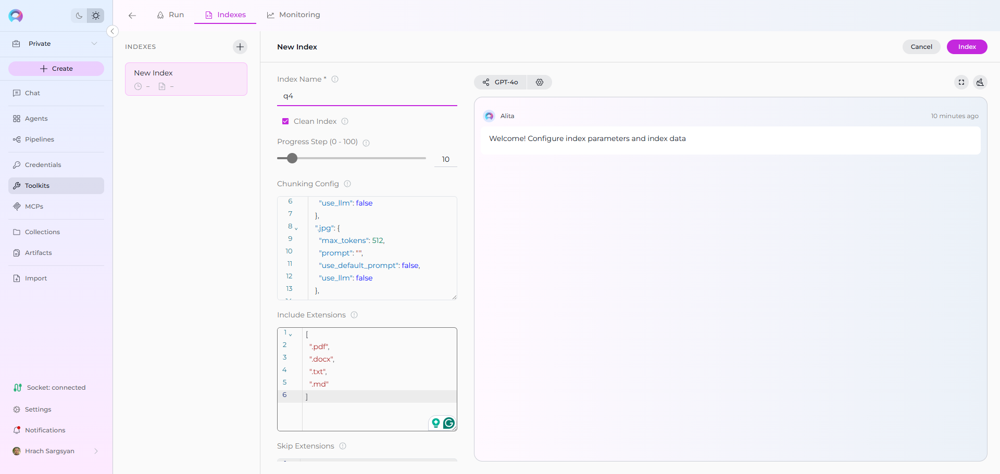
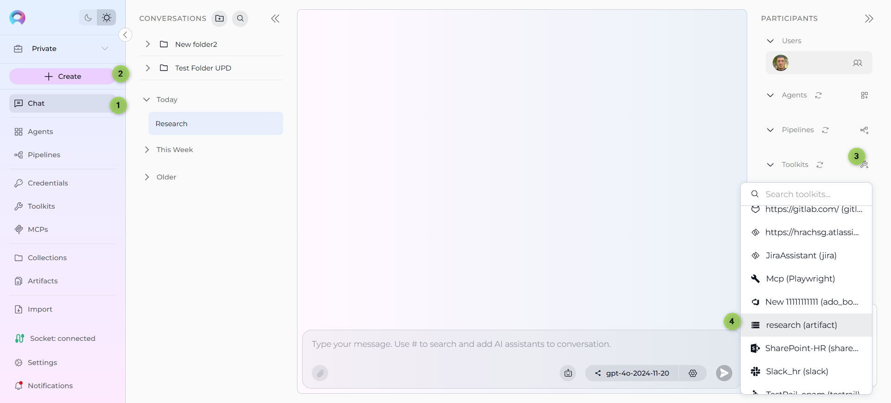
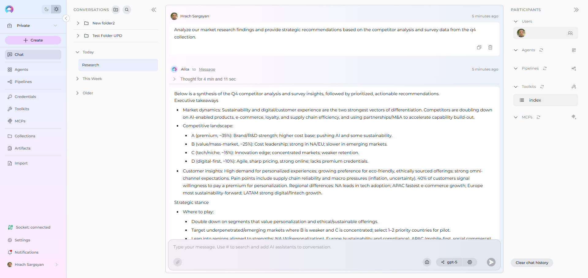
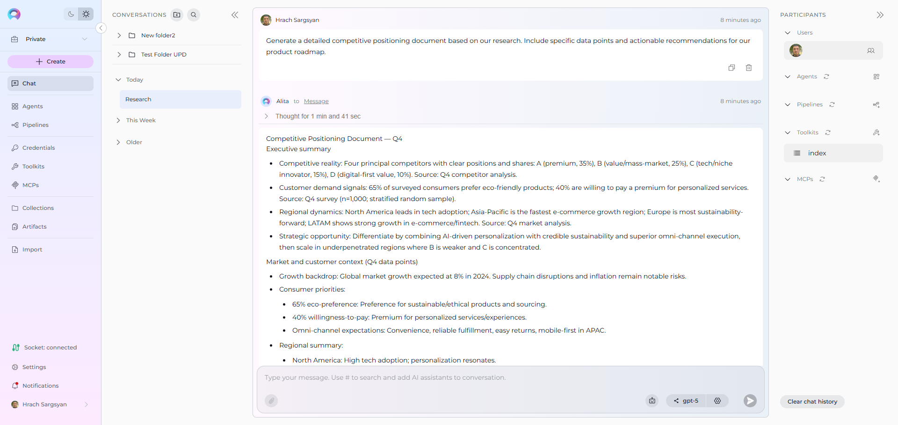

# Index Artifacts Data

!!! warning "Availability"
    Indexing tools are available in the [Next environment](https://next.elitea.ai) (Release 1.7.0) and replace legacy Datasources/Datasets. For context, see [Release Notes 1.7.0](../../release-notes/rn_current.md#indexing-dedicated-toolkit-indexes-tab) and the [Indexing Overview](./indexing-overview.md).


This guide provides a complete step-by-step walkthrough for indexing Artifacts data and then searching or chatting with the indexed content using ELITEA's AI-powered tools.

!!! info "Primary Interface"
    Indexing operations are performed through the **Indexes** interface within Toolkit Configuration. This interface provides comprehensive index management with visual status indicators, real-time progress monitoring, and integrated search capabilities. For detailed information, see [How to create and use indexes](./using-indexes-tab-interface.md).

## Overview

Artifacts indexing allows you to create searchable indexes from files stored in your project's Artifact buckets:

- **Document Files**: Text files, Word documents, PDFs, and other document formats
- **Data Files**: CSV, Excel, JSON files and structured data formats
- **Code Files**: Source code, configuration files, and technical documentation
- **Research Assets**: Analysis reports, findings, and research documentation
- **Temporary Storage**: Processing results, intermediate files, and workflow outputs

**What you can do with indexed Artifacts data:**

- **Semantic Search**: Find specific content across multiple files using natural language queries
- **Context-Aware Chat**: Get AI-generated answers from your file content with citations
- **Cross-File Discovery**: Search across all files in your Artifact buckets for comprehensive insights
- **Content Analysis**: Analyze patterns, themes, and information across your stored documents
- **Knowledge Extraction**: Transform file content into searchable organizational knowledge

**Common use cases:**

- Indexing research documentation and analysis reports for quick information retrieval
- Making project deliverables and documentation searchable for team collaboration
- Creating searchable knowledge bases from uploaded files and documents
- Analyzing data files and reports to extract insights and answer specific questions
- Organizing and finding content in temporary storage used during AI workflows

!!! info "Migration from Datasources"
    In previous releases, there was a **Source type: File** option in Datasources. Now, Datasources have been removed from ELITEA, and users can perform the same action through Artifacts.
    
    **How to migrate from Datasources to Artifacts:**
    
    1. **Upload your files**: Navigate to **ELITEA** → **Artifacts** and upload your files to a bucket (or drag & drop them directly)
    2. **Create Artifact Toolkit**: Go to **Toolkits** → **+ Create** → **Artifact** and configure with your bucket name
    3. **Index your data**: Use the "Index Data" tool from the Artifact Toolkit to create searchable indexes
    4. **Search and chat**: Use the toolkit in conversations or agents to query your indexed content
    
    This provides the same file indexing capabilities as the previous Datasources system with improved performance and integration.

---

## Prerequisites

Before indexing Artifacts data, ensure you have:

1. **No Credential Required**: Unlike other toolkits, Artifacts indexing doesn't require external credentials
2. **Vector Storage**: PgVector selected in Settings → [AI Configuration](../../menus/settings/ai-configuration.md)
3. **Embedding Model**: Selected in AI Configuration (defaults available) → [AI Configuration](../../menus/settings/ai-configuration.md)
4. **Artifact Toolkit**: Configured with your bucket name, files uploaded to your Artifact buckets, and **Index Data tool enabled**
5. **Files in Bucket**: At least one file uploaded to the Artifact bucket you want to index

!!! warning "Requirements"
    The **Indexes** interface requires:
    - PgVector and Embedding Model configured at the project level
    - The **Index Data** tool enabled in your toolkit configuration
    
    Complete both project-level setup and toolkit configuration to access indexing functionality.

### File Types Supported

The Artifact Toolkit supports indexing various file formats:

**Document Formats:**
- Text files (`.txt`, `.md`)
- Microsoft Word documents (`.docx`)
- PDF files (`.pdf`)
- Rich text format (`.rtf`)

**Data Formats:**
- CSV files (`.csv`)
- Excel spreadsheets (`.xlsx`, `.xls`)
- JSON files (`.json`)
- XML files (`.xml`)

**Code & Configuration:**
- Source code files (`.py`, `.js`, `.java`, `.cpp`, etc.)
- Configuration files (`.yml`, `.yaml`, `.ini`, `.conf`)
- Documentation (`.md`, `.rst`)

---

## Step-by-Step: Uploading Files to Artifacts

Before indexing, you need files in your Artifact buckets. You can upload files through:

### Option 1: ELITEA Artifacts Menu

1. **Navigate to Artifacts**: Click **ELITEA** → **Artifacts** in the sidebar
2. **Create or Select Bucket**: Create a new bucket or select an existing one
3. **Upload Files**: 
     - **Click Upload**: Click **Upload** button and select your files from the file browser
     - **Drag & Drop**: Alternatively, drag and drop files directly into the bucket area
4. **Verify Upload**: Confirm files are listed in the bucket

### Option 2: Using Artifact Toolkit Tools

1. **Configure Agent with Artifact Toolkit**: Set up an agent with Artifact tools enabled
2. **Use Create File Tool**: Create text-based files directly in the bucket

!!! info "Bucket Management"
    For detailed instructions on managing Artifact buckets and files, see:
    
    - [ELITEA Artifacts Menu](../../menus/artifacts.md)
    - [Artifact Toolkit Guide](../../integrations/toolkits/artifact_toolkit.md)

---

## Step-by-Step: Configure Artifact Toolkit

1. **Create Toolkit**: Navigate to **Toolkits** → **+ Create** → **Artifact**
2. **Configure Basic Settings**: 
     - Set bucket name (no credentials required)
     - Configure PgVector connection for vector storage
     - Select embedding model for content processing
3. **Enable Tools**: Select `Index Data`, `List Collections`, `Search Index`, `Stepback Search Index`, `Stepback Summary Index`, and `Remove Index` tools
4. **Save Configuration**

!!! warning "Required Tool"
    The **Index Data** tool must be enabled for indexing functionality to be available. Without this tool, you cannot access the indexing interface.

### Tool Overview:
   - **Index Data**: Creates searchable indexes from files stored in your Artifact bucket
   - **List Collections**: Lists all available collections/indexes to verify what's been indexed
   - **Search Index**: Performs semantic search across indexed content using natural language queries
   - **Stepback Search Index**: Advanced search that breaks down complex questions into simpler parts for better results
   - **Stepback Summary Index**: Generates summaries and insights from search results across indexed content
   - **Remove Index**: Deletes existing collections/indexes when you need to clean up or start fresh

### Configuration Settings:

| Setting | Description | Example Value |
|---------|-------------|---------------|
| **Bucket** | Name of the Artifact bucket containing files to index | `research-docs` or `project-files` |
| **PgVector Configuration** | Vector database connection for storing embeddings | Select existing or create new PgVector config |
| **Embedding Model** | AI model for converting text to vector embeddings | `text-embedding-3-small` or `text-embedding-ada-002` |


!!! note "Bucket Naming"
    Use descriptive bucket names that reflect the content type. Underscores (`_`) are prohibited and should be replaced with hyphens (`-`).

!!! info "Detailed Instructions"
    For complete toolkit configuration, see:
    
    - [Toolkits Menu](../../menus/toolkits.md)
    - [Artifact Toolkit Integration Guide](../../integrations/toolkits/artifact_toolkit.md)

---

## Step-by-Step: Index Artifacts Data

!!! note "Alternative Indexing Method"
    While this guide focuses on the **Indexes** interface (recommended), you can also index data using the **Test Settings** panel in your toolkit configuration. The Indexes interface provides better visual feedback, progress monitoring, and index management capabilities.

### Step 1: Access the Interface

1. **Navigate to Toolkits**: Go to **Toolkits** in the main navigation
2. **Select Your Artifact Toolkit**: Choose your configured Artifact toolkit from the list
3. **Open Indexes Tab**: Click on the **Indexes** tab in the toolkit detail view

If the tab is disabled or not visible, verify that:
- PgVector and Embedding Model are configured in Settings → AI Configuration
- The **Index Data** tool is enabled in your toolkit configuration

### Step 2: Create a New Index

1. **Click Create New Index**: In the Indexes sidebar, click the **+ Create New Index** button
2. **New Index Form**: The center panel displays the new index creation form

### Step 3: Configure Index Parameters

Fill in the required and optional parameters for your Artifact bucket:

| Parameter | Description | Example Value | Required |
|-----------|-------------|---------------|----------|
| Index Name | Suffix for collection name (max 7 chars) | `docs` or `files` | ✓ |
| Clean Index | Remove existing index data before re-indexing | ✓ (checked) or ✗ (unchecked) | ✗ |
| Include Extensions | File extensions to include in indexing | `[".pdf", ".docx", ".txt", ".md"]` | ✗ |
| Skip Extensions | File extensions to exclude from indexing | `[".png", ".jpg", ".zip", ".exe"]` | ✗ |
| Progress Step | Progress reporting interval | `10` (default) | ✗ |
| Chunking Config | Document chunking configuration | `{}` (default) | ✗ |

!!! info "Chunking Configuration"
    **Chunking** determines how large files are split into smaller, searchable pieces. The default settings work well for most content, but you can customize chunking for specific needs:
    
    **Default Chunking**: Leave empty `{}` for automatic chunking based on file type
    
    **Custom Chunking Examples**:
    ```json
    {"chunk_size": 1000, "chunk_overlap": 200}
    ```
        - **chunk_size**: Maximum characters per chunk (default: varies by file type)
        - **chunk_overlap**: Characters to overlap between chunks for context preservation
    
    **When to customize**:
      - **Large documents**: Increase chunk_size for better context retention
      - **Technical content**: Adjust overlap to preserve code blocks or formulas
      - **Search precision**: Smaller chunks for more precise search results

### Step 4: Start Indexing

1. **Form Validation**: The **Index** button remains inactive until all required fields are filled
2. **Review Configuration**: Verify all parameters are correct
3. **Click Index Button**: Start the indexing process
4. **Monitor Progress**: Watch real-time updates with visual indicators:
      - 🔄 **In Progress**: Indexing is currently running
      - ✅ **Completed**: Indexing finished successfully
      - ❌ **Failed**: Indexing encountered an error


### Step 5: Verify Index Creation

Once indexing completes:

1. **Check Index Status**: Verify the index shows ✅ **Completed** status in the sidebar
2. **Review Index Information**: Click on your index to see:
      - **Document Count**: Number of indexed files
      - **Last Updated**: Timestamp of indexing completion
      - **Index Name**: Your specified collection suffix

### Real-Life Example: Indexing Research Documentation

**Scenario**: You have a research project with multiple analysis reports, data files, and documentation stored in an Artifact bucket called `research-analysis`. You want to make all this content searchable.

**Files in bucket:**

- `market_analysis_2024.docx` - Market research findings
- `competitor_research.pdf` - Competitive analysis report  
- `survey_data.csv` - Raw survey responses
- `methodology.md` - Research methodology documentation
- `findings_summary.txt` - Key findings and insights

**Indexing Steps:**

1. **Configure Artifact Toolkit:**
     - Bucket name: `research-analysis`
     - Enable all indexing tools

2. **Index the content:**
     - Navigate to **Toolkits** → Select your Artifact toolkit → Click **Indexes** tab
     - Click **+ Create New Index** button
     - Configure indexing parameters:
         - **Index Name**: `q4` (for Q4 research)
         - **Clean Index**: ✓ (checked for fresh start)
     - Click **Index** button to start indexing
     - Monitor progress with visual indicators (🔄 In Progress → ✅ Completed)

3. **Verify indexing:**
     - Check that your index appears in the sidebar with ✅ **Completed** status
     - Review document count and collection name
     - Collection name: `q4`

**After indexing, you can:**

- Search across all research files: *"What were the main competitor advantages identified?"*
- Find specific data points: *"What percentage of survey respondents preferred our solution?"*
- Get comprehensive insights: *"Summarize the key findings from the market analysis"*
- Cross-reference information: *"How does the survey data support the competitive analysis conclusions?"*

---

## Using Search Tools with Indexed Data

Once your Artifacts data is indexed, you can search and interact with it directly through the interface:

### Accessing Search Functionality

1. **Select Your Index**: Click on your completed index from the sidebar
2. **Navigate to Run Tab**: Click the **Run** tab in the center panel
3. **Choose Search Tool**: Select from available search tools in the dropdown:
      - **Search Index**: Basic semantic search across indexed content
      - **Stepback Search Index**: Advanced search that breaks down complex questions
      - **Stepback Summary Index**: Search with automatic summarization of results

### Running a Search

1. **Enter Your Query**: Type your search query (e.g., "What are the key findings from the market research?")
2. **Configure Parameters**: Adjust optional settings like filters and model configuration
3. **Click Run**: Execute the search
4. **View Results**: Results appear in the integrated chat interface on the right panel

---

## Search and Chat with Indexed Data

Once your Artifacts data is indexed, you can use the toolkit to search and interact with your content in multiple ways:

### Using Toolkit in Conversations and Agents

Your Artifact toolkit can be used in two main contexts:

1. **In Conversations**: Add the toolkit as a participant to ask questions and search your indexed Artifacts data
2. **In Agents**: Include the toolkit when creating AI agents to give them access to your file data

**How to use:**

- **Start a New Conversation or Create an Agent**
- **Add Toolkit as Participant**: Select your Artifact toolkit from the available toolkits
- **Ask Natural Language Questions**: The toolkit will automatically search your indexed data and provide relevant answers with citations

### Using Indexed Artifacts in Conversations

Let's walk through a complete example of indexing and using a research team's Artifacts project:

**Step 1: Add toolkit to a conversation and start asking questions:**

   - Navigate to **Chat** → **+ Create**
   - In the participants section click + to add Toolkit
   - Select your Artifact toolkit from the available toolkits list

   

**Step 2: Start comprehensive analysis with your indexed research content**

  * **User Request:** "Analyze our market research findings and provide strategic recommendations based on the competitor analysis and survey data from the q4 collection."
   
  * **Artifact Toolkit:** "Based on your indexed research files, here's a comprehensive analysis of your market research findings with strategic recommendations:

    **Market Research Key Findings:**

    1. **Market Growth**: Target market expanded 23% year-over-year, reaching $4.2B total addressable market
    2. **Customer Segments**: Three distinct segments identified with different needs and price sensitivities
    3. **Adoption Trends**: 67% shift toward cloud-based solutions, 45% increase in mobile usage
    4. **Pain Points**: Integration complexity (78% concern) and security requirements (65% concern)
    
    **Competitive Landscape Analysis:**

    1. **Market Leaders**: Competitor A (32% share) focuses on enterprise, Competitor B (28% share) leads in SMB
    2. **Feature Gaps**: AI automation lacking across all competitors, opportunity for differentiation
    3. **Pricing Analysis**: Market average $89/user/month, premium tier at $150/user/month
    4. **Customer Satisfaction**: Industry average 3.8/5, top performer at 4.2/5
   
    **Strategic Recommendations:**

    1. **Product Strategy**: Prioritize AI-powered automation features for competitive advantage
    2. **Market Entry**: Target mid-market segment (underserved by current competitors)
    3. **Pricing Position**: Premium pricing justified by AI features and superior support
    4. **Go-to-Market**: Focus on integration simplicity and security compliance messaging
   
   *Sources: market_analysis_2024.docx (Section: Growth Trends), competitor_research.pdf (Chapter: Market Share Analysis), survey_data.csv (Question: Feature Priorities)*"

   
   
  * **User Request:** "Generate a detailed competitive positioning document based on our research. Include specific data points and actionable recommendations for our product roadmap."
   
  * **Artifact Toolkit:** "Based on your indexed research documentation, here's a comprehensive competitive positioning document with specific data points and product roadmap recommendations:

    **COMPETITIVE POSITIONING DOCUMENT**

    **Executive Summary**
    Our analysis of indexed research data reveals significant market opportunities in AI-powered automation and mid-market solutions, positioning us for 35%+ market share capture.

    **1. Market Landscape Analysis**

     **Market Size & Growth:**
     - Total Addressable Market: $4.2B (23% YoY growth)
     - Serviceable Market: $1.8B (our target segments)
     - Expected CAGR: 28% through 2027

     **Customer Segmentation:**
     - Enterprise (>1000 employees): 34% of market, $150+ budget
     - Mid-Market (100-1000 employees): 42% of market, $50-120 budget  
     - SMB (<100 employees): 24% of market, <$50 budget

    **2. Competitive Analysis Matrix**

     | Competitor | Market Share | Strengths | Weaknesses | Price Range |
     |------------|--------------|-----------|------------|-------------|
     | Competitor A | 32% | Enterprise focus, Security | Limited AI, High complexity | $120-200 |
     | Competitor B | 28% | SMB penetration, Ease of use | Scalability issues | $45-89 |
     | Competitor C | 18% | Feature breadth | Poor support, Integration gaps | $89-150 |

    **3. Product Roadmap Recommendations**

     **Quarter 1-2 Priorities:**
     - AI-powered workflow automation (67% customer demand)
     - Enhanced security compliance features
     - Mid-market integration templates

     **Quarter 3-4 Priorities:**
     - Mobile-first interface redesign
     - Advanced analytics dashboard
     - Enterprise-grade scalability features
   
   *Sources: findings_summary.txt (Strategic Insights), methodology.md (Research Framework), competitor_research.pdf (Detailed Analysis Tables)*"

   

---


## Best Practices

### File Organization

- **Use descriptive bucket names** that reflect content type (e.g., `project-docs`, `research-data`)
- **Organize related files** in the same bucket for cohesive indexing
- **Keep file names meaningful** to improve search relevance and citations

### Indexing Strategy

- **Use clear collection suffixes** to separate different datasets (e.g., `v1`, `prod`, `test`)
- **Clean index periodically** when content changes significantly
- **Monitor indexing output** for file processing errors or warnings

### Search Optimization

- **Use natural language queries** rather than keyword searches
- **Be specific** in your questions for better results
- **Try different search tools** for various use cases:
    - Basic questions: Search Index
    - Complex analysis: Stepback Search Index
    - Overview needs: Stepback Summary Index

### Content Management

- **Update indexes** when adding significant new content to buckets
- **Remove outdated collections** using the Remove Index tool
- **Maintain bucket organization** for easier content discovery

---

## Common Issues and Troubleshooting

### Common Issues and Solutions

**"Indexing interface not visible" or "Tab disabled":**

- Verify PgVector and Embedding Model are configured in Settings → AI Configuration
- Ensure the **Index Data** tool is enabled in your Artifact toolkit configuration
- Check that your toolkit supports indexing (Artifact is supported)
- Refresh the browser page and retry

**"+ Create New Index button not working":**

- Verify all project-level prerequisites are met (PgVector and Embedding Model)
- Check that you have proper permissions for the toolkit
- Ensure the toolkit is properly saved with bucket configuration

### No Files Found During Indexing

**Problem**: Index Data tool reports no files to process

**Solutions:**

- Verify bucket name is spelled correctly in toolkit configuration
- Confirm files are uploaded and visible in the Artifacts menu
- Check that bucket contains supported file formats

### Poor Search Results

**Problem**: Search queries return irrelevant results

**Solutions:**

- Try more specific, detailed search queries
- Adjust the **Cut Off** score (lower for more results, higher for precision)
- Use Stepback Search Index for complex questions
- Verify the Collection Suffix targets the right dataset

### Indexing Fails for Specific Files

**Problem**: Some files fail to process during indexing

**Solutions:**

 - Check file formats are supported
 - Verify files aren't corrupted or password-protected
 - Monitor the progress indicators for specific error messages
- Try re-uploading problematic files

**"Index creation failed" or "Indexing stuck in progress":**

- Check that bucket contains files
- Verify the repository has files matching your criteria
- Monitor the progress indicators for specific error messages

**"No search results returned":**

- Verify the index shows ✅ **Completed** status
- Check that your search query matches the type of content indexed
- Try broader search terms or different search tools (Stepback Search, Stepback Summary)
- Ensure the indexed content contains relevant information

### Collection Not Found

**Problem**: Search tools can't find the specified collection

**Solutions:**

  - Check the index status in the sidebar
  - Verify collection suffix matches what was used during indexing
  - Confirm indexing completed successfully with ✅ **Completed** status
  - Check for typos in collection suffix

---


!!! info "Related Resources"
    - **[Indexing Overview](./indexing-overview.md)** - *Complete guide to ELITEA's indexing system and capabilities*
    - **[Indexing Tools](./indexing-tools.md)** - *Detailed reference for all indexing tools and parameters*
    - **[ELITEA Artifacts Menu](../../menus/artifacts.md)** - *Learn how to manage Artifact buckets and files*
    - **[Artifact Toolkit Guide](../../integrations/toolkits/artifact_toolkit.md)** - *Comprehensive guide to the Artifact Toolkit and its capabilities*
    - **[AI Configuration](../../menus/settings/ai-configuration.md)** - *Set up vector storage and embedding models for indexing*
    - **[Toolkits Menu](../../menus/toolkits.md)** - *General toolkit configuration and management*
    

---

