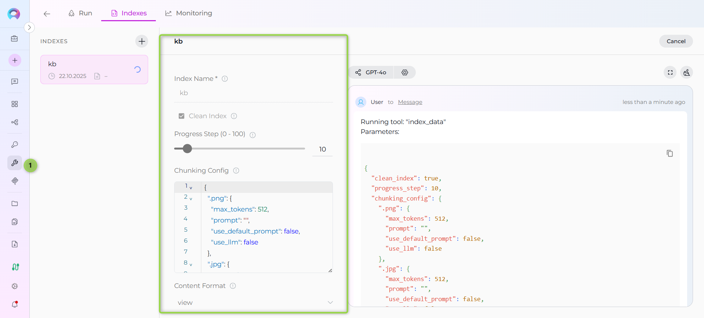
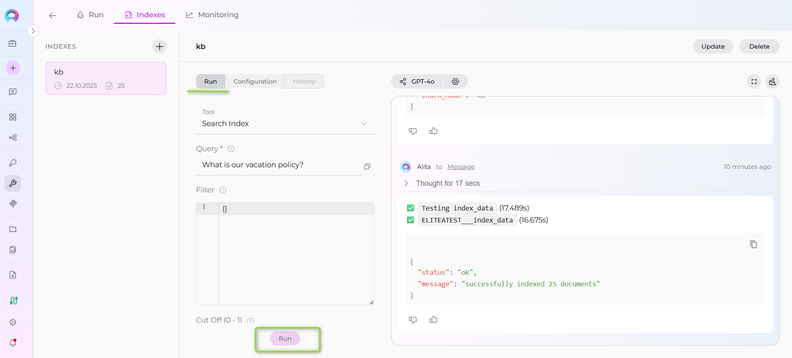
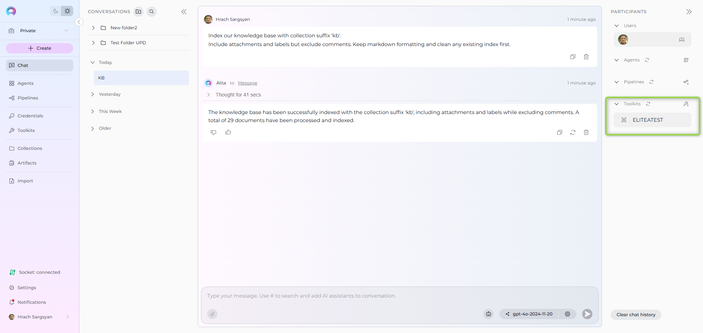
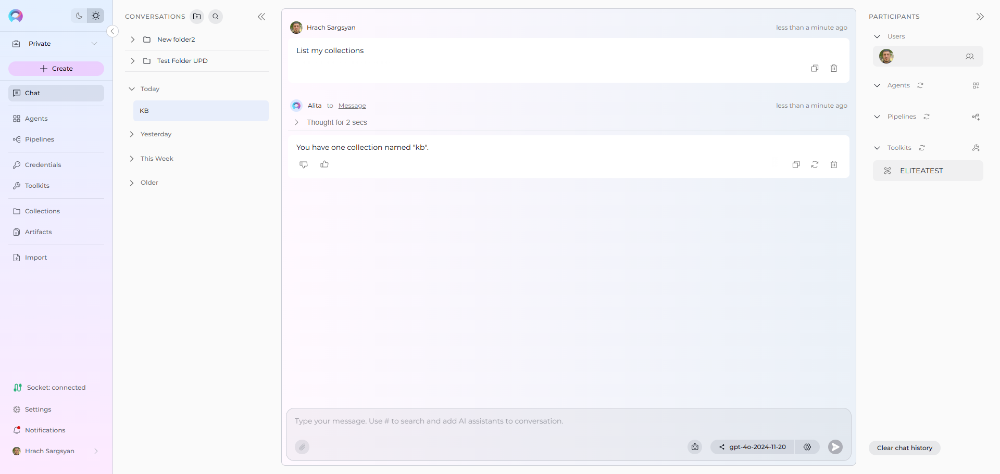
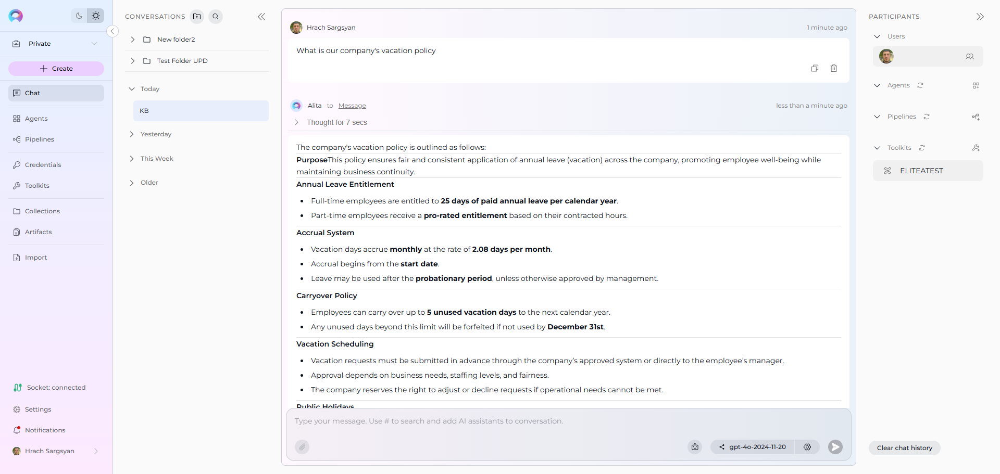
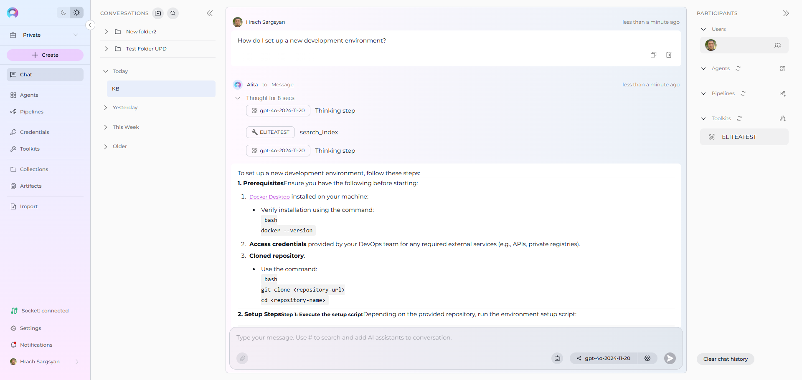

# Index Confluence Data

!!! warning "Availability"
    Indexing tools are available in the [Next environment](https://next.elitea.ai) (Release 1.7.0) and replace legacy Datasources/Datasets. For context, see [Release Notes 1.7.0](../../release-notes/rn_current.md#indexing-tools-replacement-for-datasets) and the [Indexing Overview](./indexing-overview.md).

This guide provides a complete step-by-step walkthrough for indexing Confluence data and then searching or chatting with the indexed content using ELITEA's AI-powered tools.

!!! info "Primary Interface"
    Indexing operations are performed through the **Indexes** interface within Toolkit Configuration. This interface provides comprehensive index management with visual status indicators, real-time progress monitoring, and integrated search capabilities. For detailed information, see [How to create and use indexes](./using-indexes-tab-interface.md).

## Overview

Confluence indexing allows you to create searchable indexes from your Confluence knowledge base content:

- **Pages & Documentation**: Meeting notes, project documentation, how-to guides, and knowledge articles
- **Spaces**: Organized content collections for teams, projects, or departments
- **Labels & Metadata**: Content categorization and tagging systems
- **Attachments**: Document files, images, and other media attached to pages
- **Comments**: User discussions and collaborative input on pages

**What you can do with indexed Confluence data:**

- **Semantic Search**: Find information across your Confluence spaces using natural language queries
- **Context-Aware Chat**: Get AI-generated answers from your knowledge base with citations
- **Cross-Space Discovery**: Search across multiple Confluence spaces and projects
- **Knowledge Extraction**: Transform Confluence content into searchable organizational knowledge
- **Content Analysis**: Analyze patterns, gaps, and relationships in your documentation

**Common use cases:**

- Onboarding new team members by allowing them to ask questions about processes and documentation
- Finding specific procedures, policies, or best practices across your knowledge base
- Generating summaries or explanations from existing documentation
- Support ticket resolution using indexed knowledge articles and FAQ content
- Content audit and analysis to identify documentation gaps or outdated information

---

## Prerequisites

Before indexing Confluence data, ensure you have:

1. **Confluence Credential**: A Confluence API token or [authentication credentials](../how-to-use-credentials.md#confluence-credential-setup) configured in ELITEA
2. **Vector Storage**: PgVector selected in Settings → [AI Configuration](../../menus/settings/ai-configuration.md)
3. **Embedding Model**: Selected in AI Configuration (defaults available) → [AI Configuration](../../menus/settings/ai-configuration.md)
4. **Confluence Toolkit**: Configured with your Confluence instance details, credentials, and **Index Data tool enabled**

!!! warning "Requirements"
    The **Indexes** interface requires:
    - PgVector and Embedding Model configured at the project level
    - The **Index Data** tool enabled in your toolkit configuration
    
    Complete both project-level setup and toolkit configuration to access indexing functionality.

### Required Permissions

Your Confluence credential needs appropriate permissions based on what you want to index:

**For Content Access:**

- Read access to Confluence spaces and pages
- Permission to view the specific spaces you want to index

**For Comprehensive Indexing:**

- Access to view attachments (if including attachments)
- Permission to view comments (if including comments)
- Access to both public and restricted content (based on your requirements)

**Authentication Methods:**

- **Basic Authentication**: Username and API Key
- **Bearer Token**: Confluence API token

---

## Step-by-Step: Creating a Confluence Credential

1. **Generate Confluence API Token** in your Atlassian account (Security → API Tokens)
2. **Create Credential in ELITEA**: Navigate to **Credentials** → **+ Create** → **Confluence** → enter details and save

!!! info "Detailed Instructions"
    For complete credential setup steps including token generation and security best practices, see:
    
    - [Create a Credential](../../getting-started/create-credential.md)
    - [Confluence Credential Setup](../how-to-use-credentials.md#confluence-credential-setup)
    - [Confluence Toolkit Guide](../../integrations/toolkits/confluence_toolkit.md) (Token generation section)

---

## Step-by-Step: Configure Confluence Toolkit

1. **Create Toolkit**: Navigate to **Toolkits** → **+ Create** → **Confluence**
2. **Configure Settings**: Set base URL, space, hosting option, and assign your Confluence credential
3. **Enable Tools**: Select `Index Data`, `List Collections`, `Search Index`, `Stepback Search Index`, `Stepback Summary Index`, and `Remove Index` tools
4. **Save Configuration**

!!! warning "Required Tool"
    The **Index Data** tool must be enabled for indexing functionality to be available. Without this tool, you cannot access the indexing interface.

### Tool Overview:
   - **Index Data**: Creates searchable indexes from Confluence pages and content
   - **List Collections**: Lists all available collections/indexes to verify what's been indexed
   - **Search Index**: Performs semantic search across indexed content using natural language queries
   - **Stepback Search Index**: Advanced search that breaks down complex questions into simpler parts for better results
   - **Stepback Summary Index**: Generates summaries and insights from search results across indexed content
   - **Remove Index**: Deletes existing collections/indexes when you need to clean up or start fresh

!!! info "Detailed Instructions"
    For complete toolkit configuration including space setup and authentication options, see:
    
    - [Toolkits Menu](../../menus/toolkits.md)
    - [Confluence Toolkit Integration Guide](../../integrations/toolkits/confluence_toolkit.md)

---

## Step-by-Step: Index Confluence Data

### Step 1: Access the Interface

1. **Navigate to Toolkits**: Go to **Toolkits** in the main navigation
2. **Select Your Confluence Toolkit**: Choose your configured Confluence toolkit from the list
3. **Open Indexes Tab**: Click on the **Indexes** tab in the toolkit detail view

If the tab is disabled or not visible, verify that:
- PgVector and Embedding Model are configured in Settings → AI Configuration
- The **Index Data** tool is enabled in your toolkit configuration

### Step 2: Create a New Index

1. **Click Create New Index**: In the Indexes sidebar, click the **+ Create New Index** button
2. **New Index Form**: The center panel displays the new index creation form

### Step 3: Configure Index Parameters

Fill in the required and optional parameters for your Confluence space:

| Parameter | Description | Example Value | Required |
|-----------|-------------|---------------|----------|
| Index Name | Suffix for collection name (max 7 chars) | `kb` or `docs` | ✓ |
| Clean Index | Remove existing index data before re-indexing | ✓ (checked) or ✗ (unchecked) | ✗ |
| Chunking Tool | Method for splitting content into chunks | Default chunking or custom | ✗ |
| content_format | The format of the content to be retrieved | `view`, `storage`, `export_view`, `editor`, `anonymous` | ✗ |
| page_ids | List of page IDs to retrieve | `["123456", "789012"]` | ✗ |
| label | Label to filter pages | `"api-docs"` | ✗ |
| cql | CQL query to filter pages | `"space = DEV"` | ✗ |
| limit | Limit the number of results | `10` | ✗ |
| max_pages | Maximum number of pages to retrieve | `1000` | ✗ |
| include_restricted_content | Include restricted content in indexing | ✓ (checked) or ✗ (unchecked) | ✗ |
| include_archived_content | Include archived content in indexing | ✓ (checked) or ✗ (unchecked) | ✗ |
| include_attachments | Include attachments in indexing | ✓ (checked) or ✗ (unchecked) | ✗ |
| include_comments | Include page comments | ✓ (checked) or ✗ (unchecked) | ✗ |
| include_labels | Include page labels | ✓ (checked) or ✗ (unchecked) | ✗ |
| ocr_languages | OCR languages for processing attachments | `eng`, `fra`, `deu` | ✗ |
| keep_markdown_format | Preserve Markdown formatting | ✓ (checked) or ✗ (unchecked) | ✗ |
| keep_newlines | Preserve line breaks and formatting | ✓ (checked) or ✗ (unchecked) | ✗ |
| bins_with_llm | Use LLM for processing binary files | ✓ (checked) or ✗ (unchecked) | ✗ |

### Step 4: Start Indexing

1. **Form Validation**: The **Index** button remains inactive until all required fields are filled
2. **Review Configuration**: Verify all parameters are correct
3. **Click Index Button**: Start the indexing process
4. **Monitor Progress**: Watch real-time updates with visual indicators:
     - 🔄 **In Progress**: Indexing is currently running
     - ✅ **Completed**: Indexing finished successfully
     - ❌ **Failed**: Indexing encountered an error

   

### Step 5: Verify Index Creation

Once indexing completes:

1. **Check Index Status**: Verify the index shows ✅ **Completed** status in the sidebar
2. **Review Index Information**: Click on your index to see:
     - **Document Count**: Number of indexed pages
     - **Last Updated**: Timestamp of indexing completion
     - **Index Name**: Your specified collection suffix

!!! warning "Toolkit Name Dependency"
    **Indexes are tied to toolkit names**. If you rename or delete a toolkit, all associated indexes will become inaccessible and appear to be lost. However, if you restore the original toolkit name or create a new toolkit with the same name, all previously created indexes will automatically become visible and accessible again. Plan toolkit names carefully to avoid unintended data access issues.

---

## Using Search Tools with Indexed Data

Once your Confluence data is indexed, you can search and interact with it directly through the interface:

### Accessing Search Functionality

1. **Select Your Index**: Click on your completed index from the sidebar
2. **Navigate to Run Tab**: Click the **Run** tab in the center panel
3. **Choose Search Tool**: Select from available search tools in the dropdown:
     - **Search Index**: Basic semantic search across indexed content
     - **Stepback Search Index**: Advanced search that breaks down complex questions
     - **Stepback Summary Index**: Search with automatic summarization of results

### Running a Search

1. **Enter Your Query**: Type your search query (e.g., "What is our vacation policy?")
2. **Configure Parameters**: Adjust optional settings like filters and model configuration
3. **Click Run**: Execute the search
4. **View Results**: Results appear in the integrated chat interface on the right panel

---

## Search and Chat with Indexed Data

Once your Confluence data is indexed, you can use the toolkit to search and interact with your content in multiple ways:

### Using Toolkit in Conversations and Agents

Your Confluence toolkit can be used in two main contexts:

1. **In Conversations**: Add the toolkit as a participant to ask questions and search your indexed Confluence data
2. **In Agents**: Include the toolkit when creating AI agents to give them access to your Confluence knowledge base

**How to use:**

- **Start a New Conversation or Create an Agent**
- **Add Toolkit as Participant**: Select your Confluence toolkit from the available toolkits
- **Ask Natural Language Questions**: The toolkit will automatically search your indexed data and provide relevant answers with citations

### Real-Life Example Workflow

Let's walk through a complete example of indexing and using a company knowledge base:

**Step 1: Setup Confluence Toolkit for Company Knowledge Base**

 **Configure Confluence Toolkit:**

   - Base URL: `https://yourcompany.atlassian.net/wiki`
   - Space: `KB` (Knowledge Base space key)
   - Hosting Option: `Cloud`
   - Credential: Your Confluence API token
   - Tools enabled: `Index Data`, `List Collections`, `Search Index`, `Stepback Search Index`, `Stepback Summary Index`, `Remove Index`

**Step 2: Use in Conversations**

 **Add toolkit to a conversation and start asking questions:**

   - Navigate to **Conversations** → **+ New Conversation**
   - In the participants section click + to add Toolkit
   - Select your Confluence toolkit from the available toolkits list

**Step 3: Index the Knowledge Base**

 * **User Request in Chat:**
 
   > "Index our knowledge base with collection suffix 'kb'. Include attachments and labels but exclude comments. Keep markdown formatting and clean any existing index first."

 

**Step 4: Verify Index Creation**

 * **User Request:**
 
   > "List my collections"

 **Confluence Toolkit Response:**

 

 This confirms the indexing completed successfully and your knowledge base collection is available for searching.

**Step 5: Start the conversation and begin asking questions about your indexed content**

  * **User Request:** "What is our company's vacation policy?"
   
  * **Confluence Toolkit:** "Based on your indexed knowledge base, here's your company's vacation policy:
   
    1. **Annual Leave Entitlement**: All full-time employees are entitled to 25 days of annual leave per year
    2. **Accrual System**: Vacation days accrue monthly at a rate of 2.08 days per month
    3. **Carryover Policy**: Up to 5 unused vacation days can be carried over to the next year...
   
   *Source: HR Policies → Employee Benefits → Vacation Policy (Page ID: 12345)*"

   
   
   * **User Request:** "How do I set up a new development environment?"
   
   * **Confluence Toolkit:** "Here's the step-by-step process for setting up a new development environment:
   
     **Prerequisites:**

      1. Install Docker Desktop
      2. Obtain access credentials from the DevOps team
      3. Clone the main repository from GitHub
   
     **Setup Steps:**

     1. Run the environment setup script: `./scripts/setup-dev.sh`
     2. Configure your local environment variables...
   
   *Source: Developer Documentation → Environment Setup → Development Environment (Page ID: 67890)*"

   

## Troubleshooting & Tips

### Common Issues and Solutions

**"Indexing interface not visible" or "Tab disabled":**

- Verify PgVector and Embedding Model are configured in Settings → AI Configuration
- Ensure the **Index Data** tool is enabled in your Confluence toolkit configuration
- Check that your toolkit supports indexing (Confluence is supported)
- Refresh the browser page and retry

**"+ Create New Index button not working":**

- Verify all project-level prerequisites are met (PgVector and Embedding Model)
- Check that you have proper permissions for the toolkit
- Ensure the toolkit is properly saved with credentials

### Common Errors and Solutions

**"Space not found" or "Authentication failed":**

  - Verify your Confluence credential has the correct API token
  - Ensure the space key is exact and case-sensitive (e.g., `KB`, not `kb`)
  - Check that your token has appropriate permissions for the space

**"Index creation failed" or "Indexing stuck in progress":**

- Check your space and filter configurations aren't too restrictive
- Verify the space contains pages matching your criteria
- Monitor the progress indicators for specific error messages

**"API rate limit exceeded":**

  - Large spaces may hit Confluence API limits
  - Reduce Max Pages or use more specific filtering (labels, CQL)
  - Wait and retry, or consider indexing in smaller batches

**"No documents indexed":**

  - Check your label or CQL filters aren't too restrictive
  - Verify the space contains pages matching your criteria
  - Try indexing without filters first, then add restrictions

**"No search results returned":**

- Verify the index shows ✅ **Completed** status
- Check that your search query matches the type of content indexed
- Try broader search terms or different search tools (Stepback Search, Stepback Summary)
- Ensure the indexed content contains relevant information

**"Vector database connection failed" or "PgVector errors":**

  - Ensure PgVector is properly configured in Settings → AI Configuration
  - Verify the vector database is running and accessible
  - Check connection credentials and database permissions
  - Restart the vector database service if connection issues persist

**"Embedding model not found" or "Embedding errors":**

  - Verify an embedding model is selected in AI Configuration
  - Check if the embedding model is properly downloaded/initialized
  - Try switching to a different embedding model (e.g., text-embedding-ada-002)
  - Ensure sufficient system resources for the embedding model to load

### Performance and Scope Considerations

**For Large Confluence Spaces:**

- Use specific label filters: `label="documentation"` or `label="public"`
- Use CQL queries to target specific content: `space="KB" AND created>="2024-01-01"`
- Consider indexing by space hierarchy: index parent pages first, then children
- Monitor the progress indicators and document count during indexing

### Search Result Quality

**If search returns few/no results:**

- Verify the index shows ✅ **Completed** status in the sidebar
- Lower the cut-off score from 0.5 to 0.35 or 0.3
- Increase search_top from 10 to 20 or 30
- Try rephrasing your query with different keywords
- Verify the indexed content contains relevant information for your query

**For better search quality:**

- Include both pages and attachments for comprehensive coverage
- Use natural language queries rather than exact keyword matches
- Leverage the integrated chat interface for follow-up questions
- Create separate indexes for different content types (public vs internal, different spaces)

### Content-Specific Indexing Tips

**For Knowledge Base Content:**

- Focus on pages with `public` or `documentation` labels
- Include attachments for comprehensive policy and procedure documents
- Consider excluding comments unless they contain valuable information

**For Project Documentation:**

- Use space-specific indexing for better organization
- Include both current and archived content for historical context
- Index meeting notes and project updates separately from technical documentation

**For Troubleshooting Guides:**

- Include pages with labels like `troubleshooting`, `faq`, or `support`
- Index both internal and customer-facing content
- Consider including comments as they often contain additional solutions

---

## References

!!! info "Related Documentation"
    For additional information and detailed setup instructions, see:
    
    - [Indexing Overview](./indexing-overview.md) - General indexing concepts and features
    - [Create a Credential](../../getting-started/create-credential.md) - Step-by-step credential creation guide
    - [How to Use Credentials](../how-to-use-credentials.md) - Credential management and Confluence setup
    - [Toolkits Menu](../../menus/toolkits.md) - Toolkit configuration and management
    - [Confluence Toolkit Integration Guide](../../integrations/toolkits/confluence_toolkit.md) - Complete Confluence toolkit reference
    - [AI Configuration](../../menus/settings/ai-configuration.md) - Vector storage and embedding model setup
    - [Chat Menu](../../menus/chat.md) - Creating conversations and adding toolkit participants

