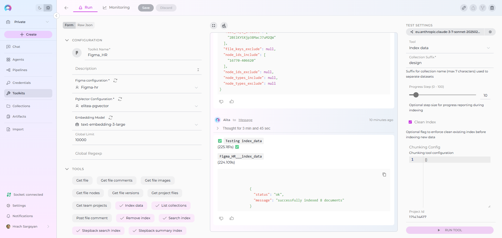

# Index Figma Data

!!! warning "Availability"
    Indexing tools are available in the [Next environment](https://next.elitea.ai) (Release 1.7.0) and replace legacy Datasources/Datasets. For context, see [Release Notes 1.7.0](../../release-notes/rn_current.md#indexing-tools-replacement-for-datasets) and the [Indexing Overview](./indexing-overview.md).

This guide provides a complete step-by-step walkthrough for indexing Figma data and then searching or chatting with the indexed content using ELITEA's AI-powered tools.

## Overview

Figma indexing allows you to create searchable indexes from your Figma design collaboration and UI/UX content:

- **Design Files**: Complete Figma files with all design elements, components, and layouts
- **Frames & Pages**: Individual screens, artboards, and design layouts within files
- **Components & Instances**: Reusable design components and their instances across projects
- **Design Elements**: UI elements like buttons, forms, icons, and interactive components
- **Project Organization**: Team projects, file structures, and design system hierarchies

**What you can do with indexed Figma data:**

- **Design Search**: Find specific design patterns, components, or screens across your design system
- **Context-Aware Design Chat**: Get AI-generated answers about design decisions and patterns with references to specific files
- **Cross-Project Discovery**: Search for design elements and patterns across multiple Figma projects
- **Design System Analysis**: Analyze component usage, design consistency, and UI patterns
- **Component Documentation**: Extract insights about design components and their usage patterns

**Common use cases:**

- Finding specific design components or patterns across your design system for reuse
- Onboarding new designers by allowing them to ask questions about design standards and components
- Analyzing design consistency and identifying opportunities for component standardization
- Product teams searching for specific UI patterns and design decisions
- Design system managers extracting insights about component adoption and usage

---

## Prerequisites

Before indexing Figma data, ensure you have:

1. **Figma Credential**: A Figma Personal Access Token or [authentication credentials](../how-to-use-credentials.md#figma-credential-setup) configured in ELITEA
2. **Vector Storage**: PgVector selected in Settings → [AI Configuration](../../menus/settings/ai-configuration.md)
3. **Embedding Model**: Selected in AI Configuration (defaults available) → [AI Configuration](../../menus/settings/ai-configuration.md)
4. **Figma Toolkit**: Configured with your Figma authentication and project details

### Required Permissions

Your Figma credential needs appropriate permissions based on what you want to index:

**For Content Access:**

- Read access to Figma files and projects
- Permission to view the specific teams and projects you want to index

**For Comprehensive Indexing:**

- Access to view file content, components, and design elements
- Permission to access both public and team-restricted files (based on your requirements)
- Ability to read from multiple projects and team spaces

**Authentication Methods:**

- **Personal Access Token**: Figma API token (starts with `figd_`)
- **OAuth2**: OAuth2 token for application-specific access

---

## Step-by-Step: Creating a Figma Credential

1. **Generate Figma Personal Access Token** in your Figma account (Settings → Security → Personal Access Tokens)
2. **Create Credential in ELITEA**: Navigate to **Credentials** → **+ Create** → **Figma** → enter details and save

!!! info "Detailed Instructions"
    For complete credential setup steps including token generation and security best practices, see:
    
    - [Create a Credential](../../getting-started/create-credential.md)
    - [Figma Credential Setup](../how-to-use-credentials.md#figma-credential-setup)
    - [Figma Toolkit Integration Guide](../../integrations/toolkits/figma_toolkit.md)

---

## Step-by-Step: Configure Figma Toolkit

1. **Create Toolkit**: Navigate to **Toolkits** → **+ Create** → **Figma**
2. **Configure Settings**: Set authentication method and assign your Figma credential
3. **Enable Tools**: Select `Index Data`, `List Collections`, `Search Index`, `Stepback Search Index`, `Stepback Summary Index`, and `Remove Index` tools
4. **Save Configuration**

### Tool Overview:
   - **Index Data**: Creates searchable indexes from Figma files and design content
   - **List Collections**: Lists all available collections/indexes to verify what's been indexed
   - **Search Index**: Performs semantic search across indexed content using natural language queries
   - **Stepback Search Index**: Advanced search that breaks down complex questions into simpler parts for better results
   - **Stepback Summary Index**: Generates summaries and insights from search results across indexed content
   - **Remove Index**: Deletes existing collections/indexes when you need to clean up or start fresh

!!! info "Detailed Instructions"
    For complete toolkit configuration including authentication setup and access permissions, see:
    
    - [Toolkits Menu](../../menus/toolkits.md)
    - [Figma Toolkit Integration Guide](../../integrations/toolkits/figma_toolkit.md)

---

## Finding Required Figma IDs

Before indexing, you'll need to identify the specific Figma resources you want to index. Here's how to find the required IDs:

### Project ID

For tools that require a **Project ID**, you can obtain it in the following ways:

1. **From Project URL (If You Are Project Admin) - Web & Desktop:**
   
    * **Web:** Extract from project URL: `https://www.figma.com/files/project/[PROJECT_ID]/[PROJECT_NAME]`
   
    * **Desktop:** Use **File → Show in browser** or **Share** → copy project link, then extract from project URL

2. **Request from Project Administrator:** If you don't have admin access to the project, contact the project administrator or team owner to provide you with the **Project ID**.

   

!!! info "Project ID Usage Note"
    Providing Project ID for indexing is optional. It's generally better to use **File Keys** for targeted indexing instead, because projects may contain many files which could result in large indexes. Use Project ID only when you specifically need to index all files in a project or create comprehensive project-level indexes.

### File Key  

* **Web:** Extract from file URL: `https://www.figma.com/file/[FILE_KEY]/[FILE_NAME]`
* **Desktop:** Use **File → Copy link** or **Share** button, then extract from URL 

   

### Node IDs

* **Web:** Right-click any design element → **Copy link** → extract from URL parameter `node-id=[NODE_ID]`
* **Desktop:** Right-click element → **Copy link** or select multiple elements (Ctrl/Cmd) → **Copy link**, then extract from URL

   

!!! tip "ID Format"
    - **Project ID**: Numeric (e.g., `123456789`)
    - **File Key**: Alphanumeric string (e.g., `ABC123DEF456`)  
    - **Node ID**: Colon-separated format (e.g., `123:456`)

!!! info "Detailed ID Finding Instructions"
    For comprehensive step-by-step instructions including additional methods and troubleshooting tips, see the [Figma Key Parameters](../../integrations/toolkits/figma_toolkit.md#figma-key-parameters) section in the Figma Integration Guide.

---

## Step-by-Step: Index Figma Data

### Content Indexing (from Toolkit)

1. **Open Toolkit Test Settings:**
     - Navigate to your Figma toolkit's detail page
     - In the **Test Settings** panel (right side), select a model (e.g., `gpt-4o`)

2. **Configure Index Data Tool:**

     - From the tool dropdown, select **"Index Data"**
     - Configure the following parameters:

     | Parameter | Description | Example Value |
     |-----------|-------------|---------------|
     | **Collection Suffix** * | Suffix for collection name (required) | `designs` or `ui` |
     | **Progress Step (0 - 100)** | Step size for progress reporting during indexing | `10` or `25` |
     | **Clean Index** | Remove existing index data before re-indexing | ✓ (checked) or ✗ (unchecked) |
     | **Chunking Config** | Configuration for document chunking | Default or custom settings |
     | **Chunking Tool** | Method for splitting content into chunks | `markdown` (default) |
     | **Project Id** | ID of the project to list files from | `55391681` |
     | **File Keys Include** | List of file keys to include if Project Id not provided | `["Fp24FuzPwH0L74ODSrCnQo"]` |
     | **File Keys Exclude** | List of file keys to exclude from indexing | `["OldDesignFile123"]` |
     | **Node Ids Include** | List of top-level nodes (pages) to include | `["123-56", "7651-9230"]` |
     | **Node Ids Exclude** | List of top-level nodes (pages) to exclude | `["Archive-Page"]` |
     | **Node Types Include** | List of node types to include | `["FRAME", "COMPONENT"]` |
     | **Node Types Exclude** | List of node types to exclude | `["VECTOR", "RECTANGLE"]` |

3. **Run Figma Indexing:**
     - Click **"Run Tool"** 
     - Wait for completion (may take several minutes for large projects with many files)
     - Check the output for success confirmation or error messages

     

---

## Verification: Confirm Index Success

After indexing completes, verify the index was created successfully:

### Method 1: Using Test Settings (Technical Verification)

1. **Use List Collections Tool:**
     - In Test Settings, select **"List Collections"** tool
     - Run tool to see all available collections
     - Look for your collection with the specified suffix

2. **Test Basic Search:**
     - Select **"Search Index"** tool
     - **Query**: e.g., `login screen design button`
     - **Collection Suffix**: Your specified suffix
     - Run tool and verify relevant results are returned

---

## Search and Chat with Indexed Data

Once your Figma data is indexed, you can use the toolkit to search and interact with your content in multiple ways:

### Using Toolkit in Conversations and Agents

Your Figma toolkit can be used in two main contexts:

1. **In Conversations**: Add the toolkit as a participant to ask questions and search your indexed Figma data
2. **In Agents**: Include the toolkit when creating AI agents to give them access to your design data

**How to use:**

- **Start a New Conversation or Create an Agent**
- **Add Toolkit as Participant**: Select your Figma toolkit from the available toolkits
- **Ask Natural Language Questions**: The toolkit will automatically search your indexed data and provide relevant answers with citations

### Real-Life Example Workflow

Let's walk through a complete example of indexing and using a design team's Figma project:

**Step 1: Setup Figma Toolkit for Design Project**

**Step 2: Use in Conversations**

 **Add toolkit to a conversation and start asking questions:**

   - Navigate to **Conversations** → **+ New Conversation**
   - In the participants section click + to add Toolkit
   - Select your Figma toolkit from the available toolkits list

**Step 3: Index the Design Project**

 * **User Request in Chat:**
 
     > "Index "2BElKY5Xjp38MacJ7uM2QW" design file from project 121424617 with suffix 'hr'. Include frames, components, and texts, but exclude vector elements. Clean any existing index first. Include 16770-406620 and 11166-106200 nodes."

   

**Step 4: Verify Index Creation**

 * **User Request in Chat:**
 
     > "List my collections"

 * **Figma Toolkit Response:**

 This confirms the indexing completed successfully and your design collection is available for searching.

**Step 5: Start the conversation and begin asking questions about your indexed content**

  * **User Request:** "Analyze our design system and provide a step-by-step guide for creating Credentials in ELITEA."
   
  * **Figma Toolkit:** "Based on your indexed design files, here's a comprehensive guide for creating ELITEA credentials and analyzing your design system:

    **ELITEA Credential Creation Steps:**

    1. **Navigate to Credentials**: Go to ELITEA → Credentials → + Create → Select Figma
    2. **Enter Token Information**: Paste your Figma Personal Access Token (starts with 'figd_')
    3. **Credential Configuration**: Set name, description, and save the credential for toolkit usage
    4. **Assign to Toolkit**: Link the credential to your Figma toolkit in toolkit settings
    
    **Design System Analysis:**

    1. **Component Library**: Your design system contains 45 reusable components with consistent naming conventions
    2. **Design Tokens**: Color palette follows brand guidelines with primary (#0066CC) and secondary (#00CC66) colors
    3. **Typography**: Standardized font scales and spacing using 8px grid system
   
   *Sources: Design_System_Guide.fig (Component: TokenLibrary), Team_Standards.fig (Frame: CredentialSetup)*"

   
   
  * **User Request:** "Generate test cases for our Toolkits menu based on the design variations. What edge cases should QA consider?"
   
  * **Figma Toolkit:** "Based on your indexed design files, here's a detailed list of test cases for the Toolkits menu in ELITEA, covering design variations and potential edge cases QA should consider:

    **1. General Display and Navigation**

     - TC001: Verify that the Toolkits menu is accessible from the main navigation sidebar
     - TC002: Verify that the page loads with the default overview of existing toolkits in list view or the pre-selected view mode

    **2. Toolkit Type Selection**

     - TC006: Verify that toolkit categories (e.g., 'Analysis,' 'Development') are displayed in the Toolkit Type Selection section
     - TC007: Test the system's behavior when no toolkit categories are available (Edge Case)

    **3. Tool Addition and Configuration**

     - TC010: Test adding a tool (e.g., 'GitHub') and ensure it appears in the Added Tools list
     - TC011: Test removing a tool after adding it and verify that it is removed successfully
   
   *Sources: Toolkits_Menu_Design.fig (Pages: MainView, CreationFlow), ELITEA_Navigation.fig (Frame: SidebarMenu)*"

   

## Troubleshooting & Tips

### Common Errors and Solutions

**"Authentication failed" or "Unauthorized access":**

  - Verify your Figma credential has the correct Personal Access Token (starts with `figd_`)
  - Ensure your token has not expired in your Figma account settings
  - Check that your Figma account has access to the projects and files you want to index
  - Verify the token was copied correctly without extra spaces or characters

**"No files found" or "Project not accessible":**

  - Verify the Project ID is correct and accessible to your Figma account
  - Ensure your account has permission to view the specific project and its files
  - Check that the project exists and has not been deleted or archived
  - Confirm your token's associated account is a member of the team that owns the project

**"File keys not found" or "Invalid file keys":**

  - Check that the file keys are copied correctly from Figma URLs (case-sensitive)
  - Ensure the files exist and are accessible to your account
  - Verify file sharing settings allow API access if using publicly shared files
  - Try indexing with Project ID instead of specific file keys for broader access

**"Vector database connection failed" or "PgVector errors":**

  - Ensure PgVector is properly configured in Settings → AI Configuration
  - Verify the vector database is running and accessible
  - Check connection credentials and database permissions
  - Restart the vector database service if connection issues persist

**"No design elements indexed" or "Empty results":**

  - Check that Node Types filters are not excluding all content
  - Verify the Figma files contain the specified node types (FRAME, COMPONENT, etc.)
  - Try indexing without node type filters first, then add restrictions
  - Ensure the design files have proper structure and named elements

### Performance and Scope Considerations

**For Large Design Projects:**

- Use specific file filters: `File Keys Include` for targeted indexing
- Filter by node types: include only `["FRAME", "COMPONENT"]` for key design elements
- Set reasonable progress steps: start with 25 for large projects
- Consider indexing by project phase: current designs vs. archived files

### Search Result Quality

**If search returns few/no results:**

- Lower the cut-off score from 0.5 to 0.35 or 0.3
- Increase search_top from 10 to 20 or 30
- Try rephrasing your query with design-specific terms (component names, screen types)
- Verify the indexed content contains relevant design information for your query

**For better search quality:**

- Include both frames and components for comprehensive coverage
- Use natural language queries rather than exact file names
- Leverage stepback search for complex design questions that require reasoning
- Create separate indexes for different design types (mobile vs. web, current vs. archived)

### Content-Specific Indexing Tips

**For Design Systems:**

- Focus on components: include `["COMPONENT", "COMPONENT_SET"]` node types
- Index component libraries and design tokens for comprehensive coverage
- Include both current and deprecated components for historical context

**For Product Design:**

- Include frames and screens: `["FRAME"]` for screen-level designs
- Index across multiple product areas for cross-feature insights
- Consider including prototyping and interaction states

**For UI/UX Research:**

- Include wireframes and user flow designs
- Index research artifacts and design explorations
- Focus on user-centered design elements and patterns

---

## References

!!! info "Related Documentation"
    For additional information and detailed setup instructions, see:
    
    - [Indexing Overview](./indexing-overview.md) - General indexing concepts and features
    - [Create a Credential](../../getting-started/create-credential.md) - Step-by-step credential creation guide
    - [How to Use Credentials](../how-to-use-credentials.md) - Credential management and Figma setup
    - [Toolkits Menu](../../menus/toolkits.md) - Toolkit configuration and management
    - [Figma Toolkit Integration Guide](../../integrations/toolkits/figma_toolkit.md) - Complete Figma toolkit reference
    - [AI Configuration](../../menus/settings/ai-configuration.md) - Vector storage and embedding model setup
    - [Chat Menu](../../menus/chat.md) - Creating conversations and adding toolkit participants
