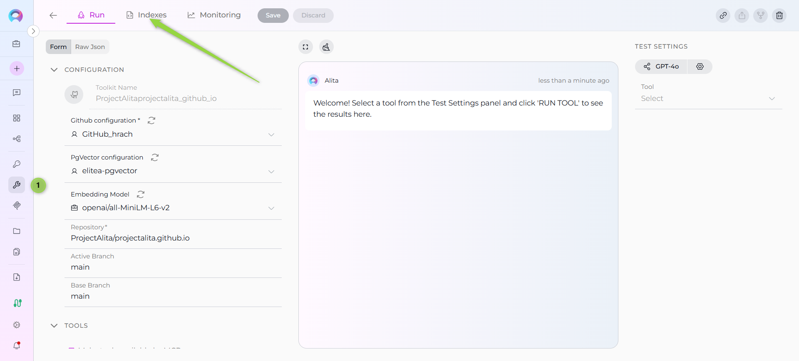
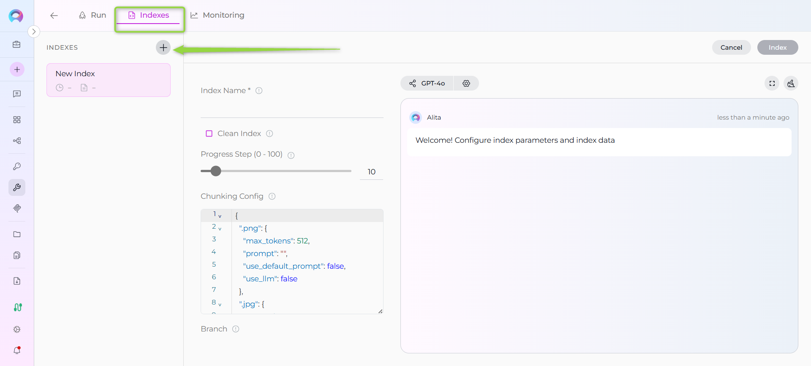
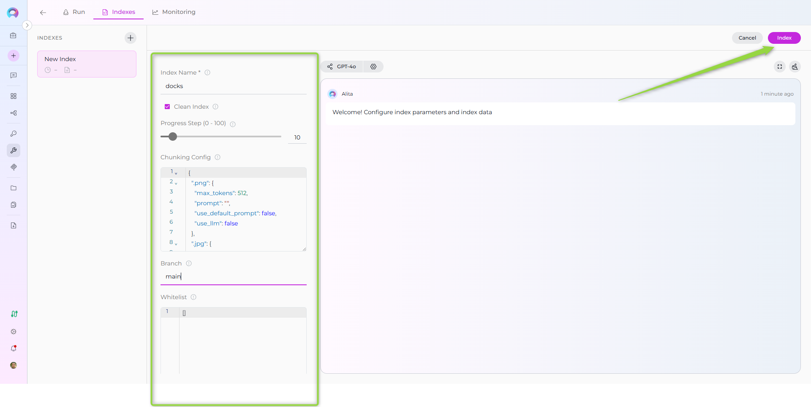
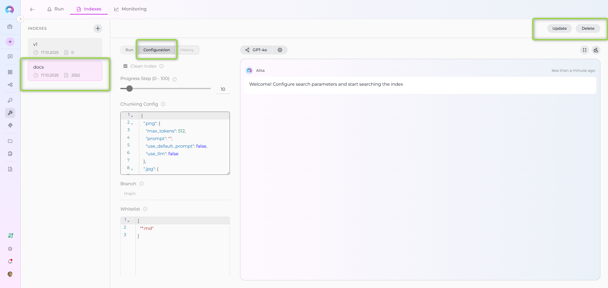
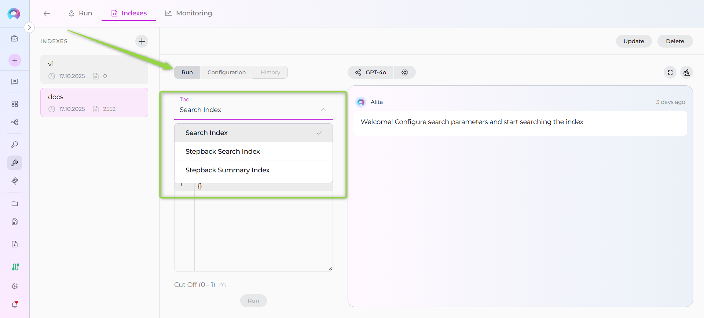
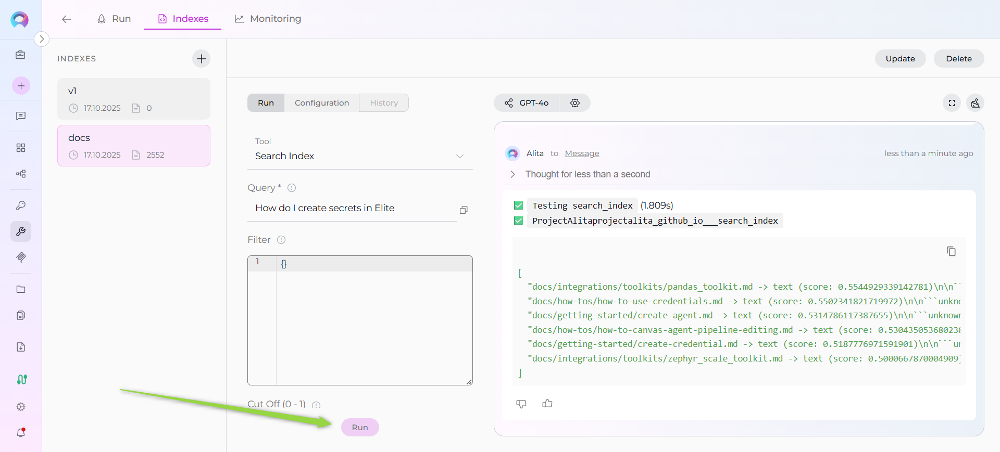
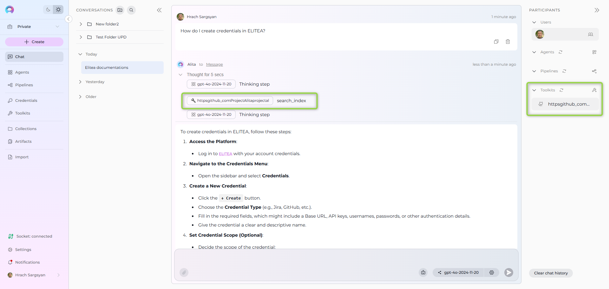

# Index Repository Data

!!! warning "Availability"
    Indexing tools are available in the [Next environment](https://next.elitea.ai) (Release 1.7.0) and replace legacy Datasources/Datasets. For context, see [Release Notes 1.7.0](../../release-notes/archived/rn13.md#indexing-dedicated-toolkit-indexes-tab) and the [Indexing Overview](./indexing-overview.md).

This guide provides a complete step-by-step walkthrough for indexing repository data and then searching or chatting with the indexed content using ELITEA's AI-powered tools.

!!! info "Primary Interface"
    Indexing operations are performed through the **Indexes** interface within Toolkit Configuration. This interface provides comprehensive index management with visual status indicators, real-time progress monitoring, and integrated search capabilities. For detailed information, see [How to create and use indexes](./using-indexes-tab-interface.md).

**Repository Support:**

This guide is applicable to all supported repository platforms:

- **GitHub** - Git repository hosting and DevOps platform
- **Azure DevOps Repos** - Microsoft's Git repository hosting
- **Bitbucket** - Atlassian's Git and Mercurial repository management
- **GitLab** - DevOps platform with integrated Git repository management
- **Other Git-based platforms** - Any Git repository accessible via standard protocols

## Overview

Repository indexing allows you to create searchable indexes from various repository resources:

- **Repository Content**: Code files, documentation, configuration files, and project assets
- **Issues & Discussions**: Bug reports, feature requests, support tickets, and community discussions  
- **Pull Requests**: Code reviews, change proposals, and development conversations
- **Project Workflows**: GitHub Actions logs, workflow configurations, and CI/CD data
- **Organization Data**: Team repositories, project structures, and collaborative content

**What you can do with indexed repository data:**

- **Semantic Search**: Find code patterns, documentation, or discussions using natural language queries
- **Context-Aware Chat**: Get AI-generated answers from your repository content with citations
- **Cross-Repository Discovery**: Search across multiple repositories and project resources
- **Development Insights**: Analyze issues, PRs, and workflows for project intelligence
- **Knowledge Extraction**: Transform repository content into searchable organizational knowledge

**Common use cases:**

- Onboarding new team members by allowing them to ask questions about the codebase and processes
- Finding specific implementations, bug fixes, or feature discussions across repositories
- Generating documentation or explanations from existing code and project discussions
- Code review assistance and impact analysis using historical PR data
- Support ticket resolution using indexed issue discussions and solutions

---

## GitHub Example Walkthrough

!!! example "GitHub as Primary Example"
    The following sections demonstrate the complete indexing workflow using **GitHub** as the example repository platform. This includes:
    
    - Creating GitHub credentials
    - Configuring GitHub toolkit
    - Indexing GitHub repository data
    - Searching and using the indexed content
    
    **For other repository platforms** (Azure DevOps, Bitbucket, GitLab), the process is identical - simply replace "GitHub" with your platform name and use the appropriate credential type and toolkit.

## Prerequisites

Before indexing GitHub data, ensure you have:

1. **GitHub Credential**: A Personal Access Token or [GitHub App credentials](../credentials-toolkits/how-to-use-credentials.md#github-credential-setup) configured in ELITEA
2. **Vector Storage**: PgVector selected in Settings → [AI Configuration](../../menus/settings/ai-configuration.md)
3. **Embedding Model**: Selected in AI Configuration (defaults available) → [AI Configuration](../../menus/settings/ai-configuration.md)
4. **GitHub Toolkit**: Configured with your repository details, credentials, and **Index Data tool enabled**

!!! warning "Requirements"
    The **Indexes** interface requires:
    - PgVector and Embedding Model configured at the project level
    - The **Index Data** tool enabled in your toolkit configuration
    
    Complete both project-level setup and toolkit configuration to access indexing functionality.

### Required Permissions

Your GitHub credential needs these minimum scopes based on what you want to index:

**For Repository Content:**
- `repo` or `public_repo` (for public repositories)
- `repo:status` (for commit status access)

**For Issues & Pull Requests:**
- `repo` (includes issue access)
- `read:org` (for organization-level content)

**For GitHub Actions & Workflows:**
- `actions:read` (for workflow data)
- `repo` (for repository-level workflows)

---

## Step-by-Step: Creating a GitHub Credential

1. **Generate GitHub Personal Access Token** in GitHub with required scopes (`repo`, `public_repo`, `repo:status`, etc.)
2. **Create Credential in ELITEA**: Navigate to **Credentials** → **+ Create** → **GitHub** → enter token and save

!!! info "Detailed Instructions"
    For complete credential setup steps including token generation and security best practices, see:
    
    - [Create a Credential](../../getting-started/create-credential.md)
    - [GitHub Credential Setup](../credentials-toolkits/how-to-use-credentials.md#github-credential-setup)
    - [GitHub Toolkit Guide](../../integrations/toolkits/github_toolkit.md) (Token generation section)

---

## Step-by-Step: Configure GitHub Toolkit

1. **Create Toolkit**: Navigate to **Toolkits** → **+ Create** → **GitHub**
2. **Configure Settings**: Set repository (`owner/repo-name`), branches, and assign your GitHub credential
3. **Enable Required Tools**: Select `index_data` tool (required for indexing functionality) and optionally `search_index`, `stepback_search_index`, `stepback_summary_index`, and `remove_index` tools
4. **Save Configuration**

!!! warning "Required Tool"
    The **Index Data** tool must be enabled for indexing functionality to be available. Without this tool, you cannot access the indexing interface.

### Tool Overview:
   - **Index_data**: Creates searchable indexes from GitHub repository content (files, documentation, code) - **Required for indexing**
   - **Search_index**: Performs semantic search across indexed content using natural language queries
   - **Stepback_search_index**: Advanced search that breaks down complex questions into simpler parts for better results
   - **Stepback_summary_index**: Generates summaries and insights from search results across indexed content
   - **Remove_index**: Deletes existing collections/indexes when you need to clean up or start fresh

!!! info "Detailed Instructions"
    For complete toolkit configuration including PgVector setup and embedding models, see:
    
    - [Toolkits Menu](../../menus/toolkits.md)
    - [GitHub Toolkit Integration Guide](../../integrations/toolkits/github_toolkit.md)

---

## Step-by-Step: Index GitHub Data

### Step 1: Access the Interface

1. **Navigate to Toolkits**: Go to **Toolkits** in the main navigation
2. **Select Your GitHub Toolkit**: Choose your configured GitHub toolkit from the list
3. **Open Indexes Tab**: Click on the **Indexes** tab in the toolkit detail view

If the tab is disabled or not visible, verify that:
- PgVector and Embedding Model are configured in Settings → AI Configuration
- The **Index Data** tool is enabled in your toolkit configuration

### Step 2: Create a New Index

1. **Click Create New Index**: In the Indexes sidebar, click the **+ Create New Index** button
2. **New Index Form**: The center panel displays the new index creation form

### Step 3: Configure Index Parameters

Fill in the required and optional parameters for your GitHub repository:

| Parameter | Description | Example Value | Required |
|-----------|-------------|---------------|----------|
| Index Name | Suffix for collection name (max 7 chars) | `docs` or `code` | ✓ |
| Branch | Git branch to index (leave empty for default branch) | `main`, `develop`, or empty | ✗ |
| Whitelist | File extensions/paths to include | `["*.md", "*.py", "*.js", "*.yml"]` | ✗ |
| Blacklist | File extensions/paths to exclude | `["*.png", "*.jpg", "node_modules/*", ".git/*"]` | ✗ |
| Clean Index | Remove existing index data before re-indexing | ✗ (checked) or ✗ (unchecked) | ✗ |
| Progress Step | Progress reporting interval | `10` (default) | ✗ |
| Chunking Config | Document chunking configuration | `{}` (default) | ✗ |

### Step 4: Start Indexing

1. **Form Validation**: The **Index** button remains inactive until all required fields are filled
2. **Review Configuration**: Verify all parameters are correct
3. **Click Index Button**: Start the indexing process
4. **Monitor Progress**: Watch real-time updates with visual indicators:
   - 🔄 **In Progress**: Indexing is currently running
   - ✅ **Completed**: Indexing finished successfully
   - ❌ **Failed**: Indexing encountered an error

### Step 5: Verify Index Creation

Once indexing completes:

1. **Check Index Status**: Verify the index shows ✅ **Completed** status in the sidebar
2. **Review Index Information**: Click on your index to see:
   - **Document Count**: Number of indexed files
   - **Last Updated**: Timestamp of indexing completion
   - **Index Name**: Your specified collection suffix

---

## Using Search Tools with Indexed Data

Once your GitHub data is indexed, you can search and interact with it directly through the interface:

### Accessing Search Functionality

1. **Select Your Index**: Click on your completed index from the sidebar
2. **Navigate to Run Tab**: Click the **Run** tab in the center panel
3. **Choose Search Tool**: Select from available search tools in the dropdown:
   - **Search Index**: Basic semantic search across indexed content
   - **Stepback Search Index**: Advanced search that breaks down complex questions
   - **Stepback Summary Index**: Search with automatic summarization of results

### Running a Search

1. **Enter Your Query**: Type your search query (e.g., "How to configure GitHub credentials?")
2. **Configure Parameters**: Adjust optional settings like filters and model configuration
3. **Click Run**: Execute the search
4. **View Results**: Results appear in the integrated chat interface on the right panel

---

## Using Indexed Data in Conversations and Agents

Once your GitHub data is indexed, you can use the toolkit to search and interact with your content in multiple ways:

### Using Toolkit in Conversations and Agents

Your GitHub toolkit can be used in two main contexts:

1. **In Conversations**: Add the toolkit as a participant to ask questions and search your indexed GitHub data
2. **In Agents**: Include the toolkit when creating AI agents to give them access to your GitHub knowledge base

**How to use:**

- **Start a New Conversation or Create an Agent**
- **Add Toolkit as Participant**: Select your GitHub toolkit from the available toolkits
- **Ask Natural Language Questions**: The toolkit will automatically search your indexed data and provide relevant answers with citations

### Real-Life Example Workflow

Let's walk through a complete example of indexing and using the ELITEA documentation repository:

**Step 1: Setup GitHub Toolkit for projectalita.github.io**

Configure GitHub Toolkit with:
- Repository: `projectalita/projectalita.github.io`
- Branch: `main` (leave empty for default)
- Credential: Your GitHub Personal Access Token
- Tools enabled: `index_data` (required), `search_index`, `stepback_search_index`, `stepback_summary_index`, `remove_index`

**Step 2: Index the Repository**

1. Navigate to **Toolkits** → Select your GitHub toolkit → Click **Indexes** tab
2. Click **+ Create New Index** button
3. Configure indexing parameters:
   - **Index Name (Collection Suffix)**: `docs`
   - **Branch**: (empty - uses main branch)
   - **Whitelist**: `["*.md"]`
   - **Blacklist**: `["*.png"]`
   - **Clean Index**: ✓ (checked)
4. Click **Index** button to start indexing
5. Monitor progress with visual indicators (🔄 In Progress → ✅ Completed)

**Step 3: Verify Index Creation**

Check that your index appears in the sidebar with:
- ✅ **Completed** status
- Document count showing number of indexed markdown files
- Collection name: `projectalita_projectalita_github_io_docs`

**Step 4: Test Search Functionality**

1. Select your completed index from the sidebar
2. Click the **Run** tab in the center panel
3. Choose **Search Index** from the tool dropdown
4. Enter a test query: "How do I create credentials in ELITEA?"
5. Click **Run** and review results in the chat interface

**Step 5: Use in Conversations**

1. Navigate to **Conversations** → **+ New Conversation**
2. In the participants section, click + to add your GitHub toolkit
3. Start asking questions about your indexed content

**Example Conversation:**

**User:** "How do I create credentials in ELITEA?"

**GitHub Toolkit:** "Based on your indexed documentation, here are the steps to create credentials:

1. Navigate to **Credentials** → **+ Create**
2. Select the credential type (GitHub, Jira, etc.)
3. Enter the required authentication details..."

## Troubleshooting & Tips

### Common Errors and Solutions

## Troubleshooting & Tips

### Common Issues and Solutions

**"Indexing interface not visible" or "Tab disabled":**
- Verify PgVector and Embedding Model are configured in Settings → AI Configuration
- Ensure the **Index Data** tool is enabled in your GitHub toolkit configuration
- Check that your toolkit supports indexing (GitHub is supported)
- Refresh the browser page and retry

**"+ Create New Index button not working":**
- Verify all project-level prerequisites are met (PgVector and Embedding Model)
- Check that you have proper permissions for the toolkit
- Ensure the toolkit is properly saved with credentials

**"Repository not found" or "Authentication failed":**
- Verify your GitHub credential has the correct token
- Ensure the repository name format is `owner/repository`
- Check that your token has appropriate permissions for the repository

**"Index creation failed" or "Indexing stuck in progress":**
- Check your whitelist/blacklist patterns aren't too restrictive
- Verify the repository has files matching your whitelist
- Try indexing with broader patterns first, then add restrictions
- Monitor the progress indicators for specific error messages

**"No search results returned":**
- Verify the index shows ✅ **Completed** status
- Check that your search query matches the type of content indexed
- Try broader search terms or different search tools (Stepback Search, Stepback Summary)
- Ensure the indexed content contains relevant information

### Performance and Scope Considerations

### Performance and Scope Considerations

**For Large Repositories:**
- Use specific whitelist patterns: `["docs/*.md", "src/*.py"]`
- Exclude binary files: `["*.png", "*.jpg", "*.zip", "*.exe"]`
- Consider indexing specific directories: `["docs/*", "README.md"]`
- Monitor the progress indicators and document count during indexing

**Search Result Quality:**
- Use natural language queries rather than exact keyword matches
- Try different search tools for complex questions (Stepback Search, Stepback Summary)
- Leverage the integrated chat interface for follow-up questions
- Create separate indexes for different content types (docs vs code vs configs)

**Index Management Best Practices:**
- Use descriptive collection suffixes (`docs`, `code`, `main`, `v1`)
- Enable the **Clean Index** option when re-indexing to ensure fresh data
- Monitor index status regularly through the visual indicators
- Use the **Update** button for incremental updates when repository content changes
- Delete unused indexes using the **Delete** button to free up resources

### Content-Specific Indexing Tips

**For Documentation:**
- Index README files, wiki content, and inline code documentation
- Include changelog and release notes for version-specific information
- Use whitelist patterns like `["*.md", "docs/**", "README*"]`

**For Code Analysis:**
- Include source code files with patterns like `["*.py", "*.js", "*.java"]`
- Consider excluding test files if focusing on production code
- Include configuration files for deployment and setup guidance

**For Configuration Management:**
- Index deployment configs, CI/CD pipelines, and environment settings
- Be careful to exclude sensitive data (secrets, keys, credentials)
- Use patterns like `["*.yml", "*.yaml", "*.json", "*.toml"]`

---

## References

!!! info "Related Documentation"
    For additional information and detailed setup instructions, see:
    
    - [Indexing Overview](./indexing-overview.md) - General indexing concepts and features
    - [How to create and use indexes](./using-indexes-tab-interface.md) - Comprehensive guide for indexing functionality
    - [Create a Credential](../../getting-started/create-credential.md) - Step-by-step credential creation guide
    - [How to Use Credentials](../credentials-toolkits/how-to-use-credentials.md) - Credential management and GitHub setup
    - [Toolkits Menu](../../menus/toolkits.md) - Toolkit configuration and management
    - [GitHub Toolkit Integration Guide](../../integrations/toolkits/github_toolkit.md) - Complete GitHub toolkit reference
    - [AI Configuration](../../menus/settings/ai-configuration.md) - Vector storage and embedding model setup
    - [Chat Menu](../../menus/chat.md) - Creating conversations and adding toolkit participants

---