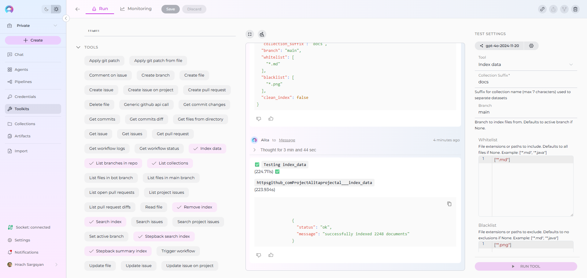

# Index Repository Data

!!! warning "Availability"
    Indexing tools are available in the [Next environment](https://next.elitea.ai) (Release 1.7.0) and replace legacy Datasources/Datasets. For context, see [Release Notes 1.7.0](../../release-notes/rn_current.md#indexing-tools-replacement-for-datasets) and the [Indexing Overview](./indexing-overview.md).

This guide provides a complete step-by-step walkthrough for indexing repository data and then searching or chatting with the indexed content using ELITEA's AI-powered tools.

**Repository Support:**

This guide is applicable to all supported repository platforms:

- **GitHub** - Git repository hosting and DevOps platform
- **Azure DevOps Repos** - Microsoft's Git repository hosting
- **Bitbucket** - Atlassian's Git and Mercurial repository management
- **GitLab** - DevOps platform with integrated Git repository management
- **Other Git-based platforms** - Any Git repository accessible via standard protocols

## Overview

Repository indexing allows you to create searchable indexes from various repository resources:

- **Repository Content**: Code files, documentation, configuration files, and project assets
- **Issues & Discussions**: Bug reports, feature requests, support tickets, and community discussions  
- **Pull Requests**: Code reviews, change proposals, and development conversations
- **Project Workflows**: GitHub Actions logs, workflow configurations, and CI/CD data
- **Organization Data**: Team repositories, project structures, and collaborative content

**What you can do with indexed repository data:**

- **Semantic Search**: Find code patterns, documentation, or discussions using natural language queries
- **Context-Aware Chat**: Get AI-generated answers from your repository content with citations
- **Cross-Repository Discovery**: Search across multiple repositories and project resources
- **Development Insights**: Analyze issues, PRs, and workflows for project intelligence
- **Knowledge Extraction**: Transform repository content into searchable organizational knowledge

**Common use cases:**

- Onboarding new team members by allowing them to ask questions about the codebase and processes
- Finding specific implementations, bug fixes, or feature discussions across repositories
- Generating documentation or explanations from existing code and project discussions
- Code review assistance and impact analysis using historical PR data
- Support ticket resolution using indexed issue discussions and solutions

---

## GitHub Example Walkthrough

!!! example "GitHub as Primary Example"
    The following sections demonstrate the complete indexing workflow using **GitHub** as the example repository platform. This includes:
    
    - Creating GitHub credentials
    - Configuring GitHub toolkit
    - Indexing GitHub repository data
    - Searching and using the indexed content
    
    **For other repository platforms** (Azure DevOps, Bitbucket, GitLab), the process is identical - simply replace "GitHub" with your platform name and use the appropriate credential type and toolkit.

## Prerequisites

Before indexing GitHub data, ensure you have:

1. **GitHub Credential**: A Personal Access Token or [GitHub App credentials](../how-to-use-credentials.md#github-credential-setup) configured in ELITEA
2. **Vector Storage**: PgVector selected in Settings → [AI Configuration](../../menus/settings/ai-configuration.md)
3. **Embedding Model**: Selected in AI Configuration (defaults available) → [AI Configuration](../../menus/settings/ai-configuration.md)
4. **GitHub Toolkit**: Configured with your repository details and credentials

### Required Permissions

Your GitHub credential needs these minimum scopes based on what you want to index:

**For Repository Content:**
- `repo` or `public_repo` (for public repositories)
- `repo:status` (for commit status access)

**For Issues & Pull Requests:**
- `repo` (includes issue access)
- `read:org` (for organization-level content)

**For GitHub Actions & Workflows:**
- `actions:read` (for workflow data)
- `repo` (for repository-level workflows)

---

## Step-by-Step: Creating a GitHub Credential

1. **Generate GitHub Personal Access Token** in GitHub with required scopes (`repo`, `public_repo`, `repo:status`, etc.)
2. **Create Credential in ELITEA**: Navigate to **Credentials** → **+ Create** → **GitHub** → enter token and save

!!! info "Detailed Instructions"
    For complete credential setup steps including token generation and security best practices, see:
    
    - [Create a Credential](../../getting-started/create-credential.md)
    - [GitHub Credential Setup](../how-to-use-credentials.md#github-credential-setup)
    - [GitHub Toolkit Guide](../../integrations/toolkits/github_toolkit.md) (Token generation section)

---

## Step-by-Step: Configure GitHub Toolkit

1. **Create Toolkit**: Navigate to **Toolkits** → **+ Create** → **GitHub**
2. **Configure Settings**: Set repository (`owner/repo-name`), branches, and assign your GitHub credential
3. **Enable Tools**: Select `index_data`, `List collections`, `search_index`, `stepback_search_index`, `Stepback summary index`, and `"Remove index` tools
4. **Save Configuration**

### Tool Overview:
   - **Index_data**: Creates searchable indexes from GitHub repository content (files, documentation, code)
   - **List collection**: Lists all available collections/indexes to verify what's been indexed
   - **Search_index**: Performs semantic search across indexed content using natural language queries
   - **Stepback_search_index**: Advanced search that breaks down complex questions into simpler parts for better results
   - **Stepback summary index**: Generates summaries and insights from search results across indexed content
   - **Remove index**: Deletes existing collections/indexes when you need to clean up or start fresh

!!! info "Detailed Instructions"
    For complete toolkit configuration including PgVector setup and embedding models, see:
    
    - [Toolkits Menu](../../menus/toolkits.md)
    - [GitHub Toolkit Integration Guide](../../integrations/toolkits/github_toolkit.md)

---

## Step-by-Step: Index GitHub Data

### Repository Content Indexing(from Toolkit)

1. **Open Toolkit Test Settings:**
     - Navigate to your GitHub toolkit's detail page
     - In the **Test Settings** panel (right side), select a model (e.g., `gpt-4o`)

2. **Configure Index Data Tool:**

     - From the tool dropdown, select **"Index Data"**
     - Configure the following parameters:

     | Parameter | Description | Example Value |
     |-----------|-------------|---------------|
     | **Collection Suffix** | Suffix for collection name (max 7 chars) | `docs` or `code` |
     | **Branch** | Git branch to index (leave empty for default branch) | `main`, `develop`, or empty |
     | **Whitelist** | File extensions/paths to include | `["*.md", "*.py", "*.js", "*.yml"]` |
     | **Blacklist** | File extensions/paths to exclude | `["*.png", "*.jpg", "node_modules/*", ".git/*"]` |
     | **Clean Index** | Remove existing index data before re-indexing | ✓ (checked) or ✗ (unchecked) |
     

3. **Run Repository Indexing:**
     - Click **"Run Tool"** 
     - Wait for completion (may take several minutes for large repositories)
     - Check the output for success confirmation or error messages

---

## Verification: Confirm Index Success

After indexing completes, verify the index was created successfully:

### Method 1: Using Test Settings (Technical Verification)

1. **Use List Collections Tool:**
     - In Test Settings, select **"List Collections"** tool
     - Run tool to see all available collections
     - Look for your collection with the specified suffix

2. **Test Basic Search:**
     - Select **"Search Index"** tool
     - **Query**: e.g., `README documentation setup`
     - **Collection Suffix**: Your specified suffix
     - Run tool and verify relevant results are returned

---

## Search and Chat with Indexed Data

Once your GitHub data is indexed, you can use the toolkit to search and interact with your content in multiple ways:

### Using Toolkit in Conversations and Agents

Your GitHub toolkit can be used in two main contexts:

1. **In Conversations**: Add the toolkit as a participant to ask questions and search your indexed GitHub data
2. **In Agents**: Include the toolkit when creating AI agents to give them access to your GitHub knowledge base

**How to use:**

- **Start a New Conversation or Create an Agent**
- **Add Toolkit as Participant**: Select your GitHub toolkit from the available toolkits
- **Ask Natural Language Questions**: The toolkit will automatically search your indexed data and provide relevant answers with citations

### Real-Life Example Workflow

Let's walk through a complete example of indexing and using the ELITEA documentation repository:

**Step 1: Setup GitHub Toolkit for projectalita.github.io**

 **Configure GitHub Toolkit:**

   - Repository: `projectalita/projectalita.github.io`
   - Branch: `main` (leave empty for default)
   - Credential: Your GitHub Personal Access Token
   - Tools enabled: `Index_data`, `List collection`, `Search_index`, `Stepback_search_index`, `Stepback summary index`, `Remove index`

**Step 2: Index the Repository**

 **Run Indexing with these parameters:**

   - Collection Suffix: `docs`
   - Branch: (empty - uses main branch)
   - Whitelist: `["*.md"]`
   - Blacklist: `["*.png"]`
   - Clean Index: `✓ (checked)`

    

**Step 3: Verify Index Creation**

 **Check that your collection was created successfully:**

  - In Test Settings, select **"List Collections"** tool from the dropdown
  - Click **"Run Tool"** 
  - Look for your collection in the output: `projectalita_projectalita_github_io_docs`
  - This confirms the indexing completed successfully

    

**Step 4: Use in Conversations**

 **Add toolkit to a conversation and start asking questions:**

   - Navigate to **Conversations** → **+ New Conversation**
   - In the participants section click + to add Toolkit
   - Select your GitHub toolkit from the available toolkits list
   - Start the conversation and begin asking questions about your indexed content

   **User:** "How do I create credentials in ELITEA?"
   
   **GitHub Toolkit:** "Based on your indexed documentation, here are the steps to create credentials:
   
   1. Navigate to **Credentials** → **+ Create**
   2. Select the credential type (GitHub, Jira, etc.)
   3. Enter the required authentication details...
   
    

   
   **User:** "Show me how to configure Secrets in Elitea"
   
   **GitHub Toolkit:** "Here's how to configure Secrets in ELITEA:
   
   1. Go to **Settings** → **+ Secrets**
   2. Click **+ Create** button to initiate the creation of a new secret
   3. Enter the name and value...
   

## Troubleshooting & Tips

### Common Errors and Solutions

**"Repository not found" or "Authentication failed":**

  - Verify your GitHub credential has the correct token
  - Ensure the repository name format is `owner/repository`
  - Check that your token has appropriate permissions for the repository

**"Rate limit exceeded":**

  - Large repositories may hit GitHub API limits
  - Wait 1 hour and retry, or use more specific whitelist patterns
  - Consider indexing smaller subsets of files

**"No documents indexed":**

  - Check your whitelist/blacklist patterns aren't too restrictive
  - Verify the repository has files matching your whitelist
  - Try indexing without filters first, then add restrictions

**"Vector database connection failed" or "PgVector errors":**

  - Ensure PgVector is properly configured in Settings → AI Configuration
  - Verify the vector database is running and accessible
  - Check connection credentials and database permissions
  - Restart the vector database service if connection issues persist

**"Embedding model not found" or "Embedding errors":**

  - Verify an embedding model is selected in AI Configuration
  - Check if the embedding model is properly downloaded/initialized
  - Try switching to a different embedding model (e.g., sentence-transformers/all-MiniLM-L6-v2)
  - Ensure sufficient system resources for the embedding model to load

### Performance and Scope Considerations

**For Large Repositories:**

- Use specific whitelist patterns: `["docs/*.md", "src/*.py"]`
- Exclude binary files: `["*.png", "*.jpg", "*.zip", "*.exe"]`
- Consider indexing specific directories: `["docs/*", "README.md"]`

### Search Result Quality

**If search returns few/no results:**

- Lower the cut-off score from 0.5 to 0.35 or 0.3
- Increase search_top from 10 to 20 or 30
- Try rephrasing your query with different keywords
- Verify the indexed content contains relevant information

**For better search quality:**

- Include both documentation and code files in your whitelist for comprehensive coverage
- Use natural language queries rather than exact keyword matches
- Leverage stepback search for complex questions that require reasoning
- Create separate indexes for different content types (docs vs code vs configs)

### Content-Specific Indexing Tips

**For Issue & PR Data (Future Enhancement):**

- Focus on repositories with active issue discussions
- Consider date ranges for large, long-running projects
- Include both open and closed issues for comprehensive coverage

**For Documentation:**

- Index README files, wiki content, and inline code documentation
- Include changelog and release notes for version-specific information

**For Configuration Management:**

- Index deployment configs, CI/CD pipelines, and environment settings
- Be careful to exclude sensitive data (secrets, keys, credentials)

---

## References

!!! info "Related Documentation"
    For additional information and detailed setup instructions, see:
    
    - [Indexing Overview](./indexing-overview.md) - General indexing concepts and features
    - [Create a Credential](../../getting-started/create-credential.md) - Step-by-step credential creation guide
    - [How to Use Credentials](../how-to-use-credentials.md) - Credential management and GitHub setup
    - [Toolkits Menu](../../menus/toolkits.md) - Toolkit configuration and management
    - [GitHub Toolkit Integration Guide](../../integrations/toolkits/github_toolkit.md) - Complete GitHub toolkit reference
    - [AI Configuration](../../menus/settings/ai-configuration.md) - Vector storage and embedding model setup
    - [Chat Menu](../../menus/chat.md) - Creating conversations and adding toolkit participants

---