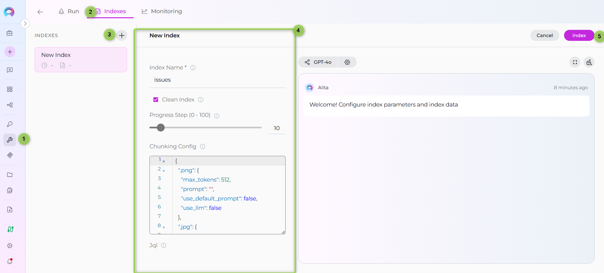
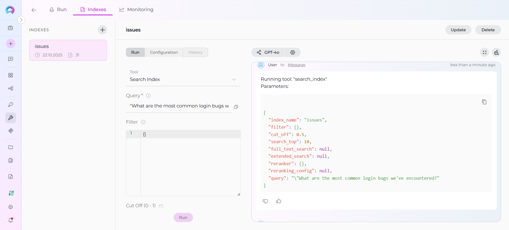
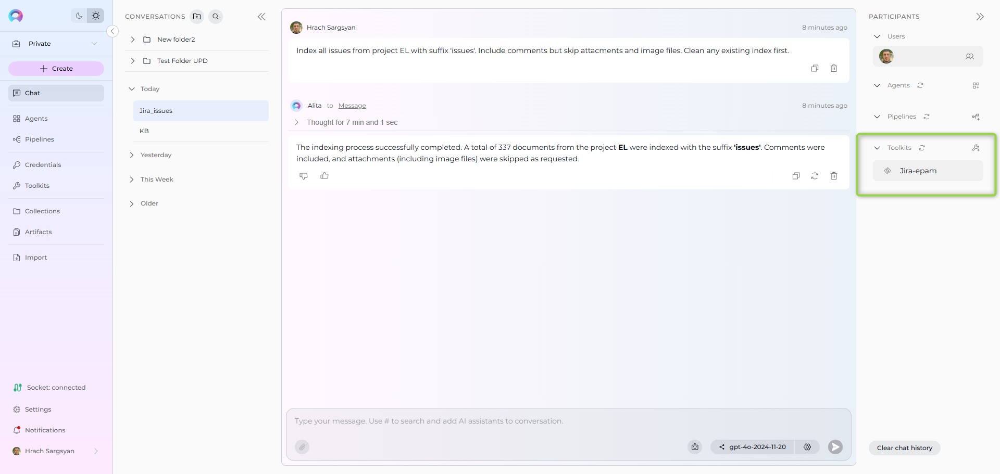
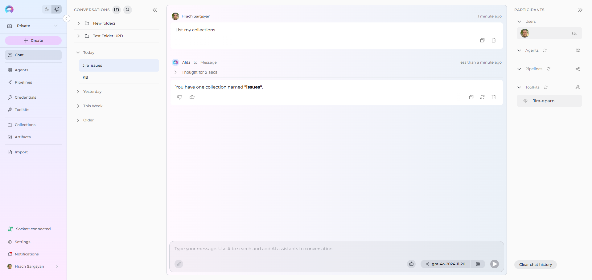
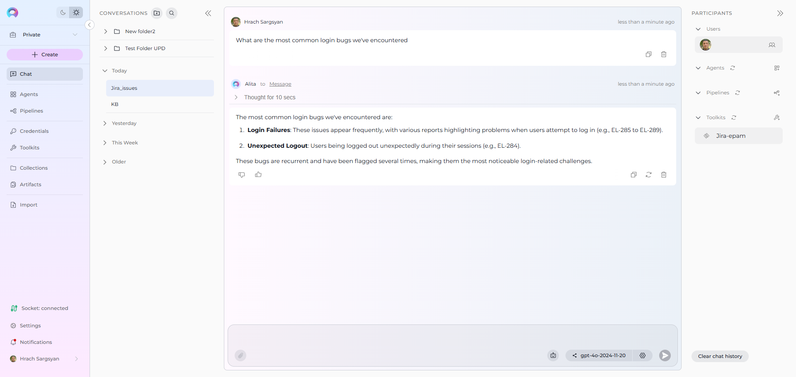
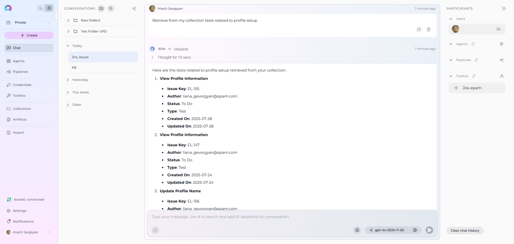

# Index Jira Data

!!! warning "Availability"
    Indexing tools are available in the [Next environment](https://next.elitea.ai) (Release 1.7.0) and replace legacy Datasources/Datasets. For context, see [Release Notes 1.7.0](../../release-notes/archived/rn13.md#indexing-dedicated-toolkit-indexes-tab) and the [Indexing Overview](./indexing-overview.md).

This guide provides a complete step-by-step walkthrough for indexing Jira data and then searching or chatting with the indexed content using ELITEA's AI-powered tools.

## Overview

Jira indexing allows you to create searchable indexes from your Jira project management content:

- **Issues & Stories**: User stories, bugs, tasks, epics, and sub-tasks with full descriptions
- **Custom Fields**: Project-specific fields, custom workflows, and metadata
- **Attachments**: Screenshots, documents, test files, and other media attached to issues
- **Comments**: Discussion threads, status updates, and collaborative input on issues
- **Project Data**: Sprint information, priorities, assignees, and project hierarchies

**What you can do with indexed Jira data:**

- **Semantic Search**: Find issues, bugs, and stories across projects using natural language queries
- **Context-Aware Chat**: Get AI-generated answers from your project data with citations to specific issues
- **Cross-Project Discovery**: Search across multiple Jira projects and issue types
- **Knowledge Extraction**: Transform Jira content into searchable organizational knowledge
- **Project Analysis**: Analyze patterns, trends, and relationships in your project management data

**Common use cases:**

- Finding similar bugs or issues across projects for faster resolution
- Onboarding new team members by allowing them to ask questions about project history and processes
- Analyzing sprint retrospectives and team feedback for continuous improvement
- Support and customer service teams searching for known issues and solutions
- Project managers extracting insights from historical project data and decisions

---

## Prerequisites

Before indexing Jira data, ensure you have:

1. **Jira Credential**: A Jira API token or [authentication credentials](../credentials-toolkits/how-to-use-credentials.md#jira-credential-setup) configured in ELITEA
2. **Vector Storage**: PgVector selected in Settings → [AI Configuration](../../menus/settings/ai-configuration.md)
3. **Embedding Model**: Selected in AI Configuration (defaults available) → [AI Configuration](../../menus/settings/ai-configuration.md)
4. **Jira Toolkit**: Configured with your Jira instance details and credentials

### Required Permissions

Your Jira credential needs appropriate permissions based on what you want to index:

**For Content Access:**

- Read access to Jira projects and issues
- Permission to view the specific projects you want to index

**For Comprehensive Indexing:**

- Access to view attachments (if including attachments)
- Permission to view comments and issue history
- Access to both public and restricted projects (based on your requirements)

**Authentication Methods:**

- **Basic Authentication**: Username and API Key
- **Bearer Token**: Jira API token

---

## Step-by-Step: Creating a Jira Credential

1. **Generate Jira API Token** in your Atlassian account (Security → API Tokens)
2. **Create Credential in ELITEA**: Navigate to **Credentials** → **+ Create** → **Jira** → enter details and save

!!! info "Detailed Instructions"
    For complete credential setup steps including token generation and security best practices, see:
    
    - [Create a Credential](../../getting-started/create-credential.md)
    - [Jira Credential Setup](../credentials-toolkits/how-to-use-credentials.md#jira-credential-setup)

---

## Step-by-Step: Configure Jira Toolkit

1. **Create Toolkit**: Navigate to **Toolkits** → **+ Create** → **Jira**
2. **Configure Settings**: Set base URL, hosting option (Cloud/Server), and assign your Jira credential
3. **Enable Tools**: Select `Index Data`, `List Collections`, `Search Index`, `Stepback Search Index`, `Stepback Summary Index`, and `Remove Index` tools
4. **Save Configuration**

### Tool Overview:
   - **Index Data**: Creates searchable indexes from Jira issues and content
   - **List Collections**: Lists all available collections/indexes to verify what's been indexed
   - **Search Index**: Performs semantic search across indexed content using natural language queries
   - **Stepback Search Index**: Advanced search that breaks down complex questions into simpler parts for better results
   - **Stepback Summary Index**: Generates summaries and insights from search results across indexed content
   - **Remove Index**: Deletes existing collections/indexes when you need to clean up or start fresh

!!! info "Detailed Instructions"
    For complete toolkit configuration including hosting options and authentication setup, see:
    
    - [Toolkits Menu](../../menus/toolkits.md)
    - [Jira Toolkit Integration Guide](../../integrations/toolkits/jira_toolkit.md)

---

## Step-by-Step: Index Jira Data

!!! info "Primary Interface"
    All indexing operations are performed via the **Indexes Tab Interface**. This dedicated interface provides comprehensive index management with visual status indicators, real-time progress monitoring, and integrated search capabilities.

!!! warning "Requirements"
    Before proceeding, ensure your project has PgVector and Embedding Model configured in Settings → AI Configuration, and your Jira toolkit has the **Index Data** tool enabled.

### Step 1: Access the Interface

1. **Navigate to Toolkits**: Go to **Toolkits** in the main navigation
2. **Select Your Jira Toolkit**: Choose your configured Jira toolkit from the list
3. **Open Indexes Tab**: Click on the **Indexes** tab in the toolkit detail view

If the tab is disabled or not visible, verify that:
- PgVector and Embedding Model are configured in Settings → AI Configuration
- The **Index Data** tool is enabled in your toolkit configuration

### Step 2: Create a New Index

1. **Click Create New Index**: In the Indexes sidebar, click the **+ Create New Index** button
2. **New Index Form**: The center panel displays the new index creation form

### Step 3: Configure Index Parameters

Fill in the required and optional parameters for your Jira indexing:

| Parameter | Required | Description | Example Value |
|-----------|----------|-------------|---------------|
| Index Name | ✓ | Suffix for collection name (max 7 chars) | `issues` or `proj` |
| Clean Index | ✗ | Remove existing index data before re-indexing | ✓ (checked) or ✗ (unchecked) |
| Progress Step (0 - 100) | ✗ | Step size for progress reporting during indexing | `10` or `25` |
| Chunking Tool | ✗ | Method for splitting content into chunks | `markdown` (default) or custom |
| jql | ✗ | JQL query to filter issues | `project=PROJ AND status=Open` |
| fields_to_extract | ✗ | Additional fields to extract from issues | `["customfield_10001", "priority"]` |
| fields_to_index | ✗ | Additional fields to include in indexed content | `["reporter", "assignee"]` |
| include_attachments | ✗ | Include attachment content in indexing | ✓ (checked) or ✗ (unchecked) |
| max_total_issues | ✗ | Maximum number of issues to index | `1000` (default) |
| skip_attachment_extensions | ✗ | File extensions to skip when processing attachments | `[".png", ".jpg", ".gif"]` |

### Step 4: Start Indexing

1. **Form Validation**: The **Index** button remains inactive until all required fields are filled
2. **Review Configuration**: Verify all parameters are correct
3. **Click Index Button**: Start the indexing process
4. **Monitor Progress**: Watch real-time updates with visual indicators:
      - 🔄 **In Progress**: Indexing is currently running
      - ✅ **Completed**: Indexing finished successfully
      - ❌ **Failed**: Indexing encountered an error

      

!!! info "Alternative: Test Settings Method"
    For quick testing and validation, you can also use the **Test Settings** panel on the right side of the toolkit detail page. Select a model, choose the **Index Data** tool from the dropdown, configure parameters, and click **Run Tool**. However, the Indexes Tab Interface is the recommended approach for comprehensive index management.

### Step 5: Verify Index Creation

After indexing completes, verify the index was created successfully:

1. **Check Index Status**: Visual indicators show completion status
2. **Review Index Details**: Click on the created index to see metadata and document count
3. **Test Search**: Use the **Run** tab to test search functionality with sample queries

---

## Search and Chat with Indexed Data

Once your Jira data is indexed, you can use it in multiple ways:

### Using the Indexes Interface

**Direct Search via Indexes Tab:**

1. **Access Indexes Tab**: Navigate to your Jira toolkit → **Indexes** tab
2. **Select Index**: Click on your created index from the sidebar
3. **Open Run Tab**: Click the **Run** tab in the center panel
4. **Choose Search Tool**: Select from available search tools:
      - **Search Index**: Basic semantic search
      - **Stepback Search Index**: Advanced search with question breakdown
      - **Stepback Summary Index**: Summarized insights from search results
5. **Enter Query**: Type your natural language question
6. **View Results**: See responses with citations to specific Jira issues

### Using Toolkit in Conversations and Agents

Your Jira toolkit can be used in two main contexts:

1. **In Conversations**: Add the toolkit as a participant to ask questions and search your indexed Jira data
2. **In Agents**: Include the toolkit when creating AI agents to give them access to your Jira project data

**How to use:**

- **Start a New Conversation or Create an Agent**
- **Add Toolkit as Participant**: Select your Jira toolkit from the available toolkits
- **Ask Natural Language Questions**: The toolkit will automatically search your indexed data and provide relevant answers with citations

### Real-Life Example Workflow

Let's walk through a complete example of indexing and using a software project's Jira data:

**Step 1: Setup Jira Toolkit for Software Project**

**Step 2: Use in Conversations**

 **Add toolkit to a conversation and start asking questions:**

   - Navigate to **Conversations** → **+ New Conversation**
   - In the participants section click + to add Toolkit
   - Select your Jira toolkit from the available toolkits list

**Step 3: Index the Project Issues**

 * **User Request in Chat:**
 
     > "Index all issues from project EL with suffix 'issues'. Include comments but skip attachments and image files. Clean any existing index first."

   

**Step 4: Verify Index Creation**

 * **User Request in Chat:**
 
     > "List my collections"

 * **Jira Toolkit Response:**

 This confirms the indexing completed successfully and your project collection is available for searching.

**Step 5: Start the conversation and begin asking questions about your indexed content**

  * **User:** "What are the most common login bugs we've encountered?"
   
  * **Jira Toolkit:** "Based on your indexed project data, here are the most common login bugs:
   
    1. **Session Timeout Issues**: Multiple reports of users being logged out unexpectedly (EL-234, EL-287, EL-301)
    2. **Password Reset Failures**: Email delivery issues preventing password resets (EL-156, EL-189)
    3. **Two-Factor Authentication Problems**: Users unable to complete 2FA setup (CALC-EL, CALC-EL)
   
   *Sources: CALC-234 (Priority: High), CALC-287 (Status: Resolved), CALC-301 (Assignee: john.doe)*"

   
   
  * **User:** "Retrieve from my collection tests related to profile setup"
   
  * **Jira Toolkit:** "Here are the tests related to profile setup from your indexed data:
   
    **Test Cases Found:**
     1. **User Profile Creation Test**: Verify new user can create complete profile (CALC-445)
     2. **Profile Validation Test**: Test profile field validation and error handling (CALC-446)
     3. **Profile Picture Upload Test**: Test image upload functionality in user profiles (CALC-447)
   
    **Setup Requirements:**
     1. Test user accounts with different permission levels
     2. Valid and invalid profile data sets
     3. Image files for upload testing (various formats and sizes)
   
   *Sources: CALC-445 (Test: Profile Creation), CALC-446 (Test: Validation), CALC-447 (Test: Image Upload)*"

   

## Troubleshooting & Tips

### Common Errors and Solutions

**"Indexes tab not visible" or "Tab disabled":**

- Verify PgVector and Embedding Model are configured in Settings → AI Configuration
- Ensure the **Index Data** tool is enabled in your Jira toolkit configuration
- Check that your toolkit supports indexing (Jira is supported)
- Refresh the browser page and retry

**"+ Create New Index button not working":**

- Verify all project-level prerequisites are met (PgVector and Embedding Model)
- Check that you have proper permissions for the toolkit
- Ensure the toolkit is properly saved with credentials

**"Authentication failed" or "Unauthorized access":**

  - Verify your Jira credential has the correct API token
  - Ensure your token has appropriate permissions for the projects you want to index
  - Check that your token hasn't expired in your Atlassian account settings

**"JQL query syntax error":**

  - Verify your JQL syntax is correct using Jira's query builder
  - Common examples: `project=PROJ`, `status IN (Open, Resolved)`, `updated >= -4w`
  - Test your JQL query directly in Jira before using it for indexing

**"No issues indexed" or "Empty result set":**

  - Check your JQL filter isn't too restrictive
  - Verify the project key is correct and case-sensitive
  - Try indexing without JQL filter first, then add restrictions
  - Ensure your account has permission to view the specified projects

**"Vector database connection failed" or "PgVector errors":**

  - Ensure PgVector is properly configured in Settings → AI Configuration
  - Verify the vector database is running and accessible
  - Check connection credentials and database permissions
  - Restart the vector database service if connection issues persist

**"Attachment processing errors":**

  - Large attachments may cause timeouts; consider using Skip Attachment Extensions
  - Binary files (executables, videos) should be excluded via Skip Attachment Extensions
  - Check available storage space for the vector database

### Performance and Scope Considerations

**For Large Jira Projects:**

- Use specific JQL filters: `project=PROJ AND updated >= -12w` (last 12 weeks)
- Filter by issue type: `project=PROJ AND issuetype IN (Bug, Story)`
- Set reasonable Max Total Issues limits: start with 500-1000 issues for testing
- Consider indexing by project phases: current sprint, recent releases, archived items

### Search Result Quality

**If search returns few/no results:**

- Lower the cut-off score from 0.5 to 0.35 or 0.3
- Increase search_top from 10 to 20 or 30
- Try rephrasing your query with Jira-specific terms (issue keys, component names)
- Verify the indexed content contains relevant information for your query

**For better search quality:**

- Include both issue descriptions and attachments for comprehensive coverage
- Use natural language queries rather than exact Jira field names
- Leverage stepback search for complex project questions that require reasoning
- Create separate indexes for different project types (development vs support, current vs archived)

### Content-Specific Indexing Tips

**For Software Development Projects:**

- Focus on bugs and stories: `issuetype IN (Bug, Story, Task)`
- Include recent issues: `updated >= -13w` (last quarter)
- Index both current and resolved issues for historical context

**For Support and Helpdesk:**

- Include all issue types for comprehensive ticket history
- Focus on resolved issues with solutions: `status=Resolved AND resolution!=Duplicate`
- Consider including comments as they often contain valuable troubleshooting steps

**For Project Management:**

- Include epics and high-level planning issues: `issuetype IN (Epic, Initiative)`
- Index across multiple projects for portfolio-level insights
- Include both active and completed projects for lessons learned

---

## References

!!! info "Related Documentation"
    For additional information and detailed setup instructions, see:
    
    - [Indexing Overview](./indexing-overview.md) - General indexing concepts and features
    - [Create a Credential](../../getting-started/create-credential.md) - Step-by-step credential creation guide
    - [How to Use Credentials](../credentials-toolkits/how-to-use-credentials.md) - Credential management and Jira setup
    - [Toolkits Menu](../../menus/toolkits.md) - Toolkit configuration and management
    - [Jira Toolkit Integration Guide](../../integrations/toolkits/jira_toolkit.md) - Complete Jira toolkit reference
    - [AI Configuration](../../menus/settings/ai-configuration.md) - Vector storage and embedding model setup
    - [Chat Menu](../../menus/chat.md) - Creating conversations and adding toolkit participants
