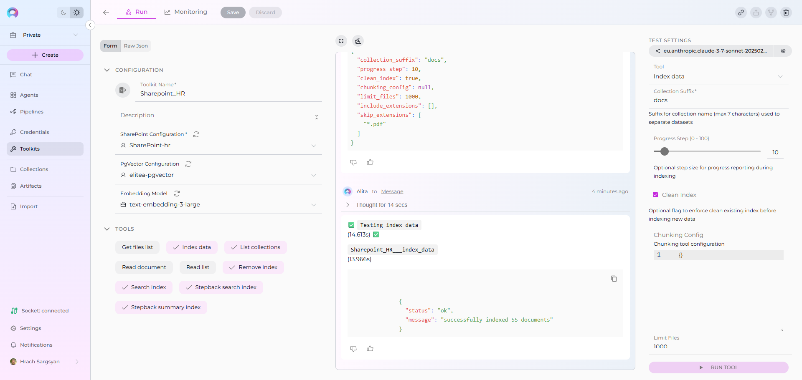
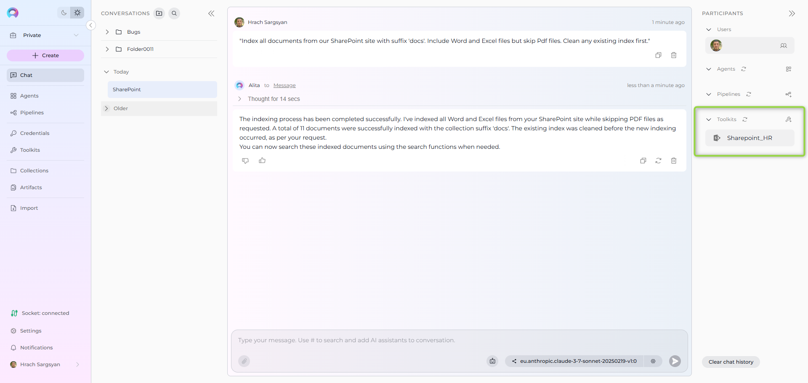

# Index SharePoint Data

!!! warning "Availability"
    Indexing tools are available in the [Next environment](https://next.elitea.ai) (Release 1.7.0) and replace legacy Datasources/Datasets. For context, see [Release Notes 1.7.0](../../release-notes/rn_current.md#indexing-tools-replacement-for-datasets) and the [Indexing Overview](./indexing-overview.md).

!!! info "Migration from Datasources"
    In previous releases, there was a **Source type: File** option in Datasources. Now, Datasources have been removed from ELITEA, and users can perform the same action through SharePoint Toolkit indexing.
    
    **How to migrate from Datasources to SharePoint Toolkit:**
    
    1. **Add files to SharePoint**: Upload your documents to SharePoint document libraries or sites (if not already there)
    2. **Set up credentials**: Configure your SharePoint credentials in **Settings** → **Credentials** 
    3. **Create SharePoint Toolkit**: Go to **Toolkits** → **+ Create** → **SharePoint** and configure with your site details
    4. **Index your data**: Use the "Index Data" tool from the SharePoint Toolkit to create searchable indexes
    5. **Search and chat**: Use the toolkit in conversations or agents to query your indexed SharePoint content
    
    This provides the same SharePoint indexing capabilities as the previous Datasources system with improved performance and integration.

This guide provides a complete step-by-step walkthrough for indexing SharePoint data and then searching or chatting with the indexed content using ELITEA's AI-powered tools.

## Overview

SharePoint indexing allows you to create searchable indexes from your SharePoint document management and collaboration content:

- **Documents & Files**: Word documents, PDFs, Excel spreadsheets, PowerPoint presentations, and other file types
- **Document Libraries**: Organized collections of documents with metadata and version control
- **Lists & Custom Data**: Task lists, contact lists, custom data tables, and project tracking information
- **Site Collections**: Multiple SharePoint sites organized under a shared management structure
- **Metadata & Properties**: Document properties, custom fields, and content categorization

**What you can do with indexed SharePoint data:**

- **Semantic Search**: Find documents and content across SharePoint sites using natural language queries
- **Context-Aware Chat**: Get AI-generated answers from your document content with citations to specific files
- **Cross-Site Discovery**: Search across multiple SharePoint sites and document libraries
- **Document Analysis**: Extract insights and summaries from business documents and reports
- **Content Organization**: Analyze document types, usage patterns, and content relationships

**Common use cases:**

- Finding specific documents, policies, or procedures across your organization's SharePoint sites
- Onboarding new employees by allowing them to ask questions about company documents and processes
- Analyzing project documents and extracting key information for reporting and decision-making
- Support teams searching for solutions and documentation from indexed knowledge bases
- Compliance and audit teams finding relevant documents based on content and metadata

---

## Prerequisites

Before indexing SharePoint data, ensure you have:

1. **SharePoint Credential**: An Azure AD app registration with [authentication credentials](../how-to-use-credentials.md#sharepoint-credential-setup) configured in ELITEA
2. **Vector Storage**: PgVector selected in Settings → [AI Configuration](../../menus/settings/ai-configuration.md)
3. **Embedding Model**: Selected in AI Configuration (defaults available) → [AI Configuration](../../menus/settings/ai-configuration.md)
4. **SharePoint Toolkit**: Configured with your SharePoint site details and credentials

### Required Permissions

Your SharePoint credential needs appropriate permissions based on what you want to index:

**For Content Access:**

- Read access to SharePoint sites and document libraries
- Permission to view the specific sites and libraries you want to index

**For Comprehensive Indexing:**

- Access to view document content and metadata
- Permission to access both public and restricted content (based on your requirements)
- Ability to read from multiple document libraries and lists

**Authentication Methods:**

- **Azure AD App Registration**: Client ID and Client Secret for application-only access
- **Delegated Permissions**: For user-context access (alternative approach)

---

## Step-by-Step: Creating a SharePoint Credential

1. **Register App in Azure AD**: Create an Azure AD app registration with appropriate SharePoint permissions
2. **Generate Client Secret**: Create a client secret for secure authentication
3. **Grant Site Permissions**: Use SharePoint's AppInv.aspx to grant site-level permissions
4. **Create Credential in ELITEA**: Navigate to **Credentials** → **+ Create** → **SharePoint** → enter details and save

!!! info "Detailed Instructions"
    For complete credential setup steps including Azure AD app registration, permissions, and security best practices, see:
    
    - [Create a Credential](../../getting-started/create-credential.md)
    - [SharePoint Credential Setup](../how-to-use-credentials.md#sharepoint-credential-setup)
    - [SharePoint Toolkit Integration Guide](../../integrations/toolkits/sharepoint_toolkit.md)

---

## Step-by-Step: Configure SharePoint Toolkit

1. **Create Toolkit**: Navigate to **Toolkits** → **+ Create** → **SharePoint**
2. **Configure Settings**: Set SharePoint site URL and assign your SharePoint credential
3. **Enable Tools**: Select `Index Data`, `List Collections`, `Search Index`, `Stepback Search Index`, `Stepback Summary Index`, and `Remove Index` tools
4. **Save Configuration**

### Tool Overview:
   - **Index Data**: Creates searchable indexes from SharePoint documents and content
   - **List Collections**: Lists all available collections/indexes to verify what's been indexed
   - **Search Index**: Performs semantic search across indexed content using natural language queries
   - **Stepback Search Index**: Advanced search that breaks down complex questions into simpler parts for better results
   - **Stepback Summary Index**: Generates summaries and insights from search results across indexed content
   - **Remove Index**: Deletes existing collections/indexes when you need to clean up or start fresh

!!! info "Detailed Instructions"
    For complete toolkit configuration including site URL setup and authentication options, see:
    
    - [Toolkits Menu](../../menus/toolkits.md)
    - [SharePoint Toolkit Integration Guide](../../integrations/toolkits/sharepoint_toolkit.md)

---

## Step-by-Step: Index SharePoint Data

### Content Indexing (from Toolkit)

1. **Open Toolkit Test Settings:**
     - Navigate to your SharePoint toolkit's detail page
     - In the **Test Settings** panel (right side), select a model (e.g., `gpt-4o`)

2. **Configure Index Data Tool:**

     - From the tool dropdown, select **"Index Data"**
     - Configure the following parameters:

     | Parameter | Description | Example Value |
     |-----------|-------------|---------------|
     | **Collection Suffix** * | Suffix for collection name (required) | `docs` or `files` |
     | **Progress Step (0 - 100)** | Step size for progress reporting during indexing | `10` or `25` |
     | **Clean Index** | Remove existing index data before re-indexing | ✓ (checked) or ✗ (unchecked) |
     | **Chunking Config** | Configuration for document chunking | Default or custom settings |
     | **Chunking Tool** | Method for splitting content into chunks | `markdown` (default) |
     | **Limit Files** | Maximum number of files to index | `1000` (default) |
     | **Include Extensions** | File extensions to include in indexing | `["*.docx", "*.pdf", "*.xlsx"]` |
     | **Skip Extensions** | File extensions to skip when processing | `["*.exe", "*.zip", "*.png"]` |

3. **Run SharePoint Indexing:**
     - Click **"Run Tool"** 
     - Wait for completion (may take several minutes for large document libraries)
     - Check the output for success confirmation or error messages

     

---

## Verification: Confirm Index Success

After indexing completes, verify the index was created successfully:

### Method 1: Using Test Settings (Technical Verification)

1. **Use List Collections Tool:**
     - In Test Settings, select **"List Collections"** tool
     - Run tool to see all available collections
     - Look for your collection with the specified suffix

2. **Test Basic Search:**
     - Select **"Search Index"** tool
     - **Query**: e.g., `project budget report`
     - **Collection Suffix**: Your specified suffix
     - Run tool and verify relevant results are returned

---

## Search and Chat with Indexed Data

Once your SharePoint data is indexed, you can use the toolkit to search and interact with your content in multiple ways:

### Using Toolkit in Conversations and Agents

Your SharePoint toolkit can be used in two main contexts:

1. **In Conversations**: Add the toolkit as a participant to ask questions and search your indexed SharePoint data
2. **In Agents**: Include the toolkit when creating AI agents to give them access to your document data

**How to use:**

- **Start a New Conversation or Create an Agent**
- **Add Toolkit as Participant**: Select your SharePoint toolkit from the available toolkits
- **Ask Natural Language Questions**: The toolkit will automatically search your indexed data and provide relevant answers with citations

### Real-Life Example Workflow

Let's walk through a complete example of indexing and using a company's SharePoint document library:

**Step 1: Setup SharePoint Toolkit for Document Management**

**Step 2: Use in Conversations**

   Add toolkit to a conversation and start asking questions:

  - Navigate to **Conversations** → **+ New Conversation**
  - In the participants section click + to add Toolkit
  - Select your SharePoint toolkit from the available toolkits list

**Step 3: Index the Document Library**

 * **User Request in Chat:**
 
     > "Index all documents from our SharePoint site with suffix 'docs'. Include Word and PDF files but skip image files. Clean any existing index first."

   

**Step 4: Verify Index Creation**

 * **User Request in Chat:**
 
     > "List my collections"

 * **SharePoint Toolkit Response:**

 This confirms the indexing completed successfully and your document collection is available for searching.

**Step 5: Start the conversation and begin asking questions about your indexed content**

  * **User:** "What are the key points from our Q3 financial report?"
   
  * **SharePoint Toolkit:** "Based on your indexed documents, here are the key points from the Q3 financial report:
   
    1. **Revenue Growth**: 15% increase compared to Q2, reaching $2.3M total revenue
    2. **Cost Management**: Operating expenses reduced by 8% through efficiency initiatives
    3. **Market Expansion**: Successful launch in two new regional markets contributing 12% of revenue
   
   *Source: Q3_Financial_Report.pdf (Created: 2024-10-15, Modified: 2024-10-20)*"

   
   
  * **User:** "Find me the latest project management templates"
   
  * **SharePoint Toolkit:** "Here are the latest project management templates from your indexed documents:
   
    **Templates Found:**

     1. **Project Charter Template v3.2**: Comprehensive project initiation document with stakeholder analysis
     2. **Sprint Planning Template**: Agile project management with backlog and capacity planning
     3. **Risk Management Matrix**: Template for identifying and tracking project risks
   
    **Template Features:**

     1. Pre-formatted sections for scope, objectives, and deliverables
     2. Built-in formulas for timeline and resource calculations
     3. Integration with company branding and approval workflows
   
   *Sources: Project_Charter_Template_v3.2.docx, Sprint_Planning_Template.xlsx, Risk_Management_Matrix.xlsx*"

## Troubleshooting & Tips

### Common Errors and Solutions

**"Authentication failed" or "Unauthorized access":**

  - Verify your SharePoint credential has the correct Client ID and Client Secret
  - Ensure your Azure AD app registration has appropriate permissions for SharePoint access
  - Check that admin consent has been granted for the application permissions
  - Verify the SharePoint site URL format includes `https://` and the complete site path

**"Site not found" or "Access denied to site":**

  - Verify the SharePoint site URL is correct and accessible
  - Ensure your Azure AD app has been granted permissions to the specific site collection using AppInv.aspx
  - Check that the site collection exists and is not archived or deleted
  - Confirm your app registration has the necessary SharePoint API permissions

**"No files indexed" or "Empty document library":**

  - Check that the document library contains accessible files
  - Verify file extensions are not being filtered out by Skip Extensions parameter
  - Ensure your app has read permissions to the document library
  - Try indexing without extension filters first, then add restrictions

**"Vector database connection failed" or "PgVector errors":**

  - Ensure PgVector is properly configured in Settings → AI Configuration
  - Verify the vector database is running and accessible
  - Check connection credentials and database permissions
  - Restart the vector database service if connection issues persist

**"File processing errors" or "Document parsing failures":**

  - Large files may cause timeouts; consider using file size limits or Skip Extensions
  - Binary files (executables, archives) should be excluded via Skip Extensions
  - Check available storage space for the vector database
  - Verify document formats are supported (Word, PDF, Excel, PowerPoint, text files)

### Performance and Scope Considerations

**For Large SharePoint Sites:**

- Use file type filters: `Include Extensions: ["*.docx", "*.pdf", "*.xlsx"]`
- Set reasonable file limits: start with 500-1000 files for testing
- Consider indexing by document library: create separate indexes for different libraries
- Index by content type: separate indexes for documents vs. lists vs. archived content

### Search Result Quality

**If search returns few/no results:**

- Lower the cut-off score from 0.5 to 0.35 or 0.3
- Increase search_top from 10 to 20 or 30
- Try rephrasing your query with document-specific terms (file names, content types)
- Verify the indexed content contains relevant information for your query

**For better search quality:**

- Include multiple document types for comprehensive coverage
- Use natural language queries rather than exact file names
- Leverage stepback search for complex business questions that require reasoning
- Create separate indexes for different content types (current vs archived, public vs restricted)

### Content-Specific Indexing Tips

**For Business Documents:**

- Focus on current documents: exclude outdated templates and archived files
- Include metadata-rich content: documents with proper titles, descriptions, and tags
- Index both working documents and finalized reports for complete coverage

**For Project Management:**

- Include project templates, status reports, and planning documents
- Index across multiple project sites for portfolio-level insights
- Consider including both active and completed projects for lessons learned

**For Knowledge Management:**

- Include policy documents, procedures, and training materials
- Index FAQ documents and troubleshooting guides for support scenarios
- Focus on documents with high business value and frequent access patterns

---

## References

!!! info "Related Documentation"
    For additional information and detailed setup instructions, see:
    
    - [Indexing Overview](./indexing-overview.md) - General indexing concepts and features
    - [Create a Credential](../../getting-started/create-credential.md) - Step-by-step credential creation guide
    - [How to Use Credentials](../how-to-use-credentials.md) - Credential management and SharePoint setup
    - [Toolkits Menu](../../menus/toolkits.md) - Toolkit configuration and management
    - [SharePoint Toolkit Integration Guide](../../integrations/toolkits/sharepoint_toolkit.md) - Complete SharePoint toolkit reference
    - [AI Configuration](../../menus/settings/ai-configuration.md) - Vector storage and embedding model setup
    - [Chat Menu](../../menus/chat.md) - Creating conversations and adding toolkit participants

