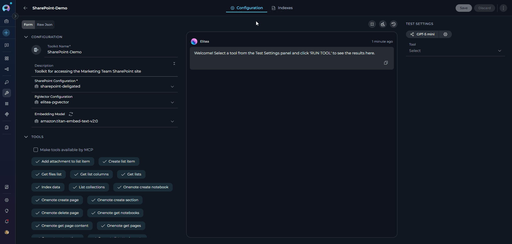
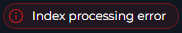
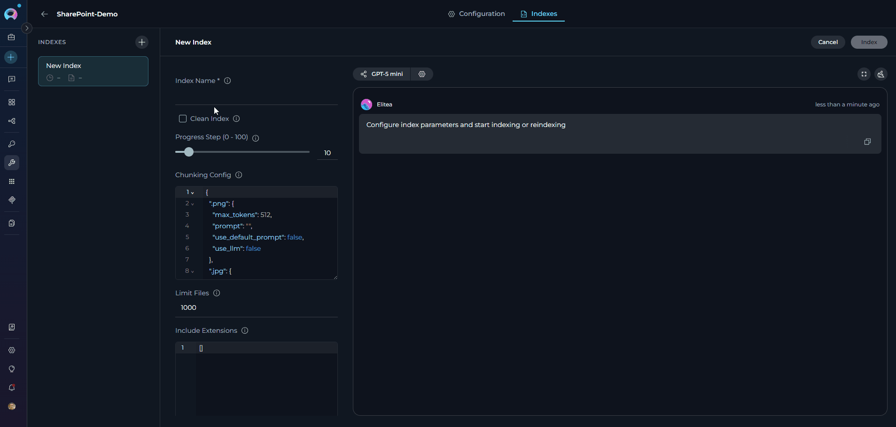
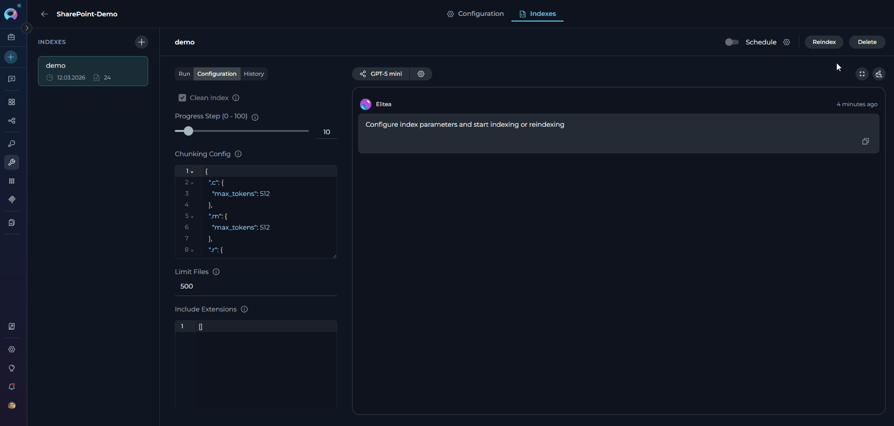
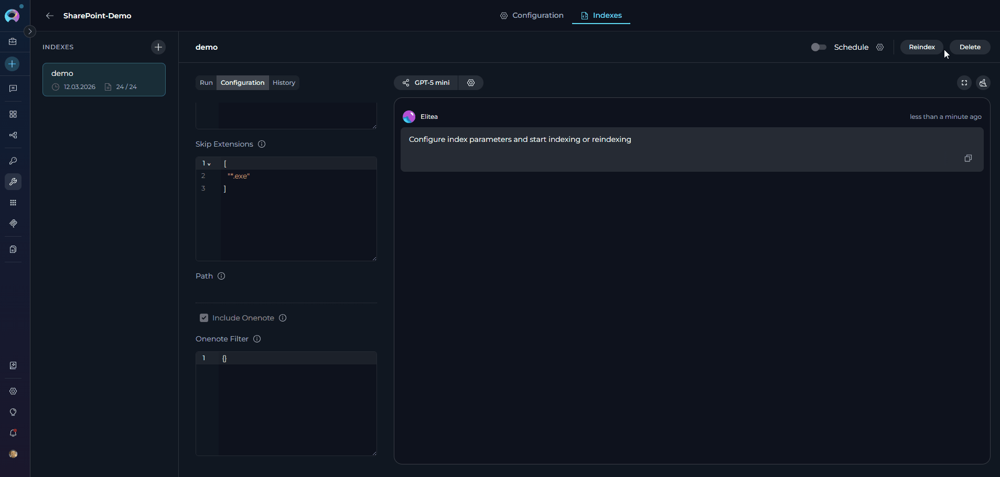
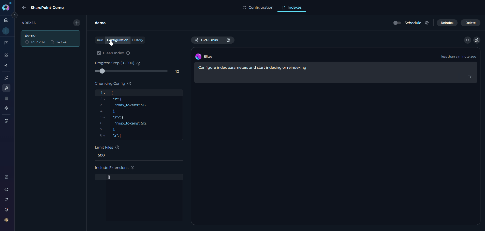
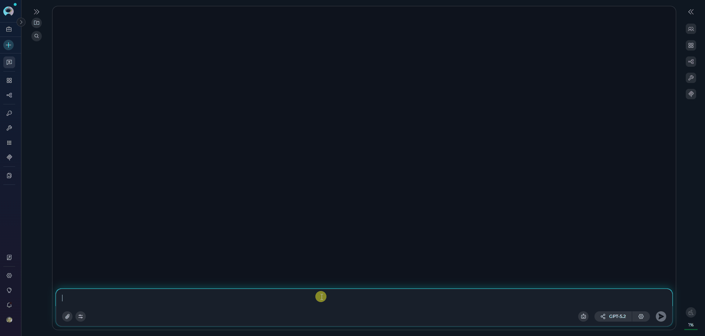
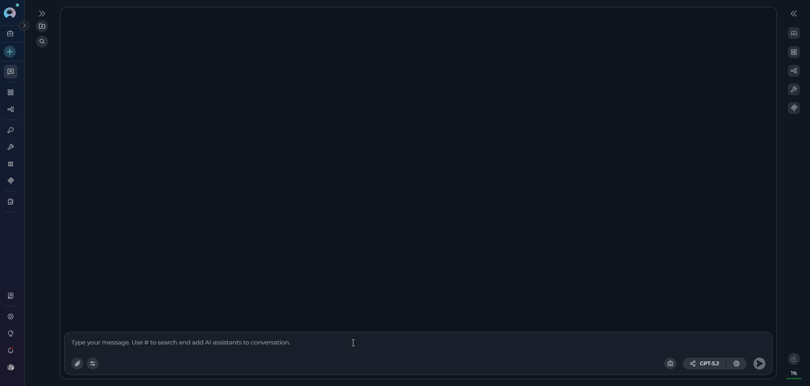
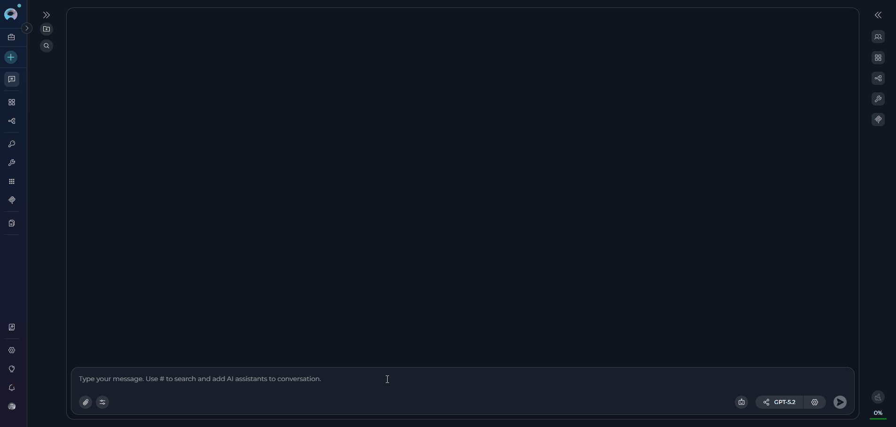

# Index SharePoint Data

!!! warning "Availability"
    Indexing tools are available in the [Next environment](https://next.elitea.ai) (Release 1.7.0) and replace legacy Datasources/Datasets. For context, see [Release Notes 1.7.0](../../release-notes/archived/rn13.md#indexing-dedicated-toolkit-indexes-tab) and the [Indexing Overview](./indexing-overview.md).

!!! info "Migration from Datasources"
    In previous releases, there was a **Source type: File** option in Datasources. Now, Datasources have been removed from ELITEA, and users can perform the same action through SharePoint Toolkit indexing.
    
    **How to migrate from Datasources to SharePoint Toolkit:**
    
    1. **Add files to SharePoint**: Upload your documents to SharePoint document libraries or sites (if not already there)
    2. **Set up credentials**: Configure your SharePoint credentials in **Settings** → **Credentials** 
    3. **Create SharePoint Toolkit**: Go to **Toolkits** → **+ Create** → **SharePoint** and configure with your site details
    4. **Index your data**: Use the "Index Data" tool from the SharePoint Toolkit to create searchable indexes
    5. **Search and chat**: Use the toolkit in conversations or agents to query your indexed SharePoint content
    
    This provides the same SharePoint indexing capabilities as the previous Datasources system with improved performance and integration.

This guide provides a complete step-by-step walkthrough for indexing SharePoint data and then searching or chatting with the indexed content using ELITEA's AI-powered tools.

## Overview

SharePoint indexing allows you to create searchable indexes from your SharePoint document management and collaboration content:

- **Documents & Files**: Word documents, PDFs, Excel spreadsheets, PowerPoint presentations, and other file types
- **Document Libraries**: Organized collections of documents with metadata and version control
- **Lists & Custom Data**: Task lists, contact lists, custom data tables, and project tracking information
- **Site Collections**: Multiple SharePoint sites organized under a shared management structure
- **Metadata & Properties**: Document properties, custom fields, and content categorization

**What you can do with indexed SharePoint data:**

- **Semantic Search**: Find documents and content across SharePoint sites using natural language queries
- **Context-Aware Chat**: Get AI-generated answers from your document content with citations to specific files
- **Cross-Site Discovery**: Search across multiple SharePoint sites and document libraries
- **Document Analysis**: Extract insights and summaries from business documents and reports
- **Content Organization**: Analyze document types, usage patterns, and content relationships

**Common use cases:**

- Finding specific documents, policies, or procedures across your organization's SharePoint sites
- Onboarding new employees by allowing them to ask questions about company documents and processes
- Analyzing project documents and extracting key information for reporting and decision-making
- Support teams searching for solutions and documentation from indexed knowledge bases
- Compliance and audit teams finding relevant documents based on content and metadata

---

## Prerequisites

Before indexing SharePoint data, ensure you have:

1. **SharePoint Credential**: An Azure AD app registration with [authentication credentials](../credentials-toolkits/how-to-use-credentials.md#sharepoint-credential-setup) configured in ELITEA
2. **Vector Storage**: PgVector selected in Settings → [AI Configuration](../../menus/settings/ai-configuration.md)
3. **Embedding Model**: Selected in AI Configuration (defaults available) → [AI Configuration](../../menus/settings/ai-configuration.md)
4. **SharePoint Toolkit**: Configured with your SharePoint site details and credentials

### Required Permissions

Your SharePoint credential needs appropriate permissions based on what you want to index:

**For Content Access:**

- Read access to SharePoint sites and document libraries
- Permission to view the specific sites and libraries you want to index

**For Comprehensive Indexing:**

- Access to view document content and metadata
- Permission to access both public and restricted content (based on your requirements)
- Ability to read from multiple document libraries and lists

**Authentication Methods:**

- **Azure AD App Registration**: Client ID and Client Secret for application-only access
- **Delegated Permissions**: For user-context access (alternative approach)

---

## Step-by-Step: Creating a SharePoint Credential

1. **Register App in Azure AD**: Create an Azure AD app registration with appropriate SharePoint permissions
2. **Generate Client Secret**: Create a client secret for secure authentication
3. **Grant Site Permissions**: Use SharePoint's AppInv.aspx to grant site-level permissions
4. **Create Credential in ELITEA**: Navigate to **Credentials** → **+ Create** → **SharePoint** → enter details and save

!!! info "Detailed Instructions"
    For complete credential setup steps including Azure AD app registration, permissions, and security best practices, see:
    
    - [SharePoint Toolkit Integration Guide](../../integrations/toolkits/sharepoint_toolkit.md#step-1-create-sharepoint-credentials)

---

## Step-by-Step: Configure SharePoint Toolkit

1. **Create Toolkit**: Navigate to **Toolkits** → **+ Create** → **SharePoint**
2. **Configure Settings**: Set SharePoint site URL and assign your SharePoint credential
3. **Enable Tools**: Select `Index Data`, `List Collections`, `Search Index`, `Stepback Search Index`, `Stepback Summary Index`, and `Remove Index` tools
4. **Save Configuration**

### Tool Overview:
   - **Index Data**: Creates searchable indexes from SharePoint documents and content
   - **List Collections**: Lists all available collections/indexes to verify what's been indexed
   - **Search Index**: Performs semantic search across indexed content using natural language queries
   - **Stepback Search Index**: Advanced search that breaks down complex questions into simpler parts for better results
   - **Stepback Summary Index**: Generates summaries and insights from search results across indexed content
   - **Remove Index**: Deletes existing collections/indexes when you need to clean up or start fresh

!!! info "Detailed Instructions"
    For complete toolkit configuration including site URL setup and authentication options, see:
    
    - [Toolkits Menu](../../menus/toolkits.md)
    - [SharePoint Toolkit Integration Guide](../../integrations/toolkits/sharepoint_toolkit.md#step-2-create-sharepoint-toolkit)

---

## Step-by-Step: Index SharePoint Data

**Step 1: Open the Indexes Tab**

1. Navigate to **Toolkits** and select your SharePoint toolkit.
2. Click the **Indexes** tab in the toolkit detail view.
3. In the left sidebar, click **+ Create New Index** — the creation form opens in the center panel.

    

    !!! tip "Indexes tab disabled?"
        Verify PgVector and Embedding Model are configured in **Settings → AI Configuration** and that the **Index Data** tool is enabled in your toolkit configuration.

**Step 2: Configure Index Parameters**

* Fill in the required and optional parameters for your SharePoint indexing:

    | **Parameter** | Required | Description | Example Value |
    |-----------|----------|-------------|---------------|
    | **Index Name** | ✓ | Suffix for collection name (min 1, max 7 chars) | `docs` or `files` |
    | **Clean Index** | ✗ | Remove existing index data before re-indexing (default: `false`) | ✓ (checked) or ✗ (unchecked) |
    | **Progress Step (0 - 100)** | ✗ | Step size for progress reporting during indexing (default: `10`) | `10` or `25` |
    | **Chunking Config** | ✗ | Configuration for document chunking | Default or custom settings |
    | **Limit Files** | ✗ | Maximum number of files to index from the document library (default: `1000`) | `500` |
    | **Include Extensions** | ✗ | File extensions to include. Applies to both document library files and OneNote attachments. Leave empty to include all (except skipped). Accepts `pdf` or `.pdf` form. | `  ["*.docx", "*.pdf", "*.xlsx"]` |
    | **Skip Extensions** | ✗ | File extensions to skip. Applies to both document library files and OneNote attachments. Accepts `exe` or `.exe` form. | `["*.exe", "*.zip", "*.png"]` |
    | **Path** | ✗ | Scope indexing to a specific folder. Accepts a full server-relative path (`/sites/SiteName/...`) or a relative path (searched recursively under Shared Documents and private libraries). Leave empty to index the whole site. | `/sites/MySite/Shared Documents/Reports` |
    | **Include Onenote** | ✗ | When `true`, also indexes OneNote pages from the SharePoint site in addition to document library files. **Requires Delegated (User OAuth) authentication** — will not work with App-Only credentials. (default: `false`) | `true` |
    | **Onenote Filter** | ✗ | Optional dictionary to control which OneNote notebooks, sections, and pages are indexed, and how they are processed (e.g., whether to capture images or include file attachments). Leave empty to index all OneNote content with defaults. Only used when `include_onenote` is `true`. | See note below |

!!! info "onenote_filter structure"
    The `onenote_filter` parameter accepts a JSON object with the following optional keys:

    - `notebooks` — list of notebook scope filters. Omit to index all notebooks. Each entry: `{"id": "<notebook-id>", "sections": [{"id": "<section-id>", "pages": ["<page-id>", ...]}]}`. Omit `sections` to include all sections; omit `pages` to include all pages in a section.
    - `capture_images` — boolean, default `true`. When `true` and an LLM is configured, embedded images are described.
    - `include_attachments` — boolean, default `false`. When `true`, file attachments on OneNote pages are also indexed.

    Extension filtering for attachments reuses the top-level `include_extensions` and `skip_extensions` parameters.

**Step 3: Start Indexing**

1. Click **Index** to start the process.
2. Monitor real-time status via the indicator on the index list item and detail header:

      | Status | Indicator | Description |
      |--------|-----------|-------------|
      | **In Progress** | {width="150"}| Indexing is currently running |
      | **Completed** | ✅ (no badge) | All documents indexed successfully |
      | **Partially Indexed** | ⚠️ "Partially indexed" badge | Some documents indexed successfully; others failed |
      | **Failed** |{width="150"}| Indexing encountered a fatal error |
      | **Stopped** | {width="140"} | Indexing was manually cancelled |

    !!! tip "Stopping an indexing run"
        If indexing is in progress and the backend task ID is available, a **Stop** button appears in place of the **Index** button. Click **Stop** to cancel the current run. The index retains any documents successfully indexed before the stop.

    
---

## Managing Existing Indexes

Once an index exists, selecting it in the sidebar reveals a three-tab detail view:

| Tab | Description |
|-----|-------------|
| **Run** | Run search tools against the index: **Search Index**, **Stepback Search Index**, or **Stepback Summary Index**. Select the tool from the dropdown, enter a query, and click **Run**. Only tools enabled in the toolkit configuration appear here. |
| **Configuration** | View the parameters used when the index was created. This tab is read-only. |
| **History** | Audit log of all indexing events (Created, Reindexed, Stopped, Failed, Partially Indexed) with timestamps. Selecting a history entry lets you view the chat results from that specific run. |

### Reindexing

* To refresh an existing index with updated SharePoint content, click the **Reindex** button (visible in the **Run** tab header of an existing index). Reindexing uses the same configuration as the original index. The history entry for the new run is added to the **History** tab.

     

### Scheduling Automatic Reindexing

The **Schedule** toggle (visible when an existing index is selected) lets you enable cron-based automatic reindexing:

1. Click the **gear icon** next to the **Schedule** toggle to open the **Schedule Settings** dialog.
2. Choose "Default" for a picker UI or "Advanced" to enter a cron expression directly.
3. Optionally select specific credentials to use for scheduled runs.
4. Click **Apply** to save the schedule, then enable the **Schedule** toggle.

The default cron value is `0 0 * * 6` (every Saturday at midnight). Scheduling requires appropriate project permissions.

!!! info "Detailed Instructions"
    For a complete walkthrough of the scheduling feature, see [Schedule Indexing](./schedule-indexing.md).

### Deleting an Index

* Click the **Delete** button on an existing index to permanently remove all indexed data for that collection. The **Remove index** tool must be enabled in the toolkit for this button to be active.

    

---

## Search and Chat with Indexed Data

Once your SharePoint data is indexed, you can use it in multiple ways:

### Using the Indexes Interface

**Direct Search via Indexes Tab:**

1. **Access Indexes Tab**: Navigate to your SharePoint toolkit → **Indexes** tab
2. **Select Index**: Click on your created index from the sidebar
3. **Open Run Tab**: Click the **Run** tab in the center panel
4. **Choose Search Tool**: Select from available search tools:
      - **Search Index**: Basic semantic search
      - **Stepback Search Index**: Advanced search with question breakdown
      - **Stepback Summary Index**: Summarized insights from search results
5. **Enter Query**: Type your natural language question
6. **View Results**: See responses with citations to specific SharePoint documents

    

### Using Toolkit in Conversations and Agents

Your SharePoint toolkit can be used in two main contexts:

1. **In Conversations**: Add the toolkit as a participant to ask questions and search your indexed SharePoint data
2. **In Agents**: Include the toolkit when creating AI agents to give them access to your document data

**How to use:**

- **Start a New Conversation or Create an Agent**
- **Add Toolkit as Participant**: Select your SharePoint toolkit from the available toolkits
- **Ask Natural Language Questions**: The toolkit will automatically search your indexed data and provide relevant answers with citations

    

### Real-Life Example Workflow

The following examples show a typical end-to-end flow: indexing documents, verifying the index, and querying the content — all through a conversation with the SharePoint toolkit added.

!!! example "Index the Document Library"

    **User:**
    > "Index all documents from our SharePoint site with suffix 'docs'. Include Word and PDF files but skip image files. Clean any existing index first."

     

!!! example "Verify Index Creation"

    **User:**
    > "List my collections"

       

    This confirms the indexing completed successfully and the collection is available for searching.

!!! example "Search Indexed Content"

    **User:** "What are the key points from our Q3 financial report?"

    **SharePoint Toolkit:** "Based on your indexed documents, here are the key points from the Q3 financial report:

    1. **Revenue Growth**: 15% increase compared to Q2, reaching $2.3M total revenue
    2. **Cost Management**: Operating expenses reduced by 8% through efficiency initiatives
    3. **Market Expansion**: Successful launch in two new regional markets contributing 12% of revenue

    *Source: Q3_Financial_Report.pdf (Created: 2024-10-15, Modified: 2024-10-20)*"

      
   
    * **User:** "Find me the latest project management templates"
   
    * **SharePoint Toolkit:** "Here are the latest project management templates from your indexed documents:
   
      **Templates Found:**

       1. **Project Charter Template v3.2**: Comprehensive project initiation document with stakeholder analysis
       2. **Sprint Planning Template**: Agile project management with backlog and capacity planning
       3. **Risk Management Matrix**: Template for identifying and tracking project risks
   
      **Template Features:**

       1. Pre-formatted sections for scope, objectives, and deliverables
       2. Built-in formulas for timeline and resource calculations
       3. Integration with company branding and approval workflows
   
     *Sources: Project_Charter_Template_v3.2.docx, Sprint_Planning_Template.xlsx, Risk_Management_Matrix.xlsx*"


## Troubleshooting

**Common Errors and Solutions**

??? warning "Indexes Tab Not Visible or Tab Disabled"
    - Verify PgVector and Embedding Model are configured in Settings → AI Configuration
    - Ensure the **Index Data** tool is enabled in your SharePoint toolkit configuration
    - Check that your toolkit supports indexing (SharePoint is supported)
    - Refresh the browser page and retry

??? warning "+ Create New Index Button Not Working"
    - Verify all project-level prerequisites are met (PgVector and Embedding Model)
    - Check that you have proper permissions for the toolkit
    - Ensure the toolkit is properly saved with credentials

??? warning "Authentication Failed or Unauthorized Access"
    The toolkit supports two authentication modes — ensure you are using the correct one:

    **App-Only (Client Credentials):** `client_id` + `client_secret`

    - Verify the Client ID and Client Secret are correct and not expired
    - Ensure your Azure AD app registration has `Sites.Read.All` (or `Sites.FullControl.All`) application permissions and admin consent was granted
    - Grant the app access to the specific site collection via `/_layouts/15/AppInv.aspx`
    - Verify the SharePoint site URL includes `https://` and the full site path

    **Delegated (User OAuth):** `token` + `scopes`

    - Ensure the OAuth token is valid and has not expired — click **Log in** again to refresh it
    - Verify all required scopes are listed in the credential (e.g., `https://graph.microsoft.com/Sites.ReadWrite.All`)
    - Ensure your Azure AD app has **Delegated** permissions (not Application) for the required Graph API scopes

    !!! note
        Providing only a token **without** scopes routes to the REST backend (legacy). All Graph API and OneNote features require `token` + `scopes`.

??? warning "Site Not Found or Access Denied to Site"
    - Verify the SharePoint site URL is correct and accessible
    - Ensure your Azure AD app has been granted permissions to the specific site collection using AppInv.aspx
    - Check that the site collection exists and is not archived or deleted
    - Confirm your app registration has the necessary SharePoint API permissions

??? warning "No Files Indexed or Empty Document Library"
    - Check that the document library contains accessible files
    - Verify file extensions are not being filtered out by the Skip Extensions parameter
    - Ensure your app has read permissions to the document library
    - Try indexing without extension filters first, then add restrictions
    - Check the **Limit Files** parameter — a value of `0` disables file collection entirely; use the default (`1000`) or a positive number

??? warning "Vector Database Connection Failed or PgVector Errors"
    - Ensure PgVector is properly configured in Settings → AI Configuration
    - Verify the vector database is running and accessible
    - Check connection credentials and database permissions
    - Restart the vector database service if connection issues persist

??? warning "Index Name Validation Error (Exceeds 7 Characters)"
    **Cause**: The `index_name` field has a hard limit of **7 characters** enforced by the SDK. Providing a longer value will cause a Pydantic validation error before indexing starts.

    - Keep the Index Name to 7 characters or fewer (e.g., `docs`, `sp2024`, `hr`)
    - Leave the field blank to use the default collection name without a suffix
    - Use short abbreviations for descriptive names (e.g., `fin` instead of `finance`)

??? warning "File Processing Errors or Document Parsing Failures"
    Individual file-level parse errors are **non-fatal** — the SDK logs them as warnings and continues indexing remaining files. The final result will report a partial count if some files failed.

    - Large files may cause timeouts; consider using file size limits or Skip Extensions
    - Binary files (executables, archives) should be excluded via Skip Extensions
    - Check available storage space for the vector database
    - Verify document formats are supported (Word, PDF, Excel, PowerPoint, text files)
    - Review application logs for specific file paths that failed to parse

??? warning "OneNote Indexing Fails with 401 Unauthorized (include_onenote: true enabled)"
    **Cause**: The Delegated OAuth token does not include the `Notes.ReadWrite.All` permission — either it was never added, admin consent was not granted, or the token was issued before the scope was added.

    1. In the [Azure Portal](https://portal.azure.com), go to **Microsoft Entra ID → App registrations → [your app] → API permissions**. Click **"+ Add a permission"** → **Microsoft Graph** → **Delegated permissions**, search for `Notes.ReadWrite.All`, and add it.
    2. Click **"Grant admin consent for [Your Organization]"** on the API permissions page. The `Notes.ReadWrite.All` entry must show a green checkmark.
    3. Update the **Scopes** field in your ELITEA SharePoint credential using full URL format:
        ```
        https://graph.microsoft.com/Sites.ReadWrite.All https://graph.microsoft.com/Files.ReadWrite.All https://graph.microsoft.com/Notes.ReadWrite.All
        ```
    4. Click **Log in** again in your ELITEA credential to obtain a fresh token that includes the Notes scope.

    !!! note
        `include_onenote` requires **Delegated (User OAuth)** authentication — it will not work with App-Only (Client Credentials).

**Performance and Scope Considerations**

??? warning "Large SharePoint Sites"
    - Use file type filters: `Include Extensions: ["*.docx", "*.pdf", "*.xlsx"]`
    - Set reasonable file limits: start with 500-1000 files for testing
    - Consider indexing by document library: create separate indexes for different libraries
    - Index by content type: separate indexes for documents vs. lists vs. archived content

**Search Result Quality**

??? warning "Search Returns Few or No Results"
    - Lower the cut-off score from 0.5 to 0.35 or 0.3
    - Increase search_top from 10 to 20 or 30
    - Try rephrasing your query with document-specific terms (file names, content types)
    - Verify the indexed content contains relevant information for your query

??? warning "Improving Search Quality"
    - Include multiple document types for comprehensive coverage
    - Use natural language queries rather than exact file names
    - Leverage stepback search for complex business questions that require reasoning
    - Create separate indexes for different content types (current vs archived, public vs restricted)

**Content-Specific Indexing Tips**

??? warning "Business Documents"
    - Focus on current documents: exclude outdated templates and archived files
    - Include metadata-rich content: documents with proper titles, descriptions, and tags
    - Index both working documents and finalized reports for complete coverage

??? warning "Project Management"
    - Include project templates, status reports, and planning documents
    - Index across multiple project sites for portfolio-level insights
    - Consider including both active and completed projects for lessons learned

??? warning "Knowledge Management"
    - Include policy documents, procedures, and training materials
    - Index FAQ documents and troubleshooting guides for support scenarios
    - Focus on documents with high business value and frequent access patterns

---

!!! info "Related Documentation"
    For additional information and detailed setup instructions, see:
    
    - [Indexing Overview](./indexing-overview.md) - General indexing concepts and features
    - [Create a Credential](../../getting-started/create-credential.md) - Step-by-step credential creation guide
    - [How to Use Credentials](../credentials-toolkits/how-to-use-credentials.md) - Credential management and SharePoint setup
    - [Toolkits Menu](../../menus/toolkits.md) - Toolkit configuration and management
    - [SharePoint Toolkit Integration Guide](../../integrations/toolkits/sharepoint_toolkit.md) - Complete SharePoint toolkit reference
    - [AI Configuration](../../menus/settings/ai-configuration.md) - Vector storage and embedding model setup
    - [Chat Menu](../../menus/chat.md) - Creating conversations and adding toolkit participants

