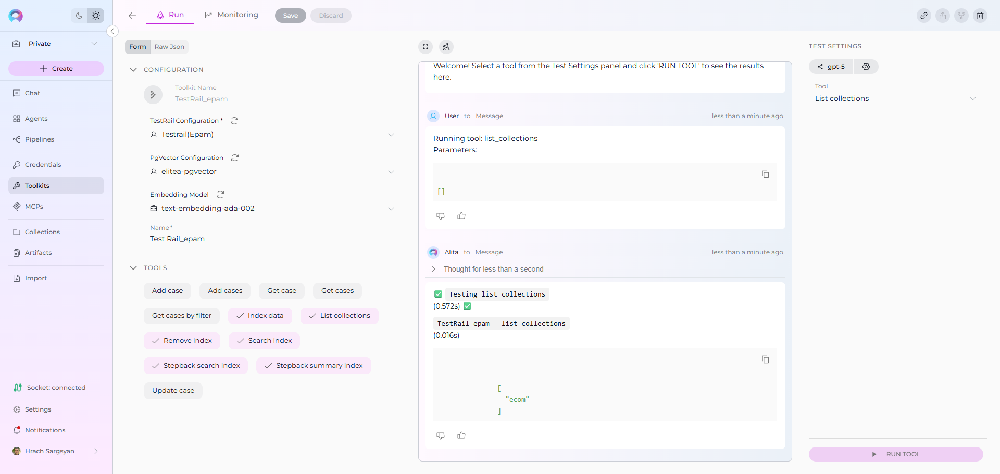

# Index TestRail Data

!!! warning "Availability"
    Indexing tools are available in the [Next environment](https://next.elitea.ai) (Release 1.7.0) and replace legacy Datasources/Datasets. For context, see [Release Notes 1.7.0](../../release-notes/rn_current.md#indexing-tools-replacement-for-datasets) and the [Indexing Overview](./indexing-overview.md).

## Overview

TestRail indexing allows you to create searchable indexes from your TestRail test management content:

- **Test Cases**: Detailed test procedures, steps, expected results, and custom fields
- **Test Projects**: Project structures, test suites, and section organization
- **Test Metadata**: Test priorities, types, automation status, and custom properties
- **Attachments**: Screenshots, test files, documentation, and media attached to test cases
- **Test History**: Test execution results, comments, and version tracking

**What you can do with indexed TestRail data:**

- **Semantic Search**: Find test cases and procedures across projects using natural language queries
- **Context-Aware Chat**: Get AI-generated answers from your test documentation with citations to specific test cases
- **Cross-Project Discovery**: Search across multiple TestRail projects and test suites
- **Test Analysis**: Analyze testing patterns, coverage, and procedures for quality improvement
- **Knowledge Extraction**: Transform test documentation into searchable organizational knowledge

**Common use cases:**

- Finding similar test cases across projects to avoid duplication and ensure consistency
- Onboarding new QA team members by allowing them to ask questions about testing procedures and standards
- Analyzing test coverage gaps and identifying areas needing additional test cases
- Support teams searching for existing test procedures when investigating issues
- Test managers extracting insights from test documentation for reporting and process improvement

---

## Prerequisites

Before indexing TestRail data, ensure you have:

1. **TestRail Credential**: A TestRail API key with [authentication credentials](../how-to-use-credentials.md#testrail-credential-setup) configured in ELITEA
2. **Vector Storage**: PgVector selected in Settings → [AI Configuration](../../menus/settings/ai-configuration.md)
3. **Embedding Model**: Selected in AI Configuration (defaults available) → [AI Configuration](../../menus/settings/ai-configuration.md)
4. **TestRail Toolkit**: Configured with your TestRail instance details and credentials

### Required Permissions

Your TestRail credential needs appropriate permissions based on what you want to index:

**For Content Access:**

- Read access to TestRail projects and test cases
- Permission to view the specific projects you want to index

**For Comprehensive Indexing:**

- Access to view test case attachments (if including attachments)
- Permission to view test case history and metadata
- Access to both active and archived projects (based on your requirements)

**Authentication Method:**

- **TestRail API Key**: Email address and API key generated in TestRail

---

## Step-by-Step: Creating a TestRail Credential

1. **Generate TestRail API Key** in your TestRail account (My Settings → API Keys → Add Key)
2. **Create Credential in ELITEA**: Navigate to **Credentials** → **+ Create** → **TestRail** → enter details and save

!!! info "Detailed Instructions"
    For complete credential setup steps including API key generation and security best practices, see:
    
    - [Create a Credential](../../getting-started/create-credential.md)
    - [TestRail Credential Setup](../how-to-use-credentials.md#testrail-credential-setup)
    - [TestRail Toolkit Integration Guide](../../integrations/toolkits/testrail_toolkit.md)

---

## Step-by-Step: Configure TestRail Toolkit

1. **Create Toolkit**: Navigate to **Toolkits** → **+ Create** → **TestRail**
2. **Configure Settings**: Set TestRail instance URL and assign your TestRail credential
3. **Enable Tools**: Select `Index Data`, `List Collections`, `Search Index`, `Stepback Search Index`, `Stepback Summary Index`, and `Remove Index` tools
4. **Save Configuration**

### Tool Overview:
   - **Index Data**: Creates searchable indexes from TestRail test cases and documentation
   - **List Collections**: Lists all available collections/indexes to verify what's been indexed
   - **Search Index**: Performs semantic search across indexed content using natural language queries
   - **Stepback Search Index**: Advanced search that breaks down complex questions into simpler parts for better results
   - **Stepback Summary Index**: Generates summaries and insights from search results across indexed content
   - **Remove Index**: Deletes existing collections/indexes when you need to clean up or start fresh

### Configuration Settings:

| Setting | Description | Example Value |
|---------|-------------|---------------|
| **URL** | TestRail instance URL | `https://yourcompany.testrail.io/` |
| **Email** | TestRail account email address | `test.manager@company.com` |
| **Password/API Key** | TestRail API key for authentication | Select from Secrets or enter directly |

!!! note "TestRail URL Format"
    Use the complete TestRail instance URL including `https://` and your subdomain (e.g., `https://yourcompany.testrail.io/`).

!!! info "Detailed Instructions"
    For complete toolkit configuration including URL setup and authentication options, see:
    
    - [Toolkits Menu](../../menus/toolkits.md)
    - [TestRail Toolkit Integration Guide](../../integrations/toolkits/testrail_toolkit.md)

---

## Step-by-Step: Index TestRail Data

### Test Case Indexing (from Toolkit)

1. **Open Toolkit Test Settings:**
     - Navigate to your TestRail toolkit's detail page
     - In the **Test Settings** panel (right side), select a model (e.g., `gpt-4o`)

2. **Configure Index Data Tool:**

     - From the tool dropdown, select **"Index Data"**
     - Configure the following parameters:

     | Parameter | Description | Example Value |
     |-----------|-------------|---------------|
     | **Project ID** * | TestRail project ID to index data from (required) | `1` or `5` |
     | **Collection Suffix** * | Suffix for collection name (max 7 chars) | `cases` or `qa` |
     | **Progress Step** | Step size for progress reporting during indexing | `10` (default) |
     | **Clean Index** | Remove existing index data before re-indexing | ✓ (checked) or ✗ (unchecked) |
     | **Suite ID** | Optional TestRail suite ID to filter test cases | `3` or leave empty |
     | **Section ID** | Optional section ID to filter test cases | `15` or leave empty |
     | **Include Attachments** | Whether to include attachment content in indexing | ✓ (checked) or ✗ (unchecked) |
     | **Skip Attachment Extensions** | File extensions to skip when processing attachments | `[".png", ".jpg"]` |
     | **Chunking Tool** | Method for splitting content into chunks | `json` (default) |
     | **Chunking Config** | Configuration settings for content chunking | `{"chunk_size": 4000, "chunk_overlap": 200}` |

3. **Run TestRail Indexing:**
     - Click **"Run Tool"** 
     - Wait for completion (may take several minutes for large test suites)
     - Check the output for success confirmation or error messages

### Real-Life Example: Indexing QA Test Documentation

**Scenario**: You have a QA team with comprehensive test documentation in TestRail for an e-commerce web application. You want to make all test cases, procedures, and testing knowledge searchable for team collaboration and knowledge sharing.

**Indexing Steps:**

1. **Configure TestRail Toolkit:**
     - URL: `https://yourcompany.testrail.io/`
     - Email: `qa.manager@yourcompany.com`
     - API Key: Generated from TestRail → My Settings → API Keys

2. **Index Complete E-commerce Project:**
     - Project ID: `1`
     - Collection suffix: `ecom`
     - Progress Step: `5` (report every 5 test cases)
     - Clean Index: ✓ (for fresh start)
     - Include Attachments: ✓ (for test screenshots and documentation)
     - Skip Attachment Extensions: `[".jpg"]`
     - Chunking Tool: `json`
     - Chunking Config: Default

   

3. **Index Specific Test Suite (Optional):**
     - Project ID: `1`
     - Suite ID: `10` (only User Authentication Tests)
     - Collection suffix: `auth`
     - Include Attachments: ✗ (authentication tests rarely have attachments)

4. **Index Specific Section (Optional):**
     - Project ID: `1`
     - Suite ID: `20`
     - Section ID: `203` (only Checkout Process tests)
     - Collection suffix: `checkout`
     - Include Attachments: ✓ (checkout tests often have payment screenshots)

5. **Verify indexing:**
     - Use "List Collections" tool to confirm collections exist
     - Expected collections: `ecom`, `auth`, `checkout`
     - Check indexing output for test case processing confirmation

     

**After indexing, you can search for:**

- **Authentication queries**: *"Find all test cases for user login functionality"*
- **Feature-specific tests**: *"What are the steps to test the shopping cart feature?"*
- **Cross-functional testing**: *"Show me test cases that verify payment processing"*
- **Performance analysis**: *"What performance tests exist for the checkout process?"*
- **Test coverage gaps**: *"Are there tests for guest checkout without registration?"*

---

## Search and Chat with Indexed Data

Once your TestRail data is indexed, you can use the toolkit to search and interact with your test documentation in multiple ways:

### Using Toolkit in Conversations and Agents

Your TestRail toolkit can be used in two main contexts:

1. **In Conversations**: Add the toolkit as a participant to ask questions and search your indexed TestRail data
2. **In Agents**: Include the toolkit when creating AI agents to give them access to your test documentation

**How to use:**

- **Start a New Conversation or Create an Agent**
- **Add Toolkit as Participant**: Select your TestRail toolkit from the available toolkits
- **Ask Natural Language Questions**: The toolkit will automatically search your indexed data and provide relevant answers with citations

### Using Indexed TestRail Data in Conversations

Let's walk through a complete example of querying indexed test documentation:

**Step 1: Add toolkit to a conversation and start asking questions:**

   - Navigate to **Chat** → **+ Create**
   - In the participants section click + to add Toolkit
   - Select your TestRail toolkit from the available toolkits list

   

**Step 2: Start comprehensive analysis with your indexed test documentation**

  * **User Request:** "Find all test cases that verify user authentication and provide a summary of the testing approach for login functionality from the collection."
   
  * **TestRail Toolkit:** "Based on your indexed test cases, here's a comprehensive summary of user authentication testing:

    **User Authentication Test Cases Found:**

    1. **TC-4825: Valid User Login**: Verifies successful login with correct credentials
    2. **TC-7213: Invalid Password Handling**: Tests error messages for incorrect passwords
    3. **TC-003: Account Lockout Protection**: Validates account security after multiple failed attempts
    4. **TC-004: Two-Factor Authentication**: Tests 2FA implementation and verification process
    5. **TC-012: Session Timeout**: Verifies automatic logout after inactivity period
    
    **Testing Approach Summary:**

    **Positive Testing:**

      - Valid credential combinations across different user roles
      - Successful authentication flow validation
      - Session management and persistence testing
    
    **Negative Testing:**

      - Invalid credential handling and error messaging
      - Security boundary testing (brute force protection)
      - Edge cases for special characters and input validation
    
    **Security Testing:**

      - Password encryption verification
      - Session token security validation
      - Multi-factor authentication workflows
   
   *Sources: TC-4285 (Project: Web Application Testing), TC-7213 (Suite: User Authentication Tests), TC-003, TC-004, TC-012*"

   
   
  * **User Request:** "Generate a test execution checklist for our app release based on the indexed test cases. Include critical paths and regression testing areas."
   
  * **TestRail Toolkit:** "Based on your indexed mobile app test documentation, here's a comprehensive test execution checklist for release validation:

**MOBILE APP RELEASE TEST CHECKLIST**

    **Critical Path Testing (Must Pass):**

      - Document Formatting:
      - UI and Layout Verification
      - Payment Processing & Transaction Handling
      - Data Synchronization (Online/Offline)
      - Reading and Viewing Modes
      - App Store Compliance & Guidelines

 **Regression Testing Areas:**
    
    **Functionality Regression:**

      - User profile management and settings
      - Search and filtering capabilities
      - Social sharing and integration features
      - In-app purchases and subscription management
    
    **Platform-Specific Testing:**

      - iOS: Touch ID/Face ID authentication
      - Android: Background app behavior and permissions
      - Cross-platform: UI consistency and responsive design
    
    **Performance & Stability:**

      - App launch time and memory usage
      - Battery consumption during extended use
      - Network connectivity handling (WiFi/Cellular/Offline)
      - Device compatibility across OS versions
    
    **Security & Privacy:**

      - Data encryption and secure storage
      - API security and authentication tokens
      - User consent and privacy settings
      - Biometric authentication security
   
   *Sources: Mobile Test Suite (15 test cases), Performance Tests (8 test cases), Security Tests (6 test cases)*"

   

---

## Best Practices

### Test Documentation Organization

- **Use descriptive project names** that reflect the application or feature being tested
- **Organize test cases by functionality** for better search results and coverage analysis
- **Include clear test steps and expected results** to improve indexing quality and searchability

### Indexing Strategy

- **Use clear collection suffixes** to separate different test projects (e.g., `web`, `mobile`, `api`)
- **Clean index periodically** when test documentation changes significantly
- **Include attachments** when test cases contain important screenshots or documentation files

### Search Optimization

- **Use natural language queries** rather than specific test case IDs
- **Be specific about testing areas** for better results (e.g., "authentication tests" vs "login")
- **Try different search tools** for various use cases:
    - Basic questions: Search Index
    - Complex analysis: Stepback Search Index
    - Test planning: Stepback Summary Index

### Content Management

- **Update indexes** when adding significant new test cases or projects
- **Remove outdated collections** using the Remove Index tool
- **Maintain test case organization** in TestRail for better indexing results

---

## Common Issues and Troubleshooting

### No Test Cases Found During Indexing

**Problem**: Index Data tool reports no test cases to process

**Solutions:**

- Verify Project ID is correct and exists in your TestRail instance
- Check that your API key has read permissions for the specified project
- Confirm the project contains test cases and is not empty

### Authentication Errors

**Problem**: "Unauthorized" or "Access Denied" errors during indexing

**Solutions:**

  - Verify your TestRail URL format includes `https://` and correct subdomain
  - Check that your API key is valid and has not been revoked
  - Ensure your TestRail account has appropriate permissions for the target project

### Poor Search Results

**Problem**: Search queries return irrelevant or no results

**Solutions:**

  - Try more specific, detailed search queries related to testing terminology
  - Adjust the **Cut Off** score (lower for more results, higher for precision)
  - Use Stepback Search Index for complex testing questions
  - Verify the Collection Suffix targets the right dataset

### Indexing Fails for Specific Test Cases

**Problem**: Some test cases fail to process during indexing

**Solutions:**

  - Check if test cases have corrupt attachments or unsupported file formats
  - Verify Suite ID and Section ID are valid if using filters
  - Review indexing output for specific error messages
  - Try indexing without attachment inclusion first, then add attachments

### Collection Not Found

**Problem**: Search tools can't find the specified collection

**Solutions:**

  - Use List Collections tool to see available collections
  - Verify collection suffix matches what was used during indexing
  - Confirm indexing completed successfully
  - Check for typos in collection suffix

---

!!! info "Related Documentation"
    For additional information and detailed setup instructions, see:  

    - **[Indexing Overview](./indexing-overview.md)** - *Complete guide to ELITEA's indexing system and capabilities*
    - **[Indexing Tools](./indexing-tools.md)** - *Detailed reference for all indexing tools and parameters*
    - **[TestRail Toolkit Guide](../../integrations/toolkits/testrail_toolkit.md)** - *Comprehensive guide to the TestRail Toolkit and its capabilities*
    - **[How to Use Credentials](../how-to-use-credentials.md#testrail-credential-setup)** - *TestRail credential setup and management*    
    - **[AI Configuration](../../menus/settings/ai-configuration.md)** - *Set up vector storage and embedding models for indexing*
    - **[Toolkits Menu](../../menus/toolkits.md)** - *General toolkit configuration and management*
    - **[Chat Menu](../../menus/chat.md)** - *Create conversations and add toolkits as participants*
    - **[Agents Menu](../../menus/agents.md)** - *Create AI agents with access to your indexed TestRail data*

---
