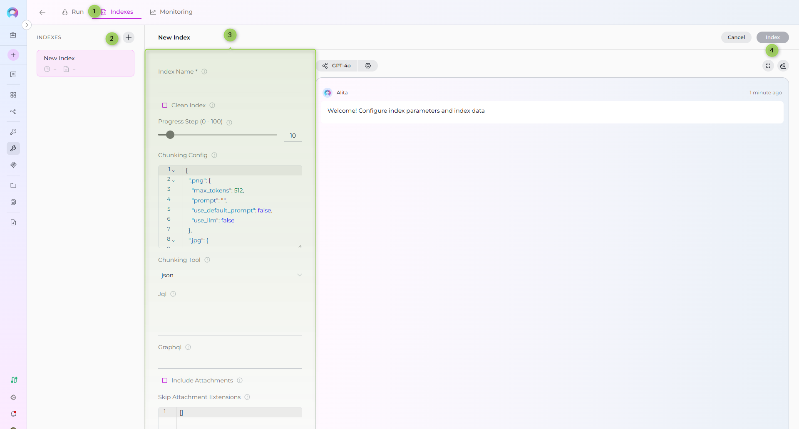
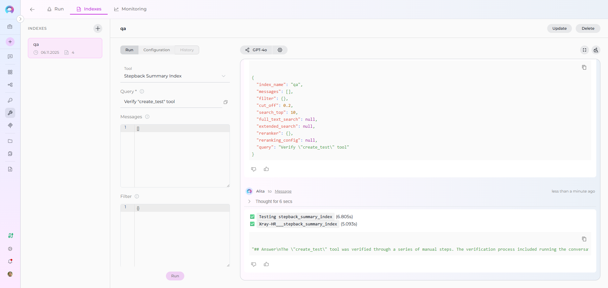

# Index Xray Data


This guide provides a complete step-by-step walkthrough for indexing Xray Cloud data and then searching or chatting with the indexed content using ELITEA's AI-powered tools.

## Overview

Xray Cloud indexing allows you to create searchable indexes from your Xray test management content:

- **Test Cases**: Detailed test procedures, manual test steps with actions, data, and expected results
- **Test Types**: Support for Manual, Cucumber/Gherkin, and Generic test types
- **Test Metadata**: Test keys, summaries, descriptions, test types, and custom fields
- **Attachments**: Screenshots, test files, documentation, and media attached to test steps
- **Preconditions**: Associated preconditions for test case setup requirements

**What you can do with indexed Xray data:**

- **Semantic Search**: Find test cases and procedures across projects using natural language queries
- **Context-Aware Chat**: Get AI-generated answers from your test documentation with citations to specific test cases
- **Cross-Project Discovery**: Search across multiple Xray projects and test types
- **Test Analysis**: Analyze testing patterns, coverage, and procedures for quality improvement
- **Knowledge Extraction**: Transform test documentation into searchable organizational knowledge

**Common use cases:**

- Finding similar test cases across projects to avoid duplication and ensure consistency
- Onboarding new QA team members by allowing them to ask questions about testing procedures and standards
- Analyzing test coverage gaps and identifying areas needing additional test cases
- Support teams searching for existing test procedures when investigating issues
- Test managers extracting insights from test documentation for reporting and process improvement

---

## Prerequisites

Before indexing Xray data, ensure you have:

1. **Xray Credential**: Xray Cloud API credentials with [Client ID and Client Secret](../credentials-toolkits/how-to-use-credentials.md#xray-credential-setup) configured in ELITEA
2. **Vector Storage**: PgVector selected in Settings → [AI Configuration](../../menus/settings/ai-configuration.md)
3. **Embedding Model**: Selected in AI Configuration (defaults available) → [AI Configuration](../../menus/settings/ai-configuration.md)
4. **Xray Toolkit**: Configured with your Xray Cloud instance details and credentials

### Required Permissions

Your Xray credential needs appropriate permissions based on what you want to index:

**For Content Access:**

- Read access to Xray Cloud projects and test cases
- Permission to view the specific projects you want to index

**For Comprehensive Indexing:**

- Access to view test case attachments (if including attachments)
- Permission to view test steps and preconditions
- Access to both active and archived test cases (based on your requirements)

**Authentication Method:**

- **Client Credentials**: Client ID and Client Secret generated in Xray Cloud

---

## Step-by-Step: Creating an Xray Credential

1. **Generate Xray API Credentials** in your Xray Cloud account (API Keys → Generate Client ID and Client Secret)
2. **Create Credential in ELITEA**: Navigate to **Credentials** → **+ Create** → **Xray** → enter details and save

!!! info "Detailed Instructions"
    For complete credential setup steps including API credential generation and security best practices, see:
    
    - [Create a Credential](../../getting-started/create-credential.md)
    - [Xray Credential Setup](../credentials-toolkits/how-to-use-credentials.md#xray-credential-setup)

---

## Step-by-Step: Configure Xray Toolkit

1. **Create Toolkit**: Navigate to [**Toolkits**](../../menus/toolkits.md) → **+ Create** → **XRAY Cloud**
2. **Configure Settings**: Set Xray Cloud base URL and assign your Xray credential
3. **Enable Tools**: Select `Index Data`, `List Collections`, `Search Index`, `Stepback Search Index`, `Stepback Summary Index`, and `Remove Index` tools
4. **Save Configuration**

### Tool Overview:
   - **Index Data**: Creates searchable indexes from Xray test cases and documentation
   - **List Collections**: Lists all available collections/indexes to verify what's been indexed
   - **Search Index**: Performs semantic search across indexed content using natural language queries
   - **Stepback Search Index**: Advanced search that breaks down complex questions into simpler parts for better results
   - **Stepback Summary Index**: Generates summaries and insights from search results across indexed content
   - **Remove Index**: Deletes existing collections/indexes when you need to clean up or start fresh

### Configuration Settings:

| Setting | Description | Example Value |
|---------|-------------|---------------|
| **Base URL** | Xray Cloud instance URL | `https://xray.cloud.getxray.app` |
| **Client ID** | Xray API Client ID | Select from Secrets or enter directly |
| **Client Secret** | Xray API Client Secret | Select from Secrets or enter directly |

!!! note "Xray Cloud URL"
    The default Xray Cloud base URL is `https://xray.cloud.getxray.app`. Use this unless you have a custom Xray instance.

---

## Step-by-Step: Index Xray Data

!!! info "Primary Interface"
    All indexing operations are performed via the **Indexes Tab Interface**. This dedicated interface provides comprehensive index management with visual status indicators, real-time progress monitoring, and integrated search capabilities.

!!! warning "Requirements"
    Before proceeding, ensure your project has PgVector and Embedding Model configured in Settings → AI Configuration, and your Xray toolkit has the **Index Data** tool enabled.

### Step 1: Access the Interface

1. **Navigate to Toolkits**: Go to **Toolkits** in the main navigation
2. **Select Your Xray Toolkit**: Choose your configured Xray toolkit from the list
3. **Open Indexes Tab**: Click on the **Indexes** tab in the toolkit detail view

If the tab is disabled or not visible, verify that:

- PgVector and Embedding Model are configured in Settings → AI Configuration
- The **Index Data** tool is enabled in your toolkit configuration

### Step 2: Create a New Index

1. **Click Create New Index**: In the Indexes sidebar, click the **+ Create New Index** button
2. **New Index Form**: The center panel displays the new index creation form

### Step 3: Configure Index Parameters

Fill in the required and optional parameters for your Xray indexing:

| Parameter | Required | Description | Example Value |
|-----------|----------|-------------|---------------|
| Index Name | ✓ | Suffix for collection name (max 7 chars) | `tests` or `qa` |
| Clean Index | ✗ | Remove existing index data before re-indexing | ✓ (checked) or ✗ (unchecked) |
| Progress Step (0 - 100) | ✗ | Step size for progress reporting during indexing | `10` (default) |
| Chunking Config | ✗ | Configuration settings for content chunking | `{"chunk_size": 4000, "chunk_overlap": 200}` |
| Chunking Tool | ✗ | Method for splitting content into chunks | `json` (default) |
| jql | ✗ | JQL query for searching test cases in Xray | `project = "CALC" AND testType = "Manual"` |
| graphql | ✗ | Custom GraphQL query for advanced data extraction | See examples below |
| include_attachments | ✗ | Whether to include attachment content in indexing | ✓ (checked) or ✗ (unchecked) |
| skip_attachment_extensions | ✗ | File extensions to skip when processing attachments | `[".exe", ".zip", ".bin"]` |

!!! note "JQL or GraphQL Required"
    You must provide either `jql` or `graphql` parameter, but not both. Use JQL for standard queries and GraphQL for advanced custom queries.



### JQL Query Examples

Standard JQL query syntax for filtering Xray test cases:

```
project = "CALC" AND testType = "Manual"
```

```
project = "CALC" AND labels in ("Smoke", "Regression")
```

```
project = "CALC" AND summary ~ "login"
```

```
project = "CALC" AND testType = "Manual" AND labels in ("Smoke", "Critical")
```

**Supported JQL fields:**

| Field | Description | Example |
|-------|-------------|---------|
| `project` | Project key filter | `project = "CALC"` |
| `testType` | Filter by test type | `testType = "Manual"` |
| `labels` | Filter by labels | `labels = "Smoke"` or `labels in ("Smoke", "Regression")` |
| `summary` | Search in test summary | `summary ~ "login"` |
| `description` | Search in test description | `description ~ "authentication"` |
| `status` | Filter by test status | `status = "Active"` |
| `priority` | Filter by test priority | `priority = "High"` |

### GraphQL Query Examples

Custom GraphQL queries for advanced data extraction:

```graphql
query { 
  getTests(jql: "project = \"CALC\"") { 
    results { 
      issueId 
      jira(fields: ["key"]) 
      testType { name } 
      steps { action result } 
    } 
  } 
}
```

```graphql
query { 
  getTests(jql: "project = \"CALC\"") { 
    results { 
      issueId 
      jira(fields: ["key", "summary", "description", "created"]) 
      testType { name kind } 
      steps { 
        id 
        action 
        data 
        result 
        attachments { 
          id 
          filename 
          downloadLink 
        } 
      } 
    } 
  } 
}
```

### Step 4: Start Indexing

1. **Form Validation**: The **Index** button remains inactive until all required fields are filled
2. **Review Configuration**: Verify all parameters are correct
3. **Click Index Button**: Start the indexing process
4. **Monitor Progress**: Watch real-time updates with visual indicators:
      - 🔄 **In Progress**: Indexing is currently running
      - ✅ **Completed**: Indexing finished successfully
      - ❌ **Failed**: Indexing encountered an error

!!! info "Alternative: Test Settings Method"
    For quick testing and validation, you can also use the **Test Settings** panel on the right side of the toolkit detail page. Select a model, choose the **Index Data** tool from the dropdown, configure parameters, and click **Run Tool**. However, the Indexes Tab Interface is the recommended approach for comprehensive index management.

### Step 5: Verify Index Creation

After indexing completes, verify the index was created successfully:

1. **Check Index Status**: Visual indicators show completion status
2. **Review Index Details**: Click on the created index to see metadata and document count
3. **Test Search**: Use the **Run** tab to test search functionality with sample queries


### Step 6: Search Your Indexed Data

**Direct Search via Indexes Tab:**

1. **Access Indexes Tab**: Navigate to your Xray toolkit → **Indexes** tab
2. **Select Index**: Click on your created index from the sidebar
3. **Open Run Tab**: Click the **Run** tab in the center panel
4. **Choose Search Tool**: Select from available search tools:
      - **Search Index**: Basic semantic search
      - **Stepback Search Index**: Advanced search with question breakdown
      - **Stepback Summary Index**: Summarized insights from search results
5. **Enter Query**: Type your natural language question
6. **View Results**: See responses with citations to specific test cases



### Real-Life Example: Indexing Calculator Project Tests

**Scenario**: You have a QA team with comprehensive test documentation in Xray Cloud for a calculator application. You want to make all test cases, procedures, and testing knowledge searchable for team collaboration and knowledge sharing.

**Indexing Steps:**

1. **Configure Xray Toolkit:**
     - Base URL: `https://xray.cloud.getxray.app`
     - Client ID: Generated from Xray Cloud API Keys
     - Client Secret: Generated from Xray Cloud API Keys

2. **Index All Manual Tests:**
     - JQL: `project = "CALC" AND testType = "Manual"`
     - Collection suffix: `manual`
     - Progress Step: `10` (report every 10 test cases)
     - Clean Index: ✓ (for fresh start)
     - Include Attachments: ✓ (for test screenshots and documentation)
     - Skip Attachment Extensions: `[".exe", ".zip"]`
     - Chunking Tool: `json`

3. **Index Smoke Tests (Optional):**
     - JQL: `project = "CALC" AND labels in ("Smoke", "Critical")`
     - Collection suffix: `smoke`
     - Include Attachments: ✓

4. **Index Specific Test Type (Optional):**
     - JQL: `project = "CALC" AND testType = "Cucumber"`
     - Collection suffix: `bdd`
     - Include Attachments: ✗ (Cucumber tests use text-based Gherkin)

5. **Verify indexing:**
     - Use "List Collections" tool to confirm collections exist
     - Expected collections: `manual`, `smoke`, `bdd`
     - Check indexing output for test case processing confirmation

**After indexing, you can search for:**

- **Feature-specific tests**: *"Find all test cases for addition functionality"*
- **Test type queries**: *"What are the steps to test division by zero?"*
- **Cross-functional testing**: *"Show me test cases that verify scientific calculator functions"*
- **Test coverage analysis**: *"Are there tests for negative number operations?"*
- **Precondition checks**: *"What preconditions are needed for advanced calculation tests?"*

---

## Search and Chat with Indexed Data

Once your Xray data is indexed, you can use it in multiple ways:

### Using Toolkit in Conversations and Agents

Your Xray toolkit can be used in two main contexts:

1. **In Conversations**: Add the toolkit as a participant to ask questions and search your indexed Xray data
2. **In Agents**: Include the toolkit when creating AI agents to give them access to your Xray test data

**How to use:**

- **Start a New Conversation or Create an Agent**
- **Add Toolkit as Participant**: Select your Xray toolkit from the available toolkits
- **Ask Natural Language Questions**: The toolkit will automatically search your indexed data and provide relevant answers with citations

### Real-Life Example Workflow

Let's walk through a complete example of indexing and using a calculator project's Xray data:

**Step 1: Setup Xray Toolkit for Calculator Project**

**Step 2: Use in Conversations**

 **Add toolkit to a conversation and start asking questions:**

   - Navigate to **Conversations** → **+ New Conversation**
   - In the participants section click + to add Toolkit
   - Select your Xray toolkit from the available toolkits list

**Step 3: Index the Project Tests**

 * **User Request in Chat:**
 
     > "Index all manual tests from project CALC with suffix 'manual'. Include attachments but skip .exe and .zip files. Clean any existing index first."

**Step 4: Verify Index Creation**

 * **User Request in Chat:**
 
     > "List my collections"

 * **Xray Toolkit Response:**

 This confirms the indexing completed successfully and your project collection is available for searching.

**Step 5: Start the conversation and begin asking questions about your indexed content**

  * **User:** "What are the test steps for verifying addition operations?"
   
  * **Xray Toolkit:** "Based on your indexed test data, here are the test steps for addition:
   
    1. **CALC-123: Basic Addition Test**
          - Action: Enter first number (e.g., 5)
          - Data: First operand
          - Result: Number displayed on screen
          - Action: Click addition operator (+)
          - Result: Operator registered
          - Action: Enter second number (e.g., 3)
          - Data: Second operand
          - Result: Number displayed
          - Action: Click equals (=)
          - Result: Result shows 8
   
    2. **CALC-156: Negative Number Addition**
          - Action: Enter negative number (e.g., -10)
          - Result: Negative sign displayed
          - Action: Click addition operator (+)
          - Action: Enter positive number (e.g., 5)
          - Result: Result shows -5
   
   *Sources: CALC-123 (Test Type: Manual), CALC-156 (Test Type: Manual, Labels: Smoke)*"

---


## Attachment Handling

When `include_attachments` is enabled, Xray indexing processes attachments from test steps:

### Attachment Processing

1. **Extraction**: Attachments are extracted from test step definitions
2. **Filtering**: Extensions in `skip_attachment_extensions` are skipped
3. **Content Extraction**: Supported file types have their content extracted and indexed
4. **Linking**: Attachments are linked to parent test cases via metadata

### Supported Attachment Types

The indexing process can extract content from:

- **Text files**: .txt, .md, .csv
- **Documents**: .pdf, .doc, .docx
- **Images**: .png, .jpg, .gif (OCR if configured)
- **Other**: Various file formats based on available parsers

### Example Configuration

To index tests with attachments but skip large binary files:

```
include_attachments: true
skip_attachment_extensions: [".exe", ".zip", ".bin", ".iso", ".dmg"]
```

---

## Metadata and Search Fields

Each indexed test case includes metadata fields that enable rich searching:

| Field | Description | Example Value |
|-------|-------------|---------------|
| `doctype` | Document type identifier | `xray_test` |
| `key` | Jira issue key for the test | `CALC-123` |
| `summary` | Test case summary/title | `Verify basic addition functionality` |
| `issueId` | Internal Xray issue ID | `12345` |
| `projectId` | Xray project ID | `10001` |
| `testType` | Type of test (Manual, Cucumber, Generic) | `Manual` |
| `testKind` | Kind classification | `test` |
| `created_on` | Test creation timestamp | `2024-01-15T10:30:00Z` |
| `assignee` | Assigned QA engineer | `john.doe@company.com` |
| `reporter` | Test creator | `jane.smith@company.com` |

These metadata fields are searchable and used for filtering and citation in search results.

---

## Troubleshooting

### Common Issues and Solutions

**Issue: "Either 'jql' or 'graphql' parameter must be provided"**

- **Cause**: Neither JQL nor GraphQL query was specified in indexing parameters
- **Solution**: Provide either a `jql` query (e.g., `project = "CALC"`) or a `graphql` query in the index configuration

**Issue: "Please provide either 'jql' or 'graphql', not both"**

- **Cause**: Both JQL and GraphQL parameters were provided simultaneously
- **Solution**: Choose one query method and remove the other parameter

**Issue: "No test data found in GraphQL response"**

- **Cause**: Custom GraphQL query did not return test data in expected format
- **Solution**: Verify your GraphQL query returns test objects with fields like `issueId`, `jira`, `testType`, and `steps`

**Issue: "Authentication failed: 401 Unauthorized"**

- **Cause**: Invalid or expired Client ID/Client Secret credentials
- **Solution**: Regenerate API credentials in Xray Cloud and update your ELITEA credential configuration

**Issue: Attachments not being indexed**

- **Cause**: `include_attachments` not enabled or all extensions are filtered
- **Solution**: Enable `include_attachments: true` and review `skip_attachment_extensions` list

**Issue: Slow indexing performance**

- **Cause**: Large number of attachments or large attachment files
- **Solution**: Use `skip_attachment_extensions` to filter out large or unnecessary file types (e.g., videos, large images)

**Issue: Poor search results or no relevant results found**

- **Cause**: Search **Cut Off** score is too high, filtering out potentially relevant results
- **Solution**: Adjust the **Cut Off** score in your search tool configuration. Lower values (e.g., 0.3-0.5) return more results, higher values (e.g., 0.7-0.9) return only highly relevant matches. Start with a lower **Cut Off** and gradually increase if too many irrelevant results appear.

---

## Best Practices

### Indexing Strategy

1. **Start Small**: Begin with a single project or test type to validate configuration
2. **Filter Wisely**: Use JQL to index only relevant test cases (active tests, specific labels)
3. **Clean Indexes**: Enable `clean_index` when re-indexing to avoid duplicates
4. **Monitor Progress**: Use appropriate `progress_step` values (5-20) for visibility

### Query Optimization

1. **Use JQL for Standard Queries**: JQL is simpler and sufficient for most use cases
2. **Use GraphQL for Complex Needs**: GraphQL allows custom field selection and nested data
3. **Combine Filters**: Use multiple JQL conditions to narrow results (project + testType + labels)

### Attachment Management

1. **Skip Binary Files**: Always exclude executables, archives, and system files
2. **Skip Large Images**: Consider skipping high-resolution images or videos
3. **Target Useful Content**: Index PDFs, docs, and screenshots that contain searchable content

### Collection Naming

1. **Use Descriptive Suffixes**: Choose meaningful 7-character suffixes (`manual`, `smoke`, `regress`)
2. **Separate by Purpose**: Create different indexes for different test categories or projects
3. **Document Conventions**: Maintain a naming convention guide for your team

---

## Additional Resources

!!! info "Related Documentation"
    - [Indexing Overview](./indexing-overview.md) - Comprehensive guide to ELITEA indexing
    - [Indexing Tools Reference](./indexing-tools.md) - Complete toolkit settings and parameters
    - [Using the Indexes Tab Interface](./using-indexes-tab-interface.md) - Detailed interface guide
    - [Toolkits Menu](../../menus/toolkits.md) - General toolkit management
    - [Create a Credential](../../getting-started/create-credential.md) - Credential setup guide
    - [Xray Credential Setup](../credentials-toolkits/how-to-use-credentials.md#xray-credential-setup) - Xray-specific credential configuration

---
