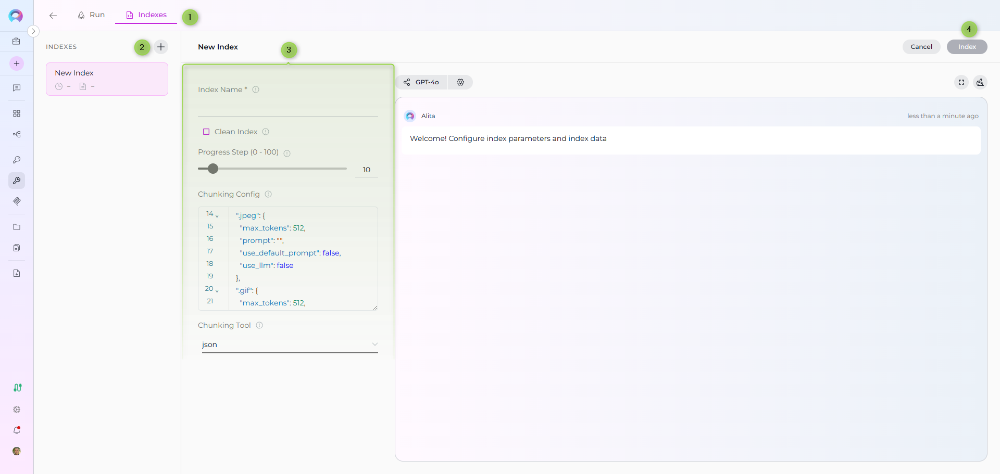
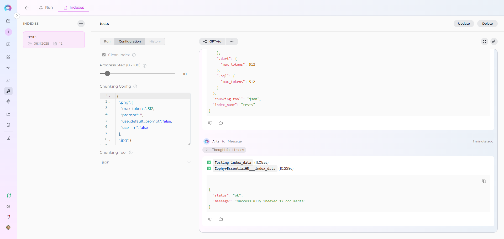
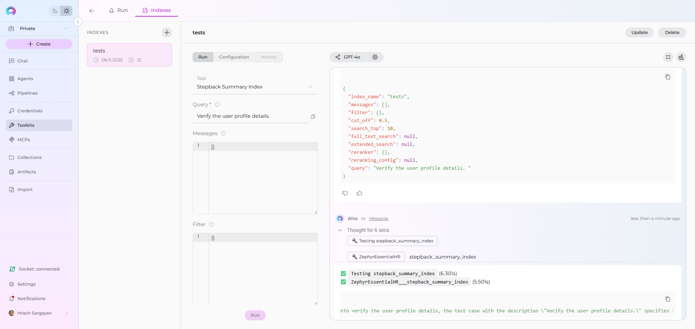

# Index Zephyr Data

This guide provides a complete step-by-step walkthrough for indexing Zephyr test management data and then searching or chatting with the indexed content using ELITEA's AI-powered tools.

## Overview

Zephyr indexing allows you to create searchable indexes from your Zephyr test management content across three Zephyr products:

- **Zephyr Scale** (formerly Zephyr for Jira): Cloud-based test management for Jira Cloud
- **Zephyr Enterprise**: Enterprise-level test management solution
- **Zephyr Essential**: Essential test management capabilities for Jira Cloud

### What you can index:

- **Test Cases**: Detailed test procedures with manual test steps including actions, data, and expected results
- **Test Steps**: Individual step-by-step instructions for test execution
- **Test Metadata**: Test keys, summaries, descriptions, test types, priorities, statuses, and custom fields
- **Folder Structure**: Test case organization and hierarchy across folders
- **Test Scripts**: Automated test scripts and procedures (Zephyr Essential)
- **Custom Fields**: Project-specific custom field data for specialized tracking

**What you can do with indexed Zephyr data:**

- **Semantic Search**: Find test cases and procedures across projects using natural language queries
- **Context-Aware Chat**: Get AI-generated answers from your test documentation with citations to specific test cases
- **Cross-Project Discovery**: Search across multiple Zephyr projects, folders, and test types
- **Test Analysis**: Analyze testing patterns, coverage, and procedures for quality improvement
- **Knowledge Extraction**: Transform test documentation into searchable organizational knowledge
- **Test Reuse**: Find similar test cases to avoid duplication and ensure consistency

**Common use cases:**

- Finding similar test cases across projects to avoid duplication and ensure consistency
- Onboarding new QA team members by allowing them to ask questions about testing procedures and standards
- Analyzing test coverage gaps and identifying areas needing additional test cases
- Support teams searching for existing test procedures when investigating issues
- Test managers extracting insights from test documentation for reporting and process improvement
- Searching for test cases by folder path or folder name for organized test discovery

---

## Prerequisites

Before indexing Zephyr data, ensure you have:

1. **Zephyr Credential**: Appropriate Zephyr credentials configured in ELITEA (credentials vary by Zephyr product)
2. **Vector Storage**: PgVector selected in Settings → [AI Configuration](../../menus/settings/ai-configuration.md)
3. **Embedding Model**: Selected in AI Configuration (defaults available) → [AI Configuration](../../menus/settings/ai-configuration.md)
4. **Zephyr Toolkit**: Configured with your Zephyr instance details and credentials

### Zephyr Product Authentication

Different Zephyr products require different authentication methods:

**Zephyr Scale (Cloud):**
- **Token**: API token from Zephyr Scale settings
- **Username & Password**: Jira Cloud credentials
- **Cookies**: Session cookies for authentication

**Zephyr Enterprise:**
- **Token**: API token generated in Zephyr Enterprise

**Zephyr Essential:**
- **Token**: API token from Zephyr Essential

### Required Permissions

Your Zephyr credential needs appropriate permissions based on what you want to index:

**For Content Access:**
- Read access to Zephyr projects and test cases
- Permission to view the specific projects you want to index
- Access to folder structures and test hierarchies

**For Comprehensive Indexing:**
- Access to view test steps and test scripts
- Permission to view custom fields and metadata
- Access to both active and archived test cases (based on your requirements)

---

## Step-by-Step: Creating Zephyr Credentials

### Zephyr Scale Credential

1. **Generate Zephyr Scale API Token** in your Zephyr Scale settings
2. **Create Credential in ELITEA**: Navigate to **Credentials** → **+ Create** → **Zephyr Scale** → enter details and save

**Configuration Fields:**

| Field | Description | Required |
|-------|-------------|----------|
| **Base URL** | Zephyr Scale instance URL | ✓ |
| **Token** | API token from Zephyr Scale | ✗ (if using username/password) |
| **Username** | Jira Cloud username | ✗ (if using token) |
| **Password** | Jira Cloud password | ✗ (if using token) |
| **Cookies** | Session cookies | ✗ (alternative auth) |

### Zephyr Enterprise Credential

1. **Generate API Token** in your Zephyr Enterprise instance
2. **Create Credential in ELITEA**: Navigate to **Credentials** → **+ Create** → **Zephyr Enterprise** → enter details and save

**Configuration Fields:**

| Field | Description | Required |
|-------|-------------|----------|
| **Base URL** | Zephyr Enterprise base URL | ✓ |
| **Token** | API token from Zephyr Enterprise | ✓ |

### Zephyr Essential Credential

1. **Generate API Token** in Zephyr Essential settings
2. **Create Credential in ELITEA**: Navigate to **Credentials** → **+ Create** → **Zephyr Essential** → enter details and save

**Configuration Fields:**

| Field | Description | Required |
|-------|-------------|----------|
| **Base URL** | Zephyr Essential API base URL | ✗ (has default) |
| **Token** | API token from Zephyr Essential | ✓ |

!!! info "Detailed Instructions"
    For complete credential setup steps including API token generation and security best practices, see:
    
    - [Create a Credential](../../getting-started/create-credential.md)
    - [Credentials and Toolkits Guide](../credentials-toolkits/how-to-use-credentials.md)

---

## Step-by-Step: Configure Zephyr Toolkit

### Zephyr Scale Toolkit

1. **Create Toolkit**: Navigate to [**Toolkits**](../../menus/toolkits.md) → **+ Create** → **Zephyr Scale**
2. **Configure Settings**: Set Zephyr Scale base URL and assign your Zephyr Scale credential
3. **Enable Tools**: Select `Index Data`, `List Collections`, `Search Index`, `Stepback Search Index`, `Stepback Summary Index`, and `Remove Index` tools
4. **Save Configuration**

### Zephyr Enterprise Toolkit

1. **Create Toolkit**: Navigate to [**Toolkits**](../../menus/toolkits.md) → **+ Create** → **Zephyr Enterprise**
2. **Configure Settings**: Set Zephyr Enterprise base URL and assign your Zephyr Enterprise credential
3. **Enable Tools**: Select `Index Data`, `List Collections`, `Search Index`, `Stepback Search Index`, `Stepback Summary Index`, and `Remove Index` tools
4. **Save Configuration**

### Zephyr Essential Toolkit

1. **Create Toolkit**: Navigate to [**Toolkits**](../../menus/toolkits.md) → **+ Create** → **Zephyr Essential**
2. **Configure Settings**: Set Zephyr Essential base URL (or use default) and assign your Zephyr Essential credential
3. **Enable Tools**: Select `Index Data`, `List Collections`, `Search Index`, `Stepback Search Index`, `Stepback Summary Index`, and `Remove Index` tools
4. **Save Configuration**

### Tool Overview

All Zephyr toolkits share these common indexing tools:

- **Index Data**: Creates searchable indexes from Zephyr test cases and documentation
- **List Collections**: Lists all available collections/indexes to verify what's been indexed
- **Search Index**: Performs semantic search across indexed content using natural language queries
- **Stepback Search Index**: Advanced search that breaks down complex questions into simpler parts for better results
- **Stepback Summary Index**: Generates summaries and insights from search results across indexed content
- **Remove Index**: Deletes existing collections/indexes when you need to clean up or start fresh

---

## Step-by-Step: Index Zephyr Data

!!! info "Primary Interface"
    All indexing operations are performed via the **Indexes Tab Interface**. This dedicated interface provides comprehensive index management with visual status indicators, real-time progress monitoring, and integrated search capabilities.

!!! warning "Requirements"
    Before proceeding, ensure your project has PgVector and Embedding Model configured in Settings → AI Configuration, and your Zephyr toolkit has the **Index Data** tool enabled.

### Step 1: Access the Interface

1. **Navigate to Toolkits**: Go to **Toolkits** in the main navigation
2. **Select Your Zephyr Toolkit**: Choose your configured Zephyr toolkit (Scale, Enterprise, or Essential) from the list
3. **Open Indexes Tab**: Click on the **Indexes** tab in the toolkit detail view

If the tab is disabled or not visible, verify that:

- PgVector and Embedding Model are configured in Settings → AI Configuration
- The **Index Data** tool is enabled in your toolkit configuration

### Step 2: Create a New Index

1. **Click Create New Index**: In the Indexes sidebar, click the **+ Create New Index** button
2. **New Index Form**: The center panel displays the new index creation form

### Step 3: Configure Index Parameters

Fill in the required and optional parameters based on your Zephyr product:

#### Common Parameters (All Zephyr Products)

| Parameter | Required | Description | Example Value |
|-----------|----------|-------------|---------------|
| Index Name | ✓ | Suffix for collection name (max 7 chars) | `tests` or `qa` |
| Clean Index | ✗ | Remove existing index data before re-indexing | ✓ (checked) or ✗ (unchecked) |
| Progress Step (0 - 100) | ✗ | Step size for progress reporting during indexing | `10` (default) |
| Chunking Config | ✗ | Configuration settings for content chunking | `{"chunk_size": 4000, "chunk_overlap": 200}` |
| Chunking Tool | ✗ | Method for splitting content into chunks | `json` (default) |

#### Zephyr Scale Specific Parameters

| Parameter | Required | Description | Example Value |
|-----------|----------|-------------|---------------|
| project_key | ✓ | Jira project key filter | `CALC` |
| jql | ✓ | JQL-like query for searching test cases | `folder = "Login Tests"` |

#### Zephyr Enterprise Specific Parameters

| Parameter | Required | Description | Example Value |
|-----------|----------|-------------|---------------|
| zql | ✓ | ZQL query for searching test cases | `folder="TestToolkit"` |

#### Zephyr Essential Specific Parameters

Zephyr Essential indexes all test cases automatically without additional query parameters. Only common parameters are needed.

!!! note "Query Language"
    - **Zephyr Scale** uses JQL-like syntax
    - **Zephyr Enterprise** uses ZQL (Zephyr Query Language)
    - **Zephyr Essential** indexes all accessible test cases

### Zephyr Scale JQL Query Examples

Standard JQL-like query syntax for filtering Zephyr Scale test cases:

```
folder = "Login Tests"
```

```
folderPath = "Root/Subfolder/Authentication"
```

```
label in ("Smoke", "Critical")
```

```
text ~ "login"
```

```
folder = "Authentication" AND label in ("Smoke", "Critical") AND text ~ "login" AND orderBy = "name" AND orderDirection = "ASC"
```


**Supported JQL fields for Zephyr Scale:**

| Field | Description | Example |
|-------|-------------|---------|
| `folder` | Exact folder name filter | `folder = "Login Tests"` |
| `folderPath` | Full folder path | `folderPath = "Root/Subfolder"` |
| `label` | Filter by one or more labels | `label in ("Smoke", "Critical")` |
| `text` | Full-text search in name/description | `text ~ "login"` |
| `customFields` | Filter by custom fields (JSON) | `customFields = '{"priority": "high"}'` |
| `steps` | Search within test steps | `steps ~ "click submit"` |
| `orderBy` | Sort field | `orderBy = "name"` |
| `orderDirection` | Sort direction (ASC or DESC) | `orderDirection = "DESC"` |
| `limit` | Maximum number of results | `limit = 100` |
| `includeSubfolders` | Include subfolders in search | `includeSubfolders = false` |
| `exactFolderMatch` | Match folder name exactly | `exactFolderMatch = true` |

### Zephyr Enterprise ZQL Query Examples

ZQL (Zephyr Query Language) syntax for filtering Zephyr Enterprise test cases:

```
folder="TestToolkit"
```

```
name~"TestToolkit5"
```

```
project="MyProject" AND automated=true
```

```
priority="High" AND tag="Regression"
```

**Supported ZQL fields for Zephyr Enterprise:**

| Field | Description | Example |
|-------|-------------|---------|
| `folder` | Exact folder name filter | `folder="TestToolkit"` |
| `name` | Test case name search | `name~"TestToolkit5"` |
| `project` | Project filter | `project="MyProject"` |
| `priority` | Priority filter | `priority="High"` |
| `tag` | Tag/label filter | `tag="Regression"` |
| `automated` | Automated test filter | `automated=true` |
| `testcaseId` | Test case ID | `testcaseId=12345` |
| `creator` | Created by user | `creator="john.doe"` |
| `release` | Release version | `release="1.0"` |
| `version` | Version filter | `version="2.0"` |



### Step 4: Start Indexing

1. **Form Validation**: The **Index** button remains inactive until all required fields are filled
2. **Review Configuration**: Verify all parameters are correct
3. **Click Index Button**: Start the indexing process
4. **Monitor Progress**: Watch real-time updates with visual indicators:
      - 🔄 **In Progress**: Indexing is currently running
      - ✅ **Completed**: Indexing finished successfully
      - ❌ **Failed**: Indexing encountered an error

!!! info "Alternative: Test Settings Method"
    For quick testing and validation, you can also use the **Test Settings** panel on the right side of the toolkit detail page. Select a model, choose the **Index Data** tool from the dropdown, configure parameters, and click **Run Tool**. However, the Indexes Tab Interface is the recommended approach for comprehensive index management.

### Step 5: Verify Index Creation

After indexing completes, verify the index was created successfully:

1. **Check Index Status**: Visual indicators show completion status
2. **Review Index Details**: Click on the created index to see metadata and document count
3. **Test Search**: Use the **Run** tab to test search functionality with sample queries



### Step 6: Search Your Indexed Data

**Direct Search via Indexes Tab:**

1. **Access Indexes Tab**: Navigate to your Zephyr toolkit → **Indexes** tab
2. **Select Index**: Click on your created index from the sidebar
3. **Open Run Tab**: Click the **Run** tab in the center panel
4. **Choose Search Tool**: Select from available search tools:
      - **Search Index**: Basic semantic search
      - **Stepback Search Index**: Advanced search with question breakdown
      - **Stepback Summary Index**: Summarized insights from search results
5. **Enter Query**: Type your natural language question
6. **View Results**: See responses with citations to specific test cases



---

## Real-Life Examples

### Example 1: Zephyr Scale - Calculator Project

**Scenario**: You have comprehensive test documentation in Zephyr Scale for a calculator application organized in folders. You want to make all test cases searchable for team collaboration.

**Indexing Steps:**

1. **Configure Zephyr Scale Toolkit:**
     - Base URL: `https://api.zephyrscale.smartbear.com/v2`
     - Token: Generated from Zephyr Scale API Access Tokens

2. **Index All Tests in Folder:**
     - Project Key: `CALC`
     - JQL: `folder = "Calculator Tests" AND includeSubfolders = true`
     - Collection suffix: `calctests`
     - Progress Step: `10`
     - Clean Index: ✓
     - Chunking Tool: `json`

3. **Index Smoke Tests Only:**
     - Project Key: `CALC`
     - JQL: `label in ("Smoke", "Critical") AND orderBy = "name"`
     - Collection suffix: `smoke`

4. **Verify indexing:**
     - Use "List Collections" tool to confirm collections exist
     - Expected collections: `calctests`, `smoke`

**Search Examples:**

- *"Find all test cases for addition functionality"*
- *"What are the steps to test division by zero?"*
- *"Show me test cases in the Login Tests folder"*

### Example 2: Zephyr Enterprise - E-commerce Platform

**Scenario**: You have a large test repository in Zephyr Enterprise for an e-commerce platform and need to index specific folders for regression testing.

**Indexing Steps:**

1. **Configure Zephyr Enterprise Toolkit:**
     - Base URL: `https://zephyr.company.com`
     - Token: Generated from Zephyr Enterprise API Keys

2. **Index Regression Tests:**
     - ZQL: `folder="Regression" AND automated=false`
     - Collection suffix: `regress`
     - Progress Step: `10`
     - Clean Index: ✓
     - Chunking Tool: `json`

3. **Index High Priority Tests:**
     - ZQL: `priority="High" AND tag="Critical"`
     - Collection suffix: `critical`

4. **Verify indexing:**
     - Use "List Collections" tool to confirm collections exist
     - Expected collections: `regress`, `critical`

**Search Examples:**

- *"Find test cases for checkout functionality"*
- *"What high priority tests exist for payment processing?"*
- *"Show me all regression tests for user authentication"*

### Example 3: Zephyr Essential - Mobile App Testing

**Scenario**: You use Zephyr Essential for mobile app testing and want to index all test cases for AI-powered search.

**Indexing Steps:**

1. **Configure Zephyr Essential Toolkit:**
     - Base URL: `https://prod-api.zephyr4jiracloud.com/v2` (default)
     - Token: Generated from Zephyr Essential

2. **Index All Test Cases:**
     - Collection suffix: `mobile`
     - Progress Step: `10`
     - Clean Index: ✓
     - Chunking Tool: `json`

3. **Verify indexing:**
     - Use "List Collections" tool to confirm collection exists
     - Expected collection: `mobile`

**Search Examples:**

- *"Find all test cases for iOS app"*
- *"What are the test steps for user registration?"*
- *"Show me test cases with screenshots"*

---

## Search and Chat with Indexed Data

Once your Zephyr data is indexed, you can use it in multiple ways:

### Using Toolkit in Conversations and Agents

Your Zephyr toolkit can be used in two main contexts:

1. **In Conversations**: Add the toolkit as a participant to ask questions and search your indexed Zephyr data
2. **In Agents**: Include the toolkit when creating AI agents to give them access to your Zephyr test data

**How to use:**

- **Start a New Conversation or Create an Agent**
- **Add Toolkit as Participant**: Select your Zephyr toolkit from the available toolkits
- **Ask Natural Language Questions**: The toolkit will automatically search your indexed data and provide relevant answers with citations

### Real-Life Example Workflow

**Step 1: Setup Zephyr Toolkit**

Configure your Zephyr toolkit (Scale, Enterprise, or Essential) with appropriate credentials.

**Step 2: Use in Conversations**

**Add toolkit to a conversation and start asking questions:**

- Navigate to **Conversations** → **+ New Conversation**
- In the participants section click + to add Toolkit
- Select your Zephyr toolkit from the available toolkits list

**Step 3: Index the Test Data**

**User Request in Chat:**

> "Index all test cases from project CALC in folder 'Authentication' with suffix 'auth'. Include subfolders and clean any existing index first."

**Step 4: Verify Index Creation**

**User Request in Chat:**

> "List my collections"

**Step 5: Start asking questions about your indexed content**

**User:** "What are the test steps for verifying login functionality?"

**Zephyr Toolkit:** "Based on your indexed test data, here are the test steps for login verification:

1. **CALC-T123: Basic Login Test**

     - Step 1: Navigate to login page
     - Step 2: Enter valid username
     - Step 3: Enter valid password
     - Step 4: Click login button
     - Expected Result: User is logged in and redirected to dashboard

2. **CALC-T156: Invalid Credentials Test**

     - Step 1: Navigate to login page
     - Step 2: Enter invalid username
     - Step 3: Enter invalid password
     - Step 4: Click login button
     - Expected Result: Error message is displayed

*Sources: CALC-T123 (Folder: Authentication/Login), CALC-T156 (Folder: Authentication/Login, Label: Smoke)*"

---

## Metadata and Search Fields

### Zephyr Scale Metadata Fields

Each indexed Zephyr Scale test case includes metadata fields that enable rich searching:

| Field | Description | Example Value |
|-------|-------------|---------------|
| `key` | Test case key | `CALC-T123` |
| `name` | Test case name | `Verify basic login functionality` |
| `project` | Project information | `{"key": "CALC", "name": "Calculator"}` |
| `folder` | Folder information | `{"name": "Authentication", "id": "123"}` |
| `status` | Test case status | `{"name": "Approved"}` |
| `priority` | Test case priority | `{"name": "High"}` |
| `labels` | Test case labels | `["Smoke", "Critical"]` |
| `createdOn` | Creation timestamp | `2024-01-15T10:30:00Z` |
| `updatedOn` | Last update timestamp | `2024-01-20T14:45:00Z` |
| `customFields` | Custom field values | `{"Build": "1.0", "Team": "QA"}` |
| `type` | Document type | `TEST_CASE` or `FOLDER` |

### Zephyr Enterprise Metadata Fields

Each indexed Zephyr Enterprise test case includes metadata fields:

| Field | Description | Example Value |
|-------|-------------|---------------|
| `id` | Test case ID | `358380` |
| `testcaseId` | Unique test case identifier | `12345` |
| `name` | Test case name | `Desktop.AEM.Booking` |
| `projectId` | Project ID | `75` |
| `projectName` | Project name | `AEM Project` |
| `testcaseType` | Type of test case | `Manual` or `Automated` |
| `lastModifiedOn` | Last modification date | `2024-01-20T14:45:00Z` |

### Zephyr Essential Metadata Fields

Each indexed Zephyr Essential test case includes metadata fields:

| Field | Description | Example Value |
|-------|-------------|---------------|
| `key` | Test case key | `PROJ-T123` |
| `name` | Test case name | `User Registration Test` |
| `type` | Document type | `TEST_CASE` |
| `status` | Test case status | `Draft` or `Approved` |
| `priority` | Test case priority | `High` |
| `createdBy` | Creator information | `{"id": "123", "name": "John Doe"}` |
| `steps_type` | Type of steps/script | `steps` or `script` |

These metadata fields are searchable and used for filtering and citation in search results.

---

## Troubleshooting

### Common Issues and Solutions

**Issue: "Unable to authenticate with Zephyr"**

- **Cause**: Invalid or expired API token/credentials
- **Solution**: Regenerate API token in your Zephyr instance and update your ELITEA credential configuration

**Issue: "No test cases found for the provided query"**

- **Cause**: JQL/ZQL query returns no results or query syntax is incorrect
- **Solution**: 
  - Verify your query syntax matches the Zephyr product (JQL for Scale, ZQL for Enterprise)
  - Test the query directly in Zephyr interface first
  - Check that project key, folder names, or filters are correct

**Issue: "Unable to extract test cases" or "Failed to process document"**

- **Cause**: Missing permissions or test case structure issues
- **Solution**: 
  - Verify your credentials have read access to test cases and steps
  - Check that test cases have proper structure (steps, metadata)
  - Review Zephyr API logs for specific error details

**Issue: Indexing fails with chunking errors**

- **Cause**: Empty or malformed test case content
- **Solution**: 
  - Try using `chunking_tool=""` instead of `json`
  - Verify test cases have content (steps, descriptions)
  - Filter out empty test cases in your query

**Issue: Slow indexing performance**

- **Cause**: Large number of test cases or complex folder structures
- **Solution**: 
  - Use more specific queries to limit the number of test cases
  - Increase `progress_step` for less frequent updates (e.g., 20)
  - Index folders separately for better control

**Issue: Poor search results or no relevant results found**

- **Cause**: Search **Cut Off** score is too high, filtering out potentially relevant results
- **Solution**: Adjust the **Cut Off** score in your search tool configuration. Lower values (e.g., 0.3-0.5) return more results, higher values (e.g., 0.7-0.9) return only highly relevant matches. Start with a lower cutoff and gradually increase if too many irrelevant results appear.

**Issue: Folder structure not indexed (Zephyr Scale)**

- **Cause**: `includeSubfolders` not set or folder path incorrect
- **Solution**: 
  - Use `includeSubfolders = true` in JQL query
  - Verify folder path with exact names (case-sensitive)
  - Use `folderPath` for full path or `folder` for folder name only

---

## Best Practices

### Indexing Strategy

1. **Start Small**: Begin with a single project or folder to validate configuration
2. **Filter Wisely**: Use queries to index only relevant test cases (active tests, specific folders, labels)
3. **Clean Indexes**: Enable `clean_index` when re-indexing to avoid duplicates
4. **Monitor Progress**: Use appropriate `progress_step` values (5-20) for visibility

### Query Optimization

**For Zephyr Scale:**

- Use `folder` for simple folder matching
- Use `folderPath` for exact hierarchical paths
- Combine filters with `AND` for precise results
- Use `orderBy` to control result ordering

**For Zephyr Enterprise:**

- Use ZQL syntax exactly as documented
- Escape string values with quotes
- Combine multiple conditions with `AND`
- Test ZQL queries in Zephyr Enterprise UI first

**For Zephyr Essential:**

- No query needed - indexes all accessible test cases
- Use search filters after indexing for specific results

### Collection Naming

1. **Use Descriptive Suffixes**: Choose meaningful 7-character suffixes (`auth`, `regress`, `smoke`, `mobile`)
2. **Separate by Purpose**: Create different indexes for different folders, projects, or test types
3. **Document Conventions**: Maintain a naming convention guide for your team

### Folder Organization

1. **Leverage Folder Hierarchy**: Use folder paths to organize test cases logically
2. **Include Subfolders**: Use `includeSubfolders = true` to capture complete test suites
3. **Exact vs Partial Matching**: Use `exactFolderMatch` when you need precise folder targeting

---

## Additional Resources

!!! info "Related Documentation"
    - [Indexing Overview](./indexing-overview.md) - Comprehensive guide to ELITEA indexing
    - [Indexing Tools Reference](./indexing-tools.md) - Complete toolkit settings and parameters
    - [Using the Indexes Tab Interface](./using-indexes-tab-interface.md) - Detailed interface guide
    - [Toolkits Menu](../../menus/toolkits.md) - General toolkit management
    - [Create a Credential](../../getting-started/create-credential.md) - Credential setup guide
    - [Credentials and Toolkits Guide](../credentials-toolkits/how-to-use-credentials.md) - Product-specific credential configuration

---
