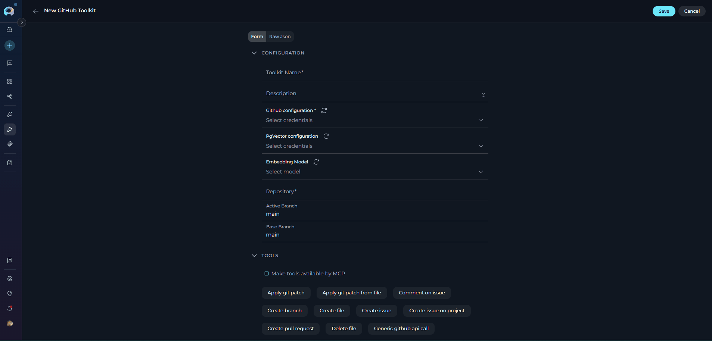
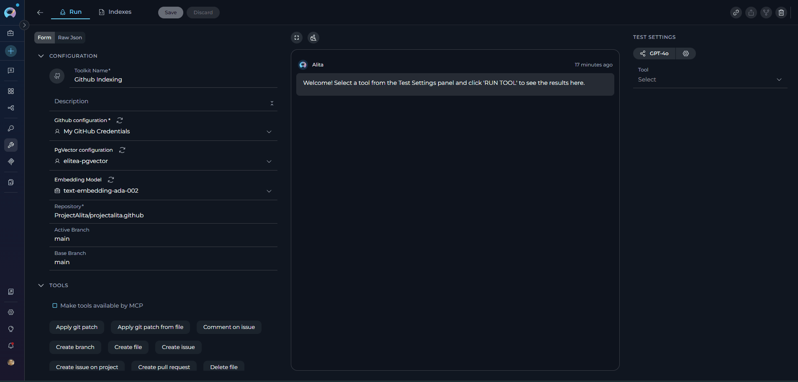
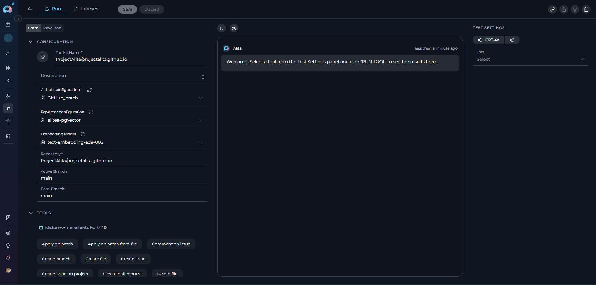
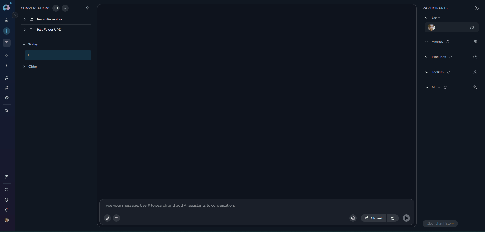

# Indexing Overview

!!! warning "Availability and migration"
	**Indexing** feature and tools are available in the [Next environment](https://next.elitea.ai) as part of the 1.7.0 release. They replace the legacy **Datasources/Datasets** feature. As of Release 1.7.2, a dedicated **Indexes Tab** interface is available within Toolkit Configuration for comprehensive index management. Datasources are still available in the [Nexus environment](https://nexus.elitea.ai) for reference, but new datasets are not supported. See the [Release Notes 1.7.0](../../release-notes/rn_current.md#indexing-dedicated-toolkit-indexes-tab).

## Introduction

**Indexing** turns your external content (repos, wikis, issues, files, designs, tests) into searchable knowledge that Agents and Pipelines, as well as LLMs from Conversations can use. Instead of manually browsing systems, you create indexes once and then search or ask questions with natural language.

The **Indexes Tab interface** provides a comprehensive, user-friendly way to create, manage, and search indexes directly within Toolkit Configuration, featuring visual status indicators, real-time progress monitoring, and integrated search capabilities.

## Purpose of Indexing

* Centralize knowledge from multiple tools into a consistent, searchable store.
* Improve retrieval quality for Agents and LLMs with chunking and metadata.
* Keep results fresh by re-running indexing when content changes.
* Replace legacy datasets with standardized tools across many toolkits.

## Indexing Tools

ELITEA provides six standardized tools available across supported toolkits:

* **Index Data** — create or update an index for a chosen scope.
* **Search Index** — run a search query against existing indexes.
* **Stepback Search Index** — advanced search using stepback context for improved relevance.
* **Stepback Summary Index** — stepback search with on-the-fly summary generation.
* **Remove Index** — delete an existing index.
* **List Collections** — list available collections (logical index groups).

!!! note "Replacement for datasets"
	These tools replace legacy datasets. Your old datasources remain visible for reference in Nexus, but you should use the new tools in Next env to re-create indexes. For detailed migration guidance, see [Migrate Datasources to Indexing](../../migration/v1.7.0/migrate-datasources-to-indexing.md).

## Toolkits which support Indexes

Currently supported toolkits include:

| Category | Toolkits |
|----------|-------------------|
| **Repos** | [ADO Repos, Bitbucket, GitLab, GitHub](./index-github-data.md), |
| **Wikis** | [ADO Wiki](./index-ado-wiki-data.md), [Confluence](./index-confluence-data.md), [SharePoint](./index-sharepoint-data.md) |
| **Issues** | ADO Boards, ADO Plans, [Jira](./index-jira-data.md) |
| **Files** | [Artifact](./index-artifacts-data.md), [SharePoint](./index-sharepoint-data.md) |
| **Designs** | [Figma](./index-figma-data.md) |
| **Tests** | [TestRail](./index-testrail-data.md), [Xray Cloud](./index-xray-data.md), [Zephyr Enterprise, Zephyr Essential, Zephyr Scale](./index-zephyr-data.md) |

## How to configure Toolkit for Indexing

Use these steps to prepare your project and toolkit before running **Index data**.

### Prerequisites

* A toolkit that supports Indexing (see list above) and is added to your project/agent.
* A valid Credential for that toolkit (all toolkits except Artifact require credentials).
* Project-level AI configuration for Vector Storage (PgVector) and Embedding Model.

### Steps

1) Configure Credentials (required for all except Artifact)

   * Create or select a Credential for the target system (e.g., GitHub, Confluence, Jira, SharePoint, ADO, Bitbucket, GitLab).
   * Assign it to your toolkit when creating or editing the toolkit.
   * See: [Create a Credential](../../getting-started/create-credential.md) and specific toolkit pages under Integrations → Toolkits.

2) Configure PgVector (required storage for indexed data)

   * By default, both **Private** and **Team** projects have a shared PgVector configuration you can select.
   * To configure a new PgVector configuration:
     * Click the **New private pgvector credentials** or **New project pgvector credentials** option, regarding what type of credential you need.
     * Fill the information for the PgVector (Display Name, Connection String).
     * Save it to use configuration to use for indexing.
     * Click Refresh icon to update the configuration and have it in the PgVector Configuration dropdown to select.

3) Configure Embedding Model (required for indexing)

   * Default available models in Private and Team projects:
       * **text-embedding-ada-002** — improved, performant version of the ada embedding model
       * **text-embedding-3-small** — improved, performant successor in the 3-series
       * **text-embedding-3-large** — the most capable model for English and non‑English tasks
	  
   * **Practical notes**:
       * For cost/speed, ada-002 and 3-small are similar; test with your data.
       * Some reports suggest ada can work better in certain cases—ada is a solid "go-to" if you just need embeddings.

4) Select Indexing tools on the Toolkit

   * When creating a new toolkit, all Indexing tools are selected by default.
   * You can later enable/disable specific tools from the toolkit's details page.
   * **Required for Indexes Tab**: Index Data tool must be enabled for the Indexes tab to appear.
   * **Recommended minimum**: Index Data, Search Index, Stepback Summary Index for full Indexes Tab functionality.

5) Fill toolkit-required fields (vary by toolkit)

   * Examples of mandatory fields by type:
	  * **Repositories**: organization/project, repository name, branch, path filters, blacklist/allowlist
	  * **Confluence/Wikis**: site URL, space key, labels, CQL filters
	  * **Project Management (Jira/ADO Boards)**: project key/ID, issue filters (JQL/queries), include attachments
	  * **SharePoint**: site/drive, library/folder path, include file types

6) Save the toolkit, if you created a new one.

{loading=lazy }

!!! info "Helpful links"
    * Create a Credential: [Guide](../../getting-started/create-credential.md)
    * Create a Toolkit: [Guide](../../getting-started/create-toolkit.md)
    * Examples: [GitHub](./index-github-data.md), [Confluence](./index-confluence-data.md), [Jira](./index-jira-data.md), [SharePoint](./index-sharepoint-data.md)

## Index data and verify

**Recommended Approach: Indexes Tab Interface**

The **Indexes Tab** provides a dedicated interface within Toolkit Configuration for comprehensive index management with visual status indicators, real-time progress monitoring, and integrated search capabilities. See the [How to create and use indexes](./using-indexes-tab-interface.md) guide for complete instructions.

**Quick Steps:**

1. Navigate to **Toolkits** → Select your toolkit → Click **Indexes** tab
2. Click **+ Create New Index** to create indexes
3. Monitor progress with visual indicators
4. Use integrated search tools directly from the **Run** tab

**Alternative: Toolkit Test Settings**

For quick testing and validation, you can also use the TEST SETTINGS section. The example below uses the **GitHub** toolkit, but the flow is similar for other toolkits.

### Index Data tool

**Primary Method: Use the Indexes Tab Interface**

**Prerequisites:**

* You've already configured a **Github** toolkit and have a repository with files to index.

**Steps:**

1. Navigate to **Toolkits** → select your toolkit that supports indexing
2. Click the **Indexes** tab in the toolkit detail view (tab is disabled if Index Data tool is not enabled or prerequisites are not met)
3. Click the **+ Create New Index** button in the Indexes sidebar
4. In the new index creation form, configure the following:
     - **Index Name (Collection Suffix)**: Unique identifier (max 7 characters, e.g., prod, test, v1)
     - **Toolkit-Specific Parameters**: Repository name, branch, filters (varies by toolkit type)
     - **Progress Step**: Progress reporting interval (0-100), default: 10
     - **Chunking Config**: Document chunking configuration, default: `{}`
5. Click **Index** button to start indexing (button activates when all required fields are filled)
6. Monitor progress with visual indicators:
     - : Indexing is currently running
     - ✅ **Completed**: Indexing finished successfully
     - : Indexing encountered an error
     - : Indexing was manually cancelled
7. Progress messages appear in the Chat Panel (right) in real-time

See the [How to create and use indexes](./using-indexes-tab-interface.md) guide for detailed instructions.

{ loading=lazy }

**Alternative: TEST SETTINGS Approach**

**Prerequisites:**

* You've already configured an **Artifact** toolkit and have a bucket with files to index.

**Steps:**

1. Open **Toolkits** → select your **Artifact** toolkit.
2. See the **TEST SETTINGS** section on the right side.
3. In the tool dropdown, select **Index data** tool.
4. Provide a meaningful **Collection Suffix** (for example: prod, test, v1).
5. Leave other settings at defaults for a first run.
6. Click **RUN TOOL** to start indexing.
7. Progress and completion details appear in the main panel; scroll if needed to view messages.

{ width="900" loading=lazy }

### List Collections tool

**Primary Method: Use the Indexes Tab Interface**

All created indexes are automatically displayed in the **Indexes** tab sidebar. Each index card shows:

- **Index Name**: Collection suffix (e.g., `docs`, `prod`)
- **Creation Date**: Format: `dd.MM.yyyy`
- **Document Count**: Total indexed documents (or `reindexed / total indexed` for reindexed items)
- **Status Icon**: Real-time visual indicator ( In Progress, Completed,  Failed, Stopped)
- **Last Updated**: Timestamp of most recent update

When you select an index from the sidebar, you can:

- **View details** in the Index Management Panel (center)
- **Access three tabs**: Run, Configuration, History
- **Manage the index**: Reindex, schedule, delete, or search

{ width="200" }

!!! tip "Index Management Features"
    - **Manual Reindexing**: Click **Reindex** button in Configuration tab to update index with original settings
    - **Automated Scheduling**: Toggle **Schedule** switch to enable cron-based reindexing (only for completed indexes)
    - **Delete Index**: Use **Delete** button with confirmation modal (requires Remove Index tool enabled)
    - **View History**: Access History tab to see all past operations with sortable Event and Date columns

**Alternative: TEST SETTINGS Approach**

Use this to view the indexes (collections) created for the toolkit.

1. In **TEST SETTINGS**, choose **List Collections**.
2. Click **RUN TOOL**.
3. Review the output in the main panel for available collections.

{ width="900" loading=lazy }

### Reindex and Schedule

**Manual Reindexing:**

To update an existing index with fresh data:

1. Navigate to **Toolkits** → Select your toolkit → Click **Indexes** tab
2. Select the index you want to update from the sidebar
3. Click the **Configuration** tab in the center panel
4. Click **Reindex** button to trigger manual update
5. Monitor progress with real-time visual indicators

{ loading=lazy }

!!! warning "Reindexing Parameters"
    Parameters cannot be modified when reindexing. The operation uses the original configuration settings. To change parameters, create a new index.

**Automated Scheduling:**

To configure periodic reindexing:

1. Select a **completed** index from the sidebar (scheduling only available for completed indexes)
2. Toggle the **Schedule** switch to activate automated reindexing
3. Click the settings icon to open the schedule configuration modal
4. Set **Cron Expression** to define reindexing frequency (e.g., `0 2 * * *` for daily at 2 AM)
5. Click **Save** to activate the automated schedule

**Schedule Status Indicators:**

- **Schedule Toggle**: ON (enabled) or OFF (disabled)
- **Cron Expression**: Displayed next to the schedule controls
- **Next Run**: Timestamp showing when the next automated reindex will occur

{ loading=lazy }

!!! tip "Detailed Scheduling Guide"
    For comprehensive information about scheduling features, cron expressions, troubleshooting, and best practices, see the [Schedule Indexing](./schedule-indexing.md) guide.

### Delete Index

**Delete Process:**

1. Select the index to delete from the sidebar
2. Click **Delete** button in the index information panel
3. Enter the index name in the confirmation modal to confirm
4. Index and all associated data are permanently deleted

{ loading=lazy }

!!! warning "Deletion Warning"
    - Index deletion is **permanent** and **cannot be undone**
    - All indexed data, search history, and configurations are permanently removed
    - The **Delete** button is disabled when the **Remove Index** tool is not enabled in toolkit configuration

### Search Index tool

**Primary Method: Use the Indexes Tab Interface**

1. Navigate to **Toolkits** → Select your toolkit → Click **Indexes** tab
2. Select your completed index from the sidebar
3. Click the **Run** tab in the center panel
4. Choose search tool from dropdown:
     - **Search Index**: Basic semantic search across indexed content
     - **Stepback Search Index**: Advanced search that breaks down complex questions
     - **Stepback Summary Index**: Search with automatic summarization of results
5. Enter your query and configure optional parameters:
     - **Filter**: Metadata filter as dictionary or JSON string
     - **Cut Off (0-1)**: Relevance threshold (0.7 for high relevance, 0.3 for broader)
     - **Search Top**: Maximum number of results (10, 25, 50)
     - **Full Text Search**: Dictionary with full-text search configuration
     - **Extended Search**: List of chunk types to search
     - **Reranking Config**: Dictionary with field-based reranking rules
6. Select LLM model and adjust settings
7. Click **Run** button - results appear in the Chat Panel (right) in conversational format

{ loading=lazy }

!!! info "Search Prerequisites"
    - Only **completed** indexes support search operations
    - At least one search tool must be enabled in toolkit configuration
    - The **Run tab** is disabled if no search tools are enabled

**Accessing Index History:**

The **History** tab provides a chronological record of all indexing operations performed on a selected index.

1. Select an index from the left sidebar
2. Click the **History** tab in the center panel (only available for completed indexes)
3. Review all past indexing events in chronological order

## How to configure and use Indexes from Chat

While the **Indexes Tab interface is the recommended primary method** for index management, you can also trigger indexing and search directly from Chat using an Agent or a Toolkit that exposes indexing tools.

1. Open Chat and start a new conversation or use an existing one. See [Chat](../../menus/chat.md).
2. Select an Agent or Toolkit that has the **Index Data** tool available.
3. Ask the assistant to index your target with scope details, for example:
	 * "Index the GitHub repo org/repo on branch main. Use collection suffix 'prod'."
	 * "Index Confluence space 'ABC' for pages with label docs."
4. Wait for confirmation in the thinking steps. If an error appears, refine your instruction or reconfigure the attached toolkit/credential.

{ width="900" loading=lazy }

Once indexes exist, you can use Search Index or Stepback search tools through Chat as well (e.g., "Search the index for onboarding guidelines").

## FAQs

1. Where do I see my created indexes?
	* **Primary Method**: Navigate to Toolkits → Select your toolkit → Click the **Indexes** tab to view and manage all created indexes with visual status indicators, document counts, and last updated timestamps. The **History** tab provides a chronological record with sortable Event and Date columns, showing Created, Reindexed, Stopped, and Failed operations.
	* **Alternative**: Use List Collections and Search Index via the toolkit Test section or through Chat.
2. Can I keep using Datasources?
	* Datasources remain in Nexus for reference, but indexing in Next replaces datasets. New datasets are not supported.
3. How do I remove an index?
	* **Primary Method**: Use the Indexes Tab - select the index from the sidebar and use the **Delete** button in the index information panel with confirmation modal.
	* **Alternative**: Use Remove Index from the toolkit Test section or trigger it in Chat.
4. Can I search without an Agent?
	* **Primary Method**: Yes. Use the Indexes Tab interface - select your index and access search tools (Search Index, Stepback Search, Stepback Summary) directly from the **Run** tab with integrated chat interface for results.
	* **Alternative**: In a toolkit's Test section run Search Index, or in Chat address a Toolkit that exposes the search tools.
5. Are there usage limits?
	* Next uses shared LLMs for evaluation and may have daily limits. For production, configure your own EPAM AI DIAL keys in Settings → [AI Configuration](../../menus/settings/ai-configuration.md) and see [Configure EPAM AI DIAL Key](../../getting-started/configure-epam-ai-dial-key.md).

!!! success "Next steps"
	* **Start with the Indexes Tab**: Use the [How to create and use indexes](./using-indexes-tab-interface.md) guide to create your first index via the dedicated interface.
	* **Index one system** (e.g., a single repo or space) to validate settings using the Indexes Tab visual progress monitoring.
	* **Try integrated search tools** from the Indexes Tab Run interface: Search Index and Stepback Summary Index to compare results quality.
	* **Review index history**: Use the History tab to track all indexing operations with sortable columns and detailed event information.
	* **Expand scope** and schedule regular re-indexing as content changes using the Indexes Tab management features with automated scheduling via cron expressions.

