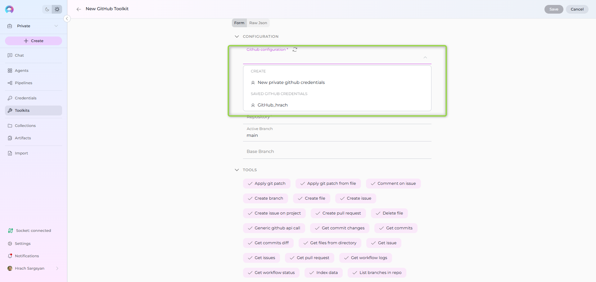
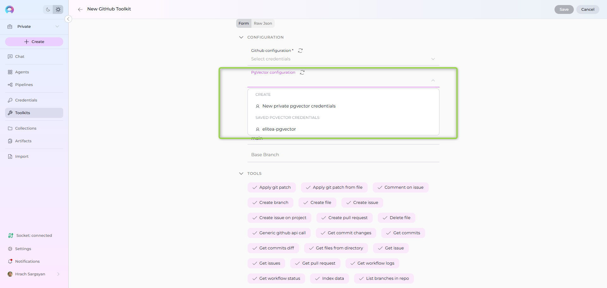
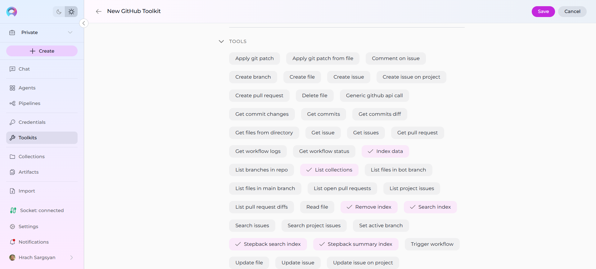
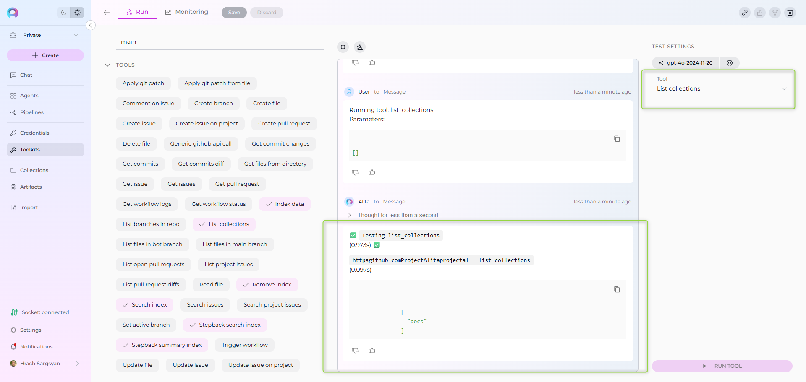
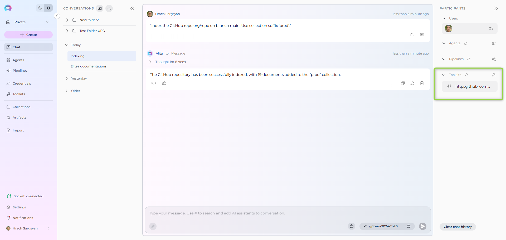

# Indexing Overview

!!! warning "Availability and migration"
	**Indexing** feature and tools are available in the [Next environment](https://next.elitea.ai) as part of the 1.7.0 release. They replace the legacy **Datasources/Datasets** feature. As of Release 1.7.2, a dedicated **Indexes Tab** interface is available within Toolkit Configuration for comprehensive index management. Datasources are still available in the [Nexus environment](https://nexus.elitea.ai) for reference, but new datasets are not supported. See the [Release Notes 1.7.0](../../release-notes/rn_current.md#indexing-dedicated-toolkit-indexes-tab).

## Introduction

**Indexing** turns your external content (repos, wikis, issues, files, designs, tests) into searchable knowledge that Agents and Pipelines, as well as LLMs from Conversations can use. Instead of manually browsing systems, you create indexes once and then search or ask questions with natural language.

The **Indexes Tab interface** provides a comprehensive, user-friendly way to create, manage, and search indexes directly within Toolkit Configuration, featuring visual status indicators, real-time progress monitoring, and integrated search capabilities.

## Purpose of Indexing

* Centralize knowledge from multiple tools into a consistent, searchable store.
* Improve retrieval quality for Agents and LLMs with chunking and metadata.
* Keep results fresh by re-running indexing when content changes.
* Replace legacy datasets with standardized tools across many toolkits.

!!! tip "Quick start"
	For the recommended approach using the new Indexes Tab interface, see the [How to create and use indexes](./using-indexes-tab-interface.md) guide. For the legacy toolkit test section approach, see [Next – Quick Start](../../migration/v1.7.0/next-quick-start.md#index-data-for-a-toolkit).

## Indexing Tools

ELITEA provides six standardized tools available across supported toolkits:

* **Index Data** — create or update an index for a chosen scope.
* **Search Index** — run a search query against existing indexes.
* **Stepback Search Index** — advanced search using stepback context for improved relevance.
* **Stepback Summary Index** — stepback search with on-the-fly summary generation.
* **Remove Index** — delete an existing index.
* **List Collections** — list available collections (logical index groups).

!!! note "Replacement for datasets"
	These tools replace legacy datasets. Your old datasources remain visible for reference in Nexus, but you should use the new tools in Next env to re-create indexes.

## Toolkits which support Indexes

Currently supported toolkits include:

| Category | Toolkits |
|----------|----------|
| **Repos** | ADO Repos, Bitbucket, GitHub, GitLab |
| **Wikis** | ADO Wiki, Confluence, SharePoint |
| **Issues** | ADO Boards, ADO Plans, Jira |
| **Files** | Artifact, SharePoint |
| **Designs** | Figma |
| **Tests** | TestRail, Xray Cloud, Zephyr Enterprise, Zephyr Essential, Zephyr Scale |

For setup of a specific toolkit, see Integrations → Toolkits (e.g., [GitHub Toolkit](../../integrations/toolkits/github_toolkit.md), [Confluence Toolkit](../../integrations/toolkits/confluence_toolkit.md), [Jira Toolkit](../../integrations/toolkits/jira_toolkit.md)).

## How to configure Toolkit for Indexing

Use these steps to prepare your project and toolkit before running **Index data**.

### Prerequisites

* A toolkit that supports Indexing (see list above) and is added to your project/agent.
* A valid Credential for that toolkit (all toolkits except Artifact require credentials).
* Project-level AI configuration for Vector Storage (PgVector) and Embedding Model.

### Steps

1) Configure Credentials (required for all except Artifact)

   * Create or select a Credential for the target system (e.g., GitHub, Confluence, Jira, SharePoint, ADO, Bitbucket, GitLab).
   * Assign it to your toolkit when creating or editing the toolkit.
   * See: [Create a Credential](../../getting-started/create-credential.md) and specific toolkit pages under Integrations → Toolkits.

	{ width="900" }

2) Configure PgVector (required storage for indexed data)

   * By default, both **Private** and **Team** projects have a shared PgVector configuration you can select.
   * To configure a new PgVector configuration:
     * Click the **New private pgvector credentials** or **New project pgvector credentials** option, regarding what type of credential you need.
     * Fill the information for the PgVector (Display Name, Connection String).
     * Save it to use configuration to use for indexing.
     * Click Refresh icon to update the configuration and have it in the PgVector Configuration dropdown to select.

	{ width="900" }

3) Configure Embedding Model (required for indexing)

   * Default available models in Private and Team projects:
       * **text-embedding-ada-002** — improved, performant version of the ada embedding model
       * **text-embedding-3-small** — improved, performant successor in the 3-series
       * **text-embedding-3-large** — the most capable model for English and non‑English tasks
	  
   * **Practical notes**:
       * For cost/speed, ada-002 and 3-small are similar; test with your data.
       * Some reports suggest ada can work better in certain cases—ada is a solid “go-to” if you just need embeddings.

	{ width="900" }

4) Select Indexing tools on the Toolkit

   * When creating a new toolkit, all Indexing tools are selected by default.
   * You can later enable/disable specific tools from the toolkit's details page.
   * **Required for Indexes Tab**: Index Data tool must be enabled for the Indexes tab to appear.
   * **Recommended minimum**: Index Data, Search Index, Stepback Summary Index for full Indexes Tab functionality.

	{ width="900" }

5) Fill toolkit-required fields (vary by toolkit)

   * Examples of mandatory fields by type:
	  * **Repositories**: organization/project, repository name, branch, path filters, blacklist/allowlist
	  * **Confluence/Wikis**: site URL, space key, labels, CQL filters
	  * **Project Management (Jira/ADO Boards)**: project key/ID, issue filters (JQL/queries), include attachments
	  * **SharePoint**: site/drive, library/folder path, include file types

6) Save the toolkit, if you created a new one.

**Helpful links:**

* Create a Credential: [Guide](../../getting-started/create-credential.md)
* Create a Toolkit: [Guide](../chat-conversations/how-to-create-and-edit-toolkits-from-canvas.md)
* Examples: [GitHub](./index-github-data.md), [Confluence](./index-confluence-data.md), [Jira](./index-jira-data.md), [SharePoint](./index-sharepoint-data.md)

## Index data and verify

**Recommended Approach: Indexes Tab Interface**

The **Indexes Tab** provides a dedicated interface within Toolkit Configuration for comprehensive index management with visual status indicators, real-time progress monitoring, and integrated search capabilities. See the [How to create and use indexes](./using-indexes-tab-interface.md) guide for complete instructions.

**Quick Steps:**

1. Navigate to **Toolkits** → Select your toolkit → Click **Indexes** tab
2. Click **+ Create New Index** to create indexes
3. Monitor progress with visual indicators (🔄 In Progress, ✅ Completed, ❌ Failed)
4. Use integrated search tools directly from the **Run** tab

**Alternative: Toolkit Test Settings**

For quick testing and validation, you can also use the TEST SETTINGS section. The example below uses the **Artifact** toolkit, but the flow is similar for other toolkits.

### Index Data tool

**Primary Method: Use the Indexes Tab Interface**

**Prerequisites:**

* You've already configured an **Artifact** toolkit and have a bucket with files to index.

**Steps:**

1. Open **Toolkits** → select your toolkit that supports indexing.
2. Click the **Indexes** tab in the toolkit detail view.
3. Click the **+ Create New Index** button in the sidebar.
4. In the new index creation form, provide a meaningful **Index Name (Collection Suffix)** (max 7 characters, for example: prod, test, v1).
5. Leave other settings at defaults for a first run.
6. Click **Index** button to start indexing (button activates when all required fields are filled).
7. Progress and completion details appear with visual indicators (🔄 In Progress, ✅ Completed, ❌ Failed) in the interface.

See the [How to create and use indexes](./using-indexes-tab-interface.md) guide for detailed instructions.

{ width="900" }

**Alternative: TEST SETTINGS Approach**

**Prerequisites:**

* You've already configured an **Artifact** toolkit and have a bucket with files to index.

**Steps:**

1. Open **Toolkits** → select your **Artifact** toolkit.
2. See the **TEST SETTINGS** section on the right side.
3. In the tool dropdown, select **Index data** tool.
4. Provide a meaningful **Collection Suffix** (for example: prod, test, v1).
5. Leave other settings at defaults for a first run.
6. Click **RUN TOOL** to start indexing.
7. Progress and completion details appear in the main panel; scroll if needed to view messages.

{ width="900" }

### List Collections tool

**Primary Method: Use the Indexes Tab Interface**

All created indexes are automatically displayed in the **Indexes** tab sidebar with visual status indicators (🔄 In Progress, ✅ Completed, ❌ Failed), document counts, and last updated timestamps.

{ width="900" }

**Alternative: TEST SETTINGS Approach**

Use this to view the indexes (collections) created for the toolkit.

1. In **TEST SETTINGS**, choose **List Collections**.
2. Click **RUN TOOL**.
3. Review the output in the main panel for available collections.

{ width="900" }

### Search Index tool

**Primary Method: Use the Indexes Tab Interface**

1. Navigate to **Toolkits** → Select your toolkit → Click **Indexes** tab
2. Select your completed index from the sidebar 
3. Click the **Run** tab in the center panel
4. Choose search tool from dropdown (Search Index, Stepback Search Index, or Stepback Summary Index)
5. Enter your query and configure optional parameters
6. Click **Run** button - results appear in the integrated chat interface on the right

{ width="900" }

**Alternative: TEST SETTINGS Approach**

Query your indexed data and review matched results.

1. In **TEST SETTINGS**, choose **Search Index**.
2. In the **Query** field, enter what you're looking for.
3. (Optional) In **Collection Suffix**, specify a particular index name; otherwise, the search runs across all indexes for the toolkit.
4. Leave other options at defaults for a first try.
5. Click **RUN TOOL** and review results in the main panel.

{ width="900" }

!!! reference "Reference"
    For detailed information about indexing tools and configuration:

    * **Primary Interface**: [How to create and use indexes](./using-indexes-tab-interface.md) - Comprehensive guide for the dedicated Indexes tab interface.
    * See the [Indexing Tools](#indexing-tools) section above for tool capabilities and purpose.
    * Review [AI Configuration](../../menus/settings/ai-configuration.md) for Embedding Models and Vector Storage (PgVector).
    * Check the Release Notes: [Indexing Tools: Replacement for Datasets](../../release-notes/rn_current.md#indexing-dedicated-toolkit-indexes-tab).

## How to configure and use Indexes from Chat

While the **Indexes Tab interface is the recommended primary method** for index management, you can also trigger indexing and search directly from Chat using an Agent or a Toolkit that exposes indexing tools.

1. Open Chat and start a new conversation or use an existing one. See [Chat](../../menus/chat.md).
2. Select an Agent or Toolkit that has the **Index Data** tool available.
3. Ask the assistant to index your target with scope details, for example:
	 * "Index the GitHub repo org/repo on branch main. Use collection suffix 'prod'."
	 * "Index Confluence space 'ABC' for pages with label docs."
4. Wait for confirmation in the thinking steps. If an error appears, refine your instruction or reconfigure the attached toolkit/credential.

{ width="900" }

Once indexes exist, you can use Search Index or Stepback search tools through Chat as well (e.g., "Search the index for onboarding guidelines").

## How to configure and use Indexes from Agent

While the **Indexes Tab interface provides the most comprehensive index management experience**, you can also prepare an Agent with the required toolkit(s) and run indexing via Chat or within the Agent's context.

1. Open your Agent. See [Agents](../../menus/agents.md).
2. In the Toolkits section, add/select a toolkit that supports **Index Data** and configure it with the correct Credential.
3. Save the Agent.
4. From Chat, select the Agent and instruct it to index the desired scope (repo/site/project, branch/filters, etc.).

{ width="900" }

## FAQs

1. Where do I see my created indexes?
	* **Primary Method**: Navigate to Toolkits → Select your toolkit → Click the **Indexes** tab to view and manage all created indexes with visual status indicators, document counts, and last updated timestamps.
	* **Alternative**: Use List Collections and Search Index via the toolkit Test section or through Chat.
2. Can I keep using Datasources?
	* Datasources remain in Nexus for reference, but indexing in Next replaces datasets. New datasets are not supported.
3. How do I remove an index?
	* **Primary Method**: Use the Indexes Tab - select the index from the sidebar and use the **Delete** button in the index information panel with confirmation modal.
	* **Alternative**: Use Remove Index from the toolkit Test section or trigger it in Chat.
4. Can I search without an Agent?
	* **Primary Method**: Yes. Use the Indexes Tab interface - select your index and access search tools (Search Index, Stepback Search, Stepback Summary) directly from the **Run** tab with integrated chat interface for results.
	* **Alternative**: In a toolkit's Test section run Search Index, or in Chat address a Toolkit that exposes the search tools.
5. Are there usage limits?
	* Next uses shared LLMs for evaluation and may have daily limits. For production, configure your own EPAM AI DIAL keys in Settings → [AI Configuration](../../menus/settings/ai-configuration.md) and see [Configure EPAM AI DIAL Key](../../getting-started/configure-epam-ai-dial-key.md).

## Useful Information

* Release details and changes: [Release Notes 1.7.0](../../release-notes/rn_current.md)
* AI Configuration (models, embeddings, vector storage): [AI Configuration](../../menus/settings/ai-configuration.md)
* Add Teammates to conversations: [Guide](../chat-conversations/add-teammates-to-conversation.md)
* Troubleshooting Chat and Canvas usage: [Chat – Advanced Usage](../chat-conversations/how-to-use-chat-functionality.md) and [Canvas – Advanced Usage](../chat-conversations/how-to-canvas.md)

!!! success "Next steps"
	* **Start with the Indexes Tab**: Use the [How to create and use indexes](./using-indexes-tab-interface.md) guide to create your first index via the dedicated interface.
	* **Index one system** (e.g., a single repo or space) to validate settings using the Indexes Tab visual progress monitoring.
	* **Try integrated search tools** from the Indexes Tab Run interface: Search Index and Stepback Summary Index to compare results quality.
	* **Expand scope** and schedule regular re-indexing as content changes using the Indexes Tab management features.

