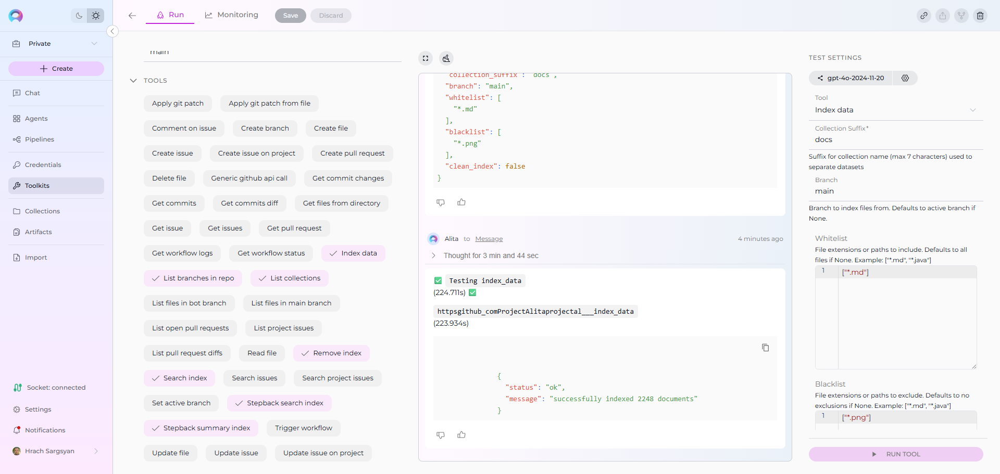
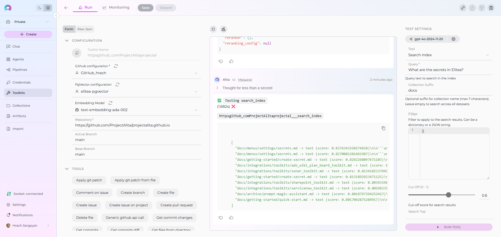
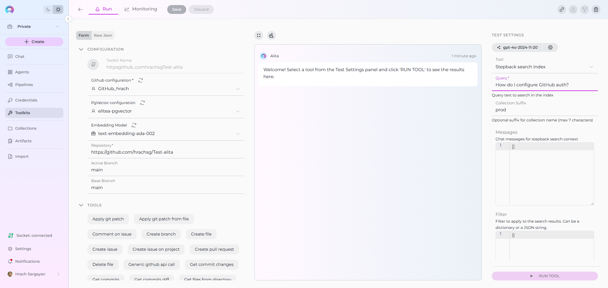
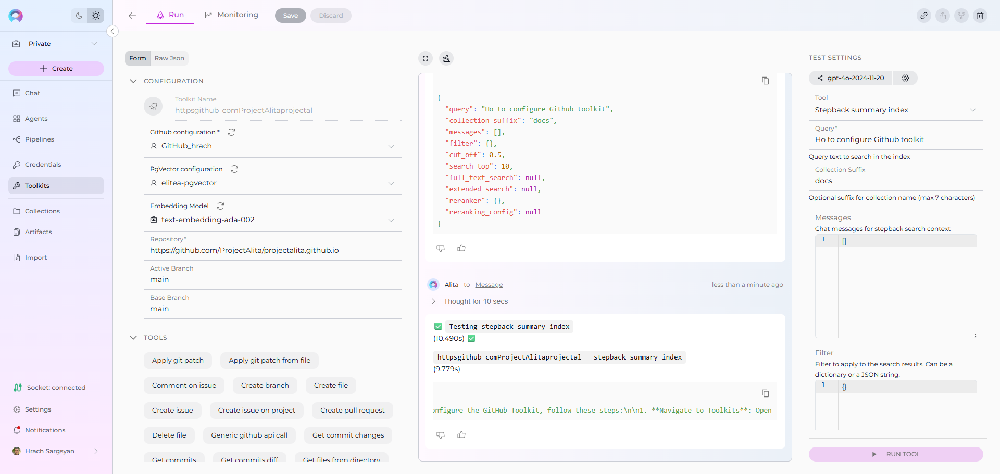
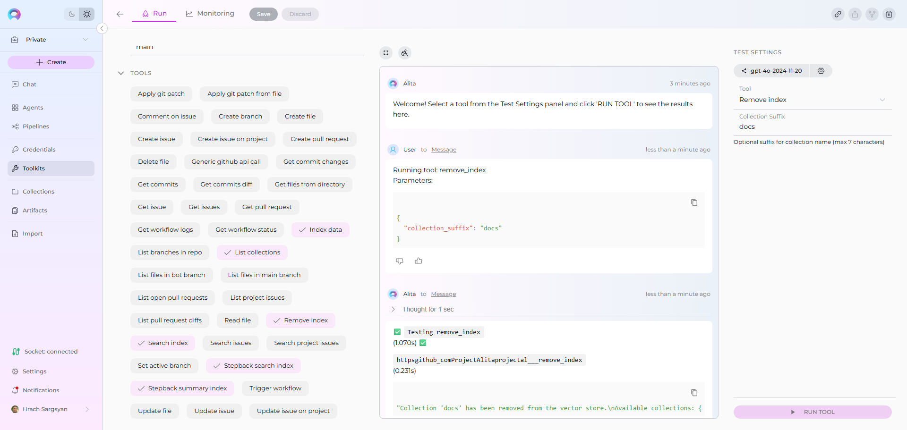
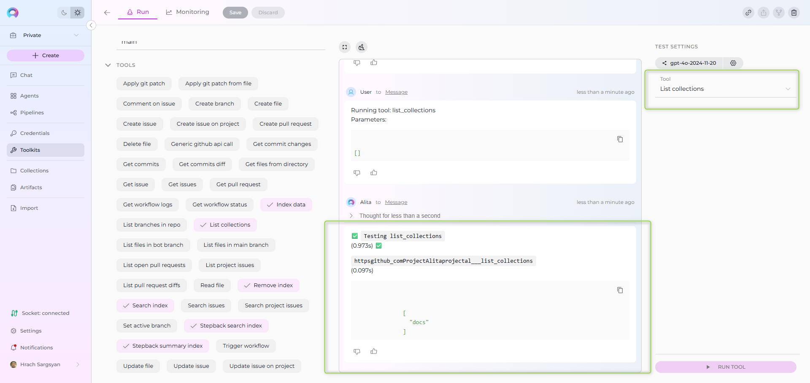

# Indexing Tools

!!! warning "Availability"
	Indexing tools are available in the Next environment (Release 1.7.0) and replace legacy Datasources/Datasets. For context, see [Release Notes 1.7.0](../../release-notes/rn_current.md#indexing-tools-replacement-for-datasets) and the [Indexing Overview](./indexing-overview.md).

This guide explains each **indexing** tool, required vs optional settings, and which toolkits it applies to.

## Prerequisites (once per project/toolkit)

- Credential for your toolkit (required for all except Artifact). See [Create a Credential](../../getting-started/create-credential.md).
- Vector Storage: PgVector selected in Settings → [AI Configuration](../../menus/settings/ai-configuration.md).
- Embedding Model selected in AI Configuration (defaults available).
- A configured Toolkit that supports indexing. See [Indexing Overview](./indexing-overview.md#toolkits-which-support-indexes).

**Supported toolkits**: ADO Repos, ADO Wiki, ADO Plans, ADO Boards, Bitbucket, GitHub, GitLab, Confluence, Jira, SharePoint, Artifact, Figma, TestRail, Xray Cloud, Zephyr Enterprise, Zephyr Essential, Zephyr Scale.

---

## Index Data

Create or update an index from your source system.

Where to run it: Open your Toolkit → TEST SETTINGS → select “Index data” → configure → RUN TOOL.

{ width="900" }

### Purpose
- Build a new index collection or update an existing one for later search and Q&A.

### Common Settings and Parameters

| UI Label | Description | Required? | Default Value | Validation/Allowed |
| --- | --- | --- | --- | --- |
| Collection Suffix | Used to separate datasets | Yes | - | max_length=7, min_length=1 |
| Progress Step | Step size for progress reporting | No | 10 | ge=0, le=100 |
| Clean Index | Clean existing index before re-indexing | No | FALSE | - |
| Chunking Tool | Name of chunking tool to apply | No | - | - |
| Chunking Config | Configuration for chunking tool | No | {} | - |

!!! tip
	If you’re not sure, start with defaults. You can re‑run indexing later with refined settings.

### Toolkit Specific Settings and Parameters

| Toolkit type | UI Label | Description | Required? | Default | Validation/Allowed |
| --- | --- | --- | --- | --- | --- |
| Repositories (GitHub, GitLab, Bitbucket, ADO Repos) | Branch | Branch to index files from; defaults to the repository's active branch if None. | No | - | - |
| Repositories (GitHub, GitLab, Bitbucket, ADO Repos) | Whitelist | Allow-list of file extensions or paths to include. Defaults to all files if None. Example: ["*.md", "*.java"]. | No | - | - |
| Repositories (GitHub, GitLab, Bitbucket, ADO Repos) | Blacklist | Deny-list of file extensions or paths to exclude. Defaults to no exclusions if None. Example: ["*.md", "*.java"]. | No | - | - |
| Test Management (Zephyr Enterprise) | Zql | ZQL query to search for test cases; Supported: estimatedTime, testcaseId, creator, release, project, priority, altId, version, versionId, automated, folder, contents, name, comment, tag; Examples: folder="TestToolkit", name~"TestToolkit5". | No | - | ZQL syntax |
| Test Management (Zephyr Scale) | Project Key | Jira project key filter (e.g., "PROJ"). | No | - | Jira project key |
| Test Management (Zephyr Scale) | Jql | JQL-like query for searching test cases; Supported fields: folder (exact name), folderPath (full path), label, text (name/description), customFields (JSON string), steps, orderBy, orderDirection (ASC|DESC), limit, includeSubfolders (true|false), exactFolderMatch (true|false); Example: 'folder = "Authentication" AND label in ("Smoke", "Critical") AND text ~ "login" AND orderBy = "name" AND orderDirection = "ASC"'. | No | - | JQL-like syntax |
| ADO Boards | Wiql | WIQL (Work Item Query Language) query string to select and filter Azure DevOps work items. | Yes | - | WIQL syntax |
| ADO Plans | Plan Id | ID of the test plan for which test cases are requested. | Yes | - | numeric ID |
| ADO Plans | Suite Ids | List of test suite IDs for which test cases are requested (can be empty to index all suites from the plan). Example: [2, 23]. | No | - | array of numeric IDs |
| ADO Wiki | Wiki Identifier | Wiki identifier to index (e.g., "ABCProject.wiki"). | Yes | - | string |
| ADO Wiki | Title Contains | Include only pages with titles containing this exact string. | No | - | string (exact match) |
| SharePoint | Limit Files | Limit (maximum number) of files to return; supports synonyms like First, Top, or a numeric literal (e.g., "Top 10 files"). If not specified, use the default with no extra confirmation from a user. | No | 1000 | number or synonym keyword |
| SharePoint | Include Extensions | List of file extensions to include when processing; if empty, all files are processed (except those in Skip Extensions). Example: ["*.png", "*.jpg"]. | No | - | array of glob patterns |
| SharePoint | Skip Extensions | List of file extensions to skip when processing. Example: ["*.png", "*.jpg"]. | No | - | array of glob patterns |
| Figma | Project Id | ID of the project to list files from (e.g., 55391681). | No | - | numeric ID |
| Figma | File Keys Include | List of file keys to include in index if Project Id is not provided. Example: ["Fp24FuzPwH0L74ODSrCnQo", "jmhAr6q78dJoMRqt48zisY"]. | No | - | array of strings |
| Figma | File Keys Exclude | List of file keys to exclude from index; applied only if Project Id is provided and File Keys Include is not provided. Example: ["Fp24FuzPwH0L74ODSrCnQo", "jmhAr6q78dJoMRqt48zisY"]. | No | - | array of strings |
| Figma | Node Ids Include | List of top-level nodes (pages) in a file to include in index; node-id from Figma URL. Example: ["123-56", "7651-9230"]. | No | - | array of strings |
| Figma | Node Ids Exclude | List of top-level nodes (pages) to exclude; applied only if Node Ids Include is not provided; node-id from Figma URL. | No | - | array of strings |
| Figma | Node Types Include | List of node types to include (e.g., FRAME, COMPONENT, RECTANGLE, COMPONENT_SET, INSTANCE, VECTOR). | No | - | array of enums |
| Figma | Node Types Exclude | List of node types to exclude; applied only if Node Types Include is not provided. | No | - | array of enums |
| TestRail | Project Id | TestRail project ID to index data from. | Yes | - | numeric ID |
| TestRail | Suite Id | Optional TestRail suite ID to filter test cases. | No | - | numeric ID |
| TestRail | Section Id | Optional section ID to filter test cases. | No | - | numeric ID |
| TestRail | Include Attachments | Whether to include attachment content in indexing. Selected by default. | No | TRUE | boolean |
| TestRail | Skip Attachment Extensions | List of file extensions to skip when processing attachments (e.g., ['.png', '.jpg']). | No | - | array of extensions |
| Xray Cloud | Jql | JQL query for searching test cases in Xray. Supported fields include project, testType, labels, summary, description, status, priority. Example: project = "CALC" AND testType = "Manual" AND labels in ("Smoke", "Critical"). | No | - | JQL syntax |
| Xray Cloud | Graphql | Custom GraphQL query for advanced data extraction. Should return test objects (issueId, jira, testType, steps, etc.). Example: query { getTests(jql: "project = \"CALC\"") { results { issueId jira(fields: ["key"]) testType { name } steps { action result } } } }. | No | - | GraphQL syntax |
| Xray Cloud | Include Attachments | Whether to include attachment content in indexing. | No | - | boolean |
| Xray Cloud | Skip Attachment Extensions | List of file extensions to skip when processing attachments (e.g., ['.exe', '.zip', '.bin']). | No | - | array of extensions |
| Confluence | Content Format | Render format for page content. | No | view | string (e.g., 'view') |
| Confluence | Page Ids | List of page IDs to retrieve. | No | - | array of IDs |
| Confluence | Label | Label to filter pages. | No | - | string |
| Confluence | Cql | CQL query to filter pages. | No | - | CQL syntax |
| Confluence | Limit | Limit the number of results. | No | 10 | number |
| Confluence | Max Pages | Maximum number of pages to retrieve. | No | 1000 | number |
| Confluence | Include Restricted Content | Include content with view restrictions (if permitted). | No | - | boolean |
| Confluence | Include Archived Content | Include archived pages in results. | No | - | boolean |
| Confluence | Include Attachments | Whether to include attachment content in indexing. | No | - | boolean |
| Confluence | Include Comments | Include page comments in indexing. | No | - | boolean |
| Confluence | Include Labels | Include page labels in indexing. | No | TRUE | boolean |
| Confluence | Ocr Languages | OCR languages for processing attachments. | No | eng | language codes (e.g., 'eng') |
| Confluence | Keep Markdown Format | Keep Markdown formatting in output. | No | TRUE | boolean |
| Confluence | Keep Newlines | Preserve newlines in extracted content. | No | TRUE | boolean |
| Confluence | Bins With Llm | Use LLM for processing binary files. | No | - | boolean |
| Jira | Jql | JQL query to filter issues; if omitted, all accessible issues are indexed. Examples: 'project=PROJ', 'parentEpic=EPIC-123', 'status=Open'. | No | - | JQL syntax |
| Jira | Fields To Extract | Additional fields to extract from issues. | No | - | array of field keys |
| Jira | Fields To Index | Additional fields to include in indexed content. | No | - | array of field keys |
| Jira | Include Attachments | Whether to include attachment content in indexing. | No | - | boolean |
| Jira | Max Total Issues | Maximum number of issues to index. | No | 1000 | number |
| Jira | Skip Attachment Extensions | List of file extensions to skip when processing attachments (e.g., ['.png', '.jpg']). | No | - | array of extensions |

---

## Search Index

Search your indexed content using natural language.

Where to run it: Toolkit → TEST SETTINGS → select “Search index” → configure → RUN TOOL.

{ width="900" }

### Purpose
- Retrieve relevant chunks from one or more index collections.

### Common Settings and Parameters

| UI Label | Description | Required? | Default | Validation/Allowed |
| --- | --- | --- | --- | --- |
| Query | Query text to search in index | Yes | - | - |
| Collection Suffix | Search specific dataset or all if empty | No | "" | max_length=7 |
| Filter | Metadata filter for search results | No | {} | JSON format |
| Cut-off Score | Minimum similarity score threshold | No | 0.5 | - |
| Search Top | Number of top results to return | No | 10 | - |
| Reranker | Reranker configuration | No | {} | - |
| Full Text Search | Full text search configuration | No | - | JSON with enabled, weight, fields, language |
| Reranking Config | Advanced reranking configuration | No | - | JSON with field weights and rules |
| Extended Search | Additional chunk types to search | No | - | title,summary,propositions,keywords,documents |

!!! note "Note"
    Applicable to all toolkits that support indexing.

---

## Stepback Search Index

Advanced search that first “simplifies” your query for better matches and can consider conversation context.

Where to run it: Toolkit → TEST SETTINGS → “Stepback search index”.

{ width="900" }

### Purpose
- Improve retrieval by transforming your question (e.g., “How do I configure GitHub auth?” → “configure GitHub authentication”). Returns raw results.

### Common Settings and Parameters

| UI Label | Description | Required? | Default | Validation/Allowed |
| --- | --- | --- | --- | --- |
| Query | Query text to search in index | Yes | - | - |
| Collection Suffix | Search specific dataset or all if empty | No | "" | max_length=7 |
| Filter | Metadata filter for search results | No | {} | JSON format |
| Messages | Chat messages for stepback search context | No | {} | JSON format |
| Cut-off Score | Minimum similarity score threshold | No | 0.5 | - |
| Search Top | Number of top results to return | No | 10 | - |
| Reranker | Reranker configuration | No | {} | - |
| Full Text Search | Full text search configuration | No | - | JSON with enabled, weight, fields, language |
| Reranking Config | Advanced reranking configuration | No | - | JSON with field weights and rules |
| Extended Search | Additional chunk types to search | No | - | title,summary,propositions,keywords,documents |

!!! note "Note"
    * Applicable to all toolkits that support indexing.
	* Output is a list of matching documents/chunks. If you prefer a generated answer, use Stepback Summary Index.

---

## Stepback Summary Index

Contextual search plus an AI‑generated answer, with optional citations.

Where to run it: Toolkit → TEST SETTINGS → “Stepback summary index”.

{ width="900" }

### Purpose
- Combine stepback search with a concise, human‑readable answer. Good for end‑users who want a direct response.

### 

### Common Settings and Parameters

| UI Label | Description | Required? | Default | Validation/Allowed |
| --- | --- | --- | --- | --- |
| Query | Query text to search in index | Yes | - | - |
| Collection Suffix | Search specific dataset or all if empty | No | "" | max_length=7 |
| Filter | Metadata filter for search results | No | {} | JSON format |
| Messages | Chat messages for stepback search context | No | {} | JSON format |
| Cut-off Score | Minimum similarity score threshold | No | 0.5 | - |
| Search Top | Number of top results to return | No | 10 | - |
| Reranker | Reranker configuration | No | {} | - |
| Full Text Search | Full text search configuration | No | - | JSON with enabled, weight, fields, language |
| Reranking Config | Advanced reranking configuration | No | - | JSON with field weights and rules |
| Extended Search | Additional chunk types to search | No | - | title,summary,propositions,keywords,documents |

!!! note "Note"
    * Applicable to all toolkits that support indexing.
	* If the answer lacks sources, increase Search Top or lower Cut Off slightly to include more candidate passages.

---

## Remove Index

Delete an existing collection (index) when it’s no longer needed.

Where to run it: Toolkit → TEST SETTINGS → “Remove index”.

{ width="900" }

### Purpose
- Clean up test data or retire outdated collections.

### Applies to toolkits
- All toolkits that support indexing.

### Fields

| Field | Description | Required | Applicable toolkits |
| --- | --- | --- | --- |
| Collection Suffix | Name of the collection to remove. | Yes | All |

!!! warning
	Removing an index deletes its data from vector storage for this toolkit. Make sure you’re targeting the correct collection.

---

## List Collections

List all available collections for the toolkit.

Where to run it: Toolkit → TEST SETTINGS → “List collections”.

{ width="900" }

### Purpose
- Quickly verify what indexes exist and their names (suffixes).

### Fields

| Field | Description | Required | Applicable toolkits |
| --- | --- | --- | --- |
| (none) | No input required; runs immediately. | — | All |

---

## Stepback tools: quick comparison

| Aspect | Stepback Search Index | Stepback Summary Index |
| --- | --- | --- |
| Output | Raw results (document chunks with scores) | Short, AI‑generated answer with optional citations |
| Uses conversation context | Yes (for query transform) | Yes (for search + answer) |
| Best for | Exploring documents, exporting results | Direct answers for end‑users |
| Cost/latency | Lower | Higher |

---

## Tips and troubleshooting

- If Search returns few/no results, try lowering Cut Off (e.g., from 0.5 to 0.35) or increasing Search Top.
- Use Collection Suffix consistently (e.g., prod/test) so you can target the right dataset later.
- For better Q&A, consider Proposal chunking when indexing (enables titles/summaries/propositions).
- Known limitations and workarounds: see [Release Notes 1.7.0](../../release-notes/rn_current.md#known-issues).

!!! info "Related guides"
    - [Indexing Overview](./indexing-overview.md)
    - Per‑toolkit examples: [GitHub](./index-github-data.md), [Confluence](./index-confluence-data.md), [Jira](./index-jira-data.md), [SharePoint](./index-sharepoint-data.md)
    - [AI Configuration](../../menus/settings/ai-configuration.md)
