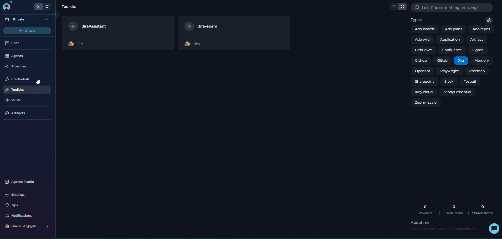
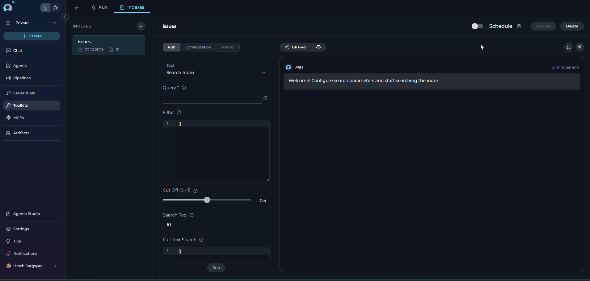
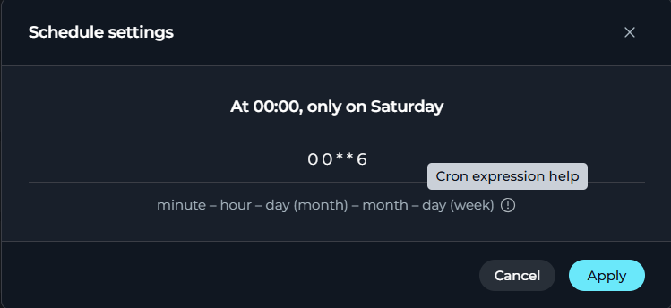

# Schedule Indexing

## Introduction

Scheduled indexing enables automated, periodic re-indexing of your data sources at configured intervals using cron expressions. This ensures that your indexed data remains current as source content changes over time, without requiring manual reindexing operations.

**Why use scheduled indexing:**

- **Automated data freshness**: Keep indexes up-to-date automatically as source data evolves
- **Reduced manual overhead**: Eliminate the need for manual reindexing operations
- **Consistent synchronization**: Maintain predictable sync schedules across multiple indexes
- **Resource optimization**: Schedule updates during off-peak hours to minimize system impact
- **User-specific schedules**: Each user can configure independent schedules for the same index

---

## Prerequisites

Before configuring scheduled indexing, ensure the following requirements are met:

1. **Successful Index Creation**: An index must be successfully created before scheduling can be enabled
2. **Valid Index State**: The index must be in a valid state (not cancelled or failed)
3. **Indexes Tab Access**: Access to the Indexes Tab interface within Toolkit Configuration
4. **Appropriate Permissions**: User permissions to modify toolkit configurations

!!! warning "Index State Requirements"
    Scheduling is automatically **disabled** for indexes in the following states:

     - **cancelled** - Index creation or reindexing was stopped
     - **failed** - Index creation or reindexing encountered an error
    
    To enable scheduling for these indexes, you must first successfully reindex them.

---

## Configuring Scheduled Indexing

### Step 1: Access Index Actions

1. **Navigate to Toolkits**: Go to **Toolkits** in the main navigation
2. **Select Your Toolkit**: Choose the toolkit containing the index you want to schedule
3. **Open Indexes Tab**: Click on the **Indexes** tab
4. **Select Index**: Click on an existing index from the sidebar to view its details

{ loading=lazy }


### Step 2: Enable Scheduling

In the index detail view header, locate the **Schedule** controls:

1. **Schedule Toggle Switch**: Located in the index actions area (top right)
2. **Schedule Label**: Text label "Schedule" next to the toggle
3. **Gear Icon**: Settings icon to configure the cron expression

**To enable scheduling:**

1. Click the **toggle switch** to turn it ON (blue)
2. A success notification will appear: "Schedule is enabled for index!"

**To disable scheduling:**

1. Click the **toggle switch** to turn it OFF (gray)
2. A success notification will appear: "Schedule is disabled for index!"

{ loading=lazy }


### Step 3: Configure Cron Expression

1. **Click the Gear Icon** next to the Schedule label to open the Schedule Settings modal
2. **View Current Schedule**: The modal displays the current cron expression
3. **Human-Readable Description**: Above the input field, see a natural language description of the schedule (e.g., "At 12:00 AM, only on Saturday")
4. **Modify Expression**: Enter a new cron expression in the input field
5. **Real-Time Validation**: 
      - **Valid expression**: Description updates to show the new schedule
      - **Invalid expression**: Red error message appears with the specific issue
6. **Get Help** (optional): Click the **info icon** next to the format guide to open [crontab.guru](https://crontab.guru) in a new tab for cron expression assistance
7. **Apply Changes**: Click **Apply** button to save (disabled if expression is invalid)
8. **Cancel Changes**: Click **Cancel** button to discard modifications

**Schedule Settings Modal Fields:**

| Element | Description | Behavior |
|---------|-------------|----------|
| **Cron Expression Input** | Text field for entering 5-field cron expression | Center-aligned, validates on change |
| **Description Text** | Human-readable schedule explanation | Updates in real-time, turns red if invalid |
| **Format Guide** | `minute – hour – day (month) – month – day (week)` | Static reference below input |
| **Help Icon** | Info icon linking to crontab.guru | Opens external cron expression help |
| **Apply Button** | Saves the new cron expression | Disabled when expression is invalid |
| **Cancel Button** | Closes modal without saving | Always enabled |

**Default Cron Expression:**

When first configured, the schedule defaults to `0 0 * * 6` (Every Saturday at midnight).

{ loading=lazy }

!!! info "Review History"
    Scheduled reindexing operations will appear in the History tab with the label "Reindexed"

---
## Understanding Cron Expressions

Scheduled indexing uses **cron expressions** to define when automatic reindexing should occur. A cron expression consists of five space-separated fields:

```
minute   hour   day(month)   month   day(week)
  *       *         *          *         *
```

### Cron Field Definitions

| Position | Field | Allowed Values | Special Characters |
|----------|-------|----------------|-------------------|
| 1 | Minute | 0-59 | `*` `,` `-` `/` |
| 2 | Hour | 0-23 | `*` `,` `-` `/` |
| 3 | Day of Month | 1-31 | `*` `,` `-` `/` |
| 4 | Month | 1-12 | `*` `,` `-` `/` |
| 5 | Day of Week | 0-7 (0 and 7 = Sunday) | `*` `,` `-` `/` |

### Special Characters

- **`*`** (asterisk): Matches any value (e.g., `*` in the hour field means "every hour")
- **`,`** (comma): Lists multiple values (e.g., `1,15` in day field means "1st and 15th")
- **`-`** (hyphen): Defines a range (e.g., `9-17` in hour field means "9 AM to 5 PM")
- **`/`** (slash): Specifies step values (e.g., `*/2` in hour field means "every 2 hours")

### Frequency Limitations

!!! warning "Minimum Frequency Restriction"
    The system enforces a **minimum frequency of 1 hour** between reindexing operations to prevent excessive resource usage. The following patterns are **not allowed**:{ align=right width="250" loading=lazy }
    
    - `* * * * *` - Every minute
    - `*/30 * * * *` - Every 30 minutes
    - Any pattern that would trigger more than once per hour 

---

## Common Schedule Patterns

Here are verified schedule patterns for typical reindexing scenarios:

| Pattern | Cron Expression | Description |
|---------|----------------|-------------|
| **Default** | `0 0 * * 6` | Every Saturday at midnight (00:00) |
| **Hourly** | `0 * * * *` | Every hour at minute 0 |
| **Every 2 Hours** | `0 */2 * * *` | Every 2 hours at minute 0 |
| **Every 6 Hours** | `0 */6 * * *` | Every 6 hours at minute 0 |
| **Daily Midnight** | `0 0 * * *` | Every day at midnight (00:00) |
| **Daily 2 AM** | `0 2 * * *` | Every day at 2:00 AM |
| **Weekdays 6 AM** | `0 6 * * 1-5` | Monday through Friday at 6:00 AM |
| **Weekly Sunday** | `0 0 * * 0` | Every Sunday at midnight |
| **Monthly 1st** | `0 0 1 * *` | First day of each month at midnight |
| **Quarterly** | `0 0 1 1,4,7,10 *` | First day of Jan, Apr, Jul, Oct at midnight |

!!! tip "Testing Your Cron Expression"
    Use [crontab.guru](https://crontab.guru) to validate and understand cron expressions. The system also provides real-time validation and human-readable descriptions when you configure schedules. You can also click the **info icon** in the Schedule Settings modal to quickly access crontab.guru help.
    
    { align=left width="250" loading=lazy }

---


## Managing Schedules

**Viewing Active Schedules**

Currently, schedule information is stored per user and per index. To view your active schedules:

1. **Navigate to the Index**: Open the index in the Indexes Tab
2. **Check Schedule Toggle**: The toggle state (ON/OFF) indicates if scheduling is active
3. **Open Schedule Settings**: Click the gear icon to view the configured cron expression

!!! info "User-Specific Schedules"
    Each user can configure their own schedule for the same index. Schedules are stored under the user ID and do not affect other users' schedules for the same index.

**Editing Schedules**

To modify an existing schedule:

1. **Open Schedule Settings**: Click the gear icon next to the Schedule toggle
2. **Update Cron Expression**: Enter the new expression in the modal
3. **Validate and Apply**: Ensure the expression is valid, then click Apply
4. **No notification** is shown for cron expression updates (only for enable/disable)

**Pausing Schedules**

To temporarily pause scheduled reindexing without losing the cron configuration:

1. **Disable the Toggle**: Click the Schedule toggle switch to turn it OFF
2. **Preserve Configuration**: The cron expression is preserved and can be re-enabled later
3. **Success Notification**: "Schedule is disabled for index!" appears

---

## Real-Life Example: Daily GitHub Repository Indexing

This example demonstrates setting up automated daily reindexing for a GitHub repository index to keep code and documentation searches current.

**Scenario**

**Goal**: Keep a GitHub repository index updated daily at 2:00 AM to reflect new commits, pull requests, and documentation changes.

**Index Details:**

- **Toolkit**: GitHub toolkit for `ProjectAlita/projectalita.github.io` repository
- **Index Name**: `docs`
- **Current State**: Successfully created and completed
- **Desired Schedule**: Daily at 2:00 AM (during off-peak hours)

**Step-by-Step Configuration**

**1. Access the Index:**

- Navigate to **Toolkits** → Select **GitHub (ProjectAlita/projectalita.github.io)** toolkit
- Click **Indexes** tab
- Select the **docs** index from the sidebar

**2. Enable Scheduling:**

- Locate the **Schedule** controls in the index actions area (top right)
- Click the **toggle switch** to enable scheduling
- Confirm the success notification: "Schedule is enabled for index!"

**3. Configure Daily 2 AM Schedule:**

1. Click the **gear icon** next to the Schedule label
2. The Schedule Settings modal opens with default expression `0 0 * * 6`
3. **Clear the input** and enter: `0 2 * * *`
4. **Verify the description** updates to: "At 02:00 AM"
5. **Click Apply** to save the new schedule

**4. Verify Configuration:**

1. **Toggle State**: Confirmed ON (blue)
2. **Cron Expression**: `0 2 * * *` (verified by reopening settings modal)
3. **Schedule Active**: Automatic reindexing will occur daily at 2:00 

**Expected Behavior**

**Daily at 2:00 AM:**

1. The system automatically triggers a reindexing operation for the `docs` index
2. The index state changes to `in_progress` during the operation
3. Progress is tracked and visible in the index interface
4. Upon completion, the index state returns to `completed`
5. A new entry appears in the **History** tab with label "Reindexed" and the timestamp

**History Tab Entry:**
```
Event: Reindexed
Date: 25-11-2025, 02:00 AM
```

**Result:**

Your team can now ask questions about the codebase and documentation using the most recent repository content, with automatic updates every day without manual intervention.

---

## Troubleshooting

??? example "Schedule Toggle is Disabled"

    **Symptom**: The Schedule toggle switch is grayed out and cannot be clicked.

    **Causes and Solutions:**

    | Cause | Solution |
    |-------|----------|
    | Index state is `cancelled` | Click **Reindex** to restart indexing, then enable schedule |
    | Index state is `failed` | Review error logs, fix the issue, reindex successfully, then enable schedule |
    | Insufficient permissions | Contact project administrator for toolkit modification permissions |

??? example "Cron Expression Validation Errors"on Errors"

    **Common validation errors and how to fix them:**

    | Error Message | Cause | Solution |
    |---------------|-------|----------|
    | "Cron expression is required" | Empty or null input | Enter a valid 5-field cron expression |
    | "Cron must have exactly 5 parts with space between every part" | Incorrect number of fields | Ensure exactly 5 space-separated fields |
    | "Invalid minute (0-59, *, ranges, lists, steps allowed)" | Minute value out of range or invalid format | Use values 0-59 or valid special characters |
    | "Invalid hour (0-23, *, ranges, lists, steps allowed)" | Hour value out of range or invalid format | Use values 0-23 or valid special characters |
    | "Invalid day (1-31, *, ranges, lists, steps allowed)" | Day value out of range or invalid format | Use values 1-31 or valid special characters |
    | "Invalid month (1-12, *, ranges, lists, steps allowed)" | Month value out of range or invalid format | Use values 1-12 or valid special characters |
    | "Invalid weekday (0-7 where 0,7=Sunday, *, ranges, lists, steps allowed)" | Weekday value out of range or invalid format | Use values 0-7 or valid special characters |
    | "Frequency cannot be less than every hour" | Schedule would trigger more than once per hour | Use patterns with minimum 1-hour intervals |
    | "Invalid hour step value. Step cannot be 0." | Hour step value is 0 | Use a non-zero step value (e.g., `*/2` instead of `*/0`) |

??? example "Schedule Not Executing"Executing"

    **Symptom**: Schedule is enabled, but reindexing is not occurring at the configured time.

    **Troubleshooting Steps:**

    1. **Verify Cron Expression**:
          - Open Schedule Settings and check the cron expression
          - Use [crontab.guru](https://crontab.guru) to verify the expression matches your intent
          - Ensure the expression is not in the past (e.g., specific date/time that has passed)

    2. **Check Index State**:
          - Ensure index state is `completed`, not `failed` or `cancelled`
          - If state is invalid, manually reindex and then re-enable the schedule

    3. **Confirm Toggle is Enabled**:
          - Verify the Schedule toggle is ON (blue)
          - If OFF, enable it again

    4. **Review System Logs** (if accessible):
          - Check for backend errors during scheduled execution
          - Look for quota limitations or resource constraints

    5. **Time Zone Considerations**:
          - Cron expressions execute in the server's time zone
          - Verify the server time zone matches your expectations

??? example "Schedule Enabled but No Notification"ification"

    **Symptom**: When updating the cron expression, no success notification appears.

    **Expected Behavior**: This is normal. Success notifications only appear when **enabling or disabling** the schedule toggle, not when modifying the cron expression.

    **To Verify Configuration:**
    - Reopen the Schedule Settings modal
    - Confirm the cron expression shows your updated value

---

## Limitations

??? example "Current Limitations"

    | Limitation | Description |
    |------------|-------------|
    | **Minimum Frequency** | Schedules cannot execute more frequently than once per hour |
    | **User-Specific Schedules** | Schedules are per-user; there is no shared/global schedule for all users |
    | **Single Schedule Per User Per Index** | Each user can only configure one schedule per index |
    | **No Schedule History** | The system does not maintain a history of schedule configuration changes |
    | **No Concurrent Execution Protection** | If a scheduled run is in progress when the next trigger occurs, behavior is undefined |
    | **Time Zone** | Schedules execute in the server's time zone (not user's local time zone) |
    | **No Advanced Scheduling Options** | No support for:<br>• Date ranges (e.g., only reindex between Jan 1 and Mar 31)<br>• Conditional schedules (e.g., only if data has changed)<br>• Retry logic on failure<br>• Schedule dependencies between indexes |
    | **Schedule Disables After Index Failure** | If a manually triggered or scheduled reindexing fails, the schedule is automatically disabled and must be manually re-enabled after fixing the issue |
    | **No Notification for Scheduled Runs** | There is no notification system to alert users when a scheduled reindexing completes or fails. Users must manually check the History tab |

---

## Best Practices

??? example "Choosing the Right Schedule"

    1. **Data Change Frequency**: Match schedule to how often your source data changes
          - **Rapidly changing data** (e.g., active repositories): Daily or multiple times per day
          - **Moderately changing data** (e.g., documentation wikis): Weekly
          - **Slowly changing data** (e.g., archived content): Monthly

    2. **Off-Peak Hours**: Schedule during low-usage periods
          - Early morning (e.g., 2:00 AM - 5:00 AM)
          - Weekends (e.g., Saturday/Sunday midnight)
          - Avoid business hours to prevent performance impact on users

    3. **Resource Considerations**: 
          - Larger indexes take longer to reindex
          - Consider system load and concurrent operations
          - Stagger schedules for multiple indexes to avoid simultaneous heavy operations

    4. **User Needs vs. System Load**:
          - Balance data freshness requirements with system resources
          - Don't schedule more frequently than necessary

??? example "Managing Multiple Schedules"Schedules"

    When managing schedules across multiple indexes:

    1. **Stagger Execution Times**: Avoid scheduling multiple indexes at the same time
          - Index A: `0 2 * * *` (Daily at 2:00 AM)
          - Index B: `0 4 * * *` (Daily at 4:00 AM)
          - Index C: `0 6 * * *` (Daily at 6:00 AM)

    2. **Group by Priority**:
          - Critical indexes: More frequent schedules
          - Reference indexes: Less frequent schedules

    3. **Document Your Schedules**: Maintain a reference document listing all configured schedules for coordination

??? example "Monitoring and Maintenance"intenance"

    1. **Regular Review**: Periodically check the History tab to verify schedules are executing successfully
    2. **Update Schedules as Needed**: Adjust cron expressions when data change patterns evolve
    3. **Clean Up Unused Schedules**: Disable schedules for indexes that are no longer actively used
    4. **Test Before Production**: Validate schedule configuration with a test index before applying to production indexes

---

!!! info "Related Documentation"
    - [Using Indexes Tab Interface](./using-indexes-tab-interface.md) - Comprehensive guide to the Indexes Tab
    - [Indexing Overview](./indexing-overview.md) - General indexing concepts and architecture
    - [Index GitHub Data](./index-github-data.md) - GitHub repository indexing guide
    - [Indexing Tools](./indexing-tools.md) - Available indexing tools and their parameters
    - [Toolkits Menu](../../menus/toolkits.md) - Guide to navigating the Toolkit menu interface

---

