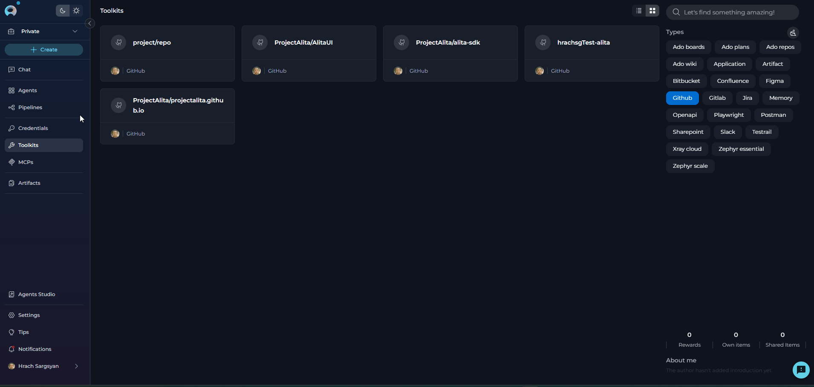
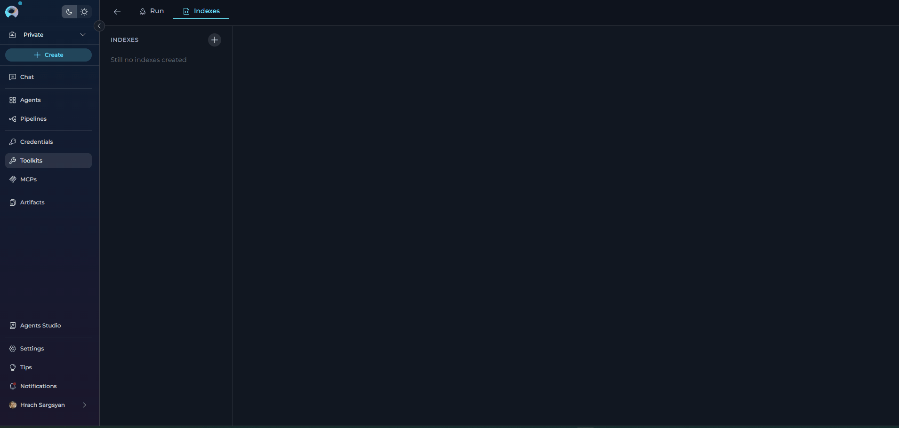
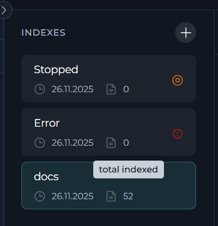
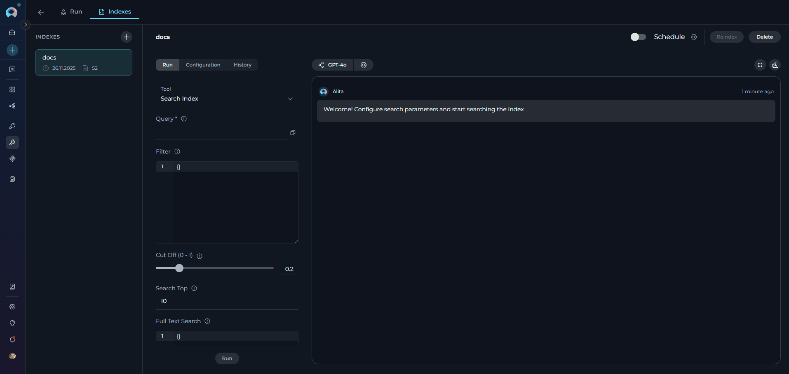
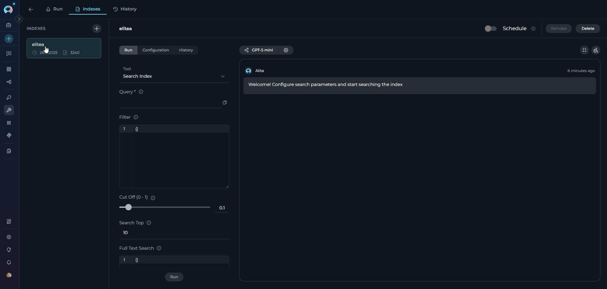
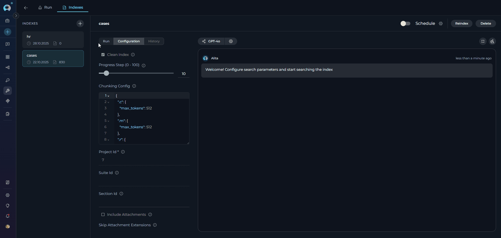
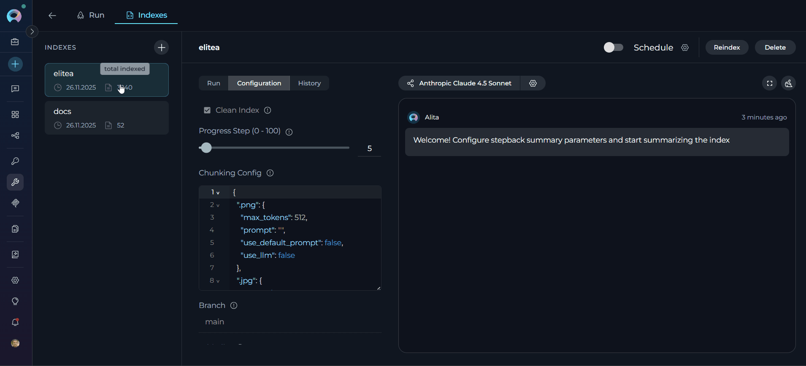
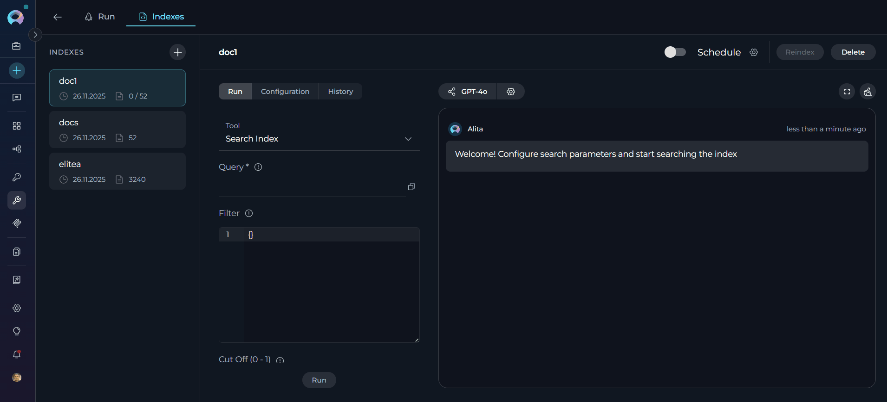

# Using the Indexes Tab Interface

## Overview

The **Indexes Tab** is a dedicated interface within Toolkit Configuration that provides a centralized location for managing all indexing operations for supported toolkits. It offers an intuitive three-panel layout:

- **Indexes Sidebar** (left): Displays all created indexes with real-time status indicators and metadata
- **Index Management Panel** (center): Provides detailed controls across three tabs (Run, Configuration, History)
- **Chat Panel** (right): Displays search results and indexing progress in a conversational interface

**Key Features:**

- **Visual Status Indicators**: Real-time identification of index states (in-progress, completed, failed, stopped)
- **Three Management Tabs**: 
     - **Run**: Execute search tools and index updates
     - **Configuration**: View read-only index settings
     - **History**: Review all past indexing operations
- **Real-time Progress Monitoring**: Live updates during index creation and updates with conversation recovery
- **Automated Scheduling**: Configure periodic reindexing using cron expressions for hands-free maintenance
- **Multiple Search Tools**: Access to Search Index, Stepback Search Index, and Stepback Summary Index


---

## Prerequisites

Before using the Indexes Tab interface, ensure the following requirements are met:

### Project-Level Configuration

1. **PgVector Configuration**: Vector storage must be configured at the project level
      - Navigate to **Settings** → **[AI Configuration](../../menus/settings/ai-configuration.md)**  
      - Configure PgVector connection settings
      - Verify connection is active

2. **Embedding Model Configuration**: An embedding model must be selected
      - Navigate to **Settings** → **[AI Configuration](../../menus/settings/ai-configuration.md)**
      - Select and configure an embedding model
      - Test model availability

!!! warning "Access Control"
    The **Indexes tab** is automatically **disabled** if PgVector and Embedding Model are not properly configured at the project level. You must complete the project-level setup before the tab becomes available.

### Toolkit Configuration

 **Supported Toolkit**: Ensure you're working with a toolkit that supports indexing:

| Category | Supported Toolkits |
|----------|-------------------|
| **Repos** | [ADO Repos, Bitbucket, GitLab, GitHub](./index-github-data.md), |
| **Wikis** | [ADO Wiki](./index-ado-wiki-data.md), [Confluence](./index-confluence-data.md), [SharePoint](./index-sharepoint-data.md) |
| **Issues** | ADO Boards, ADO Plans, [Jira](./index-jira-data.md) |
| **Files** | [Artifact](./index-artifacts-data.md), [SharePoint](./index-sharepoint-data.md) |
| **Designs** | [Figma](./index-figma-data.md) |
| **Tests** | [TestRail](./index-testrail-data.md), [Xray Cloud](./index-xray-data.md), [Zephyr Enterprise, Zephyr Essential, Zephyr Scale](./index-zephyr-data.md) |

 **Toolkit Tools**: Enable indexing tools in your toolkit configuration:

| Tool | Status | Description |
|------|--------|-------------|
| **Index Data** | Required | For creating indexes |
| **Search Index** | Required | For search functionality |
| **Stepback Search Index** | Optional | For advanced search |
| **Stepback Summary Index** | Optional | For summarized search results |
| **List Collections** | Optional | For viewing available indexes |
| **Remove Index** | Optional | For index cleanup |

!!! warning "Indexing Tab Availability"
    The **Indexes tab** is automatically **disabled** if the **Index Data** tool is not enabled in your toolkit configuration. You must enable the Index Data tool before the Indexes tab becomes available.

---

## Accessing the Indexes Tab

1. **Navigate to Toolkits**: Go to **Toolkits** in the main navigation
2. **Select Toolkit**: Choose a toolkit that supports indexing from your list(e.g., Github)
3. **Open Indexes Tab**: Click on the **Indexes** tab in the toolkit detail view

If the Indexes tab is disabled or not visible, verify that your project-level prerequisites are properly configured.

{ loading=lazy }
---

## Creating a New Index

### Step 1: Initiate Index Creation

1. **Click the + Icon**: In the Indexes sidebar, click the **+ Create New Index** button
2. **New Index Form**: The center panel will display the new index creation form

### Step 2: Configure Index Parameters

**Required Fields:**

- **Index Name**: Provide a unique name for your index (collection suffix)
     - Must be unique within the toolkit
     - Maximum 7 characters
     - Alphanumeric characters recommended

**Toolkit-Specific Parameters:**

Configure parameters specific to your toolkit type. Common parameters include:

| Parameter | Description | Example |
|-----------|-------------|---------|
| **Collection Suffix** | Unique identifier for the index | `docs`, `prod`, `v1` |
| **Progress Step** | Progress reporting interval (0-100) | `10` |
| **Clean Index** | Remove existing data before indexing | ✓ or ✗ |
| **Chunking Config** | Document chunking configuration | `{}` (default) |

!!! tip "Toolkit-Specific Settings"
    Different toolkits require different parameters. For example:
    
    - **GitHub**: Repository name, branch, file patterns
    - **Confluence**: Space key, page filters
    - **Jira**: JQL queries, field extraction settings
    - **TestRail**: Project ID, suite filters
    
    Refer to toolkit-specific documentation for detailed parameter information.

### Step 3: Validate and Start Indexing

1. **Form Validation**: The **Index** button remains inactive until all mandatory fields are filled
2. **Review Configuration**: Verify all parameters are correct
3. **Start Indexing**: Click the **Index** button to begin the process

{ loading=lazy }

---

## Monitoring Indexing Progress

**Real-Time Status Indicators**

The Indexes Tab provides visual status indicators to help you track the state of your indexes in real-time. These indicators appear in multiple locations throughout the interface.

**Status Indicator Locations:**

1. **Indexes Sidebar** (left panel): Each index card displays a status icon
2. **Index Detail Header** (center panel): Status label appears next to the index name

### Index Status Types

| Status | Visual Indicator | Description | Availability |
|--------|-----------------|-------------|--------------|
| **In Progress** | | Indexing is currently running | Progress visible in real-time; History tab disabled |
| **Failed** | | Indexing encountered an error | Configuration tab available; Run and History tabs disabled |
| **Stopped** | | Indexing was manually cancelled | Configuration tab available; Run and History tabs disabled |

**Status Display in Sidebar**

Each index card in the left sidebar shows:

- **Index Name**: Collection suffix (e.g., `docs`, `prod`)
- **Creation Date**: Format: `dd.MM.yyyy`
- **Document Count**: Hover over the document count.
     - For initial indexing: `total indexed` count
     - For reindexed items: `reindexed / total indexed` (e.g., `50 / 200`)
- **Status Icon**: Real-time visual indicator (progress spinner, error icon, or stop icon)
{width="200"}

!!! tip "Progress Recovery"
    If you navigate away during indexing and return, the system automatically recovers:
    
    - Restores the in-progress state
    - Displays accumulated progress messages
    - Continues monitoring until completion

---

### Managing Existing Indexes

**Selecting an Index**

1. **Click Index Card**: Select any index from the left sidebar
2. **View Details**: Index information and management options appear in center panel
3. **Access Tools**: Available actions depend on index status

**Index Information Panel**

When an index is selected, the index card displays:

- **Index Name**: Current name/collection suffix
- **Last Updated**: Timestamp of most recent update
- **Document Count**: Number of indexed documents

### Manual Index Updates

**Trigger Manual Update:**

1. **Select Index**: Click on the index you want to update
2. **Navigate to Configuration Tab**: Click the **Configuration** tab in the center panel
3. **Click Reindex**: Use the **Reindex** button in the index information panel
4. **Monitor Progress**: Watch real-time updates in the center and right panels
5. **Review Results**: Check for successful completion or error messages

{ loading=lazy }

!!! warning "Reindexing Parameters"
    Parameters cannot be modified when reindexing. The reindex operation uses the original configuration settings from when the index was first created. To change parameters, you must create a new index with the desired configuration.

### Schedule Index

!!! info "Schedule Availability"
    Scheduling is only available for indexes with **completed** status. In-progress, failed, or stopped indexes cannot be scheduled.

**Automated Reindexing:**

1. **Select Completed Index**: Choose an index with completed status from the sidebar
2. **Enable Schedule**: Toggle the **Schedule** switch to activate automated reindexing
3. **Configure Schedule**: Click the settings icon to open the schedule configuration modal
4. **Set Cron Expression**: Define the reindexing frequency using cron syntax (e.g., `0 2 * * *` for daily at 2 AM)
5. **Save Schedule**: Click **Save** to activate the automated schedule

**Schedule Status Indicators:**

- **Schedule Toggle**: ON (enabled) or OFF (disabled)
- **Cron Expression**: Displayed next to the schedule controls
- **Next Run**: Timestamp showing when the next automated reindex will occur

{ loading=lazy }

!!! tip "Detailed Scheduling Guide"
    For comprehensive information about scheduling features, cron expressions, troubleshooting, and best practices, see the [Schedule Indexing](./schedule-indexing.md) guide.

### Deleting Indexes

**Delete Process:**

1. **Select Index**: Choose the index to delete from the sidebar
2. **Click Delete**: Use the **Delete** button in the index information panel
3. **Confirm Deletion**: Enter the index name in the confirmation modal
4. **Permanent Removal**: Index and all associated data are permanently deleted


{ loading=lazy }

!!! warning "Deletion Warning"
    - Index deletion is **permanent** and **cannot be undone**. All indexed data, search history, and configurations are permanently removed.
    - The **Delete** button is disabled when the **Remove Index** tool is not selected in your toolkit configuration.
---

## Using Search Tools

 **Accessing Search Functionality**

!!! info "Prerequisites for Search"
    - **Successful Index**: Only completed indexes support search operations
    - **Enabled Search Tools**: At least one search tool (Search Index, Stepback Search Index, or Stepback Summary Index) must be enabled in toolkit configuration. The **Run tab** is disabled if no search tools are enabled.

**Available Search Tools:**

- **Search Index**: Basic semantic search across indexed content
- **Stepback Search Index**: Advanced search that breaks down complex questions
- **Stepback Summary Index**: Search with automatic summarization of results

 **Search Tool Selection**

1. **Navigate to Run Tab**: Click the **Run** tab in the center panel
2. **Tool Dropdown**: Select search tool from the dropdown menu
3. **Configure Parameters**: Set search parameters and LLM model settings

### Summarized Search (Stepback Summary Index)

**Configuration:**

1. **Select Tool**: Choose "Stepback Summary Index" from dropdown  
2. **Enter Query**: Provide query requiring summarized response
3. **Model Selection**: Choose appropriate LLM for summarization
4. **Search Parameters**:

     | Parameter | Description | Example |
     |-----------|-------------|---------|
     | **Messages** | Conversation history for context-aware search | Previous chat messages |
     | **Filter** | Metadata filter as dictionary or JSON string | `{"file_type": {"$eq": "markdown"}}`, `{"author": {"$eq": "john.doe"}}` |
     | **Cut Off (0 - 1)** | Relevance threshold for filtering results | `0.7` for high relevance, `0.3` for broader results |
     | **Search Top** | Maximum number of top results to return | `10`, `25`, `50` |
     | **Full Text Search** | Dictionary with full-text search configuration | `{"enabled": true, "weight": 0.3, "fields": ["content", "title"], "language": "english"}` |
     | **Extended Search** | List of chunk types to search | `["title", "summary", "propositions", "keywords", "documents"]` |
     | **Reranking Config** | Dictionary with field-based reranking rules | `{"priority": {"weight": 2.0, "rules": {"priority": "high"}}}`, `{"updated_at": {"weight": 1.0, "rules": {"sort": "desc"}}}` |


{ loading=lazy }

### Basic Search (Search Index)

**Configuration:**

1. **Select Tool**: Choose "Search Index" from tool dropdown
2. **Enter Query**: Provide search query in the text field (e.g., `How do I create secrets in Elitea and what are the best practices for managing sensitive configuration data?`)
3. **Configure Model**: Select LLM model and adjust settings if needed
4. **Optional Parameters**:

     | Parameter | Description | Example |
     |-----------|-------------|---------|
     | **Filter** | Metadata filter as dictionary or JSON string | `{"file_type": {"$eq": "markdown"}}`, `{"$and": [{"author": {"$eq": "john"}}, {"status": {"$eq": "active"}}]}` |
     | **Cut Off (0 - 1)** | Relevance threshold for filtering results | `0.7` for high relevance, `0.3` for broader results |
     | **Search Top** | Maximum number of top results to return | `10`, `25`, `50` |
     | **Full Text Search** | Dictionary with full-text search configuration | `{"enabled": true, "weight": 0.3, "fields": ["content", "title"], "language": "english"}` |
     | **Extended Search** | List of chunk types to search | `["title", "summary", "propositions", "keywords", "documents"]` |
     | **Reranking Config** | Dictionary with field-based reranking rules | `{"severity": {"weight": 2.5, "rules": {"priority": "critical"}}}`, `{"file_type": {"weight": 1.5, "rules": {"contains": "test"}}}` |

**Execute Search:**

1. **Activate Run Button**: Button becomes active when query is provided
2. **Click Run**: Execute the search operation
3. **View Results**: Results appear in the right panel chat interface

### Advanced Search (Stepback Search)

**Configuration:**

1. **Select Tool**: Choose "Stepback Search Index" from dropdown
2. **Enter Complex Query**: Provide detailed or multi-part query
3. **Model Settings**: Configure LLM for query decomposition
4. **Search Parameters**:

     | Parameter | Description | Example |
     |-----------|-------------|---------|
     | **Messages** | Conversation history for context-aware search | Previous chat messages |
     | **Filter** | Metadata filter as dictionary or JSON string | `{"category": {"$eq": "bug"}}`, `{"$and": [{"priority": {"$eq": "high"}}, {"status": {"$eq": "open"}}]}` |
     | **Cut Off (0 - 1)** | Relevance threshold for filtering results | `0.7` for high relevance, `0.3` for broader results |
     | **Search Top** | Maximum number of top results to return | `10`, `25`, `50` |
     | **Full Text Search** | Dictionary with full-text search configuration | `{"enabled": true, "weight": 0.3, "fields": ["content", "description"], "language": "english"}` |
     | **Extended Search** | List of chunk types to search | `["title", "summary", "propositions", "keywords", "documents"]` |
     | **Reranking Config** | Dictionary with field-based reranking rules | `{"importance": {"weight": 3.0, "rules": {"contains": "critical"}}}`, `{"created_at": {"weight": 1.0, "rules": {"sort": "desc"}}}` |

!!! tip "Result Actions"
    - **Copy Results**: Copy search output for external use
    - **Export Data**: Save results in various formats
    - **Refine Search**: Modify parameters and search again
    - **Follow-up Questions**: Continue conversation with additional queries---

## Viewing Index Configuration

**Configuration Tab Access**

1. **Select Index**: Choose any index from the sidebar
2. **Navigate to Configuration**: Click the **Configuration** tab in center panel
3. **Review Settings**: All configuration parameters are displayed in read-only format

**Displayed Parameters:**

- **Creation Settings**: Original parameters used during index creation
- **Toolkit-Specific Config**: Parameters unique to the toolkit type
- **Processing Options**: Chunking, filtering, and processing configurations
- **Timestamp Information**: Creation date, last modified date
- **Version Information**: Index format version and compatibility


### Understanding Configuration Details

**Data Source Parameters:**

- **Source Location**: Repository, space, project, or file location
- **Scope Filters**: Branches, labels, file patterns, date ranges
- **Access Credentials**: Associated credential information (name only)

**Processing Configuration:**

- **Chunking Strategy**: How documents are split for indexing
- **Content Extraction**: File types and content elements included
- **Filtering Rules**: Content exclusion patterns and rules

!!! info "Read-Only Display"
    All configuration information is **read-only** and cannot be modified from this tab. To change configuration, create a new index or update the existing index with new parameters.

---

## Reviewing Index History

**Accessing Index History**

The **History** tab provides a chronological record of all indexing operations performed on a selected index, including initial creation, manual reindexing, and scheduled reindexing events.

**Access History:**

1. **Select Index**: Choose an index from the left sidebar
2. **Navigate to History Tab**: Click the **History** tab in the center panel
3. **Review Operations**: View all past indexing events in chronological order

!!! info "History Tab Availability"
    The **History** tab is only available for indexes with **completed** status. It is disabled for indexes that are in-progress.

### History Tab Interface

The History tab displays indexing events in a structured table format with the following components:

**Table Header** (sortable columns):

- **Event Column**: Displays the type of indexing operation (Created, Reindexed, Stopped, Failed)
     - Click to sort alphabetically (ascending/descending)
     - Sort arrow indicator shows current sort direction
- **Date Column**: Shows when the operation occurred (format: `dd-MM-yyyy, hh:mm a`)
     - Click to sort chronologically (ascending/descending)
     - Default sort: Most recent first (descending)

**History Items** (event rows):

Each row in the history table represents a single indexing operation and displays:

- **Event Label**: Operation type in the left column
- **Timestamp**: Operation date and time in the right column

**Interaction:**

- Click any history item to view detailed information in the chat panel
- Most recent history item is automatically selected by default
- Selected item remains highlighted for easy reference

**Example History Table:**

```
Event          | Date
---------------|------------------------
Reindexed      | 21-11-2025, 02:00 AM
Created        | 20-11-2025, 10:30 AM
```



**Understanding History Events**

**Initial Index Creation:**

- **Event Label**: "Created"
- **Timestamp**: When the index was first created
- **Purpose**: Tracks the original indexing operation

**Manual Reindexing:**

- **Event Label**: "Reindexed"
- **Timestamp**: When manual reindex was triggered
- **Purpose**: Documents user-initiated index updates

**Scheduled Reindexing:**

- **Event Label**: "Reindexed"
- **Timestamp**: When automated schedule executed
- **Purpose**: Tracks automatic index updates from schedules
- **Detail Message**: "Successfully reindexed by schedule" appears in the detailed view

**Stopped Indexing:**

- **Event Label**: "Stopped"
- **Timestamp**: When indexing operation was manually cancelled
- **Purpose**: Documents cancelled indexing operations

**Failed Indexing:**

- **Event Label**: "Failed"
- **Timestamp**: When indexing operation encountered an error
- **Purpose**: Documents failed indexing operations for troubleshooting

!!! tip "Scheduled Operations"
    Scheduled reindexing operations appear in the History tab with the same "Reindexed" label as manual operations. The timestamp indicates when the scheduled job executed. For detailed information about scheduling, see the [Schedule Indexing](./schedule-indexing.md) guide.


**Using History for Monitoring**


**Verification Use Cases:**

- **Schedule Verification**: Confirm that scheduled reindexing is executing as expected
- **Update Tracking**: Monitor frequency of index updates
- **Troubleshooting**: Review timing of operations when investigating issues
- **Audit Trail**: Maintain record of all indexing activities

**Best Practices:**

- **Regular Review**: Periodically check the History tab to verify operations are successful
- **Schedule Monitoring**: For scheduled indexes, confirm entries appear at expected times
- **Failure Investigation**: Review history when troubleshooting indexing issues
- **Frequency Analysis**: Analyze update patterns to optimize reindexing schedules

!!! warning "History Limitations"
    - The History tab does not display detailed error messages for failed operations
    - Schedule configuration changes are not tracked in the history
    - History is permanently deleted when an index is removed

---

## Troubleshooting

### Common Issues and Solutions

??? example "Disabled Tabs and Buttons"

    **Indexes Tab Disabled:**

    The **Indexes tab** is automatically disabled if required prerequisites are not met. To access this tab in your toolkit configuration, ensure:

    - **PgVector Configuration**: Vector storage must be configured at project level (Settings → AI Configuration)
    - **Embedding Model**: An embedding model must be selected and configured (Settings → AI Configuration)
    - **Index Data Tool**: The "Index Data" tool must be enabled in your toolkit configuration


    **Solutions:**

    1. **Verify Prerequisites**: Ensure PgVector and Embedding Model are configured
    2. **Check Toolkit Support**: Confirm toolkit supports indexing
    3. **Review Permissions**: Verify user has access to indexing features
    4. **Refresh Browser**: Clear cache and reload the page

    **Delete Button Disabled:**

    The **Delete button** (in Indexes tab) is disabled if the **Remove Index** tool is not selected in toolkit configuration. Enable this tool to allow index deletion operations.

    **Run Tab Disabled:**

    The **Run tab** (in Indexes tab) is disabled if at least one search index tool (**Search Index**, **Stepback Search Index**, or **Stepback Summary Index**) is not selected in toolkit configuration. Enable at least one search tool to access the Run tab.

    **Reindex Button Disabled:**

    The **Reindex button** is enabled only in the **Configuration tab**. It is disabled in the **Run** and **History** tabs. To trigger a manual reindex, navigate to the Configuration tab.

??? example "Index Creation Failures"

    **Symptoms:**

    - Index creation process fails
    - Error notifications during indexing
    - Stuck in "in progress" state

    **Solutions:**

    1. **Check Credentials**: Verify toolkit credentials are valid and accessible
    2. **Review Parameters**: Ensure all required parameters are provided
    3. **Data Source Access**: Confirm data source is accessible and contains data
    4. **Resource Limits**: Check if data size exceeds system limits
    5. **Network Connectivity**: Verify stable internet connection

    **Common Error Messages:**

    | Error | Possible Cause | Solution |
    |-------|---------------|----------|
    | "Authentication failed" | Invalid credentials | Update toolkit credentials |
    | "Data source not found" | Incorrect source parameters | Verify repository/space/project names |
    | "Insufficient permissions" | Limited access rights | Grant appropriate permissions to credential |
    | "Processing timeout" | Large dataset or slow connection | Reduce scope or increase timeout settings |

??? example "Search Tool Issues"

    **Symptoms:**

    - Search tools not available
    - Run button remains disabled
    - No search results returned

    **Solutions:**

    1. **Index Status**: Verify index is successfully completed
    2. **Tool Selection**: Ensure search tools are enabled in toolkit
    3. **Query Format**: Check search query syntax and format
    4. **Model Configuration**: Verify LLM model is properly configured
    5. **Collection Access**: Confirm index collections are accessible

??? example "Poor Search Results"

    **Symptoms:**

    - Search returns irrelevant results
    - Missing expected documents in search results
    - Low-quality or incomplete answers
    - Too many or too few results returned

    **Solutions:**

    1. **Adjust Cut Off Parameter**: The **Cut Off** threshold (0-1) is critical for result quality
         - **Too High (e.g., 0.9)**: May exclude relevant results; try lowering to 0.7 or 0.6
         - **Too Low (e.g., 0.3)**: May include irrelevant results; try increasing to 0.5 or 0.6
         - **Recommended Starting Point**: 0.7 for high-quality results, adjust based on feedback
    2. **Modify Search Top**: Adjust the number of results returned
         - Increase for broader coverage (e.g., 25-50 results)
         - Decrease for more focused results (e.g., 5-10 results)
    3. **Refine Query**: Use more specific search terms and context
    4. **Enable Full Text Search**: Activate for comprehensive text-based matching
    5. **Enable Extended Search**: Turn on for semantic similarity search
    6. **Apply Filters**: Use filters to narrow scope (e.g., `file_type:markdown`, `author:john.doe`)
    7. **Configure Reranking**: Use Reranking Config to boost relevance of specific fields

    !!! tip "Optimizing Cut Off Parameter"
        The **Cut Off** parameter has the most significant impact on search quality. Start with 0.7 and adjust based on results:
        
        - **0.8-0.9**: Very strict, only highly relevant matches
        - **0.6-0.7**: Balanced, recommended for most use cases
        - **0.4-0.5**: Broader results, useful for exploratory searches
        - **0.2-0.3**: Very inclusive, may include less relevant results

### Performance Optimization

??? example "Large Dataset Handling"

    **Strategies:**

    - **Incremental Indexing**: Use progressive updates instead of full re-indexing
    - **Scope Filtering**: Limit indexing scope to relevant content
    - **Chunking Optimization**: Adjust chunk sizes for optimal processing
    - **Batch Processing**: Process large datasets in smaller batches

??? example "Search Performance"

    **Optimization Tips:**

    - **Specific Queries**: Use specific search terms instead of broad queries
    - **Result Limits**: Set appropriate limits on result counts
    - **Model Selection**: Choose appropriate LLM models for search tasks
    - **Collection Targeting**: Search specific collections instead of all indexes

---

## Best Practices

??? example "Index Naming and Organization"

    **Naming Conventions:**

    - **Descriptive Names**: Use meaningful collection suffixes (`docs`, `prod`, `test`)
    - **Version Control**: Include version indicators for time-based indexes (`v1`, `2024q1`)
    - **Environment Separation**: Distinguish between environments (`dev`, `staging`, `prod`)
    - **Purpose Indication**: Reflect the index purpose (`onboard`, `support`, `api`)

    **Organization Strategies:**

    - **Logical Grouping**: Group related indexes by purpose or team
    - **Lifecycle Management**: Implement retention policies for old indexes
    - **Access Control**: Consider who needs access to which indexes
    - **Documentation**: Maintain documentation of index purposes and usage

??? example "Efficient Index Management"

    **Creation Best Practices:**

    - **Start Small**: Begin with limited scope and expand as needed
    - **Test First**: Use test environments before production indexing
    - **Validate Data**: Ensure data quality before indexing
    - **Monitor Resources**: Track system resource usage during indexing

    **Update Strategies:**

    - **Incremental Updates**: Prefer incremental over full updates when possible
    - **Scheduled Maintenance**: Use off-peak hours for large updates
    - **Change Detection**: Implement change detection to trigger targeted updates
    - **Rollback Plans**: Maintain ability to revert to previous index versions

??? example "Search Optimization"

    **Query Design:**

    - **Specific Queries**: Use specific terms for better accuracy
    - **Context Awareness**: Leverage conversation context for follow-up questions
    - **Tool Selection**: Choose appropriate search tools for different use cases
    - **Result Validation**: Verify search results against known information

    **Model Configuration:**

    - **Model Selection**: Choose appropriate LLMs for different search types
    - **Parameter Tuning**: Adjust temperature and token limits based on use case
    - **Cost Management**: Balance result quality with computational costs
    - **Performance Monitoring**: Track search performance and optimize accordingly

??? example "Maintenance and Monitoring"

    **Regular Maintenance:**

    - **Index Health Checks**: Regularly verify index integrity and performance
    - **Cleanup Operations**: Remove unused or outdated indexes
    - **Performance Reviews**: Analyze search performance and user satisfaction
    - **Security Audits**: Review access permissions and credential management

    **Monitoring Practices:**

    - **Usage Analytics**: Track index usage patterns and popular searches
    - **Error Monitoring**: Monitor for indexing and search failures
    - **Resource Tracking**: Monitor system resource consumption
    - **User Feedback**: Collect feedback on search quality and interface usability

---


!!! info "Related Documentation"
    **Core Indexing Guides:**
    
    - [Indexing Overview](./indexing-overview.md) - General concepts and getting started
    - [Indexing Tools](./indexing-tools.md) - Detailed tool documentation and parameters
    - [Schedule Indexing](./schedule-indexing.md) - Automated reindexing with cron expressions
    - [Migrate Datasources to Indexing](../../migration/v1.7.0/migrate-datasources-to-indexing.md) - Migration from legacy systems

    **Toolkit-Specific Guides:**
    
    - [Index GitHub Data](./index-github-data.md) - GitHub repository indexing
    - [Index Confluence Data](./index-confluence-data.md) - Confluence space indexing
    - [Index Jira Data](./index-jira-data.md) - Jira issue indexing
    - [Index TestRail Data](./index-testrail-data.md) - TestRail test case indexing
    - [Index Figma Data](./index-figma-data.md) - Figma design file indexing
    - [Index Artifacts Data](./index-artifacts-data.md) - File-based content indexing

    **Configuration Guides:**
    
    - [AI Configuration](../../menus/settings/ai-configuration.md) - PgVector and embedding model setup
    - [Toolkits Menu](../../menus/toolkits.md) - General toolkit configuration
    - [Configure EPAM AI DIAL Key](../../getting-started/configure-epam-ai-dial-key.md) - Production LLM setup

