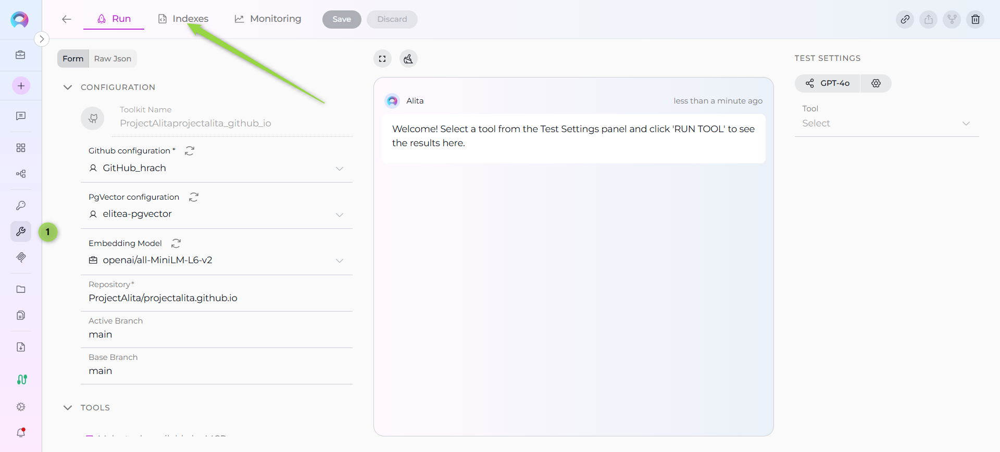
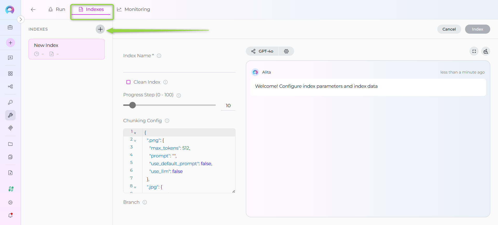
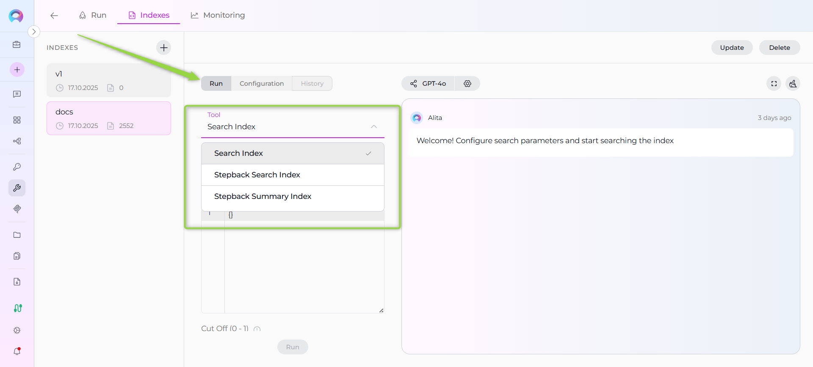

# Using the Indexes Tab Interface

!!! warning "New Interface Available"
    The **Indexes Tab** is a new interface available in the [Next environment](https://next.elitea.ai) as part of Release 1.7.2. This dedicated interface provides a comprehensive way to create, manage, and search indexes directly within the Toolkit Configuration. For general indexing information, see the [Indexing Overview](./indexing-overview.md).

## Overview

The **Indexes Tab** is a dedicated interface within Toolkit Configuration that provides a centralized location for managing all indexing operations for supported toolkits. It offers an intuitive sidebar-based layout with three main sections:

- **Indexes Sidebar**: Displays all created indexes with their status and metadata
- **Index Management**: Provides detailed controls for selected indexes
- **Search & Chat**: Enables running search tools and viewing results in a chat interface

**Key Features:**

- **Visual Status Indicators**: Easy identification of index states (success, in-progress, failed)
- **Multiple Search Tools**: Access to Search Index, Stepback Search Index, and Stepback Summary Index
- **Real-time Progress Monitoring**: Live updates during index creation and updates

---

## Prerequisites

Before using the Indexes Tab interface, ensure the following requirements are met:

### Project-Level Configuration

1. **PgVector Configuration**: Vector storage must be configured at the project level
      - Navigate to **Settings** → **[AI Configuration](../../menus/settings/ai-configuration.md)**  
      - Configure PgVector connection settings
      - Verify connection is active

2. **Embedding Model Configuration**: An embedding model must be selected
      - Navigate to **Settings** → **[AI Configuration](../../menus/settings/ai-configuration.md)**
      - Select and configure an embedding model
      - Test model availability

!!! warning "Access Control"
    The **Indexes tab** is automatically **disabled** if PgVector and Embedding Model are not properly configured at the project level. You must complete the project-level setup before the tab becomes available.

### Toolkit Configuration

3. **Supported Toolkit**: Ensure you're working with a toolkit that supports indexing:

| Category | Supported Toolkits |
|----------|-------------------|
| **Repos** | ADO Repos, Bitbucket, GitHub, GitLab |
| **Wikis** | ADO Wiki, Confluence, SharePoint |
| **Issues** | ADO Boards, ADO Plans, Jira |
| **Files** | Artifact, SharePoint |
| **Designs** | Figma |
| **Tests** | TestRail, Xray Cloud, Zephyr Enterprise, Zephyr Essential, Zephyr Scale |

4. **Toolkit Tools**: Enable indexing tools in your toolkit configuration:

| Tool | Status | Description |
|------|--------|-------------|
| **Index Data** | Required | For creating indexes |
| **Search Index** | Required | For search functionality |
| **Stepback Search Index** | Optional | For advanced search |
| **Stepback Summary Index** | Optional | For summarized search results |
| **List Collections** | Optional | For viewing available indexes |
| **Remove Index** | Optional | For index cleanup |

!!! warning "Indexing Tab Availability"
    The **Indexes tab** is automatically **disabled** if the **Index Data** tool is not enabled in your toolkit configuration. You must enable the Index Data tool before the Indexes tab becomes available.

---

## Accessing the Indexes Tab

1. **Navigate to Toolkits**: Go to **Toolkits** in the main navigation
2. **Select Toolkit**: Choose a toolkit that supports indexing from your list(e.g., Github)
3. **Open Indexes Tab**: Click on the **Indexes** tab in the toolkit detail view

If the Indexes tab is disabled or not visible, verify that your project-level prerequisites are properly configured.

---

## Creating a New Index

### Step 1: Initiate Index Creation

1. **Click the + Icon**: In the Indexes sidebar, click the **+ Create New Index** button
2. **New Index Form**: The center panel will display the new index creation form

### Step 2: Configure Index Parameters

**Required Fields:**

- **Index Name**: Provide a unique name for your index (collection suffix)
     - Must be unique within the toolkit
     - Maximum 7 characters
     - Alphanumeric characters recommended

**Toolkit-Specific Parameters:**

Configure parameters specific to your toolkit type. Common parameters include:

| Parameter | Description | Example |
|-----------|-------------|---------|
| **Collection Suffix** | Unique identifier for the index | `docs`, `prod`, `v1` |
| **Progress Step** | Progress reporting interval (0-100) | `10` |
| **Clean Index** | Remove existing data before indexing | ✓ or ✗ |
| **Chunking Config** | Document chunking configuration | `{}` (default) |

!!! tip "Toolkit-Specific Settings"
    Different toolkits require different parameters. For example:
    
    - **GitHub**: Repository name, branch, file patterns
    - **Confluence**: Space key, page filters
    - **Jira**: JQL queries, field extraction settings
    - **TestRail**: Project ID, suite filters
    
    Refer to toolkit-specific documentation for detailed parameter information.

### Step 3: Validate and Start Indexing

1. **Form Validation**: The **Index** button remains inactive until all mandatory fields are filled
2. **Review Configuration**: Verify all parameters are correct
3. **Start Indexing**: Click the **Index** button to begin the process

---

## Managing Existing Indexes

### Selecting an Index

1. **Click Index Card**: Select any index from the left sidebar
2. **View Details**: Index information and management options appear in center panel
3. **Access Tools**: Available actions depend on index status

### Index Information Panel

When an index is selected, the index card displays:

- **Index Name**: Current name/collection suffix
- **Last Updated**: Timestamp of most recent update
- **Document Count**: Number of indexed documents

### Manual Index Updates

**Trigger Manual Update:**

1. **Select Index**: Click on the index you want to update
2. **Click Update**: Use the **Update** button in the index information panel
3. **Monitor Progress**: Watch real-time updates in the center and right panels
4. **Review Results**: Check for successful completion or error messages

**Update Scenarios:**

- **Incremental Updates**: Add new content since last indexing
- **Full Refresh**: Complete re-indexing of all content (use Clean Index option)
- **Parameter Changes**: Modify indexing parameters before updating

### Deleting Indexes

**Delete Process:**

1. **Select Index**: Choose the index to delete from the sidebar
2. **Click Delete**: Use the **Delete** button in the index information panel
3. **Confirm Deletion**: Enter the index name in the confirmation modal
4. **Permanent Removal**: Index and all associated data are permanently deleted

!!! warning "Deletion Warning"
    Index deletion is **permanent** and **cannot be undone**. All indexed data, search history, and configurations are permanently removed.

---

## Using Search Tools

### Accessing Search Functionality

**Prerequisites for Search:**

- **Successful Index**: Only completed indexes support search operations
- **Selected Tools**: Search tools must be enabled in toolkit configuration

**Available Search Tools:**

- **Search Index**: Basic semantic search across indexed content
- **Stepback Search Index**: Advanced search that breaks down complex questions
- **Stepback Summary Index**: Search with automatic summarization of results

### Search Tool Selection

1. **Navigate to Run Tab**: Click the **Run** tab in the center panel
2. **Tool Dropdown**: Select search tool from the dropdown menu
3. **Configure Parameters**: Set search parameters and LLM model settings

### Basic Search (Search Index)

**Configuration:**

1. **Select Tool**: Choose "Search Index" from tool dropdown
2. **Enter Query**: Provide search query in the text field (e.g., `How do I create secrets in Elitea and what are the best practices for managing sensitive configuration data?`)
3. **Configure Model**: Select LLM model and adjust settings if needed
4. **Optional Parameters**:
      - **Filter**: Apply content filters to narrow search scope (e.g., `file_type:markdown`, `author:john.doe`)
      - **Cut Off (0 - 1)**: Relevance threshold for search results (e.g., `0.7` for high relevance, `0.3` for broader results)
      - **Search Top**: Maximum number of top results to return (e.g., `10`, `25`, `50`)
      - **Full Text Search**: Enable comprehensive text-based search (✓ enabled for detailed content search)
      - **Extended Search**: Activate advanced search algorithms (✓ enabled for semantic similarity)
      - **Reranker**: Use AI-powered result reranking for improved relevance (✓ enabled for better result ordering)
      - **Reranking Config**: Configure reranking algorithm parameters (e.g., model settings, weight adjustments)

**Execute Search:**

1. **Activate Run Button**: Button becomes active when query is provided
2. **Click Run**: Execute the search operation
3. **View Results**: Results appear in the right panel chat interface

### Advanced Search (Stepback Search)

**Configuration:**

1. **Select Tool**: Choose "Stepback Search Index" from dropdown
2. **Enter Complex Query**: Provide detailed or multi-part query
3. **Model Settings**: Configure LLM for query decomposition
4. **Search Parameters**:
     - **Messages**: Number of conversation messages to include in context
     - **Filter**: Apply content filters to narrow search scope (e.g., `file_type:markdown`, `author:john.doe`)
     - **Cut Off (0 - 1)**: Relevance threshold for search results (e.g., `0.7` for high relevance, `0.3` for broader results)
     - **Search Top**: Maximum number of top results to return (e.g., `10`, `25`, `50`)
     - **Full Text Search**: Enable comprehensive text-based search (✓ enabled for detailed content search)
     - **Extended Search**: Activate advanced search algorithms (✓ enabled for semantic similarity)
     - **Reranker**: Use AI-powered result reranking for improved relevance (✓ enabled for better result ordering)
     - **Reranking Config**: Configure reranking algorithm parameters (e.g., model settings, weight adjustments)

### Summarized Search (Stepback Summary)

**Configuration:**

1. **Select Tool**: Choose "Stepback Summary Index" from dropdown  
2. **Enter Query**: Provide query requiring summarized response
3. **Summary Settings**: Configure summarization parameters
4. **Model Selection**: Choose appropriate LLM for summarization
5. **Search Parameters**:
     - **Messages**: Number of conversation messages to include in context
     - **Filter**: Apply content filters to narrow search scope (e.g., `file_type:markdown`, `author:john.doe`)
     - **Cut Off (0 - 1)**: Relevance threshold for search results (e.g., `0.7` for high relevance, `0.3` for broader results)
     - **Search Top**: Maximum number of top results to return (e.g., `10`, `25`, `50`)
     - **Full Text Search**: Enable comprehensive text-based search (✓ enabled for detailed content search)
     - **Extended Search**: Activate advanced search algorithms (✓ enabled for semantic similarity)
       - **Reranker**: Use AI-powered result reranking for improved relevance (✓ enabled for better result ordering)
   - **Reranking Config**: Configure reranking algorithm parameters (e.g., model settings, weight adjustments)

**Summary Parameters:**
- **Summary Length**: Short, medium, or long summaries
- **Include Citations**: Reference source documents in summary
- **Focus Areas**: Specific aspects to emphasize in summary

### Search Results Management

**Result Display:**

- **Structured Output**: Results appear as organized chat messages
- **Source References**: Links to original indexed documents
- **Relevance Scores**: Confidence ratings for search matches
- **Metadata**: Document types, dates, and other contextual information

**Result Actions:**

- **Copy Results**: Copy search output for external use
- **Export Data**: Save results in various formats
- **Refine Search**: Modify parameters and search again
- **Follow-up Questions**: Continue conversation with additional queries

---

## Viewing Index Configuration

### Configuration Tab Access

1. **Select Index**: Choose any index from the sidebar
2. **Navigate to Configuration**: Click the **Configuration** tab in center panel
3. **Review Settings**: All configuration parameters are displayed in read-only format

### Configuration Information

**Displayed Parameters:**

- **Creation Settings**: Original parameters used during index creation
- **Toolkit-Specific Config**: Parameters unique to the toolkit type
- **Processing Options**: Chunking, filtering, and processing configurations
- **Timestamp Information**: Creation date, last modified date
- **Version Information**: Index format version and compatibility

**Configuration Categories:**

| Category | Information Displayed |
|----------|----------------------|
| **Basic Settings** | Index name, collection suffix, toolkit type |
| **Data Source** | Source location, filters, scope parameters |
| **Processing** | Chunking configuration, content extraction settings |
| **Advanced** | Custom parameters, optimization settings |

### Understanding Configuration Details

**Data Source Parameters:**

- **Source Location**: Repository, space, project, or file location
- **Scope Filters**: Branches, labels, file patterns, date ranges
- **Access Credentials**: Associated credential information (name only)

**Processing Configuration:**

- **Chunking Strategy**: How documents are split for indexing
- **Content Extraction**: File types and content elements included
- **Filtering Rules**: Content exclusion patterns and rules

!!! info "Read-Only Display"
    All configuration information is **read-only** and cannot be modified from this tab. To change configuration, create a new index or update the existing index with new parameters.

---

## Troubleshooting

### Common Issues and Solutions

#### Tab Not Available

**Symptoms:**

- Indexes tab is missing or disabled
- Cannot access indexing interface

**Solutions:**

1. **Verify Prerequisites**: Ensure PgVector and Embedding Model are configured
2. **Check Toolkit Support**: Confirm toolkit supports indexing
3. **Review Permissions**: Verify user has access to indexing features
4. **Refresh Browser**: Clear cache and reload the page

#### Index Creation Failures

**Symptoms:**

- Index creation process fails
- Error notifications during indexing
- Stuck in "in progress" state

**Solutions:**

1. **Check Credentials**: Verify toolkit credentials are valid and accessible
2. **Review Parameters**: Ensure all required parameters are provided
3. **Data Source Access**: Confirm data source is accessible and contains data
4. **Resource Limits**: Check if data size exceeds system limits
5. **Network Connectivity**: Verify stable internet connection

**Common Error Messages:**

| Error | Possible Cause | Solution |
|-------|---------------|----------|
| "Authentication failed" | Invalid credentials | Update toolkit credentials |
| "Data source not found" | Incorrect source parameters | Verify repository/space/project names |
| "Insufficient permissions" | Limited access rights | Grant appropriate permissions to credential |
| "Processing timeout" | Large dataset or slow connection | Reduce scope or increase timeout settings |

#### Search Tool Issues

**Symptoms:**

- Search tools not available
- Run button remains disabled
- No search results returned

**Solutions:**

1. **Index Status**: Verify index is successfully completed
2. **Tool Selection**: Ensure search tools are enabled in toolkit
3. **Query Format**: Check search query syntax and format
4. **Model Configuration**: Verify LLM model is properly configured
5. **Collection Access**: Confirm index collections are accessible

### Performance Optimization

#### Large Dataset Handling

**Strategies:**

- **Incremental Indexing**: Use progressive updates instead of full re-indexing
- **Scope Filtering**: Limit indexing scope to relevant content
- **Chunking Optimization**: Adjust chunk sizes for optimal processing
- **Batch Processing**: Process large datasets in smaller batches

#### Search Performance

**Optimization Tips:**

- **Specific Queries**: Use specific search terms instead of broad queries
- **Result Limits**: Set appropriate limits on result counts
- **Model Selection**: Choose appropriate LLM models for search tasks
- **Collection Targeting**: Search specific collections instead of all indexes

### Getting Additional Help

**Documentation Resources:**
- [Indexing Overview](./indexing-overview.md): General indexing concepts
- [Indexing Tools](./indexing-tools.md): Detailed tool documentation
- Toolkit-specific guides for detailed configuration

---

## Best Practices

### Index Naming and Organization

**Naming Conventions:**

- **Descriptive Names**: Use meaningful collection suffixes (`docs`, `prod`, `test`)
- **Version Control**: Include version indicators for time-based indexes (`v1`, `2024q1`)
- **Environment Separation**: Distinguish between environments (`dev`, `staging`, `prod`)
- **Purpose Indication**: Reflect the index purpose (`onboard`, `support`, `api`)

**Organization Strategies:**

- **Logical Grouping**: Group related indexes by purpose or team
- **Lifecycle Management**: Implement retention policies for old indexes
- **Access Control**: Consider who needs access to which indexes
- **Documentation**: Maintain documentation of index purposes and usage

### Efficient Index Management

**Creation Best Practices:**

- **Start Small**: Begin with limited scope and expand as needed
- **Test First**: Use test environments before production indexing
- **Validate Data**: Ensure data quality before indexing
- **Monitor Resources**: Track system resource usage during indexing

**Update Strategies:**

- **Incremental Updates**: Prefer incremental over full updates when possible
- **Scheduled Maintenance**: Use off-peak hours for large updates
- **Change Detection**: Implement change detection to trigger targeted updates
- **Rollback Plans**: Maintain ability to revert to previous index versions

### Search Optimization

**Query Design:**

- **Specific Queries**: Use specific terms for better accuracy
- **Context Awareness**: Leverage conversation context for follow-up questions
- **Tool Selection**: Choose appropriate search tools for different use cases
- **Result Validation**: Verify search results against known information

**Model Configuration:**

- **Model Selection**: Choose appropriate LLMs for different search types
- **Parameter Tuning**: Adjust temperature and token limits based on use case
- **Cost Management**: Balance result quality with computational costs
- **Performance Monitoring**: Track search performance and optimize accordingly

### Maintenance and Monitoring

**Regular Maintenance:**

- **Index Health Checks**: Regularly verify index integrity and performance
- **Cleanup Operations**: Remove unused or outdated indexes
- **Performance Reviews**: Analyze search performance and user satisfaction
- **Security Audits**: Review access permissions and credential management

**Monitoring Practices:**

- **Usage Analytics**: Track index usage patterns and popular searches
- **Error Monitoring**: Monitor for indexing and search failures
- **Resource Tracking**: Monitor system resource consumption
- **User Feedback**: Collect feedback on search quality and interface usability

---

!!! info "Related Documentation"
    **Core Indexing Guides:**
    
    - [Indexing Overview](./indexing-overview.md) - General concepts and getting started
    - [Indexing Tools](./indexing-tools.md) - Detailed tool documentation and parameters
    - [Migrate Datasources to Indexing](../../migration/v1.7.0/migrate-datasources-to-indexing.md) - Migration from legacy systems

    **Toolkit-Specific Guides:**
    
    - [Index GitHub Data](./index-github-data.md) - GitHub repository indexing
    - [Index Confluence Data](./index-confluence-data.md) - Confluence space indexing
    - [Index Jira Data](./index-jira-data.md) - Jira issue indexing
    - [Index TestRail Data](./index-testrail-data.md) - TestRail test case indexing
    - [Index Figma Data](./index-figma-data.md) - Figma design file indexing
    - [Index Artifacts Data](./index-artifacts-data.md) - File-based content indexing

    **Configuration Guides:**
    
    - [AI Configuration](../../menus/settings/ai-configuration.md) - PgVector and embedding model setup
    - [Toolkits Menu](../../menus/toolkits.md) - General toolkit configuration
    - [Configure EPAM AI DIAL Key](../../getting-started/configure-epam-ai-dial-key.md) - Production LLM setup

