# Guide: Automated JIRA Issue Review with Elitea AI Agents

## Introduction

### Purpose and Overview

This guide provides comprehensive instructions on setting up an automated JIRA issue review process using Elitea AI agents and JIRA Automation. By following these steps, you can configure a system where an AI agent automatically reviews JIRA issues (such as User Stories ор tasks) and posts its findings directly as comments on the respective JIRA tickets. This enhances efficiency, consistency, and quality in your project management workflows.

This document covers understanding the API trigger mechanism, setting up the JIRA Automation rule, and troubleshooting common issues.

Note. Example provided in this guide can be used to create other workflows too. 

### Brief Overview of the Automated JIRA Review Process

The automated JIRA review process leverages the power of Elitea AI agents to analyze issue content based on predefined instructions. When triggered from JIRA (e.g., by clicking a button on an issue), a JIRA Automation rule sends the issue details (like the issue key) to a specific Elitea agent via an API call. The Elitea agent processes this information—which might involve using its JIRA toolkit to fetch more details about the issue—and then performs the review. The results of this review are then typically posted back to the originating JIRA issue as a comment.

This allows for:

   *   **Consistent Reviews:** Standardized checks against every issue.
   *   **Time Savings:** Automating a typically manual review process.
   *   **Improved Quality:** Identifying potential gaps, ambiguities, or areas for improvement in JIRA issues early.
   *   **Versatility:** Applicable not just to user stories, but also to other issue types for various analytical tasks.

### Key Terms

*   **Elitea Agent:** An AI-powered assistant configured within the Elitea platform to perform specific tasks, such as reviewing text, interacting with external systems (like JIRA), and generating responses.
*   **JIRA Automation:** A feature within JIRA (Cloud and Data Center/Server) that allows you to automate actions based on triggers and conditions.
*   **Webhook:** An automated message sent from one application (JIRA) to another (Elitea) when something happens. It contains a message—or payload—which is sent to a unique URL.
*   **API Trigger:** A mechanism to invoke an Elitea agent's functionality via an Application Programming Interface (API) call.
*   **`{{issue.key}}` (JIRA Smart Value):** A placeholder used in JIRA Automation that JIRA replaces with the actual key of the issue being processed (e.g., "PROJECT-123").
*   **`ProjectID` (Elitea):** A unique identifier for your project within the Elitea platform.
*   **`ApplicationVersionID` (Elitea):** A unique identifier for a specific version of your configured Elitea agent.
*   **JIRA Toolkit (Elitea):** A set of tools within an Elitea agent that allows it to interact with JIRA (More about  **[Jira toolkit](../toolkits/jira_toolkit.md)** here)

## Prerequisites

Before you begin, ensure you have the following:

*   An Elitea agent designed for JIRA issue review, preferably equipped with the JIRA toolkit. (Details on creation below).
*   Access to your JIRA instance (Cloud or Data Center/Server) with project administrator privileges to create Automation rules.
*   An Elitea API token for authentication.
*   The `ProjectID` and `ApplicationVersionID` for your Elitea agent.

## Setup and Configuration

Follow these steps to set up the automated JIRA review:

### Step 1: Create and Configure the Elitea Review Agent

1.  **Navigate to Elitea Agents:** Access the Agent configuration section within your Elitea instance.
2.  **Create or Configure Agent:**
    *   Create a new agent or modify an existing one.
    *   Define an **Agent Name** (e.g., "JIRA Story Reviewer"), **Description**, and crucial **Instructions**.
        *   **Agent Instructions:** The instructions must guide the agent on how to process the input (which will be the `issue key`) and what to do. For example: "You will receive a JIRA issue key as user input. Use the JIRA toolkit to fetch the details of this issue. Review the user story based on INVEST principles. Then, immediately post a comment on the same JIRA issue with your review, including a summary, context, identified gaps, and clarifying questions."
    *   **Add JIRA Toolkit:** If not already present, add the "JIRA" toolkit to your agent and configure it with your JIRA instance ( More about  **[Jira toolkit](../toolkits/jira_toolkit.md)** here).

3.  **Note `ProjectID` and `ApplicationVersionID`:**
    *   **ProjectID:** Find this in your Elitea "Settings" -> "Configuration" page.
    *   **ApplicationVersionID:** After configuring and saving your agent, locate its `ApplicationVersionID`. This ID is specific to this version of the agent configuration.

    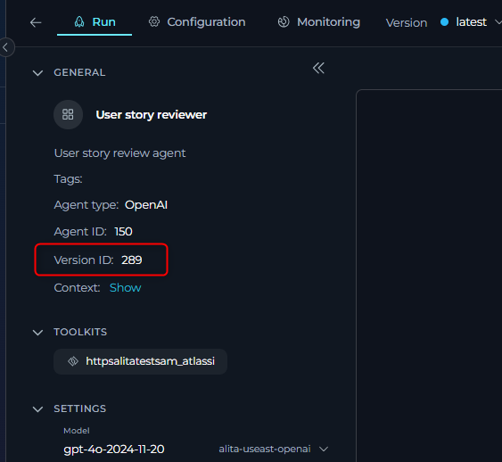
    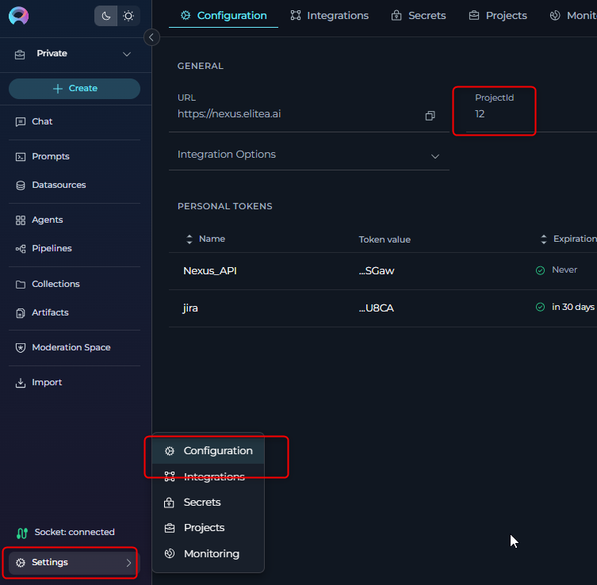

### Step 2: Understanding the Elitea API Trigger

The Elitea agent will be triggered via its public API.
*   **API Endpoint:**
    ```
    POST https://nexus.elitea.ai/api/v1/applications/predict/prompt_lib/{ProjectID}/{ApplicationVersionID}
    ```
    Replace `{ProjectID}` with your Elitea Project ID and `{ApplicationVersionID}` with your agent's specific Application Version ID.

*   **Request Body:**
    The JIRA Automation rule will send data to this endpoint. The `user_input` field will contain the JIRA issue key, which your agent is instructed to process.
    ```json
    {
      "user_input": "{{issue.key}}"
    }
    ```
    JIRA will dynamically replace `{{issue.key}}` with the actual issue key (e.g., "PROJ-123") when the automation rule runs. Your Elitea agent instructions should be designed to expect this issue key as the primary input.

### Step 3: Set Up JIRA Automation Rule

1.  **Navigate to JIRA Automation:**
    *   In your JIRA project, go to **Project settings** > **Automation**.

    **Cloud**

     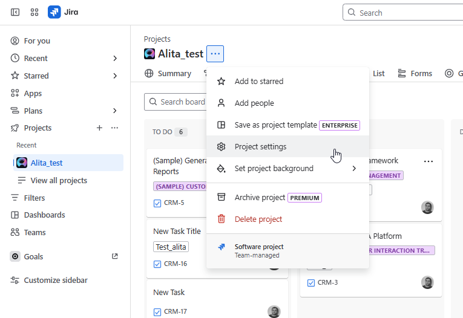

     


    **Server**


     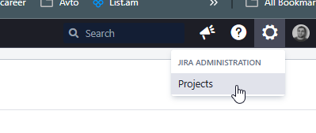

     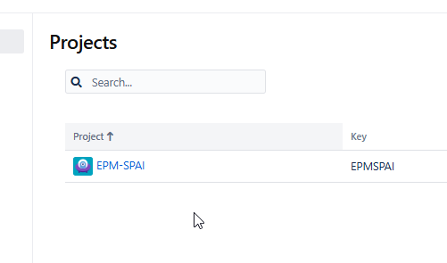

     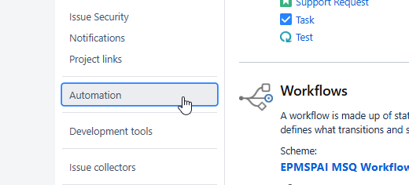


2.  **Create a New Rule:**
    *   Click on **Create rule**.

3.  **Select a Trigger:**
    *   For a button-initiated review, choose the **Manual trigger**. You can customize the name of the button (e.g., "Eliea Review Story").

    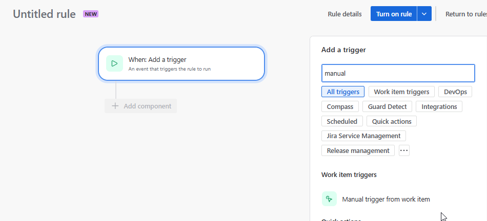
 

4.  **Add "Send web request" Action:**
    *   Click on **New action** and select **Send web request**.

    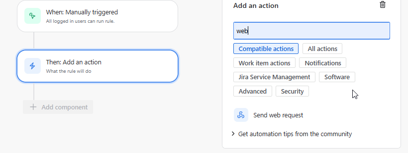

5.  **Configure the Web Request:**
    *   **Webhook URL:** Enter the Elitea API endpoint from Step 2, with your actual `ProjectID` and `ApplicationVersionID`.
        Example: `https://nexus.elitea.ai/api/v1/applications/predict/prompt_lib/your_project_id_here/your_app_version_id_here`
    *   **Headers:**
        *   `Content-Type`: `application/json`
        *   `Authorization`: `Bearer [Your_Eliea_API_Token]`

          

        *   **Important:** Instead of pasting your token directly, use JIRA's secret management if available. Create a secret (e.g., `ELITEA_API_TOKEN`) in JIRA's automation settings and reference it here like `Bearer {{secrets.ELITEA_API_TOKEN}}`. This keeps your token secure.

         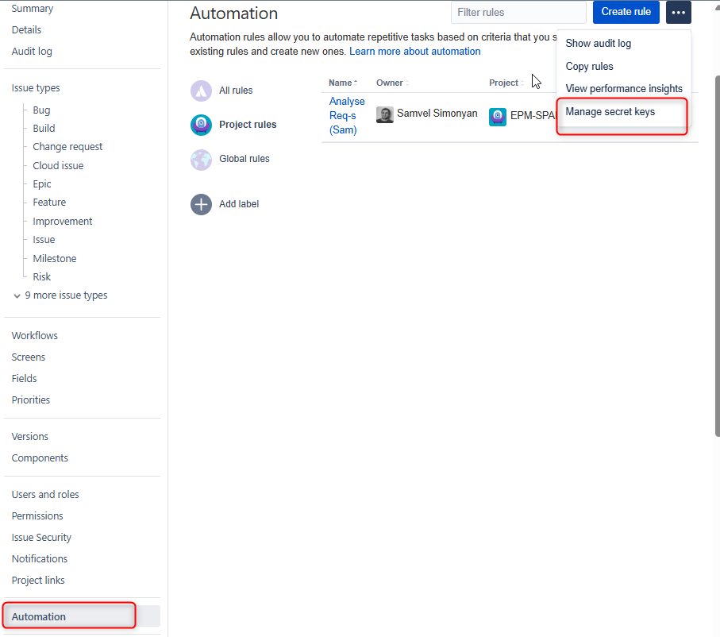

    *   **HTTP method:** `POST`
    *   **Webhook body:** Select `Custom data`.
        ```json
        {
          "user_input": "{{issue.key}}"
        }
        ```
    *   **Validate your web request configuration:** Use this JIRA feature to test the connection to the Elitea API with a sample issue key before saving the rule.


    Cloud

     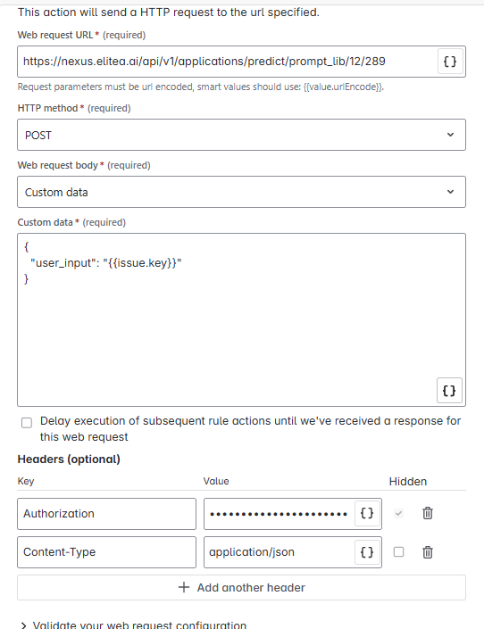

    Server

     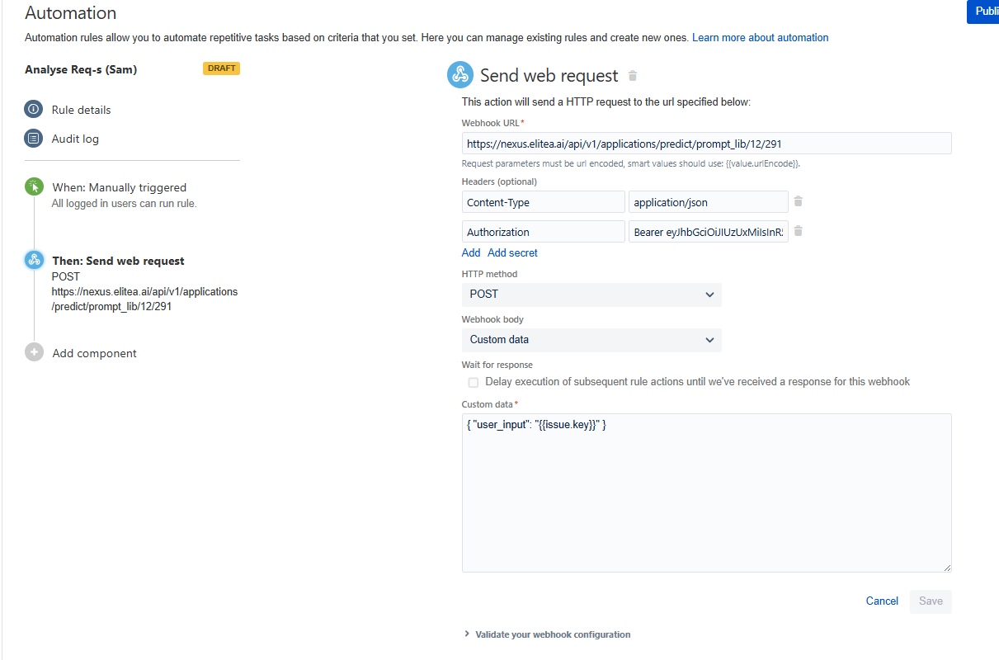


6.  **Save and Name the Rule:**
    *   Give your rule a descriptive name (e.g., "Trigger Elitea Story Review").
    *   Turn on the rule.
    *   **Rule Permissions/Scope:** Ensure the rule is configured to be visible/usable by the intended project members or roles if it's a manual trigger.

## Using the Automated Review

### Triggering the Review from a JIRA Issue

1.  Open any JIRA issue in the project where you configured the automation.
2.  If you used a Manual trigger:
    *   Look for the button you named (e.g., "Eliea Review Story"). It might be under the "Actions" menu (...) or directly visible on the issue view, depending on your JIRA version and configuration.
3.  Click the button. This will trigger the JIRA Automation rule, which in turn calls the Elitea agent.

    Cloud 
     

    Server 
     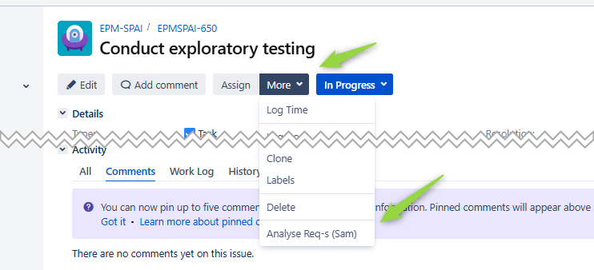

### Reviewing the Results

*   After a short processing time, the Elitea agent (if configured to do so with its JIRA toolkit) will post its review as a comment on the JIRA issue.
*   The comment will contain the structured feedback as defined in your agent's instructions (e.g., Requirements Summary, Context, Gaps Identified, Clarifying Questions).


## Use Cases and Customization

This setup is highly versatile. Beyond the primary example of user story review, consider these possibilities:

*   **Reviewing Different Issue Types:** Configure the agent and automation for bugs, tasks, epics, or any custom JIRA issue type. The agent's instructions would need to be tailored to the specific information available and the desired review criteria for that issue type.
*   **Generating Checklists:** The Elitea agent can be instructed to generate a task checklist based on the issue description or type and add it as a comment or update a specific field.
*   **Converting Formats:** Instruct the agent to convert a user story into Gherkin syntax for BDD scenarios, or extract key information to populate a test case template.
*   **Summarizing Issues:** For lengthy issues with many comments, the agent could provide a summary.
*   **Data Validation/Enrichment:** The agent could check for missing information in required fields or suggest labels based on the content.

**Customizing Triggers and Actions:**
*   **Triggers:** Instead of a manual button, JIRA Automation supports various triggers:
    *   **Issue Created:** Automatically review new issues.
    *   **Issue Transitioned:** Review an issue when it moves to a specific status (e.g., "Ready for Review").
    *   **Scheduled:** Run reviews on a batch of issues at set times.
*   **Agent Actions:** The Elitea agent can perform more than just commenting:
    *   Update JIRA issue fields.
    *   Transition issues to different statuses.


## Troubleshooting

If you encounter issues, here are common areas to check:

1.  **Comment Not Created After Clicking the Rule/Button:**
    *   **A. Verify Elitea Agent Directly:**
        *   Go to your Elitea instance.
        *   Manually run or test the agent by providing a JIRA issue key (e.g., "PROJECT-123") as the `user_input`.
        *   Check if the agent executes successfully and performs the intended action (e.g., tries to create a comment).
    *   **B. Test API Request:**
        *   Use a tool like Postman or `curl` to send a direct HTTP POST request to your Elitea agent's API endpoint (`https://nexus.elitea.ai/api/v1/applications/predict/prompt_lib/{ProjectID}/{ApplicationVersionID}`).
        *   Use the same headers (Authorization with Bearer token, Content-Type) and body (`{ "user_input": "YOUR-ISSUE-KEY" }`) as configured in JIRA Automation.
        *   This helps isolate whether the issue is with JIRA Automation or the Elitea agent/API itself.
    *   **C. Check JIRA Automation Audit Log:**
        *   In JIRA Automation settings, find your rule and view its "Audit log."
        *   Look for successful executions or error messages. Errors here might point to problems with the webhook URL, authentication, request body format, or network connectivity from JIRA to Elitea.
        *   JIRA often provides details on why a web request failed.
    *   **D. Use "Validate your web request configuration":**
        *   In the JIRA "Send web request" action configuration, there's often a button to validate the setup. Use this with a real issue key and review the request details.


       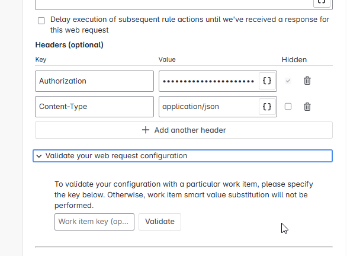

2.  **Your Teammates Can't See the Rule/Button (for Manual Triggers):**
    *   **Check Rule Scope/Permissions:** In the JIRA Automation rule settings, ensure the rule is enabled and that its scope or permissions allow other project members to see and execute manual triggers. Some JIRA versions have specific settings for manual trigger visibility.


    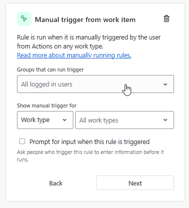

3.  **Elitea Agent Errors:**
    *   Ensure the agent's JIRA toolkit is correctly configured and can connect to your JIRA instance.
    *   Verify the agent's instructions are clear and correctly interpret the `user_input` (issue key).

4.  **Authentication Issues (401 Unauthorized or 403 Forbidden):**
    *   Double-check the Elitea API token used in the `Authorization` header.
    *   Ensure the `Bearer ` prefix is present before the token.
    *   Verify the token is valid and has not expired.
    *   If using JIRA secrets, ensure the secret is correctly defined and accessible.

5.  **Incorrect `ProjectID` or `ApplicationVersionID`:**
    *   A common issue is using `ApplicationID` instead of `ApplicationVersionID` after updating the agent.
    *   Verify the `ProjectID` is correct.

## FAQs

**Q: Can I use this automation for issues other than User Stories?**
**A:** Yes. You can adapt the Elitea agent's instructions and the JIRA Automation rule (e.g., trigger conditions, issue scope) to review any JIRA issue type like bugs, tasks, epics, etc. The key is to tailor the agent's logic to what needs to be reviewed for that specific issue type.

**Q: What if the Elitea agent's `ApplicationVersionID` changes?**
**A:** You will need to update the Webhook URL in your JIRA Automation rule with the new `ApplicationVersionID` for the automation to continue triggering the correct agent version.

**Q: Can I trigger the review based on a status change instead of a manual button?**
**A:** Absolutely. JIRA Automation allows various triggers. You can configure the rule to run when an issue is transitioned to a specific status (e.g., "In Review"), when an issue is created, or on a scheduled basis.

**Q: How do I ensure the Elitea agent has the necessary permissions in JIRA?**
**A:** The Elitea agent, through its JIRA Toolkit, will interact with JIRA using credentials (often an API token of a JIRA user). Ensure this JIRA user account has the necessary permissions in the target JIRA project to:
    *   Read issue details.
    *   Add comments to issues.
Ensure that the corresponding tools are selected for Jira toolkit in Elitea


## Support and Contact Information

If you encounter persistent issues not covered in this guide, or require further assistance with Elitea Agents or this JIRA integration, please contact the Elitea Support Team:

*   **Email:** SupportAlita@epam.com

Please provide the following details in your support request to help us assist you efficiently:

*   **Elitea Environment:** (e.g., "Nexus," "Alita Lab," "EYE")
*   **JIRA Version:** (e.g., JIRA Cloud, JIRA Server 8.x)
*   **Project Details:** Project Name in Elitea and JIRA.
*   **Detailed Issue Description:** Clear explanation of the problem, steps to reproduce, expected vs. actual behavior.
*   **Relevant Configuration Information:**
    *   Elitea Agent Instructions (screenshot or text)
    *   Elitea Agent `ProjectID` and `ApplicationVersionID` used.
    *   JIRA Automation Rule configuration (screenshots).
    *   Error Messages (full error text from JIRA Audit Log or Elitea agent logs).
*   **Your Query/Prompt (if testing manually):** Exact input used.

**Before Contacting Support:**
Please ensure you have reviewed the troubleshooting steps in this guide and consulted the JIRA Automation audit logs.

## Useful Materials and References

*   **Elitea API Public Collection (Postman):** [https://www.postman.com/projectalita/elitea-api-public](https://www.postman.com/projectalita/elitea-api-public)
    *   The specific request for prediction: [Elitea API predict endpoint](https://www.postman.com/projectalita/elitea-api-public/request/ac6fj06/predict)
*   **JIRA Automation Documentation (Cloud):** [https://support.atlassian.com/cloud-automation/docs/jira-cloud-automation/](https://support.atlassian.com/cloud-automation/docs/jira-cloud-automation/)
*   **Example Elitea Agent Instructions for JIRA Story Review:** [Agent Instructions](../../img/how-tos/jira_automation/instructions.txt)


