# Elitea MCP Server Integration via SSE Transport

## Overview

The Elitea platform now supports integration with MCP clients through its dedicated MCP Server, using Server-Sent Events (SSE) for real-time communication. This integration makes it easy to connect your favorite MCP-compatible tools to Elitea, enabling seamless, live interactions powered by the open Model Context Protocol (MCP).

With SSE transport, you receive updates and responses from Elitea agents as they happen, making your workflows more interactive and efficient. Whether you’re using Visual Studio Code or another MCP client, this guide will walk you through connecting and making the most of Elitea’s MCP Server capabilities.

## What is the MCP Protocol?

The Model Context Protocol (MCP) is an open standard designed to enable seamless communication between AI-powered tools, agents, and client applications. By following the MCP protocol, different systems can exchange context, tasks, and results in a consistent and interoperable way.

MCP is widely adopted in the AI ecosystem, making it easier to integrate various tools and platforms—like Elitea—with your favorite development environments and assistants.

To learn more about the technical details and capabilities of MCP, visit the official documentation: [MCP Protocol](https://modelcontextprotocol.io/).

## Prerequisites

Before you begin integrating with the Elitea MCP Server via SSE, ensure you have the following:

- **MCP Server Endpoint**  
  You’ll need the full URL for your project’s MCP Server. The format is:
  ```
  [ELITEA_SERVER_URL]/mcp_sse/[PROJECT_ID]/sse
  ```
  For example:
  ```
  https://nexus.elitea.ai/mcp_sse/1/sse
  ```
  You can find your Server Endpoint and Project ID in the [Settings Configuration section](../platform-documentation/menus/settings.md#configuration) of the Elitea web interface.

- **Authentication Token**  
  An authentication token is required to securely connect your MCP client to Elitea. Tokens act as secure keys that authorize your applications or scripts to perform operations on behalf of your account and project. You can generate and manage tokens in the Elitea web interface under the [Settings & Configuration – Personal Tokens](../platform-documentation/menus/settings.md#configuration) section. For each project, you can create a token and set its expiration. Be sure to copy and store your token securely, as it will not be shown again after creation.

- **Compatible MCP Clients**  
  Currently, VSCode is the primary supported client for integration. You can also use Postman or any HTTP client that supports Server-Sent Events (SSE) for testing and development purposes. **Note:** Only MCP clients that support **custom HTTP headers** or implicitly add the HTTP header **Authorization: Bearer [TOKEN]** can be integrated with the Elitea SSE MCP Server. More clients will be added in the future.

- **Enable MCP Support in VS Code**  
  MCP support is available starting in VS Code release 1.99. To enable MCP support, ensure the `chat.mcp.enabled` setting is turned on (this setting is enabled by default).

- **GitHub Copilot Agent**  
  Ensure that GitHub Copilot is configured and running in Agent mode. This enables advanced AI-powered assistance and tool integration within your Elitea project.

## How to Connect to ELITEA MCP Server

You can add and configure an Elitea MCP Server in VS Code using either **Workspace** or **User** settings. This flexibility allows you to share configurations with your team or keep them global for all your projects.

### Step-by-Step Setup

1. **Open Your Project**  
   Launch VS Code and open the project or workspace where you want to use the Elitea MCP Server.

1. **Open GitHub Copilot Chat**  
   Access the Copilot Chat panel in VS Code.  
   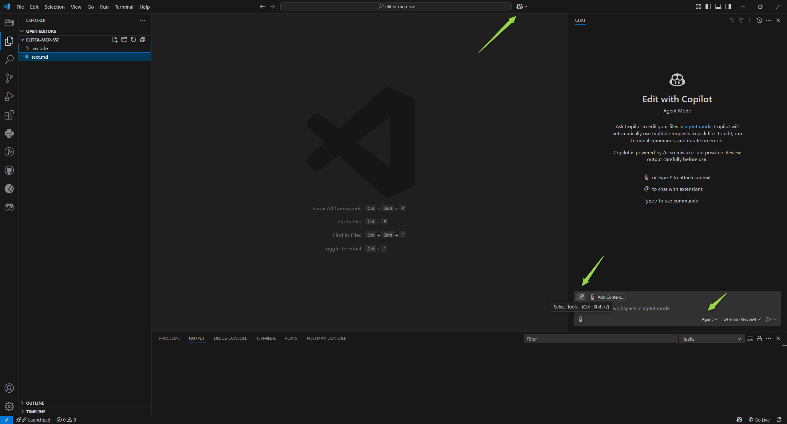

1. **Switch to Agent Mode**  
   In Copilot Chat, select **Agent mode**.  

1. **Select Tools**  
   Click the **Select Tools** icon.  

1. **Add MCP Server**  
    - Click **Add More Tools**.
    - Choose **+ Add MCP Server**.
      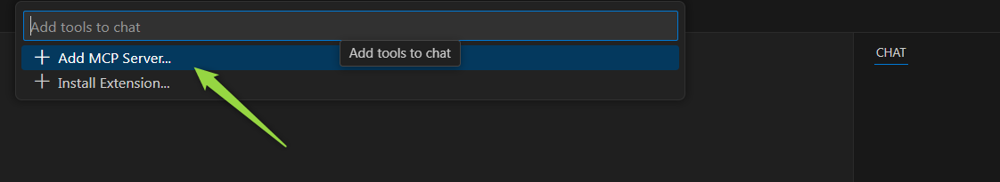
    - Select **HTTP (Server Sent Events)**.
      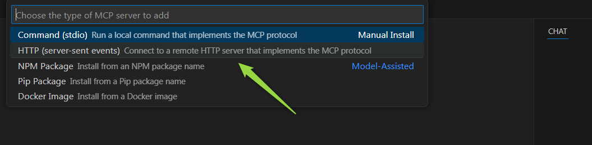
    - Enter your Server URL (e.g., `https://nexus.elitea.ai/mcp_sse/1/sse`).
      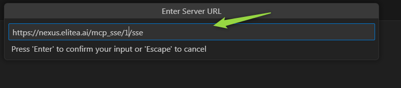
    - Enter a Server ID (use the default generated one or provide a descriptive name).
      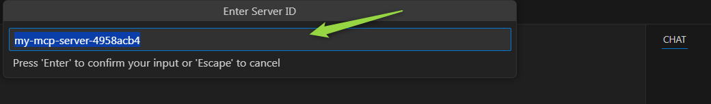

1. **Choose Configuration Scope**  
   You can save your MCP server configuration in either:
    - **Workspace Settings** (shared with your team, local to the project)
    - **User Settings** (applies globally to all VS Code workspaces)
    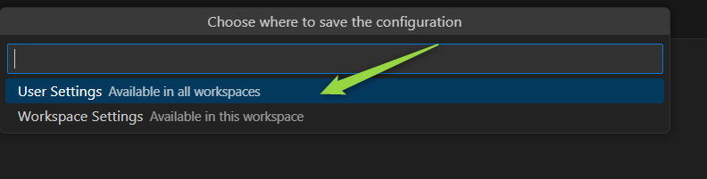

---

### Option 1: Workspace Settings

If you choose **Workspace Settings**, VS Code will create a `.vscode/mcp.json` file in your project.

1. **Open `.vscode/mcp.json`**  
   Navigate to the file in your workspace and open it.  

1. **Add Your Token**  
   After the `"url"` entry for your server, add the `"headers"` section exactly as shown below. Make sure to keep the word `Bearer` (with a space after it) and replace `[Your Token]` with your actual authentication token. Do not remove `Bearer`—it is required for authorization to work correctly.
   ```json
   "headers": {
       "Authorization": "Bearer YOUR_TOKEN_HERE"
   }
   ```
   For example, if your token is `abc123`, it should look like:
   ```json
   "headers": {
       "Authorization": "Bearer abc123"
   }
   ```
   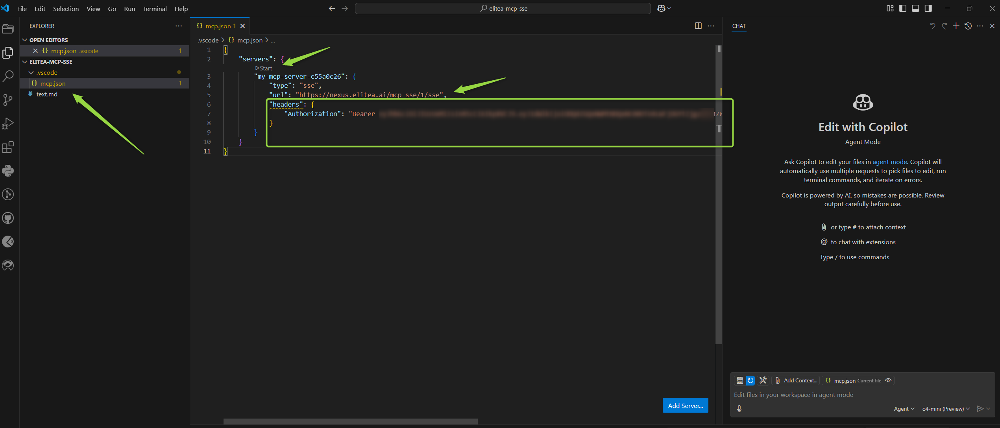

1. **Save and Start**  
   Save the file, then click the **Start** button in the Copilot Chat interface to activate the server.
   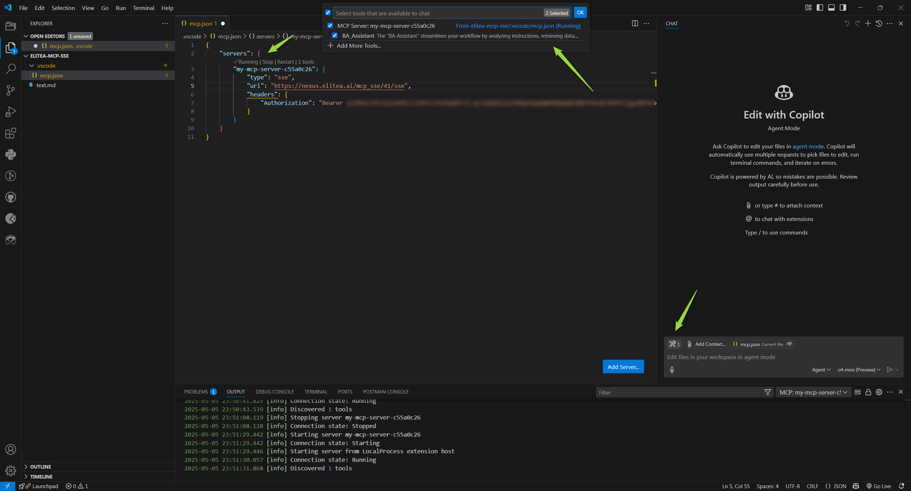

> **Note:** This MCP server will only be available within this workspace.

---

### Option 2: User Settings

If you choose **User Settings**, your MCP server configuration will be added to your global `settings.json` file.

1. **Open `settings.json`**  
   Open your user settings file in VS Code.  

1. **Add Your Token**  
   After the `"url"` entry for your server, add the `"headers"` section exactly as shown below. Make sure to keep the word `Bearer` (with a space after it) and replace `[Your Token]` with your actual authentication token. Do not remove `Bearer` — it is required for authorization to work correctly.
   ```json
   "headers": {
       "Authorization": "Bearer YOUR_TOKEN_HERE"
   }
   ```
   For example, if your token is `abc123`, it should look like:
   ```json
   "headers": {
       "Authorization": "Bearer abc123"
   }
   ```
   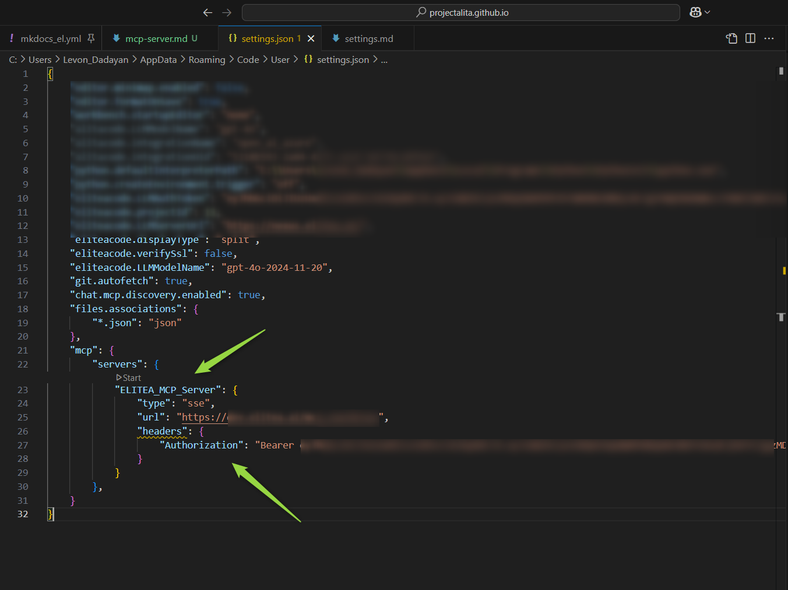

1. **Save and Start**  
   Save the file, then click the **Start** button in the Copilot Chat interface to activate the server.
   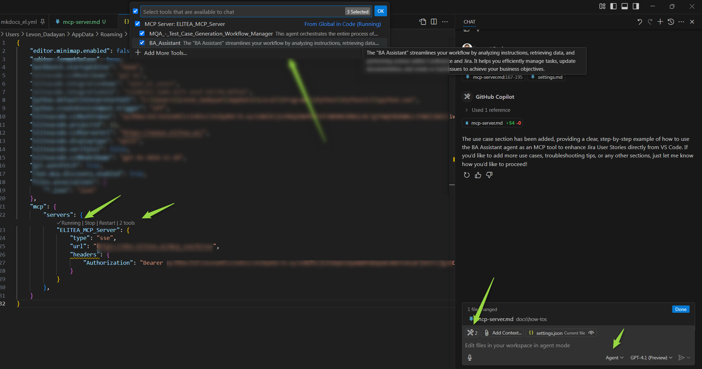

> **Note:** This MCP server will be available globally for all your projects and workspaces in VS Code.

---

### Multiple MCP Servers

You can add as many MCP servers as you need. For example, if you have several Elitea projects and want to use different agents from each, simply repeat the above steps for each server—regardless of whether you use workspace or user settings.

---

## Using Elitea Agents as MCP Tools

To use Elitea agents and pipelines as tools in VS Code via MCP, they must be tagged with `mcp` in Elitea.

> **Note:** If you add or update agents/pipelines with the `mcp` tag after starting your MCP server, restart the server to sync and make them available as tools.

### Tagging Agents and Pipelines

1. In the Elitea web interface, tag your agents or pipelines with `mcp`.
   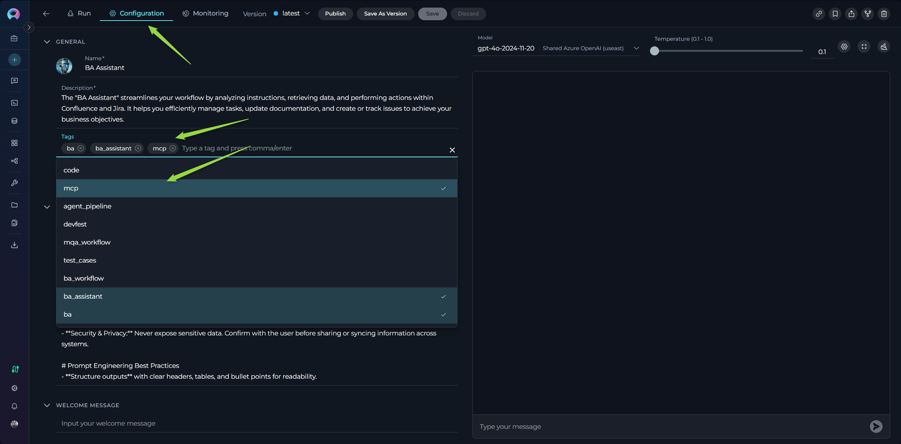
2. Only tagged agents and pipelines will be synced and available as tools in VS Code.

> **Note:** Only the "**latest**" version of each agent or pipeline tagged with `mcp` will be pulled and used. If you have multiple versions of the same agent/pipeline, ensure the version you want to use is the "**latest**".

---

### Using MCP Tools in Agent Mode

Once your MCP server is connected and your agents/pipelines are tagged:

1. **Open GitHub Copilot Chat**  
1. **Select Agent Mode**  
1. **Click the Tools Icon**  
1. **Select Synced Agents and Pipelines**  
    - All synced tools (tagged with `mcp`) will appear in the list.
    - By default, all are selected. You can search, select, or deselect tools as needed.
    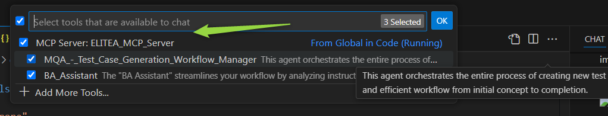

1. **Use Tools in Chat**  
    - In the chat input, write your instructions. You can reference a tool directly by typing `#` followed by the tool name (e.g.,   `#my_agent`).
    - Copilot will automatically suggest and invoke tools as needed.
    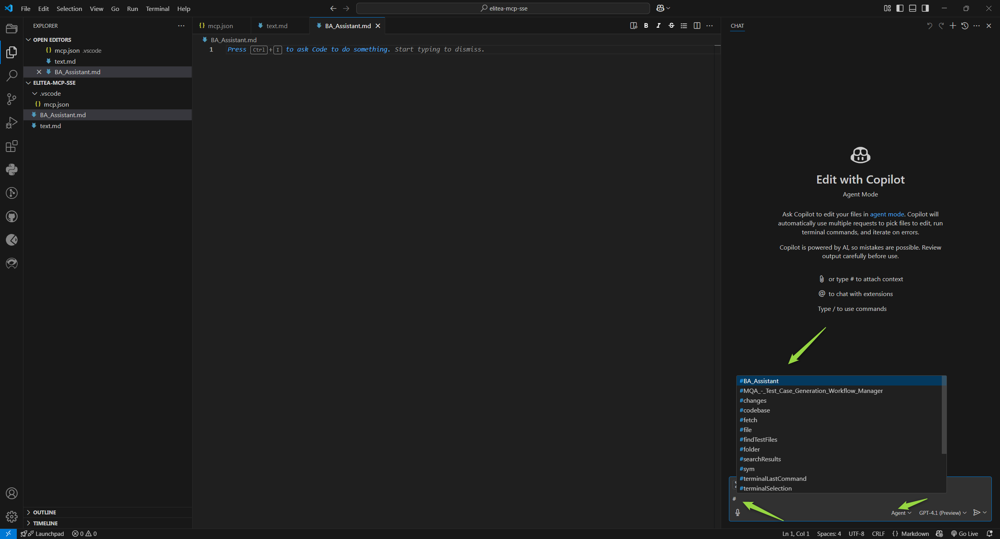

1. **Run the Tool**  
    - When a tool is selected, click **Run [tool name]** to execute it.
    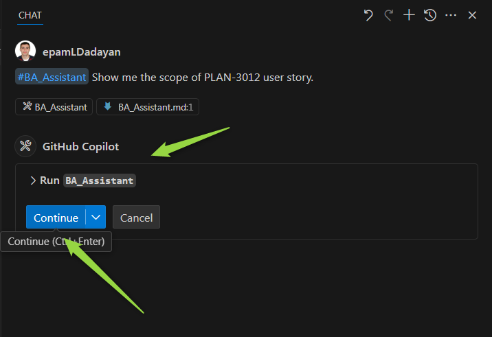

1. **Confirm Tool Execution**  
    - By default, you’ll be asked to confirm before a tool runs, for safety.
    - Use the **Continue** button dropdown to auto-confirm for the session, workspace, or all future runs.
   
1. **Edit Tool Input Parameters (Optional)**  
    - Click the chevron next to the tool name to view and edit input parameters before running.
    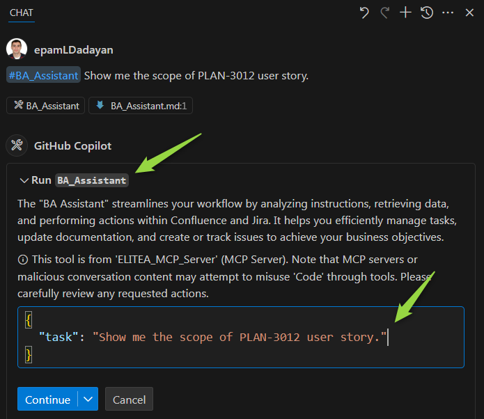

1. **Review Output and Next Steps**  
      - Follow the output and use the results as needed in your workflow.

---

**Tip:**  
You can reference any available tool in your prompt by typing `#` and the tool name. This works in all chat modes (ask, edit, and agent mode).

## Use Case: Enhancing Jira User Stories with the BA Assistant Agent

Let’s walk through a real-world example to see how you can use an Elitea agent as an MCP tool in your workflow. In this scenario, we’ll use the **BA Assistant** agent, which helps you analyze instructions, retrieve data, and perform actions in Confluence and Jira.

### Scenario
You want to improve the acceptance criteria (ACs) of a Jira User Story. The BA Assistant agent, tagged with `mcp`, will help you read the ticket, enhance the ACs, and save the improved User Story as a local file—all from within GitHub Copilot Chat in VS Code.

---

### Step 1: Ensure the Agent is Tagged
In Elitea, make sure your **BA Assistant** agent is tagged with `mcp` so it’s available as a tool in VS Code.

```text
Agent: BA Assistant
Tags: mcp
```


---

### Step 2: Connect to Elitea MCP Server
Follow the earlier steps in this guide to connect your workspace to the Elitea MCP Server and sync available agents.

---

### Step 3: Open Copilot Chat and Select the Agent
1. Open GitHub Copilot Chat in VS Code.
1. Switch to **Agent mode**.
1. Click the **Tools** icon and ensure **BA Assistant** is selected as a tool.
   

---

### Step 4: Call the Agent with Your Instruction
In the chat input, provide a clear instruction referencing the BA Assistant tool. For example:

```
#BA Assistant
Show me the scope of PLAN-3012 user story. Enhance ACs. 
```
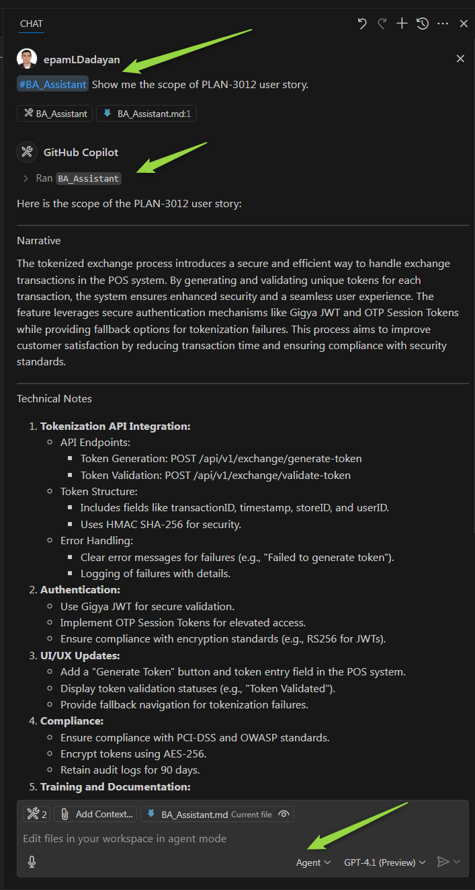

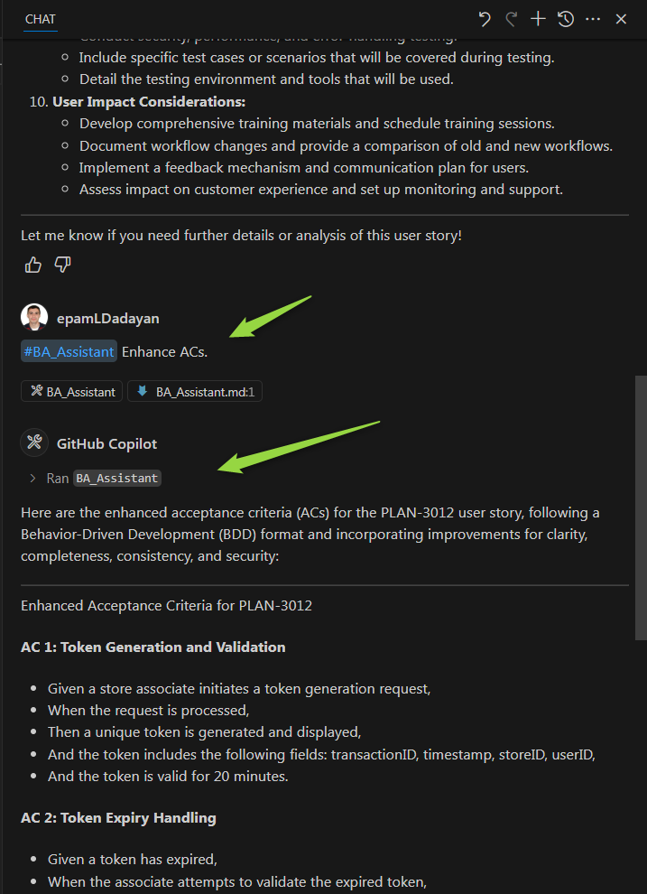

---

### Step 5: Review and Save the Output
- The BA Assistant agent will retrieve the Jira ticket, enhance the ACs, and present the improved User Story.
- The Github Copilot will save enhanced US as a new file named `PLAN-3012_enhanced.md` in my workspace.
- Confirm the action if prompted.
- The enhanced User Story will be saved as a new file in your workspace.
  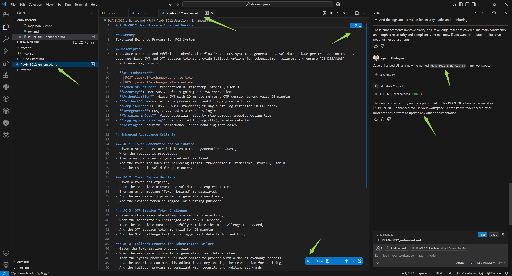

---

**That’s it!**  
With just a few steps, you’ve used the BA Assistant agent as an MCP tool to automate and streamline your Jira workflow—directly from VS Code.

## Troubleshooting & Tips

If you encounter issues while integrating or using the Elitea MCP Server, use the following tips and solutions to resolve common problems:

---

### 1. No Agents or Pipelines Are Shown
- **Check MCP Tag:** Ensure your agents and pipelines in Elitea are tagged with `mcp`. Only tagged items will sync and appear as tools in VS Code.
- **Restart the Server:** If you add or update tags after starting the MCP server, restart the server to sync the latest agents and pipelines.
- **Scope of MCP Server:** Verify whether your MCP server is configured for the correct scope (User or Workspace). Sometimes, agents may not appear if the configuration is not in the expected location.

---

### 2. Token Issues
- **Correct Token:** Double-check that you have copied and pasted the correct authentication token into your configuration.
- **Token Expiry:** Ensure your token has not expired. If it has, generate a new one in the Elitea Settings and update your configuration.
- **Token Placement:** Make sure the token is added under the `"headers"` section in your MCP server configuration.

---

### 3. VS Code MCP Server Errors
- **Error Indicator:** If VS Code encounters an issue with an MCP server, an error indicator will appear in the Chat view.
  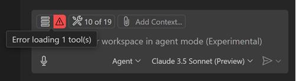
- **View Server Logs:** Select the error notification in the Chat view, then choose **Show Output** to view detailed server logs.
  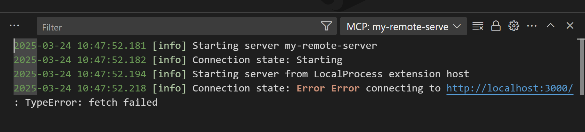
- **Command Palette:** Alternatively, run `MCP: List Servers` from the Command Palette, select your server, and choose **Show Output** for troubleshooting details.

---

### 4. General Troubleshooting Tips
- **Check Network Connection:** Ensure your internet connection is stable and that your firewall or proxy settings are not blocking the MCP server URL.
- **VS Code Version:** Make sure you are using VS Code version 1.99 or later, as MCP support is only available from this version onward.
- **Configuration File Location:** Confirm that your `mcp.json` (for workspace) or `settings.json` (for user) is correctly formatted and saved.
- **Multiple Servers:** If you have multiple MCP servers configured, ensure you are interacting with the correct one in the Copilot Chat interface.
- **Agent Mode:** Always use Agent mode in Copilot Chat to access and use MCP tools.

---

### 5. Still Having Issues?
- **Re-sync Tools:** Try deselecting and reselecting tools in the Tools menu to force a refresh.
- **Restart VS Code:** Sometimes, simply restarting VS Code can resolve temporary glitches.
- **Consult Logs:** Review the output logs for specific error messages and search for solutions in the Elitea or VS Code documentation.
- **Contact Support:** If you continue to experience problems, reach out to your Elitea administrator or see below for support options.

**Contacting ELITEA Support**
The primary way to reach our support team is via email:

**Email:** SupportAlita@epam.com

Please use this email address for all support-related inquiries.

## Additional Resources and Useful Links

For further reading and to deepen your understanding of Elitea MCP Server integration and related technologies, explore the following resources:

- [MCP Protocol – Official Documentation](https://modelcontextprotocol.io/)
- [VS Code MCP Server Documentation](https://code.visualstudio.com/docs/copilot/chat/mcp-servers)
- [ELITEA Documentation Home](../home/introduction.md)
- [ELITEA Settings & Token Management](../platform-documentation/menus/settings.md#configuration)
- [ELITEA Support Resources](../support-resources/contact-support.md)

Stay up to date with the latest features and best practices by visiting these links regularly.