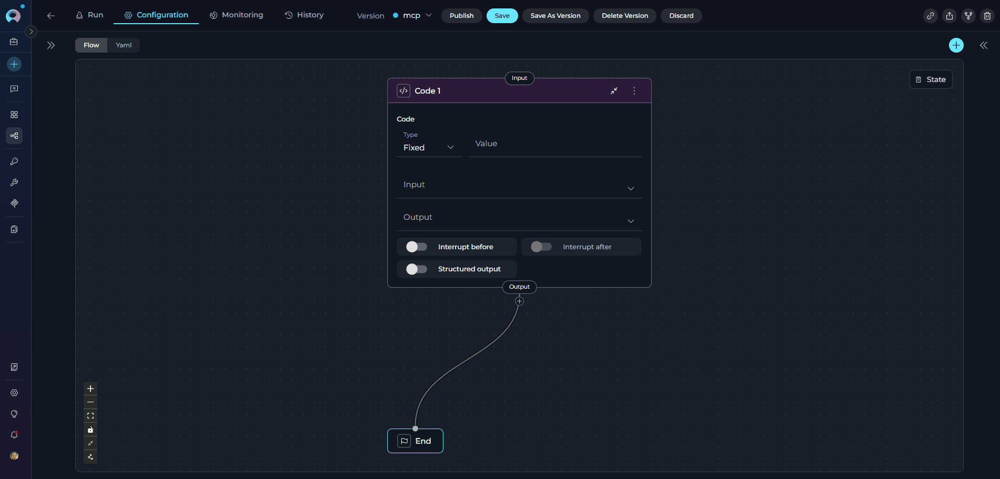
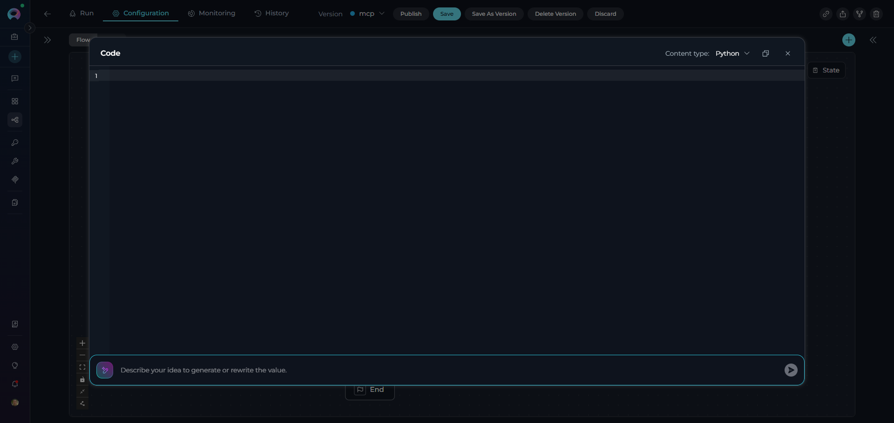
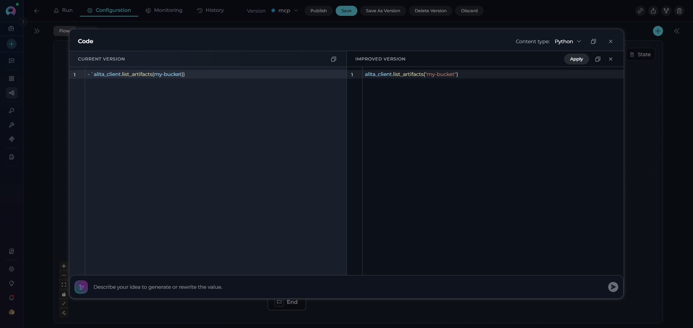
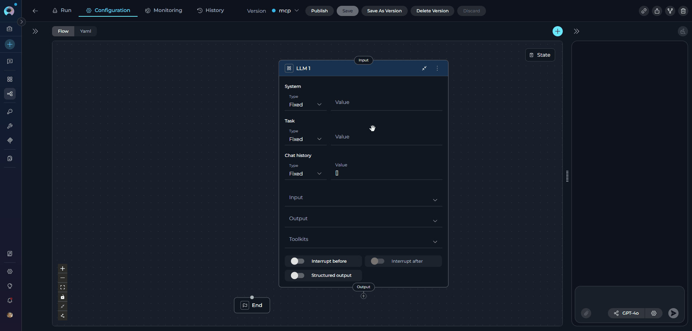
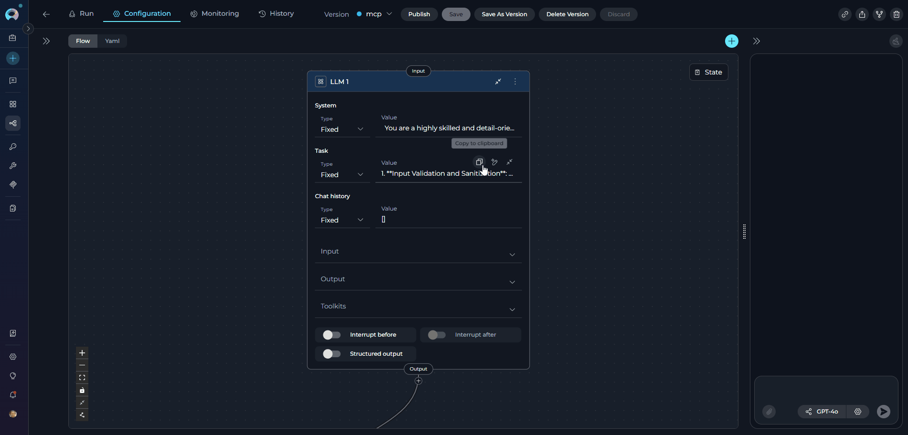

# AI Assistant in Pipeline Nodes

The AI Assistant feature enhances pipeline node configuration by providing intelligent, AI-powered content generation for text fields. It helps you create, refine, and improve prompts, code, templates, conditions, and descriptions directly within the pipeline editor.

---

## What is AI Assistant?

AI Assistant is an integrated AI-powered tool that assists with content creation in pipeline nodes. Instead of manually writing complex prompts, code, or templates from scratch, you can:

* **Generate content** from natural language instructions
* **Improve existing content** by providing refinement prompts
* **Iterate quickly** with split-view comparison between original and improved versions
* **Leverage AI reasoning** to create better configurations

!!! info "LLM Configuration"
    AI Assistant uses the pipeline's configured LLM model and settings. Configure this at the pipeline level to control which model, Creativity, Max Completion Tokens and other parameters are used for content generation.

---

**Key Benefits**

✔️ **Faster Configuration** - Generate complex content quickly from simple instructions

✔️ **Higher Quality** - Leverage AI to improve prompts, code, and templates

✔️ **Iterative Refinement** - Compare original and improved versions side-by-side

✔️ **Context-Aware** - AI Assistant understands the node type and purpose

✔️ **Consistent Style** - Uses your pipeline's LLM configuration

---

## How AI Assistant Works

**Access AI Assistant**

AI Assistant is available on text input fields that support it. Look for the **AI Assistant icon** (🪄) on the right side of the field:

**Click the icon** to open the AI Assistant modal dialog.

**AI Assistant Modal**

The modal provides a full-screen editor with AI-powered content generation:

{loading=lazy}

**Modal Components:**

1. **Editor Area** - View and edit your content with syntax highlighting
2. **AI Prompt Input** - Natural language instructions for content generation
3. **Language Selector** - Choose syntax highlighting (auto-detected)
4. **Action Buttons** - Copy, apply, and close controls

**Single View Mode**

When you first open AI Assistant with empty content or request new content:

* **Editor** displays your current content (or empty state)
* **Prompt Input** accepts your instructions
* **Generate** creates content based on your prompt
* **Result** appears directly in the editor

{width="350" loading=lazy}


**Split View Mode**

When improving existing content:

* **Left Panel** - "Current Version" (read-only reference) 
* **Right Panel** - "Improved Version" (AI-generated result)
* **Compare** - See differences side-by-side
* **Apply** - Replace current content with improved version 
* **Close** - Discard improvements and return to single view

{width="350" loading=lazy}

---

## Supported Nodes and Fields

AI Assistant is available in the following pipeline nodes and their specific fields:

| Node Type | Supported Fields | Purpose | AI Assistant Usage |
|-----------|-----------------|---------|-------------------|
| **[LLM Node](#llm-node)** | System | System prompt defining LLM role and behavior | Generate system prompts for specialized agents |
| | Task | User task or query to process | Generate task descriptions and instructions |
| **[Code Node](#code-node)** | Code | Python code to execute in sandbox | Generate Python code, improve existing code, add error handling, optimize algorithms |
| **[State Modifier Node](#state-modifier-node)** | Jinja Template | Template for state transformation | Generate Jinja2 templates, create formatted output, build dynamic content |
| **[Router Node](#router-node)** | Condition | Jinja2 template for routing logic | Generate routing conditions, create complex branching logic, build pattern matching rules |
| **[Decision Node](#decision-node)** | Description | Context for LLM decision-making | Generate decision criteria, create routing descriptions, define decision logic |
| **[Printer Node](#printer-node)** | Printer | Output formatting template | Generate display templates, create formatted messages, build user-facing output |


---

### LLM Node

**Use Cases:**

* Generate comprehensive system prompts for specialized agents
* Create clear, structured task instructions
* Build example conversations for testing

!!! example "Generate System Prompt Example"

    **Prompt:** "Create a system prompt for an AI assistant that helps developers write unit tests"

    **Generated System Prompt:**
    ```
    You are an expert software testing assistant specializing in unit test creation. Your role is to:
    
    1. Analyze code snippets provided by developers
    2. Identify testable units and edge cases
    3. Generate comprehensive unit tests with clear assertions
    4. Follow best practices for the testing framework in use
    5. Explain your testing strategy and coverage decisions
    
    Provide tests that are:
    - Clear and maintainable
    - Cover happy paths and edge cases
    - Include meaningful test names and descriptions
    - Follow the AAA pattern (Arrange, Act, Assert)
    ```

---

### Code Node

**Use Cases:**

* Generate data transformation logic
* Create calculations and business rules
* Build API integration code
* Improve code quality and error handling

!!! example "Generate Tiered Discount Code"

    **Prompt:** "Write Python code to calculate tiered discounts: 10% for orders $100-500, 15% for $500-1000, 20% for $1000+"

    **Generated Code:**
    ```python
    def calculate_discount(order_value):
        """
        Calculate tiered discount based on order value.
        
        Args:
            order_value (float): Total order value
            
        Returns:
            dict: Discount percentage and final price
        """
        # Get order value from state
        order_value = float(alita_state.get('order_value', 0))
        
        # Determine discount tier
        if order_value >= 1000:
            discount_rate = 0.20
        elif order_value >= 500:
            discount_rate = 0.15
        elif order_value >= 100:
            discount_rate = 0.10
        else:
            discount_rate = 0.0
        
        # Calculate discount and final price
        discount_amount = order_value * discount_rate
        final_price = order_value - discount_amount
        
        return {
            "discount_rate": discount_rate,
            "discount_amount": round(discount_amount, 2),
            "final_price": round(final_price, 2)
        }
    
    # Execute and return results
    result = calculate_discount(order_value)
    return result
    ```

---

### State Modifier Node

**Use Cases:**

* Format output messages with state variables
* Build reports and summaries
* Build structured responses

!!! example "Generate User Story Template"

    **Prompt:** "Create a Jinja template that formats a user story with title, description, acceptance criteria, and metadata"

    **Generated Template:**
    ```jinja
    # User Story: {{ title }}
    
    ## Description
    {{ description }}
    
    ## Acceptance Criteria
    
    - {{ criterion }}
    
    
    ## Metadata
    - **Priority**: {{ priority }}
    - **Story Points**: {{ story_points }}
    - **Sprint**: {{ sprint }}
    - **Assignee**: {{ assignee }}
    
    ---
    *Created on {{ created_date }} by {{ author }}*
    ```

---

### Router Node

**Use Cases:**

* Create multi-path routing logic
* Build approval workflows
* Implement status-based routing

!!! example "Generate Router Condition"

    **Prompt:** "Create a router condition that routes to 'Approved' if status contains 'approved', 'Rejected' if 'rejected', 'Pending' if 'review', otherwise 'Default'"

    **Generated Condition:**
    ```jinja
    
    Approved
    
    Rejected
    
    Pending
    
    Default
    
    ```

---

### Decision Node

**Use Cases:**

* Describe decision criteria clearly
* Provide context for intelligent routing
* Document decision-making logic

!!! example "Generate Decision Description"

    **Prompt:** "Write a decision description for routing customer support tickets based on urgency and topic"

    **Generated Description:**
    ```
    Analyze the customer support ticket and route it to the appropriate team based on these criteria:
    
    **High Priority (Critical Issues):**
    - System outages or downtime
    - Security vulnerabilities
    - Payment processing failures
    - Data loss or corruption
    
    Route to: **CriticalSupport**
    
    **Billing & Payments:**
    - Invoice questions
    - Payment issues
    - Subscription changes
    - Refund requests
    
    Route to: **BillingTeam**
    
    **Technical Support:**
    - Feature questions
    - Integration issues
    - API problems
    - Bug reports
    
    Route to: **TechnicalSupport**
    
    **General Inquiries:**
    - Account questions
    - Feature requests
    - General questions
    
    Route to: **GeneralSupport**
    
    **Default:** Route to **GeneralSupport** if unsure
    ```

---

### Printer Node

**Use Cases:**

* Display static completion messages
* Show formatted output combining text with variables
* Pause pipeline for user inspection
* Show progress updates during multi-step workflows

??? example "Generate Processing Summary (Type: F-String)"

    Create a comprehensive processing summary that combines multiple variables and includes conditional formatting.

    **Prompt:** "Create a detailed processing summary message that shows the project name, total items processed, success count, failure count, success rate percentage, processing time, and a status indicator (✓ if success rate > 90%, ⚠ if 70-90%, ✗ if < 70%)"

    **Generated F-String:**
    ```
    ==========================================
    Processing Complete: {project_name}
    ==========================================
    
    Results:
      • Total Items: {total_items}
      • Successful: {success_count} ({success_rate}%)
      • Failed: {failed_count}
      • Processing Time: {processing_time}s
    
    Status: {status_indicator}
    
    {completion_message}
    ==========================================
    ```
    
    **Example Output:**
    ```
    ==========================================
    Processing Complete: Customer Analytics Dashboard
    ==========================================
    
    Results:
      • Total Items: 150
      • Successful: 142 (94.7%)
      • Failed: 8
      • Processing Time: 12.5s
    
    Status: ✓
    
    Processing completed successfully with high success rate.
    ==========================================
    ```

---

## Using AI Assistant: Step-by-Step

### 1. Generate New Content

**Scenario:** You need to create a system prompt for an LLM node but aren't sure how to structure it.

**Steps:**

1. **Open the LLM node** configuration
2. **Click the AI Assistant icon** (🪄) on the "Task" field
3. **Enter your instruction** in the AI Prompt Input:
   ```
   Create a system prompt for a code reviewer that focuses on security best practices
   ```
4. **Click "Generate"** or press Enter
5. **Review the generated content** in the editor and edit if needed
6. **Close the modal** - content is now in the System field

{loading=lazy}

### 2. Improve Existing Content

**Scenario:** You have a working prompt but want to make it more specific and detailed.

**Steps:**

1. **Open AI Assistant** on a field with existing content
2. **Review current version** in the editor
3. **Enter improvement instruction** in the AI Prompt Input:
   ```
   Make this prompt more specific for reviewing API security in REST endpoints
   ```
4. **Click "Generate"** - AI Assistant switches to split view
5. **Compare versions** side-by-side:
   * Left: Original content
   * Right: Improved content
6. **Click "Apply"** to use the improved version, or
7. **Click "Close"** (X) to discard and keep original

{loading=lazy}

### 3. Iterative Refinement

**Scenario:** The generated content is good but needs additional refinement.

**Steps:**

1. **Generate initial content** using AI Assistant
2. **Review the result** in split view
3. **Enter a refinement prompt** without applying:
   ```
   Add examples of common security vulnerabilities to look for
   ```
4. **Click "Generate"** again - improved content updates
5. **Continue refining** with additional prompts:
   ```
   Make the tone more conversational and encouraging
   ```
6. **Apply when satisfied** with the final result

### 4. Error Handling and Retry

**Scenario:** AI Assistant encountered an error during generation.

**What you'll see:**

* Error message displayed in the editor
* Prompt input remains filled with your instruction
* Split view (if previously shown) stays open

**Steps to retry:**

1. **Review the error message** (e.g., "Error: Rate limit exceeded")
2. **Your prompt is preserved** - no need to retype
3. **Click "Generate"** again to retry
4. **AI Assistant retries** with the same prompt
5. **Previous error is cleared** if successful

---

## Common Use Cases

??? example "Generate System Prompts for Specialized Agents"

    **Challenge:** Creating effective system prompts that properly constrain LLM behavior.

    **Solution with AI Assistant:**

    ```
    Prompt: "Create a system prompt for an AI assistant that generates SQL queries from natural language. It should only output valid SQL, never execute queries, and explain any assumptions."

    Result: Detailed system prompt with role definition, constraints, output format, and safety guidelines.
    ```

??? example "Build Complex Routing Logic"

    **Challenge:** Creating multi-condition routing in Router nodes.

    **Solution with AI Assistant:**

    ```
    Prompt: "Create router condition for approvals: route to 'AutoApprove' if amount < 1000, 'ManagerApproval' if 1000-10000, 'ExecutiveApproval' if >10000, default to 'ReviewQueue'"

    Result: Properly structured Jinja2 condition with numeric comparisons and fallback.
    ```

??? example "Create Data Transformation Code"

    **Challenge:** Writing Python code for state transformations.

    **Solution with AI Assistant:**

    ```
    Prompt: "Write Python code that takes a list of user dictionaries and creates a summary with total users, breakdown by role, and list of admin emails"

    Result: Working Python code with error handling, state access, and structured output.
    ```

??? example "Format Output Templates"

    **Challenge:** Creating readable, well-formatted output displays.

    **Solution with AI Assistant:**

    ```
    Prompt: "Create a Jinja template for a daily report showing completed tasks, pending tasks, overdue tasks, and team member performance"

    Result: Professional template with formatting, conditionals, and loops.
    ```

---

## Best Practices

??? example "Writing Effective Prompts"

    ✔️ **Be Specific**

    * ✘ "Write a prompt"
    * ✔️ "Write a system prompt for an AI assistant that reviews Python code for PEP 8 compliance"

    ✔️ **Provide Context**

    * ✘ "Generate code"
    * ✔️ "Generate Python code that reads CSV files, filters rows where status='active', and returns a list of user IDs"

    ✔️ **Include Examples**

    * ✘ "Create a template"
    * ✔️ "Create a Jinja template that displays user information in this format: 'Name: John Doe, Email: john@example.com, Role: Admin'"

    ✔️ **Specify Format Requirements**

    * ✘ "Make routing logic"
    * ✔️ "Create router condition using Jinja2 syntax that routes based on 'priority' field: high→Urgent, medium→Normal, low→Backlog"

??? example "Iterative Improvement"

     **Start Simple, Refine**

    1. Generate basic content first
    2. Review what AI created
    3. Add refinement prompts incrementally
    4. Apply when satisfied

     **Use Split View Effectively**

    * Keep original on left as reference
    * Compare specific changes in improved version
    * Apply only when improvements are clear
    * Close split view to start over if needed

??? example "Content Validation"

    ✓ **Always Review Generated Content**

    * AI Assistant is powerful but not perfect
    * Verify logic, syntax, and requirements
    * Test generated code in safe environment
    * Validate templates with sample data

    ✓ **Understand Generated Code**

    * Don't blindly apply code you don't understand
    * Review variable names and logic flow
    * Ensure error handling is appropriate
    * Check for security considerations

??? example "Performance Tips"

     **Use Appropriate Field Types**

    * Use AI Assistant for complex, creative tasks
    * For simple static values, type directly
    * Reserve AI for prompts, code, templates

     **Leverage Pipeline LLM Configuration**

    * AI Assistant uses your pipeline's LLM settings
    * Configure appropriate model for your needs
    * Adjust temperature for creativity vs. consistency

---


## Troubleshooting

??? warning "AI Assistant Not Appearing"

    **Issue:** AI Assistant icon not visible on a field.
    
    **Possible Causes:**
    
    * Field doesn't support AI Assistant
    * Pipeline LLM configuration is missing
    * Node type doesn't enable AI Assistant
    
    **Solution:**
    
    1. Verify the field supports AI Assistant (see [Supported Nodes](#supported-nodes-and-fields))
    2. Check pipeline configuration → Ensure LLM model is configured
    3. Verify you're using a supported node type

??? warning "Generated Content Not Applied"

    **Issue:** Clicking "Save" doesn't update the node field.
    
    **Possible Causes:**
    
    * Modal closed without saving
    * Content validation failed
    * Browser cached old value
    
    **Solution:**
    
    1. Re-open AI Assistant modal
    2. Verify content is still in editor
    3. Click "Save" button explicitly
    4. Check node field updates after closing modal

??? warning "Generation Fails with Error"

    **Issue:** AI Assistant displays error message instead of content.
    
    **Common Errors:**
    
    * "Rate limit exceeded" - Too many requests to LLM
    * "Invalid API key" - LLM credentials issue
    * "Timeout" - Request took too long
    
    **Solution:**
    
    1. Wait a moment and click "Generate" again (prompt preserved)
    2. Simplify your prompt if too complex
    3. Check pipeline LLM configuration and credentials
    4. Contact administrator if persistent API errors

??? warning "Split View Not Showing"

    **Issue:** Expected split view comparison but seeing single view.
    
    **Possible Causes:**
    
    * Current content is empty
    * Current content starts with "Error"
    * First-time generation
    
    **Expected Behavior:**
    
    * **Empty content + Generate** → Single view (new content)
    * **Existing content + Generate** → Split view (comparison)
    * **Error content + Generate** → Single view (retry)

---

## Related Documentation

* **[LLM Node](nodes/interaction-nodes.md#llm-node)** - Configure LLM nodes with AI Assistant
* **[Code Node](nodes/execution-nodes.md#code-node)** - Write Python code with AI help
* **[State Modifier Node](nodes/utility-nodes.md#state-modifier-node)** - Create Jinja templates
* **[Router Node](nodes/control-flow-nodes.md#router-node)** - Build routing conditions
* **[Decision Node](nodes/control-flow-nodes.md#decision-node)** - Write decision descriptions
* **[Pipeline Configuration](overview.md)** - Configure pipeline LLM settings
* **[States](states.md)** - Understanding pipeline state for AI-generated code

---
