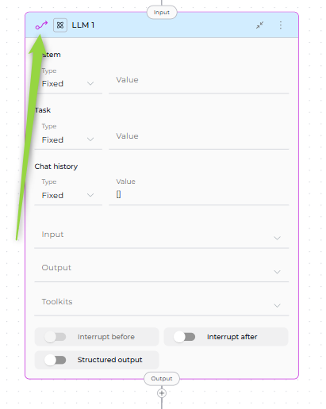

# Pipeline Entry Point

The Entry Point is the first node that executes when your pipeline runs. Every pipeline must have exactly one entry point.

!!! warning "Required Configuration"
    Every pipeline must have an entry point. Without one, the pipeline cannot execute.

---

## What is an Entry Point?

The Entry Point defines which node executes first when your pipeline runs—the "starting line" of your workflow.

### Key Rules

**Single Entry Point:**

* Exactly one node must be designated as the entry point
* Pipeline execution always begins at this node

**Node Eligibility:**

* ✅ **Can be entry points**: LLM, Agent, Function, Tool, Code, Custom, Loop, Loop from Tool, State Modifier, Pipeline (Subgraph), Decision
* ❌ **Cannot be entry points**: Router and Condition nodes

!!! info "Why Router and Condition Can't Be Entry Points"
    Router and Condition nodes require input data to evaluate their conditions. At pipeline start, no state variables have been populated yet, so these nodes have nothing to evaluate.

---

## Setting an Entry Point

### Visual Method (Flow Editor)


**Steps:**

1. Open your pipeline in the Flow Editor
2. Click the three dots (⋮) on the node card
3. Select **Make entrypoint** from the dropdown


After making a node the entry point, an **Input** icon appears at the top of the node card, indicating it's the pipeline's starting point.



!!! tip "Changing Entry Points"
    Setting a new entry point automatically removes the previous designation.

### YAML Method

In YAML configuration, define the entry point at the top level:

```yaml
entry_point: node_id

nodes:
  - id: node_id
    type: llm
    # ... node configuration
```

**Valid Example:**

```yaml
entry_point: greeting

nodes:
  - id: greeting
    type: llm
```

**Invalid Examples:**

```yaml
# ❌ Non-existent node
entry_point: missing_node

# ❌ Router as entry point
entry_point: route_decision
nodes:
  - id: route_decision
    type: router
```

---

## Best Practices

### Match Entry Point to Workflow Type

* **Conversational**: Start with LLM node
* **Automated**: Start with Function/Tool node
* **Routing**: Start with Decision node
* **Batch**: Start with Loop/Loop from Tool node
* **Modular**: Start with Pipeline (Subgraph) node


!!! tip "Essential Checks"
    - Ensure `entry_point` value exactly matches a node `id`
    - Avoid Router/Condition nodes as entry points
    - Test that entry point node executes first
    - Confirm transition to next node works

---
!!! info "Related Documentation"
    - **[Node Connectors](nodes-connectors.md)** - Connect nodes to create workflows
    - **[State Management](states.md)** - Understand state in pipelines
    - **[Flow Editor](flow-editor.md)** - Visual pipeline building
    - **[Control Flow Nodes](nodes/control-flow-nodes.md)** - Router, Condition, and Decision nodes
    - **[YAML Configuration](yaml.md)** - Complete YAML syntax reference
