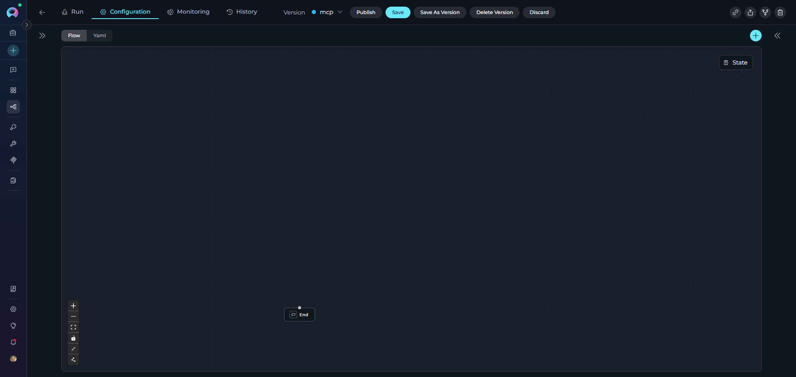
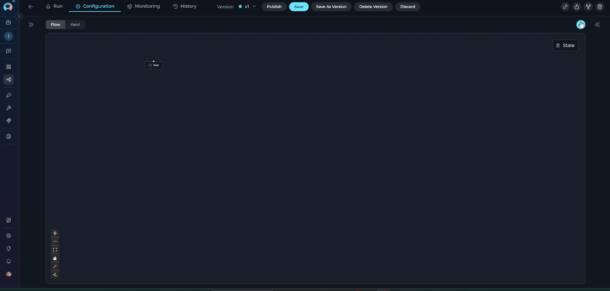
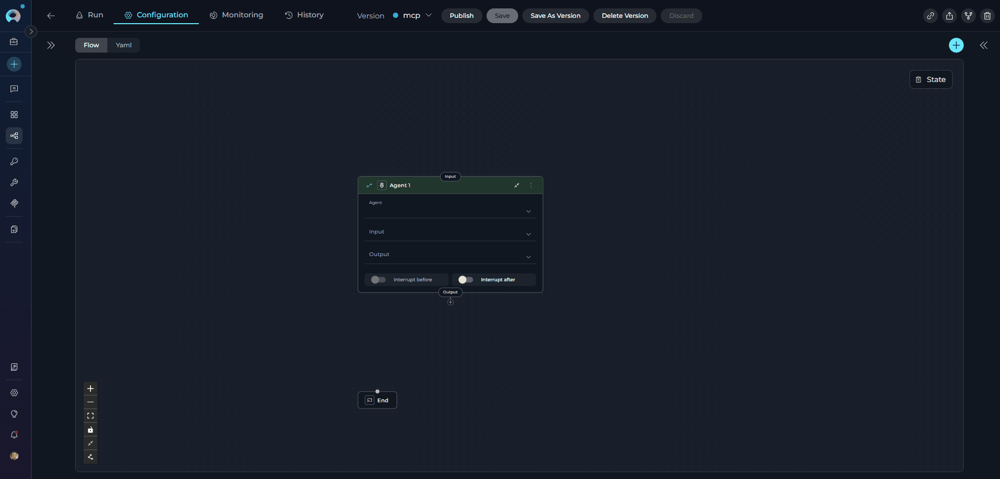
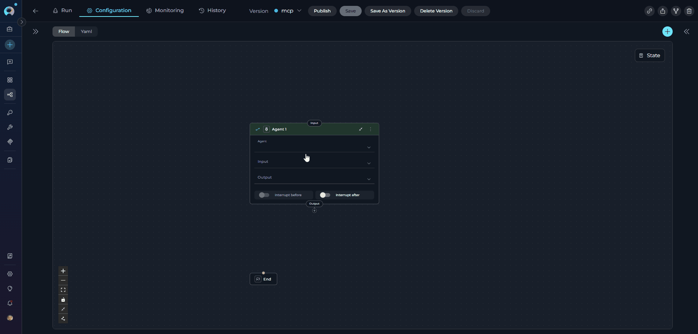
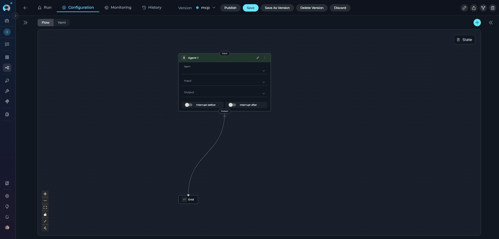
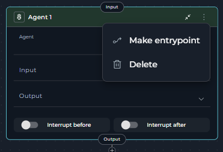
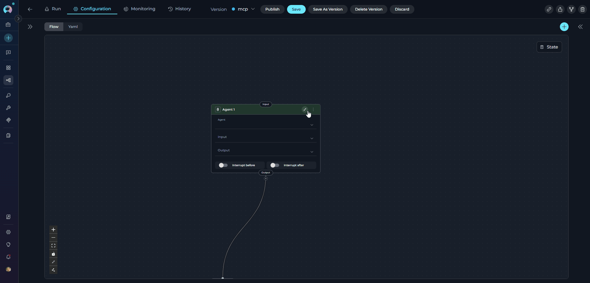
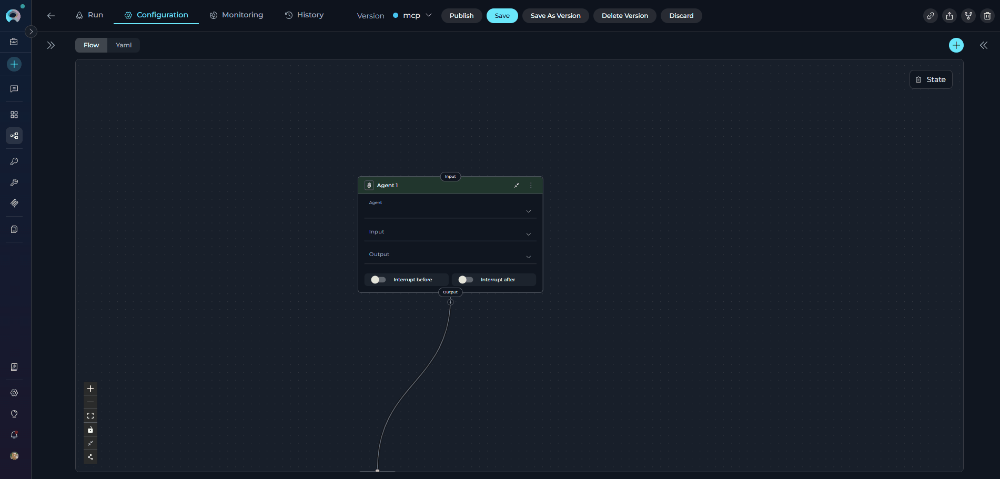
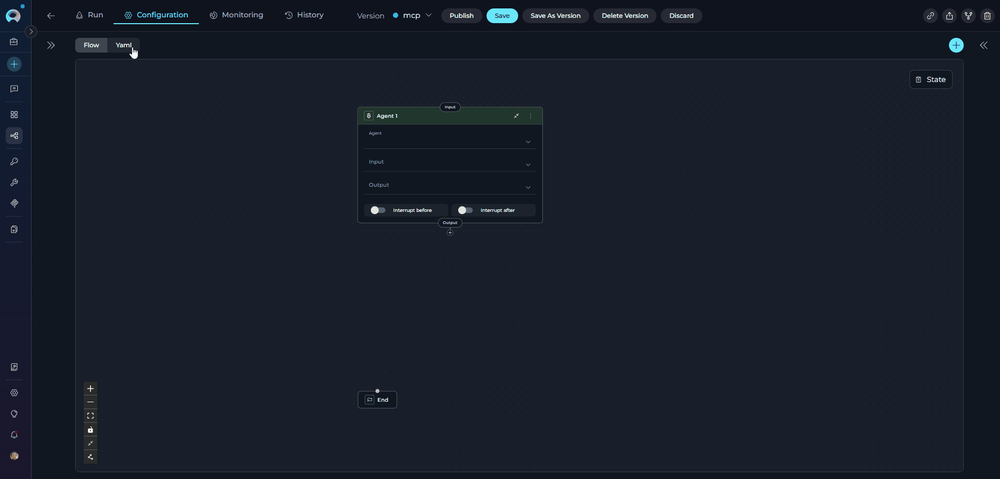

# Flow Editor

The Flow Editor is ELITEA's visual pipeline builder that lets you design, configure, and manage pipelines without writing code. Create complex workflows by dragging nodes onto the canvas, connecting them, and configuring their properties—all through an intuitive graphical interface.

---

## What is Flow Editor?

The **Flow Editor** is a visual workspace for building pipelines. It provides:

* **Drag-and-drop interface** for adding and arranging nodes
* **Visual connections** between nodes showing execution flow
* **Vertical layout** optimized for easy configuration
* **Instant YAML sync** - changes in Flow appear immediately in YAML (and vice versa)
* **Interactive configuration** - click nodes to configure their settings

---

## Accessing Flow Editor

1. Navigate to **Pipelines** menu
2. Open an existing pipeline or create a new one
3. Click the **Configuration** tab
4. Select **Flow** mode (appears alongside **YAML** tab)

!!! note "Flow and YAML Sync"
    Whatever you configure in Flow automatically appears in YAML format, and vice versa. Both views stay perfectly synchronized.

---

## Flow Editor Interface

The Flow Editor consists of several key areas:

### Main Components

| # | Component | Location | Purpose |
|---|-----------|----------|---------|
| 1 | **Canvas** | Center | Main workspace for arranging nodes |
| 2 | **Toolbar** | Left side | Tools for canvas control (zoom, layout, etc.) |
| 3 | **Add Node Button** | Top right (➕) | Opens node palette to add new nodes |
| 4 | **State Button** | Top right | Opens state configuration sidebar |
| 5 | **Flow/YAML Tabs** | Top center | Switch between visual and code views |

{loading=lazy}

### Left Toolbar Buttons

| Icon | Action | Keyboard Shortcut |
|------|--------|------------------|
| **➕** | Add new node | - |
| **➖** | Zoom out | - |
| **⛶** | Fit view (auto-center) | - |
| **🔒** | Lock/Unlock editing | - |
| **⬜** | Collapse/Expand all cards | - |
| **🔧** | Auto-fix layout | - |

---

## Adding Nodes

### Method 1: Add Node Button

1. Click the **➕** button (top right corner)
2. A node palette appears showing all available node types
3. Select the node type you want to add
4. Node appears on the canvas

**Available Node Types:**

* Agent
* Code
* Custom
* Decision
* LLM
* MCP
* Printer
* Router
* State modifier
* Toolkit

{loading=lazy}

### Method 2: Drag from Connection

You can also add nodes while creating connections:

1. Drag a connector from an existing node
2. Release it in empty space on the canvas
3. Select **Create New Node** from the dropdown
4. Choose node type
5. New node is created with connection already attached

{loading=lazy}

---

## Configuring Nodes

Click on any node card to open its configuration panel:

### Node Configuration Options

Each node type has specific configuration fields. Common options include:

* **Node Name** (click card title to rename)
* **Input/Output** state variables
* **Node-specific settings** (prompts, toolkits, conditions, etc.)
* **Advanced options** (Interrupt Before/After, Structured Output)

!!! tip "Renaming Nodes"
    Click on the node card title to rename most nodes. **Decision** nodes cannot be renamed.

### Renaming a Node

1. Click the **node card title**
2. Type the new name
3. Press **Enter** or click outside to save

{loading=lazy}

---

## Connecting Nodes

Nodes must be connected to define the execution flow. See the [Nodes Connectors Guide](nodes-connectors.md) for complete details.

### Creating Connections

**Method 1: Drag and Drop**

1. Click and hold the **output port** (bottom of node card)
2. Drag the connector line to the **input port** (top of target node)
3. Release to create the connection

**Method 2: Drop on Canvas**

1. Drag connector from a node
2. Release in empty canvas space
3. Select existing node or create new node from dropdown
4. Connection auto-completes

### Deleting Connections

 Click on the connection line to select it, then press **Delete** on keyboard

{loading=lazy}

---

## Managing Nodes

### Node Card Actions

Click the **three-dots menu (⋮)** on any node card to access node actions:

{loading=lazy}

**Available Actions:**

| Action | Description |
|--------|-------------|
| **Make entrypoint** | Set this node as the pipeline entry point |
| **Delete** | Remove the node from the pipeline |

!!! warning "Deleting Nodes"
    Deleting a node also removes all its connections. Make sure to reconnect remaining nodes after deletion.

### Moving Nodes

Rearrange nodes to improve visual clarity:

1. Click on a node card
2. Drag it to a new position on the canvas
3. Release to place

!!! tip "Vertical Layout"
    The Flow Editor uses a **vertical (top-to-bottom) layout** for optimal readability. Nodes execute from top to bottom following the connections.

---

## Canvas Controls

### Collapse/Expand Cards

Toggle between compact and detailed node views:

* **Collapsed**: Shows only node name and type icon
* **Expanded**: Shows all configuration fields

{loading=lazy}

Click the **State** button (top right) to open the state configuration sidebar.

{loading=lazy}

**In the State Sidebar:**

* View all pipeline state variables
* Add new custom states
* Configure default values
* Set state data types (String, Number, Array, Object)

See the [States Guide](states.md) for complete state configuration details.

---

## Flow to YAML Synchronization

Changes made in Flow Editor **instantly appear in YAML**:

1. Add/modify nodes in Flow
2. Switch to **YAML** tab
3. See the updated YAML code
4. Switch back to **Flow** to continue visual editing

{loading=lazy}

!!! note "Two-Way Sync"
    Edits in YAML also update the Flow view immediately. You can work in whichever mode you prefer.

---

## Best Practices

* **Use Descriptive Node Names**: "Validate User Input" instead of "LLM Node"
* **Organize Vertically**: Entry point at top, processing in middle, END at bottom
* **Collapse Side Panels**: Maximize canvas space for complex pipelines
* **Use Auto-Fix Layout**: Maintain clean alignment after adding/moving nodes
* **Test Incrementally**: Build step-by-step, test after adding each node
* **Save Frequently**: Prevent data loss by saving often
---

## Keyboard Shortcuts

| Action | Shortcut |
|--------|----------|
| Delete selected node/connection | **Delete** or **Backspace** |
| Save pipeline | **Ctrl/Cmd + S** |
| Undo | **Ctrl/Cmd + Z** |
| Redo | **Ctrl/Cmd + Shift + Z** |

---

## Troubleshooting

### Nodes Not Connecting

**Problem**: Cannot create connection between nodes.

**Solutions**:

* Check if nodes are compatible (e.g., Router requires specific output nodes)
* Verify you're dragging from output port (bottom) to input port (top)
* Try **Auto-fix Layout** if nodes are overlapping

### Canvas is Blank

**Problem**: Flow Editor shows empty canvas.

**Solutions**:

* Switch to **YAML** tab to check if pipeline has nodes
* Click **Fit View** to center nodes
* Refresh the page

### Changes Not Saving

**Problem**: Edits disappear after closing pipeline.

**Solutions**:

* Click **Save** button before navigating away
* Check for error messages at top of screen
* Verify network connection

### Node Configuration Not Opening

**Problem**: Clicking node doesn't show configuration panel.

**Solutions**:

* Click directly on the node card (not the connection lines)
* Unlock editing if canvas is locked (🔒 button)
* Expand the **GENERAL** section if collapsed

---

!!! info "Related Documentation"
    * **[Nodes Connectors](nodes-connectors.md)**: Learn how to connect nodes and manage transitions
    * **[States Guide](states.md)**: Configure state variables for data flow
    * **[YAML Configuration](yaml.md)**: Work directly with YAML code
    * **[Nodes Overview](nodes/overview.md)**: Understand all 10 node types
    * **[Entry Point Guide](entry-point.md)**: Set up pipeline starting points

---
