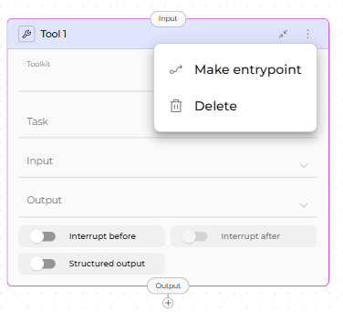
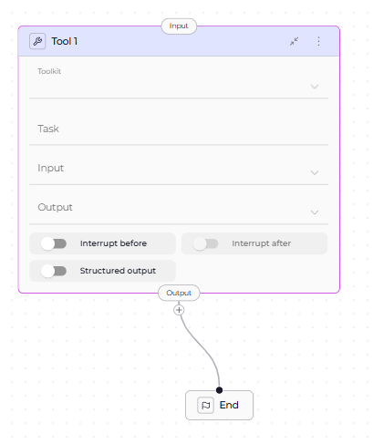
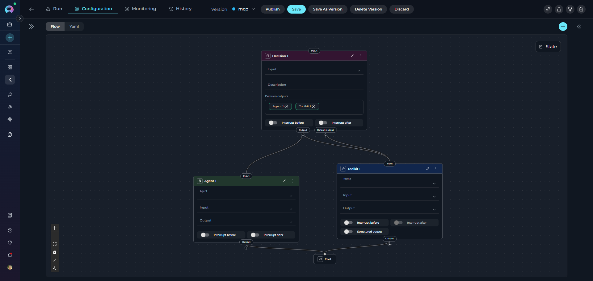
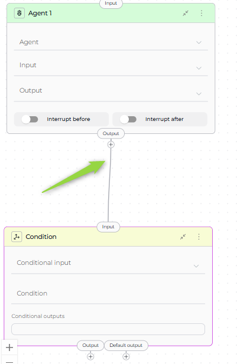
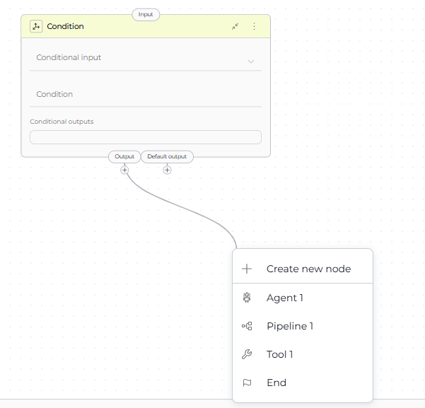
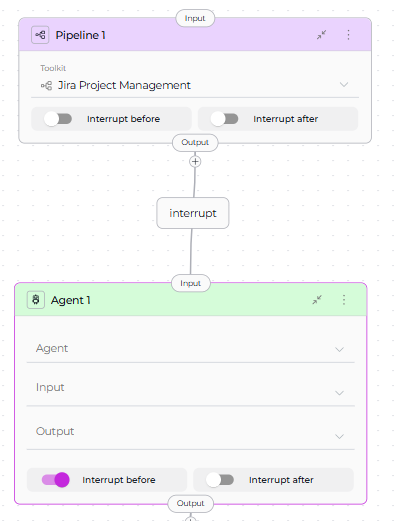
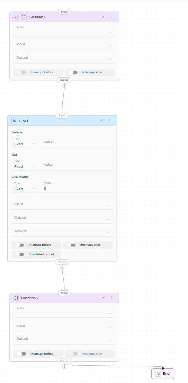

# Node Connectors

Node connectors link nodes together to define your pipeline's execution flow. They determine which node runs next, how data flows between nodes, and when the pipeline completes.

**Key Concepts:**

* **[Entry Point](#entry-point-node)** - Where pipeline execution begins
* **[Transitions](#yaml-connection-syntax)** - Connections between nodes
* **[END Node](#end-node)** - Where pipeline execution stops
* **[Connection Patterns](#connection-patterns)** - Common workflow structures

!!! note "Essential Elements"
    Every pipeline requires: (1) Entry Point to start execution, (2) Transitions to connect nodes, (3) END to terminate execution

---

## Entry Point Node

The Entry Point is the first node that executes when your pipeline runs. Every pipeline must have exactly one entry point.

### Setting an Entry Point

**Visual Method:**

1. Open your pipeline in Flow Editor
2. Click the three-dots menu (⋮) on the node
3. Select **Make entrypoint**


**YAML Method:**

```yaml
entry_point: Tool 1
```

!!! warning "Entry Point Rules"
    - Only **one node** can be the entry point
    - **Router** and **Condition** nodes **cannot** be entry points (they require input from previous nodes)
    - All other node types can serve as entry points
    - Entry point must be set before running the pipeline

!!! tip "Changing Entry Points"
    Making a different node the entry point automatically removes the previous entry point designation.

**See Also:** [Entry Point Guide](entry-point.md) for detailed configuration

---

## END Node

The END node terminates pipeline execution. It's not a physical node but a special target for connections.

### When to Use END

Use `END` as the connection target when:

* Pipeline has completed all work
* No further processing is needed
* You want to explicitly stop execution

### How to Connect to END

**Visual Method:**

1. Drag a connector from a node
2. Release in the canvas
3. Select **END** from the dropdown

**YAML Method:**

```yaml
transition: END
```

!!! note "Complete Execution Paths"
    Every execution path must eventually reach END. Paths without termination may cause unexpected behavior.



---

## Node Input and Output Ports

All nodes have **input** and **output** ports for connectors:

| Port Type | Purpose | Visual Indicator |
|-----------|---------|------------------|
| **Input** | Receives data/control from previous nodes | Top of node card |
| **Output** | Sends data/control to next nodes | Bottom of node card |
| **Default Output** | Fallback path (Router, Condition, Decision only) | Labeled separately |

---

## Connection Rules by Node Type

### Standard Nodes (Single Output)

Most nodes can have **only ONE output connection**:

* LLM
* Agent
* Function
* Tool
* Code
* Loop
* Loop from Tool
* State Modifier
* Pipeline (Subgraph)
* Decision

**YAML Example:**

```yaml
- id: Process Data
  type: function
  transition: Display Results
```

### Multi-Output Nodes

Three node types support **multiple outputs**:

#### 1. Router Node

Routes execution based on conditional logic. Can have:

* **Multiple conditional outputs**: One for each defined route
* **Default output**: Fallback when no conditions match

**YAML Example:**

```yaml
- id: Route Request
  type: router
  condition: "{{ request_type }}"
  routes:
    - when: "{{ request_type == 'urgent' }}"
      transition: Priority Handler
    - when: "{{ request_type == 'standard' }}"
      transition: Standard Handler
  default: Error Handler  # Default output
```


#### 2. Condition Node

Boolean evaluation with two outputs:

* **True output**: When condition evaluates to true
* **False output**: When condition evaluates to false

**YAML Example:**

```yaml
- id: Check Approval
  type: condition
  condition: "{{ status == 'approved' }}"
  transitions:
    true: Publish Story
    false: Request Changes
```


#### 3. Decision Node

LLM-powered routing to multiple destinations.

**YAML Example:**

```yaml
- id: Classify Intent
  type: decision
  description: "Analyze user intent and route appropriately"
  decision:
    nodes:
      - Bug Report Handler
      - Feature Request Handler
      - Question Handler
```


### Multiple Inputs

All nodes can accept **multiple input connections**, allowing:

* Convergence of different execution paths
* Merging results from parallel branches
* Reusing nodes in different contexts

**Example:**

```yaml
- id: Generate Report
  type: function
  # Can receive input from multiple nodes
  transition: Email Results

# Both paths lead to same node:
- id: Process Type A
  transition: Generate Report

- id: Process Type B
  transition: Generate Report
```



---

## YAML Connection Syntax

### Basic Transition

Connect one node to another:

```yaml
transition: <node_id>
```

**Example:**

```yaml
- id: Fetch Data
  type: function
  transition: Process Data  # Next node ID
```

### Conditional Transitions (Router)

Multiple routes with default fallback:

```yaml
condition: "{{ variable }}"
routes:
  - when: "{{ condition_1 }}"
    transition: Node A
  - when: "{{ condition_2 }}"
    transition: Node B
default: Default Node  # Optional fallback
```

### Boolean Transitions (Condition)

True/false paths:

```yaml
condition: "{{ expression }}"
transitions:
  true: Success Node
  false: Failure Node
```

### Decision-Based Transitions

LLM chooses from options:

```yaml
decision:
  nodes:
    - Option 1 Node
    - Option 2 Node
    - Option 3 Node
```

### Terminate Pipeline

```yaml
transition: END
```

---

## Creating Connections Visually

ELITEA provides multiple ways to create connections in Flow mode:

### Method 1: Drag from Node

1. Click and drag the **output port** (bottom of node)
2. Drag the connector line across the canvas
3. Release on the **input port** (top of target node)



**Method 2: Dropdown Menu**

1. Drag connector from output port
2. Release in empty canvas area
3. Select from dropdown:
   - **Existing nodes** - Connect to available node
   - **Create New Node** - Add and connect new node
   - **END** - Terminate pipeline



---

## Interrupt Options

**Interrupt Before** and **Interrupt After** are advanced options that pause pipeline execution for human review or intervention.

### Interrupt Before

Pauses **before** a node runs. Useful for:

* Reviewing inputs before critical operations
* Confirming decisions before irreversible actions
* Manual data validation

**YAML:**

```yaml
interrupt_before:
  - Node Name
```

**Visual:** Toggle **Interrupt Before** in node's Advanced settings


### Interrupt After

Pauses execution **after a node completes**. Useful for:

- Reviewing outputs before proceeding
- Verifying LLM results
- Allowing human feedback

**YAML Syntax:**

```yaml
interrupt_after:
  - Node Name
```

**Visual:** Toggle **Interrupt After** in node's Advanced settings

!!! warning "Interrupt Limitations"
    - Only works in **interactive mode** (Chat interface)
    - Programmatic/API executions may ignore interrupts
    - Use sparingly to avoid breaking automated workflows

---

## Connection Patterns

### Linear Flow

Sequential execution through nodes.

```yaml
entry_point: Step 1
nodes:
  - id: Step 1
    type: function
    transition: Step 2

  - id: Step 2
    type: llm
    transition: Step 3

  - id: Step 3
    type: function
    transition: END
```



### Conditional Branching

Route based on true/false condition.

```yaml
entry_point: Check Status
nodes:
  - id: Check Status
    type: condition
    condition: "{{ approved }}"
    transitions:
      true: Publish
      false: Request Changes

  - id: Publish
    type: function
    transition: END

  - id: Request Changes
    type: llm
    transition: END
```

### Multi-Path Routing

Multiple branches based on complex logic.

```yaml
entry_point: Classify Request
nodes:
  - id: Classify Request
    type: router
    condition: "{{ request_type }}"
    routes:
      - Bug Handler
      - Feature Handler
      - Question Handler
    default_output: General Handler
```

### Converging Paths

Multiple branches merge into single node.

```yaml
entry_point: Route Input
nodes:
  - id: Route Input
    type: decision
    decision:
      nodes:
        - Process Type A
        - Process Type B

  - id: Process Type A
    type: function
    transition: Generate Report

  - id: Process Type B
    type: function
    transition: Generate Report

  - id: Generate Report
    type: function
    transition: END
```

## Best Practices

### Essential Rules

!!! warning "Required Elements"
    - **Set Entry Point**: Pipeline won't run without one
    - **All Paths to END**: Every branch must terminate
    - **Avoid Infinite Loops**: Ensure loops eventually reach END

### Connection Guidelines

- **Use Descriptive Names**: `Validate User Input` instead of `Node1`
- **Add Default Routes**: Provide fallback for Router nodes
- **Test Incrementally**: Build and test step-by-step
- **Limit Nesting**: Keep pipeline structure clear and maintainable

**Good Example:**

```yaml
entry_point: Validate User Input
nodes:
  - id: Validate User Input
    type: function
    transition: Process Valid Data

  - id: Process Valid Data
    type: llm
    transition: END
```

**Bad Example:**

```yaml
# Missing entry_point
nodes:
  - id: Node1
    transition: Node2

  - id: Node2
    # Missing transition - pipeline hangs
```

---

## Related

!!! tip "Related Documentation"
    - **[Entry Point Guide](entry-point.md)** - Detailed entry point configuration
    - **[State Management](states.md)** - Data flow between nodes
    - **[Control Flow Nodes](nodes/control-flow-nodes.md)** - Router, Condition, and Decision nodes
    - **[Flow Editor](flow-editor.md)** - Visual pipeline design
    - **[YAML Configuration](yaml.md)** - Complete YAML syntax reference
