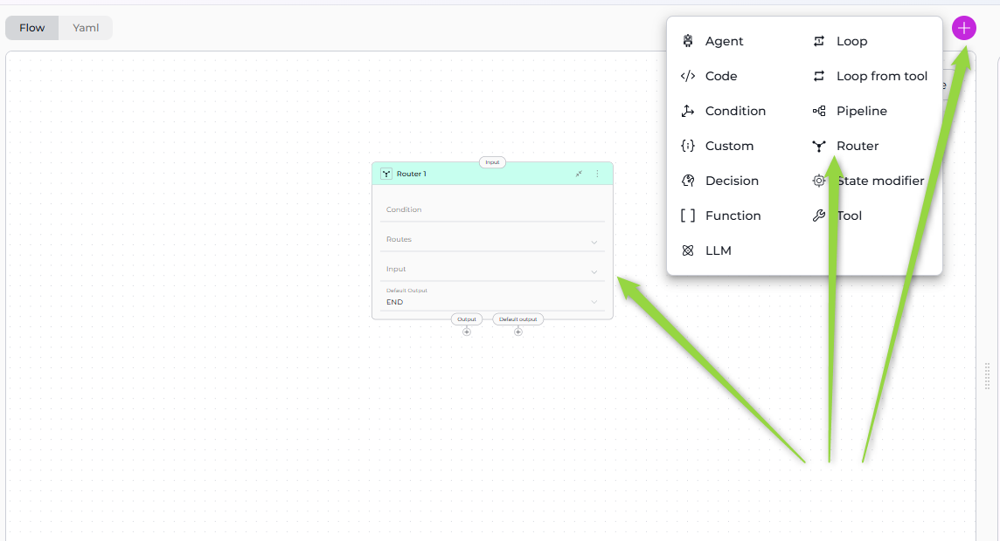
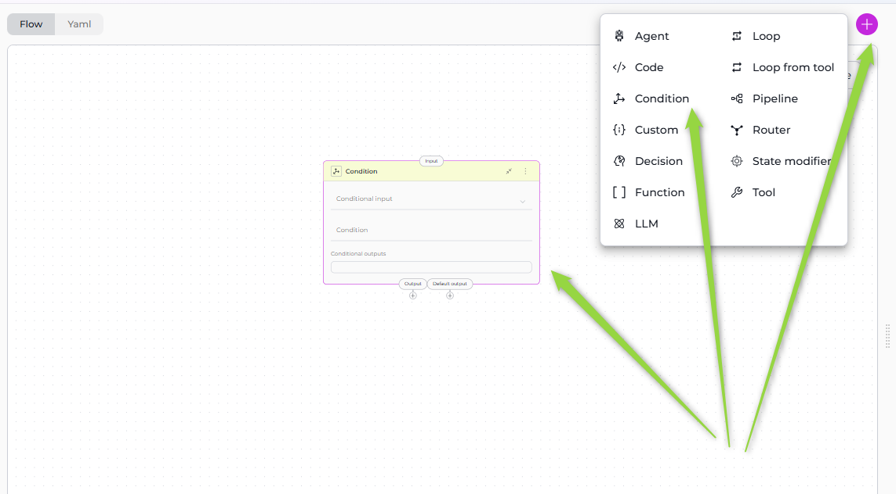
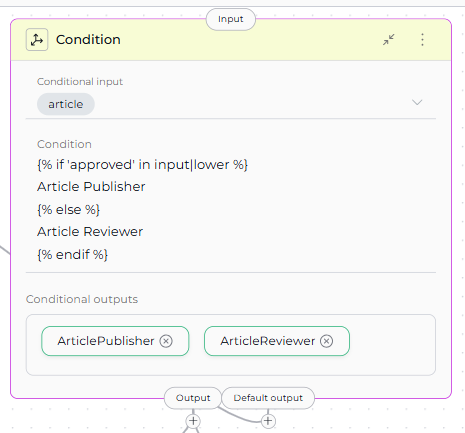
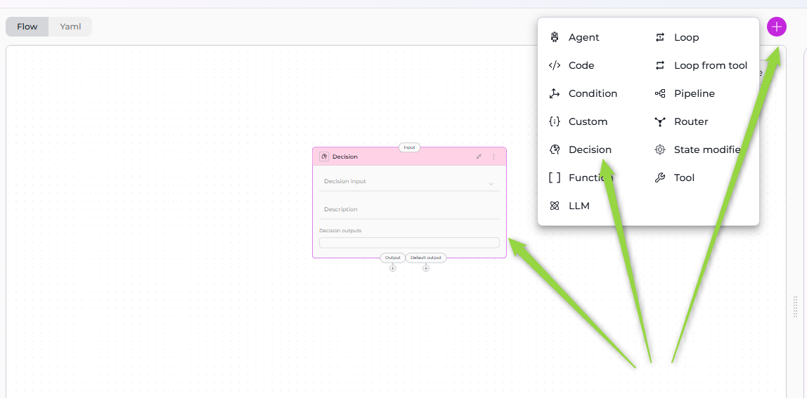

# Control Flow Nodes

Control Flow Nodes enable your pipeline to make decisions, route execution down different paths, and implement conditional logic. These nodes form the "decision-making" layer of your workflow, allowing pipelines to adapt behavior based on data, conditions, and intelligent reasoning.

**Available Control Flow Nodes:**

- **[Router Node](#router-node)** - Route execution based on condition matching with multiple named paths
- **[Condition Node](#condition-node)** - Branch execution based on conditional logic with named outputs
- **[Decision Node](#decision-node)** - LLM-powered intelligent routing based on natural language criteria

---

## Router Node

The Router Node evaluates a condition and routes pipeline execution to one of multiple named paths. It uses template-based conditions (similar to Jinja2 syntax) to determine which route to take, with a default fallback route if no conditions match.



### Purpose

Use the Router Node to:

- **Route execution** to different paths based on state variable values
- **Implement branching logic** with multiple named routes
- **Evaluate complex conditions** using template syntax
- **Provide fallback behavior** with default output
- **Create multi-path workflows** based on data conditions

### Parameters

| Parameter | Purpose | Type Options & Examples |
|-----------|---------|-------------------------|
| **Condition** | Define the conditional logic that determines which route to take | **Syntax:** Template syntax (Jinja2-like)<br>**Operators:**<br>`` - Start conditional block<br>`` - Alternative condition<br>`` - Fallback condition<br>`` - End conditional block<br><br>**State Variables:** Use variable names directly (e.g., `input`, `status`, `user_type`)<br>**Filters:** `\|lower`, `\|upper`, `in` operator for substring matching<br><br>**Example:**<br><br>ArticlePublisher<br><br>END<br><br> |
| **Routes** | Define the named paths (node IDs) that the router can select | **Configuration:** List of node IDs that correspond to the route names returned by the condition<br><br>**Example:**<br>`- ArticlePublisher`<br>`- END`<br><br>**Important:** Route names in the condition must **exactly match** node IDs in the Routes list |
| **Input** | Specify which state variables the Router node reads for condition evaluation | **Default states:** `input`, `messages`<br>**Custom states:** Any defined state variables<br><br>**Example:**<br>`- input`<br>`- status`<br>`- user_type` |
| **Default Output** | Specify the fallback route if no conditions in the Router match | **Options:** Select a node ID from available nodes in the pipeline<br><br>**Example:** `ArticleReviewer`<br><br>**Fallback Behavior:** If the condition doesn't return any route name, execution goes to Default Output |


**YAML Configuration**

```yaml
nodes:
  - id: Router 1
    type: router
    default_output: ArticleReviewer
    routes:
      - ArticlePublisher
      - END
    input:
      - input
    condition: |2-
          
          ArticlePublisher
          
          END
          
  - id: ArticlePublisher
    type: tool
    tool: ''
    input: []
    output: []
    structured_output: false
    transition: END
  - id: ArticleReviewer
    type: llm
    prompt:
      type: string
      value: ''
    input: []
    output: []
    structured_output: false
    transition: END
    input_mapping:
      system:
        type: fixed
        value: ''
      task:
        type: fixed
        value: ''
      chat_history:
        type: fixed
        value: []

```

!!! info "Condition Evaluation"
    The Router evaluates the condition from top to bottom. When a condition matches, it returns the associated route name and execution proceeds to that node. If no conditions match, execution goes to the default output.

!!! warning "Route Name Matching"
    Route names in the condition must **exactly match** node IDs in the pipeline. Case sensitivity matters: "ArticlePublisher" ≠ "article_publisher".

!!! note "Template Syntax Features"
    **String Operations:** Use `|lower`, `|upper` filters and `in` operator<br>**Comparisons:** Use `==`, `!=`, `>`, `<` operators<br>**Logical Operators:** Use `and`, `or`, `not` for complex conditions

### Best Practices
   - Always Provide Default Output: Ensure fallback behavior for unmatched conditions to prevent pipeline failures.
   - Match Route Names Exactly: Route names in condition must match node IDs exactly (case-sensitive).
   - Order Conditions by Specificity: Place most specific conditions first to avoid unintended matches.
   - Use Filters for String Comparisons: Normalize strings with `|lower` or `|upper` for reliable matching.
   - List All Routes: Include all possible routes in the Routes list for clarity and validation.
   - Test All Paths: Ensure every condition path is reachable and test edge cases.
   - Use Descriptive Route Names: Name routes clearly to indicate their purpose (e.g., "ApprovedWorkflow" not "Path1").
   - Document Complex Conditions: Add comments in YAML to explain routing logic for maintainability.

---

## Condition Node

The Condition Node branches pipeline execution based on conditional logic, similar to the Router Node but with a focus on binary or multi-output branching. It evaluates template-based conditions and routes to named conditional outputs.



### Purpose

Use the Condition Node to:

- **Branch execution** based on state variable conditions
- **Create named output paths** for different conditions
- **Implement if-else logic** in pipeline flow
- **Route to specific nodes** based on evaluation results
- **Provide multiple conditional branches** with named outputs

### Parameters

| Parameter | Purpose | Type Options & Examples |
|-----------|---------|-------------------------|
| **Conditional Input** | Specify which state variable to use for condition evaluation | **Default states:** `input`, `messages`<br>**Custom states:** Any defined state variables<br><br>**Example:** `input`|
| **Condition** | Define the conditional logic that determines which output path to take | **Syntax:** Template syntax (Jinja2-like) similar to Router Node<br><br>**Example:**<br><br>Article Publisher<br><br>Article Reviewer<br><br><br>**Template Features:**<br>String matching, comparisons, multiple conditions with `` |
| **Conditional Outputs** | Define the named output paths that the condition can route to | **Configuration:** List of node IDs or route names that correspond to the outputs returned by the condition<br><br>**Example:**<br>`- Article Publisher`<br>`- Article Reviewer`<br><br>**How It Works:** Condition returns a route name, which must be listed in Conditional Outputs |
| **Default Output** | Specify the fallback route if the condition doesn't match any conditional outputs | **Options:** Select a node ID from available nodes in the pipeline<br><br>**Example:** `END`<br><br>**Fallback Behavior:** If condition doesn't match any conditional outputs or returns `` without a match, execution goes to Default Output |



**YAML Configuration**

```yaml
nodes:
  - id: ArticlePublisher
    type: tool
    tool: ''
    input: []
    output: []
    structured_output: false
    transition: END
  - id: ArticleReviewer
    type: llm
    prompt:
      type: string
      value: ''
    input: []
    output: []
    structured_output: false
    transition: END
    input_mapping:
      system:
        type: fixed
        value: ''
      task:
        type: fixed
        value: ''
      chat_history:
        type: fixed
        value: []
state:
  article:
    type: str
    value: ''
  input:
    type: str
  messages:
    type: list

```

!!! info "Condition Returns Route Name"
    The condition must return a route name that matches one of the Conditional Outputs. The returned name determines which node to execute next.

!!! warning "Output Name Matching"
    Condition returns must **exactly match** conditional_outputs entries. Case sensitivity matters: "Article Publisher" ≠ "article publisher".

!!! note "Template Syntax"
    Uses the same template syntax as Router Node with ``, ``, ``, and `` blocks. Supports filters like `|lower`, `|upper`, and operators like `in`, `==`, `and`, `or`.

### Best Practices
   - Always Define Default Output: Provide fallback for unmatched conditions to prevent pipeline failures.
   - List All Conditional Outputs: Include all possible output paths in the conditional_outputs list.
   - Use Clear Output Names: Name outputs to indicate their purpose (e.g., "ApprovedWorkflow" not "Output1").
   - Normalize Input for Comparisons: Use filters like `|lower` for case-insensitive matching.
   - Match Output Names Exactly: Condition returns must match conditional_outputs exactly (case-sensitive).
   - Test All Branches: Verify each conditional path with different test inputs.
   - Use Descriptive Conditional Input: Name input variables clearly to indicate what's being evaluated.
   - Document Branching Logic: Add comments explaining routing decisions for maintainability.


---

## Decision Node

The Decision Node uses LLM intelligence to make routing decisions based on natural language criteria. Unlike Router and Condition nodes that use template-based conditions, the Decision Node analyzes the decision input and description to intelligently select the appropriate output path.



### Purpose

Use the Decision Node to:

- **Make intelligent routing decisions** using LLM reasoning
- **Route based on natural language criteria** without writing conditions
- **Handle complex decision logic** that's difficult to express in templates
- **Leverage context and semantics** for routing decisions
- **Simplify decision-making** with descriptive instructions

### Parameters

| Parameter | Purpose | Type Options & Examples |
|-----------|---------|-------------------------|
| **Decision Input** | Specify which state variable the LLM analyzes to make the routing decision | **Default states:** `input`, `messages`<br>**Custom states:** Any defined state variables<br><br>**Example:** `article`<br><br>**Usage:** The LLM reads this state variable's content and analyzes it against the description criteria |
| **Description** | Provide natural language instructions describing how the LLM should make routing decisions | **Format:** Clear, structured instructions with specific routing criteria<br><br>**Example:**<br>Your task is to redirect a user to a proper node<br>- if users wants to save listed branches then redirect to "LLM 2" node;<br>- If the request is unclear, redirect to "END" node.<br><br><br>**Best Practices:** Use clear criteria, specific examples, structured format |
| **Decision Outputs** | Define the possible output paths the LLM can select from | **Configuration:** List of node IDs that the LLM can route execution to<br><br>**Example:**<br>`- LLM 1`<br>`- TechnicalSupport`<br>`- BillingSupport`<br><br>**How It Works:** LLM analyzes input, reviews description, selects appropriate output from list |
| **Default Output** | Specify the fallback route if the LLM cannot make a confident decision | **Options:** Select a node ID from available nodes in the pipeline<br><br>**Example:** `END`<br><br>**Fallback Behavior:** If LLM can't decide confidently, execution goes to Default Output |


**YAML Configuration**

```yaml
nodes:
  - id: LLM 1
    type: llm
    prompt:
      type: string
      value: ''
    input: []
    output: []
    structured_output: false
    transition: END
    input_mapping:
      system:
        type: fixed
        value: ''
      task:
        type: fixed
        value: ''
      chat_history:
        type: fixed
        value: []
state:
  article:
    type: str
    value: ''
  input:
    type: str
  messages:
    type: list

```

!!! info "LLM Decision Process"
    The Decision Node uses LLM to:

        1. Analyze decision_input content, 
        2. Review description for routing criteria, 
        3.Select appropriate output from decision_outputs, 
        4. Return selected node ID. If uncertain, defaults to default_output.

!!! warning "LLM Overhead"
    Decision Nodes are slower than Router/Condition nodes due to LLM processing. Use for complex routing requiring semantic understanding, not simple condition matching.

!!! note "Description Quality Matters"
    Clear, specific descriptions with examples improve routing accuracy. Structure your description with routing rules, criteria, and examples for each output path.

### Best Practices
   - Write Clear Decision Criteria: Provide specific, unambiguous routing rules with examples for each path.
   - Provide Examples in Description: Help the LLM understand expected routing with concrete examples.
   - Always Define Default Output: Provide fallback for unclear cases to prevent pipeline failures.
   - List All Decision Outputs: Include all possible routing targets in the decision_outputs list.
   - Structure Descriptions Clearly: Use headings, lists, and clear formatting to organize routing criteria.
   - Use Decision Node for Complex Routing: Choose when routing requires semantic understanding, not simple condition matching.
   - Test with Various Inputs: Verify LLM routing across different scenarios and edge cases.
   - Monitor Decision Quality: Review LLM routing decisions periodically and refine description if needed.
   - Provide Context in Description: Help the LLM make better decisions by explaining the use case.
   - Use Descriptive Output Names: Name outputs clearly to match description (e.g., "TechnicalSupport" not "Output1").

---

## Control Flow Nodes Comparison

| Feature | Router Node | Condition Node | Decision Node |
|---------|-------------|----------------|---------------|
| **Purpose** | Route execution based on template conditions with multiple paths | Branch execution based on conditional logic with named outputs | LLM-powered intelligent routing based on natural language criteria |
| **Decision Logic** | Template-based conditions (Jinja2-like) | Template-based conditions (Jinja2-like) | LLM reasoning from natural language description |
| **Configuration** | Condition, Routes, Input, Default Output | Conditional Input, Condition, Conditional Outputs, Default Output | Decision Input, Description, Decision Outputs, Default Output |
| **LLM Usage** | No LLM | No LLM | Yes (LLM analyzes and decides) |
| **Condition Syntax** | Template syntax with filters (``, `|lower`, `in`) | Template syntax with filters (``, `|lower`, `in`) | Natural language instructions |
| **Complexity** | Medium (template syntax) | Medium (template syntax) | Low (natural language) |
| **Flexibility** | High (full template control) | High (full template control) | Very High (LLM reasoning) |
| **Performance** | Fast (template evaluation) | Fast (template evaluation) | Slower (LLM overhead) |
| **Output Definition** | Routes list | Conditional outputs list | Decision outputs list |
| **Default Behavior** | Default output if no match | Default output if no match | Default output if LLM uncertain |
| **Best For** | Explicit multi-path routing with known conditions | Binary or multi-branch logic with clear conditions | Complex routing requiring semantic understanding |
| **Use Case** | Status-based routing, priority levels, keyword matching | Approval checks, validation branching, permission gates | Customer support routing, sentiment analysis, intent classification |

### When to Use Each Node

#### Router Node ✅

**Choose Router Node when you**:

* Need multiple named routes based on conditions
* Have explicit condition logic you can express in templates
* Want fast, deterministic routing without LLM overhead
* Know all possible paths and conditions upfront
* Need to match keywords, compare values, or check status

**Example**: Route tickets by priority level (critical/high/medium/low) or approval status (approved/pending/rejected).

#### Condition Node ✅

**Choose Condition Node when you**:

* Need binary or multi-branch conditional logic
* Have clear if-else routing requirements
* Want to use template-based conditions
* Need named conditional outputs for clarity
* Prefer explicit condition evaluation

**Example**: Approval check (approved → PublishPath, rejected → ReviewPath), validation branching (valid → ProcessPath, invalid → ErrorPath).

#### Decision Node ✅

**Choose Decision Node when you**:

* Need LLM intelligence for routing decisions
* Routing logic is complex or nuanced
* Want natural language decision criteria
* Require semantic understanding of input
* Template conditions are too rigid or complex

---

!!! info "Related"
    - **[Nodes Overview](overview.md)** - Understand all available node types
    - **[Interaction Nodes](interaction-nodes.md)** - LLM and Agent nodes for AI-powered tasks
    - **[Execution Nodes](execution-nodes.md)** - Function, Tool, Code, and Custom nodes
    - **[States](../states.md)** - Manage data flow through pipeline state
    - **[Connections](../nodes-connectors.md)** - Link nodes together
    - **[YAML Configuration](../yaml.md)** - See complete node syntax examples


