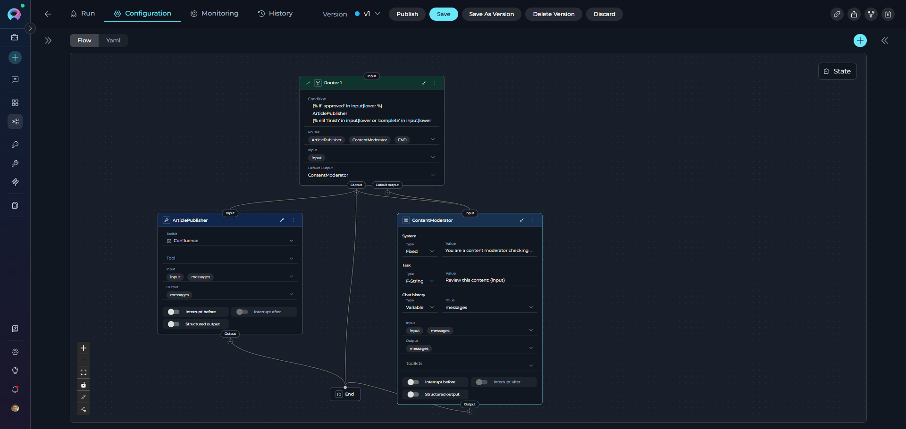
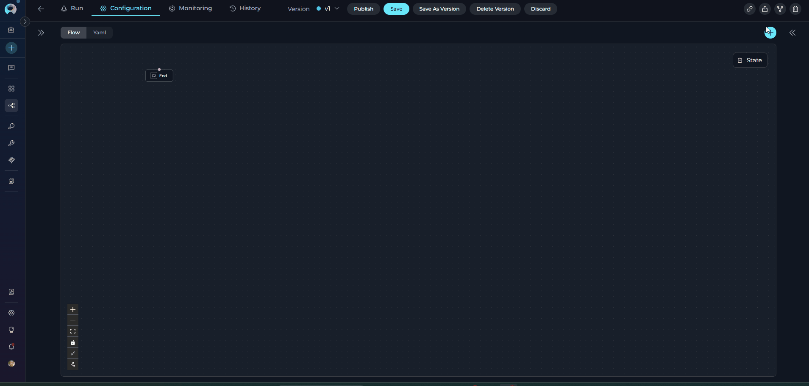
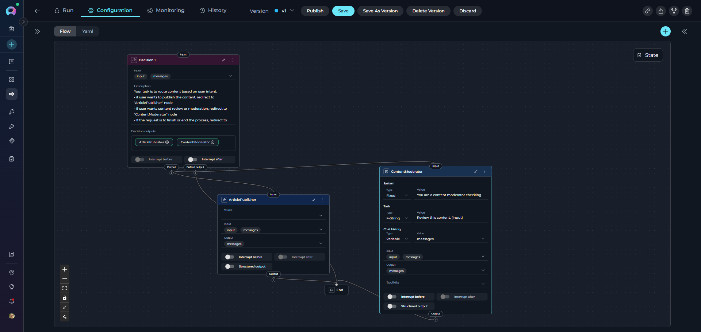

# Control Flow Nodes

Control Flow Nodes enable your pipeline to make decisions, route execution down different paths, and implement conditional logic. These nodes form the "decision-making" layer of your workflow, allowing pipelines to adapt behavior based on data, conditions, and intelligent reasoning.

**Available Control Flow Nodes:**

* **[Router Node](#router-node)** - Route execution based on condition matching with multiple named paths
* **[Decision Node](#decision-node)** - LLM-powered intelligent routing based on natural language criteria

---

## Router Node

The Router Node evaluates a condition and routes pipeline execution to one of multiple named paths. It uses template-based conditions (similar to Jinja2 syntax) to determine which route to take, with a default fallback route if no conditions match.

{ loading=lazy }

**Purpose**

Use the Router Node to:

* **Route execution** to different paths based on state variable values
* **Implement branching logic** with multiple named routes
* **Evaluate complex conditions** using template syntax
* **Provide fallback behavior** with default output
* **Create multi-path workflows** based on data conditions
* **Create loops and iterative execution** by routing back to previous nodes

**Parameters**

| Parameter | Purpose | Type Options & Examples |
|-----------|---------|-------------------------|
| **Condition** | Define the conditional logic that determines which route to take | **Syntax:** Template syntax (Jinja2-like)<br>**Operators:**<br>`` - Start conditional block<br>`` - Alternative condition<br>`` - Fallback condition<br>`` - End conditional block<br><br>**State Variables:** Use variable names directly (e.g., `input`, `status`, `priority`)<br>**Filters:** `\|lower`, `\|upper`, `in` operator for substring matching<br><br>**Example:**<br><br>ArticlePublisher<br><br>END<br><br> |
| **Routes** | Define the named paths (node IDs) that the router can select | **Configuration:** List of node IDs that correspond to the route names returned by the condition<br><br>**Example:**<br>`- ArticlePublisher`<br>`- END`<br><br>**Important:** Route names in the condition must **exactly match** node IDs in the Routes list |
| **Input** | Specify which state variables the Router node reads for condition evaluation | **Default states:** `input`, `messages`<br>**Custom states:** Any defined state variables<br><br>**Example:**<br>`- input`<br>`- status`<br>`- user_type` |
| **Default Output** | Specify the fallback route if no conditions in the Router match | **Options:** Select a node ID from available nodes in the pipeline<br><br>**Example:** `ContentModerator`<br><br>**Fallback Behavior:** If the condition doesn't return any route name, execution goes to Default Output |
| **Interrupt Before** | Pause pipeline execution before the Router node executes | **Enabled** / **Disabled** |
| **Interrupt After** | Pause pipeline execution after the Router node for inspection | **Enabled** / **Disabled** |

{ loading=lazy }


!!! warning "Route Name Matching"
    Route names in the condition must **exactly match** node IDs in the pipeline. Case sensitivity matters: "ArticlePublisher" ≠ "article_publisher".

**YAML Configuration**

```yaml
state:
  input:
    type: str
    value: ''
  messages:
    type: list
entry_point: Router 1
nodes:
  - id: Router 1
    type: router
    condition: |2-
          
          ArticlePublisher
          
          END
          
    input:
      - input
    routes:
      - ArticlePublisher
      - ContentModerator
      - END
    default_output: ContentModerator
  - id: ArticlePublisher
    type: toolkit
    toolkit_name: publishing_toolkit
    tool: publish_article
    input:
      - input
      - messages
    output:
      - messages
    input_mapping:
      article_content:
        type: variable
        value: input
      status:
        type: fixed
        value: published
    structured_output: false
    transition: END
  - id: ContentModerator
    type: llm
    prompt:
      type: string
      value: Review content for policy compliance and quality standards
    input:
      - input
      - messages
    output:
      - messages
    input_mapping:
      system:
        type: fixed
        value: You are a content moderator checking for policy violations and quality issues
      task:
        type: fstring
        value: 'Review this content: {input}'
      chat_history:
        type: variable
        value: messages
    structured_output: false
    transition: END
```

??? example "Jinja Syntax Examples"

    The Router Node uses Jinja2-like template syntax for condition evaluation. Here are common patterns:

    **String Matching:**
    ```jinja
    
    NodeA
    
    ```

    **Multiple Conditions with elif:**
    ```jinja
    
    UrgentHandler
    
    NormalHandler
    
    LowPriorityHandler
    
    DefaultHandler
    
    ```

    **Logical Operators:**
    ```jinja
    
    FastTrackPublisher
    
    ReviewQueue
    
    ```

    **Numeric Comparisons:**
    ```jinja
    
    HighQualityPath
    
    MediumQualityPath
    
    LowQualityPath
    
    ```

    **String Filters:**
    ```jinja
    
    ApprovalNode
    
    RejectionNode
    
    ```

    **Complex Conditions:**
    ```jinja
    
    EscalationNode
    
    ProcessingNode
    
    ```


!!! tip "Router Node for Loops"

    The Router evaluates the condition from top to bottom. When a condition matches, it returns the associated route name and execution proceeds to that node. If no conditions match, execution goes to the default output

    Router nodes can create loop structures by routing back to previous nodes. This enables iterative processing by:
    
    - Routing to an earlier node when a condition is met (e.g., counter < max_iterations)
    - Routing to the next node or END when the loop should exit
    - Using state variables to track iteration count and control loop termination
    
    This is an alternative to Loop and Loop from Tool nodes, offering more precise control over loop conditions and execution flow.

**Best Practices**

   - Always Provide Default Output: Ensure fallback behavior for unmatched conditions to prevent pipeline failures.
   - Match Route Names Exactly: Route names in condition must match node IDs exactly (case-sensitive).
   - Order Conditions by Specificity: Place most specific conditions first to avoid unintended matches.
   - Use Filters for String Comparisons: Normalize strings with `|lower` or `|upper` for reliable matching.
   - List All Routes: Include all possible routes in the Routes list for clarity and validation.
   - Test All Paths: Ensure every condition path is reachable and test edge cases.
   - Use Descriptive Route Names: Name routes clearly to indicate their purpose (e.g., "ApprovedWorkflow" not "Path1").
   - Document Complex Conditions: Add comments in YAML to explain routing logic for maintainability.
   - Use Router for Loop Control: When creating loops, use state variables (counters, flags) to control loop termination and prevent infinite loops.

---

## Decision Node

The Decision Node uses LLM intelligence to make routing decisions based on natural language criteria. It operates as a standalone node in the pipeline and analyzes the input to intelligently select the appropriate output path from multiple decision outputs.

{ loading=lazy }

**Purpose**

Use the Decision Node to:

* **Make intelligent routing decisions** using LLM reasoning
* **Route based on natural language criteria** without writing conditions
* **Handle complex decision logic** that's difficult to express in templates
* **Leverage context and semantics** for routing decisions
* **Simplify decision-making** with descriptive instructions


!!! warning "LLM Overhead"
    Decision Nodes are slower than Router nodes due to LLM processing. Use for complex routing requiring semantic understanding, not simple condition matching.

!!! note "Decision Node Chaining Restriction"
    Decision nodes **cannot be connected to another Decision node**. If you need sequential decision-making, use a different node type (such as Router, LLM, or Code) between Decision nodes.

**Parameters**

| Parameter | Purpose | Type Options & Examples |
|-----------|---------|-------------------------|
| **Input** | Specify which state variables the LLM analyzes to make the routing decision | **Default states:** `input`, `messages`<br>**Custom states:** Any defined state variables<br><br>**Example:** <br>`- input`<br>`- messages`<br><br>**Usage:** The LLM reads these state variables' content and analyzes them against the description criteria |
| **Description** | Provide natural language instructions describing how the LLM should make routing decisions | **Format:** Clear, structured instructions with specific routing criteria<br><br>**Example:**<br>Your task is to route content based on user intent:<br>- if user wants to publish the content, redirect to "ArticlePublisher" node<br>- if user wants content review or moderation, redirect to "ContentModerator" node<br>- If the request is to finish or end the process, redirect to "END" node<br><br>**Best Practices:** Use clear criteria, specific examples, structured format |
| **Decision Outputs (nodes)** | Define the possible output paths (node IDs) the LLM can select from | **Configuration:** List of node IDs that the LLM can route execution to<br><br>**Example:**<br>`- ArticlePublisher`<br>`- ContentModerator`<br><br>**How It Works:** LLM analyzes input, reviews description, selects appropriate output from list |
| **Default Output** | Specify the fallback route if the LLM cannot make a confident decision | **Options:** Select a node ID from available nodes in the pipeline<br><br>**Example:** `END`<br><br>**Fallback Behavior:** If LLM can't decide confidently, execution goes to Default Output |
| **Interrupt Before** | Pause pipeline execution before the Decision node executes | **Enabled** / **Disabled** |
| **Interrupt After** | Pause pipeline execution after the Decision node for inspection | **Enabled** / **Disabled** |

{ loading=lazy }
**YAML Configuration**

```yaml
state:
  input:
    type: str
    value: ''
  messages:
    type: list
entry_point: Decision 1
nodes:
  - id: Decision 1
    type: decision
    description: |
      Your task is to route content based on user intent:
      - if user wants to publish the content, redirect to "ArticlePublisher" node
      - if user wants content review or moderation, redirect to "ContentModerator" node
      - If the request is to finish or end the process, redirect to "END" node
    input:
      - input
      - messages
    nodes:
      - ArticlePublisher
      - ContentModerator
    default_output: END
  - id: ArticlePublisher
    type: toolkit
    toolkit_name: publishing_toolkit
    tool: publish_article
    input:
      - input
      - messages
    output:
      - messages
    input_mapping:
      article_content:
        type: variable
        value: input
      status:
        type: fixed
        value: published
    structured_output: false
    transition: END
  - id: ContentModerator
    type: llm
    prompt:
      type: string
      value: Review content for policy compliance and quality standards
    input:
      - input
      - messages
    output:
      - messages
    input_mapping:
      system:
        type: fixed
        value: You are a content moderator checking for policy violations and quality issues
      task:
        type: fstring
        value: 'Review this content: {input}'
      chat_history:
        type: variable
        value: messages
    structured_output: false
    transition: END
```

!!! info "LLM Decision Process"
    The Decision Node operates as a standalone node that uses LLM to:

    1. Read input state variables (configured in `input` parameter)
    2. Analyze description for routing criteria
    3. Select appropriate output from `nodes` list
    4. Return selected node ID for routing
    5. If uncertain, defaults to `default_output`


**Best Practices**

   * Write Clear Decision Criteria: Provide specific, unambiguous routing rules with examples for each path.
   * Provide Examples in Description: Help the LLM understand expected routing with concrete examples.
   * Always Define Default Output: Provide fallback for unclear cases to prevent pipeline failures.
   * List All Decision Outputs: Include all possible routing targets in the `nodes` list.
   * Structure Descriptions Clearly: Use headings, lists, and clear formatting to organize routing criteria.
   * Use Decision Node for Complex Routing: Choose when routing requires semantic understanding, not simple condition matching.
   * Configure Input Variables: Include relevant state variables in `input` for the LLM to analyze.
   * Test with Various Inputs: Verify LLM routing across different scenarios and edge cases.
   * Monitor Decision Quality: Review LLM routing decisions periodically and refine description if needed.
   * Provide Context in Description: Help the LLM make better decisions by explaining the use case.
   * Use Descriptive Output Names: Name outputs clearly to match description (e.g., "TechnicalSupport" not "Output1").
   * Use Interrupts for Debugging: Enable interrupts to review decision-making and routing results during development.

---

## Control Flow Nodes Comparison

| Feature | Router Node | Decision Node |
|---------|-------------|---------------|
| **Purpose** | Route execution based on template conditions with multiple paths | LLM-powered intelligent routing as a standalone node |
| **Node Type** | Independent routing node | Independent decision-making node |
| **Decision Logic** | Template-based conditions (Jinja2-like) | LLM reasoning from natural language description |
| **Configuration** | Condition, Routes, Input, Default Output | Input, Description, Nodes (decision outputs), Default Output |
| **LLM Usage** | No LLM | Yes (LLM analyzes and decides) |
| **Condition Syntax** | Template syntax with filters (``, `|lower`, `in`) | Natural language instructions |
| **Input Variables** | State variables for condition evaluation | State variables for LLM analysis |
| **Complexity** | Medium (template syntax) | Low (natural language) |
| **Flexibility** | High (full template control) | Very High (LLM reasoning) |
| **Performance** | Fast (template evaluation) | Slower (LLM overhead) |
| **Output Definition** | Routes list | Nodes list (decision outputs) |
| **Default Behavior** | Default output if no match | Default output if LLM uncertain |
| **Best For** | Explicit multi-path routing with known conditions | Complex routing requiring semantic understanding |
| **Use Case** | Status-based routing, priority levels, keyword matching, approval checks, validation branching | Customer support routing, sentiment analysis, intent classification, context-aware decisions |

### When to Use Each Node

??? note "Router Node"

    **Choose Router Node when you**:

    * Need multiple named routes based on explicit conditions
    * Have condition logic you can express in Jinja2-like templates
    * Want fast, deterministic routing without LLM overhead
    * Know all possible paths and conditions upfront
    * Need to match keywords, compare values, or check status
    * Need binary or multi-branch conditional logic with if-else routing
    * Want to create loops by routing back to previous nodes

    **Example**: Route tickets by priority level (critical/high/medium/low), approval status (approved/pending/rejected), validation branching (valid → ProcessPath, invalid → ErrorPath), or iterative processing with loop control.

??? note "Decision Node"

    **Choose Decision Node when you**:

    * Need LLM intelligence for routing decisions
    * Routing logic is complex, nuanced, or context-dependent
    * Want natural language decision criteria instead of templates
    * Require semantic understanding of user input or content
    * Template conditions are too rigid or difficult to express
    * Need to analyze multiple input variables simultaneously
    * Routing depends on understanding intent, sentiment, or meaning

    **Example**: Customer support routing (technical/billing/general inquiries), sentiment analysis (positive/negative/neutral routing), intent classification, context-aware content moderation, or multi-factor decision making based on conversation history.

---

## Deprecated Control Flow Nodes

The following control flow nodes are deprecated and will be removed in a future release. Please migrate to the recommended alternatives:

??? warning "Condition Node"

    The **Condition** node is deprecated and will be removed in an upcoming release.

    **Migration:** Use the **Router** node for expression-based routing or the **Decision** node for AI-powered routing decisions.

    **Migration Guide:** [Condition Node Migration](../../../migration/v2.0.1/condition-node-migration.md)

---

!!! info "Related"
    - **[Nodes Overview](overview.md)** - Understand all available node types
    - **[Execution Nodes](execution-nodes.md)** - Function, Tool, Code, and Custom nodes
    - **[States](../states.md)** - Manage data flow through pipeline state
    - **[Connections](../nodes-connectors.md)** - Link nodes together
    - **[YAML Configuration](../yaml.md)** - See complete node syntax examples


