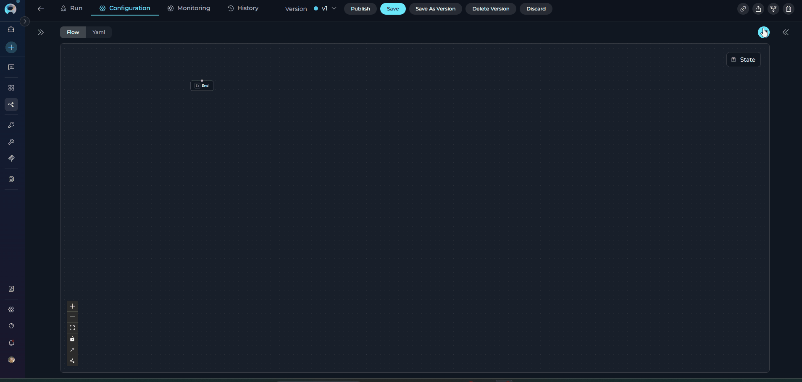
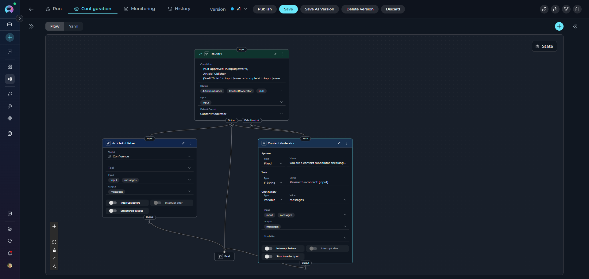
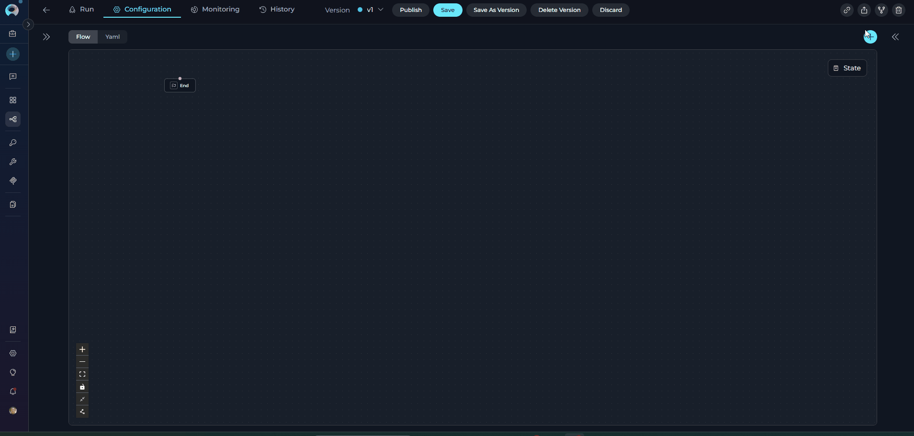
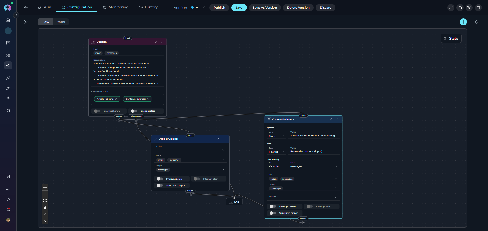
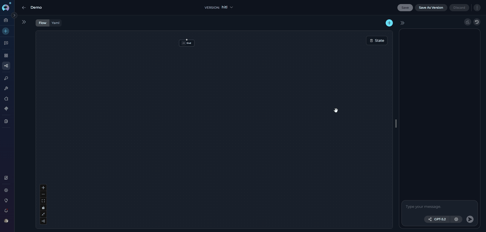
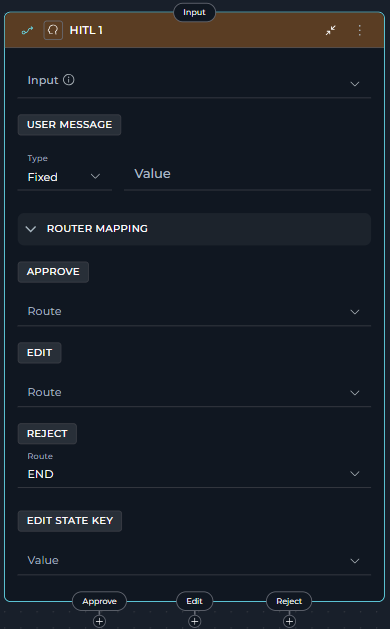
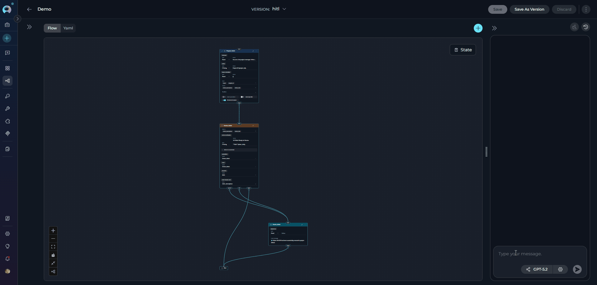
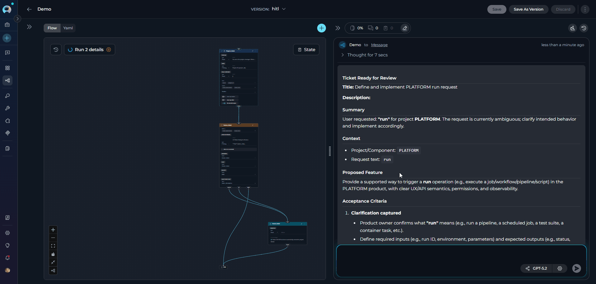
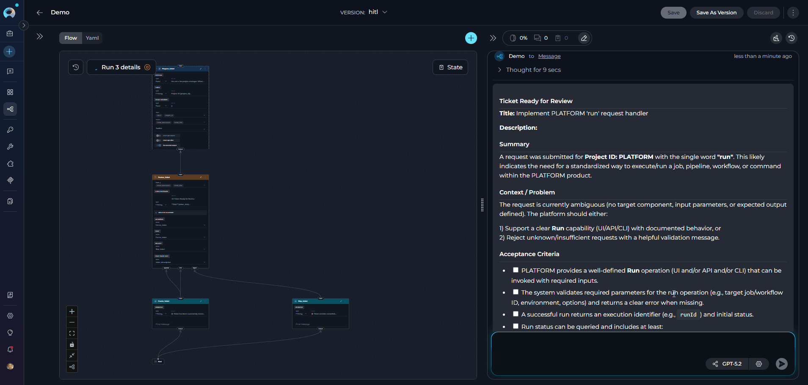

# Control Flow Nodes

Control Flow Nodes enable your pipeline to make decisions, route execution down different paths, and implement conditional logic. These nodes form the "decision-making" layer of your workflow, allowing pipelines to adapt behavior based on data, conditions, and intelligent reasoning.

**Available Control Flow Nodes:**

* **[Router Node](#router-node)** - Route execution based on condition matching with multiple named paths
* **[Decision Node](#decision-node)** - LLM-powered intelligent routing based on natural language criteria
* **[Human-in-the-Loop Node](#human-in-the-loop-node)** - Pause execution and request a human decision before proceeding

---

## Router Node

The Router Node evaluates a condition and routes pipeline execution to one of multiple named paths. It uses template-based conditions (similar to Jinja2 syntax) to determine which route to take, with a default fallback route if no conditions match.

{ loading=lazy }

**Purpose**

Use the Router Node to:

* **Route execution** to different paths based on state variable values
* **Implement branching logic** with multiple named routes
* **Evaluate complex conditions** using template syntax
* **Provide fallback behavior** with default output
* **Create multi-path workflows** based on data conditions
* **Create loops and iterative execution** by routing back to previous nodes

**Parameters**

| Parameter | Purpose | Type Options & Examples |
|-----------|---------|-------------------------|
| **Condition** | Define the conditional logic that determines which route to take | **Syntax:** Template syntax (Jinja2-like)<br>**Operators:**<br>`` - Start conditional block<br>`` - Alternative condition<br>`` - Fallback condition<br>`` - End conditional block<br><br>**State Variables:** Use variable names directly (e.g., `input`, `status`, `priority`)<br>**Filters:** `\|lower`, `\|upper`, `in` operator for substring matching<br><br>**Example:**<br><br>ArticlePublisher<br><br>END<br><br> |
| **Routes** | Define the named paths (node IDs) that the router can select | **Configuration:** List of node IDs that correspond to the route names returned by the condition<br><br>**Example:**<br>`- ArticlePublisher`<br>`- END`<br><br>**Important:** Route names in the condition must **exactly match** node IDs in the Routes list |
| **Input** | Specify which state variables the Router node reads for condition evaluation | **Default states:** `input`, `messages`<br>**Custom states:** Any defined state variables<br><br>**Example:**<br>`- input`<br>`- status`<br>`- user_type` |
| **Default Output** | Specify the fallback route if no conditions in the Router match | **Options:** Select a node ID from available nodes in the pipeline<br><br>**Example:** `ContentModerator`<br><br>**Fallback Behavior:** If the condition doesn't return any route name, execution goes to Default Output |
| **Interrupt Before** | Pause pipeline execution before the Router node executes | **Enabled** / **Disabled** |
| **Interrupt After** | Pause pipeline execution after the Router node for inspection | **Enabled** / **Disabled** |

{ loading=lazy }


!!! warning "Route Name Matching"
    Route names in the condition must **exactly match** node IDs in the pipeline. Case sensitivity matters: "ArticlePublisher" ≠ "article_publisher".

**YAML Configuration**

```yaml
state:
  input:
    type: str
    value: ''
  messages:
    type: list
entry_point: Router 1
nodes:
  - id: Router 1
    type: router
    condition: |2-
          
          ArticlePublisher
          
          END
          
    input:
      - input
    routes:
      - ArticlePublisher
      - ContentModerator
      - END
    default_output: ContentModerator
  - id: ArticlePublisher
    type: toolkit
    toolkit_name: publishing_toolkit
    tool: publish_article
    input:
      - input
      - messages
    output:
      - messages
    input_mapping:
      article_content:
        type: variable
        value: input
      status:
        type: fixed
        value: published
    structured_output: false
    transition: END
  - id: ContentModerator
    type: llm
    prompt:
      type: string
      value: Review content for policy compliance and quality standards
    input:
      - input
      - messages
    output:
      - messages
    input_mapping:
      system:
        type: fixed
        value: You are a content moderator checking for policy violations and quality issues
      task:
        type: fstring
        value: 'Review this content: {input}'
      chat_history:
        type: variable
        value: messages
    structured_output: false
    transition: END
```

??? example "Jinja Syntax Examples"

    The Router Node uses Jinja2-like template syntax for condition evaluation. Here are common patterns:

    **String Matching:**
    ```jinja
    
    NodeA
    
    ```

    **Multiple Conditions with elif:**
    ```jinja
    
    UrgentHandler
    
    NormalHandler
    
    LowPriorityHandler
    
    DefaultHandler
    
    ```

    **Logical Operators:**
    ```jinja
    
    FastTrackPublisher
    
    ReviewQueue
    
    ```

    **Numeric Comparisons:**
    ```jinja
    
    HighQualityPath
    
    MediumQualityPath
    
    LowQualityPath
    
    ```

    **String Filters:**
    ```jinja
    
    ApprovalNode
    
    RejectionNode
    
    ```

    **Complex Conditions:**
    ```jinja
    
    EscalationNode
    
    ProcessingNode
    
    ```


!!! tip "Router Node for Loops"

    The Router evaluates the condition from top to bottom. When a condition matches, it returns the associated route name and execution proceeds to that node. If no conditions match, execution goes to the default output

    Router nodes can create loop structures by routing back to previous nodes. This enables iterative processing by:
    
    - Routing to an earlier node when a condition is met (e.g., counter < max_iterations)
    - Routing to the next node or END when the loop should exit
    - Using state variables to track iteration count and control loop termination
    
    This is an alternative to Loop and Loop from Tool nodes, offering more precise control over loop conditions and execution flow.

**Best Practices**

   - Always Provide Default Output: Ensure fallback behavior for unmatched conditions to prevent pipeline failures.
   - Match Route Names Exactly: Route names in condition must match node IDs exactly (case-sensitive).
   - Order Conditions by Specificity: Place most specific conditions first to avoid unintended matches.
   - Use Filters for String Comparisons: Normalize strings with `|lower` or `|upper` for reliable matching.
   - List All Routes: Include all possible routes in the Routes list for clarity and validation.
   - Test All Paths: Ensure every condition path is reachable and test edge cases.
   - Use Descriptive Route Names: Name routes clearly to indicate their purpose (e.g., "ApprovedWorkflow" not "Path1").
   - Document Complex Conditions: Add comments in YAML to explain routing logic for maintainability.
   - Use Router for Loop Control: When creating loops, use state variables (counters, flags) to control loop termination and prevent infinite loops.

---

## Decision Node

The Decision Node uses LLM intelligence to make routing decisions based on natural language criteria. It operates as a standalone node in the pipeline and analyzes the input to intelligently select the appropriate output path from multiple decision outputs.

{ loading=lazy }

**Purpose**

Use the Decision Node to:

* **Make intelligent routing decisions** using LLM reasoning
* **Route based on natural language criteria** without writing conditions
* **Handle complex decision logic** that's difficult to express in templates
* **Leverage context and semantics** for routing decisions
* **Simplify decision-making** with descriptive instructions


!!! warning "LLM Overhead"
    Decision Nodes are slower than Router nodes due to LLM processing. Use for complex routing requiring semantic understanding, not simple condition matching.

!!! note "Decision Node Chaining Restriction"
    Decision nodes **cannot be connected to another Decision node**. If you need sequential decision-making, use a different node type (such as Router, LLM, or Code) between Decision nodes.

**Parameters**

| Parameter | Purpose | Type Options & Examples |
|-----------|---------|-------------------------|
| **Input** | Specify which state variables the LLM analyzes to make the routing decision | **Default states:** `input`, `messages`<br>**Custom states:** Any defined state variables<br><br>**Example:** <br>`- input`<br>`- messages`<br><br>**Usage:** The LLM reads these state variables' content and analyzes them against the description criteria |
| **Description** | Provide natural language instructions describing how the LLM should make routing decisions | **Format:** Clear, structured instructions with specific routing criteria<br><br>**Example:**<br>Your task is to route content based on user intent:<br>- if user wants to publish the content, redirect to "ArticlePublisher" node<br>- if user wants content review or moderation, redirect to "ContentModerator" node<br>- If the request is to finish or end the process, redirect to "END" node<br><br>**Best Practices:** Use clear criteria, specific examples, structured format |
| **Decision Outputs (nodes)** | Define the possible output paths (node IDs) the LLM can select from | **Configuration:** List of node IDs that the LLM can route execution to<br><br>**Example:**<br>`- ArticlePublisher`<br>`- ContentModerator`<br><br>**How It Works:** LLM analyzes input, reviews description, selects appropriate output from list |
| **Default Output** | Specify the fallback route if the LLM cannot make a confident decision | **Options:** Select a node ID from available nodes in the pipeline<br><br>**Example:** `END`<br><br>**Fallback Behavior:** If LLM can't decide confidently, execution goes to Default Output |
| **Interrupt Before** | Pause pipeline execution before the Decision node executes | **Enabled** / **Disabled** |
| **Interrupt After** | Pause pipeline execution after the Decision node for inspection | **Enabled** / **Disabled** |

{ loading=lazy }
**YAML Configuration**

```yaml
state:
  input:
    type: str
    value: ''
  messages:
    type: list
entry_point: Decision 1
nodes:
  - id: Decision 1
    type: decision
    description: |
      Your task is to route content based on user intent:
      - if user wants to publish the content, redirect to "ArticlePublisher" node
      - if user wants content review or moderation, redirect to "ContentModerator" node
      - If the request is to finish or end the process, redirect to "END" node
    input:
      - input
      - messages
    nodes:
      - ArticlePublisher
      - ContentModerator
    default_output: END
  - id: ArticlePublisher
    type: toolkit
    toolkit_name: publishing_toolkit
    tool: publish_article
    input:
      - input
      - messages
    output:
      - messages
    input_mapping:
      article_content:
        type: variable
        value: input
      status:
        type: fixed
        value: published
    structured_output: false
    transition: END
  - id: ContentModerator
    type: llm
    prompt:
      type: string
      value: Review content for policy compliance and quality standards
    input:
      - input
      - messages
    output:
      - messages
    input_mapping:
      system:
        type: fixed
        value: You are a content moderator checking for policy violations and quality issues
      task:
        type: fstring
        value: 'Review this content: {input}'
      chat_history:
        type: variable
        value: messages
    structured_output: false
    transition: END
```

!!! info "LLM Decision Process"
    The Decision Node operates as a standalone node that uses LLM to:

    1. Read input state variables (configured in `input` parameter)
    2. Analyze description for routing criteria
    3. Select appropriate output from `nodes` list
    4. Return selected node ID for routing
    5. If uncertain, defaults to `default_output`

**Best Practices**

   * Write Clear Decision Criteria: Provide specific, unambiguous routing rules with examples for each path.
   * Provide Examples in Description: Help the LLM understand expected routing with concrete examples.
   * Always Define Default Output: Provide fallback for unclear cases to prevent pipeline failures.
   * List All Decision Outputs: Include all possible routing targets in the `nodes` list.
   * Structure Descriptions Clearly: Use headings, lists, and clear formatting to organize routing criteria.
   * Use Decision Node for Complex Routing: Choose when routing requires semantic understanding, not simple condition matching.
   * Configure Input Variables: Include relevant state variables in `input` for the LLM to analyze.
   * Test with Various Inputs: Verify LLM routing across different scenarios and edge cases.
   * Monitor Decision Quality: Review LLM routing decisions periodically and refine description if needed.
   * Provide Context in Description: Help the LLM make better decisions by explaining the use case.
   * Use Descriptive Output Names: Name outputs clearly to match description (e.g., "TechnicalSupport" not "Output1").
   * Use Interrupts for Debugging: Enable interrupts to review decision-making and routing results during development.

---

## Human-in-the-Loop Node

The Human-in-the-Loop (HITL) Node pauses pipeline execution and waits for a human decision before continuing. It presents a configurable message to the user and provides up to three action buttons — **Approve**, **Edit**, and **Reject** — each routing to a different downstream node.



**Purpose**

Use the HITL Node to:

* **Gate critical actions** — require human sign-off before irreversible steps
* **Validate AI output** — let a human review and approve content generated by previous nodes
* **Allow human correction** — give users the ability to edit a state value before the pipeline continues
* **Implement approval workflows** — build multi-step review processes where humans are in the decision path
* **Enforce compliance checkpoints** — ensure sensitive operations are authorized by a person

**Parameters**

{width="300"}

| Parameter | Purpose | Type Options & Examples |
|-----------|---------|-------------------------|
| **Input** | State variables available for interpolation in the User message when using F-String type | **Default:** `[]`<br>**Custom:** Any defined state variables<br><br>Example:<br>`- summary`<br>`- draft_content` |
| **User Message Type** | How the message presented to the user is constructed | **`Fixed`** - Static text<br>Example: `"Please review the generated summary and choose an action."`<br><br>**`F-String`** - Text with `{state_key}` placeholders resolved at runtime<br>Example: `"Review the following draft:\n\n{summary}"`<br><br>**`Variable`** - Entire message taken from a single state variable<br>Example: `review_message` |
| **User Message Value** | The message content shown to the user at the interrupt point | Depends on type:<br>- Fixed: plain text<br>- F-String: template with `{state_key}` placeholders<br>- Variable: name of a state variable |
| **Approve Route** | Next node when the user clicks **Approve** | Any registered node name or `END`<br>Example: `publish_node` |
| **Reject Route** | Next node when the user clicks **Reject** | Any registered node name or `END`<br>Example: `END` |
| **Edit Route** | Next node when the user clicks **Edit** | Any registered node name (**cannot be `END`**)<br>Example: `regenerate_node`<br><br>**Requires `edit_state_key` to be set** |
| **Edit State Key** | The state variable updated with the user's edited value when the Edit action is chosen | Must match an existing state variable name<br>Example: `summary`<br><br>**Required when an Edit route is configured** |

!!! warning "Edit Route Constraints"
    The Edit action is only available to users when both conditions are met:

    1. **`edit_state_key`** is set to a valid state variable name.
    2. **Edit route** is configured and does **not** point to `END`.

    If either condition is missing, the Edit button will not appear in the UI.

**How It Works**

1. The node builds the user-facing message from the configured `user_message`.
2. Pipeline execution **pauses** using LangGraph's dynamic interrupt mechanism.
3. The UI displays the message along with action buttons for each configured route.
4. The user chooses an action:

    | Action | Button Color | State Change | Behavior |
    |--------|-------------|--------------|----------|
    | **Approve** |  | None | Pipeline resumes and routes to the Approve route |
    | **Reject** |  | None | Pipeline resumes and routes to the Reject route |
    | **Edit** |  | `edit_state_key` updated with user's input | A text input appears; user provides the revised value, then pipeline routes to the Edit route |

5. Execution continues from the target node.

**YAML Configuration**

```yaml
state:
  messages:
    type: list
  input:
    type: str
  summary:
    type: str
    value: ''
entry_point: Review_summary
nodes:
  - id: Review_summary
    type: hitl
    input:
      - summary
    user_message:
      type: fstring
      value: "Please review the following summary and choose an action:\n\n{summary}"
    routes:
      approve: Publish_node
      reject: END
      edit: Regenerate_node
    edit_state_key: summary
```

!!! info "Route Handling"
    The HITL node uses LangGraph's `Command(goto=)` pattern for routing — no explicit `transition` field or conditional edges are needed. All route target nodes must exist in the pipeline.

## UI Behavior

When the pipeline reaches a HITL node during a run, the chat panel displays the configured user message and action buttons for each configured route. Only buttons with valid routes appear. After the user clicks an action, the pipeline resumes automatically.

**Approve**

**Appears when:** the `approve` route is configured.

* The **Approve** button  signals that the user accepts the content or action as-is. Clicking it immediately resumes the pipeline and routes execution to the node specified in `approve`. No state variables are modified — the pipeline continues with the same state it had when it paused.

      

**Use this when:** the generated output is correct and ready for the next step (e.g., publishing content, creating a ticket, sending a notification).

**Edit**

**Appears when:** both an `edit` route and a valid `edit_state_key` are configured (and the Edit route does not point to `END`).

* The **Edit** button allows the user to revise a specific piece of content before the pipeline continues. Clicking it opens a text input field pre-filled with (or adjacent to) the current value of the `edit_state_key` state variable. After the user submits the revised text, the pipeline updates `edit_state_key` with the new value and routes execution to the node specified in `edit`.

      

**Use this when:** the output is mostly correct but needs minor adjustments — for example, rewording a ticket description or correcting a generated summary — without restarting the full generation process.

**Reject**

**Appears when:** the `reject` route is configured.

* The **Reject** button (red) signals that the user has declined the content or action entirely. Clicking it resumes the pipeline and routes execution to the node specified in `reject` — typically `END` to cancel the workflow, or a regeneration node to start over. No state variables are modified.

      

**Use this when:** the output is unacceptable and the pipeline should be stopped or fully restarted rather than edited inline.


!!! warning "Limitations"
    * The Edit route **cannot** point to `END`.
    * `edit_state_key` must be set for the Edit button to appear; it must reference a state variable that already exists.
    * Because HITL uses a dynamic interrupt, **the pipeline must be running with checkpoint/memory support** (a `thread_id` must be active) for the resume to work correctly.
    * Each HITL node can handle only one pending interrupt at a time.
    * The node does not modify state on Approve or Reject — only Edit mutates state.

**Best Practices**

??? tip "1. Place HITL Before Irreversible Actions"

    Always gate destructive or hard-to-undo operations:

    ✅ **Good**:
    ```yaml
    # HITL → review → publish to production
    - id: Review_before_publish
      type: hitl
      user_message:
        type: fixed
        value: "Ready to publish. Approve to proceed, Reject to cancel."
      routes:
        approve: Publish_node
        reject: END
    ```

??? tip "2. Use F-String to Show Relevant Context"

    Show users the content they are reviewing:

    ✅ **Good**:
    ```yaml
    - id: Review_ticket
      type: hitl
      input:
        - ticket_title
        - ticket_description
      user_message:
        type: fstring
        value: |
          ## Ticket Ready for Review

          **Title:** {ticket_title}

          **Description:**
          {ticket_description}

          Approve to create the ticket, Edit to modify, or Reject to discard.
      routes:
        approve: Create_ticket
        edit: Create_ticket
        reject: END
      edit_state_key: ticket_description
    ```

??? tip "3. Route Edit Back Through Processing When Needed"

    If the user's edited value needs to be re-processed by an LLM, route Edit to a node earlier in the pipeline:

    ```yaml
    routes:
      approve: Publish_node
      edit: Reformat_node   # re-runs formatting with the edited value
      reject: END
    ```

??? tip "4. Always Configure the Reject Route"

    Without a Reject route, users cannot decline an action. Set it to `END` or a recovery node:

    ```yaml
    routes:
      approve: Next_step
      reject: END
    ```

**Real-Life Usage Examples**

??? example "Example 1: Content Approval Workflow"

    An LLM generates a blog post draft. A human reviews it, approves it for publishing, edits the draft directly, or rejects it to trigger a full regeneration.

    ```yaml
    entry_point: Generate_draft
    nodes:
      - id: Generate_draft
        type: llm
        input:
          - input
        output:
          - draft
          - messages
        structured_output: true
        transition: Review_draft
        input_mapping:
          system:
            type: fixed
            value: You are a blog writer.
          task:
            type: fstring
            value: Write a blog draft about {input}.
          chat_history:
            type: fixed
            value: []

      - id: Review_draft
        type: hitl
        input:
          - draft
        user_message:
          type: fstring
          value: "Draft ready for review:\n\n{draft}\n\nApprove to publish, Edit to revise inline, Reject to regenerate."
        routes:
          approve: Publish
          edit: Publish
          reject: Generate_draft
        edit_state_key: draft

      - id: Publish
        type: toolkit
        tool: PublishTool
        input:
          - draft
        transition: END
        input_mapping:
          content:
            type: variable
            value: draft

    state:
      input:
        type: str
      messages:
        type: list
      draft:
        type: str
        value: ''
    ```

??? example "Example 2: Jira Ticket Approval Before Creation"

    An agent prepares a Jira ticket. A human approves, edits the description, or rejects ticket creation entirely.

    ```yaml
    entry_point: Prepare_ticket
    nodes:
      - id: Prepare_ticket
        type: agent
        input:
          - input
          - project_id
        output:
          - ticket_title
          - ticket_description
          - messages
        transition: Review_ticket
        input_mapping:
          task:
            type: fstring
            value: "Prepare a Jira ticket for project {project_id} based on: {input}"
          chat_history:
            type: fixed
            value: []
        tool: JiraAgent

      - id: Review_ticket
        type: hitl
        input:
          - ticket_title
          - ticket_description
        user_message:
          type: fstring
          value: |
            ## Ticket Ready for Review

            **Title:** {ticket_title}

            **Description:**
            {ticket_description}

            Approve to create, Edit to modify the description, or Reject to cancel.
        routes:
          approve: Create_ticket
          edit: Create_ticket
          reject: END
        edit_state_key: ticket_description

      - id: Create_ticket
        type: toolkit
        tool: create_issue
        input:
          - ticket_title
          - ticket_description
          - project_id
        transition: END
        input_mapping:
          title:
            type: variable
            value: ticket_title
          description:
            type: variable
            value: ticket_description
          project:
            type: variable
            value: project_id

    state:
      input:
        type: str
      messages:
        type: list
      project_id:
        type: str
        value: ''
      ticket_title:
        type: str
        value: ''
      ticket_description:
        type: str
        value: ''
    ```

---

## Control Flow Nodes Comparison

| Feature | Router Node | Decision Node | HITL Node |
|---------|-------------|---------------|----------|
| **Purpose** | Route execution based on template conditions with multiple paths | LLM-powered intelligent routing as a standalone node | Pause execution and require explicit human approval, edit, or rejection |
| **Node Type** | Independent routing node | Independent decision-making node | Independent human decision checkpoint |
| **Decision Logic** | Template-based conditions (Jinja2-like) | LLM reasoning from natural language description | Human judgment (Approve / Edit / Reject buttons) |
| **Configuration** | Condition, Routes, Input, Default Output | Input, Description, Nodes (decision outputs), Default Output | User Message, Routes (approve/reject/edit), Edit State Key |
| **LLM Usage** | No LLM | Yes (LLM analyzes and decides) | No LLM |
| **Condition Syntax** | Template syntax with filters (``, `|lower`, `in`) | Natural language instructions | N/A (human decides) |
| **Input Variables** | State variables for condition evaluation | State variables for LLM analysis | State variables for message interpolation |
| **Complexity** | Medium (template syntax) | Low (natural language) | Low (configure message and routes) |
| **Flexibility** | High (full template control) | Very High (LLM reasoning) | Low (fixed 3-action model) |
| **Performance** | Fast (template evaluation) | Slower (LLM overhead) | Depends on human response time |
| **Output Definition** | Routes list | Nodes list (decision outputs) | Per-action routes (approve/edit/reject) |
| **Default Behavior** | Default output if no match | Default output if LLM uncertain | Waits indefinitely until user acts |
| **Best For** | Explicit multi-path routing with known conditions | Complex routing requiring semantic understanding | Approval gates, compliance checkpoints, human validation |
| **Use Case** | Status-based routing, priority levels, keyword matching, approval checks, validation branching | Customer support routing, sentiment analysis, intent classification, context-aware decisions | Content approval before publish, Jira ticket sign-off, irreversible operation gates |

### When to Use Each Node

??? note "Router Node"

    **Choose Router Node when you**:

    * Need multiple named routes based on explicit conditions
    * Have condition logic you can express in Jinja2-like templates
    * Want fast, deterministic routing without LLM overhead
    * Know all possible paths and conditions upfront
    * Need to match keywords, compare values, or check status
    * Need binary or multi-branch conditional logic with if-else routing
    * Want to create loops by routing back to previous nodes

    **Example**: Route tickets by priority level (critical/high/medium/low), approval status (approved/pending/rejected), validation branching (valid → ProcessPath, invalid → ErrorPath), or iterative processing with loop control.

??? note "Decision Node"

    **Choose Decision Node when you**:

    * Need LLM intelligence for routing decisions
    * Routing logic is complex, nuanced, or context-dependent
    * Want natural language decision criteria instead of templates
    * Require semantic understanding of user input or content
    * Template conditions are too rigid or difficult to express
    * Need to analyze multiple input variables simultaneously
    * Routing depends on understanding intent, sentiment, or meaning

    **Example**: Customer support routing (technical/billing/general inquiries), sentiment analysis (positive/negative/neutral routing), intent classification, context-aware content moderation, or multi-factor decision making based on conversation history.


??? note "HITL Node"
    
    **Choose HITL Node when you need**:

    * A human to approve, reject, or edit pipeline output before it is acted upon
    * A compliance checkpoint before an irreversible operation (database write, external API call, email send)
    * Inline human correction of AI-generated content without restarting the pipeline
    * An explicit audit trail of human decisions in an automated workflow

---

## Deprecated Control Flow Nodes

The following control flow nodes are deprecated and will be removed in a future release. Please migrate to the recommended alternatives:

??? warning "Condition Node"

    The **Condition** node is deprecated and will be removed in an upcoming release.

    **Migration:** Use the **Router** node for expression-based routing or the **Decision** node for AI-powered routing decisions.

    **Migration Guide:** [Condition Node Migration](../../../migration/v2.0.1/condition-node-migration.md)

---

!!! info "Related"
    - **[Nodes Overview](overview.md)** - Understand all available node types
    - **[Execution Nodes](execution-nodes.md)** - Function, Tool, Code, and Custom nodes
    - **[States](../states.md)** - Manage data flow through pipeline state
    - **[Connections](../nodes-connectors.md)** - Link nodes together
    - **[YAML Configuration](../yaml.md)** - See complete node syntax examples


