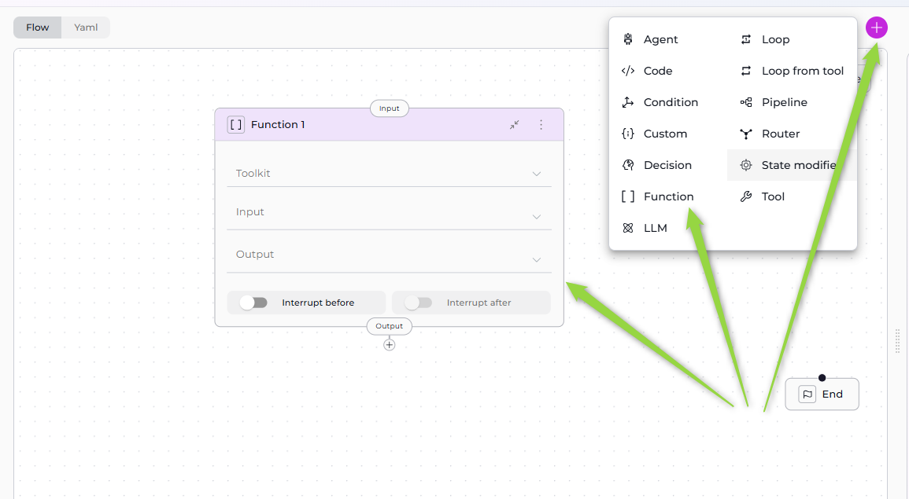
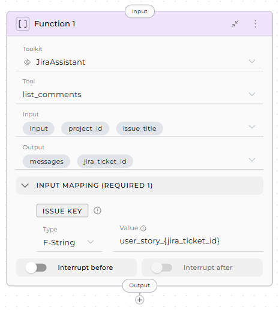
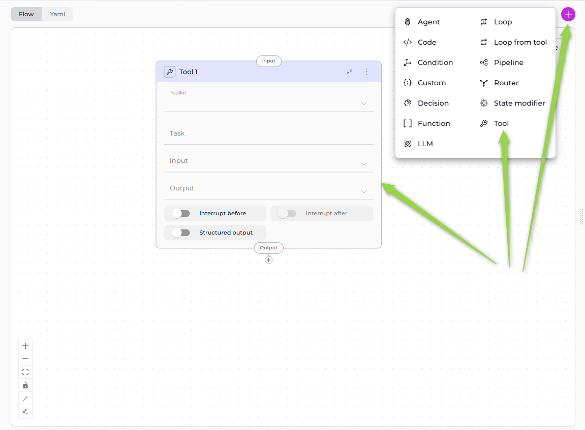
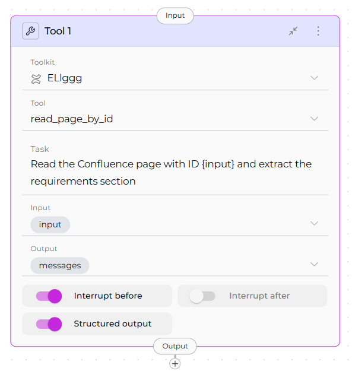
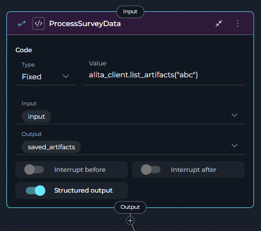
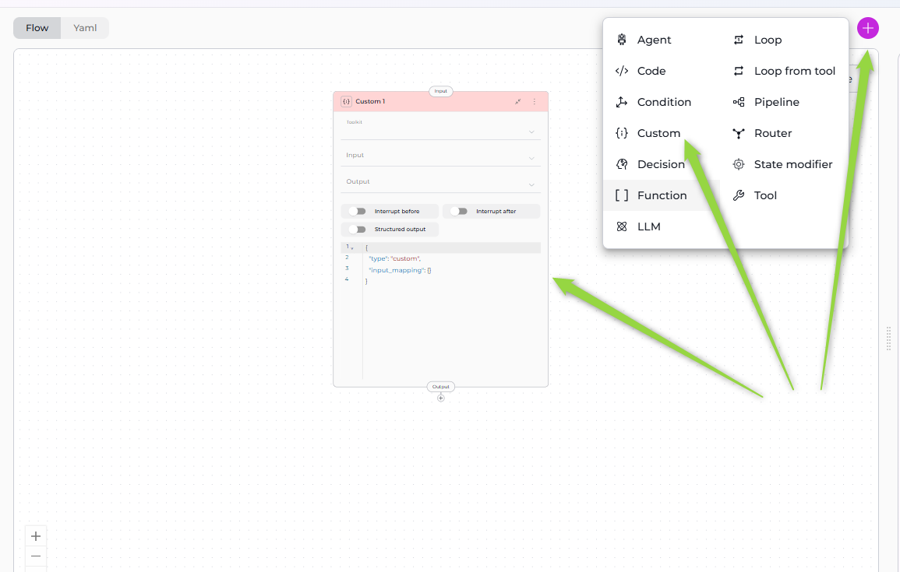

# Execution Nodes

Execution Nodes enable your pipeline to perform actions, call external tools, execute code, and integrate with APIs. These nodes form the "action" layer of your workflow, transforming data, triggering external systems, and performing computational tasks.

**Available Execution Nodes:**

- **[Function Node](#function-node)** - Execute specific toolkit/MCP functions with direct parameter mapping
- **[Tool Node](#tool-node)** - LLM-assisted tool selection and execution based on task instructions
- **[Code Node](#code-node)** - Execute custom Python code in a secure sandbox
- **[Custom Node](#custom-node)** - Advanced JSON-based configuration for any toolkit type

---

## Function Node

The Function Node executes specific tools from Toolkits or MCPs (Model Context Protocol servers) with direct parameter mapping. Unlike the Tool Node, which uses LLM intelligence to decide which tool to call, the Function Node directly invokes a pre-selected tool with explicitly mapped inputs.



### Purpose

Use the Function Node to:

- **Execute specific tools** without LLM decision-making overhead
- **Call external APIs** through toolkit integrations (Jira, Confluence, GitHub, etc.)
- **Perform deterministic actions** where the tool and parameters are known upfront
- **Map pipeline state** directly to tool parameters
- **Chain multiple tool calls** in sequence with precise control

!!! note "Function Node Scope"
    Function Nodes can use **Toolkits** and **MCPs** only. Agents and Pipelines now have their dedicated node types.

### Parameters

| Parameter | Purpose | Type Options & Examples |
|-----------|---------|-------------------------|
| **Toolkit** | Select which Toolkit or MCP contains the tool you want to execute | **Toolkits** - External service integrations<br>**MCPs** - Model Context Protocol servers<br><br>**Selection Process:**<br>1. Select Toolkit/MCP from dropdown<br>2. Tool dropdown appears<br>3. Select specific tool<br><br>Example: `jira_toolkit` |
| **Tool** | Select the specific tool/function to execute from the chosen toolkit | Dropdown populated with all available tools from selected toolkit<br><br>**jira_toolkit:** `create_issue`, `update_issue`, `search_issues`, `list_comments`|
| **Input** | Specify which state variables the Function node reads from | **Default states:** `input`, `messages`<br>**Custom states:** Any defined state variables<br><br>Example:<br>`- project_id`<br>`- issue_title`<br>`- input` |
| **Output** | Define which state variables the tool's result should populate | **Default:** `messages`<br>**Custom states:** Specific variables<br><br>Example:<br>`- jira_ticket_id`<br>`- messages` |
| **Input Mapping** | Map pipeline state variables to the tool's required parameters (appears after tool selection) | **F-String** - Formatted string with variables<br>Example: `user_story_{ticket_id}_v{version}.md`<br><br>**Variable** - Direct state reference<br>Example: `generated_content`<br><br>**Fixed** - Static value<br>Example: `production-reports`<br><br>**Categories:**<br>- Required parameters (must provide)<br>- Optional parameters (can be null) |
| **Interrupt Before** | Pause pipeline execution before this node | **Enabled** / **Disabled** |
| **Interrupt After** | Pause pipeline execution after this node for inspection | **Enabled** / **Disabled** |



**YAML Configuration**

```yaml
nodes:
  - id: Function 1
    type: function
    tool: list_comments
    input:
      - project_id
      - issue_title
      - input
    output:
      - jira_ticket_id
      - messages
    structured_output: false
    input_mapping:
      issue_key:
        type: fstring
        value: user_story_{jira_ticket_id}
    transition: END
    toolkit_name: JiraAssistant
interrupt_before: []
state:
  messages:
    type: list
  input:
    type: str
  project_id:
    type: str
    value: ''
  jira_ticket_id:
    type: str
    value: ''
  issue_title:
    type: str
    value: ''
```

!!! info "Input Mapping Configuration"
    The Input Mapping section dynamically displays **only the parameters required by the selected tool**. Each toolkit/MCP tool has different required and optional parameters. Select your tool first to see available mapping options.

!!! warning "Single Toolkit and Tool Selection"
    Each Function Node can select only **one toolkit** and **one tool**. For multiple tool executions, create separate Function Nodes and chain them together.

### Best Practices
   - Map Required Parameters Correctly.
   - Use Appropriate Type for Each Parameter
       - **Variable**: When value comes from state
       - **F-String**: When you need dynamic interpolation
       - **Fixed**: For static, unchanging values
   - Handle Optional Parameters: Set optional parameters to `null` if not needed:
   - Include Output Variables: Capture important results in output variables:
   - Use Interrupts for Debugging: Enable interrupts when testing new integrations:
   - Validate State Variables: Ensure input state variables exist before the Function node executes:
   - Choose Function Over Tool Node: Use Function Node when:
       - You know exactly which tool to call
       - Parameters are straightforward to map
       - No LLM decision-making is needed
       - Performance is critical (no LLM overhead)
   - Chain Function Calls: Create workflows by sequencing Function nodes:

---

## Tool Node

The Tool Node uses LLM intelligence to analyze a task instruction, select appropriate tools from available Toolkits/MCPs, and execute them with LLM-generated parameters. Unlike the Function Node, which requires explicit tool selection and parameter mapping, the Tool Node makes intelligent decisions about which tools to call and how.



### Purpose

Use the Tool Node to:

- **Delegate tool selection** to LLM based on natural language instructions
- **Handle complex workflows** where multiple tools might be needed
- **Simplify configuration** by avoiding manual parameter mapping
- **Leverage LLM reasoning** to choose the right tool for the task
- **Execute multi-step tool chains** dynamically

### Parameters

| Parameter | Purpose | Type Options & Examples |
|-----------|---------|-------------------------|
| **Toolkit** | Select which Toolkits or MCPs the LLM can choose tools from | **Toolkits** - External service integrations<br>**MCPs** - Model Context Protocol servers<br><br>**Selection:** Can select multiple<br>**How It Works:**<br>1. User selects one or more toolkits<br>2. LLM receives tool descriptions<br>3. LLM analyzes task and selects tools<br>4. Pipeline executes selected tools<br><br>Example:<br>`- confluence_toolkit`|
| **Tool** | Select a specific tool from the chosen toolkit that the LLM will use | Dropdown populated with all available tools from selected toolkit<br><br>**Selection:** Only one tool can be selected<br>**LLM Usage:** LLM uses the selected tool to accomplish the task<br><br>Example:<br>`read_page_by_id` |
| **Task** | Provide natural language instructions describing what the node should accomplish | Read the Confluence page with ID {input} and extract the requirements section.|
| **Input** | Specify which state variables the Tool node reads from | **Default states:** `input`, `messages`<br>**Custom states:** Any defined state variables<br><br>Example:<br>`- page_id`<br>`- topic`<br>`- messages` |
| **Output** | Define which state variables the tool execution results should populate | **Default:** `messages`<br>**Custom states:** Specific variables<br><br>Example:<br>`- search_results`<br>`- created_page_id`<br>`- messages` |
| **Structured Output** | Force the LLM to return results in a structured format matching your output variables | **Enabled** - LLM formats tool results into specific state variables<br>**Disabled** - LLM returns free-form summary in `messages`<br><br>Example: `true` or `false` |
| **Interrupt Before** | Pause execution before the LLM executes tools | **Enabled** / **Disabled** |
| **Interrupt After** | Pause execution after the LLM executes tools for inspection | **Enabled** / **Disabled** |



**YAML Configuration**

```yaml

nodes:
  - id: Tool 1
    type: tool
    tool: read_page_by_id
    input:
      - input
    output:
      - messages
    structured_output: true
    transition: END
    toolkit_name: ELlggg
    task: Read the Confluence page with ID {input} and extract the requirements section
interrupt_before:
  - Tool 1
state:
  messages:
    type: list
  input:
    type: str
  project_id:
    type: str
    value: ''
  issue_title:
    type: str
    value: ''
  page_id:
    type: str
    value: ''

```


### Best Practices
   - Write Clear Task Instructions: Provide specific, actionable tasks that clearly describe what the node should accomplish.
   - Single Tool Selection: Each Tool Node can select only one tool. The LLM uses that selected tool to accomplish the task based on the provided instructions.
   - Use Structured Output for Data Extraction: When you need specific values, enable structured output to extract data into defined state variables.
   - Provide Context in Task: Include necessary context from state variables using f-string formatting in the task description.
   - Use Interrupts for Debugging: Enable interrupts to review LLM tool execution and results during development.
   - Handle Multi-Step Tasks: Break complex workflows into clear, sequential steps in the task description.
   - Choose Tool Node Over Function Node: Use Tool Node when:
       - Task requires LLM reasoning about how to use the tool
       - You want natural language task specification
       - Tool parameters are complex or context-dependent
   - Monitor Tool Execution: Review the tool execution results to ensure expected behavior and optimize task instructions.

---

## Code Node

The Code Node enables secure execution of custom Python code within a sandboxed environment (Pyodide/WebAssembly). It provides full Python capabilities for data processing, calculations, and custom logic without accessing the host system.


### Purpose

Use the Code Node to:

- **Execute custom Python logic** for data transformation and processing
- **Perform calculations** that don't require external tool integrations
- **Process pipeline state** with full programming control
- **Implement business rules** and conditional logic in Python
- **Transform data formats** between pipeline nodes
- **Call external APIs** directly from Python

### Parameters

| Parameter | Purpose | Type Options & Examples |
|-----------|---------|-------------------------|
| **Code** | Provide the Python code to execute | **Fixed** - Static Python code block (most common)<br>**F-String** - Code with dynamic variable interpolation<br>**Variable** - Code sourced from state<br><br>**Full-Screen Editor:** Value field supports full-screen mode with Python syntax highlighting, code validation, and multi-line editing<br><br>Example (Fixed):<br>```python<br>numbers = alita_state.get('numbers', [])<br>return {"total": sum(numbers)}<br>``` |
| **Input** | Specify which state variables to inject into the code execution context | **How It Works:** Selected state variables become accessible via `alita_state` dictionary<br><br>Example:<br>`- user_data`<br>`- configuration`<br>`- previous_results`<br><br>**Code Access:**<br>`user_data = alita_state.get('user_data', {})` |
| **Output** | Define which state variables the code's return value should populate | **Without Output Variables:** Code return value added to `messages`<br>**With Output Variables:** Code must return dictionary, only listed variables updated<br><br>Example:<br>`- total`<br>`- average`<br>`- status`<br>`- messages` |
| **Structured Output** | Enable parsing of code return value as structured data for state variable updates | **Enabled (true):** Code must return dictionary, keys matching output variables update state<br>**Disabled (false):** Code return value goes to `messages`<br><br>Example: `true` or `false` |
| **Interrupt Before** | Pause pipeline execution before code execution | **Enabled** / **Disabled** |
| **Interrupt After** | Pause pipeline execution after code execution for inspection | **Enabled** / **Disabled** |



**YAML Configuration**

```yaml
nodes:
  - id: calculate_metrics
    type: code
    code:
      type: fixed
      value: |
        # Access state variables
        scores = alita_state.get('scores', [])
        threshold = alita_state.get('threshold', 70)
        
        # Calculate metrics
        if scores:
            min_score = min(scores)
            max_score = max(scores)
            avg_score = sum(scores) / len(scores)
            pass_count = sum(1 for s in scores if s >= threshold)
        else:
            min_score = max_score = avg_score = pass_count = 0
        
        # Return structured data
        return {
            "min_score": min_score,
            "max_score": max_score,
            "avg_score": round(avg_score, 2),
            "pass_count": pass_count
        }
    input:
      - scores
      - threshold
    output:
      - min_score
      - max_score
      - avg_score
      - pass_count
      - messages
    structured_output: true
    transition: END
interrupt_after:
  - calculate_metrics
state:
  scores:
    type: list
    value: []
  threshold:
    type: int
    value: 70
  min_score:
    type: float
    value: 0.0
  max_score:
    type: float
    value: 0.0
  avg_score:
    type: float
    value: 0.0
  pass_count:
    type: int
    value: 0
  messages:
    type: list
```

!!! info "State Access in Code"
    Access pipeline state via `alita_state` dictionary. When an Alita client is available, it's automatically injected as `alita_client` for accessing artifacts and other resources.

!!! warning "Output Variable Filtering"
    **Only variables listed in `output` will be updated**, even if the returned dictionary contains additional keys. Use `structured_output: true` for proper variable mapping.

!!! note "Code Execution Environment"
    Code runs in a sandboxed Pyodide/WebAssembly environment with full Python standard library. Use `import micropip; await micropip.install('package-name')` for additional packages. Network access is enabled for external API calls.

### Best Practices
   - Return Structured Data: When using `structured_output: true`, always return dictionaries with keys matching output variables.
   - Handle Errors Gracefully: Include try-except blocks to catch and return errors as part of the structured output.
   - Validate Input Data: Check state variables exist and have expected types before processing using `alita_state.get()`.
   - Use Descriptive Output Variables: Name output variables clearly to indicate their purpose (e.g., `total_revenue`, `average_order_value` instead of `result1`, `result2`).
   - Keep Code Focused: Each Code Node should have one clear purpose - avoid combining multiple unrelated operations in a single node.
   - Document Complex Logic: Use Python comments to explain business rules, calculations, and non-obvious operations.
   - Test with Interrupts: Enable interrupts to review code execution results and debug issues during development.
   - Optimize Performance: Avoid heavy computations in frequently called nodes, cache expensive operations when possible, and use efficient data structures.

---

## Custom Node

The Custom Node enables execution of custom Python code with optional toolkit access. It combines the flexibility of Code Node with the ability to use toolkits, providing advanced capabilities for complex integrations.



### Purpose

Use the Custom Node to:

- **Execute custom Python code** with toolkit integration
- **Combine code logic** with external tool calls
- **Implement advanced workflows** requiring both computation and tool access
- **Prototype complex integrations** before formal implementation
- **Access multiple toolkits** within custom code logic

### Parameters

| Parameter | Purpose | Type Options & Examples |
|-----------|---------|-------------------------|
| **Code** | Provide the Python code to execute with optional toolkit access | **Fixed** - Static Python code block<br>**F-String** - Code with dynamic variable interpolation<br>**Variable** - Code sourced from state<br><br>**Full-Screen Editor:** Value field supports full-screen mode with Python syntax highlighting<br><br>Example (Fixed):<br>```python<br>result = {"status": "processed"}<br>return result<br>``` |
| **Tool Names** | Optional: Select which toolkits and tools to make available in the code execution context | **How It Works:** Selected toolkits become accessible in custom code<br><br>Example:<br>`toolkit1:`<br>`  - tool_a`<br>`  - tool_b`<br><br>**Code Access:** Tools available through toolkit integration |
| **Input** | Specify which state variables to inject into the code execution context | **How It Works:** Selected state variables become accessible via `alita_state` dictionary<br><br>Example:<br>`- input_data`<br>`- configuration`<br>`- messages` |
| **Output** | Define which state variables the code's return value should populate | **Without Output Variables:** Code return value added to `messages`<br>**With Output Variables:** Code must return dictionary, only listed variables updated<br><br>Example:<br>`- custom_result`<br>`- status`<br>`- messages` |
| **Structured Output** | Enable parsing of code return value as structured data for state variable updates | **Enabled (true):** Code must return dictionary, keys matching output variables update state<br>**Disabled (false):** Code return value goes to `messages`<br><br>Example: `true` or `false` |
| **Interrupt Before** | Pause pipeline execution before code execution | **Enabled** / **Disabled** |
| **Interrupt After** | Pause pipeline execution after code execution for inspection | **Enabled** / **Disabled** |


**YAML Configuration**

```yaml
nodes:
  - id: CustomProcessor
    type: custom
    code:
      type: fixed
      value: |
        # Access state variables
        input_data = alita_state.get('input_data', {})
        
        # Custom logic with toolkits
        result = {
          "status": "processed",
          "count": len(input_data)
        }
        
        result
    input:
      - input_data
    output:
      - custom_result
    structured_output: true
    transition: NextNode
    tool_names:
      toolkit1:
        - tool_a
state:
  input_data:
    type: dict
    value: {}
  custom_result:
    type: dict
    value: {}
  messages:
    type: list
```

!!! info "State Access in Code"
    Access pipeline state via `alita_state` dictionary. When toolkits are configured in `tool_names`, they become available for use within the custom code.

!!! warning "Output Variable Filtering"
    **Only variables listed in `output` will be updated**, even if the returned dictionary contains additional keys. Use `structured_output: true` for proper variable mapping.

!!! note "Toolkit Integration"
    Custom Node combines Code Node capabilities with optional toolkit access. Configure `tool_names` to make specific toolkits available within your custom code.

### Best Practices
   - Use for Advanced Integration: Choose Custom Node when you need to combine custom Python logic with toolkit access that standard nodes don't support.
   - Return Structured Data: When using `structured_output: true`, always return dictionaries with keys matching output variables.
   - Handle Errors Gracefully: Include try-except blocks to catch and return errors as part of the structured output.
   - Configure Tool Names: Only include toolkits in `tool_names` that are actually used in your custom code to optimize performance.
   - Keep Code Focused: Each Custom Node should have one clear purpose - avoid combining too many unrelated operations.
   - Document Toolkit Usage: Use Python comments to explain which toolkits are used and why.
   - Test with Interrupts: Enable interrupts to review code execution results and toolkit interactions during development.
   - Consider Standard Nodes First: Before using Custom Node, verify if Function, Tool, or Code nodes can accomplish the task more simply.

---

## Execution Nodes Comparison

| Feature | Function Node | Tool Node | Code Node | Custom Node |
|---------|---------------|-----------|-----------|-------------|
| **Purpose** | Execute specific tool with explicit parameter mapping | LLM-assisted tool selection and execution | Execute custom Python code | Advanced JSON-based configuration for any toolkit type |
| **Toolkit Types** | Toolkits, MCPs | Toolkits, MCPs | N/A (Python sandbox) | Toolkits, MCPs, Agents, Pipelines |
| **Tool Selection** | Manual (user selects) | Automatic (LLM decides) | N/A | Manual (user selects) |
| **Parameter Mapping** | Explicit Input Mapping (per tool) | LLM generates parameters from task | State via `alita_state` | Explicit Input Mapping (JSON) |
| **Task Instruction** | No task field | Required (natural language) | Python code | Optional (depends on toolkit) |
| **LLM Usage** | No LLM | Yes (for tool selection and params) | No LLM | No LLM (unless calling Agent/LLM toolkit) |
| **Configuration** | UI-based parameter mapping | Natural language task + toolkit selection | Python code editor | JSON configuration |
| **Flexibility** | Low (predefined tools) | High (LLM reasoning) | Very High (full Python) | Very High (full JSON control) |
| **Complexity** | Medium | Low (natural language) | High (requires Python knowledge) | High (requires JSON understanding) |
| **Performance** | Fast (direct execution) | Slower (LLM overhead) | Fast (compiled sandbox) | Fast (direct execution) |
| **Structured Output** | Not applicable | Supported | Supported | Supported |
| **Input Mapping** | Required parameters + optional | LLM generates from task | `alita_state` dictionary | Required parameters + optional (JSON) |
| **Use Case** | Known tool, explicit parameters | Flexible tool selection, complex workflows | Custom logic, calculations, data processing | Advanced integrations, custom MCPs, subgraphs |
| **Best For** | Deterministic tool calls (create Jira ticket, search Confluence) | Dynamic tool selection (research and document, multi-step workflows) | Data transformation, business logic, API calls | Custom MCPs, Agents, Pipelines, prototype integrations |

### When to Use Each Node

#### Function Node ✅

**Choose Function Node when you**:
- Know exactly which tool to call
- Have straightforward parameter mapping
- Need fast, deterministic execution
- Don't require LLM reasoning
- Want explicit control over tool execution

**Example**: Create a Jira ticket with known project, summary, and description.

#### Tool Node ✅

**Choose Tool Node when you**:
- Need LLM to decide which tool(s) to call
- Have complex, multi-step workflows
- Want natural language task specification
- Require dynamic tool selection based on context
- Need LLM reasoning about tool parameters

**Example**: "Search Confluence for authentication docs, then create a Jira ticket summarizing the findings."

#### Code Node ✅

**Choose Code Node when you**:
- Need custom Python logic
- Require data transformation or processing
- Implement business rules and calculations
- Call external APIs directly
- Have logic too complex for standard nodes

**Example**: Calculate tiered discounts based on customer segment, order value, and first-order status.

#### Custom Node ✅

**Choose Custom Node when you**:
- Need to call Agents or Pipelines as toolkits
- Work with custom MCPs requiring specific configuration
- Require full JSON control over node behavior
- Prototype new integrations
- Standard nodes don't support your use case

**Example**: Execute a custom MCP or run another pipeline as a subgraph.

---

!!! info "Related"
    - **[Nodes Overview](overview.md)** - Understand all available node types
    - **[Interaction Nodes](interaction-nodes.md)** - LLM and Agent nodes for AI-powered tasks
    - **[Control Flow Nodes](control-flow-nodes.md)** - Router, Condition, and Decision nodes
    - **[States](../states.md)** - Manage data flow through pipeline state
    - **[Connections](../nodes-connectors.md)** - Link nodes together
    - **[YAML Configuration](../yaml.md)** - See complete node syntax examples
