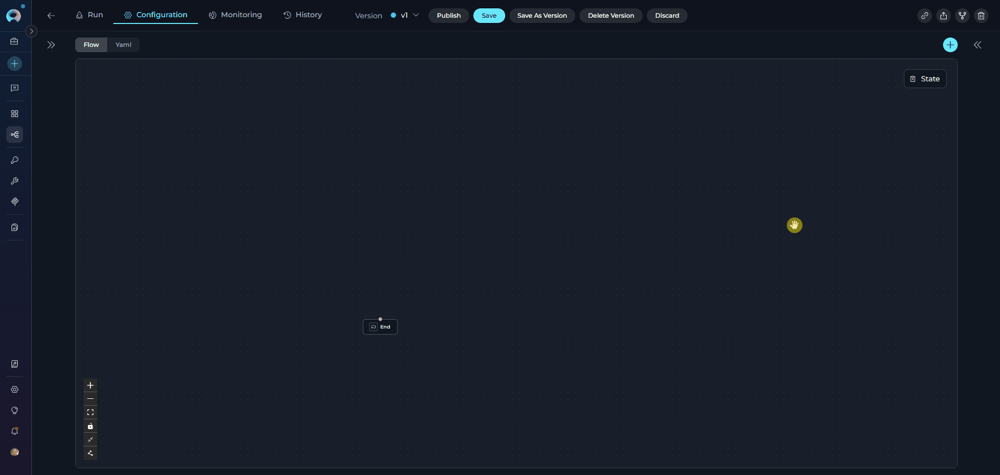
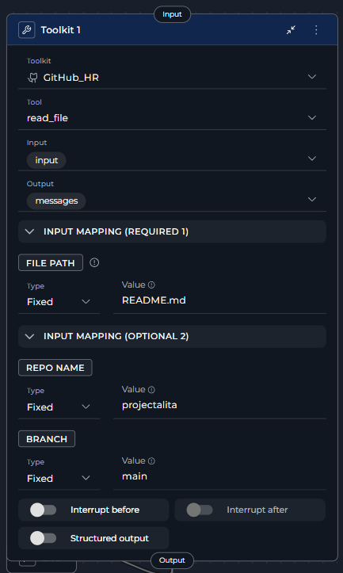
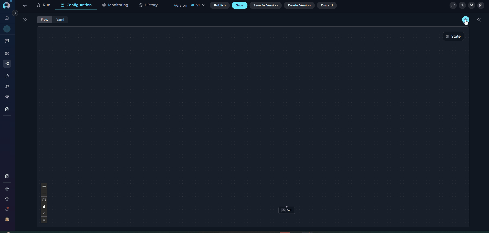
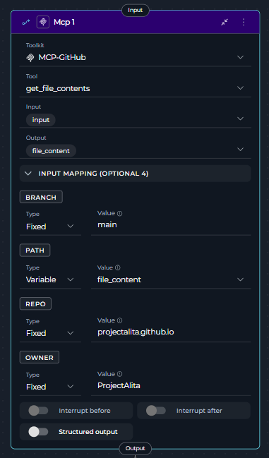
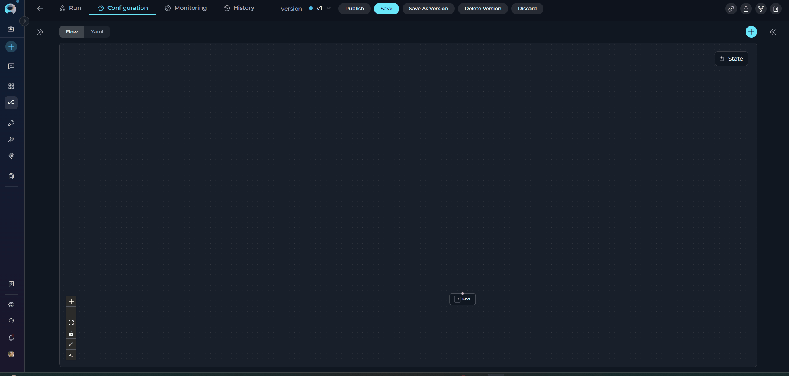
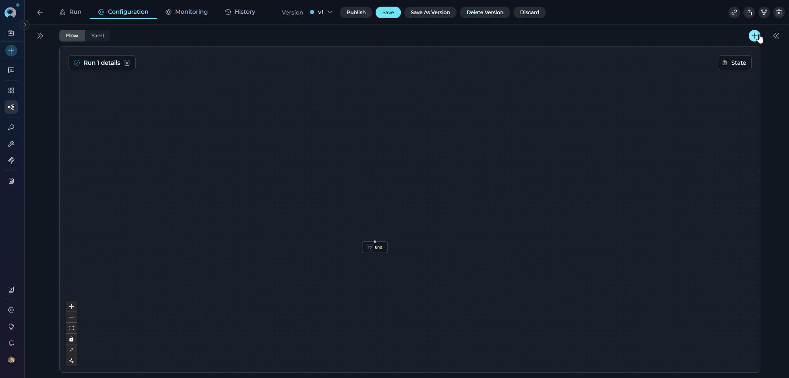

# Execution Nodes

Execution Nodes enable your pipeline to perform actions, call external tools, execute code, and integrate with APIs. These nodes form the "action" layer of your workflow, transforming data, triggering external systems, and performing computational tasks.

**Available Execution Nodes:**

* **[Toolkit Node](#toolkit-node)** - Execute ELITEA toolkit functions with direct parameter mapping
* **[MCP Node](#mcp-node)** - Execute Model Context Protocol (MCP) server tools
* **[Code Node](#code-node)** - Execute custom Python code in a secure sandbox
* **[Custom Node](#custom-node)** - Advanced manual JSON configuration for complex integrations

---

## Toolkit Node

The Toolkit Node executes specific tools from ELITEA Toolkits with direct parameter mapping. It provides fast, deterministic execution without LLM overhead, making it ideal for scenarios where you know exactly which tool to call and how to configure its parameters.

{loading=lazy}

**Purpose**

Use the Toolkit Node to:

* **Execute ELITEA toolkit functions** directly without LLM decision-making
* **Call external APIs** through toolkit integrations (Jira, GitHub, Slack, Confluence, etc.)
* **Perform deterministic actions** where the tool and parameters are known upfront
* **Map pipeline state** directly to tool parameters
* **Chain multiple toolkit calls** in sequence with precise control

!!! note "Toolkit Node Scope"
    Toolkit Nodes can use **ELITEA Toolkits** only (not MCPs). For MCP servers, use the MCP Node.

**Parameters**

| Parameter | Purpose | Type Options & Examples |
|-----------|---------|-------------------------|
| **Toolkit** | Select which ELITEA Toolkit contains the tool you want to execute | **Toolkits** - External service integrations<br><br>**Selection Process:**<br>1. Select Toolkit from dropdown<br>2. Tool dropdown appears<br>3. Select specific tool<br><br>Example: `jira_toolkit`|
| **Tool** | Select the specific tool/function to execute from the chosen toolkit | Dropdown populated with all available tools from selected toolkit<br><br>**jira_toolkit:** `create_issue`, `update_issue`, `search_issues`, `execute_generic_rq`|
| **Input** | Specify which state variables the Toolkit node reads from | **Default states:** `input`, `messages`<br>**Custom states:** Any defined state variables<br><br>Example:<br>`- project_id`<br>`- issue_title`<br>`- input` |
| **Output** | Define which state variables the tool's result should populate | **Default:** `messages`<br>**Custom states:** Specific variables<br><br>Example:<br>`- jira_ticket_id`<br>`- messages` |
| **Input Mapping** | Map pipeline state variables to the tool's required parameters (appears after tool selection) | **F-String** - Formatted string with variables<br>Example: `user_story_{ticket_id}_v{version}.md`<br><br>**Variable** - Direct state reference<br>Example: `generated_content`<br><br>**Fixed** - Static value<br>Example: `production-reports`<br><br>**Categories:**<br>- Required parameters (must provide)<br>- Optional parameters (can be null) |
| **Structured Output** | Enable parsing of tool output as structured data for state variable updates | **Enabled (true):** Tool output parsed as structured data<br>**Disabled (false):** Tool output goes to `messages`<br><br>Example: `true` or `false` |
| **Interrupt Before** | Pause pipeline execution before this node | **Enabled** / **Disabled** |
| **Interrupt After** | Pause pipeline execution after this node for inspection | **Enabled** / **Disabled** |

{width=300 loading=lazy}

**YAML Configuration**

```yaml
nodes:
  - id: Toolkit 1
    type: toolkit
    input:
      - input
    input_mapping:
      branch:
        type: fixed
        value: main
      file_path:
        type: fixed
        value: README.md
      repo_name:
        type: fixed
        value: projectalita
    output:
      - messages
    structured_output: false
    tool: read_file
    toolkit_name: GitHub_HR
    transition: END
```

!!! info "Input Mapping Configuration"
    The Input Mapping section dynamically displays **only the parameters required by the selected tool**. Each toolkit tool has different required and optional parameters. Select your tool first to see available mapping options.

!!! warning "Single Toolkit and Tool Selection"
    Each Toolkit Node can select only **one toolkit** and **one tool**. For multiple tool executions, create separate Toolkit Nodes and chain them together.

**Best Practices**

* **Map Required Parameters Correctly** - Ensure all required parameters have proper mappings
* **Use Appropriate Type for Each Parameter**
    * **Variable**: When value comes from state
    * **F-String**: When you need dynamic interpolation
    * **Fixed**: For static, unchanging values
* **Handle Optional Parameters** - Set optional parameters to `null` if not needed
* **Include Output Variables** - Capture important results in output variables
* **Use Interrupts for Debugging** - Enable interrupts when testing new integrations
* **Validate State Variables** - Ensure input state variables exist before the Toolkit node executes
* **Use Structured Output** - Enable structured output when you need to extract specific fields from tool results
* **Chain Toolkit Calls** - Create workflows by sequencing Toolkit nodes

---

## MCP Node

The MCP Node executes tools from Model Context Protocol (MCP) servers with direct parameter mapping. It connects to remote MCP servers via HTTP and provides access to their tools without LLM overhead.

{loading=lazy}


**Purpose**

Use the MCP Node to:

* **Execute MCP server tools** directly with explicit parameter configuration
* **Connect to remote MCP servers** via HTTP/HTTPS
* **Access specialized MCP tools** (Playwright, GitHub, Figma, etc.)
* **Map pipeline state** directly to MCP tool parameters
* **Enable/disable specific tools** from MCP servers

!!! note "MCP Node Scope"
    MCP Nodes can use **Model Context Protocol servers** only. For ELITEA Toolkits, use the Toolkit Node.

**Parameters**

| Parameter | Purpose | Type Options & Examples |
|-----------|---------|-------------------------|
| **MCP Server** | Select which MCP server contains the tool you want to execute | **MCPs** - Model Context Protocol servers<br><br>**Selection Process:**<br>1. Select MCP from dropdown<br>2. Tool dropdown appears<br>3. Select specific tool<br><br>Example: `GitHub-MCP` |
| **Tool** | Select the specific tool/function to execute from the chosen MCP server | Dropdown populated with all available tools from selected MCP server<br><br>**filesystem_mcp:** `search_code`, `get_file_content`, `list_directory`<br><br>**database_mcp:** `query`, `insert`, `update` |
| **Input** | Specify which state variables the MCP node reads from | **Default states:** `input`, `messages`<br>**Custom states:** Any defined state variables<br><br>Example:<br>`- file_path`<br>`- content`<br>`- input` |
| **Output** | Define which state variables the tool's result should populate | **Default:** `messages`<br>**Custom states:** Specific variables<br><br>Example:<br>`- file_content`<br>`- messages` |
| **Input Mapping** | Map pipeline state variables to the MCP tool's required parameters (appears after tool selection) | **F-String** - Formatted string with variables<br>Example: `reports/{date}/summary.md`<br><br>**Variable** - Direct state reference<br>Example: `file_content`<br><br>**Fixed** - Static value<br>Example: `/data/reports`<br><br>**Categories:**<br>- Required parameters (must provide)<br>- Optional parameters (can be null) |
| **Structured Output** | Enable parsing of MCP tool output as structured data for state variable updates | **Enabled (true):** Tool output parsed as structured data<br>**Disabled (false):** Tool output goes to `messages`<br><br>Example: `true` or `false` |
| **Interrupt Before** | Pause pipeline execution before this node | **Enabled** / **Disabled** |
| **Interrupt After** | Pause pipeline execution after this node for inspection | **Enabled** / **Disabled** |

{width=300 loading=lazy}

**YAML Configuration**

```yaml
state:
  file_content:
    type: str
    value: ''
  file_path:
    type: str
    value: tests.md
  input:
    type: str
  messages:
    type: list
entry_point: Mcp 1
interrupt_after: []
nodes:
  - id: Mcp 1
    type: mcp
    input:
      - input
    input_mapping:
      branch:
        type: fixed
        value: main
      owner:
        type: fixed
        value: ProjectAlita
      path:
        type: variable
        value: file_content
      repo:
        type: fixed
        value: projectalita.github.io
    output:
      - file_content
    structured_output: false
    tool: get_file_contents
    toolkit_name: MCP-GitHub
    transition: END

```

!!! info "MCP Connection Required"
    MCP servers must be properly configured and connected before using the MCP Node. Ensure the MCP server is running and accessible via HTTP/HTTPS.

!!! warning "Single MCP and Tool Selection"
    Each MCP Node can select only **one MCP server** and **one tool**. For multiple MCP tool executions, create separate MCP Nodes and chain them together.

**Best Practices**

* **Verify MCP Connection** - Ensure the MCP server is connected and accessible before pipeline execution
* **Map Required Parameters Correctly** - MCP tools have specific parameter requirements
* **Use Appropriate Type for Each Parameter**
    * **Variable**: When value comes from state
    * **F-String**: When you need dynamic path/value interpolation
    * **Fixed**: For static configurations
* **Handle Errors** - MCP server connection failures will stop pipeline execution
* **Use Structured Output** - Enable when extracting specific data from MCP tool results
* **Test MCP Tools** - Use the MCP test panel to verify tool functionality before using in pipelines
* **Monitor Timeouts** - Configure appropriate timeout values for MCP server connections

---

## Custom Node

The Custom Node enables advanced manual JSON configuration for complex integrations. It provides full control via JSON-based configuration, allowing users to configure any available toolkit (Agents, Pipelines, Toolkits, MCPs) with custom parameters.

{loading=lazy}

**Purpose**

Use the Custom Node for:

* **Advanced manual configurations** not available through standard node UI
* **Complex toolkit integrations** requiring custom JSON parameters
* **Experimental features** or beta toolkit capabilities
* **Full parameter control** for power users
* **Custom agent/pipeline/toolkit configurations** with specific requirements

!!! warning "Advanced Users Only"
    Custom Node requires deep knowledge of toolkit JSON schemas and configuration parameters. Use standard nodes (Toolkit, MCP, LLM, Agent) unless you have specific advanced requirements.

**Parameters**

Configuration is done entirely through JSON in the Custom Node editor. Refer to individual toolkit documentation for required JSON structure and parameters.

**Example YAML Configuration**

```yaml
nodes:
  - id: Custom 1
    type: custom
    input:
      - input
    output:
      - messages
    config:
      # Custom JSON configuration here
      toolkit_type: "advanced_toolkit"
      parameters:
        custom_param1: "value1"
        custom_param2: true
    transition: END
```

---

## Code Node

The Code Node enables secure execution of custom Python code within a sandboxed environment using Pyodide (Python compiled to WebAssembly). It provides full Python capabilities for data processing, calculations, and custom logic without accessing the host system.

{loading=lazy}

**Purpose**

Use the Code Node to:

* **Execute custom Python logic** for data transformation and processing
* **Perform calculations** that don't require external tool integrations
* **Process pipeline state** with full programming control
* **Implement business rules** and conditional logic in Python
* **Transform data formats** between pipeline nodes
* **Call external APIs** directly from Python (with network access enabled)
* **Install Python packages** dynamically using micropip

**Parameters**

| Parameter | Purpose | Type Options & Examples |
|-----------|---------|-------------------------|
| **Code** | Python code to execute in the sandbox | **Type: Fixed** - Static code block<br>**Type: Variable** - Code from state variable<br>**Type: F-String** - Formatted code with variables<br><br>**Fixed Example:**<br>```python<br>result = alita_state.get('value', 0) * 2<br>{"doubled": result}<br>```<br><br>**Variable Example:**<br>```yaml<br>code:<br>  type: variable<br>  value: python_code_variable<br>```<br><br>**F-String Example:**<br>```yaml<br>code:<br>  type: fstring<br>  value: "result = {threshold} * 2\n{\"output\": result}"<br>``` |
| **Input** | State variables accessible to the code via `alita_state` dictionary | **Default:** `input`, `messages`<br>**Custom:** Any defined state variables<br><br>Example:<br>`- raw_data`<br>`- min_score`<br><br>Access in code: `alita_state.get('raw_data', [])` |
| **Output** | State variables to populate with execution results | **Default:** `messages` (if omitted or includes `messages`)<br>**Custom:** Specific variables (must exist in state)<br><br>Example:<br>`- processed_data`<br>`- count`<br><br>**Important:** Only listed variables will be updated |
| **Structured Output** | Parse code output as structured data for state updates | **Enabled (true):** Code must return dictionary; keys matching output variables will update state<br>**Disabled (false):** Output appended to `messages`<br><br>Example: `true` or `false`<br><br>See detailed behavior below |
| **Interrupt Before** | Pause pipeline before code execution | **Enabled** / **Disabled** |
| **Interrupt After** | Pause pipeline after code execution for result inspection | **Enabled** / **Disabled** |

{loading=lazy}

**YAML Configuration Examples**

??? example "Basic Example: Simple Calculation"

    ```yaml
    nodes:
      - id: calculate_total
        type: code
        code:
          type: fixed
          value: |
            # Access state variables
            numbers = alita_state.get('numbers', [])
            
            # Calculate total
            total = sum(numbers)
            
            # Return result
            {"total": total}
        input:
          - numbers
        output:
          - total
        structured_output: true
        transition: END
    state:
      input:
        type: str
      messages:
        type: list
      numbers:
        type: list
        value: []
      total:
        type: int
        value: 0
    ```

??? example "Advanced Example: Data Processing with Error Handling"

    ```yaml
    nodes:
      - id: process_user_data
        type: code
        code:
          type: fixed
          value: |
            import json
            
            # Access input data from state
            raw_data = alita_state.get('raw_data', [])
            min_score = alita_state.get('min_score', 50)
            
            # Process with error handling
            try:
                processed = []
                for item in raw_data:
                    score = item.get('score', 0)
                    if score >= min_score:
                        processed.append({
                            'id': item['id'],
                            'name': item['name'],
                            'grade': 'Pass',
                            'score': score
                        })
                
                {
                    "processed_data": processed,
                    "count": len(processed),
                    "status": "success"
                }
            except Exception as e:
                {
                    "error": str(e),
                    "status": "failed",
                    "count": 0
                }
        input:
          - raw_data
          - min_score
        output:
          - processed_data
          - count
          - status
        structured_output: true
        transition: END
    state:
      input:
        type: str
      messages:
        type: list
      raw_data:
        type: list
        value: []
      min_score:
        type: int
        value: 50
      processed_data:
        type: list
        value: []
      count:
        type: int
        value: 0
      status:
        type: str
        value: ''
    ```

??? example "API Integration Example: External HTTP Calls"

    ```yaml
    nodes:
      - id: fetch_api_data
        type: code
        code:
          type: fixed
          value: |
            import httpx
            import json
            
            query = alita_state.get('search_query', '')
            api_url = f"https://api.example.com/search?q={query}"
            
            try:
                # Use httpx for async HTTP calls (Pyodide compatible)
                async with httpx.AsyncClient() as client:
                    response = await client.get(api_url, timeout=10.0)
                    data = response.json()
                
                {
                    "api_results": data.get('results', []),
                    "result_count": len(data.get('results', [])),
                    "status": "success"
                }
            except Exception as e:
                {
                    "error": str(e),
                    "status": "failed",
                    "result_count": 0
                }
        input:
          - search_query
        output:
          - api_results
          - result_count
          - status
        structured_output: true
        transition: END
    state:
      input:
        type: str
      messages:
        type: list
      search_query:
        type: str
        value: ''
      api_results:
        type: list
        value: []
      result_count:
        type: int
        value: 0
      status:
        type: str
        value: ''
    ```

??? example "Package Installation Example: Using External Libraries"

    ```yaml
    nodes:
      - id: data_analysis
        type: code
        code:
          type: fixed
          value: |
            # Install numpy via micropip
            import micropip
            await micropip.install('numpy')
            import numpy as np
            
            # Access data from state
            values = alita_state.get('values', [])
            
            if not values:
                {"error": "No values provided", "status": "failed"}
            else:
                # Perform analysis with numpy
                data = np.array(values)
                
                {
                    "mean": float(np.mean(data)),
                    "median": float(np.median(data)),
                    "std_dev": float(np.std(data)),
                    "min": float(np.min(data)),
                    "max": float(np.max(data)),
                    "status": "success"
                }
        input:
          - values
        output:
          - mean
          - median
          - std_dev
          - min
          - max
          - status
        structured_output: true
        transition: END
    state:
      input:
        type: str
      messages:
        type: list
      values:
        type: list
        value: []
      mean:
        type: float
        value: 0.0
      median:
        type: float
        value: 0.0
      std_dev:
        type: float
        value: 0.0
      min:
        type: float
        value: 0.0
      max:
        type: float
        value: 0.0
      status:
        type: str
        value: ''
    ```

??? example "Conditional Logic Example: Business Rules"

    ```yaml
    nodes:
      - id: apply_business_rules
        type: code
        code:
          type: fixed
          value: |
            user_age = alita_state.get('user_age', 0)
            user_type = alita_state.get('user_type', 'guest')
            
            # Apply business logic
            if user_age < 18:
                category = "minor"
                allowed_actions = ["read", "comment"]
            elif user_type == "premium":
                category = "premium_adult"
                allowed_actions = ["read", "comment", "post", "moderate"]
            else:
                category = "standard_adult"
                allowed_actions = ["read", "comment", "post"]
            
            {
                "user_category": category,
                "allowed_actions": allowed_actions,
                "access_level": len(allowed_actions)
            }
        input:
          - user_age
          - user_type
        output:
          - user_category
          - allowed_actions
          - access_level
        structured_output: true
        transition: END
    state:
      input:
        type: str
      messages:
        type: list
      user_age:
        type: int
        value: 0
      user_type:
        type: str
        value: 'guest'
      user_category:
        type: str
        value: ''
      allowed_actions:
        type: list
        value: []
      access_level:
        type: int
        value: 0
    ```

??? example "Alita Client Integration Example: Accessing Artifacts"

    ```yaml
    nodes:
      - id: list_artifacts
        type: code
        code:
          type: fixed
          value: |
            # Access Alita client (automatically injected when available)
            try:
                # List artifacts from a bucket
                bucket_name = alita_state.get('bucket_name', 'test')
                artifacts = alita_client.list_artifacts(bucket_name=bucket_name)
                
                {
                    "artifacts": artifacts,
                    "count": len(artifacts),
                    "status": "success"
                }
            except Exception as e:
                {
                    "error": str(e),
                    "status": "failed",
                    "count": 0
                }
        input:
          - bucket_name
        output:
          - artifacts
          - count
          - status
        structured_output: true
        transition: END
    state:
      input:
        type: str
      messages:
        type: list
      bucket_name:
        type: str
        value: 'test'
      artifacts:
        type: list
        value: []
      count:
        type: int
        value: 0
      status:
        type: str
        value: ''
    ```

!!! info "Output Handling: With or Without Output Variables"
    **Without Output Variables (or includes `messages`):**
    
    Results are added to `messages` array:
    ```yaml
    - id: simple_code
      type: code
      code:
        type: fixed
        value: |
          "Hello, World!"
      # No output specified - result goes to messages
    ```
    
    **With Specific Output Variables:**
    
    Results populate the specified variables:
    ```yaml
    - id: calculate
      type: code
      code:
        type: fixed
        value: |
          12345
      output:
        - calculation_result
      # Result stored in calculation_result variable
    ```
    
    **With Structured Output:**
    
    Return dictionary to update multiple variables:
    ```yaml
    - id: structured_code
      type: code
      code:
        type: fixed
        value: |
          {
            "user_name": "John Doe",
            "user_score": 95
          }
      output:
        - user_name
        - user_score
      structured_output: true
    ```

!!! tip "State Access & Alita Client (SandboxClient) Capabilities"
    **State Access:**
    
    Access pipeline state via `alita_state` dictionary using `alita_state.get('variable_name', default_value)`.
    
    **Alita Client:**
    
    When available, `alita_client` is automatically injected into the Code Node sandbox environment. It provides access to:
    
    **Artifact Operations:**
    
    - `alita_client.artifact(bucket_name)` - Access artifact operations for a specific bucket
        - `.create(artifact_name, artifact_data, bucket_name=None)` - Create/upload artifact
        - `.get(artifact_name, bucket_name=None)` - Download/read artifact content
        - `.delete(artifact_name, bucket_name=None)` - Delete artifact
        - `.list(bucket_name=None, return_as_string=True)` - List all artifacts in bucket
        - `.append(artifact_name, additional_data, bucket_name=None)` - Append data to existing artifact
        - `.overwrite(artifact_name, new_data, bucket_name=None)` - Replace artifact content
        - `.get_content_bytes(artifact_name, bucket_name=None)` - Get artifact as raw bytes
    
    **Bucket Operations:**
    
    - `alita_client.bucket_exists(bucket_name)` - Check if bucket exists
    - `alita_client.create_bucket(bucket_name, expiration_measure='months', expiration_value=1)` - Create new bucket
    - `alita_client.list_artifacts(bucket_name)` - List artifacts in bucket (direct method)
    - `alita_client.create_artifact(bucket_name, artifact_name, artifact_data)` - Create artifact (direct method)
    - `alita_client.download_artifact(bucket_name, artifact_name)` - Download artifact (direct method)
    - `alita_client.delete_artifact(bucket_name, artifact_name)` - Delete artifact (direct method)
    
    **Application & Integration Operations:**
    
    - `alita_client.get_app_details(application_id)` - Get application configuration
    - `alita_client.get_list_of_apps()` - List all available applications
    - `alita_client.get_app_version_details(application_id, application_version_id)` - Get specific app version
    - `alita_client.get_integration_details(integration_id, format_for_model=False)` - Get integration configuration
    - `alita_client.unsecret(secret_name)` - Retrieve secret value
    - `alita_client.fetch_available_configurations()` - List available configurations
    - `alita_client.all_models_and_integrations()` - List AI models and integrations
    
    **MCP Tool Operations:**
    
    - `alita_client.get_mcp_toolkits()` - List available MCP toolkits
    - `alita_client.mcp_tool_call(params)` - Call MCP tool with parameters
    
    **Image Generation:**
    
    - `alita_client.generate_image(prompt, n=1, size='auto', quality='auto', response_format='b64_json', style=None)` - Generate images using AI models
    
    **User Operations:**
    
    - `alita_client.get_user_data()` - Get current user information
    
    **Example Usage:**
    ```python
    # Create and manage artifacts
    bucket = alita_client.artifact('my-bucket')
    bucket.create('report.txt', 'Analysis results...')
    content = bucket.get('report.txt')
    bucket.list()
    
    # Direct artifact operations
    alita_client.create_artifact('my-bucket', 'data.json', '{"key": "value"}')
    data = alita_client.download_artifact('my-bucket', 'data.json')
    
    # Access secrets
    api_key = alita_client.unsecret('my-api-key')
    
    # Get application details
    app = alita_client.get_app_details(application_id=123)
    ```

!!! warning "Structured Output Behavior"
    When `structured_output: true`, the Code Node expects a dictionary return where keys correspond to state variable names:
    
    **State Before Execution:**
    ```yaml
    user_name: "Alice"
    user_score: 85
    ```
    
    **Code Returns:**
    ```python
    {
      "user_name": "Bob",
      "user_score": 90,
      "timestamp": "2024-01-01T00:00:00Z"
    }
    ```
    
    **Output Configuration:**
    ```yaml
    output:
      - user_name
      - user_score
    ```
    
    **State After Execution:**
    ```yaml
    user_name: "Bob"      # Updated
    user_score: 90        # Updated
    timestamp: <ignored>  # Not in output list
    ```
    
    **Important Rules:**
    
    - Only variables listed in `output` will be updated
    - Variables not defined in pipeline `state` will be ignored
    - If output is omitted or includes `messages`, results append to messages
    - Non-messages output variables are overridden with results or error messages

!!! note "Code Execution Environment"
    - **Sandbox:** Pyodide (Python compiled to WebAssembly) provides secure isolation
    - **Standard Library:** Full Python standard library available
    - **Package Installation:** Use `import micropip; await micropip.install('package-name')` for additional packages
    - **Network Access:** Enabled by default for external API calls (use `httpx` instead of `requests`)
    - **Performance:** Stateless execution by default for optimal performance; local caching reduces initialization time
    - **Limitations:** File system access not supported; use `httpx.AsyncClient` for HTTP calls instead of `requests`

**Integration with Pipeline Flow**

Code Nodes seamlessly integrate into pipeline workflows through transitions:

```yaml
nodes:
  - id: extract_data
    type: llm
    # LLM extracts data from user input
    transition: process_data
    
  - id: process_data
    type: code
    code:
      type: fixed
      value: |
        # Access data from previous node
        extracted = alita_state.get('extracted_data', [])
        
        # Process and transform
        processed = [item.upper() for item in extracted if item]
        
        {"processed_items": processed}
    input:
      - extracted_data
    output:
      - processed_items
    structured_output: true
    transition: generate_report
    
  - id: generate_report
    type: llm
    # LLM generates report using processed data
    transition: END
```

**Sequential Execution Benefits:**

* **Data Transformation:** Clean and format data between nodes
* **Validation:** Verify data meets requirements before proceeding
* **Enrichment:** Add computed fields or external data
* **Conditional Routing:** Calculate which path to take next
* **State Management:** Transform state structure for downstream nodes

---

**Best Practices**

   * **Return Structured Data:** When using `structured_output: true`, always return dictionaries with keys matching output variables
   * **Handle Errors Gracefully:** Include try-except blocks to catch and return errors as part of the structured output
   * **Validate Input Data:** Check state variables exist and have expected types before processing using `alita_state.get('var', default)`
   * **Use Descriptive Output Variables:** Name output variables clearly (e.g., `total_revenue`, `average_score` instead of `result1`, `result2`)
   * **Keep Code Focused:** Each Code Node should have one clear purpose - avoid combining multiple unrelated operations
   * **Document Complex Logic:** Use Python comments to explain business rules, calculations, and non-obvious operations
   * **Test with Interrupts:** Enable interrupts during development to review code execution results and debug issues
   * **Optimize Performance:** Avoid heavy computations in frequently called nodes; use efficient data structures
   * **Use Async for HTTP:** Use `httpx.AsyncClient` for HTTP requests (Pyodide compatible) instead of `requests`
   * **Install Packages Carefully:** Package installation adds latency; install only necessary packages
   * **Handle JSON Serialization:** Ensure returned objects are JSON-serializable (native Python types, lists, dicts)
   * **Access Alita Client:** Use `alita_client` when available for artifact operations and API interactions

### Troubleshooting

**Common Issues and Solutions**


??? warning "Error: Deno is required for PyodideSandbox but is not installed"

    **Cause:** The Deno JavaScript runtime is missing
    
    **Solution:** Install Deno and ensure it's in your system PATH
    ```powershell
    # Windows (PowerShell)
    irm https://deno.land/install.ps1 | iex
    ```

??? warning "Error: Object is not serializable"

    **Cause:** Code returns non-JSON-serializable objects (classes, functions, etc.)
    
    **Solution:** Return only JSON-serializable types (str, int, float, bool, list, dict, None)
    ```python
    # Bad - not serializable
    class MyClass:
        pass
    return {"result": MyClass()}
    
    # Good - serializable
    return {"result": {"name": "value", "count": 42}}
    ```

??? warning "Error: ModuleNotFoundError: No module named 'package'"

    **Cause:** Required package not available in Pyodide environment
    
    **Solution:** Install package using micropip (note: not all packages are compatible)
    ```python
    import micropip
    await micropip.install('numpy')
    import numpy as np
    ```
    
    **Limitations:** Some packages with C extensions may not work in Pyodide

??? warning "Error: Output variables not updating"

    **Cause:** Variables not listed in `output` or `structured_output` is false
    
    **Solution:** 
    
    1. Ensure `structured_output: true`
    2. List all target variables in `output`
    3. Return dictionary with matching keys
    
    ```yaml
    output:
      - result
      - status
    structured_output: true
    ```
    ```python
    return {"result": 42, "status": "success"}
    ```

??? warning "Error: httpx or network requests failing"

    **Cause:** Using `requests` library (not Pyodide compatible) or network disabled
    
    **Solution:** Use `httpx.AsyncClient` for HTTP calls
    ```python
    import httpx
    
    async with httpx.AsyncClient() as client:
        response = await client.get(url)
        data = response.json()
    ```

---

## Execution Nodes Comparison

| Feature | Toolkit Node | MCP Node | Code Node | Custom Node |
|---------|--------------|----------|-----------|-------------|
| **Purpose** | Execute ELITEA toolkit functions | Execute MCP server tools | Execute custom Python code | Advanced JSON configuration |
| **Toolkit Types** | ELITEA Toolkits | MCP Servers | N/A (Python sandbox) | Any (Toolkits, MCPs, Agents, Pipelines) |
| **Tool Selection** | Manual (user selects) | Manual (user selects) | N/A | Manual JSON config |
| **Parameter Mapping** | Explicit Input Mapping | Explicit Input Mapping | State via `alita_state` | Custom JSON |
| **LLM Usage** | No LLM | No LLM | No LLM | Depends on config |
| **Configuration** | UI-based parameter mapping | UI-based parameter mapping | Python code editor | JSON editor |
| **Structured Output** | Supported | Supported | Supported | Depends on config |
| **Flexibility** | Medium (predefined tools) | Medium (MCP tools) | Very High (full Python) | Very High (full JSON control) |
| **Complexity** | Medium | Medium | High (requires Python) | Very High (requires JSON expertise) |
| **Performance** | Fast (direct execution) | Fast (direct execution) | Fast (compiled sandbox) | Varies |
| **Best For** | ELITEA toolkit calls | MCP server integrations | Custom logic, calculations | Advanced custom integrations |

### When to Use Each Node

??? note "Toolkit Node"

    **Choose Toolkit Node when you**:

    * Need to call ELITEA toolkit functions (Jira, GitHub, Slack, Confluence, etc.)
    * Know exactly which toolkit and tool to use
    * Have straightforward parameter mapping
    * Need fast, deterministic execution
    * Want explicit control over toolkit execution

    **Example**: Create a Jira ticket with known project, summary, and description.

??? note "MCP Node" Node"

    **Choose MCP Node when you**:

    * Need to execute MCP server tools
    * Have a configured MCP server connection
    * Know exactly which MCP tool to call
    * Have explicit parameter requirements
    * Need direct MCP integration

    **Example**: Read a file from a filesystem MCP server with a known path.

??? note "Code Node"Node"

    **Choose Code Node when you**:

    * Need custom Python logic
    * Require data transformation or processing
    * Implement business rules and calculations
    * Call external APIs directly
    * Have logic too complex for standard nodes

    **Example**: Calculate tiered discounts based on customer segment, order value, and first-order status.

??? note "Custom Node"Node"

    **Choose Custom Node when you**:

    * Have advanced configuration requirements not supported by standard nodes
    * Need full JSON control over toolkit configuration
    * Work with experimental or beta toolkit features
    * Require complex parameter structures
    * Are a power user with specific custom needs

    **Example**: Configure an advanced toolkit with custom JSON parameters not exposed in standard UI.

---

## Deprecated Execution Nodes

The following execution nodes are deprecated and will be removed in a future release. Please migrate to the recommended alternatives:

??? warning "Function Node"

    The **Function** node is deprecated and will be removed in an upcoming release.

    **Migration:** Use the **Toolkit** node for ELITEA toolkits or the **MCP** node for Model Context Protocol servers.

    **Key Differences:**
    
    * **Function Node** → **Toolkit Node**: Direct replacement for ELITEA toolkit calls
    * **Function Node** → **MCP Node**: Direct replacement for MCP server tool calls
    
    **Migration Steps:**
    
    1. Identify whether your Function node uses an ELITEA Toolkit or MCP server
    2. Replace with Toolkit Node (for toolkits) or MCP Node (for MCPs)
    3. Copy Input Mapping configuration to new node
    4. Update YAML `type` field from `function` to `toolkit` or `mcp`
    5. Test pipeline execution

    **Migration Guide:** [Function Node Migration](../../../migration/v2.0.1/function-node-migration.md)

??? warning "Tool Node"

    The **Tool** node is deprecated and will be removed in an upcoming release.

    **Migration:** Use the **Toolkit** node for direct toolkit execution without LLM preprocessing.

    **Key Differences:**
    
    * **Tool Node** uses LLM to select tools and generate parameters from natural language tasks
    * **Toolkit Node** executes tools directly with explicit parameter mapping (faster, more reliable)
    
    **Migration Steps:**
    
    1. Replace Tool Node with Toolkit Node
    2. Convert natural language task to explicit Input Mapping
    3. Manually map task parameters to tool parameters
    4. Update YAML `type` field from `tool` to `toolkit`
    5. Remove `task` field, keep `input_mapping`
    6. Test pipeline execution

    **Migration Guide:** [Tool Node Migration](../../../migration/v2.0.1/tool-node-migration.md)

---

!!! info "Related"
    - **[Nodes Overview](overview.md)** - Understand all available node types
    - **[Interaction Nodes](interaction-nodes.md)** - LLM and Agent nodes for AI-powered tasks
    - **[Control Flow Nodes](control-flow-nodes.md)** - Router, and Decision nodes
    - **[States](../states.md)** - Manage data flow through pipeline state
    - **[Connections](../nodes-connectors.md)** - Link nodes together
    - **[YAML Configuration](../yaml.md)** - See complete node syntax examples
