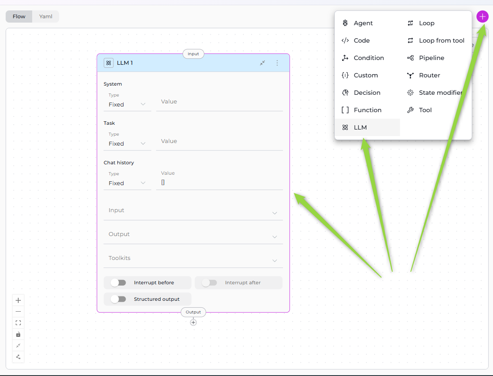
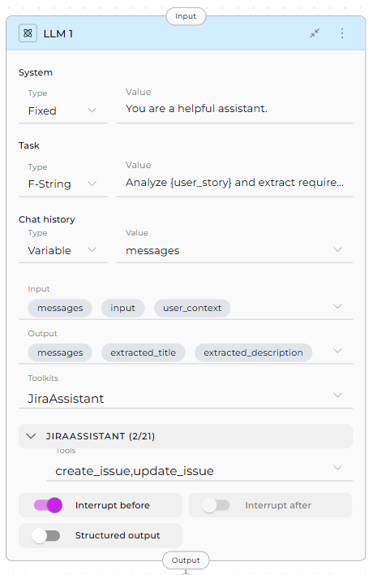
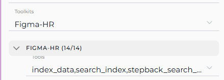
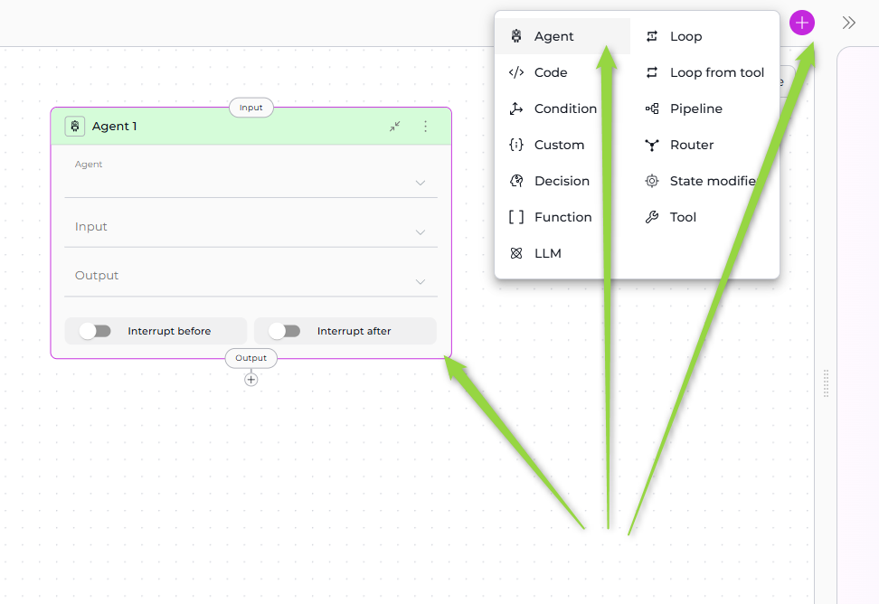
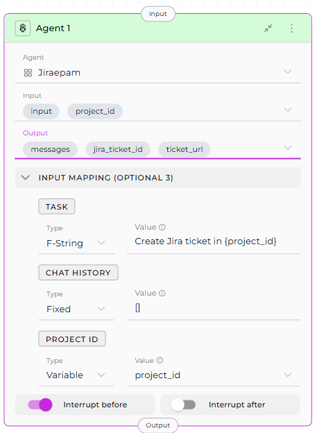

# Interaction Nodes

Interaction Nodes enable your pipeline to communicate with AI models and delegate tasks to specialized agents. These nodes form the "intelligent" layer of your workflow, allowing pipelines to generate text, analyze content, make decisions, and leverage pre-built AI capabilities.

**Available Interaction Nodes:**

* **[LLM Node](#llm-node)** - Directly interact with Large Language Models
* **[Agent Node](#agent-node)** - Delegate tasks to pre-configured AI agents

---

## LLM Node

The LLM Node provides direct access to Large Language Models (GPT-4, Claude, etc.) for text generation, analysis, extraction, and decision-making. It's the most versatile interaction node, supporting chat history, tool calling, and structured output extraction.

!!! note "Migrating from v1.x LLM Nodes"
    If you have existing pipelines with old LLM node format, see the [v2.0.0 Migration Guide](../../../migration/v2.0.0/update-llm-nodes.md) for updating to the new System/Task structure.



### Purpose

Use the LLM Node to:

* **Generate text** based on prompts and context
* **Analyze content** and extract insights
* **Extract structured data** from unstructured text
* **Have conversations** with full chat history support
* **Call tools** via function calling
* **Make intelligent decisions** based on context

### Parameters

| Parameter | Purpose | Type Options & Examples |
|-----------|---------|-------------------------|
| **System** | Provide system-level instructions that set the LLM's behavior, role, or constraints | **`Fixed`** - Static system message<br>Example: "You are a helpful assistant."<br><br>**`F-String`** - System message with variables<br>Example: "You are a {role} expert."<br><br>**`Variable`** - System message from state<br>Example: custom_system_prompt |
| **Task** | Define the specific task or user request the LLM should process | **`Fixed`** - Static task<br>Example: "Summarize the text."<br><br>**`F-String`** - Task with embedded variables<br>Example: "Analyze {user_story} and extract requirements."<br><br>**`Variable`** - Task from state variable<br>Example: task_instruction |
| **Chat History** | Provide conversation context from previous interactions | **`Fixed`** - No history<br>Example: []<br><br>**`F-String`** - Formatted conversation history<br>Example: "Previous conversation: {messages}"<br><br>**`Variable`** - Use conversation history<br>Example: messages |
| **Input** | Specify which state variables the LLM node reads from | **Default states:** `input`, `messages`<br>**Custom states:** Any defined state variables<br><br>Example:<br>`- input`<br>`- messages`<br>`- user_context` |
| **Output** | Define which state variables the LLM's response should populate | **Default:** `messages`<br>**Custom states:** Define specific variables<br><br>Example:<br>`- extracted_title`<br>`- extracted_description`<br>`- messages` |
| **Toolkits** | Bind external tools and MCPs to the LLM for function calling | **Toolkits** - Service integrations<br>**MCPs** - Model Context Protocol servers<br><br>Example:<br>`jira_toolkit:`<br>`  - create_issue`<br>`  - update_issue`<br>`slack_toolkit:`<br>`  - send_message` |
| **Interrupt Before** | Pause pipeline execution before this node | **Enabled** / **Disabled**<br><br>Example: `enabled` or `disabled` |
| **Interrupt After** | Pause pipeline execution after this node for inspection | **Enabled** / **Disabled**<br><br>Example: `enabled` or `disabled` |
| **Structured Output** | Force LLM to return data in structured format matching output variables | **Enabled** - Response parsed into state variables<br>**Disabled** - Free-form text to `messages`<br><br>Example: `true` or `false` |




**Yaml Configuration**
```Yaml
nodes:
  - id: Analyze_feedback
    type: llm
    prompt:
      type: string
      value: ''
    input:
      - input
      - user_context
    output:
      - extracted_title
      - messages
    structured_output: false
    transition: END
    input_mapping:
      system:
        type: fixed
        value: You are a helpful assistant
      task:
        type: fstring
        value: Analyze {user_story} and extract requirements.
      chat_history:
        type: variable
        value: messages
    tool_names:
      JiraAssistant:
        - create_issue
        - update_issue
interrupt_before:
  - Analyze_feedback
state:
  messages:
    type: list
  input:
    type: str
  extracted_title:
    type: str
    value: ''
  user_context:
    type: str
    value: ''
```

!!! warning "Important: Messages in Output for Interrupts"
    When using **structured output** with **interrupts**, include `messages` in the output variables for meaningful interrupt output.

!!! info "Toolkit Selection Process"
    1. Select Toolkit/MCP from dropdown
    2. Tool dropdown appears for that toolkit
    3. Select specific tools to make available to the LLM
    4. Repeat for multiple toolkits (each gets its own tool dropdown)
    


### Best Practices

#### 1. Always Include `messages` in Output for Interrupts

When using structured output with interrupts:

✅ **Correct**:
```yaml
output: ["extracted_data", "status", "messages"]
structured_output: true
```

❌ **Avoid**:
```yaml
output: ["extracted_data", "status"]  # Missing messages
structured_output: true
```

#### 2. Use Appropriate Prompt Types

* **Fixed**: For static, unchanging instructions
* **F-String**: When you need to inject specific state variables
* **Variable**: When the entire prompt comes from state

#### 3. Limit Tool Binding

Only bind tools the LLM actually needs:

✅ **Good**: Select specific relevant tools
```yaml
toolkits:
  jira_toolkit:
    - create_issue
    - update_issue
```

❌ **Avoid**: Binding all tools unnecessarily
```yaml
toolkits:
  jira_toolkit:
    - [all 50+ tools selected]  # Confuses LLM
```

#### 4. Structure Your Prompts

Use clear, structured prompts:

✅ **Good**:
```yaml
prompt:
  type: "fstring"
  value: |
    ## Task
    Analyze the user story: {user_story}
    
    ## Requirements
    Extract:
    1. Title
    2. Description
    3. Acceptance Criteria
    
    ## Output Format
    Provide structured data for each field.
```

❌ **Avoid**: Vague prompts
```yaml
prompt:
  type: "fixed"
  value: "Do something with the data"
```

#### 5. Specify Output Variables Clearly

Match output variables to what you're extracting:

✅ **Good**:
```yaml
output: ["jira_project_id", "epic_id", "user_story_title", "messages"]
structured_output: true
```

#### 6. Use Chat History Wisely

* Include `messages` in input when context matters
* Use `[]` (empty array) for stateless single-turn requests

#### 7. Test with Interrupts

Use interrupts during development to verify LLM outputs:

```yaml
interrupt_after: true  # Pause after this node to inspect results
```

#### 8. Handle Tool Calling Errors

When using toolkits, account for potential tool failures in your prompt:

```yaml
prompt:
  type: "fixed"
  value: |
    Use available tools to complete the task.
    If a tool fails, explain what went wrong and suggest alternatives.
```

---

## Agent Node

The Agent Node allows you to delegate tasks to pre-configured AI agents that have been added to your pipeline. Instead of configuring LLM behavior from scratch, you leverage existing agents with specialized capabilities, prompts, and toolkits.



### Purpose

Use the Agent Node to:

* **Delegate complex tasks** to specialized agents
* **Reuse existing agents** across multiple pipelines
* **Maintain consistency** with pre-configured agent behavior
* **Simplify workflows** by avoiding duplicate LLM configuration
* **Leverage agent-specific toolkits** and integrations

### Parameters

| Parameter | Purpose | Type Options & Examples |
|-----------|---------|-------------------------|
| **Agent** | Select which pre-configured agent to execute | Only agents added to the pipeline appear in dropdown<br><br>**How to Add:**<br>1. Go to Pipeline Configuration > Toolkits<br>2. Select agents<br>3. Added agents become available<br><br>Example: `jira_assistant_agent` |
| **Input** | Specify which state variables the agent reads from | **Default states:** `input`, `messages`<br>**Custom states:** Any defined state variables<br><br>Example:<br>`- project_id`<br>`- input` |
| **Output** | Define which state variables the agent's response should populate | **Default:** `messages`<br>**Custom states:** Specific variables<br><br>Example:<br>`- jira_ticket_id`<br>`- ticket_url`<br>`- messages` |
| **Task (Input Mapping)** | Map the specific task instruction for the agent | **`Fixed`** - Static task<br>Example: "Create a Jira ticket for this issue."<br><br>**`F-String`** - Task with variables<br>Example: "Create Jira ticket in {project_id}: {user_story}"<br><br>**`Variable`** - Task from state<br>Example: task_instruction |
| **Chat History (Input Mapping)** | Map conversation context to provide to the agent | **`Fixed`** - No history<br>Example: []<br><br>**`F-String`** - Formatted history<br>Example: "Previous context: {messages}"<br><br>**`Variable`** - Use conversation history<br>Example: messages |
| **Custom Variables (Input Mapping)** | Map agent-specific custom variables if defined | **`Fixed`** - Static value<br>**`F-String`** - Value with variables<br>**`Variable`** - Value from state<br><br>Example (if agent has `jira_project`):<br>`jira_project: PROJ-123` |
| **Interrupt Before** | Pause pipeline execution before this node | **Enabled** / **Disabled**<br><br>Example: `enabled` or `disabled` |
| **Interrupt After** | Pause pipeline execution after this node for inspection | **Enabled** / **Disabled**<br><br>Example: `enabled` or `disabled` |



**Yaml Configuration**

```yaml
nodes:
  - id: Agent 1
    type: agent
    input:
      - input
      - project_id
    output:
      - jira_ticket_id
      - ticket_url
      - messages
    transition: END
    input_mapping:
      task:
        type: fstring
        value: Create Jira ticket in {project_id}
      chat_history:
        type: fixed
        value: []
      project_id:
        type: variable
        value: project_id
    tool: Jiraepam
interrupt_before:
  - Agent 1
state:
  messages:
    type: list
  input:
    type: str
  project_id:
    type: str
    value: ''
  jira_ticket_id:
    type: str
    value: ''
  ticket_url:
    type: str
    value: ''
```

!!! info "Agent Selection and Input Mapping"
    The Input Mapping section appears **after** you select an agent. Every agent includes **TASK** and **CHAT_HISTORY** mappings. If the agent has custom variables, they also appear as mapping options.

!!! warning "Add Agents to Pipeline First"
    Before using Agent Node, ensure agents are added in **Pipeline Configuration > Toolkits** section. Only added agents appear in the dropdown.

### Best Practices

#### 1. Add Agents to Pipeline First

Ensure the agent is added in Pipeline Configuration > Toolkits section before using Agent Node.

#### 2. Map Task Clearly

Provide clear, specific task instructions:

✅ **Good**:
```yaml
task:
  type: "fstring"
  value: "Create Jira ticket in project {project_id} with title '{title}', description '{description}', and priority {priority}."
```

❌ **Avoid**:
```yaml
task:
  type: "variable"
  value: "input"  # Too vague
```

#### 3. Use Chat History Appropriately

- **With History**: Use when agent needs conversation context
- **Without History**: Use `[]` for independent, stateless tasks

#### 4. Map Custom Variables Correctly

If agent has custom variables, map them to pipeline state:

✅ **Good**:
```yaml
input_mapping:
  jira_project:
    type: "variable"
    value: "project_id"
  sprint_number:
    type: "variable"
    value: "current_sprint"
```

#### 5. Include `messages` in Output

For debugging and continuity, include `messages`:

```yaml
output: ["agent_result", "messages"]
```

#### 6. Use Interrupts for Testing

Test agent behavior with interrupts:

```yaml
interrupt_after: true  # Review agent output
```

#### 7. Reuse Agents Across Pipelines

Create specialized agents once, reuse in multiple pipelines for consistency.

#### 8. Handle Agent Failures

Consider error handling in subsequent nodes:

```yaml
- id: "check_agent_result"
  type: "router"
  condition: "agent_result is not None"
  routes: ["success_path", "error_path"]
```

---

## Interaction Nodes Comparison

| Feature | LLM Node | Agent Node |
|---------|----------|------------|
| **Purpose** | Direct LLM interaction with full control | Delegate to pre-configured specialized agents |
| **Configuration** | Configure prompt, system, task from scratch | Use existing agent configuration |
| **Prompt** | Define in node (Fixed/F-String/Variable) | Inherited from agent, customized via Task mapping |
| **Toolkits** | Select Toolkits & MCPs, choose specific tools | Agent's toolkits are pre-configured |
| **Input** | State variables (input, messages, custom) | State variables (input, messages, custom) |
| **Output** | State variables (messages, custom) | State variables (messages, custom) |
| **Input Mapping** | Not applicable (direct state access) | Map pipeline state to agent parameters (Task, Chat History, custom variables) |
| **Structured Output** | Supported (enable via toggle) | Depends on agent configuration |
| **Conversation History** | Controlled via Chat history parameter | Controlled via CHAT_HISTORY mapping |
| **Reusability** | Node-specific configuration | Agent can be reused across pipelines |
| **Flexibility** | Highly flexible, configure everything | Limited to agent's design |
| **Complexity** | More setup required | Simpler, leverages existing agent |
| **Use Case** | Custom tasks, one-off requests, full control | Specialized tasks, consistent behavior, reusable workflows |

### When to Use LLM Node

✅ **Choose LLM Node when you need**:

* Full control over prompts and behavior
* Custom tool binding for specific workflow
* One-off or unique LLM interactions
* Structured output extraction
* Simple text generation without pre-configuration

### When to Use Agent Node

✅ **Choose Agent Node when you**:

* Have an existing agent that does exactly what you need
* Want to reuse agent logic across multiple pipelines
* Need consistent behavior from pre-configured agents
* Want to simplify pipeline by delegating to specialists
* Have agents with specific domain knowledge or toolkits

!!! tip "Combining Both"
    You can use both node types in the same pipeline:
    * **LLM Node** for custom, ad-hoc processing
    * **Agent Node** for specialized, reusable tasks

---

!!! info "Related"
    - **[Nodes Overview](overview.md)** - Understand all available node types
    - **[Execution Nodes](execution-nodes.md)** - Call external tools and execute code
    - **[States](../states.md)** - Manage data flow through pipeline state
    - **[Connections](../nodes-connectors.md)** - Link nodes together
    - **[YAML Configuration](../yaml.md)** - See complete node syntax examples
    - **[Updating LLM Nodes (v2.0.0 Migration)](../../../migration/v2.0.0/update-llm-nodes.md)** - Guide for migrating old LLM nodes to new format
