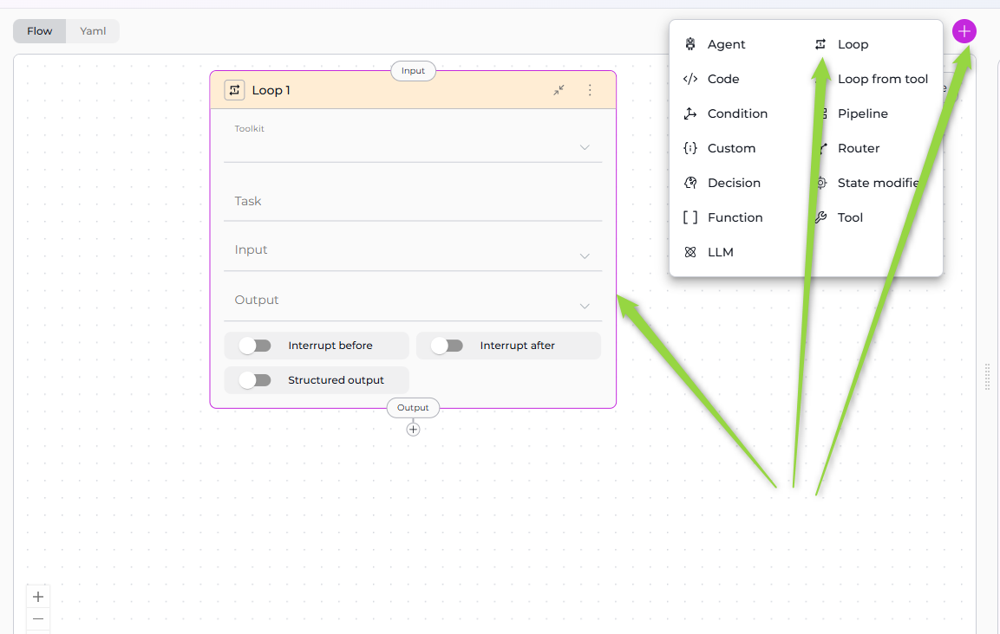
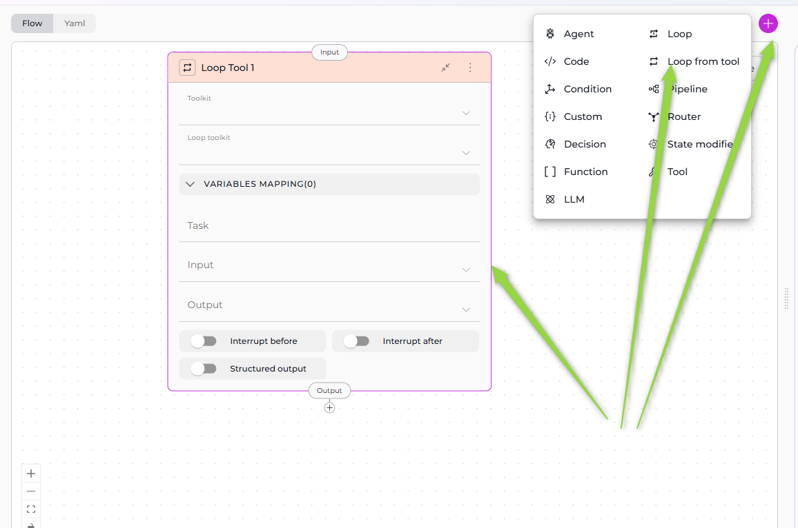

# Iteration Nodes

Iteration Nodes enable your pipeline to perform repetitive tasks, processing multiple items systematically. These nodes form the "looping" layer of your workflow, allowing pipelines to handle lists, batch operations, and iterative processing with precision and control.

**Available Iteration Nodes:**

* **[Loop Node](#loop-node)** - Execute a toolkit repeatedly based on task instructions
* **[Loop from Tool Node](#loop-from-tool-node)** - Generate a list dynamically and process each item
* **[Router Node (for Loops)](#router-node-for-loops)** - Create custom loop structures with conditional routing

!!! note "Understanding Iteration"
    Iteration nodes are powerful but can be complex. They allow you to process multiple items (files, records, tasks) in a single pipeline execution, making them essential for automation and batch processing workflows. You can also create custom loops using Router nodes for more precise control over iteration logic.

---

## Loop Node

The Loop Node executes a selected toolkit repeatedly, creating input for each iteration based on task instructions. It's designed for scenarios where you know what needs to be iterated over and can describe how to create inputs for each iteration.



### Purpose

Use the Loop Node to:

* **Process lists of items** where you define iteration logic in the Task field
* **Execute the same action repeatedly** with different inputs
* **Automate batch operations** across multiple entities
* **Iterate through data** extracted from state or previous nodes
* **Repeat toolkit execution** until all items are processed

### Parameters

| Parameter | Purpose | Type Options & Examples |
|-----------|---------|-------------------------|
| **Toolkit** | Select the toolkit type that will be executed in each loop iteration | **Options:**<br>- Toolkits - ELITEA toolkits (e.g., GitHub, Jira, Confluence)<br>- MCPs - Model Context Protocol servers<br>- Agents - ELITEA agents<br>- Pipelines - Other pipeline executions<br><br>**Toolkit Selection Behavior:**<br>- When you select **Toolkits** or **MCPs**: A **Tool** dropdown appears; you must select a specific tool<br>- When you select **Agents** or **Pipelines**: No additional dropdown; the toolkit is executed directly<br><br>**Example - Toolkit with Tool:**<br>`toolkit: "llm-node"`<br>`tool: "createFile"`<br><br>**Example - Agent:**<br>`toolkit: "Code Documentation Agent"` |
| **Tool** | Select the specific tool from the chosen toolkit or MCP | **Availability:** Only appears when Toolkit is set to **Toolkits** or **MCPs**<br><br>**Example:**<br>`toolkit: "GitHub Expert"`<br>`tool: "createFile"`<br><br>**Tool Selection:**<br>- Dropdown shows all available tools from the selected toolkit/MCP<br>- Each toolkit provides different tools<br>- Tool parameters are configured through the Task field and input mapping |
| **Task** | Provide instructions on how to formulate the input for each iteration of the loop | **Format:** Natural language instructions describing how to extract or create input data from the current state or chat history<br><br>**Example Task:**<br>`task: \|`<br>`  Formulate ALL file paths from chat_history as a list of inputs.`<br>`  For each file path, create input as:`<br>`  - "task": the file path`<br>`  - "chat_history": the entire conversation history`<br><br>**Common Task Patterns:**<br>- Extract from Chat History<br>- Process State Variable List<br>- Generate Range<br>- Parse JSON Array<br><br>**How Task Works:** The Loop Node uses the Task instructions with an internal LLM to analyze the current state, identify items to iterate over, generate a list of inputs, and execute the toolkit for each input |
| **Input** | Specify which state variables the Loop Node reads when executing the Task instructions | **Options:**<br>- Default states: `input`, `messages`<br>- Custom states: Any state variables you've defined<br><br>**Example:**<br>`input: ["messages", "file_list", "project_id"]`<br><br>**Usage in Task:** The Loop Node uses these input variables to extract items to iterate over, provide context for iteration logic, and access data needed for each iteration |
| **Output** | Specify state variable names to store the results from all loop iterations | **Options:**<br>- Single output: Results concatenated as string<br>- Multiple outputs: Different aspects of results<br><br>**Example:**<br>`output: ["documentation_results", "processed_count"]`<br><br>**Output Accumulation:** All iteration results joined into one string; results from each iteration are appended; final output contains complete results from all iterations |
| **Structured Output** | Enable structured output parsing for loop results | **Options:**<br>- Enabled (toggle on): Parse toolkit responses as structured data<br>- Disabled (toggle off): Treat responses as plain text<br><br>**When to Enable:**<br>- Toolkit returns JSON or structured data<br>- You need to extract specific fields from results<br>- Results will be used in subsequent nodes with structured input<br><br>**Example:**<br>`structured_output: true` |

**YAML Configuration**

```yaml
- id: "process_files"
  type: "loop"
  toolkit: "Code Documentation Agent"
  task: |
    Formulate ALL file paths from chat_history as a list of inputs.
    For each file path, create input as:
    - "task": the file path
    - "chat_history": the entire conversation history
  input: ["messages"]
  output: ["documentation"]
  structured_output: false
  transition: "END"
```

!!! info "Task Clarity"
    Be specific in your Task instructions. The clearer you are about what to extract and how to format it, the more reliably the Loop Node will execute.

!!! warning "Structured Output Requirements"
    Only enable structured output if the toolkit being called actually returns structured data (JSON, dict). Otherwise, parsing may fail.

!!! warning "Performance Considerations"
    Each iteration executes the toolkit, which may involve LLM calls, API requests, or external tool execution. For large lists (100+ items), consider batching, pagination, or implementing error handling.

### Best Practices
   - Write Clear Task Instructions: Provide explicit, step-by-step instructions on what to extract and how to format inputs.
   - Specify Input Variables: List all state variables the Task needs to access for iteration logic.
   - Use Structured Output When Appropriate: Enable structured output for JSON-returning toolkits.
   - Provide Clear Output Names: Name outputs to indicate what they contain (e.g., "documentation_results" not "result").
   - Consider Performance: Be mindful of iteration count; test with small lists first before scaling up.
   - Test with Small Lists First: Start with 2-3 items to verify logic, then scale to full list.
   - Handle Empty Lists: Account for scenarios with no items; ensure Task returns empty list if nothing found.
   - Use Descriptive Toolkit Names: Select toolkits with clear purposes for maintainability.
   - Document Expected Input Format: Comment on what the Task expects (e.g., "Expects messages to contain file paths").
   - Plan Transition After Loop: Ensure next node handles loop output properly.

---

## Loop from Tool Node

The Loop from Tool Node is a two-stage iteration mechanism: first, it executes a toolkit to generate a list of items, then it processes each item in that list using a second toolkit. This is ideal for dynamic iteration where the list of items isn't known beforehand.


### Purpose

Use the Loop from Tool Node to:

* **Dynamically generate iteration lists** using a toolkit
* **Process items from tool outputs** (e.g., files from a directory, tickets from Jira)
* **Chain two toolkits** where first generates inputs for second
* **Automate discovery and processing** workflows
* **Handle variable-length lists** determined at runtime



### Parameters

| Parameter | Purpose | Type Options & Examples |
|-----------|---------|-------------------------|
| **Toolkit (List Generator)** | Select the toolkit that will generate the list of items to iterate over | **Options:**<br>- Toolkits - ELITEA toolkits<br>- MCPs - Model Context Protocol servers<br>- Agents - ELITEA agents<br>- Pipelines - Other pipelines<br><br>**First-Stage Toolkit:** This toolkit is executed **once** at the beginning to generate the list<br>- For **Toolkits/MCPs**: Must select a specific **Tool**<br>- For **Agents/Pipelines**: Toolkit is executed directly<br><br>**Example:**<br>`toolkit: "GitHub Expert"`<br>`tool: "getFilesFromDirectory"` |
| **Tool (List Generator Tool)** | Select the specific tool that generates the item list | **Availability:** Only appears when Toolkit is set to **Toolkits** or **MCPs**<br><br>**Example:**<br>`toolkit: "GitHub Expert"`<br>`tool: "getFilesFromDirectory"`<br><br>**Tool Output Requirements:** The tool must return structured data (list or array) |
| **Loop Toolkit (Item Processor)** | Select the toolkit that will process each item in the generated list | **Options:**<br>- Toolkits - ELITEA toolkits<br>- MCPs - Model Context Protocol servers<br>- Agents - ELITEA agents<br>- Pipelines - Other pipelines<br><br>**Second-Stage Toolkit:** This toolkit is executed **for each item** in the list<br>- For **Toolkits/MCPs**: Must select a specific **Loop Tool**<br>- For **Agents/Pipelines**: Toolkit is executed directly<br><br>**Example:**<br>`loop_toolkit: "llm-node"`<br>`loop_tool: "createFile"` |
| **Loop Tool (Item Processor Tool)** | Select the specific tool that processes each item | **Availability:** Only appears when Loop Toolkit is set to **Toolkits** or **MCPs**<br><br>**Example:**<br>`loop_toolkit: "llm-node"`<br>`loop_tool: "createFile"`<br><br>**Loop Tool Input:** The loop tool receives input from Variables Mapping for each item |
| **Variables Mapping** | Map output fields from the list-generating tool to input parameters of the item-processing tool | **Critical Component:** This is the most important configuration for Loop from Tool nodes<br><br>**Format:**<br>`variables_mapping:`<br>`  <output_field>: <input_parameter>`<br><br>**Example:**<br>`variables_mapping:`<br>`  file_path: "task"`<br>`  file_content: "source_code"`<br>`  bucket_name: "BUCKET_NAME"`<br><br>**Mapping Types:**<br>- **Type: Fixed** - Direct mapping<br>- **Type: F-String** - Format string<br>- **Type: Variable** - Combine variables |
| **Task** | Optional instructions for the list-generating toolkit (first stage) | **Usage:** Provide context or instructions to the tool that generates the list<br><br>**Example:**<br>`task: "Get all Python files from the src directory"`<br><br>**When to Use Task:**<br>- List-generating toolkit needs specific instructions<br>- You want to filter or customize the list generation<br>- Agent or LLM-based toolkit requires context |
| **Input** | Specify state variables needed by the list-generating toolkit | **Example:**<br>`input: ["repository_name", "directory_path", "file_extension"]`<br><br>**Input Usage:** The first-stage toolkit uses these inputs to generate the list |
| **Output** | Specify state variable names to store accumulated results from all loop iterations | **Example:**<br>`output: ["documentation_results", "file_count"]`<br><br>**Output Accumulation:** Results from each iteration of the loop tool are accumulated; all loop tool responses combined into single output; final output contains results from processing all items |
| **Structured Output** | Enable structured output parsing for the list-generating tool | **When to Enable:**<br>- List tool returns JSON or structured data<br>- You need to parse array of objects<br>- Variables Mapping depends on structured fields<br><br>**Example:**<br>`structured_output: true` |

**YAML Configuration**

```yaml
- id: "document_github_files"
  type: "loop_from_tool"
  toolkit: "GitHub Expert"
  tool: "getFilesFromDirectory"
  loop_toolkit: "Code Documentation Agent"
  variables_mapping:
    file_path: "task"
    file_content: "source_code"
  input: ["repository_name"]
  output: ["documentation"]
  structured_output: true
  transition: "create_readme"
```

!!! tip "Structured Output for List Generation"
    Almost always enable `structured_output: true` for Loop from Tool nodes, since the list tool must return an array or list of items to iterate over.

!!! warning "Variables Mapping Requirement"
    Variables Mapping is **mandatory** for Loop from Tool nodes. Without it, the loop tool won't know how to receive data from the list tool.

!!! warning "Performance Warning"
    Loop from Tool executes loop toolkit **for each item** in the list. Large lists can result in many iterations. Test with small lists first and consider rate limits.

### Best Practices

   * Ensure List Tool Returns Structured Data: The first toolkit must return an array of objects with consistent fields.
   * Map All Required Loop Tool Parameters: Include all necessary mappings for the item processor tool.
   * Enable Structured Output: Always enable for list generation since the tool must return an array.
   * Test List Generation First: Verify the list tool works before adding loop processing; check field names in output.
   * Use Descriptive Variable Names: Clear mapping names improve readability (e.g., "customer_id" not "id").
   * Handle Empty Lists: Ensure list tool returns empty array `[]` not null; loop skips execution if list is empty.
   * Consider List Size Limits: Be aware of iteration count; test with small subsets first.
   * Provide Input for List Tool: Ensure list tool has needed context (repository name, directory path, etc.).
   * Use Task for Additional Context: Provide instructions to list tool (e.g., "Get only Python files modified in last 7 days").
   * Document Mapping Expectations: Comment expected structure from list tool and what loop tool expects.
   * Plan for Failures: Consider what happens if list tool fails; test with empty repositories, missing directories.
   * Chain Outputs Properly: Ensure accumulated output is usable by next node.

---

## Router Node (for Loops)

The Router Node, typically used for conditional branching, can also create custom loop structures by routing execution back to previous nodes. This approach provides more precise control over loop conditions and iteration logic compared to dedicated Loop nodes.

### Purpose

Use the Router Node for loops to:

* **Create custom iteration logic** with explicit loop control conditions
* **Route back to previous nodes** to repeat execution
* **Control loop termination** using state variables (counters, flags, conditions)
* **Implement complex loop patterns** that Loop and Loop from Tool nodes don't support
* **Combine conditional logic with iteration** in a single node

### How It Works

Router-based loops follow this pattern:

1. **Initialize**: Set up loop control variables (counter, list index, continuation flag) in state
2. **Process**: Execute processing nodes (LLM, Function, Tool, Code nodes)
3. **Update State**: Modify loop control variables (increment counter, update flag, process next item)
4. **Route Decision**: Router evaluates loop condition:
   - **Continue Loop**: Routes back to processing node if condition met (e.g., counter < max)
   - **Exit Loop**: Routes to next node or END if loop should terminate
5. **Repeat**: Steps 2-4 repeat until exit condition is met

### Configuration Pattern

**Basic Loop Structure:**

```yaml
nodes:
  - id: InitializeLoop
    type: state_modifier
    template: "{{ 0 }}"  # Initialize counter
    output:
      - loop_counter
    transition: ProcessItem
    
  - id: ProcessItem
    type: llm
    # Processing logic here
    transition: UpdateCounter
    
  - id: UpdateCounter
    type: code
    code:
      type: fixed
      value: |
        counter = alita_state.get('loop_counter', 0)
        max_iterations = alita_state.get('max_iterations', 10)
        return {
          "loop_counter": counter + 1,
          "continue_loop": counter + 1 < max_iterations
        }
    input:
      - loop_counter
      - max_iterations
    output:
      - loop_counter
      - continue_loop
    structured_output: true
    transition: LoopRouter
    
  - id: LoopRouter
    type: router
    condition: |
      
      ProcessItem
      
      END
      
    routes:
      - ProcessItem
      - END
    input:
      - continue_loop
    default_output: END

state:
  loop_counter:
    type: int
    value: 0
  max_iterations:
    type: int
    value: 10
  continue_loop:
    type: bool
    value: true
```

### Loop Patterns

**Counter-Based Loop:**
- Initialize counter to 0
- Process item
- Increment counter
- Router checks if counter < max_iterations
- Routes back to process or exits

**List Processing Loop:**
- Initialize list index to 0
- Process current item at index
- Increment index
- Router checks if index < list length
- Routes back to process next item or exits

**Condition-Based Loop:**
- Initialize continuation flag
- Process and update state
- Code node sets flag based on condition (e.g., task complete, error occurred)
- Router checks flag
- Routes back to process or exits

### Best Practices

   * Initialize Loop Variables: Always set up counters, flags, or indices before entering the loop.
   * Prevent Infinite Loops: Include explicit termination conditions (max iterations, completion flag) to ensure loops exit.
   * Use State Variables for Control: Track loop state with dedicated variables (loop_counter, current_index, continue_flag).
   * Update State Between Iterations: Use Code or State Modifier nodes to update loop control variables after each iteration.
   * Route Explicitly: Define both continue and exit paths clearly in Router condition.
   * Set Maximum Iterations: Always include a max iteration limit as a safety measure.
   * Test Loop Termination: Verify loops exit correctly under all conditions (normal completion, error, max iterations).
   * Document Loop Logic: Comment YAML to explain loop purpose, termination condition, and iteration count.
   * Consider Performance: Router-based loops execute synchronously; for large iteration counts, consider Loop or Loop from Tool nodes.
   * Use Descriptive Variable Names: Name loop control variables clearly (loop_counter not i, continue_processing not flag).

### When to Use Router for Loops

**Choose Router-based loops when you**:

* Need custom loop termination logic not supported by Loop nodes
* Want explicit control over every iteration
* Require complex conditional logic combined with iteration
* Need to route to different processing paths within the loop
* Have simple iteration requirements (< 20 iterations typically)

**Use dedicated Loop nodes when you**:

* Processing large lists (20+ items)
* Loop logic fits Loop or Loop from Tool patterns
* Performance is critical (dedicated Loop nodes are optimized)
* Iteration logic is straightforward (process each item in a list)

---

## Iteration Nodes Comparison

| Feature | Loop Node | Loop from Tool Node | Router Node (for Loops) |
|---------|-----------|---------------------|------------------------|
| **Purpose** | Execute toolkit repeatedly based on task instructions | Generate list dynamically, then process each item | Create custom loop structures with conditional routing |
| **Input Source** | Task instructions describe how to extract/create inputs | First toolkit generates the list of inputs | State variables (counters, flags, conditions) |
| **Iteration Logic** | Defined in Task field using natural language | Defined by output of list-generating toolkit | Defined by Router condition template |
| **Toolkit Selection** | Single toolkit (Toolkits/MCPs/Agents/Pipelines) | Two toolkits: list generator + item processor | N/A (uses other nodes for processing) |
| **Tool Selection** | Optional (for Toolkits/MCPs only) | Two tools: list tool + loop tool (for Toolkits/MCPs) | N/A |
| **Variables Mapping** | Not applicable | **Required** - maps list tool outputs to loop tool inputs | Not applicable (uses state variables) |
| **Loop Control** | Internal (LLM-based from Task) | Internal (list length) | Explicit (Router condition evaluates state) |
| **Configuration Complexity** | Medium (Task instructions) | High (two toolkits + variables mapping) | Medium-High (multiple nodes + state management) |
| **Use When** | You can describe iteration logic in Task | You need to dynamically discover items to process | You need custom loop control logic |
| **List Generation** | Internal (from Task + LLM) | External (from toolkit execution) | Manual (via state variables) |
| **Example Use Case** | Process file paths mentioned in chat | Get files from GitHub directory and process each | Counter-based loop, process until condition met |
| **Performance** | Task execution + N toolkit calls | List tool call + N loop toolkit calls | N iterations through pipeline nodes |
| **Termination Control** | Task-defined or list exhaustion | List exhaustion | Explicit condition in Router |
| **Output** | Accumulated results from all iterations | Accumulated results from all loop iterations | Accumulated via state updates |
| **Flexibility** | Medium | Medium | Very High (complete control) |
| **Best For** | Simple iteration with natural language | Dynamic list discovery + processing | Custom loop logic, complex conditions |

### When to Use Each Node

#### Loop Node ✅

**Choose Loop Node when you**:

* Can describe iteration logic in natural language
* Know what items to process (from state or chat history)
* Want simple configuration with task instructions
* Don't need dynamic list discovery
* Prefer LLM-based input generation

**Example**: Process file paths mentioned in chat, iterate through known list of tasks, generate reports for ID range 1-100.

#### Loop from Tool Node ✅

**Choose Loop from Tool Node when you**:

* Need to dynamically discover items at runtime
* Items come from external source (GitHub, Jira, database)
* List generation requires toolkit execution
* Want to chain two toolkits (discovery + processing)
* Need structured mapping between tools

**Example**: Get all files from GitHub directory then document each, list Confluence pages then process each, discover Jira tickets then update each.

#### Router Node (for Loops) ✅

**Choose Router Node for loops when you**:

* Need custom loop termination conditions
* Want explicit control over iteration logic
* Require complex conditional routing within loops
* Have simple iteration requirements (< 20 iterations)
* Need to combine branching and iteration logic

**Example**: Process items until condition met, retry operation with counter limit, iterate through workflow steps with conditional branching.

---

!!! info "Related"
    - **[Nodes Overview](overview.md)** - Understand all available node types
    - **[Execution Nodes](execution-nodes.md)** - Function, Tool, Code nodes for task execution
    - **[Control Flow Nodes](control-flow-nodes.md)** - Router, Condition, Decision nodes
    - **[States](../states.md)** - Manage data flow through pipeline state
    - **[Connections](../nodes-connectors.md)** - Link nodes together
    - **[YAML Configuration](../yaml.md)** - See complete node syntax examples
