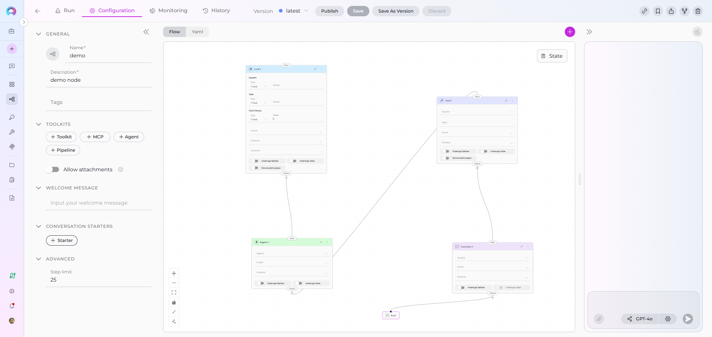
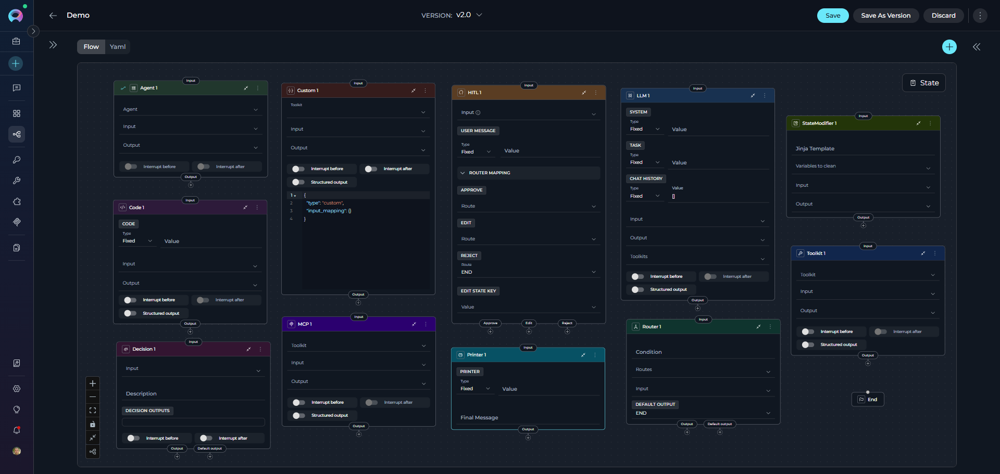

# Pipeline Nodes Overview

Nodes are the **fundamental building blocks** of ELITEA Pipelines—individual steps that perform specific actions within your workflow. Each node:

* Performs one specific task (call an AI model, execute code, make a decision)
* Reads input from pipeline state
* Writes output back to state
* Connects to other nodes to form a workflow

Nodes execute sequentially or conditionally based on your configuration.



``` Yaml
nodes:
  - id: LLM 1
    type: llm
    prompt:
      type: string
      value: ''
    input: []
    output: []
    structured_output: false
    transition: Agent 1
    input_mapping:
      system:
        type: fixed
        value: ''
      task:
        type: fixed
        value: ''
      chat_history:
        type: fixed
        value: []
  - id: Agent 1
    type: agent
    input: []
    output: []
    transition: Tool 1
    input_mapping: {}
  - id: Tool 1
    type: tool
    tool: ''
    input: []
    output: []
    structured_output: false
    transition: Function 1
  - id: Function 1
    type: function
    tool: ''
    input: []
    output: []
    structured_output: false
    input_mapping: {}
    condition:
      conditional_outputs:
        - Custom 1
  - id: Custom 1
    type: custom
    input_mapping: {}
    transition: Router 1
  - id: Router 1
    type: router
    default_output: ''
    routes:
      - Code 1
    input: []
    condition: ''
  - id: Code 1
    type: code
    code:
      type: fixed
      value: ''
    input: []
    output: []
    structured_output: false
    transition: Pipeline 1
  - id: Pipeline 1
    type: pipeline
    input: []
    output: []
    transition: StateModifier 1
  - id: StateModifier 1
    type: state_modifier
    template: ''
    variables_to_clean: []
    input: []
    output: []
    transition: Loop 1
  - id: Loop 1
    type: loop
    task: ''
    tool: ''
    input: []
    output: []
    structured_output: false
    transition: Loop Tool 1
  - id: Loop Tool 1
    type: loop_from_tool
    tool: ''
    loop_tool: ''
    input: []
    output: []
    structured_output: false
    transition: END
```


## Execution Flow

When a pipeline runs:

1. **Entry Point** - Execution begins at the starting node
2. **Node Execution** - The node reads from state, performs its action, and writes results
3. **Transition** - Execution moves to the next node based on configuration
4. **Iteration** - Process continues until reaching END or completing all nodes

!!! tip "State is Shared"
    All nodes share the same state. Data written by one node is immediately available to subsequent nodes.

## Common Node Attributes

All nodes share these common configuration attributes:

### Core Attributes

**`id`** (required)
: Unique identifier for the node within the pipeline. Must be unique across all nodes.

```yaml
id: "process_request"
```

**`type`** (required)
: Node type (llm, agent, function, tool, code, etc.). Determines behavior and available parameters.

```yaml
type: "llm"
```

### Input/Output Attributes

**`input`** (optional, default: `["input"]`)
: List of state variable names the node reads from. Defines which parts of the state the node can access.

```yaml
input: ["user_input", "messages", "config"]
```

**`output`** (optional, default: `[]`)
: List of state variable names the node writes to. Specifies where the node's results are stored in state.

```yaml
output: ["extracted_data", "confidence_score"]
```

!!! note "Default Behavior"
    If `output` is not specified, results typically go to the `messages` state variable (varies by node type).

### Flow Control Attributes

**`transition`** (optional)
: Simple transition to another node. Specifies the next node to execute unconditionally.

```yaml
transition: "next_step"
```

**`condition`** (optional)
: Conditional branching using Jinja2 templates. Routes to different nodes based on expression evaluation.

```yaml
condition:
  condition_input: ["status", "approval"]
  condition_definition: |
    
    PublishNode
    
    ReviewNode
    
```

**`decision`** (optional)
: AI-powered decision making. Uses LLM to determine the next node based on context.

```yaml
decision:
  nodes: ["Publish", "Edit", "Reject"]
  decisional_inputs: ["feedback", "messages"]
  default_output: "ReviewAgain"
```

### Node-Specific Attributes

Each node type has additional parameters covered in the individual node type guides.



## Node Categories

ELITEA Pipelines provide **13 different node types** organized into **5 functional categories**. Understanding these categories helps you quickly identify the right node for your needs.

### Interaction Nodes

**Purpose**: Interact with users or AI models to gather information, generate responses, or delegate tasks.

**Node Types**:

1. **[LLM Node](interaction-nodes.md#llm-node)** - Interact with Large Language Models
    * Call AI models (GPT-4, Claude, etc.) for text generation
    * Support chat history and conversation context
    * Bind tools for function calling
    * Extract structured data from responses

2. **[Agent Node](interaction-nodes.md#agent-node)** - Delegate tasks to pre-built AI agents
    * Execute specialized agents within your pipeline
    * Leverage agent-specific capabilities
    * Pass context and get results
    * Combine multiple agents in workflows

**When to Use**:

* Generate text, summaries, or responses
* Analyze content or extract information
* Have contextual conversations
* Delegate to specialized AI capabilities

---

### Execution Nodes

**Purpose**: Perform actions, call external services, execute code, or trigger integrations.

**Node Types**:

1. **[Function Node](execution-nodes.md#function-node)** - Call toolkits and MCPs
      * Execute toolkit functions (Jira, GitHub, Slack, etc.)
      * Call Model Context Protocol (MCP) servers
      * ⚠️ **Important**: Only works with Toolkits and MCPs (prompts/datasources deprecated)
      * Map inputs and capture outputs

2. **[Tool Node](execution-nodes.md#tool-node)** - Execute individual tools with LLM assistance
      * Use LLM to prepare tool arguments
      * Call external tools and services
      * Process tool responses
      * Handle validation errors gracefully

3. **[Code Node](execution-nodes.md#code-node)** - Run custom Python code
      * Execute arbitrary Python scripts
      * Access pipeline state via `alita_state`
      * Process data, perform calculations
      * Integrate with external APIs
      * Return structured results

4. **[Custom Node](execution-nodes.md#custom-node)** - Advanced manual JSON configuration
      * Make manual and advanced configurations
      * Use any available toolkit (Agents, Pipelines, Toolkits, MCPs)
      * Full control via JSON-based configuration
      * For advanced users with specific requirements

**Use Cases**:

* Call external services or APIs
* Execute custom business logic
* Process or transform data
* Integrate with third-party systems
* Perform calculations or validations

---

### Control Flow Nodes

**Purpose**: Make decisions and route pipeline execution based on conditions or logic.

**Node Types**:

1. **[Router Node](control-flow-nodes.md#router-node)** - Route based on expression evaluation
      * Evaluate Python expressions
      * Direct flow to specific nodes based on result
      * Support multiple output routes
      * Use state variables in conditions

2. **[Condition Node](control-flow-nodes.md#condition-node)** - Branch using Jinja2 templates
      * Write conditional logic with Jinja2
      * Access state variables in templates
      * Use filters and complex expressions
      * Support if/elif/else patterns

3. **[Decision Node](control-flow-nodes.md#decision-node)** - AI-powered routing decisions
      * Let LLM decide the next step
      * Provide context for intelligent routing
      * Define possible decision outcomes
      * Fallback to default if unclear

**Use Cases**:

* Branch workflow based on data values
* Implement business rules
* Create approval workflows
* Route based on AI interpretation
* Handle different scenarios dynamically

---

### Iteration Nodes

Repeat actions over collections of data or tool results.

**Node Types**:

1. **[Loop Node](iteration-nodes.md#loop-node)** - Iterate over data with LLM preparation
    * Loop through lists or arrays
    * Use LLM to prepare each iteration's input
    * Execute a tool for each item
    * Accumulate results

2. **[Loop from Tool Node](iteration-nodes.md#loop-from-tool-node)** - Iterate over tool output
    * Call a tool that returns a list
    * Loop through the tool's results
    * Execute another tool for each result item
    * Map variables between iterations
    * Aggregate loop outputs

**Use Cases**:

* Process multiple items in batch
* Generate reports for each item in a list
* Execute repeated actions on collections
* Transform arrays of data
* Aggregate results from multiple operations

---

### Utility Nodes

Manage state and combine workflows.

**Node Types**:

1. **[State Modifier Node](utility-nodes.md#state-modifier-node)** - Transform and clean state
    * Use Jinja2 templates to modify state
    * Combine multiple state variables
    * Format and transform data
    * Clean up or reset state variables
    * Apply filters (from_json, base64_to_string, split_by_words, etc.)

2. **[Pipeline (Subgraph) Node](utility-nodes.md#pipeline-subgraph-node)** - Nest pipelines
    * Execute another pipeline as a node
    * Pass state between parent and child pipelines
    * Map inputs and outputs
    * Build modular, reusable workflows
    * Create complex multi-level pipelines

**Use Cases**:

* Format output for specific purposes
* Combine data from multiple sources
* Clean up temporary state
* Reuse existing pipelines
* Organize complex workflows
- Create modular pipeline architectures

---

## Choosing the Right Node

Use this guide to select the appropriate node:

### Decision Tree

```
Need to...
│
├─ Generate text or analyze content?
│  └─ Use **LLM Node** or **Agent Node**
│
├─ Call an external service or API?
│  ├─ Via a Toolkit/MCP? → **Function Node**
│  ├─ Need LLM to prepare arguments? → **Tool Node**
│  └─ Custom integration? → **Code Node**
│
├─ Make a decision or branch?
│  ├─ Simple expression? → **Router Node**
│  ├─ Template logic? → **Condition Node**
│  └─ AI-powered? → **Decision Node**
│
├─ Process multiple items?
│  ├─ From state array? → **Loop Node**
│  └─ From tool output? → **Loop from Tool Node**
│
└─ Manage state or combine pipelines?
   ├─ Transform state? → **State Modifier Node**
   └─ Nest pipeline? → **Pipeline (Subgraph) Node**
```

### Quick Reference Table

| **Goal** | **Recommended Node** | **Alternative** |
|----------|---------------------|-----------------|
| Call GPT-4 for text generation | LLM Node | Agent Node |
| Create Jira ticket | Function Node | Code Node + API |
| Decide next step based on approval | Condition Node | Decision Node |
| Process list of user stories | Loop Node | Loop from Tool Node |
| Format output with template | State Modifier Node | Code Node |
| Execute custom Python logic | Code Node | Function Node (if toolkit exists) |
| Route by status (approved/rejected) | Router Node | Condition Node |
| Process API response array | Loop from Tool Node | Loop Node |
| Reuse existing pipeline | Pipeline (Subgraph) Node | Duplicate nodes |
| Advanced custom configuration | Custom Node | Code Node |

## Common Patterns

### Pattern 1: Gather → Process → Act

```yaml
nodes:
  # 1. Gather information using LLM
  - id: "gather_requirements"
    type: "llm"
    input: ["user_input", "messages"]
    output: ["requirements", "project_id"]
    structured_output: true
  
  # 2. Process with external tool
  - id: "create_tickets"
    type: "function"
    function: "jira_toolkit||create_issue"
    input: ["requirements", "project_id"]
    output: ["ticket_ids"]
  
  # 3. Act - send notification
  - id: "notify_team"
    type: "function"
    function: "slack_toolkit||send_message"
    input: ["ticket_ids"]
    transition: "END"
```

### Pattern 2: Conditional Branching

```yaml
nodes:
  - id: "check_approval"
    type: "router"
    condition: "status == 'approved'"
    input: ["status"]
    routes: ["approved", "rejected"]
    default_output: "review_needed"
  
  - id: "approved"
    type: "llm"
    # ... approved workflow
  
  - id: "rejected"
    type: "llm"
    # ... rejection workflow
  
  - id: "review_needed"
    type: "llm"
    # ... review workflow
```

### Pattern 3: Batch Processing with Loop

```yaml
nodes:
  - id: "fetch_users"
    type: "function"
    function: "api_toolkit||get_users"
    output: ["user_list"]
  
  - id: "process_each_user"
    type: "loop_from_tool"
    tool: "email_toolkit||send_email"
    variables_mapping:
      email:
        type: "variable"
        source: "tool"
        value: "user_email"
    output: ["email_results"]
```

### Pattern 4: State Transformation

```yaml
nodes:
  - id: "extract_data"
    type: "llm"
    output: ["raw_data", "metadata"]
  
  - id: "format_output"
    type: "state_modifier"
    template: |
      ## Report
      **Data**: {{raw_data}}
      **Metadata**: {{metadata | from_json}}
    input: ["raw_data", "metadata"]
    output: ["formatted_report"]
```

## Best Practices

### 1. Use Descriptive Node IDs

✅ **Good**:
```yaml
id: "extract_jira_requirements"
id: "send_slack_notification"
id: "approve_or_reject_decision"
```

❌ **Avoid**:
```yaml
id: "node1"
id: "process"
id: "step_final"
```

### 2. Minimize State Pollution

Only output what you need:

✅ **Good**:
```yaml
output: ["user_id", "status"]  # Only what's needed
```

❌ **Avoid**:
```yaml
output: ["user_id", "status", "temp_data", "debug_info", "raw_response"]
```

### 3. Choose the Right Tool

- **Function Node** for direct toolkit calls (faster, more reliable)
- **Tool Node** when LLM needs to prepare complex arguments
- **Code Node** for custom logic not available in toolkits

### 4. Handle Errors Gracefully

Use conditional nodes to check for errors:

```yaml
- id: "api_call"
  type: "function"
  output: ["result", "error"]

- id: "check_error"
  type: "router"
  condition: "error is not None"
  routes: ["handle_error", "continue_success"]
```

### 5. Keep Nodes Focused

Each node should have a single responsibility:

✅ **Good**: Separate nodes for each step
```yaml
- id: "fetch_data"
- id: "process_data"
- id: "send_results"
```

❌ **Avoid**: One node doing everything
```yaml
- id: "fetch_process_and_send_everything"
```

### 6. Use Consistent Naming

Establish naming conventions for your team:

```yaml
# Verb-noun pattern
id: "fetch_users"
id: "create_ticket"
id: "validate_input"

# Or: subject-action pattern
id: "user_validation"
id: "ticket_creation"
id: "email_notification"
```

### 7. Document Complex Nodes

Use comments in YAML to explain non-obvious logic:

```yaml
# This node uses LLM to extract structured data from user stories
# Expected output: {title, description, acceptance_criteria}
- id: "extract_story_details"
  type: "llm"
  structured_output: true
  output: ["title", "description", "acceptance_criteria"]
```


!!! info "Related Documentation"

    - **[States](../states.md)** - Understand how nodes read from and write to pipeline state
    - **[Connections](../nodes-connectors.md)** - Learn how to link nodes together
    - **[Entry Point](../entry-point.md)** - Define where your pipeline begins
    - **[Flow Editor](../flow-editor.md)** - Build pipelines visually with drag-and-drop
    - **[YAML Configuration](../yaml.md)** - See complete node definition syntax
    - **[Appendix - Comparison Tables](../appendix-comparison-tables.md)**