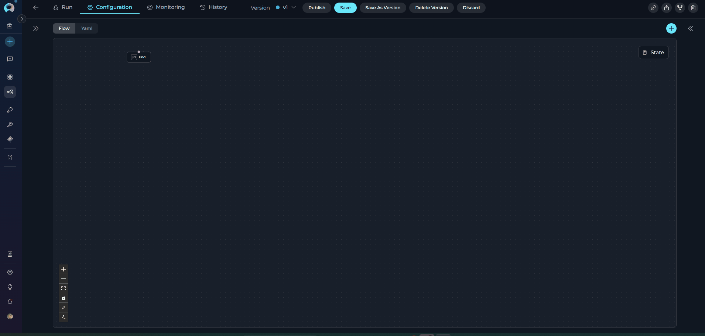
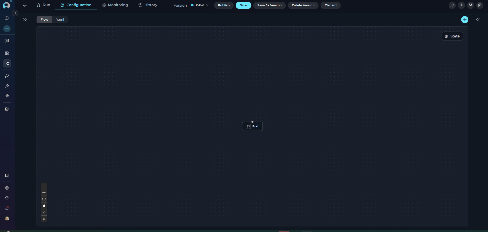
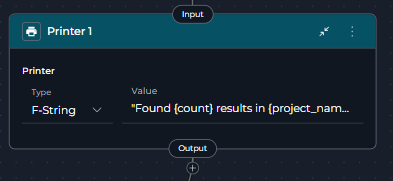

# Utility Nodes

Utility Nodes provide specialized functionality for state management and workflow composition. These nodes form the "supporting infrastructure" of your pipeline, allowing you to manipulate state variables and execute nested pipelines within your workflow.

**Available Utility Nodes:**

- **[State Modifier Node](#state-modifier-node)** - Transform, update, and clean up state variables using templates
- **[Printer Node](#printer-node)** - Display formatted output to users during pipeline execution

!!! note "Supporting Infrastructure"
    Utility nodes don't perform AI inference or external API calls directly. Instead, they provide essential support functions: state manipulation, data transformation, and user output display.

---

## State Modifier Node

The State Modifier Node is like a text editor for your pipeline's data. It takes information from your workflow (stored in variables), combines or changes it using templates, and saves the result back into your pipeline.

It's useful when you need to:

- Combine multiple pieces of data into one
- Format data in a specific way (like creating a message or report)
- Clean up temporary data you no longer need
- Do simple calculations (like adding numbers or counting items)

{loading=lazy}

**Purpose**

Use the State Modifier Node to:

* **Combine data** - Mix information from different variables into one formatted output
* **Format text** - Create messages, reports, or structured content from your data
* **Clean up** - Delete or reset temporary variables after you're done with them
* **Simple math** - Add, subtract, or count things
* **Transform data** - Change how your data looks (uppercase, lowercase, extract parts, etc.)

**Parameters**

| Parameter | Purpose | Type Options & Examples |
|-----------|---------|-------------------------|
| **Jinja Template** | Write a template that shows how to format your output using variables from your pipeline | **Example:**<br>`Hello, {{ user_name }}! Your score: {{ score + 10 }}`<br><br>**What you can do:**<br>- Use variables: `{{ name }}`<br>- Add conditions: `Pass`<br>- Loop through lists: `...`<br>- Apply formatting: `{{ text\|upper }}` (makes text UPPERCASE) |
| **Input** | List the variables from your pipeline that you want to use in the template | **Example:**<br>`input: ["user_name", "score"]`<br><br>**Note:** You can only use variables that you list here |
| **Output** | Name the variable where you want to save the result | **Example:**<br>`output: ["greeting_message"]`<br><br>**Note:** This creates a new variable or replaces an existing one |
| **Variables to Clean** | (Optional) List any variables you want to clear/reset after the template runs | **Example:**<br>`variables_to_clean: ["temp_data", "cache"]`<br><br>**What gets cleared:**<br>- Text becomes empty: `""`<br>- Lists become empty: `[]`<br>- Numbers become zero: `0` |

{loading=lazy}

!!! warning "Variable Cleanup"
    Variables listed in variables_to_clean are reset based on their type after the template renders (strings→"", lists→[], dicts→{}, numbers→0). Ensure these variables aren't needed by subsequent nodes.


**YAML Configuration Examples**

??? example "Basic Example: Simple Greeting"

    ```yaml
    nodes:
      - id: StateModifier 1
        type: state_modifier
        template: Hello, {{ user_name }}! Welcome to {{ project_name }}.
        variables_to_clean:
          - user_name
        input:
          - user_name
          - project_name
        output:
          - greeting_message
    state:
      input:
        type: str
      messages:
        type: list
      user_name:
        type: str
        value: ''
      project_name:
        type: str
        value: ''
      greeting_message:
        type: str
        value: ''
    ```

??? example "Advanced Example: Counter Increment with Type Conversion"

    This example demonstrates automatic type conversion - the template renders a string, but the State Modifier automatically converts it to an integer to match the output variable's type.

    ```yaml
    nodes:
      - id: IncrementCounter
        type: state_modifier
        template: '{{ index + 1 }}'
        variables_to_clean: []
        input:
          - index
        output:
          - index
        transition: NextNode
    state:
      input:
        type: str
      messages:
        type: list
      index:
        type: int
        value: 0
    ```

    **How it works:**
    
    - Template renders: `"1"` (string)
    - State Modifier detects `index` is type `int`
    - Automatically converts: `"1"` → `1`
    - Result: `index` is updated to integer `1`

??? example "Complex Example: Aggregating Multi-Step Responses"

    This example shows how to build a comprehensive response by combining multiple state variables, accessing message history, and using conditional formatting.

    ```yaml
    nodes:
      - id: AggregateResponse
        type: state_modifier
        template: |
          {{ response_full }}
          
          ## Question {{ index }}
          {{ question }}
          
          ## Answer {{ index }}
          {{ messages[-1].content }}
        variables_to_clean: []
        input:
          - response_full
          - messages
          - question
          - index
        output:
          - response_full
        transition: NextStep
    state:
      input:
        type: str
      messages:
        type: list
      response_full:
        type: str
        value: ''
      question:
        type: str
        value: ''
      index:
        type: int
        value: 0
    ```

??? example "Custom Filters Example: JSON Processing and Text Splitting"

    This example demonstrates the custom filters available in State Modifier for data transformation.

    ```yaml
    nodes:
      - id: ProcessAPIResponse
        type: state_modifier
        template: |
          
          **User:** {{ data.name }}
          **Email:** {{ data.email }}
          **Status:** {{ data.status|upper }}
          
          
          **Description Chunks:**
          
          - {{ chunk }}
          
          
        variables_to_clean:
          - api_response
        input:
          - api_response
        output:
          - formatted_user_info
        transition: DisplayResults
    state:
      input:
        type: str
      messages:
        type: list
      api_response:
        type: str
        value: '{"name": "John Doe", "email": "john@example.com", "status": "active", "description": "Long text here..."}'
      formatted_user_info:
        type: str
        value: ''
    ```

    **Available Custom Filters:**
    
    - `from_json` - Parse JSON string to Python object
    - `base64_to_string` - Decode base64 encoded data
    - `split_by_words(chunk_size)` - Split text into chunks of specified word count
    - `split_by_regex(pattern)` - Split text using regex pattern

??? example "Text Extraction Example: Cleaning Status Value"

    This example shows how to extract a specific value from a sentence using conditional logic and string manipulation.

    ```yaml
    nodes:
      - id: ExtractStatus
        type: state_modifier
        template: |
          
          {{ status.split('is')[-1]|trim }}
          
          {{ status }}
          
        variables_to_clean: []
        input:
          - status
        output:
          - status
        transition: NextNode
    state:
      input:
        type: str
      messages:
        type: list
      status:
        type: str
        value: 'The status is Open'
    ```

    **How it works:**
    
    1. **Check if 'is' exists**: `` - Checks if the word "is" appears in the status text
    2. **Split the text**: `status.split('is')` - Divides the text into parts using "is" as the separator
       - Example: `"The status is Open"` becomes `["The status ", " Open"]`
    3. **Get the last part**: `[-1]` - Takes the last item from the split result
       - Example: `" Open"`
    4. **Remove extra spaces**: `|trim` - Removes whitespace from the beginning and end
       - Example: `"Open"`
    5. **Otherwise keep original**: ` {{ status }} ` - If "is" is not found, keeps the status unchanged

    **Before:** `"The status is Open"`  
    **After:** `"Open"`

??? example "Cleanup Example: Resetting Variables by Type"

    This example shows how `variables_to_clean` resets different variable types appropriately.

    ```yaml
    nodes:
      - id: CleanupAfterProcessing
        type: state_modifier
        template: |
          Processing complete for batch {{ batch_number }}.
          Total items: {{ items|length }}
        variables_to_clean:
          - temp_items
          - cache_data
          - counter
          - processing_flag
        input:
          - batch_number
          - items
        output:
          - summary
        transition: END
    state:
      input:
        type: str
      messages:
        type: list
      batch_number:
        type: int
        value: 1
      items:
        type: list
        value: []
      temp_items:
        type: list
        value: ['item1', 'item2']
      cache_data:
        type: dict
        value: {}
      counter:
        type: int
        value: 5
      processing_flag:
        type: str
        value: 'active'
      summary:
        type: str
        value: ''
    ```

    **After execution:**
    
    - `temp_items` (list) → `[]`
    - `cache_data` (dict) → `{}`
    - `counter` (int) → `0`
    - `processing_flag` (str) → `""`


!!! note "Jinja2 Template Features"
    **Template Access Control**

    The template can only access variables listed in the Input parameter. Variables not included in Input will cause template rendering errors if referenced.

    **Standard Filters:** `|default('value')`, `|upper`/`|lower`, `|length`<br>**Custom Filters:** `|from_json`, `|base64_to_string`, `|split_by_words(n)`, `|split_by_regex('pattern')`<br>**Multi-line:** Use YAML multi-line syntax (`|`) for complex templates<br>**Formatting:** Access nested data with dot notation: `{{ user.profile.name }}`<br>**Type Conversion:** Output automatically converts to match state variable type (str, int, float, bool, list, dict)

**Best Practices**

   * **Always List Input Variables**: Explicitly specify all variables used in template to avoid rendering errors.
   * **Use Default Filters for Optional Variables**: Handle missing or null values gracefully with `{{ var|default('default_value') }}`.
   * **Leverage Custom Filters**: Use `|from_json` for API responses, `|split_by_words()` for chunking, `|base64_to_string` for encoded data.
   * **Trust Automatic Type Conversion**: The node automatically converts rendered output to match the target variable's type (int, float, bool, list, dict).
   * **Clean Up Temporary Variables**: Reset variables that are no longer needed using variables_to_clean - they'll be reset appropriately based on type.
   * **Format Long Templates for Readability**: Use multi-line YAML strings with proper indentation.
   * **Test Templates with Sample Data**: Verify template rendering before deployment with sample state data.
   * **Use Descriptive Output Names**: Name outputs to indicate their content (e.g., "formatted_summary" not "result").
   * **Access Message History**: Use `messages[-1].content` to get the last message or `messages[0]` for the first.
   * **Document Complex Templates**: Add comments explaining template logic for maintainability.
   * **Validate State Before Cleaning**: Ensure cleaned variables aren't needed by later nodes.
   * **Use State Modifier for Formatting Only**: Don't use for complex logic - use LLM or Code nodes instead.
   * **Combine Multiple Variables in Output**: Generate comprehensive output in single template rather than multiple State Modifiers.
   * **Handle JSON Data**: Use `|from_json` filter to parse JSON strings, then access nested properties with dot notation.

---

## Printer Node

The Printer Node displays output to users during pipeline execution and pauses the workflow so users can review the information before continuing.

**Simple Explanation:**

Think of it like a "pause and show" button in your pipeline. It stops the workflow, shows a message to the user (which can be a simple text, a variable's value, or formatted text), and waits for the user to click "continue" before moving to the next step.

For example, you might use it to show:
- "Processing complete! Found 5 results."
- The contents of a status variable
- A formatted report combining multiple pieces of data

{loading=lazy}


**Purpose**

Use the State Modifier Node to:

* **Show messages** - Display text to users at any point in the workflow
* **Pause for review** - Stop the pipeline so users can check results before continuing
* **Display variable values** - Show the contents of any variable from your pipeline
* **Show formatted output** - Combine text and variables for better presentation
* **Progress updates** - Tell users what's happening in multi-step workflows

**Parameters**

| Parameter | Purpose | Type Options & Examples |
|-----------|---------|-------------------------|
| **Input Mapping (Printer)** | Define what content to display to the user | **Type: Fixed** - Show static text<br>Example: `"Processing complete!"`<br><br>**Type: Variable** - Show a variable's value<br>Example: `status` (shows value of status variable)<br><br>**Type: F-String** - Combine text with variables<br>Example: `"Found {count} results in {project_name}"`<br><br>**Required field name:** Must be called `printer` |
| **Transition** | Which node to go to after user clicks continue | **Required**: Must specify next node or END<br><br>Example:<br>`END` or `NextNode` |

{loading=lazy}

**YAML Configuration Examples**

??? example "Simple Text (Type: Fixed)"

    Display a static message to the user.

    ```yaml
    nodes:
      - id: Printer 1
        type: printer
        input_mapping:
          printer:
            type: fixed
            value: "Processing complete. Review the results below."
        transition: END
    state:
      input:
        type: str
      messages:
        type: list
    ```

??? example "Show Variable Value (Type: Variable)"

    Display the contents of a variable directly.

    ```yaml
    nodes:
      - id: Printer 1
        type: printer
        input_mapping:
          printer:
            type: variable
            value: status
        transition: END
    state:
      input:
        type: str
      messages:
        type: list
      status:
        type: str
        value: ''
    ```

??? example "Formatted Text (Type: F-String)"

    Combine text with variable values using {variable_name} syntax.

    ```yaml
    nodes:
      - id: Printer 1
        type: printer
        input_mapping:
          printer:
            type: fstring
            value: |
              Processing Report:
              - Project: {project_name}
              - Items processed: {count}
              - Status: {status}
        transition: END
    state:
      input:
        type: str
      messages:
        type: list
      project_name:
        type: str
        value: ''
      count:
        type: int
        value: 0
      status:
        type: str
        value: ''
    ```


!!! info "Automatic Pause"
    The Printer Node automatically pauses the pipeline after displaying the message. The pipeline will resume only after the user acknowledges the message by typing anything.
    
    **Important:** If the Printer Node is the last node in your pipeline (transition: END), the pipeline execution will not complete until the user provides input to continue.

**Best Practices**

* **Choose the Right Type**:
  - Use `fixed` for static messages that don't change
  - Use `variable` to show the value of a single variable
  - Use `fstring` when you need to combine text with multiple variables
* **Use Clear Messages** - Make it obvious what information you're showing
* **Format Multi-line Output** - Use `|` in YAML for readable multi-line messages
* **Include Context** - Show relevant information so users understand what they're looking at
* **Test Variable Names** - Make sure the variables you reference actually exist in your state
* **Keep It Simple** - Don't try to show too much information at once
* **Use Descriptive Text** - Add labels like "Status:", "Results:", etc. to make output clear

---

## Utility Nodes Comparison

**When to Use Each Node**

| **Scenario** | **Recommended Node** | **Why** |
|--------------|---------------------|---------|
| Transform state variables | State Modifier Node | Jinja2 templates ideal for data transformation and variable manipulation |
| Display output to users | Printer Node | Shows formatted messages and pauses for user review |
| Clean up temporary variables | State Modifier Node | variables_to_clean parameter resets specified state variables |
| Show progress updates | Printer Node | Displays intermediate results with automatic pause |
| Combine data from multiple state variables | State Modifier Node | Jinja2 templates can access multiple inputs and generate consolidated output |
| Format user-facing messages | Printer Node | F-string or variable types create readable output for users |
| Apply custom filters to data | State Modifier Node | Custom Jinja2 filters (from_json, split_by_words, etc.) for data transformation |
| Pause pipeline for user inspection | Printer Node | Automatic interrupt after displaying output |
| Generate content for next node | State Modifier Node | Output variables feed into subsequent pipeline nodes |
| Show static completion messages | Printer Node | Fixed type displays unchanging text (e.g., "Processing complete") |
| Perform calculations on state | State Modifier Node | Templates support arithmetic and logic operations |
| Display formatted reports | Printer Node | F-string type combines text with variable values |

---

## Deprecated Utility Nodes

The following utility node is deprecated and will be removed in a future release:

??? warning "Pipeline (Subgraph) Node"

    The **Pipeline** (Subgraph) node is deprecated and will be removed in an upcoming release.

    **Migration:** Use the **Agent** node to delegate tasks to specialized AI agents, effectively replacing nested pipeline functionality.

    **Migration Guide:** [Pipeline Node Migration](../../../migration/v2.0.1/pipeline-node-migration.md)

---

!!! info "Related Documentation"
    - **[Entry Point](../entry-point.md)** - Define pipeline starting point
    - **[Flow Editor](../flow-editor.md)** - Visual workflow design
    - **[YAML Configuration](../yaml.md)** - Text-based pipeline definition
    - **[Control Flow Nodes](control-flow-nodes.md)** - Decision and routing nodes
    - **[Execution Nodes](execution-nodes.md)** - LLM, Tool, and Code nodes
    - **[State Management](../states.md)** - Understanding state variables
