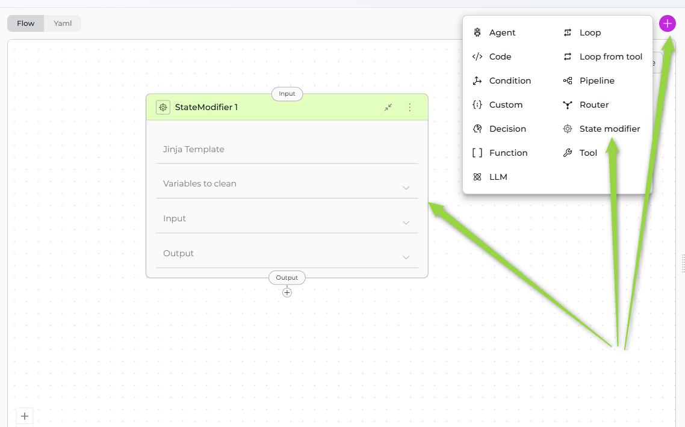
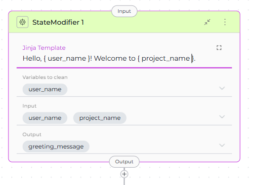
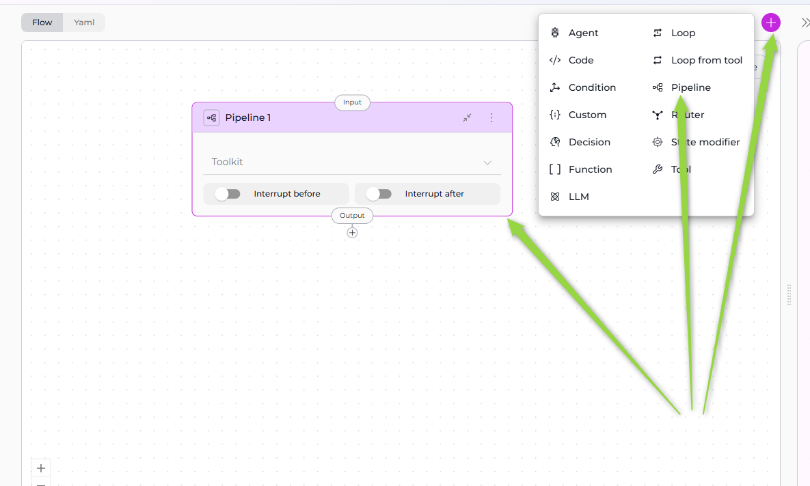

# Utility Nodes

Utility Nodes provide specialized functionality for state management and workflow composition. These nodes form the "supporting infrastructure" of your pipeline, allowing you to manipulate state variables and execute nested pipelines within your workflow.

**Available Utility Nodes:**

- **[State Modifier Node](#state-modifier-node)** - Transform, update, and clean up state variables using templates
- **[Pipeline (Subgraph) Node](#pipeline-subgraph-node)** - Execute another pipeline as a nested component

!!! note "Supporting Infrastructure"
    Utility nodes don't perform AI inference or external API calls directly. Instead, they provide essential support functions: state manipulation and workflow composition.

---

## State Modifier Node

The State Modifier Node updates, transforms, or cleans up parts of the workflow's state using Jinja2 templates. Think of it as a "state editor" that can modify variables, generate new content from templates, or reset portions of the state to prepare for subsequent nodes.



### Purpose

Use the State Modifier Node to:

- **Transform state variables** using Jinja2 template logic
- **Generate formatted content** from existing state data
- **Clean up temporary variables** after processing
- **Prepare state** for the next node in the workflow
- **Aggregate or summarize data** from multiple state variables
- **Reset counters, flags, or temporary data** to avoid stale information

### Parameters

| Parameter | Purpose | Type Options & Examples |
|-----------|---------|-------------------------|
| **Jinja Template** | Define a Jinja2 template string to generate new content from state variables | **Syntax:** Uses Jinja2 templating language with access to state variables specified in Input<br><br>**Template Features:**<br>- Variable Substitution: <br>`{{ variable_name }}`<br>- Conditional Logic: `...`<br>- Loops: `...`<br>- Filters: `{{ text\|upper }}`, `{{ items\|length }}`<br><br>**Example Template:**<br>`Hello, {{ user_name }}!`<br>`Your project "{{ project_name }}" has {{ task_count }} tasks.` |
| **Input** | Specify which state variables the template can access for rendering | **Options:**<br>- Default states: `input`, `messages`<br>- Custom states: Any state variables you've defined<br><br>**Example:**<br>`input: ["user_name", "project_name", "task_count"]`<br><br>**Usage:** The template can only access variables listed in Input |
| **Output** | Specify which state variables should be updated with the rendered template result | **Options:**<br>- New state variables (will be created)<br>- Existing state variables (will be overwritten)<br><br>**Example:**<br>`output: ["greeting_message"]`<br><br>**Output Behavior:** The rendered template result is stored in the output variable(s) |
| **Variables to Clean** | Specify state variables to reset or clear after the template is rendered | **Options:**<br>- Any state variables (typically temporary or single-use variables)<br>- Empty list if no cleanup needed<br><br>**Example:**<br>`variables_to_clean: ["temp_data", "user_input", "processing_flag"]`<br><br>**Cleanup Behavior:** After rendering and updating output, specified variables are reset to empty string |



**YAML Configuration**

```yaml
nodes:
  - id: StateModifier 1
    type: state_modifier
    template: Hello, { user_name }! Welcome to { project_name }.
    variables_to_clean:
      - user_name
    input:
      - user_name
      - project_name
    output:
      - greeting_message
state:
  input:
    type: str
  messages:
    type: list
  user_name:
    type: str
    value: ''
  project_name:
    type: str
    value: ''
  greeting_message:
    type: str
    value: ''

```

!!! info "Template Access Control"
    The template can only access variables listed in the Input parameter. Variables not included in Input will cause template rendering errors if referenced.

!!! warning "Variable Cleanup"
    Variables listed in variables_to_clean are reset to empty strings after the template renders. Ensure these variables aren't needed by subsequent nodes.

!!! note "Jinja2 Template Features"
    **Filters:** Use `|default('value')` for optional variables, `|upper`/`|lower` for case conversion, `|length` for counts<br>**Multi-line:** Use YAML multi-line syntax (`|`) for complex templates<br>**Formatting:** Access nested data with dot notation: `{{ user.profile.name }}`

### Best Practices
   - Always List Input Variables: Explicitly specify all variables used in template to avoid rendering errors.
   - Use Default Filters for Optional Variables: Handle missing or null values gracefully with `{{ var|default('default_value') }}`.
   - Clean Up Temporary Variables: Reset variables that are no longer needed using variables_to_clean.
   - Format Long Templates for Readability: Use multi-line YAML strings with proper indentation.
   - Test Templates with Sample Data: Verify template rendering before deployment with sample state data.
   - Use Descriptive Output Names: Name outputs to indicate their content (e.g., "formatted_summary" not "result").
   - Document Complex Templates: Add comments explaining template logic for maintainability.
   - Validate State Before Cleaning: Ensure cleaned variables aren't needed by later nodes.
   - Use State Modifier for Formatting Only: Don't use for complex logic - use LLM or Code nodes instead.
   - Combine Multiple Variables in Output: Generate comprehensive output in single template rather than multiple State Modifiers.

---

## Pipeline (Subgraph) Node

The Pipeline (Subgraph) Node executes another pipeline as a nested component within your workflow. This allows you to compose complex workflows from smaller, reusable pipeline modules, promoting modularity and maintainability.



### Purpose

Use the Pipeline (Subgraph) Node to:

- **Execute nested pipelines** within your main workflow
- **Reuse pipeline modules** across multiple parent pipelines
- **Modularize complex workflows** into smaller, manageable components
- **Create hierarchical pipeline structures** with parent-child relationships
- **Isolate functionality** in separate pipeline units
- **Simplify maintenance** by breaking large pipelines into focused modules

### Parameters

| Parameter | Purpose | Type Options & Examples |
|-----------|---------|-------------------------|
| **Pipeline** | Select the pipeline to execute as a subgraph | **Options:** Only pipelines can be selected (no Toolkits, MCPs, or Agents)<br><br>**Selection:** Dropdown shows all available pipelines in your workspace<br>**Requirements:** Pipeline must exist and be accessible<br><br>**YAML Field:** `tool`<br><br>**Example:**<br>`tool: Bug Analysis Pipeline`<br><br>**Execution Flow:**<br>1. Parent pipeline invokes child pipeline<br>2. Child pipeline executes completely<br>3. Child pipeline completes and returns control<br>4. Parent pipeline continues to next node |
| **Interrupt Before** | Pause pipeline execution before this node runs | **Options:** Enabled / Disabled<br><br>**Usage:** Allows inspection of state before child pipeline execution<br><br>**YAML Configuration:** Added to pipeline-level `interrupt_before` list |
| **Interrupt After** | Pause pipeline execution after this node completes | **Options:** Enabled / Disabled<br><br>**Usage:** Allows inspection of state after child pipeline execution<br><br>**YAML Configuration:** Added to pipeline-level `interrupt_after` list |

**YAML Configuration**

```yaml
nodes:
  - id: Pipeline 1
    type: pipeline
    tool: Bug Analysis Pipeline
interrupt_before:
  - Pipeline 1
```

!!! info "Pipeline Reusability"
    Multiple parent pipelines can call the same child pipeline, promoting code reuse and consistency across workflows.

!!! warning "State Isolation"
    Child pipelines execute in their own state context. The parent and child share the same state by default - changes made by the child pipeline are visible to the parent after execution.

!!! note "Nested Pipeline Benefits"
    **Reusability:** Same child pipeline can be used by multiple parents<br>**Modularity:** Break complex workflows into focused modules<br>**Maintenance:** Update child pipeline once, all parents use new version automatically

### Best Practices
   - Use Descriptive Pipeline Names: Name child pipelines to clearly indicate their function (e.g., "Data Validation Pipeline", "Report Generation Pipeline").
   - Define Clear State Contract: Document which state variables child pipeline expects and modifies for parent pipeline integration.
   - Keep Child Pipelines Focused: Each nested pipeline should have single, well-defined responsibility.
   - Test Independently: Ensure child pipelines work correctly on their own before integrating into parent workflows.
   - Document Parent-Child Relationships: Maintain clear documentation of which parent pipelines use which child pipelines.
   - Version Child Pipelines Carefully: Changes to child pipelines affect all parent pipelines using them.
   - Avoid Deep Nesting: Limit nesting depth (pipeline → subpipeline → sub-subpipeline) to maintain clarity.
   - Use Interrupt Points: Enable Interrupt Before or After for debugging complex nested pipeline flows.
   - Handle Child Pipeline Failures: Consider error handling when child pipeline fails or returns unexpected results.
   - Share State Intentionally: Be mindful that child pipelines can modify parent state - ensure this is intentional.

---

## Comparison

### When to Use Each Node

| **Scenario** | **Recommended Node** | **Why** |
|--------------|---------------------|---------|
| Format output using templates | State Modifier Node | Jinja2 templates ideal for string formatting and variable substitution |
| Combine data from multiple state variables | State Modifier Node | Template can access multiple inputs and generate consolidated output |
| Clean up temporary variables | State Modifier Node | variables_to_clean parameter resets specified state variables |
| Execute reusable workflow module | Pipeline (Subgraph) Node | Enables workflow composition and reusability |
| Break complex pipeline into manageable parts | Pipeline (Subgraph) Node | Modularization improves maintainability |
| Share common logic across pipelines | Pipeline (Subgraph) Node | Single child pipeline used by multiple parents |
| Apply filters to state data | State Modifier Node | Jinja2 filters provide rich data transformation capabilities |
| Generate formatted reports or messages | State Modifier Node | Template-based generation creates consistent formatting |
| Isolate specific functionality | Pipeline (Subgraph) Node | Separate pipeline provides clear functional boundaries |
| Update single pipeline, affect all callers | Pipeline (Subgraph) Node | Centralized logic updates propagate automatically |

---

!!! info "Related Documentation"
    - **[Entry Point](../entry-point.md)** - Define pipeline starting point
    - **[Flow Editor](../flow-editor.md)** - Visual workflow design
    - **[YAML Configuration](../yaml.md)** - Text-based pipeline definition
    - **[Control Flow Nodes](control-flow-nodes.md)** - Decision and routing nodes
    - **[Execution Nodes](execution-nodes.md)** - LLM, Tool, and Code nodes
    - **[State Management](../states.md)** - Understanding state variables

