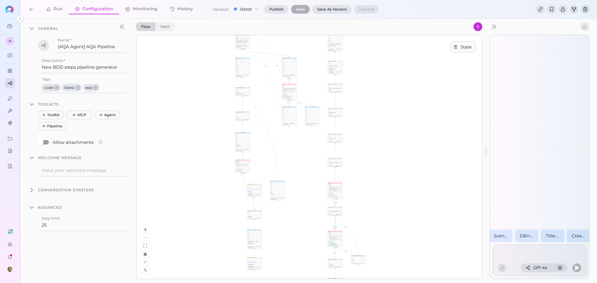

# Pipelines Overview

Welcome to the Pipeline Building Blocks guide! This comprehensive resource will help you understand and master ELITEA Pipelines—powerful visual workflows that automate complex processes without requiring technical expertise.

## What are ELITEA Pipelines?

ELITEA Pipelines are customizable, automated workflows that help you streamline repetitive tasks and complex processes. Think of a pipeline as a **step-by-step recipe** that guides the system through a series of actions to achieve a specific goal.

Unlike traditional automation tools that require programming knowledge, ELITEA Pipelines can be created visually using a drag-and-drop interface, making powerful automation accessible to everyone—from business analysts to project managers.

### Key Characteristics

**Visual Design**

: Create workflows by connecting nodes in a flow diagram—no coding required. The Flow Editor provides an intuitive interface for designing even the most complex processes.

**Flexible Automation**

: Handle everything from simple linear tasks to sophisticated multi-step processes with conditional logic, loops, and integrations with external tools.

**Smart Integration**

: Connect seamlessly with toolkits, external services like Jira, GitHub, Confluence, and use AI agents to enhance your workflows.

**Data-Driven**

: Pipelines maintain their own memory (called "state") to track information as they execute, ensuring data flows smoothly between steps.

## How Do Pipelines Work?

A pipeline operates by executing a sequence of **nodes**, where each node represents a specific action or decision. Here's how it works:

1. **Start at the Entry Point**: Every pipeline begins at a designated starting node
2. **Execute Nodes Sequentially**: The pipeline moves from one node to the next, performing actions and making decisions
3. **Manage State**: Information collected during execution is stored in the pipeline's state and can be used in subsequent steps
4. **Follow Connections**: Nodes are linked together, with the pipeline following these connections based on conditions or simple transitions
5. **Complete or Loop**: The pipeline ends when it reaches an END transition or continues looping based on your design

## Real-World Use Cases

Pipelines excel at automating workflows that involve multiple steps, decisions, and integrations. Here are some practical examples:

### User Story Creation Workflow

Automate the entire process of creating user stories in Jira:

* Gather requirements from users through conversational prompts
* Extract relevant information from Confluence pages or documentation
* Enhance the story with AI-generated acceptance criteria
* Get user approval before publishing
* Automatically create the formatted user story in Jira

### Manual Test Case Generation

Transform requirements into comprehensive test cases:

* Analyze user stories or requirement documents
* Generate test scenarios with step-by-step instructions
* Create expected results for each test case
* Add test cases to TestRail or Jira with proper categorization
* Link test cases back to original requirements

### Other Common Scenarios

* **Code Documentation**: Automatically document code repositories by analyzing files and generating comprehensive documentation
* **Data Processing**: Extract, transform, and load data from multiple sources with validation and error handling
* **Approval Workflows**: Route requests through multiple approvers with conditional logic based on criteria
* **Report Generation**: Collect data from various systems, analyze it, and create formatted reports

## Pipelines vs Agents: When to Use Which?

Both Pipelines and Agents are powerful automation tools in ELITEA, but they serve different purposes:

### Use Pipelines When:

✔️ **Structured Workflows**: You have a clear, defined sequence of steps that need to happen in order

✔️ **Multiple Integrations**: Your workflow requires connecting to several external tools or services (Jira, GitHub, Confluence, etc.)

✔️ **Conditional Logic**: You need to make decisions and branch the workflow based on specific conditions

✔️ **Data Processing**: You're handling data transformation, validation, or aggregation across multiple steps

✔️ **Orchestration**: You need to coordinate multiple agents, tools, or sub-processes as part of a larger workflow

### Use Agents When:

✔️ **Conversational Interactions**: You want a more free-form, chat-based interaction with users

✔️ **Single-Purpose Tasks**: The task is focused and doesn't require complex branching or orchestration

✔️ **Exploratory Work**: Users need to ask questions and explore information dynamically

✔️ **Simple Automation**: The workflow is straightforward without complex conditional logic

!!! tip "Combining Both"
    Pipelines can include Agents as nodes! Use Agents for specific tasks within a larger Pipeline workflow to get the best of both approaches.

## Pipeline Building Blocks

Understanding pipelines requires familiarity with their core components. Each building block serves a specific purpose in creating effective workflows:

| Building Block | Description | Purpose | Key Topics |
|----------------|-------------|---------|------------|
| **[States](states.md)** | Pipeline's memory system for storing and managing data | Track information collected during execution and pass data between nodes | State variables, data types, input vs messages, state initialization |
| **[Nodes](nodes/overview.md)** | Individual actions or steps in your pipeline workflow | Perform specific tasks like interacting with users, calling services, making decisions, or processing data | 7 different node types organized into 3 categories (Interaction, Execution, Control Flow, Utility) |
| **[Connections](nodes-connectors.md)** | Links between nodes that control execution flow | Define how the pipeline moves from one step to the next, including conditional branching | Simple transitions, conditional edges, decision edges, router outputs, data mapping |
| **[Entry Point](entry-point.md)** | Designated starting node of your pipeline | Define where execution begins when the pipeline is triggered | Entry point syntax, validation rules, using different node types as starting points |
| **[Flow Editor](flow-editor.md)** | Visual interface for designing pipelines graphically | Build complex workflows using drag-and-drop without writing code | Creating nodes visually, connecting nodes, configuring parameters, debugging |
| **[YAML Configuration](yaml.md)** | Text-based format for defining pipelines programmatically | Enable advanced customization, version control, and programmatic pipeline generation | YAML schema, syntax rules, node configuration, complete examples |

---

## Getting Started with Pipeline Building Blocks

Ready to dive deeper? We recommend exploring the building blocks in this order:

1. **Start with [States](states.md)** - Understand how pipelines store and manage data
2. **Explore [Nodes](nodes/overview.md)** - Learn about the different actions and components available
3. **Master [Connections](nodes-connectors.md)** - Discover how to control the flow between nodes
4. **Understand [Entry Point](entry-point.md)** - Define where your pipeline begins
5. **Choose Your Interface**:
      * [Flow Editor](flow-editor.md) for visual design
      * [YAML Configuration](yaml.md) for programmatic control
6. **Reference [Appendix - Comparison Tables](appendix-comparison-tables.md)** - Quick comparisons of node types and features

!!! info "Prerequisites"
    Before building pipelines, make sure you've completed the [Quick Start Guide](../../getting-started/chat-quick-start.md) and familiarized yourself with [Creating a Pipeline](../chat-conversations/how-to-create-and-edit-pipelines-from-canvas.md).

## Next Steps

### Learn by Doing

* **[Create Your First Pipeline](../chat-conversations/how-to-create-and-edit-pipelines-from-canvas.md)**: Step-by-step tutorial for beginners
* **[Pipelines Menu Guide](../../menus/pipelines.md)**: Complete reference for the Pipelines interface

### Explore Advanced Topics

* **[Agent Integration](nodes/interaction-nodes.md#agent-node)**: Incorporate AI agents into pipelines
* **[Monitoring & Debugging](../../menus/pipelines.md#monitoring-tab)**: Track performance and troubleshoot issues

### Get Inspired

* **[Pipeline Examples](../../menus/pipelines.md#what-are-elitea-pipelines)**: Real-world pipeline implementations
* **[Community Pipelines](https://nexus.elitea.ai/alita_ui/agents/latest)**: Discover public pipelines created by the community

---

Ready to build powerful automated workflows? Start with **[States](states.md)** to understand the foundation of pipeline data management!
