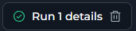
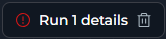
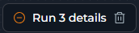
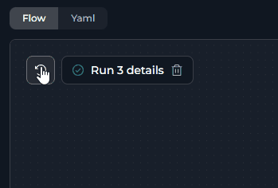
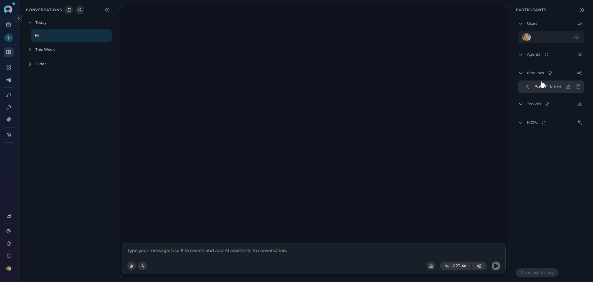
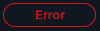
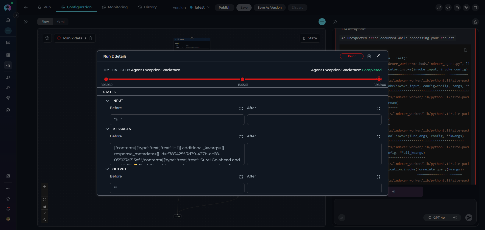
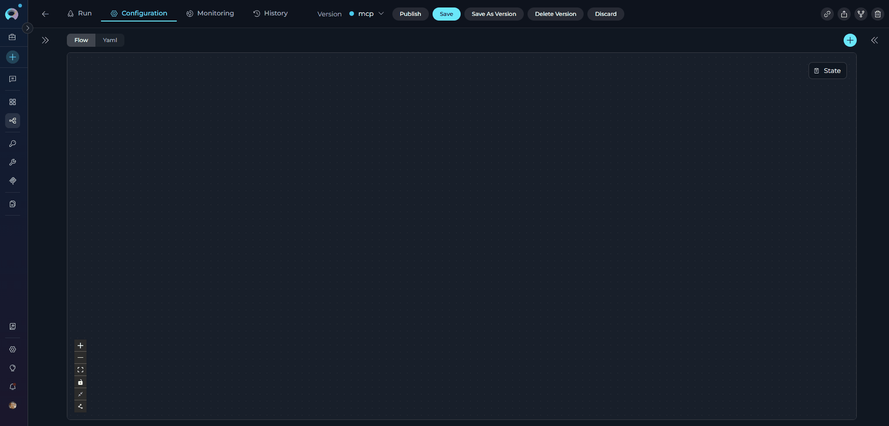

# Pipeline Runs

## Overview

Pipeline runs represent the execution of your workflow, capturing the complete execution state and progression through nodes. Each run maintains a detailed **timeline** of execution events, **state snapshots** at each step, and the **final status** of the workflow.

A pipeline run tracks:

* **Timeline** - Chronological sequence of node executions with timestamps
* **State snapshots** - Variable values before and after each node execution
* **Run status** - Current execution state (In Progress, Completed, Error, Stopped, Interrupt)
* **Node progression** - Which nodes have executed and which is currently active
* **Error information** - Detailed error messages and stack traces when failures occur

!!! info "Run Execution Methods"
    Pipelines can be executed from two locations:
    
    * **Pipeline Editor** (Run tab) - Direct execution environment
    * **Chat → Canvas** - Conversational execution interface
    
    Both methods provide identical run tracking and state management capabilities.

---

## Run States and Status Tracking

**Pipeline Run States**

Each pipeline run progresses through distinct execution states. The current state is displayed in the **Run Chipset** within the Flow View (Configuration tab).

| State | Visual Indicator | Description | Available Actions |
|-------|------------------|-------------|-------------------|
| **In Progress** | {width="150"} | Pipeline is actively executing nodes | Stop execution |
| **Completed** | {width="150"} | All nodes executed successfully | View details, Delete run |
| **Error** | {width="150"} | Execution failed with an exception | View error details, Delete run |
| **Stopped** | {width="150"} | Manually stopped by user | View partial results, Delete run |

!!! info "Run State Visibility"
    Run states are visible in the **Flow View** (Configuration tab), where the Run Chipset displays current and recent runs with their status indicators.

---

## Accessing Run Information

The **Run Chipset** appears in the **Configuration tab** (Flow View) and provides access to detailed run information.

### From Flow View (Pipeline Editor)

**Run Chipset Display:**

* **Single Run**: Shows one run chipset with status icon and run name
* **Multiple Runs**: Shows current run + history icon (🕐 clock icon) to access previous runs
    * Click the history icon to view a dropdown of all previous runs
    * Current/most recent run is always displayed separately
    * Each run in the dropdown can be opened (click run name) or deleted (click delete icon)

    {width="300" loading="lazy"}

### From Chat Interface

Access run information from chat executions through Canvas mode:

1. Navigate to Chat and add/select a pipeline
2. Execute pipeline with input or conversation starters
3. Click **Settings**(gear) button → Canvas view opens
4. Click **Flow Editor** tab
5. View Run Chipset and click run name for details

    {width="600" loading="lazy"}

!!! tip "Chat to Canvas Workflow"
    The Chat → Canvas → Flow Editor path provides the same run tracking capabilities as direct pipeline execution.

### Run Details Dialog

Click on any run name in the chipset to open the **Run Details Dialog**, which provides comprehensive information about the execution.

**Dialog Sections:**

1. **Header**
    * Run name/label
    * Current status badge
    * Action buttons (Stop/Delete)
    * Close button

2. **Timeline Section**
    * **Timeline Step**: Shows current node being executed (or last completed node)
    * **Status Indicator**: Real-time status of the current node
    
    | Status | Description | Visual Indicator |
    |--------|-------------|------------------|
    | **In Progress** | Node is actively executing | {width="100"} |
    | **Completed** | Node finished successfully | {width="100} |
    | **Error** | Node failed with an error | {width="100} |
    | **Stopped** | Manually stopped by user | {width="100} |
    
    * **Visual Timeline**: Stepper component showing all executed nodes
        * Each step shows timestamp (HH:mm:ss format)
        * Click any step to view its state details
        * Green connector line indicates successful progression
        * Red connector line indicates error occurred
3. **States Section**
    * Expandable accordion for each state variable
    * **Before** and **After** values for each node execution
    * Full-screen view button for detailed inspection

    {width="600" loading="lazy"}

---

## Monitoring Execution

### Real-Time Monitoring

**During Active Execution:**

* **Run Chipset**: Shows blue circular progress indicator in Flow View
* **Timeline Tracking**: Run Details Dialog displays current node and timestamp
* **Node Highlighting**: Active node highlighted in Configuration tab
* **Chat Progress**: Results stream progressively in Run or Chat interface

**Monitoring Current State:**

1. Click run name in Run Chipset
2. Run Details Dialog opens
3. Timeline shows current node execution
4. States section displays real-time variable values

### Active Execution Indicators

**Flow View (Configuration Tab):**

* Run chipset displays with blue progress spinner
* Current node highlighted on canvas
* Timeline step shows "Performing" status

### Output Viewing

**State Inspection:**

* Open Run Details Dialog
* Expand state variable accordions
* View before/after values for each node


---

## Debugging and Error Handling

### Error State Details

When a run enters **Error** state, the Run Details Dialog provides:

* **Error message**: Exception details displayed in red
* **Failed node**: Timeline highlights node where error occurred
* **State snapshot**: Variable values at time of failure
* **Stack trace**: Technical error information in chat interface

{width="500"}

---

## Best Practices

??? example "State Variable Management"

    **Initialize with defaults:**
    ```yaml
    state:
      search_query:
        type: str
        value: ""
      max_results:
        type: int
        value: 10
    ```
    
    **Always map node outputs:**
    ```yaml
    - id: "Fetch Data"
      type: "function"
      function: "jira_toolkit||search"
      output: ["search_results", "messages"]  # Required!
    ```

??? example "Using Interrupt Points Effectively"fectively"

    Use interrupts for:
    
    * Validating data transformations
    * Manual approval gates
    * Debugging complex workflows
    * Human-in-the-loop processes
    
    **Configuration:**
    ```yaml
    interrupt_before:
      - "Critical Processing Node"
    
    interrupt_after:
      - "Data Validation"
    ```

??? example "Run Monitoring Tips"ring Tips"

    **During Development:**
    
    * Use interrupt points to inspect state
    * Add descriptive node names for clarity
    * Test with edge cases and invalid inputs
    
    **In Production:**
    
    * Monitor run history for patterns
    * Track error rates in Monitoring tab
    * Set appropriate step limits
    * Configure conversation starters for guidance

---

## Troubleshooting

### Common Execution Errors and Solutions

??? warning "Hardcoding State Variables for Debugging"

    **Purpose**: Temporarily override state variable values to test specific scenarios or isolate issues.
    
    **Method**: Set fixed values directly in the `state` section:
    
    ```yaml
    state:
      issue_key:
        type: str
        value: "PROJ-123"  # Hardcoded for testing
      
      user_input:
        type: str
        value: "test query"  # Override user input
      
      max_results:
        type: int
        value: 5  # Fixed value for debugging
    ```
    
    **Use Cases**:
    
    * **Skip user input**: Test pipeline logic without manual entry
    * **Reproduce errors**: Lock specific values that caused failures
    * **Isolate node behavior**: Test individual nodes with known inputs
    * **Validate transformations**: Use predictable data to verify outputs
    
    **Best Practices**:
    
    * Document hardcoded values with comments
    * Remove or revert before production deployment
    * Use interrupt points to verify hardcoded values are applied
    * Test with multiple hardcoded scenarios (edge cases, invalid data)
    
    !!! tip "Combining with Interrupts"
        Set hardcoded values + interrupt points to step through execution with controlled data:
        
        ```yaml
        state:
          debug_data:
            type: str
            value: "test"  # Hardcoded
        
        interrupt_before:
          - "Processing Node"  # Pause to inspect
        ```

??? warning "Error: Entry Point Not Defined"

    **Error Message:**
    ```
    Entry point is not defined in the schema. 
    Please define 'entry_point' in the schema.
    ```
    
    **Cause**: Pipeline has no starting node configured.
    
    **Solution**:
    
    1. Open pipeline in Configuration tab
    2. Click three dots (⋮) on the node that should start execution
    3. Select "Entry Point" from the menu
    4. Save the pipeline
    
    {width="350"}

??? warning "Error: Missing Required Parameter"

    **Error Message:**
    ```
    Missing required parameter: issue_key
    During task with name 'Fetch Jira Ticket'
    ```
    
    **Cause**: Node's input_mapping references undefined or empty state variable.
    
    **Solution**:
    
    1. Check if variable is defined in `state` section
    2. Verify previous nodes populate the variable
    3. Add default value if appropriate:
    
    ```yaml
    state:
      issue_key:
        type: str
        value: ""  # Add default
    ```

??? warning "Error: Node Transition Undefined"

    **Error Message:**
    ```
    Transition target 'Next Step' not found
    ```
    
    **Cause**: Node's transition points to non-existent node.
    
    **Solution**:
    
    1. Open Flow Designer
    2. Check connection from failing node
    3. Ensure target node exists and is properly named
    4. Update transition to correct node ID or END

??? warning "Error: State Variable Type Mismatch"

    **Error Message:**
    ```
    Expected type 'int' but got 'str' for variable 'count'
    ```
    
    **Cause**: Variable assigned value of wrong type.
    
    **Solution**:
    
    * Ensure type conversion in Code nodes:
    
    ```yaml
    - id: "Convert Types"
      type: "code"
      code:
        type: "fixed"
        value: |
          count_str = alita_state.get('count', '0')
          {"count": int(count_str)}  # Convert to int
      output: ["count"]
      structured_output: true
    ```
---
??? warning "Interpreting Error Messages"

    **Understanding Error Structure:**
    
    ```
    Error during task with name 'Node Name':
    [Exception Type]: Error details here
    
    Stack trace:
      File "...", line X, in function
        code line causing error
    
    Current state:
      variable1: value1
      variable2: value2
    ```
    
    **Key Components:**
    
    1. **Node Name**: Where the error occurred
    2. **Exception Type**: Type of Python error (KeyError, ValueError, etc.)
    3. **Error Details**: Specific message about what went wrong
    4. **Stack Trace**: Technical execution path (focus on end)
    5. **Current State**: State variables at time of error
    
    **Reading Tips:**
    
    * Focus on the **last exception** in the stack trace
    * Check **Current State** section for variable values
    * Node Name tells you exactly where to look in your pipeline
    * Exception Type hints at the category of problem

---

!!! info "Related Documentation"
    
    * **[Pipeline Overview](overview.md)** - Understanding pipeline concepts and architecture
    * **[Pipeline Nodes](nodes/overview.md)** - Complete guide to all node types
    * **[Pipeline States](states.md)** - Managing state variables and data flow
    * **[Flow Editor](flow-editor.md)** - Visual pipeline design and editing
    * **[YAML Configuration](yaml.md)** - Text-based pipeline definition
    * **[Agents and Pipelines History](../agents-pipelines/agents-pipelines-history.md)** - Detailed history tab guide
    * **[Troubleshooting](../../support/troubleshooting.md)** - Common issues and solutions
