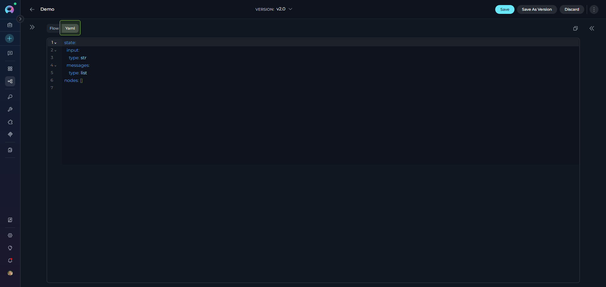
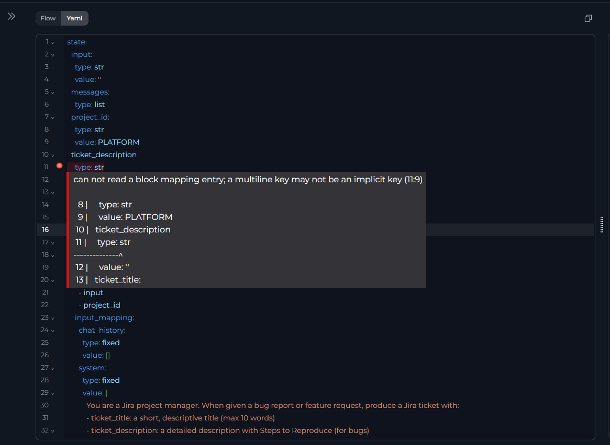

# YAML Configuration

YAML view provides code-based pipeline configuration with advanced control over definitions, schemas, and patterns.

!!! info "Target Audience"
    For **advanced users** who prefer code editing or need version-controlled pipeline definitions.

## What is YAML View

A code editor for pipelines in the **Configuration** tab (alongside [Flow Editor](flow-editor.md)) that provides direct access to pipeline YAML definitions.

**Features:**

* **Instant Flow Sync**: Changes sync instantly between YAML and Flow views
* **Syntax Highlighting**: Color-coded YAML structure with CodeMirror
* **Real-time Validation**: Immediate error feedback
* **Find & Replace**: `Ctrl+F` (Windows) or `⌘+F` (Mac)
* **Version Control**: Copy/paste YAML for backup or sharing



---

## Schema Structure

Every pipeline has three required top-level sections:

```yaml
entry_point: <node_id>        # Required
state: {...}                   # Required
nodes: [...]                   # Required
```

| Field | Type | Required | Description |
|-------|------|----------|-------------|
| `entry_point` | String | ✔️ | Starting node ID |
| `state` | Object | ✔️ | State variable definitions |
| `nodes` | Array | ✔️ | Node configurations |

---

## State Configuration

Defines all variables used across the pipeline. Each has a type and optional default value.

### State Syntax

```yaml
state:
  <variable_name>:
    type: <data_type>
    value: <default_value>  # Optional
```

!!! info "Default Variables"
    Default variables like `input` and `messages` don't require initial values—they are populated during pipeline execution.

**Data Types:**

| Type | Example |
|------|---------|
| `string` | `"Hello"` |
| `number` | `42`, `3.14` |
| `list` | `[]`, `["a", "b"]` |
| `JSON` | `{}`, `{"key": "value"}` |

**Example:**

```yaml
state:
  input:
    type: string
  counter:
    type: number
    value: 0
  qna_list:
    type: list
    value: []
  metadata:
    type: JSON
    value: {}
```

!!! tip "Guidelines"
    - Use descriptive names (`user_query` vs `q`)
    - Initialize accumulators (`''`, `[]`, `0`)
    - See [States Guide](states.md) for details

---

## Node Configuration

The `nodes` array contains all pipeline nodes with common structure plus node-specific fields.

**Common Fields (all nodes):**

| Field | Type | Required | Description |
|-------|------|----------|-------------|
| `id` | String | ✔️ | Unique node identifier |
| `type` | String | ✔️ | Node type ([see overview](nodes/overview.md)) |
| `input` | Array | ✔️ | State variables to read |
| `output` | Array | ✔️ | State variables to write |
| `transition` | String | Conditional | Next node ID (not needed with `condition`, `decision`, or `END`) |

---

## Node-Type-Specific Configurations

Complete configurations for all 13 node types. See [Nodes Overview](nodes/overview.md) for detailed documentation.

### 1. [LLM Node](nodes/interaction-nodes.md#llm-node)

Calls language models with system/task prompts. 

```yaml
- id: Summarizer
  type: llm
  prompt:
    type: string
    value: ''
  input: [article_text]
  output: [messages]
  structured_output: false
  transition: NextNode
  input_mapping:
    system:
      type: fixed
      value: "You are an expert summarizer"
    task:
      type: fstring
      value: "Summarize: {article_text}"
    chat_history:
      type: fixed
      value: []
  tool_names:              # Optional
    toolkit_name:
      - tool1
```

**Mapping Types:** `fixed` (static), `variable` (state reference), `fstring` (template with `{var}`)

### 2. [Agent Node](nodes/interaction-nodes.md#agent-node)

Executes pre-configured agents.

```yaml
 - id: Agent 1
    type: agent
    input:
      - input
    output:
      - metadata
    transition: END
    input_mapping:
      task:
        type: fstring
        value: ''
      chat_history:
        type: fixed
        value: []
    tool: Github
```

### 3. [Function Node](nodes/execution-nodes.md#function-node)

Executes single toolkit function.

```yaml
  - id: Function 1
    type: function
    tool: read_page_by_id
    input:
      - counter
    output:
      - metadata
    structured_output: false
    input_mapping:
      skip_images:
        type: fixed
        value: false
      page_id:
        type: fixed
        value: ''
    transition: END
    toolkit_name: ELITEATEST
```

### 4. [Tool Node](nodes/execution-nodes.md#tool-node)

Executes multiple toolkit functions.

```yaml
- id: MultiTool
  type: tool
  tool: ["function1", "function2"]
  toolkit_name: MyToolkit
  input: [input_data]
  output: [tool_results]
  structured_output: false
  input_mapping:
    param1:
      type: variable
      value: input_data
  transition: END
```

### 5. [Code Node](nodes/execution-nodes.md#code-node)

Executes Python in sandbox.

```yaml
- id: DataProcessor
  type: code
  code:
    type: fixed
    value: |
      # Access state
      input_text = alita_state.get('input')
      
      # Return dict to update state
      {"processed": input_text.upper()}
  input: [input]
  output: [processed_data]
  structured_output: true
  transition: END
```

!!! info "Code Node Rules"
    Use `alita_state.get('var')` to access state variables, return dict with `structured_output: true`

### 6. [Custom Node](nodes/execution-nodes.md#custom-node)

Executes custom Python with toolkit access.

```yaml
- id: CustomProcessor
  type: custom
  code:
    type: fixed
    value: |
      result = {"status": "processed"}
      result
  input: [input_data]
  output: [custom_result]
  structured_output: true
  transition: NextNode
  tool_names:              # Optional
    toolkit1: [tool_a]
```

### 7. [Router Node](nodes/control-flow-nodes.md#router-node)

Template-based routing with Jinja2.

```yaml
- id: CategoryRouter
  type: router
  default_output: DefaultNode
  routes: [ProcessA, ProcessB, END]
  input: [category]
  condition: |
    
      ProcessA
    
      ProcessB
    
      END
    
```

### 8. [Condition Node](nodes/control-flow-nodes.md#condition-node)

Boolean-based routing.

```yaml
- id: ApprovalCheck
  type: condition
  input: [input, branches]
  output: [branches]
  condition:
    condition_definition: |
      
        PublishNode
      
        ReviewNode
      
    condition_input: [input, branches]
    conditional_outputs: [PublishNode]
    default_output: ReviewNode
```

### 9. [Decision Node](nodes/control-flow-nodes.md#decision-node)

LLM-powered routing.

```yaml
- id: SmartRouter
  type: decision
  input: [user_input]
  output: [classification]
  decision:
    description: |
      Route to SaveNode if user wants to save, 
      otherwise END
    decisional_inputs: [user_input]
    nodes: [SaveNode]
    default_output: END
  tool_names:              # Optional
    toolkit1: [tool_a]
```

### 10. [Loop Node](nodes/iteration-nodes.md#loop-node)

Iterates over task list.

```yaml
- id: ProcessItems
  type: loop
  input: [item_list]
  output: [processed_items]
  transition: SummaryNode
  input_mapping:
    task_instructions:
      type: fixed
      value: "Process each item"
    variables_mapping:
      type: fixed
      value:
        items: item_list
```

### 11. [Loop from Tool Node](nodes/iteration-nodes.md#loop-from-tool-node)

Iterates over toolkit results.

```yaml
- id: ProcessSearchResults
  type: loop_from_tool
  tool: search_index
  toolkit_name: EPMALTA
  input: [query]
  output: [all_results]
  transition: AggregateResults
  input_mapping:
    task_instructions:
      type: fixed
      value: "Analyze each result"
    variables_mapping:
      type: fixed
      value:
        results: search_results
    query:
      type: variable
      value: query
```

!!! warning "Required Mapping"
    `variables_mapping` is critical—see [Iteration Nodes](nodes/iteration-nodes.md#loop-from-tool-node)

### 12. [State Modifier Node](nodes/utility-nodes.md#state-modifier-node)

Transforms state with Jinja2 templates.

```yaml
- id: IncrementCounter
  type: state_modifier
  template: '{{ index + 1 }}'
  variables_to_clean: []
  input: [index]
  output: [index]
  transition: NextNode
```

**Advanced Example:**

```yaml
- id: AggregateResponse
  type: state_modifier
  template: |
    {{ response_full }} 
    
    ## Question {{index}}
    {{question}} 
    
    ## Answer {{index}} 
    {{messages[-1].content }}
  variables_to_clean: []
  input: [response_full, messages, question, index]
  output: [response_full]
  transition: NextStep
```

### 13. [Pipeline Node](nodes/utility-nodes.md#pipeline-subgraph-node)

Executes nested pipelines.

```yaml
- id: RunSubPipeline
  type: pipeline
  tool: "Baseline Automation assessment"
  input: []
  output: []
  transition: NextNode
```

---

## [Entry Point](entry-point.md)

Specifies the first node to execute. 

```yaml
entry_point: StartNode

nodes:
  - id: StartNode
    type: llm
    # ...
```

!!! warning "Rules"
     Must reference existing node ID; only one per pipeline; Router/Condition nodes cannot be entry points

---

## Interrupts

Defines pause points for user input. See [Nodes Connectors](nodes-connectors.md#interrupt-options).

```yaml
interrupt_after:
  - ReviewNode
  - ApprovalCheck

nodes:
  - id: ReviewNode
    type: llm
    transition: NextNode
```

!!! tip "Use Cases"
    Human-in-the-loop workflows, review checkpoints, approval gates

---

## Connections

Nodes connect via `transition`, `condition`, `decision`, or routes. See [Nodes Connectors](nodes-connectors.md).

**Simple Transition:**
```yaml
- id: Step1
  type: llm
  transition: Step2
  
- id: Step2
  type: function
  transition: END
```

**Router:**
```yaml
nodes:
  - id: CategoryRouter
    type: router
    default_output: DefaultNode
    routes:
      - ProcessA
      - ProcessB
    condition: |
      
        ProcessA
      
        ProcessB
      
```

**Condition:**
```yaml
nodes:
  - id: CheckApproval
    type: condition
    condition:
      condition_definition: |
        
          PublishNode
        
          ReviewNode
        
      conditional_outputs:
        - PublishNode
      default_output: ReviewNode
```

**Decision:**
```yaml
nodes:
  - id: SmartRouter
    type: decision
    decision:
      description: "Route based on user intent"
      nodes:
        - SaveNode
        - ProcessNode
      default_output: END
```

---

## Editor Features

**CodeMirror Capabilities:**

* Syntax highlighting with color-coded structure
* Error detection (red underlines for invalid YAML)
* Auto-indentation for nested structures
* Line numbers for navigation
* Find & Replace: `Ctrl+F` (Windows) / `⌘+F` (Mac)



**Two-Way Sync:**

Changes sync instantly between YAML and Flow Editor.

* YAML → Flow: Add node in YAML → appears in Flow canvas
* Flow → YAML: Add node via Flow `+` button → YAML updates automatically


!!! tip "Workflow"
    Start in Flow for layout → switch to YAML for bulk edits → copy YAML for version control

---

## YAML Guide

### Syntax Rules

**Indentation** (use spaces, not tabs):
```yaml
✔️ Correct:
nodes:
  - id: Node1
    type: llm
    input:
      - var1

✘ Incorrect (mixed spaces/tabs):
nodes:
  - id: Node1
	type: llm    # Tab used instead of spaces
```

### Strings with Special Characters
```yaml
✔️ Correct:
template: '{{ index + 1 }}'
description: "Route: urgent"
value: |
  Multi-line
  content

✘ Wrong:
template: {{ index + 1 }}
description: Route: urgent
```

**Lists** (use block style):
```yaml
✔️ Correct:
input: [var1, var2]
routes:
  - NodeA
  - NodeB

✘ Avoid inline for readability
```

**Booleans/Null** (lowercase):
```yaml
✔️ Correct:
structured_output: true
structured_output: false
value: null

✘ Wrong:
structured_output: True
value: None
```

### Common Errors

**Missing Quotes:**
```yaml
✘ condition: 
✔️ condition: ''
```

**Undefined Node:**
```yaml
✘ transition: NonExistentNode
✔️ Ensure node exists in nodes array
```

**Invalid Type:**
```yaml
✘ type: invalid_type
✔️ type: llm  # Use: llm, agent, function, tool, code, custom, router, condition, decision, loop, loop_from_tool, state_modifier, pipeline
```

**Missing Fields:**
```yaml
✘ nodes:
     - id: Node1
       type: llm
✔️ Add: input, output, transition
```

### Validation Checklist

Before saving:

* [ ] Entry point references existing node ID
* [ ] All node IDs are unique
* [ ] All transitions reference existing nodes or END
* [ ] State variables in nodes are defined in `state`
* [ ] Input/output arrays use valid variable names
* [ ] Node-specific fields complete (e.g., LLM has `input_mapping`)
* [ ] No YAML syntax errors (red underlines)
* [ ] Indentation uses spaces
* [ ] Quotes around special characters (`:`, `{`, `%`)

### Best Practices

**Use Descriptive IDs:**
```yaml
✔️ - id: FetchUserData
✘ - id: Node1
```

**Initialize Defaults:**
```yaml
✔️ counter: {type: number, value: 0}
✘ counter: {type: number}
```

**Multi-Line Templates:**
```yaml
✔️ template: |
     NodeANodeB
✘ template: 'NodeANodeB'
```

**Group Nodes:**
```yaml
nodes:
  # Data Loading
  - id: LoadData
  # Processing
  - id: ProcessData
```

**Don't Hardcode Secrets:**
```yaml
✘ api_key: {type: fixed, value: "sk-123"}
✔️ Use Credentials instead
```

**Avoid Unreachable Nodes:**
```yaml
✘ - id: Node1
     transition: Node3
   - id: Node2  # Unreachable
```

**Always Terminate:**
```yaml
✔️ - id: FinalNode
     transition: END
```

### Workflow Tips

1. **Start Visual, Refine in Code:** Use Flow Editor for layout → YAML for bulk edits
2. **Bulk Updates:** Find/replace to update toolkit names, node IDs
3. **Test Incrementally:** Add one node at a time, run pipeline after each
4. **Version Control:** Copy YAML to files, commit to git
5. **Use Comments:**
   ```yaml
   # Step 1: Load data
   - id: LoadData
   ```

---

## Related Documentation

* [Flow Editor](flow-editor.md) - Visual pipeline building
* [States](states.md) - State variable design
* [Nodes Overview](nodes/overview.md) - All node types
* [Nodes Connectors](nodes-connectors.md) - Connection patterns
* [Entry Point](entry-point.md) - Entry point rules
* [Interaction Nodes](nodes/interaction-nodes.md) - LLM, Agent
* [Execution Nodes](nodes/execution-nodes.md) - Function, Tool, Code, Custom
* [Control Flow Nodes](nodes/control-flow-nodes.md) - Router, Condition, Decision
* [Iteration Nodes](nodes/iteration-nodes.md) - Loop nodes
* [Utility Nodes](nodes/utility-nodes.md) - State Modifier, Pipeline

