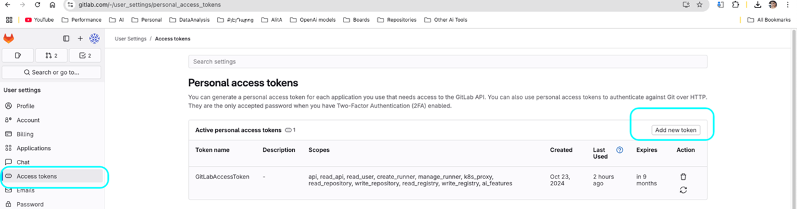
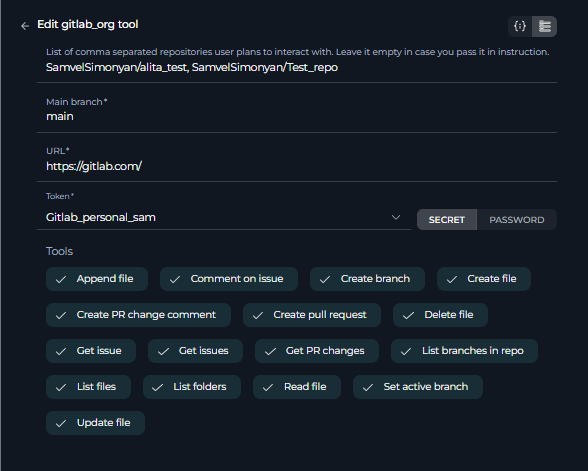

# ELITEA Toolkit Guide: GitLab Org Integration

## Introduction

### Purpose of this Guide

This guide is your definitive resource for integrating and effectively utilizing the **GitLab Org toolkit** within ELITEA. It provides a detailed, step-by-step walkthrough, from setting up your GitLab Personal Access Token to configuring the toolkit in ELITEA and seamlessly incorporating it into your Agents for organizational-level repository management. By following this guide, you will unlock the full potential of automated code management, streamlined development workflows across your GitLab Organization, and enhanced team collaboration, all directly within the ELITEA platform. This integration empowers you to leverage AI-driven automation to optimize your software development lifecycle within your GitLab Organization, harnessing the combined strengths of ELITEA and GitLab Org.

### Brief Overview of GitLab Org

GitLab Org refers to the organizational structure within GitLab, designed to manage multiple projects and users under a single, centralized umbrella. It is a powerful feature of GitLab, especially for larger teams and enterprises, offering enhanced control and collaboration across numerous projects. GitLab Org provides a hierarchical structure for managing your DevOps lifecycle and offers functionalities including:

*   **Centralized Management of Multiple Projects:** GitLab Org allows you to organize and manage numerous related projects under a single organizational unit (Group), providing a consolidated view and control over your entire portfolio of projects.
*   **Hierarchical Structure with Groups and Subgroups:** GitLab Org enables the creation of a hierarchical structure using groups and subgroups, allowing you to mirror your organizational structure within GitLab and manage projects in a logical and scalable manner.
*   **Centralized User and Permission Management:** GitLab Org facilitates centralized management of users and permissions across all projects within the organization. You can define roles and permissions at the group level, which are then inherited by subgroups and projects, simplifying access control and ensuring consistent security policies.
*   **Enhanced Collaboration Across Teams:** GitLab Org promotes collaboration across teams by providing a shared platform for all projects within the organization. Teams can easily collaborate on related projects, share resources, and maintain consistent workflows across the organization.
*   **Organizational-Level Reporting and Analytics:** GitLab Org provides organizational-level reporting and analytics, giving you insights into the overall health and performance of your DevOps processes across all projects within the organization. This enables data-driven decision-making and continuous improvement at the organizational level.

Integrating GitLab Org with ELITEA brings these powerful organizational-level DevOps capabilities directly into your AI-driven workflows. Your ELITEA Agents can then intelligently interact with your GitLab Organization's repositories to automate code-related tasks across multiple projects, enhance development processes at scale, improve team collaboration across the organization, and leverage AI to optimize your entire software development lifecycle within your GitLab Org.

## Toolkit's Account Setup and Configuration in GitLab Org

### Account Setup

If you do not yet have access to a GitLab Organization account, please follow these steps to gain access:

1.  **Contact your GitLab Organization Administrator:** Access to a GitLab Organization is typically managed by an administrator within your organization. Contact your GitLab administrator or IT support team to request access to your organization's GitLab instance.
2.  **Receive Invitation (If Applicable):** Your GitLab Organization administrator may invite you to join the organization. Check your email inbox for an invitation email from GitLab and follow the instructions in the email to accept the invitation and join the organization.
3.  **Account Creation (If Required):** If you do not have an existing GitLab account, you may be prompted to create one as part of the organization access process. Follow the steps to create a GitLab account, as described in the standard GitLab Integration Guide, using your company email address if possible.
4.  **Log In to GitLab Org:** Once your account is set up and you have been granted access to the GitLab Organization, log in to your organization's GitLab instance using your credentials. The URL for your GitLab Organization may be different from the standard GitLab.com, depending on your organization's setup (e.g., `gitlab.yourcompany.com`).

### Token/API Key Generation: Creating a Personal Access Token in GitLab for Org Access

For secure integration with ELITEA and to enable access to your GitLab Organization's repositories, it is essential to utilize a GitLab **Personal Access Token (PAT)**. This method is significantly more secure than using your primary GitLab account password directly and provides granular control over the permissions granted to ELITEA for organizational access.

**Follow these steps to generate a Personal Access Token (PAT) in GitLab for GitLab Org Integration:**

1.  **Log in to GitLab Org:** Access your GitLab Organization's GitLab instance (e.g., `gitlab.yourcompany.com`) and log in with your organizational account credentials.
2.  **Access User Settings:** Click on your profile avatar, located in the top right corner of the GitLab interface. From the dropdown menu, select **"Edit profile"**.
3.  **Navigate to Access Tokens:** In the left-hand sidebar of your profile settings, click on **"Access Tokens"**.
4.  **Generate New Token:** Click the **"Add new token"** button to begin the process of creating a new Personal Access Token.
5.  **Configure Token Details:**
    *   **Token name:** In the "Token name" field, provide a descriptive and easily recognizable label for your token, such as "ELITEA Org Integration Token" or "ELITEA Agent Org Access." This label will help you identify the purpose of this token for organizational access in the future.
    *   **Expiration date (Recommended):** For enhanced security, it is strongly recommended to set an **Expiration date** for your token. Choose a reasonable validity period that aligns with your organization's security policies. Setting an expiration date limits the token's lifespan and reduces the potential security risk if the token is ever compromised.
    *   **Select Scopes - Grant Least Privilege for Org Access (Crucial for Security):** Carefully and deliberately select the **scopes** or permissions you grant to this Personal Access Token. **It is of utmost importance to grant only the minimum necessary permissions** required for your ELITEA Agent's intended interactions with your GitLab Organization's repositories. Overly permissive tokens significantly increase the potential security risk, especially at the organizational level. For typical ELITEA integration with GitLab Org, consider these minimal scopes:

        *   **Minimal Scopes for Common Org Use Cases:**
            *   **api:** (Provides full access to the GitLab API, encompassing all groups and projects within the organization. If possible, for enhanced security, consider using more granular scopes instead of the broad `api` scope, especially if you only need read access.)
                *   **read_api:** (Allows read-only access to the GitLab API for the organization, suitable for retrieving data without modification.)
                *   **read_repository:** (Grants read-only access to repositories within the organization, enabling actions like listing files and reading file content.)
                *   **write_repository:** (Grants write access to repositories within the organization, allowing actions like creating branches, creating files, and updating file content. Only include this if your Agent needs to modify repositories within the Org.)

        *   **Additional Scopes for Specific Functionality (Grant only when required for Org-Level Actions):**
            *   **read_user:** (Allows read access to user profiles within the organization, useful for user-related actions at the organizational level.)
            *   **read_issue:** (Grants read access to issues across the organization, enabling issue retrieval and listing across projects.)
            *   **write_issue:** (Grants write access to issues across the organization, allowing issue creation and updates across projects. Include only if your Agent needs to manage issues at the organizational level.)
            *   **read_merge_requests:** (Allows read access to merge requests across the organization, enabling merge request retrieval and listing across projects.)
            *   **write_merge_requests:** (Grants write access to merge requests across the organization, allowing merge request creation and updates across projects. Include only if your Agent needs to manage merge requests at the organizational level.)

    **Important Security Best Practices for GitLab Org Integration:**

    *   **Principle of Least Privilege (Organizational Level):** **Strictly adhere to the principle of least privilege, especially when granting access at the GitLab Organization level.** Grant only the absolute minimum set of scopes necessary for your ELITEA Agent to perform its specific, intended tasks across the organization. Carefully consider the potential impact of each scope at the organizational level.
    *   **Avoid "sudo" or Admin Scopes (Organizational Level):** **Never grant "sudo" or other administrative scopes unless absolutely essential and with explicit authorization from your organization's security team.** Administrative scopes provide extensive access to your entire GitLab Organization and should be avoided for integration purposes due to the significant security risks.
    *   **Regular Token Review and Rotation (Organizational Level):** Implement a rigorous process for regularly reviewing the Personal Access Tokens used for GitLab Org integration, their associated scopes, and their usage patterns. Rotate tokens frequently (generate new tokens and immediately revoke older ones) as a critical security measure for organizational-level integrations, especially those handling sensitive code or critical workflows.
    *   **Secure Storage (Organizational Level):** Store the generated GitLab Org Personal Access Token with extreme care, utilizing ELITEA's built-in Secrets Management feature, which is designed for securely managing sensitive credentials. Avoid storing tokens in less secure locations or hardcoding them directly in Agent configurations, as this significantly increases the risk of unauthorized access to your GitLab Organization.

6.  **Create Personal Access Token:** Click the **"Create personal access token"** button located at the bottom of the page to generate your token.
7.  **Securely Copy and Store the Token (Organizational Level):** **Immediately copy the generated Personal Access Token** that is displayed on the subsequent page. **This is the only time you will be able to view and copy the full token value.** Store it with utmost security using a robust password manager or, ideally, ELITEA's built-in Secrets feature, ensuring that access to this token is strictly controlled and auditable within your organization. You will require this token to configure the GitLab Org toolkit within ELITEA.

## System Integration with ELITEA

### Agent Creation/Configuration

To integrate GitLab Org functionalities into your workflows, you will need to configure the GitLab Org toolkit within an ELITEA Agent. You can either create a new Agent specifically for GitLab Org interactions or modify an existing Agent to incorporate GitLab Org tools.

1.  **Navigate to Agents Menu:** In ELITEA, access the **Agents** menu from the main navigation panel.
2.  **Create or Edit Agent:**
    *   **Create a New Agent:** Click on the **"+ Agent"** button to initiate the creation of a new Agent. Follow the on-screen prompts to define essential Agent attributes such as Agent name, a descriptive Agent description, the desired Agent type, and initial instructions for the Agent.
    *   **Edit an Existing Agent:** Select the Agent you intend to integrate with GitLab Org from your list of Agents. Click on the Agent's name to open its configuration settings for editing.
3.  **Access Tools Section:** Within the Agent configuration interface, scroll down until you locate the **"Tools"** section. This section is where you will add and configure toolkits, including the GitLab Org toolkit.

### Toolkit Configuration

This section provides detailed instructions on how to configure the GitLab Org toolkit within your ELITEA Agent for organizational-level repository access.

1.  **Add Toolkit:** In the "Tools" section of the Agent configuration, click on the **"+" icon**. This action will display a dropdown list of available toolkits that can be integrated with your Agent.
2.  **Select GitLab Org Toolkit:** From the dropdown list of available toolkits, choose **"GitLab Org"**. Selecting "GitLab Org" will open the "New GitLab Org tool" configuration panel, where you will specify the settings for your GitLab Org integration.
3.  **Configure GitLab Org Toolkit Settings:** Carefully fill in the following configuration fields within the "New GitLab Org tool" section:

    *   **GitLab URL:** Enter the base URL of your GitLab instance.
        *   For **GitLab.com (Cloud)**: Use the standard GitLab.com URL: `https://gitlab.com`.
        *   For **Self-Hosted GitLab Instances**: If your organization uses a self-hosted GitLab instance (GitLab Enterprise Edition), enter the specific URL of your GitLab server. For example, `https://gitlab.yourcompany.com`. **Ensure you include `https://` or `http://` at the beginning of the URL.**
    *   **API Token:** In the "API token" field, paste the **Personal Access Token** that you generated in GitLab during the "Software-Specific Setup" section of this guide.
        *   **Enhanced Security with Secrets (Recommended):** For enhanced security, it is strongly recommended to use ELITEA's **Secrets Management** feature to store your GitLab Personal Access Token securely. Instead of directly pasting the token into the "API token" field, select the **"Secret"** option and choose the pre-configured secret containing your GitLab Org token from the dropdown list. This prevents hardcoding sensitive organizational credentials in your toolkit configuration.
    *   **Repository Name:** Specify the **Repository names** that you want to access with this toolkit. **Enter a list of comma-separated repository names if you plan to interact with a predefined set of repositories within your Agent's instructions.** Use the format: `group_or_username/repository_name`.
        *   For **Organizational Access**: **Leave this field empty if you intend to dynamically specify the repository name within your Agent's instructions at runtime.** This allows for greater flexibility, enabling your Agent to interact with different repositories within the GitLab Organization based on the context of the workflow or user input.
        *   For **Predefined Repositories**: If you are configuring the toolkit for a specific, limited set of repositories, you can enter them here as a comma-separated list (e.g., `my_group/repo1,my_group/repo2,another_group/repo3`).

    

4.  **Enable Desired Tools:** In the "Tools" section within the GitLab Org toolkit configuration panel, **select the checkboxes next to the specific GitLab tools** that you want to enable for your Agent. **It is crucial to enable only the tools that your Agent will actually need to use** to adhere to the principle of least privilege and minimize potential security risks, especially when dealing with organizational-level access. Available tools are identical to the standard GitLab toolkit and include:
    *   **Create branch** - Allows the Agent to create new branches in the repository.
    *   **Create file** - Enables the Agent to create new files within the repository.
    *   **Create PR change comment** - Allows the Agent to add comments to specific changes within a pull request (Merge Request in GitLab).
    *   **Create pull request** - Enables the Agent to create new pull requests (Merge Requests) for code review.
    *   **Delete file** - Allows the Agent to delete files from the repository.
    *   **Get PR changes** - Enables the Agent to retrieve the changes introduced in a specific pull request (Merge Request).
    *   **List branches in repo** - Allows the Agent to list all branches within the repository.
    *   **List files** - Enables the Agent to list all files within the repository.
    *   **Read file** - Allows the Agent to read the content of files within the repository.
    *   **Set active branch** - Enables the Agent to set a specific branch as the active branch for subsequent operations.
    *   **Update file** - Allows the Agent to update the content of existing files within the repository.
    *   **Append file** - Allows the Agent to append content to existing files within the repository.
    *   **Get Issue** - Allows the Agent to fetch details of a specific issue and its initial comments.
    *   **Get Issues** - Allows the Agent to retrieve a list of all open issues in the repository.
    *   **Comment on Issue** - Allows the Agent to add comments to existing issues in the repository.
    *   **List Folders** - Allows the Agent to list folders within a specified path in the repository.

5.  **Complete Setup:** After configuring all the necessary settings and enabling the desired tools, click the **arrow icon** (located at the top right of the toolkit configuration section) to finalize the GitLab Org toolkit setup and return to the main Agent configuration menu.
6.  Click **Save** in the Agent configuration to save all changes and activate the GitLab Org toolkit integration for your Agent.

### Tool Overview: GitLab Org Toolkit Functionalities

Once the GitLab Org toolkit is successfully configured and added to your Agent, you can leverage the following tools within your Agent's instructions to enable intelligent interaction with your GitLab repositories:

*   **Create branch:**  **Tool Name:** `create_branch`
    *   **Functionality:** Automates the creation of a new branch within the specified GitLab repository. Requires parameters such as the new branch name and the base branch to branch from.
    *   **Purpose:** Streamlines branch management by enabling Agents to automatically create new branches for feature development, bug fixes, or experimental code changes directly from ELITEA workflows, ensuring organized and efficient branching strategies.

*   **Create file:** **Tool Name:** `create_file`
    *   **Functionality:** Automates the creation of a new file within the specified GitLab repository at a given path with specified content.
    *   **Purpose:** Enables automated creation of new code files, documentation files, configuration files, or any other type of file within your repository directly from ELITEA workflows, ensuring consistency and reducing manual file creation tasks.

*   **Create PR change comment:** **Tool Name:** `create_pr_change_comment`
    *   **Functionality:** Automates adding comments to specific changes within a GitLab Merge Request (Pull Request). Requires the Merge Request ID, the path to the changed file, the position within the file, and the comment text.
    *   **Purpose:** Facilitates more granular and contextual code review feedback by allowing Agents to automatically add comments directly to specific lines or sections of code changes within Merge Requests, improving the clarity and efficiency of code reviews.

*   **Create pull request:** **Tool Name:** `create_pull_request`
    *   **Functionality:** Automates the creation of a new Merge Request (Pull Request) in the specified GitLab repository. Requires parameters such as the source branch, target branch, Merge Request title, and description.
    *   **Purpose:** Streamlines the code review and merging process by automating Merge Request creation for code contributions, feature branches, or bug fixes directly from ELITEA. Reduces manual effort for developers and accelerates code integration workflows.

*   **Delete file:** **Tool Name:** `delete_file`
    *   **Functionality:** Automates the deletion of a specified file from the GitLab repository. Requires the file path and branch name as parameters.
    *   **Purpose:** Enables automated file cleanup and codebase management by allowing Agents to delete obsolete files, remove temporary files, or enforce file lifecycle policies within your repository, helping maintain a clean and organized codebase.

*   **Get PR changes:** **Tool Name:** `get_pr_changes`
    *   **Functionality:** Retrieves the details of changes introduced within a specific GitLab Merge Request (Pull Request). Returns information about the files changed, additions, and deletions.
    *   **Purpose:** Provides Agents with the ability to analyze code changes within Merge Requests, facilitating automated code review analysis, change impact assessment, or generating summaries of modifications for reviewers, enhancing code review automation and insights.

*   **List branches in repo:** **Tool Name:** `list_branches_in_repo`
    *   **Functionality:** Retrieves a list of all branches available in the specified GitLab repository. Provides a simple list of branch names.
    *   **Purpose:** Enables Agents to obtain a comprehensive list of branches for branch management automation, generating reports on repository branching structure, providing users with branch selection options within ELITEA workflows, or automating branch-related decision-making processes.

*   **List files:** **Tool Name:** `list_files`
    *   **Functionality:** Retrieves a list of all files within the specified GitLab repository at the root level of the repository's default branch. Provides a flat list of file paths.
    *   **Purpose:** Allows Agents to programmatically browse the top-level contents of a repository, providing a quick overview of the repository's structure, enabling basic file listing for navigation or automated file processing workflows.

*   **Read file:** **Tool Name:** `read_file`
    *   **Functionality:** Reads and retrieves the content of a specific file from the specified GitLab repository. Requires the file path and branch name as parameters.
    *   **Purpose:** Enables Agents to dynamically access and utilize file contents from your GitLab repository, allowing retrieval of code snippets, configuration parameters, documentation content, or any other file data to provide context, data, or instructions within ELITEA workflows and conversations, facilitating dynamic and data-driven automation.

*   **Set active branch:** **Tool Name:** `set_active_branch`
    *   **Functionality:** Sets a specific branch as the currently active branch within the GitLab toolkit's context. Directs subsequent file-related operations to target this active branch.
    *   **Purpose:** Ensures that file operations performed by the Agent are executed within the intended branch context, improving workflow accuracy and preventing unintended modifications to incorrect branches. Provides branch context management for reliable file-based automation.

*   **Update file:** **Tool Name:** `update_file`
    *   **Functionality:** Updates the content of a specific, existing file within the GitLab repository. Replaces the entire file content with the provided new content. Requires the file path, branch name, and new file content as parameters.
    *   **Purpose:** Automates the process of updating code files, documentation, configuration files, or any file content within your repository based on ELITEA workflow outputs, user requests, or external triggers. Ensures configurations are synchronized, documentation is kept current, and codebase modifications are automated and version-controlled.

*   **Append file:** **Tool Name:** `append_file`
    *   **Functionality:** Appends content to the end of an existing file within the GitLab repository. Requires the file path, branch name, and content to append as parameters.
    *   **Purpose:** Enables automated appending of data to log files, documentation files, or other files where incremental content addition is needed. Useful for adding timestamps, generating audit trails, or accumulating data within repository files through automated workflows.

*   **Get Issue:** **Tool Name:** `get_issue`
    *   **Functionality:** Fetches a specific issue and its first 10 comments from the GitLab repository. Requires the issue number and repository name as parameters.
    *   **Purpose:** Allows retrieval of detailed information about a specific issue, including its description and initial comments. Useful for tracking issue progress, understanding the context of the issue, and facilitating communication among team members.

*   **Get Issues:** **Tool Name:** `get_issues`
    *   **Functionality:** Fetches all open issues from the GitLab repository. Requires the repository name as a parameter.
    *   **Purpose:** Provides a comprehensive list of all open issues within the repository. Useful for project management, tracking outstanding tasks, and prioritizing work based on issue status.

*   **Comment on Issue:** **Tool Name:** `comment_on_issue`
    *   **Functionality:** Adds a comment to a GitLab issue. Requires the issue number, comment text, and repository name as parameters.
    *   **Purpose:** Facilitates communication and collaboration by allowing team members to add comments to issues. Useful for providing updates, asking questions, and sharing information related to the issue.

*   **List Folders:** **Tool Name:** `list_folders`
    *   **Functionality:** Lists folders within a specified path in the GitLab repository. Requires the repository path, branch name, and an optional recursive flag as parameters.
    *   **Purpose:** Enables navigation and exploration of the repository's folder structure. Useful for understanding the organization of files and directories, locating specific folders, and managing repository contents.

## Use Cases

The GitLab Org toolkit unlocks a vast array of automation possibilities for managing software development workflows across your entire GitLab Organization within ELITEA. Here are key use cases, demonstrating how each tool can be effectively applied to streamline development processes and enhance productivity at the organizational level:

*   **Centralized Automated Branch Management Across Projects:**
    *   **Scenario:** When initiating a new organizational-wide feature or security patch, automatically create dedicated feature branches across multiple relevant repositories within the GitLab Org, ensuring consistent branching across projects.
    *   **Tools Used:** `create_branch`
    *   **Example Instruction:** "Use the 'create_branch' tool to create a new branch named 'org-feature-branch-name' based on the 'main' branch in repositories: 'my_group/repo1,my_group/repo2,another_group/repo3'."
    *   **Benefit:** Streamlines branch management across multiple projects within the organization, ensures consistent branching strategies for organizational initiatives, and reduces manual branch creation effort for large-scale changes.

*   **Organizational-Wide Code Snippet Retrieval for Standardization:**
    *   **Scenario:** During organizational-level standardization efforts, retrieve code snippets or configuration templates from a designated "template" repository within the GitLab Org and apply them across multiple projects to enforce consistency.
    *   **Tools Used:** `read_file`
    *   **Example Instruction:** "Use the 'read_file' tool to read the content of the file 'templates/code_template.txt' from the repository 'org_templates/common_templates' and apply this template to new files created in repositories: 'my_group/repo1,my_group/repo2'."
    *   **Benefit:** Enhances code standardization and consistency across the organization by enabling easy retrieval and application of templates and best practices from a central repository, promoting code quality and maintainability.

*   **Automated Documentation Updates Across Projects:**
    *   **Scenario:** When organizational-level policies or guidelines change, automatically update relevant documentation files across multiple documentation repositories within the GitLab Org to ensure consistent and up-to-date information across all projects.
    *   **Tools Used:** `read_file`, `update_file`
    *   **Example Instruction:** "Use the 'read_file' tool to get the current content of 'README.md' in repositories 'my_group/docs1,another_group/docs2'. Update it with the new organizational guidelines and use 'update_file' to save the updated content back to each 'README.md' in the 'main' branch."
    *   **Benefit:** Keeps documentation synchronized with organizational-level changes across multiple projects, reducing manual effort and errors in documentation maintenance and ensuring consistent information dissemination.

*   **Bulk Merge Request Automation for Organizational Refactoring:**
    *   **Scenario:** After performing a large-scale refactoring across multiple repositories within the GitLab Org, automatically create merge requests for each refactored branch to merge the changes into the respective 'develop' branches for code review and integration.
    *   **Tools Used:** `create_pull_request`
    *   **Example Instruction:** "Use the 'create_pull_request' tool to create merge requests from branch 'refactor-branch' to 'develop' branch with the title 'Organizational Refactoring Review' and description 'Please review the organizational refactoring changes' for repositories: 'my_group/repo1,my_group/repo2,another_group/repo3'."
    *   **Benefit:** Automates the merge request process for large-scale organizational changes, facilitating timely code reviews and improving code quality across multiple projects during significant refactoring efforts.

*   **Centralized Reporting on Branching Structure Across Org:**
    *   **Scenario:** A GitLab Org administrator wants a quick overview of all active branches across all repositories within the organization for governance and monitoring purposes.
    *   **Tools Used:** `list_branches_in_repo`
    *   **Example Instruction:** "Use the 'list_branches_in_repo' tool to list all branches in repositories: 'my_group/repo1,my_group/repo2,another_group/repo3' and present a consolidated report of all branches across these repositories."
    *   **Benefit:** Provides easy access to branch information across the entire GitLab Organization, facilitating organizational-level project monitoring, branch management governance, and understanding of the overall development landscape.

*   **Consistent Branch Context for Org-Wide Operations:**
    *   **Scenario:** Before performing a series of automated file operations across multiple repositories, ensure the Agent is working on the correct branch in each repository to maintain consistency and avoid errors.
    *   **Tools Used:** `set_active_branch`
    *   **Example Instruction:** "First, use 'set_active_branch' to set the active branch to 'develop' for repositories: 'my_group/repo1,my_group/repo2'. Then, proceed with the file operations in each repository within this active branch context."
    *   **Benefit:** Ensures operations are performed on the intended branch context across multiple repositories, reducing the risk of errors and unintended modifications during organizational-level automated workflows, improving workflow reliability and accuracy at scale.

## Troubleshooting and Support

### Troubleshooting Common Issues

*   **Connection Errors:**
    *   **Problem:** ELITEA Agent fails to connect to GitLab Org, resulting in errors during toolkit execution.
    *   **Troubleshooting Steps:**
        1.  **Verify GitLab URL:** Double-check that the **GitLab URL** field in the toolkit configuration is correctly set to your GitLab Org instance URL (e.g., `https://gitlab.com` or `https://gitlab.yourcompany.com`). Ensure it includes `https://` or `http://`.
        2.  **Check Personal Access Token:** Ensure that the **Personal Access Token** you provided is correct, has not expired, and is valid for your GitLab Org account and for organizational access. Carefully re-enter or copy-paste the token to rule out typos.
        3.  **Verify Token Scopes:** Review the **scopes/permissions** granted to your GitLab Org Personal Access Token in GitLab. Ensure it has the necessary scopes (e.g., `api`, `read_repository`, `write_repository`, `read_user`) for the GitLab Org tools your Agent is trying to use across the organization. Insufficient scopes are a common cause of connection and permission errors, especially at the organizational level.
        4.  **Network Connectivity:** Confirm that both your ELITEA environment and the GitLab Org instance are connected to the internet and that there are no network connectivity issues, firewalls, or proxies blocking the integration. Test network connectivity to your GitLab Org URL from your ELITEA environment if possible.

*   **Authorization Errors (Permission Denied/Unauthorized) at Org Level:**
    *   **Problem:** Agent execution fails with "Permission Denied" or "Unauthorized" errors when trying to access or modify GitLab Org resources, especially across multiple repositories.
    *   **Troubleshooting Steps:**
        1.  **Re-verify Token Scopes (Org Level):** Double-check the **scopes/permissions** granted to your GitLab Org Personal Access Token with extreme care. Ensure it grants sufficient access for the specific GitLab Org actions your Agent is trying to perform across the organization (e.g., `write_repository` scope for creating branches or files in multiple repositories). Verify that the scopes are appropriate for organizational-level access.
        2.  **Organizational Access Verification:** Confirm that the GitLab Org account associated with the Personal Access Token has the required access to the GitLab Organization itself and to all the specific repositories within the organization that your Agent needs to interact with. Verify that the account has the necessary roles or permissions at the organizational level (e.g., Owner or Maintainer role for broad organizational access). Check organization-level settings in GitLab to confirm access levels.
        3.  **Token Revocation or Expiration:** Ensure that the Personal Access Token has not been accidentally revoked in GitLab settings or that it has not reached its expiration date if you set one. Generate a new token as a test if unsure.

*   **Incorrect Repository Names (Org Level):**
    *   **Problem:** Agent tools fail to operate on the intended repositories within the GitLab Org, often resulting in "Repository not found" errors, especially when working with multiple repositories.
    *   **Troubleshooting Steps:**
        1.  **Double-Check Repository Names:** Carefully verify that you have entered the correct GitLab Repository names in your Agent's instructions, using the format `group_or_username/repository_name`. Pay close attention to capitalization, spelling, and ensure the repository paths are accurate for the GitLab Organization structure.
        2.  **Verify Repository Existence within Org:** Confirm that all specified repositories actually exist within your GitLab Organization and that the repository names and paths are correct within the organizational hierarchy. It's possible repository names or group paths have changed, or repositories have been moved or deleted within the Org.
        3.  **Comma Separation and Formatting:** If you are providing a comma-separated list of repositories in the toolkit configuration or Agent instructions, ensure that the repository names are correctly separated by commas without extra spaces or incorrect formatting.

### FAQs

1.  **Q: Can I use my regular GitLab Org password for the ELITEA integration?**
    *   **A:** No, it is **strongly recommended to use a GitLab Personal Access Token** instead of your main account password for security reasons, especially for organizational-level integrations. Personal Access Tokens provide a more secure and controlled way to grant access to external applications like ELITEA, and are essential for secure organizational access.

2.  **Q: What scopes/permissions should I grant to the GitLab Org Personal Access Token?**
    *   **A:** Grant only the **minimum necessary scopes** required for your ELITEA Agent's intended interactions with your GitLab Organization. For typical organizational-level integration, the `api` scope (or granular `read_api`, `read_repository`, `write_repository`) is often necessary to access resources across the organization. Carefully consider the principle of least privilege and avoid granting "sudo" or unnecessary permissions, especially at the organizational level.

3.  **Q: What is the correct format for the GitLab Repository names when specifying multiple repositories for the GitLab Org toolkit?**
    *   **A:** When specifying multiple repositories, use a comma-separated list in the format `group_or_username/repository_name,group_or_username/repository_name,...` (e.g., `my_group/repo1,my_group/repo2,another_group/repo3`). Ensure each repository name is correctly formatted with the group path or username and the repository name separated by a forward slash `/`.

4.  **Q: Why is my Agent getting "Permission Denied" errors when using the GitLab Org toolkit, even though I think I have the right permissions?**
    *   **A:** If you are encountering "Permission Denied" errors with the GitLab Org toolkit, carefully re-examine the following:
        *   **Token Scope Accuracy (Org Level):** Double and triple-check the **scopes/permissions** granted to your GitLab Org Personal Access Token in your GitLab user settings. Ensure that the token possesses the *exact* scopes required for *each* GitLab tool your Agent is attempting to use across the organization. Verify that the scopes are sufficient for organizational-level access if needed.
        *   **Organizational Access Verification:** Explicitly verify that the GitLab Org account associated with the Personal Access Token has the necessary access rights to the *GitLab Organization itself* and to *all target repositories* within the organization. Confirm organizational membership and assigned roles/permissions within GitLab Org settings.
        *   **Token Validity and Revocation:** Double-check that the Personal Access Token is still valid, has not expired, and has not been accidentally revoked in your GitLab settings. Generate a new token as a test if unsure.
        *   **Repository Name Accuracy (Org Level):** Carefully review all repository names in your Agent instructions and toolkit configuration, ensuring they are correctly spelled, capitalized, and formatted with the correct group paths for your GitLab Organization's structure.

If, after meticulously checking all of these points, you still encounter "Permission Denied" errors when using the GitLab Org toolkit, please reach out to ELITEA Support with detailed information for further assistance.

### Support and Contact Information

If you encounter any issues, have questions, or require further assistance beyond what is covered in this guide regarding the GitLab Org integration or ELITEA Agents in general, please do not hesitate to contact our dedicated ELITEA Support Team. We are here to help you resolve any problems quickly and efficiently and ensure you have a smooth and productive experience with ELITEA.

**How to Reach ELITEA Support:**

*   **Email:**  **[SupportAlita@epam.com](mailto:SupportAlita@epam.com)**

**Best Practices for Effective Support Requests:**

To help us understand and resolve your issue as quickly as possible, please ensure you provide the following information in your support email:

*   **ELITEA Environment:** Clearly specify the ELITEA environment you are using (e.g., "Nexus," "Alita Lab," "EYE").
*   **Project Details:**  Indicate the **Project Name** and whether you are working in your **Private** workspace or a **Team** project.
*   **Detailed Issue Description:** Provide a clear, concise, and detailed description of the problem you are encountering. Explain what you were trying to do, what you expected to happen, and what actually occurred.
*   **Relevant Configuration Information:**  To help us diagnose the issue, please include relevant configuration details, such as:
    *   **Agent Instructions (Screenshot or Text):** If the issue is with an Agent, provide a screenshot or copy the text of your Agent's "Instructions" field.
    *   **Toolkit Configurations (Screenshots):** If the issue involves the GitLab Org toolkit or other toolkits, include screenshots of the toolkit configuration settings within your Agent.
*   **Error Messages (Full Error Text):** If you are encountering an error message, please provide the **complete error text**. In the Chat window, expand the error details and copy the full error message. This detailed error information is crucial for diagnosis.
*   **Your Query/Prompt (Exact Text):** If the issue is related to Agent execution, provide the exact query or prompt you used to trigger the issue.

**Before Contacting Support:**

We encourage you to first explore the resources available within this guide and the broader ELITEA documentation. You may find answers to common questions or solutions to known issues in the documentation.

## Useful Links

To further enhance your understanding and skills in integrating GitLab Org with ELITEA, here are some helpful resources:

*   **[GitLab Website](https://gitlab.com/)**: Access the main GitLab platform to create an account or log in.
*   **[GitLab Login Page](https://gitlab.com/)**: Directly access the login page for GitLab.
*   **[ELITEA Secrets Management](../../platform-documentation/menus/settings.md#secrets)**: Learn how to securely store your GitLab Personal Access Token using ELITEA's Secrets management feature for enhanced security.
*   **[ELITEA Agents Configuration](../../platform-documentation/menus/agents.md)**:  Find out more about creating and configuring Agents in ELITEA, where you integrate the GitLab Org toolkit to automate your workflows.
*   **[ELITEA Support Email](mailto:SupportAlita@epam.com)**: Contact the ELITEA support team for direct assistance with GitLab Org integration or any other questions and issues you may encounter.