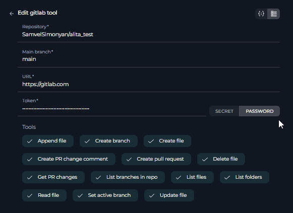

# ELITEA Toolkit Guide: GitLab Integration

## Introduction

### Purpose of this Guide

This guide serves as your definitive resource for integrating and effectively utilizing the **GitLab toolkit** within ELITEA. It provides a detailed, step-by-step walkthrough, from setting up your GitLab Personal Access Token to configuring the toolkit in ELITEA and seamlessly incorporating it into your Agents. By following this guide, you will unlock the full potential of automated code management, streamlined development workflows, and enhanced team collaboration, all directly within the ELITEA platform. This integration empowers you to leverage AI-driven automation to optimize your software development lifecycle, harnessing the combined strengths of ELITEA and GitLab.

### Brief Overview of GitLab

GitLab is a powerful, web-based DevOps platform that provides a comprehensive suite of tools for the entire software development lifecycle, delivered as a single, integrated application.  It is widely adopted by development teams for its robust features and collaborative environment. GitLab excels as a version control repository manager and offers a wide array of functionalities, including:

*   **Centralized Git Repository Management:** GitLab provides a robust and scalable platform for hosting and managing Git repositories, ensuring efficient version control, code organization, and secure access management for your entire codebase.
*   **Enhanced Collaboration Features:** GitLab fosters seamless team collaboration with features such as Merge Requests for code review, robust Issue Tracking for project management, Wikis for documentation, and in-line Code Review tools, facilitating a collaborative and transparent development process.
*   **Integrated CI/CD Pipelines:** GitLab CI/CD is a powerful built-in Continuous Integration and Continuous Delivery system that automates the entire software pipeline, from building and testing code to deploying applications, enabling rapid and reliable software releases.
*   **Comprehensive Project Management Tools:** GitLab includes a rich set of project planning and management features, such as Issue Boards for agile task management, Milestones for tracking progress against deadlines, and Time Tracking to monitor effort, streamlining software development workflows and improving project visibility.
*   **DevSecOps Capabilities:** GitLab integrates security scanning and testing throughout the DevOps lifecycle, enabling teams to build secure applications and proactively address vulnerabilities early in the development process, promoting a DevSecOps approach.

Integrating GitLab with ELITEA brings these powerful DevOps capabilities directly into your AI-driven workflows. Your ELITEA Agents can then intelligently interact with your GitLab repositories to automate code-related tasks, enhance development processes, improve team collaboration, and leverage AI to optimize your entire software development lifecycle.


## Toolkit's Account Setup and Configuration in GitLab

### Account Setup

If you do not yet have a GitLab account, please follow these steps to create one:

1.  **Visit GitLab Website:** Open your web browser and navigate to the official GitLab website: [gitlab.com](https://gitlab.com/).
2.  **Register/Sign Up:** Click on the **"Register"** or **"Sign Up"** button, typically located in the top right corner of the homepage.
3.  **Enter Account Details:** Fill in the required information on the signup form. This usually includes your desired username, email address, full name, and a secure password. **Note:** For professional use cases, it is strongly recommended to use your **company email address**.
4.  **Email Verification:** Check your email inbox for a verification email sent by GitLab. Click on the confirmation link provided in the email to verify your email address and activate your newly created GitLab account.
5.  **Log In to GitLab:** Once your email is verified, log in to GitLab using your chosen username and password. You are now ready to proceed with GitLab account configuration.

### Token/API Key Generation: Creating a Personal Access Token in GitLab

For secure integration with ELITEA, it is highly recommended to utilize a GitLab **Personal Access Token**. This method is significantly more secure than using your primary GitLab account password directly and provides granular control over the permissions granted to ELITEA.

**Follow these steps to generate a Personal Access Token in GitLab:**

1.  **Log in to GitLab:** Access your GitLab account by navigating to [gitlab.com](https://gitlab.com/) and logging in with your credentials.
2.  **Access User Settings:** Click on your profile avatar, located in the top right corner of the GitLab interface. From the dropdown menu, select **"Edit profile"**.
3.  **Navigate to Access Tokens:** In the left-hand sidebar of your profile settings, click on **"Access Tokens"**.
4.  **Generate New Token:** Click the **"Add new token"** button to begin the process of creating a new Personal Access Token.
5.  **Configure Token Details:**
    *   **Token name:** In the "Token name" field, provide a descriptive and easily recognizable label for your token. For example, you could use "ELITEA Integration Token" or "ELITEA Agent Access." This label will help you identify the purpose of this token in the future and manage your tokens effectively.
    *   **Expiration date (Recommended):** For enhanced security, it is strongly recommended to set an **Expiration date** for your token. Choose a reasonable validity period that aligns with your security policies and integration needs. Setting an expiration date limits the token's lifespan and reduces the potential security risk if the token is ever compromised.
    *   **Select Scopes - Grant Least Privilege (Crucial for Security):** Carefully and deliberately select the **scopes** or permissions you grant to this Personal Access Token. **It is of utmost importance to grant only the minimum necessary permissions** required for your ELITEA Agent's intended interactions with GitLab. Overly permissive tokens significantly increase the potential security risk. For typical ELITEA integration, consider these minimal scopes:

        *   **Minimal Scopes for Common Use Cases:**
            *   **api:** (Provides full access to the GitLab API, encompassing all groups and projects. If possible, for enhanced security, consider using more granular scopes instead of the broad `api` scope.)
                *   **read_api:** (Allows read-only access to the GitLab API, suitable for retrieving data without modification.)
                *   **read_repository:** (Grants read-only access to repositories, enabling actions like listing files and reading file content.)
                *   **write_repository:** (Grants write access to repositories, allowing actions like creating branches, creating files, and updating file content. Only include this if your Agent needs to modify the repository.)

        *   **Additional Scopes for Specific Functionality (Grant only when required):**
            *   **read_user:** (Allows read access to user profiles, useful for user-related actions.)
            *   **read_issue:** (Grants read access to issues, enabling issue retrieval and listing.)
            *   **write_issue:** (Grants write access to issues, allowing issue creation and updates. Include only if your Agent needs to manage issues.)
            *   **read_merge_requests:** (Allows read access to merge requests, enabling merge request retrieval and listing.)
            *   **write_merge_requests:** (Grants write access to merge requests, allowing merge request creation and updates. Include only if your Agent needs to manage merge requests.)

    **Important Security Best Practices:**

    *   **Principle of Least Privilege:** **Strictly adhere to the principle of least privilege.** Grant only the absolute minimum set of scopes necessary for your ELITEA Agent to perform its specific, intended tasks. Avoid granting broad or unnecessary permissions.
    *   **Avoid "sudo" or Admin Scopes:** **Never grant "sudo" or other administrative scopes unless absolutely essential and with a clear and thorough understanding of the significant security implications.** Administrative scopes provide extensive access and should be avoided for integration purposes whenever possible.
    *   **Regular Token Review and Rotation:** Implement a process for regularly reviewing the Personal Access Tokens you have generated, their associated scopes, and their usage. Rotate tokens periodically (generate new tokens and revoke older ones) as a proactive security measure, especially for integrations that handle sensitive data or critical operations.
    *   **Secure Storage:** Store the generated Personal Access Token securely, preferably using ELITEA's built-in Secrets Management feature, rather than hardcoding it directly in Agent configurations or less secure storage locations.

6.  **Create Personal Access Token:** Click the **"Create personal access token"** button located at the bottom of the page to generate your token.
7.  **Securely Copy and Store the Token:** **Immediately copy the generated Personal Access Token** that is displayed on the subsequent page. **This is the only time you will be able to view and copy the full token value.** Store it securely using a robust password manager or, ideally, ELITEA's built-in Secrets feature for enhanced security within the ELITEA platform. You will require this token to configure the GitLab toolkit within ELITEA.


## System Integration with ELITEA

### Agent Creation/Configuration

To integrate GitLab functionalities into your workflows, you will need to configure the GitLab toolkit within an ELITEA Agent. You can either create a new Agent specifically for GitLab interactions or modify an existing Agent to incorporate GitLab tools.

1.  **Navigate to Agents Menu:** In ELITEA, access the **Agents** menu from the main navigation panel.
2.  **Create or Edit Agent:**
    *   **Create a New Agent:** Click on the **"+ Agent"** button to initiate the creation of a new Agent. Follow the on-screen prompts to define essential Agent attributes such as Agent name, a descriptive Agent description, the desired Agent type, and initial instructions for the Agent.
    *   **Edit an Existing Agent:** Select the Agent you intend to integrate with GitLab from your list of Agents. Click on the Agent's name to open its configuration settings for editing.
3.  **Access Tools Section:** Within the Agent configuration interface, scroll down until you locate the **"Tools"** section. This section is where you will add and configure toolkits, including the GitLab toolkit.

### Toolkit Configuration

This section provides detailed instructions on how to configure the GitLab toolkit within your ELITEA Agent.

1.  **Add Toolkit:** In the "Tools" section of the Agent configuration, click on the **"+" icon**. This action will display a dropdown list of available toolkits that can be integrated with your Agent.
2.  **Select GitLab Toolkit:** From the dropdown list of available toolkits, choose **"GitLab"**. Selecting "GitLab" will open the "New GitLab tool" configuration panel, where you will specify the settings for your GitLab integration.
3.  **Configure GitLab Toolkit Settings:** Carefully fill in the following configuration fields within the "New GitLab tool" section:

    *   **GitLab URL:** Enter the base URL of your GitLab instance.
        *   For **GitLab.com (Cloud)**: Use the standard GitLab.com URL: `https://gitlab.com`.
        *   For **Self-Hosted GitLab Instances**: If you are using a self-hosted GitLab instance (GitLab Community Edition or GitLab Enterprise Edition), enter the specific URL of your GitLab server. For example, `https://your-gitlab-instance.com`. **Ensure you include `https://` or `http://` at the beginning of the URL.**
    *   **API Token:** In the "API token" field, paste the **Personal Access Token** that you generated in GitLab during the "Software-Specific Setup" section of this guide.
        *   **Enhanced Security with Secrets (Recommended):** For enhanced security, it is strongly recommended to use ELITEA's **Secrets Management** feature to store your GitLab Personal Access Token securely. Instead of directly pasting the token into the "API token" field, select the **"Secret"** option and choose the pre-configured secret containing your GitLab token from the dropdown list. This prevents hardcoding sensitive credentials in your toolkit configuration.
    *   **Repository Name:** Specify the **Repository name** that you want to access with this toolkit. Use the format: `group_or_username/repository_name`.
        *   For **Personal Repositories**: If the repository is under your personal GitLab account, use your username followed by the repository name (e.g., `your_username/my-repo`).
        *   For **Group Repositories**: If the repository belongs to a GitLab group, use the group's path followed by the repository name (e.g., `my_group/project-repo`). **Ensure you use the correct group path, not just the group name.**

    

4.  **Enable Desired Tools:** In the "Tools" section within the GitLab toolkit configuration panel, **select the checkboxes next to the specific GitLab tools** that you want to enable for your Agent. **It is crucial to enable only the tools that your Agent will actually need to use** to adhere to the principle of least privilege and minimize potential security risks. Available tools include:
    *   **Create branch** - Allows the Agent to create new branches in the repository.
    *   **Create file** - Enables the Agent to create new files within the repository.
    *   **Create PR change comment** - Allows the Agent to add comments to specific changes within a pull request (Merge Request in GitLab).
    *   **Create pull request** - Enables the Agent to create new pull requests (Merge Requests) for code review.
    *   **Delete file** - Allows the Agent to delete files from the repository.
    *   **Get PR changes** - Enables the Agent to retrieve the changes introduced in a specific pull request (Merge Request).
    *   **List branches in repo** - Allows the Agent to list all branches within the repository.
    *   **List files** - Enables the Agent to list all files within the repository.
    *   **Read file** - Allows the Agent to read the content of files within the repository.
    *   **Set active branch** - Enables the Agent to set a specific branch as the active branch for subsequent operations.
    *   **Update file** - Allows the Agent to update the content of existing files within the repository.
    *   **Append file** - Allows the Agent to append content to existing files within the repository.
    *   **List Folders** - Allows to List Folders for better navigation within repositories.
    List Folders

5.  **Complete Setup:** After configuring all the necessary settings and enabling the desired tools, click the **arrow icon** (located at the top right of the toolkit configuration section) to finalize the GitLab toolkit setup and return to the main Agent configuration menu.
6.  Click **Save** in the Agent configuration to save all changes and activate the GitLab toolkit integration for your Agent.

### Tool Overview: GitLab Toolkit Functionalities

Once the GitLab toolkit is successfully configured and added to your Agent, you can leverage the following tools within your Agent's instructions to enable intelligent interaction with your GitLab repositories:

*   **Create branch:**  **Tool Name:** `create_branch`
    *   **Functionality:** Automates the creation of a new branch within the specified GitLab repository. Requires parameters such as the new branch name and the base branch to branch from.
    *   **Purpose:** Streamlines branch management by enabling Agents to automatically create new branches for feature development, bug fixes, or experimental code changes directly from ELITEA workflows, ensuring organized and efficient branching strategies.

*   **Create file:** **Tool Name:** `create_file`
    *   **Functionality:** Automates the creation of a new file within the specified GitLab repository at a given path with specified content.
    *   **Purpose:** Enables automated creation of new code files, documentation files, configuration files, or any other type of file within your repository directly from ELITEA workflows, ensuring consistency and reducing manual file creation tasks.

*   **Create PR change comment:** **Tool Name:** `create_pr_change_comment`
    *   **Functionality:** Automates adding comments to specific changes within a GitLab Merge Request (Pull Request). Requires the Merge Request ID, the path to the changed file, the position within the file, and the comment text.
    *   **Purpose:** Facilitates more granular and contextual code review feedback by allowing Agents to automatically add comments directly to specific lines or sections of code changes within Merge Requests, improving the clarity and efficiency of code reviews.

*   **Create pull request:** **Tool Name:** `create_pull_request`
    *   **Functionality:** Automates the creation of a new Merge Request (Pull Request) in the specified GitLab repository. Requires parameters such as the source branch, target branch, Merge Request title, and description.
    *   **Purpose:** Streamlines the code review and merging process by automating Merge Request creation for code contributions, feature branches, or bug fixes directly from ELITEA. Reduces manual effort for developers and accelerates code integration workflows.

*   **Delete file:** **Tool Name:** `delete_file`
    *   **Functionality:** Automates the deletion of a specified file from the GitLab repository. Requires the file path and branch name as parameters.
    *   **Purpose:** Enables automated file cleanup and codebase management by allowing Agents to delete obsolete files, remove temporary files, or enforce file lifecycle policies within your repository, helping maintain a clean and organized codebase.

*   **Get PR changes:** **Tool Name:** `get_pr_changes`
    *   **Functionality:** Retrieves the details of changes introduced within a specific GitLab Merge Request (Pull Request). Returns information about the files changed, additions, and deletions.
    *   **Purpose:** Provides Agents with the ability to analyze code changes within Merge Requests, facilitating automated code review analysis, change impact assessment, or generating summaries of modifications for reviewers, enhancing code review automation and insights.

*   **List branches in repo:** **Tool Name:** `list_branches_in_repo`
    *   **Functionality:** Retrieves a list of all branches available in the specified GitLab repository. Provides a simple list of branch names.
    *   **Purpose:** Enables Agents to obtain a comprehensive list of branches for branch management automation, generating reports on repository branching structure, providing users with branch selection options within ELITEA workflows, or automating branch-related decision-making processes.

*   **List files:** **Tool Name:** `list_files`
    *   **Functionality:** Retrieves a list of all files within the specified GitLab repository at the root level of the repository's default branch. Provides a flat list of file paths.
    *   **Purpose:** Allows Agents to programmatically browse the top-level contents of a repository, providing a quick overview of the repository's structure, enabling basic file listing for navigation or automated file processing workflows.

*   **Read file:** **Tool Name:** `read_file`
    *   **Functionality:** Reads and retrieves the content of a specific file from the specified GitLab repository. Requires the file path and branch name as parameters.
    *   **Purpose:** Enables Agents to dynamically access and utilize file contents from your GitLab repository, allowing retrieval of code snippets, configuration parameters, documentation content, or any other file data to provide context, data, or instructions within ELITEA workflows and conversations, facilitating dynamic and data-driven automation.

*   **Set active branch:** **Tool Name:** `set_active_branch`
    *   **Functionality:** Sets a specific branch as the currently active branch within the GitLab toolkit's context. Directs subsequent file-related operations to target this active branch.
    *   **Purpose:** Ensures that file operations performed by the Agent are executed within the intended branch context, improving workflow accuracy and preventing unintended modifications to incorrect branches. Provides branch context management for reliable file-based automation.

*   **Update file:** **Tool Name:** `update_file`
    *   **Functionality:** Updates the content of a specific, existing file within the GitLab repository. Replaces the entire file content with the provided new content. Requires the file path, branch name, and new file content as parameters.
    *   **Purpose:** Automates the process of updating code files, documentation, configuration files, or any file content within your repository based on ELITEA workflow outputs, user requests, or external triggers. Ensures configurations are synchronized, documentation is kept current, and codebase modifications are automated and version-controlled.

*   **Append file:** **Tool Name:** `append_file`
    *   **Functionality:** Appends content to the end of an existing file within the GitLab repository. Requires the file path, branch name, and content to append as parameters.
    *   **Purpose:** Enables automated appending of data to log files, documentation files, or other files where incremental content addition is needed. Useful for adding timestamps, generating audit trails, or accumulating data within repository files through automated workflows.


*   **List folders:** **Tool Name:** `list_folders`
    *   **Functionality:** Retrieves a list of folders from a GitLab repository. Allows specifying a path, branch, and whether to list folders recursively.
    *   **Purpose:** Enables exploration of the repository's folder structure, identification of specific directories, or retrieval of all folders in a directory or branch. Useful for automating tasks that require knowledge of the repository's directory organization.


## Instructions and Prompts for Using the Toolkit

To effectively instruct your ELITEA Agent to utilize the GitLab toolkit, you must provide clear and precise instructions within the Agent's "Instructions" field. These instructions are essential for guiding the Agent on *when* and *how* to use the available GitLab tools to achieve your desired automation outcomes.

### Instruction Creation for OpenAI Agents

When crafting instructions for the GitLab toolkit, especially for OpenAI-based Agents, clarity and precision are paramount. Break down complex tasks into a sequence of simple, actionable steps. Explicitly define all parameters required for each tool and guide the Agent on how to obtain or determine the values for these parameters. OpenAI Agents respond best to instructions that are:

*   **Direct and Action-Oriented:** Employ strong action verbs and clear commands to initiate actions. For example, "Use the 'read_file' tool...", "Create a branch named...", "List all open merge requests...".
*   **Parameter-Centric:** Clearly enumerate each parameter required by the tool. For each parameter, specify:
    *   Its name (exactly as expected by the tool).
    *   The format or type of value expected.
    *   How the Agent should obtain the value – whether from user input, derived from previous steps in the conversation, retrieved from an external source, or a predefined static value.
*   **Contextually Rich:** Provide sufficient context so the Agent understands the overarching objective and the specific scenario in which each GitLab tool should be applied within the broader workflow. Explain the desired outcome or goal for each tool invocation.
*   **Step-by-Step Structure:** Organize instructions into a numbered or bulleted list of steps for complex workflows. This helps the Agent follow a logical sequence of actions.

When instructing your Agent to use a GitLab toolkit tool, adhere to this structured pattern:

```markdown
1. **State the Goal:** Begin by clearly stating the objective you want to achieve with this step. For example, "Goal: To retrieve the content of the 'README.md' file."
2. **Specify the Tool:** Clearly indicate the specific GitLab tool to be used for this step. For example, "Tool: Use the 'read_file' tool."
3. **Define Parameters:** Provide a detailed list of all parameters required by the selected tool. For each parameter:
    - Parameter Name: `<Parameter Name as defined in tool documentation>`
    - Value or Source: `<Specify the value or how to obtain the value. Examples: "user input", "from previous step", "hardcoded value 'main'", "value of variable X">`
4. **Describe Expected Outcome (Optional but Recommended):** Briefly describe the expected result or outcome after the tool is successfully executed. For example, "Outcome: The Agent will provide the content of the 'README.md' file."
```

**Example Agent Instructions for GitLab Toolkit Tools (Optimized for OpenAI Agents):**

*   **Agent Instructions for Updating a File:**

```markdown
1. Goal: Update the content of the 'config.json' file in the 'settings' branch with new configuration values provided by the user.
2. Tool: Use the "update_file" tool.
3. Parameters:
    - Repository Name: "Specify the repository name in 'group/repo' format. Use the repository configured in the GitLab toolkit."
    - File Path: "config.json"
    - Branch Name: "settings"
    - New Content: "Ask the user for the new JSON configuration content. Ensure it is valid JSON format. Example: {\"setting\": \"new_value\"}"
4. Outcome: The 'config.json' file in the 'settings' branch will be updated with the user-provided JSON configuration. Confirm the update to the user.
```

*   **Agent Instructions for Creating a New Branch:**

```markdown
1. Goal: To create a new feature branch for user authentication, named 'feature-user-auth', branching from the 'develop' branch.
2. Tool: Use the "create_branch" tool.
3. Parameters:
    - Repository Name: "Specify the repository name in 'group/repo' format. Use the repository configured in the GitLab toolkit."
    - New Branch Name: "feature-user-auth"
    - Base Branch: "develop"
4. Outcome: A new branch named 'feature-user-auth' will be created in the repository, based on the 'develop' branch. Inform the user that the branch has been created.
```

*   **Agent Instructions for Listing Branches in a Repository:**

```markdown
1. Goal: To get a list of all branches in the repository to understand the current project structure.
2. Tool: Use the "list_branches_in_repo" tool.
3. Parameters:
    - Repository Name: "Specify the repository name in 'group/repo' format. Use the repository configured in the GitLab toolkit."
4. Outcome: The Agent will provide a list of all branches in the repository.
```

*   **Agent Instructions for Reading a File from a Repository:**

```markdown
1. Goal: To read the content of the 'README.md' file to understand the project's overview.
2. Tool: Use the "read_file" tool.
3. Parameters:
    - Repository Name: "Specify the repository name in 'group/repo' format. Use the repository configured in the GitLab toolkit."
    - File Path: "README.md"
    - Branch Name: "main"
4. Outcome: The Agent will provide the content of the 'README.md' file from the 'main' branch.
```

### Conversation Starters

Use these conversation starters to interact with your GitLab-integrated Agent. These are useful for both testing the integration and for common usage scenarios.

**1. For Testing and Troubleshooting Connection & Configuration:**

These starters are specifically designed to verify if the GitLab toolkit is correctly configured, authenticated, and successfully connected to your GitLab repository. They test basic functionalities to ensure the integration is working as expected.

*   "List branches in the repository." - *This starter tests basic connectivity to GitLab and verifies read permissions for branch listing.*
*   "Read the file 'README.md' from the main branch." - *This starter further tests read permissions and the ability to access and retrieve file content from the repository.*
*   "Create a new branch named 'test-connection' based on main." - *This starter tests write permissions (if enabled in your token scopes) and the branch creation functionality. **Important:** Remember to manually delete the 'test-connection' branch from your repository after successful testing to maintain repository hygiene.*
*   "List open pull requests." - *Tests the ability to retrieve pull request data, verifying permissions for PR access.*
*   "Get PR changes for the latest pull request." - *Tests the ability to retrieve pull request changes, verifying permissions for PR change access.*

**2. For General Agent Usage Scenarios & Workflow Initiation:**

These conversation starters demonstrate how to initiate agent execution for common, practical GitLab-related tasks and workflows. They represent typical user requests and showcase the agent's ability to perform useful actions within GitLab.

*   "I need to update the documentation file 'user_guide.md' with details about the new API endpoints. Can you help me update it in GitLab?" - *This starter could trigger a workflow involving `read_file` to get the current documentation content, potentially some content modification steps, and then `update_file` to save the updated documentation back to the repository.*
*   "Create a merge request to merge my 'feature-x' branch into 'develop' for code review and integration." - *This starter directly initiates the `create_pull_request` tool to automate the merge request creation process.*
*   "What are the active feature branches currently in the repository that need code review?" - *This starter would utilize the `list_branches_in_repo` tool (potentially combined with merge request data) to provide a project status overview, specifically focusing on feature branches awaiting review.*
*   "I want to add a new configuration file named 'deployment.config' to the 'config' directory in the main branch with these settings: [provide configuration settings here]. Can you create this file for me?" - *This starter would use the `create_file` tool to automate the creation of a new configuration file with user-specified content in the designated repository location.*
*   "Append a timestamp and 'Workflow execution completed' message to the 'workflow.log' file in the main branch." - *This starter directly uses the `append_file` tool to add a log entry to a file, automating logging within workflows.*

These conversation starters offer a solid foundation for interacting with your GitLab-integrated ELITEA Agent. They can be further customized and expanded upon to precisely match your specific use cases, workflows, and the unique automation needs of your software development projects.

## Use Cases

The GitLab toolkit unlocks a vast array of automation possibilities for your software development workflows within ELITEA. Here are key use cases, presented in a structured format similar to the Bitbucket guide, illustrating how each tool can be effectively applied to streamline development processes and enhance productivity:

*   **Automated Feature Branching:**
    *   **Scenario:** When a new feature is planned, the Agent can automatically create a dedicated feature branch in GitLab.
    *   **Tools Used:** `create_branch`
    *   **Example Instruction:** "Use the 'create_branch' tool to create a new branch named 'feature-branch-name' based on the 'develop' branch."
    *   **Benefit:** Streamlines branch management, ensures organized feature development.

*   **Contextual Code Retrieval for Support:**
    *   **Scenario:** During a support conversation, an Agent can retrieve relevant code snippets from GitLab to provide context or examples to the user.
    *   **Tools Used:** `read_file`
    *   **Example Instruction:** "Use the 'read_file' tool to read the content of the file 'src/components/UserComponent.js' from the 'main' branch and show it to the user."
    *   **Benefit:** Enhances support interactions with direct access to codebase information.

*   **Automated Documentation Updates:**
    *   **Scenario:** When code changes are made, the Agent can automatically update related documentation files in the repository.
    *   **Tools Used:** `read_file`, `update_file`
    *   **Example Instruction:** "Use the 'read_file' tool to get the current content of 'docs/api.md'. Update it with the new API changes and use 'update_file' to save the updated content back to 'docs/api.md' in the 'main' branch."
    *   **Benefit:** Keeps documentation synchronized with the latest codebase, reducing manual effort and errors.

*   **Merge Request Automation for Code Review:**
    *   **Scenario:** After a developer completes a task, the Agent can automatically create a merge request for code review.
    *   **Tools Used:** `create_pull_request`
    *   **Example Instruction:** "Use the 'create_pull_request' tool to create a merge request from branch 'feature-branch-name' to 'develop' branch with the title 'Feature Branch Review' and description 'Please review the changes for the new feature.'"
    *   **Benefit:** Automates the merge request process, facilitating timely code reviews and improving code quality.

*   **Listing Branches for Project Overview:**
    *   **Scenario:** A project manager wants a quick overview of all active branches in the repository.
    *   **Tools Used:** `list_branches_in_repo`
    *   **Example Instruction:** "Use the 'list_branches_in_repo' tool to list all branches in the repository and present them to the user."
    *   **Benefit:** Provides easy access to branch information for project management and monitoring.

*   **Setting Active Branch for Focused Operations:**
    *   **Scenario:** Before performing a series of file operations, ensure the Agent is working on the correct branch.
    *   **Tools Used:** `set_active_branch`
    *   **Example Instruction:** "First, use 'set_active_branch' to set the active branch to 'develop'. Then, use 'read_file' to read 'config.json' from the active branch."
    *   **Benefit:** Ensures operations are performed in the intended branch context, reducing errors and improving workflow reliability.

*   **Automated Logging with File Appending:**
    *   **Scenario:**  In automated workflows, append execution logs to a designated log file in the repository for audit trails and debugging purposes.
    *   **Tools Used:** `append_file`
    *   **Example Instruction:** "Use the 'append_file' tool to append the text '[log_message]' to the file 'workflow.log' in the 'main' branch."
    *   **Benefit:** Enables automated logging within workflows, providing a persistent record of workflow executions, facilitating debugging, auditing, and monitoring of automated processes.

*   **Contextual Code Review Feedback with Change Comments:**
    *   **Scenario:** During code reviews, allow Agents to automatically add comments to specific lines of code within merge requests to provide targeted feedback or suggestions.
    *   **Tools Used:** `create_pr_change_comment`
    *   **Example Instruction:** "Use the 'create_pr_change_comment' tool to add a comment to merge request [mr_id] at file '[file_path]', line [line_number], with the text '[comment_text]'."
    *   **Benefit:** Facilitates more precise and actionable code review feedback by allowing comments to be directly associated with specific code changes, improving the clarity and effectiveness of the review process.

*   **Retrieving Merge Request Changes for Analysis:**
    *   **Scenario:**  Automate analysis of code changes introduced in a merge request to identify potential security vulnerabilities or code quality issues before merging.
    *   **Tools Used:** `get_pr_changes`
    *   **Example Instruction:** "Use the 'get_pr_changes' tool to get the changes for merge request [mr_id]. Analyze the changes for potential security risks and report any findings."
    *   **Benefit:** Enables automated code analysis and security checks within merge request workflows, improving code quality and security posture by proactively identifying potential issues before code integration.

## Troubleshooting and Support

### Troubleshooting Common Issues

*   **Connection Errors:**
    *   **Problem:** ELITEA Agent fails to connect to GitLab, resulting in errors during toolkit execution.
    *   **Troubleshooting Steps:**
        1.  **Verify GitLab URL:** Double-check that the **GitLab URL** field in the toolkit configuration is correctly set to your GitLab instance URL (e.g., `https://gitlab.com` or your self-hosted instance URL). Ensure it includes `https://` or `http://`.
        2.  **Check Personal Access Token:** Ensure that the **Personal Access Token** you provided is correct, has not expired, and is valid for your GitLab account and repository. Carefully re-enter or copy-paste the token to rule out typos.
        3.  **Verify Token Scopes:** Review the **scopes/permissions** granted to your Personal Access Token in GitLab. Ensure it has the necessary scopes (e.g., `api`, `read_repository`, `write_repository`, `read_user`) for the GitLab tools your Agent is trying to use. Insufficient scopes are a common cause of connection and permission errors.
        4.  **Network Connectivity:** Confirm that both your ELITEA environment and the GitLab instance are connected to the internet and that there are no network connectivity issues, firewalls, or proxies blocking the integration. Test network connectivity to your GitLab URL from your ELITEA environment if possible.

*   **Authorization Errors (Permission Denied/Unauthorized):**
    *   **Problem:** Agent execution fails with "Permission Denied" or "Unauthorized" errors when trying to access or modify GitLab resources.
    *   **Troubleshooting Steps:**
        1.  **Re-verify Token Scopes:** Double-check the **scopes/permissions** granted to your GitLab Personal Access Token with extreme care. Ensure it grants sufficient access for the specific GitLab actions your Agent is trying to perform (e.g., `write_repository` scope for creating files or branches).
        2.  **Repository Access Permissions:** Confirm that the GitLab account associated with the Personal Access Token has the required access to the specified repository. Verify that the account is a member of the project or group that owns the repository and has the necessary roles or permissions (e.g., Maintainer or Developer role for write access). Check project/group settings in GitLab to confirm access levels.
        3.  **Token Revocation or Expiration:** Ensure that the Personal Access Token has not been accidentally revoked in GitLab settings or that it has not reached its expiration date if you set one. Generate a new token if necessary.

*   **Incorrect Repository or Branch Names:**
    *   **Problem:** Agent tools fail to operate on the intended repository or branch, often resulting in "Repository not found" or "Branch not found" errors.
    *   **Troubleshooting Steps:**
        1.  **Double-Check Repository Name:** Carefully verify that you have entered the correct GitLab Repository name in the toolkit configuration within ELITEA, using the format `group_or_username/repository_name`. Pay attention to capitalization and spelling. For group repositories, ensure you are using the group's **path**, not just the group name.
        2.  **Verify Branch Name:** Ensure that you are using the correct branch name (e.g., `main`, `develop`, `feature-branch`) in your Agent's instructions when specifying branch-related parameters for GitLab tools. Branch names are case-sensitive in Git. Double-check the spelling and capitalization of branch names against your repository in GitLab.
        3.  **Branch Existence:** Confirm that the specified branch actually exists in your GitLab repository. It's possible the branch name is correct but the branch was deleted or renamed.

### FAQs

1.  **Q: Can I use my regular GitLab password for the ELITEA integration?**
    *   **A:** No, it is **strongly recommended to use a GitLab Personal Access Token** instead of your main account password for security reasons. Personal Access Tokens provide a more secure and controlled way to grant access to external applications like ELITEA.

2.  **Q: What scopes/permissions should I grant to the GitLab Personal Access Token?**
    *   **A:** Grant only the **minimum necessary scopes** required for your ELITEA Agent's intended interactions with GitLab. For typical integration, `api` scope (or granular `read_api`, `read_repository`, `write_repository`), and potentially `read_user`, `read_issue`, `write_issue`, `read_merge_requests`, `write_merge_requests` scopes are commonly needed depending on the tools you enable. Avoid granting "sudo" or unnecessary permissions.

3.  **Q: What is the correct format for the GitLab Repository name in the toolkit configuration?**
    *   **A:** The Repository name should be entered in the format `group_or_username/repository_name` (e.g., `my-group/my-project-repo` or `your-username/personal-repo`). Ensure you include both the group path or username and the repository name, separated by a forward slash `/`. For group repositories, use the group's **path**, not just the group name.

4.  **Q: Why is my Agent getting "Permission Denied" errors even though I think I have configured everything correctly?**
    *   **A:** Double-check the **scopes/permissions** granted to your GitLab Personal Access Token. Ensure that the token has the specific scopes required for the GitLab tools your Agent is trying to use (e.g., `write_repository` scope for creating files or branches). Also, verify that the GitLab account associated with the token has the necessary access to the target repository and project/group.

### Support and Contact Information

If you encounter any issues, have questions, or require further assistance beyond what is covered in this guide regarding the GitLab integration or ELITEA Agents in general, please do not hesitate to contact our dedicated ELITEA Support Team. We are here to help you resolve any problems quickly and efficiently and ensure you have a smooth and productive experience with ELITEA.

**How to Reach ELITEA Support:**

*   **Email:**  **[SupportAlita@epam.com](mailto:SupportAlita@epam.com)**

**Best Practices for Effective Support Requests:**

To help us understand and resolve your issue as quickly as possible, please ensure you provide the following information in your support email:

*   **ELITEA Environment:** Clearly specify the ELITEA environment you are using (e.g., "Nexus," "Alita Lab," "EYE").
*   **Project Details:**  Indicate the **Project Name** and whether you are working in your **Private** workspace or a **Team** project.
*   **Detailed Issue Description:** Provide a clear, concise, and detailed description of the problem you are encountering. Explain what you were trying to do, what you expected to happen, and what actually occurred.
*   **Relevant Configuration Information:**  To help us diagnose the issue, please include relevant configuration details, such as:
    *   **Agent Instructions (Screenshot or Text):** If the issue is with an Agent, provide a screenshot or copy the text of your Agent's "Instructions" field.
    *   **Toolkit Configurations (Screenshots):** If the issue involves the GitLab toolkit or other toolkits, include screenshots of the toolkit configuration settings within your Agent.
*   **Error Messages (Full Error Text):** If you are encountering an error message, please provide the **complete error text**. In the Chat window, expand the error details and copy the full error message. This detailed error information is crucial for diagnosis.
*   **Your Query/Prompt (Exact Text):** If the issue is related to Agent execution, provide the exact query or prompt you used to trigger the issue.

**Before Contacting Support:**

We encourage you to first explore the resources available within this guide and the broader ELITEA documentation. You may find answers to common questions or solutions to known issues in the documentation.

## Useful Links

To further enhance your understanding and skills in integrating GitLab with ELITEA, here are some helpful resources:

*   **[GitLab Website](https://gitlab.com/)**: Access the main GitLab platform to create an account or log in.
*   **[GitLab Login Page](https://gitlab.com/)**: Directly access the login page for GitLab.
*   **[ELITEA Secrets Management](../../platform-documentation/menus/settings.md#secrets)**: Learn how to securely store your GitLab Personal Access Token using ELITEA's Secrets management feature for enhanced security.
*   **[ELITEA Agents Configuration](../../platform-documentation/menus/agents.md)**:  Find out more about creating and configuring Agents in ELITEA, where you integrate the GitLab toolkit to automate your workflows.
*   **[ELITEA Support Email](mailto:SupportAlita@epam.com)**: Contact the ELITEA support team for direct assistance with GitLab integration or any other questions and issues you may encounter.
